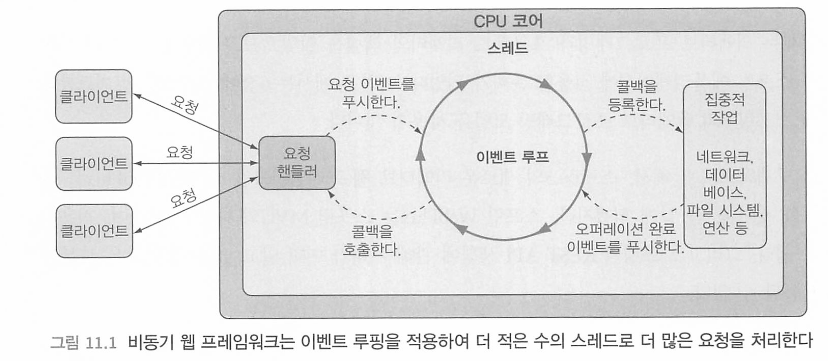
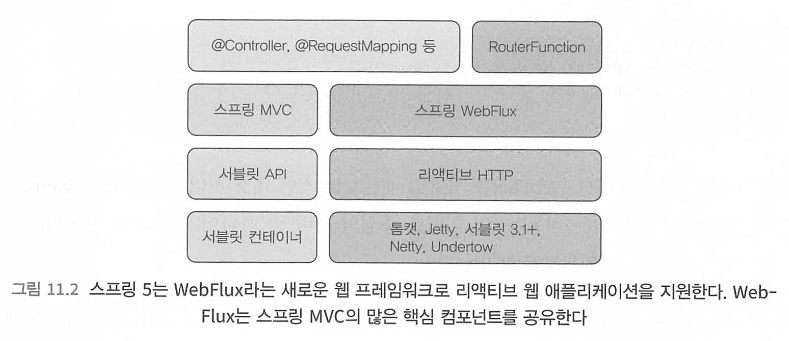
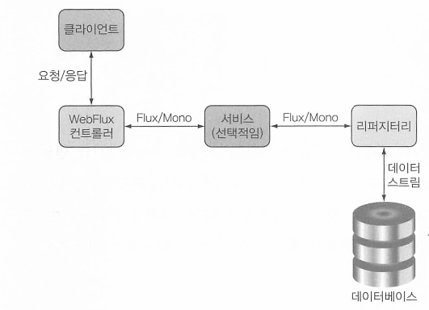

# 리액티브 API With WebFlux

[toc]


# 이벤트 루프

비동기 웹 프레임워크는 더 적은 수의 스레드(일반적으로 CPU 코어당 하나)로 더 높은 확장성을 성취한다. 

이벤트 루핑event looping이라는 기법을 적용한 이런 프레임 워크는 한 스레드당 많은 요청을 처리할 수 있어서 한 연결당 소요 비용이 더 경제적이다.



이벤트 루프에서는 모든 것이 이벤트로 처리된다.

비용이 드는 작업을 작업의 callback을 등록하여 병행으로 수행되게 하고 다른 이벤트 처리로 넘어간다.

# Spring WebFlux



WebFlux는 서블릿과 연계되지 않으며 리액티브 HTTP의 상위 계층에 존재한다.

서블릿이 필요 없다.

```java
implementation 'org.springframework.boot:spring-boot-starter-webflux'
```

웹 내장 서버는 Netty가 된다.

또한 컨트롤러 메서드는 Mono나 Flux 같은 타입을 인자로 받거나 반환한다 



또한 리액티브 웹 프레임워크의 장점을 극대화 하려면 end-to-end 리액티브 스택이여야 한다.


# Webflux 함수형 모델

스프링의 함수형 프로그래밍 모델을 사용한 API의 작성에는 다음 네 가지 기본 타입이 수반된다.

- RequestPredicate: 처리될 요청의 종류를 선언한다.
- Router Function: 일치하는 요청이 어떻게 핸들러에게 전달되어야 하는지를 선언한다.
- ServerRequest: HTTP 요청을 나타내며, 헤더와 몸체 정보를 사용할 수 있다.
- ServerResponse: HTTP 응답을 나타내며, 헤더와 몸체 정보를 포함한다.


# 리액티브 컨트롤러 테스트하기

```java

class DesignTacoControllerTest {

  @Test
  void shouldReturnRecentTacos() {
    Taco[] tacos = {
        testTaco(1L), testTaco(2L),
        testTaco(3L), testTaco(4L),
        testTaco(5L), testTaco(6L),
        testTaco(7L), testTaco(8L),
        testTaco(9L), testTaco(10L),
        testTaco(11L), testTaco(12L),
        testTaco(13L), testTaco(14L),
        testTaco(15L), testTaco(16L)};
    
    Flux<Taco> tacoFlux = Flux.just(tacos);
    
    TacoRepository tacoRepo = Mockito.mock(TacoRepository.class);
    when(tacoRepo.findAll()).thenReturn(tacoFlux);
    
    WebTestClient testClient = WebTestClient.bindToController(
        new DesignTacoController(tacoRepo))
        .build(); // TestClient 생성
    
    var result = testClient.get().uri("/design/recent")
      .exchange()
      .expectStatus().isOk()
      .expectBody()
        .jsonPath("$").isArray()
        .jsonPath("$").isNotEmpty()
        .jsonPath("$[0].id").isEqualTo(tacos[0].getId().toString())
        .jsonPath("$[0].name").isEqualTo("Taco 1")
        .jsonPath("$[1].id").isEqualTo(tacos[1].getId().toString())
        .jsonPath("$[1].name").isEqualTo("Taco 2")
        .jsonPath("$[11].id").isEqualTo(tacos[11].getId().toString())
        .jsonPath("$[11].name").isEqualTo("Taco 12")
        .jsonPath("$[12]").doesNotExist();

    System.out.println(new String(result.getResponseBody(), StandardCharsets.UTF_8));
  }
  
  @Test
  public void shouldSaveATaco() {
    TacoRepository tacoRepo = Mockito.mock(
                TacoRepository.class);
    Mono<Taco> unsavedTacoMono = Mono.just(testTaco(null));
    Taco savedTaco = testTaco(null);
    Mono<Taco> savedTacoMono = Mono.just(savedTaco);
    
    when(tacoRepo.save(any())).thenReturn(savedTacoMono);
    
    WebTestClient testClient = WebTestClient.bindToController(
        new DesignTacoController(tacoRepo)).build();
    
    testClient.post()
        .uri("/design")
        .contentType(MediaType.APPLICATION_JSON)
        .body(unsavedTacoMono, Taco.class)
      .exchange()
      .expectStatus().isCreated()
      .expectBody(Taco.class)
        .isEqualTo(savedTaco);
  }
  
  private Taco testTaco(Long number) {
    Taco taco = new Taco();
    taco.setId(number != null ? number.toString(): "TESTID");
    taco.setName("Taco " + number);
    List<Ingredient> ingredients = new ArrayList<>();
    ingredients.add(
        new Ingredient("INGA", "Ingredient A", Ingredient.Type.WRAP));
    ingredients.add(
        new Ingredient("INGB", "Ingredient B", Ingredient.Type.PROTEIN));
    taco.setIngredients(ingredients);
    return taco;
  }
  
}

```


## 실행중인 서버로 테스트하기 - 통합테스트

```java
@SpringBootTest(webEnvironment = SpringBootTest.WebEnvironment.RANDOM_PORT)
@AutoConfigureWebTestClient
public class DesignTacoControllerWebTest {

  @Autowired
  private WebTestClient testClient;

  @Test
  void shouldReturnRecentTacos() throws IOException {
    testClient.get().uri("/design/recent")
              .accept(MediaType.APPLICATION_JSON).exchange()
              .expectStatus().isOk()
              .expectBody()
              .jsonPath("$[?(@.id == 'TACO1')].name")
              .isEqualTo("Carnivore")
              .jsonPath("$[?(@.id == 'TACO2')].name")
              .isEqualTo("Bovine Bounty")
              .jsonPath("$[?(@.id == 'TACO3')].name")
              .isEqualTo("Veg-Out");
  }
}
```

