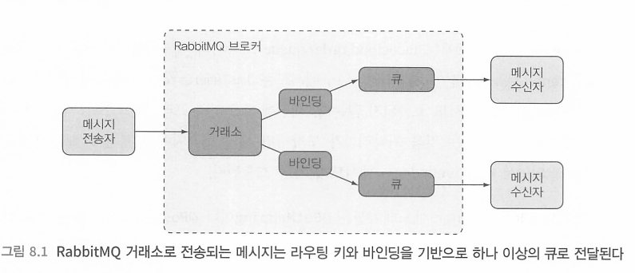
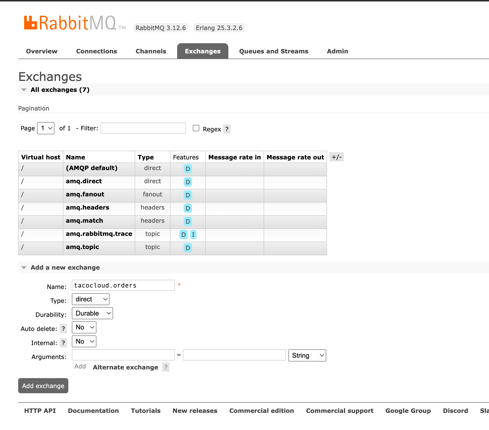
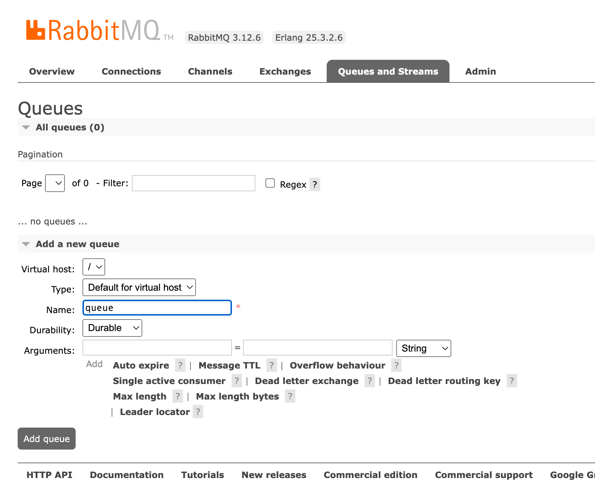
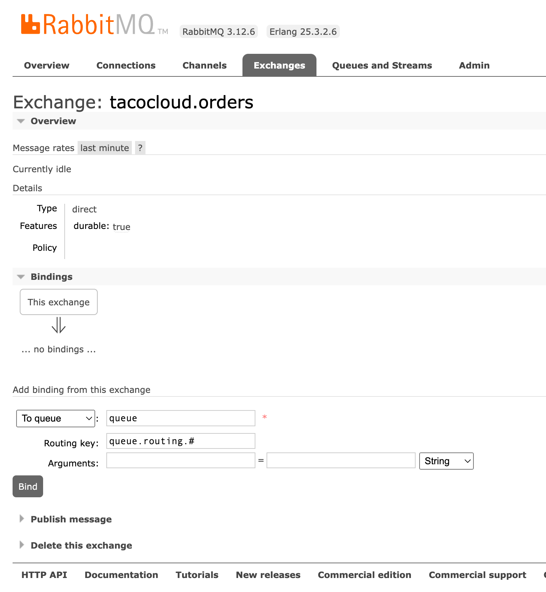
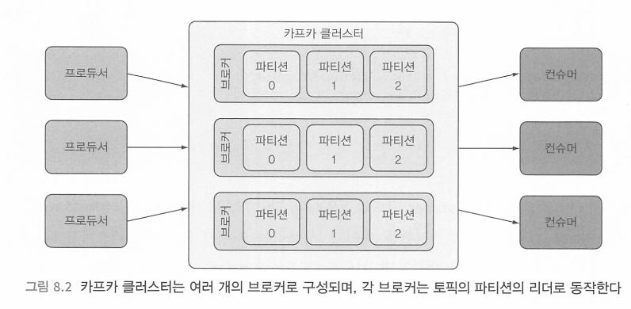

# 비동기 메시징

[toc]


비동기 메시징은 JMS를 이용해서 RabbitMQ, AMQP Kafka를 사용할 수 있다.


# JMS로 메시지 전송하기

JMS는 두 개 이상의 클라이언트간 메시지 통신을 위한 공통 API를 정의하는 자바 표준이다

공통 인터페이스이다.

스프링은 JmsTemplate이라는 템플릿 기반의 클래스를 통해 JMS를 지원하며,

JmsTemplate을 사용하면 Producer가 큐와 topic에 메시지를 전송하고 Consumer는 그 메시지들을 받을 수 있다.


# JMS 설정 - ActiveMQ

```groovy
implementation 'org.springframework.boot:spring-boot-starter-activemq'
implementation 'org.springframework.boot:spring-boot-starter-amqp'
implementation 'org.springframework.boot:spring-boot-starter-artemis:3.1.0'
testImplementation 'org.springframework.amqp:spring-rabbit-test'
```

Artemis는 ActiveMQ를 새롭게 다시 구현한 차세대 브로커다

* https://activemq.apache.org/components/artemis/documentation/latest/

docker-compose

```yaml
version: '3'

services:
  artemis:
    container_name: artemis
    image: kim206gh/apache-artemis:2.17.0
    ports:
      - "8161:8161" # Web Console
      - "61616:61616" # Default port for JMS
    environment:
      - ARTEMIS_USER=artemis
      - ARTEMIS_PASSWORD=artemis
      - AMQ_EXTRA_ARGS="--nio --host 0.0.0.0 --http-host 0.0.0.0 --relax-jolokia"

```

```
$  docker-compose -f docker-compose-activemq.yml up -d
```


## ARM64 - M1 ActiveMQ Artenis 도커 세팅방법

* https://www.dontesta.it/en/2021/02/15/activemq-artemis-easy-docker-creation-also-for-arm/

* https://hub.docker.com/layers/amusarra/apache-artemis/2.17.0/images/sha256-5fd82b36e24a390d68f24c63ff8e2690796f6bf20b7d495fe0027faea3df043a?context=explore


로컬호스트 설정!!!!!!!!!!!!!!!!

```yaml
spring:
  artemis:
    mode: native # native mode for embedded broker
    user: admin
    password: admin
    broker-url: tcp://localhost:61616
  jms:
    template:
      default-destination: tacoclud.order.queue

```


## JmsTemplate을 사용하여 전송

JmsTemplate은 스프링 JMS 통합 지원의 핵심이다. . JmsTemplate 은 실제로 우리가 원하는 일, 즉 '메시지 전송'에만 집중할 수 있게 해준다.

```java
import javax.jms.Destination;
import javax.jms.Message;

public class JmsTemplateExample {

    /**
     * 기본 목적지로 메시지 보내기.
     * @param messageCreator 메시지 생성 콜백
    public void send(MessageCreator messageCreator) { 
        // 구현 내용
    }
    
    /**
     * 지정한 목적지로 메시지 보내기.
     * @param destination 메시지를 보낼 목적지
     * @param messageCreator 메시지 생성 콜백
     */
    public void send(Destination destination, MessageCreator messageCreator) { 
        // 구현 내용
    }
    
    /**
     * 이름을 기반으로 목적지로 메시지 보내기.
     * @param destinationName 메시지를 보낼 목적지 이름
     * @param messageCreator 메시지 생성 콜백
     */
    public void send(String destinationName, MessageCreator messageCreator) { 
        // 구현 내용
    }

    /**
     * 기본 목적지에서 메시지 받기.
     *
     * @return 받은 메시지. 없으면 null 반환
     */
    public Message receive() {
        // 구현 내용
        return null;
    }

    /**
     * 지정한 목적지에서 메시지 받기.
     * @param destination 메시지를 받을 목적지
     * @return 받은 메시지. 없으면 null 반환
     */
    public Message receive(Destination destination) { 
        // 구현 내용
        return null;
    }

    /**
     * 이름을 기반으로 목적지에서 메시지 받기.
     * @param destinationName 메시지를 받을 목적지 이름
     * @return 받은 메시지. 없으면 null 반환
     */
    public Message receive(String destinationName) { 
        // 구현 내용
        return null;
    }

}
```


### JMS 메시지 전송

```java
@Service
@RequiredArgsConstructor
public class JmsOrderMessagingService implements OrderMessagingService {

	private final JmsTemplate jms;

	@Override
	public void sendOrder(Order order) {
		jms.convertAndSend("tacocloud.order.queue", order,
			this::addOrderSource);
	}

	private Message addOrderSource(Message message) throws JMSException {
		message.setStringProperty("X_ORDER_SOURCE", "WEB");
		return message;
	}

}
```

* tacocloud.order.queue는 도착할 queue이름이다. 

만약 default queue를 지정하려면

```yaml
spring:
  jms:
    template:
      default-destination: tacoclud.order.queue

```

```java
import org.apache.activemq.artemis.jms.client.ActiveMQQueue;

@Configuration
public class QueueConfig {

	@Bean("tacoQueue")
	public Destination orderQueue() {
		return new ActiveMQQueue("tacocloud.order.queue");
	}
	
}
```

* 주의! artemis 패키지의 클래스다

이 Destination 빈이 JmsorderMessagingservice에 주입되면 send()를 호출할 때 이 빈을 사용하여 메시지 도착지를 지정할 수 있다.

```java
@Service
public class JmsOrderMessagingService implements OrderMessagingService {

	private final JmsTemplate jms;

	private final Destination orderQueue;

	public JmsOrderMessagingService(JmsTemplate jms,
		@Qualifier("tacoQueue") Destination destination) {
		this.jms = jms;
		this.orderQueue = destination;
	}

	@Override
	public void sendOrder(Order order) {
		jms.send(orderQueue, session -> session.createObjectMessage(order));
	}

}
```

### 메시지 변환 후 전송 - 메시지 변환기

```java
package org.springframework.jms.support.converter;


public interface MessageConverter {

  Message toMessage(Object object, Session session) throws JMSException, MessageConversionException;

	Object fromMessage(Message message) throws JMSException, MessageConversionException;

}

```

유연성을 높이기 위해 메시지 변환기의 setTypeIdMappings()를 호출하여 실제 타 입에 임의의 타입 이름을 매핑시킬 수 있다. 예를 들어, 다음 코드에서는 order 클래스를 order라는 타입 ID로 매핑하도록 메시지 변환기 빈을 변경한다.

```java

//패키지 주의
import org.springframework.jms.support.converter.MappingJackson2MessageConverter;

@Configuration
public class QueueConfig {

	@Bean("tacoQueue")
	public Destination orderQueue() {
		return new ActiveMQQueue("tacocloud.order.queue");
	}

	@Bean
	public MappingJackson2MessageConverter messageConverter() {
		MappingJackson2MessageConverter messageConverter =
			new MappingJackson2MessageConverter();
		messageConverter.setTypeIdPropertyName("_typeId");

		Map<String, Class<?>> typeIdMappings = new HashMap<>();
		
		typeIdMappings.put("order", Order.class);
		
		messageConverter.setTypeIdMappings(typeIdMappings);

		return messageConverter;
	}

}
```

이 경우 해당 메시지의_typeId 속성에 전송되는 클래스 이름(패키지 전체 경로가 포함된) 대신 order 값이 전송된다. 

해당 메시지를 수신하는 애플리케이션에는 이와 유사한 메시지 변 환기가 구성되어 있을 것이므로 order를 자신이 알고 있는 주문 데이터로 매핑하면 된다. 따라서 주문 데이터가 다른 패키지에 다른 클래스 이름으로 구현될 수 있다.


# JMS 메시지 수신하기

메시지를 수신하는 방식에는 두 가지가 있다. 

우리 코드에서 메시지를 요청하고 도착할 때까지 기다리는 풀 모델과 

메시지가 수신 가능하게 되면 우리 코드로 자동 전달하는 푸시 모델이다.


JmsTemplate은 메시지를 수신하는 여러 개의 메서드를 제공하지만, 모든 메서드가 풀 모델 을 사용한다. 

따라서 이 메서드 중 하나를 호출하여 메시지를 요청하면 스레드에서 메시지를 수신할 수 있을 때까지 기다린다(바로 수신될 수도 있고 또는 약간 시간이 걸릴 수도 있다).

이와는 달리 푸시 모델올 사용할 수도 있으며, 이때는 언제든 메시지가 수신 가능할 때 자동 호출되는 메시지 리스너를 정의한다.

풀, 푸시 두 가지를 알아보자.


## JmsTemplate을 사용해서 수신하기

```java
import javax.jms.Destination;
import javax.jms.Message;
import org.springframework.jms.JmsException;

public class JmsTemplate {

    // 메시지를 수신합니다.
    public Message receive() throws JmsException;

    // 지정된 대상에서 메시지를 수신합니다.
    public Message receive(Destination destination) throws JmsException;

    // 지정된 대상 이름에서 메시지를 수신합니다.
    public Message receive(String destinationName) throws JmsException;

    // 메시지를 수신하고 객체로 변환합니다.
    public Object receiveAndConvert() throws JmsException;

    // 지정된 대상에서 메시지를 수신하고 객체로 변환합니다.
    public Object receiveAndConvert(Destination destination) throws JmsException;

    // 지정된 대상 이름에서 메시지를 수신하고 객체로 변환합니다.
    public Object receiveAndConvert(String destinationName) throws JmsException;
}
```

수신

```java
@Component
@RequiredArgsConstructor
public class JmsOrderReceiver implements OrderReceiver {
	
	private final JmsTemplate jms;
	
	private final MessageConverter messageConverter;
	
	@Override
	public Order receiveOrder() {
		final var receive = jms.receive("tacocloud.order.queue");

		try {
			return (Order)messageConverter.fromMessage(receive);
		} catch (JMSException e) {
			throw new RuntimeException(e);
		}
	}
	
}
```

## JmsListener를 이용해서 수신하기

```java
@Component
@RequiredArgsConstructor
public class OrderListener {

	private final KitchenUI ui;

	@JmsListener(destination = "taco.queue")
	public void receiveOrder(Order order) {
		ui.displayOrder(order);
	}

	@JmsListener(destination = "myqueue")
	public void receive(String string) {
		System.out.println(LocalDateTime.now());
		System.out.println("message : " + string);
	}

}
```

이 메서드는 JmsTemplate을 사용하지 않으며, 우 리 애플리케이션 코드에서도 호출되지 않는다. 대신에 스프링의 프레임워크 코드가 특정 도 착지에 메시지가 도착하는 것을 기다리다가 도착하면 해당 메시지에 적재된 order 객체가 인자로 전달되면서 receiveorder() 메서드가 자동 호출된다.

@JmsListener 애노테이션은 @GetMapping 같은 스프링  MVC와 유사하게 eJmsListener가 지정된 메서드들은 지정된 도착지에 들어오는 메시지에 반응한다.


그러나 JMS는 몇 가지 단점이 있으며, 그중에서 가장 중요한 것은 JMS가 자바 명세이므로 자바 애플리케이션에서만 사용할 수 있다는 것이다. RabbitMQ와 카프카 같은 더 새로운 메시징 시스템은 이런 단점을 해결하여 다른 언어와 JVM 외의 다른 플랫폼에서 사용할 수 있다

## Jms ErrorHAndling

https://memorynotfound.com/spring-jms-error-handling-configuration-example/

# RabbitMQ와 AMQP 사용하기

JMS 메시지가 수신자가 가져갈 메시지 도착지의 이름을 주소로 사용하는 반면, AMQP 메시지는 수신자가 리스닝하는 큐와 분리된 거래소exchange 이름과 라우팅 키 를 주소로 사용한다.

* exchange: 교환, 교환기, 거래소



메시지가 RabbitMQ 브로커에 도착하면 주소로 지정된 거래소에 들어간다. 

거래소는 하나 이상의 큐에 메시지를 전달할 책임이 있다. 

이때 거래소 타입, 거래소와 큐 간의 바인딩, 메시지의 라우팅 키 값을 기반으로 처리한다.

- 기본(Default): 브로커가 자동으로 생성하는 특별한 거래소. 해당 메시지의 라우팅 키와 이름이 같은 큐로 메시지를 전달한다. 모든 큐는 자동으로 기본 거래소와 연결된다.
- 디렉트 (Direct): 바인딩 키가 해당 메시지의 라우팅 키와 같은 큐에 메시지를 전달한다.

- 토픽(Topic): 바인딩 키(와일드카드를 포함하는)가 해당 메시지의 라우팅 키와 일치하는 하나 이상의 큐에 메시지를 전달한다.
- 팬아웃(Fanout): 바인딩 키나 라우팅 키에 상관없이 모든 연결된 큐에 메시지를 전달한다.
- 헤더(Header): 토픽 거래소와 유사하며, 라우팅 키 대신 메시지 헤더 값을 기반으로 한다 는 것만 다르다.
- 데드 레터(Dead letter): 전달 불가능한 즉, 정의된 어떤 거래소-큐 바인딩과도 일치하지 않 는 모든 메시지를 보관하는 잡동사니 거래소다.

거래소의 가장 간단한 형태는 기본 거래소와 팬아웃 거래소이며, 이것들은 IMS의 큐 및 토픽과 거의 일치한다. 

그러나 다른 거래소들을 사용하면 더 유연한 라우팅 스킴을 정의할 수 있다.

`메시지는 라우팅 키를 갖고 거래소로 전달되고 큐에서 읽혀져 소비`된다는 것을 이해하는 것 이 가장 중요하다. 

메시지는 바인딩 정의를 기반으로 거래소로부터 큐로 전달된다.

## RABBITMQ 스타터

```groovy
implementation 'org.springframework.boot:spring-boot-starter-amqp'
```

* AMQP 스타터를 빌드에 추가하면 다른 지원 컴포넌트는 물론이고 AMQP 연결 팩 토리와 RabbitTempLate 빈을 생성하는 자동 구성이 수행된다

표 8.4 RabbitMQ 브로커의 위치와 인증 정보를 구성하는 속성

| 속성                        | 설명                                             |
| --------------------------- | ------------------------------------------------ |
| `spring.rabbitmq.addresses` | 쉼표로 구분된 리스트 형태의 RabbitMQ 브로커 주소 |
| `spring.rabbitmq.host`      | 브로커의 호스트 (기본값: `localhost`)            |
| `spring.rabbitmq.port`      | 브로커의 포트 (기본값: `5672`)                   |
| `spring.rabbitmq.username`  | 브로커를 사용하기 위한 사용자 이름 (선택 속성)   |
| `spring.rabbitmq.password`  | 브로커를 사용하기 위한 사용자 암호 (선택 속성)   |

```yaml
spring:
  rabbitmq:
    addresses: broker1.example.com, broker2.example.com
    host: localhost
    port: 5672
    username: yourUsername
    password: yourPassword
```

### RabbitMQ Docker Compose

* https://hub.docker.com/_/rabbitmq/tags?page=1

```yaml
version: '3.7'  # 사용하는 Docker Compose 버전

services:  # 여기에는 실행하려는 서비스들을 정의
  rabbitmq:  # 서비스 이름. 이 이름으로 컨테이너에 접근 가능
    image: rabbitmq:3-management-alpine  # 사용할 이미지. management 태그는 관리 UI가 포함된 RabbitMQ 이미지
    container_name: rabbitmq
    ports:
      - "15672:15672"  # 관리 UI 포트. 브라우저에서 http://localhost:15672/ 로 접속해서 RabbitMQ 관리 UI 확인 가능
      - "5672:5672"   # 기본 AMQP 프로토콜 포트. 애플리케이션은 이 포트를 통해 RabbitMQ에 접속
    volumes:
      - ./.docker/rabbitmq/etc/:/etc/rabbitmq/
      - ./.docker/rabbitmq/data/:/var/lib/rabbitmq/
      - ./.docker/rabbitmq/logs/:/var/log/rabbitmq/
    environment:  # 환경 변수 설정
      RABBITMQ_DEFAULT_USER: user  # RabbitMQ 로그인 사용자 이름
      RABBITMQ_DEFAULT_PASS: password  # RabbitMQ 로그인 비밀번호
      RABBITMQ_ERLANG_COOKIE: "RabbitMQ-My-Cookies"


```

> http://localhost:15672/

```bash
$ docker-compose up -d rabbitmq
```


rabbitmq 이미지중에 `3-management-alpine` 버전을 선택하겠다는 의미이다. `3-management-alpine` 버전은 두가지 특징이 있다

- `management` : 관리자 UI를 사용할 수 있게 해주는 `management plugin`이 설치되어 있는 이미지이다. 기본 관리자 **username**/**passwd** 는 **guest**/**guest** 이다
- `alpine` : 경량 리눅스 배포판 이미지, 사용하는 이유는 [링크](https://nickjanetakis.com/blog/the-3-biggest-wins-when-using-alpine-as-a-base-docker-image)에 자세히 설명되어 있다.
- `RABBITMQ_ERLANG_COOKIE` : RabbitMQ 클러스터를 구성할 때 노드끼리 동일하게 맞춰줘야 하는 값
  - 노드 간 인증을 위한 수단으로 쿠키를 사용한다.
  - 클러스터 내 각 노드가 동일한 쿠키 값을 가지고 있다면 인증된 노드로 판단하는 식입니다.
- `RABBITMQ_DEFAULT_USER` : management UI 에서 로그인 username
- `RABBITMQ_DEFAULT_PASS` : management UI 에서 로그인 password

* `./.docker/rabbitmq/etc/rabbitmq.conf:/etc/rabbitmq/rabbitmq.conf` : RabbitMQ [configuration](https://www.rabbitmq.com/configure.html#config-file) 파일을 설정하기 위함
* `./.docker/rabbitmq/data/:/var/lib/rabbitmq/` : RabbitMQ 데이터에 접근하기 위함
* `./.docker/rabbitmq/logs/:/var/log/rabbitmq/` : RabbitMQ 로그에 접근하기 위함

#### 추가 계정 설정

- 사용자 및 패스워드 추가

```
  $ rabbitmqctl add_user rabbitmq password
```

- `Administrator` 설정

```
  $ rabbitmqctl set_user_tags rabbitmq administrator
```

- 사용자 및 패스워드 추가

```
  $ rabbitmqctl add_user rabbitmq password
```

- `Administrator` 설정

```
  $ rabbitmqctl set_user_tags rabbitmq administrator
```

### Queue 생성

* https://velog.io/@power0080/Message-QueueRabbitMQ%EB%A5%BC-%EC%82%AC%EC%9A%A9%ED%95%B4-%EB%A9%94%EC%84%B8%EC%A7%80-%EC%A3%BC%EA%B3%A0-%EB%B0%9B%EA%B8%B0*

http://localhost:15672/#/exchanges에 접속하여 로그인

exchange생성



http://localhost:15672/#/queues에 접속하여 Queues` 탭을 선택한 후 `Add a new queue` 토글을 클릭합니다. 이후 Name을 지정하고 `Add queue` 를 클릭하면 됩니다.



다음 exchange와 queue를 바인딩

http://localhost:15672/#/exchanges에 접속하여 생성한 exechange를 클릭 후 



생성했던 지정한 queue를 입력

생성한 큐로 메시지 보내면 된다.

```java
  public void sendOrder(Order order) {
    rabbit.convertAndSend("queue", order, // 생성한 큐 라우팅 키 
        message -> {
          MessageProperties props = message.getMessageProperties();
          props.setHeader("X_ORDER_SOURCE", "WEB");
          return message;
        });
  }
 
```


>  보다 상세한 설정은 코드 레벨에서 queue와 exchange를 설정해주는 것이 좋다고 생각합니다. 코드 레벨에서 생성해줄 경우, 맨처음 rabbitMQ에서 선언한 exchange와 queue가 없다면 생성해주고, 이미 있다면 해당 exchage와 queue를 바라보도록 처리합니다

## RabbitTemplate을 사용해서 메시지 전송하기

RabbitTemplate을 사용한 메시지 전송의 경우에 send()와 convertAndSend() 메서드는 같은 이름의 JmsTemplate 메서드와 유사하다. 그러나 지정된 큐나 토픽에만 메시지를 전송한다.

```java

package org.springframework.amqp.rabbit.core;

import org.springframework.amqp.AmqpException;
import org.springframework.amqp.core.Message;
import org.springframework.amqp.core.MessagePostProcessor;

public class RabbitTemplate {

    // 원시 메시지를 전송한다.
    public void send(Message message) throws AmqpException {}

    public void send(String routingKey, Message message) throws AmqpException {}

    public void send(String exchange, String routingKey, Message message) throws AmqpException {}

    // 객체로부터 변환된 메시지를 전송한다.
    public void convertAndSend(Object message) throws AmqpException {}

    public void convertAndSend(String routingKey, Object message) throws AmqpException {}

    public void convertAndSend(String exchange, String routingKey, Object message) throws AmqpException {}

    // 객체로부터 변환되고 후처리 (post-processing) 되는 메시지를 전송한다.
    public void convertAndSend(Object message, MessagePostProcessor mPP) throws AmqpException {}

    public void convertAndSend(String routingKey, Object message, MessagePostProcessor messagePostProcessor) throws AmqpException {}

    public void convertAndSend(String exchange, String routingKey, Object message, MessagePostProcessor messagePostProcessor) throws AmqpException {}
}

```

이 메서드들은 도착지 이름(또는 Destination 객체) 대신, exchange와 라우팅 키를 지정하는 문자열 값을 인자로 받는다는 점에서 JmsTemplate의 대응되는 메서드들과 다르다. 

exchange를 받지 않는 메서드들은 기본 exchange로 메시지를 전송한다.

```java
import org.springframework.amqp.core.MessageProperties;
import org.springframework.amqp.rabbit.core.RabbitTemplate;

@Service
public class RabbitOrderMessagingService
       implements OrderMessagingService {
  
  private RabbitTemplate rabbit;
  
  @Autowired
  public RabbitOrderMessagingService(RabbitTemplate rabbit) {
    this.rabbit = rabbit;
  }
  
  public void sendOrder(Order order) {
    rabbit.convertAndSend("tacocloud.order.queue", order,
        message -> {
          MessageProperties props = message.getMessageProperties();
          props.setHeader("X_ORDER_SOURCE", "WEB");
          return message;
        });
  }
  
}
```

기본 거래소 이름은 빈 문자열인 ""이며, 이것은 RabbitMQ 브로커가 자동으로 생성하는 기 본 거래소와 일치한다.

 이와 동일하게 기본 라우팅 키도 ""이다

이런 기본값은 spring.rabbitma.template.exchange와 spring.rabbitma.

template.rout ing-key 속성을 설정하여 변경할 수 있다.

```yaml
spring:
	rabbitmq: 
		template:
			exchange: tacocloud.orders 
			routing-key: kitchens.central
```

### RabbitMQ 메시지 변환기

기본적으로 메시지 변환은 SimplenessageConverter로 수행되며, 이것은 string과 같은 간단한 타입과 Seriarizable 객체를 Message 객체로 변환할 수 있다. 그러나 스프링은 다 음을 포함해서 RabbitTemplate에 사용할 수 있는 여러 개의 메시지 변환기를 제공한다.

- **Jackson2MessageConverter**: Jackson2 JSONProcessor를 사용하여 객체를 JSON으로 상호 변환한다.
- **MarshallingMessageConverter**: 스프링의 Marshaller와 Unmarshaller를 사용하여 변환한다.
- **SerializerMessageConverter**: 스프링의 Serializer와 Deserializer를 사용하여 String과 객체를 변환한다.
- **SimpleMessageConverter**: String, byte 배열, Serializable 타입을 변환한다.
- **ContentTypeDelegatingMessageConverter**: `contentType` 헤더를 기반으로 다른 메시지 변환기에 변환을 위임한다.

메시지 변환기를 변경해야 할 때는 MessageConverter 타입의 빈을 구성하면 된다.

 예를 들어, JSON 기반 메시지 변환의 경우는 다음과 같이 Jackson2 JsonMessageConverter를 구성하면 된다.

```java
@Bean
public MessageConverter messageConverter () {
	return new Jackson2JsonMessageConverter ();
}
```

이렇게 하면 스프링 부트 자동 구성에서 이 빈을 찾아서 기본 메시지 변환기 대신 이 빈을 RabbitTemplate.으로 주입한다.

### 메시지 속성 설정하기

제출된 모든 주문의 X_ORDER_ SOURCE 속성을 설정해야 한다고 하자. 이때는 Message 객체를 생성할 때 메시지 변환기에 제공하는 Messageproper ties 인스턴스를 통해 헤더를 설정할 수 있다.

```java
public void sendOrder(Order order) {
    MessageConverter converter = rabbit.getMessageConverter();
    MessageProperties props = new MessageProperties();
    props.setHeader("X_ORDER_SOURCE", "WEB");
    Message message = converter.toMessage(order, props);
    rabbit.send("tacocloud.order", message);
}
```

// 사용시 `convertAndSend()`를 통해 MessageProperties를 적용하려면 MessagePostProcessor를 사용해야 합니다.
```java
@Override
public void sendOrder(Order order) {
    rabbit.convertAndSend("tacocloud.order.queue", order, new MessagePostProcessor() {
        @Override
        public Message postProcessMessage(Message message) throws AmqpException {
            MessageProperties props = message.getMessageProperties();
						props.setHeader ("X_ORDER_SOURCE", "WEB");
						return message;
        }
    });
}
```

## RabbitMQ로부터 메시지 수신하기

RabbitMQ 큐로부터의 메시지 수신도 JMS로부터의 메시 지 수신과 크게 다르지 않다.

JMS에서처럼 RabbitMQ의 경우도 다음 두 가지를 선택할 수 있다.

- RabbitTemplate을 사용해서 큐로부터 메시지를 가져온다.
- eRabbitlistener가 지정된 메서드로 메시지가 푸시push 된다.

### pull(풀) 모델 기반의 RabbitTemplate.receive()

```java
public class RabbitTemplate {

    // 메시지를 수신한다.
    public Message receive() throws AmqpException { /* ... */ }
    public Message receive(String queueName) throws AmqpException { /* ... */ }
    public Message receive(long timeoutMillis) throws AmqpException { /* ... */ }
    public Message receive(String queueName, long timeoutMillis) throws AmqpException { /* ... */ }

    // 메시지로부터 변환된 객체를 수신한다.
    public Object receiveAndConvert() throws AmqpException { /* ... */ }
    public Object receiveAndConvert(String queueName) throws AmqpException { /* ... */ }
    public Object receiveAndConvert(long timeoutMillis) throws AmqpException { /* ... */ }
    public Object receiveAndConvert(String queueName, long timeoutMillis) throws AmqpException { /* ... */ }

    // 메시지로부터 변환된 타입-안전(type-safe) 객체를 수신한다.
    public <T> T receiveAndConvert(ParameterizedTypeReference<T> type) throws AmqpException { /* ... */ }
    public <T> T receiveAndConvert(String queueName, ParameterizedTypeReference<T> type) throws AmqpException { /* ... */ }
    public <T> T receiveAndConvert(long timeoutMillis, ParameterizedTypeReference<T> type) throws AmqpException { /* ... */ }
    public <T> T receiveAndConvert(String queueName, long timeoutMillis, ParameterizedTypeReference<T> type) throws AmqpException { /* ... */ }

}
```

메서드 시그니처signature 특히 매개변수에서 분명한 차이가 있다. 

우선, 수신 메서드의 어느 것도 `exchange`나 `라우팅 키`를 매개변수로 갖지 않는다.

 왜냐하면 거래소와 라우팅 키 는 메시지를 큐로 전달하는 데 사용되지만. 일단 메시지가 큐에 들어가면 다음 메시지 도착 지는 큐로부터 메시지를 소비하는 컨슈머consumer이기 때문이다. 

따라서 `메시지를 소비하는 애플리케이션은 거래소 및 라우팅 키를 신경 쓸 필요가 없고 큐만 알면 된다.`

또한, 대부분의 수신 메서드는 메시지의 수신 타임아웃을 나타내기 위해 Long 타입의 매개 변수를 갖는다. 

수신 타임아웃의 기본값은 0밀리초(1/1.000초)다. 

즉, 호출된 즉시 recerive() 가 결과를 반환하며, 만일 수신할 수 있는 메시지가 없으면 null 값이 반환된다. 

또한 null이 반환되는 경우도 대비해야 한다.

* 이것이 JmsTemplate과의 차이점이다.

* `JmsTemplate`의 경우, `receive()` 메서드는 기본적으로 메시지가 도착할 때까지 블로킹되며 타임아웃 없이 대기할 수 있습니다.

  따라서 차이점은:

  - `RabbitTemplate`의 `receive()`는 기본적으로 블로킹 없이 즉시 반환합니다. 수신할 수 있는 메시지가 없으면 null을 반환합니다.
  - `JmsTemplate`의 `receive()`는 기본적으로 메시지가 도착할 때까지 블로킹됩니다.

```java
import org.springframework.amqp.rabbit.core.RabbitTemplate;
import org.springframework.amqp.support.converter.MessageConverter;

@Component
public class RabbitOrderReceiver implements OrderReceiver {

	private final RabbitTemplate rabbit;
	private final MessageConverter messageConverter;

	public RabbitOrderReceiver(RabbitTemplate rabbit) {
		this.rabbit = rabbit;
		this.messageConverter = rabbit.getMessageConverter();
	}

	public Order receiveOrder() {
		final var message = rabbit.receive("tacocloud.orders");

		return message != null ? (Order)messageConverter.fromMessage(message)
			: null;
	}

}
```

* 이때 타임아웃 값을 인자로 전달하지 않았으므로 곧바로 Message 객체 또는 null 값이 반환된 다.

다음과 같이 timeout을 지정할 수 있다.

```java
public Order receiveOrder() {
	final var message = rabbitTemplate.receive("tacocloud.orders", 30000);

	return message != null ? (Order)messageConverter.fromMessage(message)
		: null;
}
```

* 30000 밀리초는 30초동안 대기한다

자동으로 메시지를 변환해주고싶다면 receiveAndConvert메소드를 사용하면 된다

```java
@Component
public class RabbitOrderReceiver implements OrderReceiver {

  private RabbitTemplate rabbit;

  public Order receiveOrder() {
    return (Order) rabbit.receiveAndConvert("tacocloud.order.queue", 30000);
  }
  
}
```

타입 변환이 불편하면,  ParameterizedTypeReference로 지정할 수도 있다. 

```java
@Component
public class RabbitOrderReceiver implements OrderReceiver {

	private RabbitTemplate rabbit;

	public Order receiveOrder() {
		return rabbit.receiveAndConvert("tacocloud.order.queue", 30000,
			new ParameterizedTypeReference<Order>() {
			});
	}

}
```

* 단, receiveAndconvert()에 ParameterizedTypeReference를 사용하려면 메시지 변환기가 SmartMessageCorverter 인터페이스를 구현한 클래스(예를 들어Jackson2JsonMessageConver ter)이어야 한다.


### 리스너 기반 RabbitMQ 메시지 수신

메시지가 큐에 도착할 때 메서드가 자동 호출되도록 지정하기 위해서는 QRabbitListener 애노테이션을 RabbitMQ 빈의 메서 드에 지정해야 한다

```java
import org.springframework.amqp.rabbit.annotation.RabbitListener;
import org.springframework.beans.factory.annotation.Autowired;
import org.springframework.stereotype.Component;

@Component
public class OrderListener {
  
  private KitchenUI ui;

  @RabbitListener(queues = "tacocloud.order.queue")
  public void receiveOrder(Order order) {
    ui.displayOrder(order);
  }
  
}
```

다음과 같이 받을수도 있다.

```java
// 송신측
@Service
public class RabbitOrderMessagingService implements OrderMessagingService {
  
  private RabbitTemplate rabbit;
  
  public void sendOrder(Order order) {
    rabbit.convertAndSend("tacocloud.order.queue", order,
        message -> {
          MessageProperties props = message.getMessageProperties();
          props.setHeader("X_ORDER_SOURCE", "WEB");
          return message;
        });
  }
  
}

// 수신측
@Component
@RequiredArgsConstructor
public class OrderListener {
  
  private final KitchenUI ui;
  private final MessageConverter messageConverter;

  @RabbitListener(queues = "tacocloud.order.queue", ackMode = "NONE")
  public void receiveOrder(Message message) { // Order order

    final var order = (Order)messageConverter.fromMessage(message);

    System.out.println(message.getMessageProperties().toString());

    ui.displayOrder(order);
  }
  
}

```

MessageProperties의 결과는? 

```json
{
  "headers": {
    "X_ORDER_SOURCE": "WEB",
    "__TypeId__": "com.ys.practice.domain.Order"
  },
  "contentType": "application/json",
  "contentEncoding": "UTF-8",
  "contentLength": 0,
  "receivedDeliveryMode": "PERSISTENT",
  "priority": 0,
  "redelivered": false,
  "receivedExchange": "tacocloud.orders",
  "receivedRoutingKey": "tacocloud.order.queue",
  "deliveryTag": 1,
  "consumerTag": "amq.ctag-mfycWHiM-hRwtXFajuvcUg",
  "consumerQueue": "tacocloud.order.queue"
}

```

- **headers**: 메시지와 함께 전송되는 추가 헤더 정보입니다. 여기에는 원본 주문 소스와 객체의 타입 정보가 포함됩니다.
- **contentType**: 메시지 본문의 컨텐츠 유형을 나타냅니다. 여기서는 JSON 형식임을 나타냅니다.
- **contentEncoding**: 메시지 본문의 인코딩 방식을 나타냅니다.
- **receivedExchange**: 메시지가 수신된 교환기의 이름입니다.
- **receivedRoutingKey**: 메시지를 수신하는 데 사용된 라우팅 키입니다.
- **deliveryTag**: 메시지의 고유 번호 또는 태그입니다.
- **consumerTag**: 메시지를 수신하는 컨슈머의 태그입니다.
- **consumerQueue**: 메시지를 수신하는 큐의 이름입니다.

이 JSON 구조는 AMQP 메시지의 `MessageProperties`를 나타낸다

## RabbitMQ에서 SPOF (Single Point Of Failure)를 방지하고 아키텍처를 설계하기 위해 고려할 수 있는 몇 가지 방법

1. **클러스터링**:
   - RabbitMQ는 여러 노드로 구성된 클러스터를 지원합니다.
   - 메시지 큐와 교환기는 모든 노드에서 접근 가능하지만, 큐의 내용은 기본적으로 단일 노드에만 저장됩니다.
   - 클러스터 내의 노드는 서로의 상태를 모니터링하며, 노드 하나가 실패하면 다른 노드가 대신 메시지를 처리할 수 있습니다.
2. **미러링된 큐**:
   - 클러스터 내의 여러 노드에 큐의 내용을 복제하여 높은 가용성을 제공합니다.
   - 미러링된 큐는 클러스터 내의 한 노드가 실패할 경우 메시지 손실 없이 다른 노드에서 큐를 사용할 수 있게 해줍니다.
3. **로드 밸런서 사용**:
   - RabbitMQ 클러스터 앞에 로드 밸런서를 배치하여 연결 및 트래픽을 여러 RabbitMQ 노드로 분산시킬 수 있습니다.
   - 이는 전체 시스템의 처리량을 향상시키며, 단일 노드에 과부하가 걸리는 것을 방지합니다.
4. **디스크 및 메모리 알림**:
   - RabbitMQ는 디스크 공간이나 메모리 사용량이 특정 임계값을 초과하면 알림을 보내거나 퍼블리셔를 차단하는 기능을 제공합니다.
   - 이를 통해 자원 부족으로 인한 장애를 미리 예방할 수 있습니다.
5. **백업 및 복구 전략**:
   - 정기적으로 RabbitMQ의 설정, 메타데이터 및 메시지 데이터를 백업합니다.
   - 장애가 발생할 경우 백업에서 빠르게 복구할 수 있도록 전략을 마련합니다.
6. **모니터링 및 알림**:
   - RabbitMQ의 상태와 성능을 지속적으로 모니터링하며, 문제가 감지되면 즉시 알림을 받을 수 있는 시스템을 구축합니다.
7. **멀티 데이터 센터 배포**:
   - 지리적으로 분산된 여러 데이터 센터에 RabbitMQ 클러스터를 배포하여, 특정 위치의 장애나 문제에 대비할 수 있습니다.
8. **Shovel 및 Federation 플러그인**:
   - Shovel은 한 RabbitMQ 브로커에서 다른 브로커로 메시지를 안정적으로 전송합니다.
   - Federation은 브로커 간의 교환기와 큐를 연결하여 메시지를 전달합니다.


RabbitMQ에서 메시지는 주로 두 가지 영역에 저장됩니다: 메모리와 디스크.

1. **메모리**:
   - RabbitMQ는 성능 최적화를 위해 가능한 한 메시지를 메모리에 보관합니다.
   - 적극적인 메시지 소비가 이루어지면 대부분의 메시지는 메모리에서 처리되고 큐에서 삭제됩니다. 이를 통해 RabbitMQ는 빠른 메시지 전달 성능을 제공합니다.
2. **디스크**:
   - 특정 설정이나 상황에 따라 RabbitMQ는 메시지를 디스크에도 기록합니다. 이를 "퍼시스턴트 메시지"라고 부릅니다.
   - 메시지를 퍼시스턴트로 마크하면 (예: 메시지의 delivery_mode를 2로 설정), 메시지는 디스크에 저장되어 브로커나 시스템의 재시작 후에도 유지됩니다.
   - 또한, RabbitMQ는 메모리 부족 시 디스크를 백업 저장소로 사용하여 메시지를 스왑아웃할 수 있습니다.

디스크에 저장된 메시지는 기본적으로 RabbitMQ의 데이터 디렉토리 내 `mnesia`라는 데이터베이스 폴더 아래에 위치하게 됩니다. 이 위치는 RabbitMQ의 설치 및 구성에 따라 다를 수 있지만, 기본 데이터 디렉토리는 다음과 같습니다:

- **Linux**: `/var/lib/rabbitmq/mnesia/`
- **Windows**: `C:\Users\<username>\AppData\Roaming\RabbitMQ\db\mnesia\`

실제 디렉토리 위치는 `rabbitmqctl` 명령어나 RabbitMQ 관리 UI를 통해 확인할 수 있습니다.

항상 메시지 데이터의 백업과 복구 전략을 고려하며, 퍼시스턴트 메시지에 대한 디스크 I/O 오버헤드도 고려하여 메시지 전송 및 저장 전략을 설계해야 합니다.


## 추가 래빗엠큐 설정

https://happy-jjang-a.tistory.com/180

https://it-techtree.tistory.com/entry/messaging-with-rabbitMQ-in-springBoot

https://brunch.co.kr/@springboot/298


# 카프카 사용하기

아파치 카프카는 가장 새로운 메시징 시스템이며, ActiveMQ, Artemis, RabbitMQ와 유사 한 메시지 브로커다. 

그러나 카프카는 특유의 아키텍처를 갖고 있다.

카프카는 높은 확장성을 제공하는 클러스터custer로 실행되도록 설계되었다. 

그리고 클러스터의 모든 카프카 인스턴스에 걸처 토픽topic을 파티션parition으로 분할하여 메시지를 관리 한다. 

RabbitMQ가 exchange와 큐를 사용해서 메시지를 처리하는 반면, 카프카는 토픽만 사 용한다.



각 토픽은 여러 개의 파티션으로 분할될 수 있다. 이 경우 클러스터의 각 노드는 한 토픽의 하나 이상의 파티션(토픽 전체가 아닌)의 리더가 된다.

## 카프카 사용을 위한 스프링 설정

```groovy
implementation 'org.springframework.kafka:spring-kafka'
```

의존성을 추가하면 스프링 부트가 카프카 사용을 위한 자동-구성을 해준다

우리는 KafkaTemplate을 주입하고 메시지를 전송, 수신하면 된다.

카프카 프로퍼티 설정

```yaml
spring:

  kafka:
    bootstrap-servers: 
    - localhost:9092
    - localhost:9093
```

보다시피 복수형이라 여러 서버를 지정할 수 있다.


## KafkaTemplate을 사용해서 메시지 전송하기

```java
import org.springframework.kafka.core.KafkaTemplate;
import org.springframework.kafka.support.SendResult;
import org.springframework.messaging.Message;
import org.springframework.util.concurrent.ListenableFuture;

public class KafkaTemplate<K, V> {

    // 1. 주어진 토픽에 데이터를 보냅니다. 키는 사용되지 않습니다.
    ListenableFuture<SendResult<K, V>> send(String topic, V data);

    // 2. 주어진 토픽에 키와 함께 데이터를 보냅니다.
    ListenableFuture<SendResult<K, V>> send(String topic, K key, V data);

    // 3. 주어진 토픽의 특정 파티션에 키와 함께 데이터를 보냅니다.
    ListenableFuture<SendResult<K, V>> send(String topic, Integer partition, K key, V data);

    // 4. 주어진 토픽의 특정 파티션에 타임스탬프와 키를 함께 보냅니다.
    ListenableFuture<SendResult<K, V>> send(String topic, Integer partition, Long timestamp, K key, V data);

    // 5. 주어진 ProducerRecord 객체를 사용하여 메시지를 보냅니다.
    ListenableFuture<SendResult<K, V>> send(ProducerRecord<K, V> record);

    // 6. 주어진 Message 객체를 사용하여 메시지를 보냅니다.
    ListenableFuture<SendResult<K, V>> send(Message<?> message);

    // 7. 기본 토픽에 데이터를 보냅니다. 키는 사용되지 않습니다.
    ListenableFuture<SendResult<K, V>> sendDefault(V data);

    // 8. 기본 토픽에 키와 함께 데이터를 보냅니다.
    ListenableFuture<SendResult<K, V>> sendDefault(K key, V data);

    // 9. 기본 토픽의 특정 파티션에 키와 함께 데이터를 보냅니다.
    ListenableFuture<SendResult<K, V>> sendDefault(Integer partition, K key, V data);

    // 10. 기본 토픽의 특정 파티션에 타임스탬프와 키를 함께 보냅니다.
    ListenableFuture<SendResult<K, V>> sendDefault(Integer partition, Long timestamp, K key, V data);
}

```

제일 먼저 알아 둘 것은 convertAndsend() 메서드가 없다는 것이다. 왜냐하면 KafkaTemplate 은 제네력generic 타입을 사용하고, 메시지를 전송할 때 직접 도메인 타입을 처리할 수 있기 때문이다. 

따라서 모든 send() 메서드가 convertAndSend()의 기능을 갖고 있다고 생각할 수 있다.

카프카에서 메시지를 전송할 때는 메시지가 전송되는 방법을 알려주는 다음 매개 변수를 지정할 수 있다.

- 메시지가 전송될 토픽(send()에 필요함)
- 토픽 데이터를 쓰는 파티션(선택적임)
- 레코드 전송 키(선택적임)
- 타임스탬프(선택적이며, 기본값은 System.currentTimeniltis()
  - 타임스탬프(timestamp)는 데이터가 생성, 변경 또는 전송된 시점을 나타내기 위해 사용되는 시간값
  - 많은 시스템에서 타임스탬프는 이벤트 발생 시간을 추적하는 데 필요하며, 로깅, 데이터베이스 트랜잭션, 데이터 싱크(sync) 등 다양한 용도로 사용
  - Kafka의 레코드 타임스탬프는 두 가지 방식으로 활용될 수 있습니다:
    1. **CreateTime**: 이 모드는 프로듀서가 메시지를 생성할 때 타임스탬프를 설정합니다. 이것은 메시지가 실제로 언제 생성되었는지를 나타냅니다.
    2. **LogAppendTime**: 이 모드는 메시지가 브로커에 도착하고 로그에 추가될 때 브로커가 타임스탬프를 설정합니다. 이것은 메시지가 브로커에 언제 저장되었는지를 나타냅니다.
- 페이로드payload(메시지에 적재된 순수한 데이터(예를 들어, Order 객체)이며 필수임)

```java
import org.springframework.kafka.core.KafkaTemplate;

@Service
@RequiredArgsConstructor
public class KafkaOrderMessagingService implements OrderMessagingService {
  
  private final KafkaTemplate<String, Order> kafkaTemplate;

  @Override
  public void sendOrder(Order order) {
    kafkaTemplate.send("tacocloud.orders.topic", order);
  }
  
}
```

## 카프카 리스너 작성하기

스프링을 사용해서 카프카 토픽의 메시지를 가져오는 유일한 방법은 메시지 리 스너를 작성하는 것이다.

카프카의 경우 메시지 리스너는 @KafkaListener 애노테이션이 지정된 메서드에 정의된다.

```java
public class OrderListener {
  
  private final KitchenUI ui;

  @KafkaListener(topics="tacocloud.orders.topic")
  public void handle(Order order, ConsumerRecord<String, Order> record) {
    log.info("Received from partition {} with timestamp {}",
        record.partition(), record.timestamp());
    
    ui.displayOrder(order);
  }
}
```

* 메시지 페이로드는 ConsumerRecord.value()나 Message. getPayload()를 사용해도 받을 수 있다

이와 유사하게 ConsumerRecord 대신 Message 객체를 요청하여 같은 일을 처리할 수 있다.

```java
@KafkaListener(topics = "tacocloud.orders.topic")
public void handle(Order order, Message<Order> message) {
	MessageHeaders headers = message.getHeaders();
	log.info("Received from partition {} with timestamp {}",
		headers.get(KafkaHeaders.RECEIVED_PARTITION),
		headers.get(KafkaHeaders.RECEIVED_TIMESTAMP));
    
	ui.displayOrder(order);
	
```

* 메시지 페이로드는 ConsumerRecord.value()나 Message. getPayload()를 사용해도 받을 수 있다


