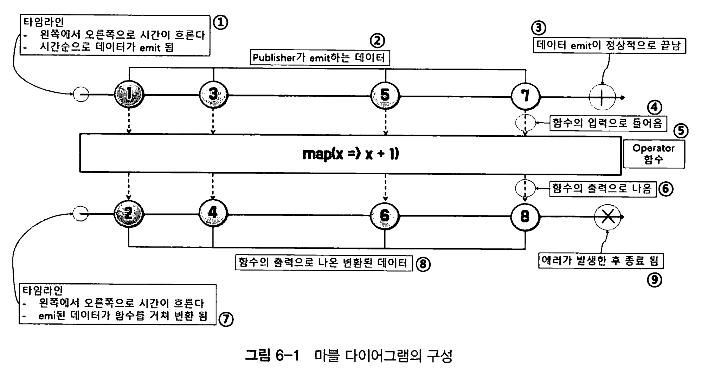
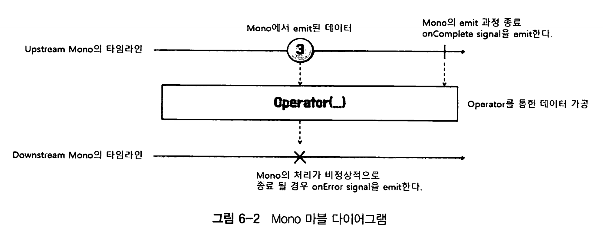
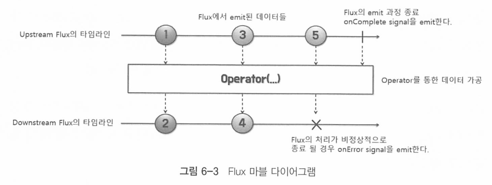
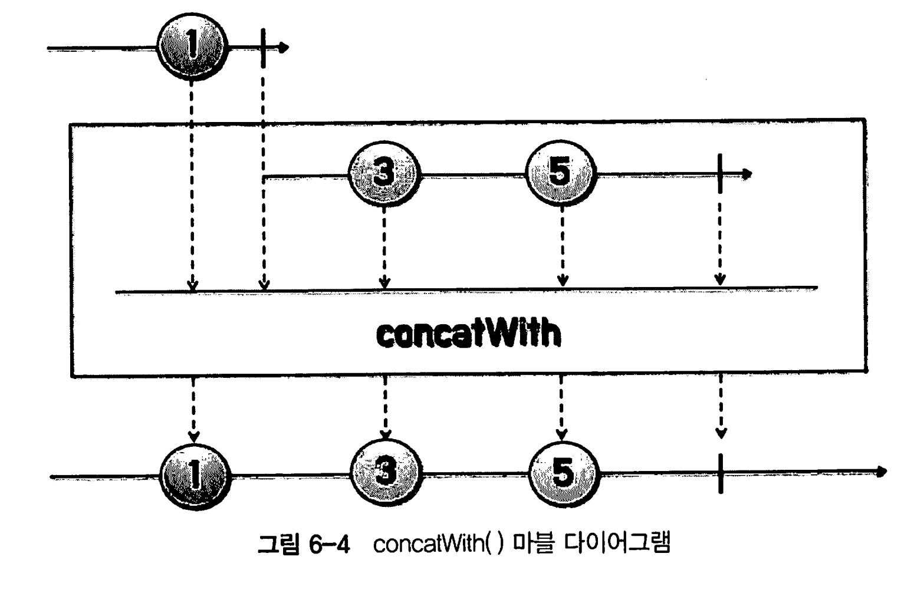
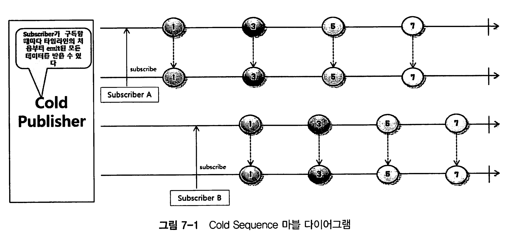
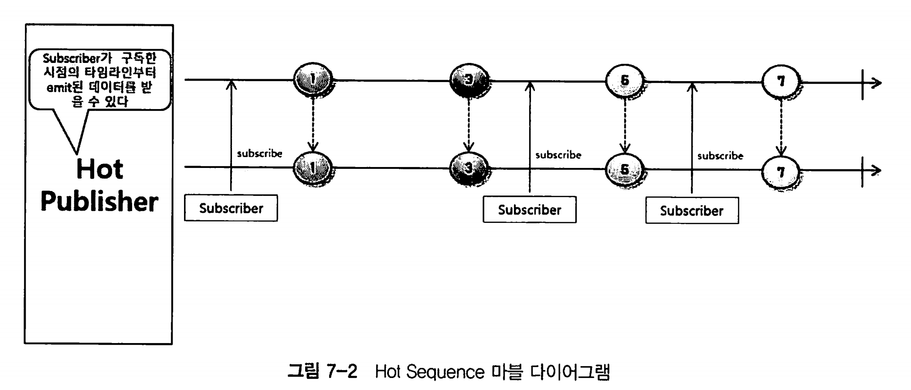
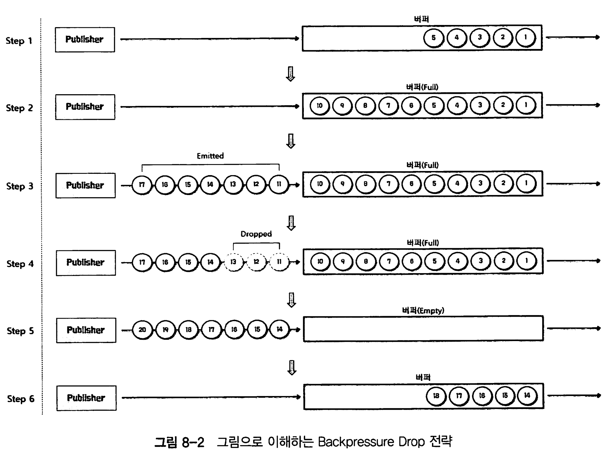
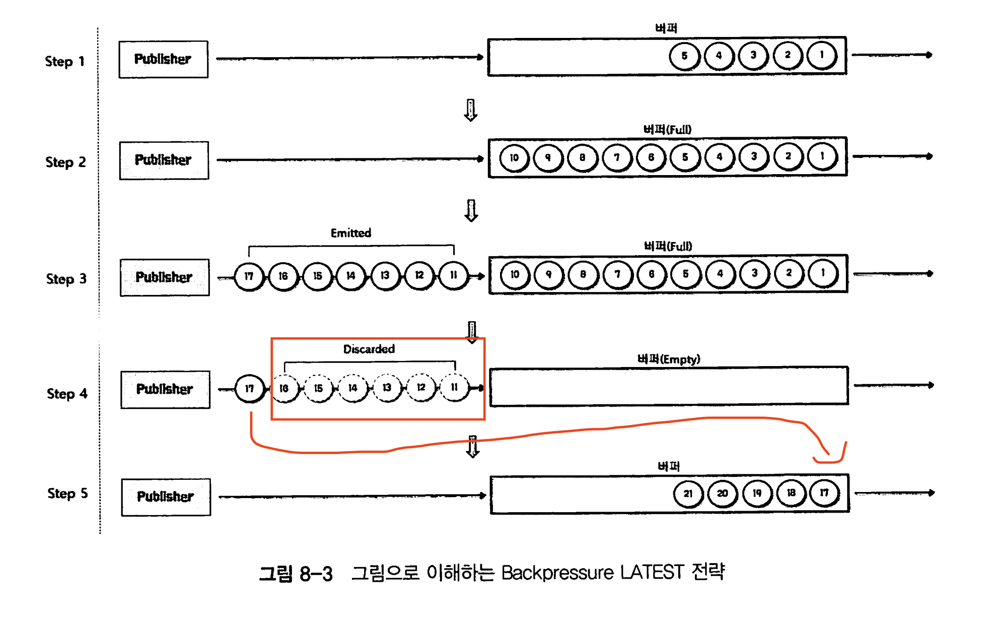

# 스프링으로 시작하는 리액티브 프로그래밍

https://github.com/bjpublic/Spring-Reactive

# 목차

- [Chapter 01 리액티브 시스템과 리액티브 프로그래밍](#chapter-01-리액티브-시스템과-리액티브-프로그래밍)
- [Chapter 02 리액티브 스트림즈(Reactive Streams)](#chapter-02-리액티브-스트림즈reactive-streams)
- [Chapter 03 Blocking I/O와 Non-Blocking I/O](#chapter-03-blocking-io와-non-blocking-io)
- [Chapter 04 리액티브 프로그래밍을 위한 사전 지식](#chapter-04-리액티브-프로그래밍을-위한-사전-지식)
- [Chapter 05 Reactor 개요](#chapter-05-reactor-개요)
- [Chapter 06 마블 다이어그램(Marble Diagram)](#chapter-06-마블-다이어그램marble-diagram)
- [Chapter 07 Cold Sequence와 Hot Sequence](#chapter-07-cold-sequence와-hot-sequence)
- [Chapter 08 Backpressure](#chapter-08-backpressure)
- [Chapter 09 Sinks](#chapter-09-sinks)
- [Chapter 10 Scheduler](#chapter-10-scheduler)
- [Chapter 11 Context](#chapter-11-context)
- [Chapter 13 Testing](#chapter-13-testing)
- [Chapter 14 Operators](#chapter-14-operators)
- [Chapter 15 Spring WebFlux 개요](#chapter-15-spring-webflux-개요)
- [Chapter 16 애너테이션 기반 컨트롤러](#chapter-16-애너테이션-기반-컨트롤러)
- [Chapter 17 함수형 엔드포인트(Functional Endpoint)](#chapter-17-함수형-엔드포인트functional-endpoint)
- [Chapter 18 Spring Data R2DBC](#chapter-18-spring-data-r2dbc)
- [Chapter 19 예외 처리](#chapter-19-예외-처리)
- [Chapter 20 WebClient](#chapter-20-webclient)
- [Chapter 21 Reactive Streaming 데이터 처리](#chapter-21-reactive-streaming-데이터-처리)

# Chapter 01 리액티브 시스템과 리액티브 프로그래밍
## 리액티브 시스템이란?

리액티브의 사전적 의미 : 반응. 반응형

리액티브란, 특정 조건이나 이벤트에 반응하여 동작하는 방식을 의미하며, 클라이언트의 요청에 즉각적으로 응답하는것을 의미한다.

리액티브라는 용어의 의미를 올바르게 정의하기 위해 선언한 리액티브 선언문이 있다. 


크게 수평으로 두개의 점선과 세개의 영역으로 나누어져 있다.

* MEANs : 리액티브 시스템의 주요통신 수단. 비동기 기반의 메시지를 통하여 구성요소들간의 느슨한 결합, 격리성,위치 투명성을 보장
* FORM : 메시지 기반을 통해서 어떤 형태를 지닌 시스템으로 형성되는지를 나타냄. 탄력성과 회복성을 가져야 함을 의미한다.
* VALUE : 비동기 메시지 기반을 통해서 회복성과 예측가능한 규모 확장 알고리즘을 통해 시스템의 처리량을 자동으로 확장하고 축소하는 탄력성을 확보한다는것을 의미

추가적인 4가지 특징은 다음과 같.

* 응답성 (Responsive)**: 시스템은 사용자 요청에 빠르게 응답할 수 있어야 한다.

- **탄력성 (Resilient)**: 시스템은 실패에 대비하고, 자동으로 복구할 수 있어야 한다.
- **탄력적 확장성 (Elasticity)**: 부하 변화에 따라 유연하게 확장 및 축소가 가능해야 한다.
- **메시지 구동 (Message Driven)**: 비동기 메시지 패싱을 통해 구성 요소 간의 느슨한 결합을 유지해야 한다.


## 리액티브 프로그래밍

리액티브 시스템을 구축하는데 필요한 프로그래밍 ㅁ델.

리액티브 시스템에서는 NonBlocking I/O 기반의 비동기 메시지 통신을 한다.

* Blocking I/O : I/O 작업이 일어나면 응답이 오기전까지 해당 작업을 수행하던 스레드가 block 되는 작업
* NonBlockingI/O : 스레드가 block 되지 않고 다른 일을 이어서 함

## 리액티브 프로그래밍의 특징

### 1. declarative progamming

C, JAVA와 다른 명령형 프로그래밍이 아닌 선언형 프로그래밍이다.

실행할 동작을 구체적으로 명시하지 않고, 이러한 동작을 하겠다는 목표만 선언한다.

즉 어떻게가 아니라 무엇을 할 것인지 설명하는 방식.

문제의 최종 상태나 원하는 결과를 기술하고, 그 결과를 얻기 위한 방법을 추상화하는것이다. 

* "SELECT * FROM users WHERE age > 30;"는 데이터베이스에 원하는 결과를 기술하는 방식. 어떻게 데이터를 가져올지는 DBMS가 처리.

* ``"<h1>Hello World</h1>"``는 웹 페이지에서 "Hello World"를 보여주라는 명령이 아니라 결과를 기술

### 2. data streams와 propagation of change

데이터가 지속적으로 발생하며, 지속적으로 데이터가 발생할때마다 이것을 변화하는 이벤트로 보고 데이터를 전달하는것을 의미. 

## 리액티브 프로그래밍 구성

리액티브 코드는 크게 Publisher, Subscriber, Data Source, Operator로 구성된다

* Publisher: 발행자. 입력으로 들어오는 데이터들을 제공한다.
* Subscriber: 구독자. Publisher가 제공하는 데이터를 구독하고, 소비하는 주체이다. 
* Data Source : 원천 데이터. Publisher에 입력으로 들어오는 데이터를 의미한다. 
* Operator : Publisher로 부터 전달된 데이터가 Subscriber에게 도착하기 전까지 처리를 담당한다. 즉 Opreator(운영, 연산)을 통하여 데이터를 가공한다 

# Chapter 02 리액티브 스트림즈(Reactive Streams)

## 리액티브 스트림즈

리액티브 라이브러리가 있어야 의존성을 추가해서 코드를 작성할 수 있다.

이 라이브러리들은 여러개이고, 이 라이브러리들을 위한 표준이 있는데 이것이 리액티브 스트림즈이다(인터페이스, 표준, 명세)

* 대표적인 구현체로 RxJava, Reactor, 등등

## 리액티브 스트림즈 구성 요소

아래 컴포넌트들은 외우고 있는것이 좋다. 

| 컴포넌트         | 설명                                                         |
| ---------------- | ------------------------------------------------------------ |
| **Publisher**    | 데이터를 생성하고 통지(발행, 게시, 방출)하는 역할을 한다.    |
| **Subscriber**   | 구독한 Publisher로부터 통지(발행, 게시, 방출)된 데이터를 전달받아서 처리하는 역할을 한다. |
| **Subscription** | Publisher에 요청할 데이터의 개수를 지정하고, 데이터의 구독을 취소하는 역할을 한다. |
| **Processor**    | Publisher와 Subscriber의 기능을 모두 가지고 있다. 즉, Subscriber로서 다른 Publisher를 구독할 수 있고, Publisher로서 다른 Subscriber가 구독할 수 있다. |


이들 컴포넌트들은 다음처럼 동작한다

1. Subscriber가 전달받을 데이터를 구독한다 (subscribe)
2. Publisher는 데이터를 발행할 준비가 되었음을 Subscribe에게 알린다 (onSubscribe)
3. 통지를 받은 Subscriber는 원하는 데이터 수를 publisher에게 요청한다 (Subscrition.request). 백프레셔가 뭘까?
4. Publishr는 요청받은 데이터 만큼 발행한다 (onNext)
5. 이렇게 반복하다가. 모든 데이터를 발행하게 되면 완료 라는 의미의 onComplete으로 알리고, 에러가 발생하면 Subscriber에게onError로 에러를 알린다.

왜 원하는 데이터 수를 요청할까?

이는, 퍼블리셔가 섭스크라이버의 처리량을 알지못하고 무한정 데이터를 보내게 되면 섭스크라이버가 부하가 걸릴수도 있기 때문이다. 


### Publisher Interface

```java
public interface Publisher<T> {
  void subscribe(Subscriber<? super T> s);
}
```

퍼블리셔가 섭스크라이버를 의존해서 구조가 약간 의아할 수도 있는데, 

리액티브에서는 개념상 subscriber가 구독하는것이 맞지만, 코드상에서는 Publisher가 Subcriber를 전달받아 등록하는 형태로 구독이 이루어진다. 

### Subscriber

```java
public interface Subscriber<T> {

    /**
     * {@link Publisher#subscribe(Subscriber)} 호출 후, 데이터 요청을 위한 {@link Subscription}을 받습니다.
     */
    public void onSubscribe(Subscription s);

    /**
     * {@link Publisher}가 {@link Subscription#request(long)} 요청에 응답하여 데이터를 전송합니다.
     */
    public void onNext(T t);

    /**
     * 오류 발생 시 호출되며, 이후 이벤트는 전송되지 않습니다.
     * 
     * @param t 전달된 오류
     */
    public void onError(Throwable t);

    /**
     * 성공적으로 완료되었을 때 호출되며, 이후 이벤트는 전송되지 않습니다.
     */
    public void onComplete();
}
```

* onSubscribe : 구독 시점에 publisher에게 요청할 데이터의 개수를 지정하거나, 구독을 해지함. Subscription 객체 이용
* onNext : 데이터를 처리
* onError : 에러 발생시에러 처리
* onComplete: Publisher가 데이터를 전송하다가 끝났음을 Subscriber에게 전달하는 역할

### Subscription

```java
public interface Subscription {

    /**
     * 이 메서드를 통해 요청 신호를 보낼 때까지 {@link Publisher}는 이벤트를 전송하지 않습니다.
     * 
     * @param n 요청할 요소의 양 (양의 정수)
     */
    public void request(long n);

    /**
     * {@link Publisher}에게 데이터 전송을 중지하고 자원을 정리하도록 요청합니다.
     */
    public void cancel();
}
```

* request를 통한 데이터 갯수 전달과, cancel 메서드를 통한 구독 해지를 지원한다.

Java의 익명 인터페이스의 특성을 잘 이용해서 Publisher와 Subscriber 간에 데이터를 주고 받을 수 있다

### Processor

```java
public interface Processor<T, R> extends Subscriber<T>, Publisher<R> {
}

```

publisher와 Subscriber를 상속하기 때문에 그 둘의 기능을 모두 갖고 체이닝을 하면서 처리할 수 있게 된다. 

## 리액티브 스트림즈 용어

### Signal

신호. 구독자와 발행자간의 상호작용을 신호라고 한다.

* onSubscribe, onNext... 등등 Signal이라고 표현

publisher가 subscriber의 메소드를 이용한다면 Publisher가 subscriber에게 시그널을 보낸다고 할 수 있는것이다.

* onSubscribe, onNext등을 사용하면

### Demand

Demands는 Subscriber가 Publisher에게 요청하는 데이터를 의미한다. 

이는 `Subscriber`가 소비할 수 있는 데이터의 양을 제어하기 위해 사용된다. 

### Emit

Publisher가 Subscriber에게 데이터를 발행할때를 의미한다

즉 데이터를 내보내는 행위를 Emit 이라고 한다. (ex sse emitter)

### Upstream / downstream

데이터가 흐르는 방향이다.

서버대 서버 간의 데이터 흐름과 비슷하다

업스트림은 클라 -> 서버로 데이터를 보내는 방향이다. 반대로 다운스트림은 서버 -> 클라로 데이터가 흐르는 방향이다

리액티브에서의 의미도 비슷하다.

업스트림은 퍼블리셔(발행자) -> 섭스크라이버(구독자)로 데이터가 흐르는 것이다. 

Publisher는 업스트림이라고하며 중간 연산자 역할을 하는 Processor가 데이터를 받아들일떄도 업스트림이라고 한다.

반대로 Subscriber는 다운스트림이며, Processor도 데이터를 전달할 때 다운스트림 역할을 한다.

* 즉 중간에 있는 Publisher나 Operator는 Downstream consumer도 될 수 있다. 

### Sequence( 중요!)

시퀀스는 순차 라는 의미이다. 데이터의 흐름과 처리 순서를 의미한다.

* Flux를 통해서 데이터 생성, emit 하고 map을 통해 변환하는 과정 자체가 sequence

즉 Operator의 데이터의 연속적인 흐름을 정의한것이라고도 말할 수 있다. 

## 리액티브 스트림즈의 구현 규칙

### Publisher 구현에 대한 규칙

1. **요청된 데이터 개수 준수**:
   - `Publisher`가 `Subscriber`에게 보내는 `onNext` signal의 총 개수는 항상 해당 `Subscriber`의 구독을 통해 요청된 데이터의 총 개수보다 더 작거나 같아야 한다.
   - 즉 Subscriber가 요청한 갯수를 초과하여 Publisher는 발행할 수 없다. 
2. **요청보다 적은 데이터 및 구독 종료**:
   - `Publisher`는 요청된 것보다 적은 수의 `onNext` signal을 보내고 `onComplete` 또는 `onError`를 호출하여 구독을 종료할 수 있다.
   - Publisher가 무한히 발생하는 무한 스트림인경우 처리 중 에러가 발생하기 전까지는 종료가 없다. 때문에 이경우 규치은 예외이다. 
3. **데이터 처리 실패 시**:
   - `Publisher`의 데이터 처리가 실패하면 `onError` signal을 보내야 한다.
4. **데이터 처리 성공 시**:
   - `Publisher`의 데이터 처리가 성공적으로 종료되면 `onComplete` signal을 보내야 한다.
5. **종료 신호 후 구독 취소**:
   - `Publisher`가 `Subscriber`에게 `onError` 또는 `onComplete` signal을 보내는 경우 해당 `Subscriber`의 구독은 취소된 것으로 간주되어야 한다.
6. **종료 상태 신호 후**:
   - 일단 종료 상태 signal을 받으면(`onError`, `onComplete`) 더 이상 signal이 발생되지 않아야 한다.
7. **구독 취소 시**:
   - 구독이 취소되면 `Subscriber`는 결국 signal을 받는 것을 중지해야 한다.

이것들은 Publisher가 구현될떄 고려해야 하는 규칙들이다.

### Subscriber

1. **데이터 요청**:
   - `Subscriber`는 `Publisher`로부터 `onNext` signal을 수신하기 위해 `Subscription.request(n)`를 통해 Demand signal을 `Publisher`에게 보내야 한다.
   - 즉 데이터를 얼마나 수신할 수 있는지 결정하는 책임은 Subscriber에게 있다는 의미. 
   
2. **종료 신호 후 메서드 호출 금지**:
   - `Subscriber.onComplete()` 및 `Subscriber.onError(Throwable t)`는 `Subscription` 또는 `Publisher`의 메서드를 호출해서는 안 된다.
   - 상호 재귀 호출이나, 레이스 컨디션 등이 발생할 수 있다.
   
3. **종료 신호 후 구독 취소**:
   - `Subscriber.onComplete()` 및 `Subscriber.onError(Throwable t)`는 signal을 수신한 후 구독이 취소된 것으로 간주해야 한다.

4. **구독 취소**:
   - 구독이 더 이상 필요하지 않은 경우 `Subscriber`는 `Subscription.cancel()`을 호출해야 한다.
   - 이렇게 해야 리소스를 적절하게 해제할 수 있다. 
   
5. **최대 한 번의 구독**:
   - `Subscriber.onSubscribe()`는 지정된 `Subscriber`에 대해 최대 한 번만 호출되어야 한다.
   - 동일한 구독자는 최대 한번만 구독할 수 있다. 

이는 Subscriber가 구현될떄 고려되야 하는 규칙이다

### Subscription

1. **동기적 요청 허용**:
   - 구독은 `Subscriber`가 `onNext` 또는 `onSubscribe` 내에서 동기적으로 `Subscription.request`를 호출하도록 허용해야 한다.
   - Subscription.request와 Subscriber.onNext 사이의 상호 재귀로 인해 스택 오버플로가 발생할 수 있으므로 주의해야 한다. 
   
2. **구독 취소 후 요청 무효**:
   - 구독이 취소된 후 추가적으로 호출되는 `Subscription.request(long n)`는 효력이 없어야 한다.

4. **구독 취소 후 취소 요청 무효**:
   - 구독이 취소된 후 추가적으로 호출되는 `Subscription.cancel()`은 효력이 없어야 한다.

5. **잘못된 요청 처리**:
   - 구독이 취소되지 않은 동안 `Subscription.request(long n)`의 매개변수가 0보다 작거나 같으면 `java.lang.IllegalArgumentException`과 함께 `onError` signal을 보내야 한다.

6. **신호 중지 요청**:
   - 구독이 취소되지 않은 동안 `Subscription.cancel()`은 `Publisher`가 `Subscriber`에게 보내는 signal을 결국 중지하도록 요청해야 한다.

7. **참조 삭제 요청**:
   - 구독이 취소되지 않은 동안 `Subscription.cancel()`은 `Publisher`에게 해당 구독자에 대한 참조를 결국 삭제하도록 요청해야 한다.
   - 이래야 signal 전송 중지뿐만아니라 GC가 구독자의 객체를 수집하여 메모리를 확보할 수 있다. 
   
8. **예외 허용 불가**:
   - `Subscription.cancel()`, `Subscription.request()` 호출에 대한 응답으로 예외를 던지는 것을 허용하지 않는다.

9. **무제한 요청 지원**:
   - 구독은 무제한 수의 `request` 호출을 지원해야 하고 최대 \(2^{63}-1\) 개의 Demand를 지원해야 한다.


https://github.com/reactive-streams/reactive-streams-jvm 에 더 많은 내용이 있다. 

## 요약

- 리액티브 스트림즈는 데이터 스트림을 Non-Blocking이면서 비동기적인 방식으로 처 리하기 위한 리액티브 라이브러리의 표준 사양이다.
- 리액티브 스트림즈는 Publisher, Subscriber, Subscription, Processor라는 네 개의 컴 포넌트로 구성되어 있다. 리액티브 스트림즈의 구현체는 이 네 개의 컴포넌트를 사양 과 규칙에 맞게 구현해야 한다.
- Publisher와 Subscriber의 동작 과정과 리액티브 스트림즈 컴포넌트 의 구현 규칙은 리액티브 프로그래밍을 큰 틀에서 이해하고 올바르게 사용하기 위해 기억해야 되는 중요한 내용이다.
- 리액티브 스트림즈의 구현체 중에서 어떤 구현체를 학습하든지 핵심 동작 원리는 같다.


# Chapter 03 Blocking I/O와 Non-Blocking I/O

## BlockingI/O

I/O는 프로그램이 외부의 입출력 장치들과 데이터를 주고받는것을 의미한다.

* DB I/O,네트워크 I/O 

프로그램 코드가 실행되면 스레드가 해당 코드를 실행하는데, 외부 I/O 요청을 보냈을떄 쓰레드가 일을 하지 못하고 멈춰 있다가,

응답이 돌아오면 그제서야 일을 하는것을 Blocking I/O라고 한다.

이 단점을 보완하기 위해 멀티 스레드를 매우 많이 만들어서 사용한다.

* 해당 애플리케이션 스레드가 블락당한거지, 다른 스레드들은 일할 수 있다. 운영체제의 스레드가 다른 애플리케이션 스레드를 실행시킬 수 있기 때문이다.

그러나 이런 방식은 컨텍스트 스위칭으로 인해 스레드 전환 비용이 발생한다.

* 기존에 실행되고 있던 스레드의 정보들을 PCB에 저장하고, 실행시켜야 할 프로세스 정보를 PCB에서 읽어오는 것을 컨텍스트 스위칭이라고 한다. 매우 비싸다
  * 왜?
  * 컨텍스트 스위칭 하는 동안에 CPU는 일을 하지 못하고 스위칭 해야하기 때문에 그만큼 놀게된다. 
  * 컨텍스트스위칭이 발생하면 CPU 캐시에있는 데이터가 새로운 프로세스의 데이터로 바뀌므로 히트도 낮아지고 메모리 접근도 해야하니 느려진다.
  * 페이지 테이블도 전환해야 한다. 새로운 프로세스의 페이지를 가리켜야 하기 때문이다. 
  * PCB, TCB등 접근하고 업데이트해야하므로 비싸다

또한 자바에서의 멀티스레드는 메모리를 많이 사용한다

* 일반적으로 한 스레드당 윈도우가 1MB, 리눅스/유닉스가 2MB 정도 사용됌. 그래서 최소 스프링 뜨면 몇백메가를 잡아먹는다
* 버츄얼 스레드로도 완벽히 해결은 못함. 버츄얼 스레드를 실행시키는 캐리어 스레드가 기존 플랫폼 스레드와 스펙이 비슷함

이러한 이유로 블로킹 I/O와 멀티스레드는 완벽한 대안은 아니다

## NonBlocking I/O

NonBlocking I/O의 경우,  요청한 스레드는 차단되지 않는다.

I/O 작업의 응답을 기다리지 않고 스레드가 다른 일을 하기 때문이다. 

때문에 하나의 스레드로 많은 요청 등을 처리할 수 있다.

그러나 다음과 같은 작업에는 NonBlocking I/O도 좋지 않다

* CPU Bound 작업. 결국 스레드가 CPU를 태우는것에 집중해야 하기 떄문에 다른 요청을 처리하지 못한다
* 전체 과정에 Blocking I/O가 단 1개라도 있는 경우 NonBlocking이 의미가 없다.
  * 왜? 아니 스레드가 Block됐는데 다른 NonBlocking일을 어떻게 합니까..
  * 그래서 JPA, MyBatis와 WebFlux는 맞지 않다.  (JDBC는 기본적으로 Blocking임)

## Non-Blocking V/0 방식의 통신이 적합한 시스템

WebFlux가 무조건 좋다고 빠르다고 도입할 수는 없다.

왜그럴까? - 학습 난이도가 너무 높다. 리액티브라는 새로운 표준을 공부해야 한다. 

제대로 알지도 못하고 사용하면 결국 문제가 될 수 있다.

그럼 어떤것이 적합할까?

### 대량의 요청 트래픽이 발생하는 시스템

스케일아웃으로 해결하기 어려울 정도의트래픽을 받는경우 Webflux로 전환을 고려할만하다. 

서버 컴퓨팅 비용이 기하급수적으로 늘 수 있기 때문이다. webflux는 저비용으로 고수준을 이끌어낼 수 있다. 

### 마이크로서비스

마이크로서비스는 내부적으로 통신을 어마어마하게 많이하기 때문에 (I/O 발생) 블로킹 통신보다는 논블로킹 통신이 적합하다.

한 서비스가 블로킹으로 인해 지연된다면 다른서비스에도 영향을 미칠 수 있기 때문에다

### 스트리밍 또는 실시간 시스템

Webflux를 이용하면 무한 데이터 스트림을 만들기에 적합하기 떄문에 스트리밍 또는 실시간 시스템을 쉽게 구축할 수 있다. 


# Chapter 04 리액티브 프로그래밍을 위한 사전 지식

## 함수형 인터페이스

함수형 인터페이스는 단 하나의 추상메서드만 있는 인터페이스이다.

자바는 함수(메서드)를 값으로 취급하지 못한다.

그런데, 함수형 인터페이스를 통하면 값으로 취급해서 변수로, 파라미터로 다를 수 있게 된다.

## 람다 표현식

메서드의 인자로 인터페이스를 받게되면 익명 클래스를 받을 수 있지만, 그렇게되면 코드가 너무 길어지고 지저분하게 된다

이를 자바8부터 람다 표현식으로 간결하게 지원한다.

```java
public class LambdaComparisonExample {
    public static void main(String[] args) {
        String[] names = {"John", "Jane", "Max", "Alex"};

        // 익명 클래스를 사용한 정렬
        Arrays.sort(names, new Comparator<String>() {
            @Override
            public int compare(String s1, String s2) {
                return s1.compareTo(s2);
            }
        });

        // 람다 표현식을 사용한 정렬
        Arrays.sort(names, (s1, s2) -> s1.compareTo(s2));

    }
}
```

* 아래 람다표현식을 보면 얼마나 깔끔한가..

한가지 혼동하지 말아야 할것이 있다.

함수형 인터페이스의 추상 메서드를 람다로 작성해서 전달한다는 의미는, 

메서드 자체를 전달하는것이 아닌 함수형 인터페이스를 구현한 인스턴스를 람다 표현식으로 작성해서 전달하는것이다. 

## 함수 디스크립터.

자바에서 함수 디스크립터(Function Descriptor)는 람다 표현식이나 메서드 참조가 어떤 함수형 인터페이스를 구현하는지에 대한 설명을 의미한다. 이는 자바 8에서 도입된 개념으로, 함수형 인터페이스의 추상 메서드의 시그니처를 기반으로한다.

자주 사용하는 함수 디스크립터는 다음과 같다 

| 함수형 인터페이스   | 함수 디스크립터   | 설명                                                         |
| ------------------- | ----------------- | ------------------------------------------------------------ |
| Predicate<T>        | T -> boolean      | T -> Boolean: T 타입의 람다 파라미터와 boolean 타입의 값을 리턴. |
| Consumer<T>         | T -> void         | T -> void: T를 받아서 소비하고 리턴값이 없다.                |
| Function<T, R>      | T -> R            | T -> R: T 타입의 입력을 받아 R 타입의 결과를 리턴.           |
| Supplier<T>         | () -> T           | () -> T: 입력 없이 T 타입의 값을 리턴.                       |
| BiPredicate<L, R>   | (L, R) -> boolean | (L, R) -> boolean: L, R 타입의 두 개의 입력을 받아 boolean 값을 리턴. |
| BiConsumer<T, U>    | (T, U) -> void    | (T, U) -> void: T와 U 타입의 두 개의 입력을 받아 소비하고 리턴값이 없다. |
| BiFunction<T, U, R> | (T, U) -> R       | (T, U) -> R: T와 U 타입의 두 개의 입력을 받아 R 타입의 결과를 리턴. |

리액티브 프로그래밍에서는, 비동기로 처리하기 때문에 함수형 인터페이스가 적합하며,

간결하고, 함수를 합성하기 때문에 이런 지식들은 필요하다. 

# Chapter 05 Reactor 개요

## Reactor

Reactor란 라이브러리로, 스프링 팀의 주도하에 개발된 구현체로서 스프링5부터 리액티브 스택에 포함되어 Webflux 기반의 코어를 담당한다.

리액터의 특징은 다음과 같다

1. 리액티브 스트림즈를 구현한 리액티브 라이브러리다
2. JVM위에서 실행되는 Nonblocking의 핵심 기술이다. 
3. 자바의 함수형 프로그래밍 API를 통해 이뤄진다
4. FLUX (0~N개의 데이터 제공), Mono (0~1개의 데이터 제공)을 제공한다
5. 백프레셔를 지원한다. 즉 부하가 걸리지 않게 데이터 흐름을 제어할 수 있도록 한다. 

## 코드로 보는 리액터의 구성요소

```java
@Slf4j
public class Example5_1 {
    public static void main(String[] args) {
        Flux<String> sequence = Flux.just("Hello", "Reactor");
        sequence.map(data -> data.toLowerCase())
                .subscribe(data -> System.out.println(data));
    }
}

```

* Flux는 Publisher의 역할을 한다. 즉 입력으로 들어오는 데이터를 제공한다. 
  * Publisher가 최초로 제공하는 가공되지 않는 "hello", "Reactor"는 데이터 소스라고 부른다.
* subscribe 메서드 파라미터로 전달된 람다 표현식이 Subscriber 역할을 한다. (소비)
* map 메서드는 Operator 메서드인데, 전달받은 데이터를 가공하는 역할을 한다. 
  * Operator는 반환값으로 Mono 또는 Flux를 반환하기 때문에 Operator 메서드 체이닝을 형성한다.

# Chapter 06 마블 다이어그램(Marble Diagram)

## Marble Diagram

마블 다이어그램(Marble Diagram)은 리액티브 프로그래밍에서 데이터 스트림의 동작을 시각적으로 표현한 다이어그램.

리액티브 연산자들이 데이터 스트림을 어떻게 변환하고 처리하는지 이해하는 데 도움을 주는 그림이다.

### 주요 요소

마블 다이어그램은 다음과 같은 요소로 구성됩니다:

1. **데이터 스트림**: 일련의 시간 축을 따라 이동하는 원(마블)들로 표시됩니다. 각 원은 스트림의 데이터 요소를 나타낸다.
2. **시간 축**: 왼쪽에서 오른쪽으로 진행되는 수평선으로 표시되며. 데이터 요소가 시간의 흐름에 따라 스트림을 통해 이동하는 것을 나타낸다.
3. **연산자**: 스트림을 변환하는 연산자는 다양한 기호와 형태로 표시됩니다. 예를 들어, `map`, `filter`, `flatMap` 등의 연산자가 있다.
4. **완료 신호**: 스트림의 끝을 나타내는 기호로, 일반적으로 수직선 또는 `|` 기호로 표시된다.
5. **오류 신호**: 오류를 나타내는 기호로, 일반적으로 `X` 기호로 표시된다.

### 예시

#### 1. 기본 스트림

```
--1--2--3--|
```

- 데이터 스트림: `1`, `2`, `3`
- 완료 신호: `|`

#### 2. `map` 연산자

`map` 연산자는 각 데이터 요소를 변환한다.

```
--1--2--3--|
  map(x => x * 2)
--2--4--6--|
```

- 원래 데이터 스트림: `1`, `2`, `3`
- 변환된 데이터 스트림: `2`, `4`, `6`

#### 3. `filter` 연산자

`filter` 연산자는 조건을 만족하는 데이터 요소만 통과시킨다. 

```
--1--2--3--4--|
  filter(x => x % 2 == 0)
-----2-----4--|
```

- 원래 데이터 스트림: `1`, `2`, `3`, `4`
- 필터링된 데이터 스트림: `2`, `4`

#### 4. `flatMap` 연산자

`flatMap` 연산자는 각 데이터 요소를 스트림으로 변환하고, 이 스트림들을 하나의 스트림으로 평탄화한다. 

```
--A--B--|
  flatMap(x => [x1, x2])
--A1-A2-B1-B2--|
```

- 원래 데이터 스트림: `A`, `B`
- 변환된 데이터 스트림: `A1`, `A2`, `B1`, `B2`



다이어그램에는 두개의 타임라인이 존재한다. (시간 흐름 순)

1. 1번(작은 동그라미)의 Publisher가 데이터를 emit(발행, 푸시)하는 타임라인 
2. 2번(작은동그라미)는 Publisher가 emit하는 데이터
3. 3번((작은동그라미)는 데이터의 emit이 끝남을 의미하며, onComplete 상태이다. 
4. 4와 같이 점선 화살표는 Opertator 함수로 입력이 전달되는것을 의미한다
5. 5는 전달받은 emit 데이터를 연산하는 Opertator 함수이다.
6. 6은 Operator를 통해 가공 처리한 후 출력으로 보낸것을 의미한다. 즉 다운스트림으로 흐르는것 
7. 7의 타임라인은 Operator를 통해 가공된후 내보내진 데이터의 타임라인이다. 1번과 다르다
8. 9와 같은 X 표시는 에러가 발생하여 onError 시그널이 발행된것을 의미한다.

 

주석으로 마블 다이어그램이 포함되어 있는 경우가 많으니 마블 다이어그램은 읽을줄 알아야 한다.


## 마블 다이어그램으로 Publisher 이해하기

### Mono



Mono는 0개 또는 1개의 데이터를 emit하는 Publisher이기때문에 하나의 데이터만 표현한다.

```java
public class Example6_1 {
    public static void main(String[] args) {
        Mono.just("Hello Reactor")
                .subscribe(System.out::println);
    }
}
```

* Mono.just로 데이터소스를 생성하고 구독하고 나서, sout으로 출력 연산을 한다.

```java
public class Example6_2 {
    public static void main(String[] args) {
        Mono
            .empty()
            .subscribe(
                    none -> System.out.println("# emitted onNext signal"),// consumer
                    error -> {},
                    () -> System.out.println("# emitted onComplete signal") // completeConsumer
            );
    }
}
```

* Mono.empty는 데이터를 1건도 emit하지 않는다. 바로 onComplete Signal을 전송한다.
* none->은 onNext 핸들러이다.  
* () -> 은 complete handler이다. 때문에 맨 마지막 () -> 가 실행된다. 

### Flux



Flux는 0개 또는 N개의 데이터를 emit하는 publiser이다

```java
public class Example6_4 {
    public static void main(String[] args) {
        Flux.just(6, 9, 13)
                .map(num -> num % 2)
                .subscribe(System.out::println);
    }
}
```

* Flux.just로 데이터 소스를 생성하고, map 오퍼레이터 연산을 한 후 구독하여 onComplete 시그널을 받으면 sout으로 출력한다.

또한 Flux는 Mono의 범위를 포함하기 때문에, 두개의 Mono를 연결해서 Flux를 생성할 수 있다.

```java
public class Example6_6 {
    public static void main(String[] args) {
        Flux<String> flux =
                Mono.justOrEmpty("Steve")
                        .concatWith(Mono.justOrEmpty("Jobs"));
        flux.subscribe(System.out::println);
    }
}
```

just() Operator의 경우 null을 허용하지 않지만, justOrEmpty()는 null을 허용한다.

* 내부적으로 null을 전달받으면 empty() Operator가 호출된다.

concatWith()는 Publisher(Mono.justOrEmpty("Steve"))와 concatWith의 파라미터로 전달되는 Publiser(Mono.justOrEmpty("Jobs"))가 각각 emit하느 데이터들을 하나로 연결해서 새로운 Publisher의 데이터 소스로 만들어주는 오퍼레이터다.



concatWith의 마블 다이어그램이다.

위쪽에있는 Publisher 데이터소스와 concatWith 내부에 있는 Publisher 데이터 소스를 연결해 새 데이터 소스를 만든다(가장 아래)

또한 Flux는 또다른 Flux들로 데이터 소스 스트림을 만들 수 있다.

```java
public class Example6_7 {
    public static void main(String[] args) {
        Flux.concat(
                        Flux.just("Mercury", "Venus", "Earth"),
                        Flux.just("Mars", "Jupiter", "Saturn"),
                        Flux.just("Uranus", "Neptune", "Pluto"))
                .collectList()
                .subscribe(planets -> System.out.println(planets));
    }
}
```

* `Flux.concat` 연산자는 여러 개의 `Flux`를 순서대로 연결하여 하나의 `Flux`로 만들어주는데, 정의된 순서로 발행되므로 순서가 보장된다. 
* concat에서 리턴하는 publisher는 Flux다. 여러개를 연결해서 하나의 Flux를 생성한다.
* collectList()는 Mono이다 하나의 List<...>로 수집한 후 List를 발행하는 Mono를 출력한다. 
* 그러므로 마지막 subscribe로 출력하는 데이터는 `List<String>`이 된다 

# Chapter 07 Cold Sequence와 Hot Sequence

Hot Swap : 컴퓨터가 커진 상태에서 디스크 등 교체하더라도 시스템 재시작 없이 바로 장치 인식

Hot Deploy : 서버를 재시작하지않고 변경사항 적용

> Cold는 무언가를 새로 시작하고, Hot은 무언가를 새로 시작하지 않는다.

## Cold Sequence

Cold Sequence는 스트림에 구독자가 구독할 때마다 새롭게 시작되는 데이터 시퀀스를 의미한다.

구독시점이 달라도, 데이터를 emit하는 과정을 처음부터 재시작하여 구독자들은 모두 동일한 데이터를 전달받는것을 Cold Sequence라고 한다.  

* 모든 구독자는 독립적인 데이터 시퀀스를 받는다.. 즉, 구독자가 스트림을 구독할 때마다 데이터가 처음부터 시작된다.



* 그림을 보면, Subscriber A,B가 구독시점이 다르지만 같은 4개의 data를 emit하는것을 볼 수 있다. 즉 동일한 데이터를 전달받는다.

``````java
@Slf4j
public class Example7_1 {
    public static void main(String[] args) throws InterruptedException {
        Flux<String> coldFlux = Flux.fromIterable(Arrays.asList("KOREA", "JAPAN", "CHINESE"))
                    .map(String::toLowerCase);

        coldFlux.subscribe(country -> log.info("# Subscriber1: {}", country));
        System.out.println("----------------------------------------------------------------------");
        Thread.sleep(2000L);
        coldFlux.subscribe(country -> log.info("# Subscriber2: {}", country));
    }
}
``````

* 두 구독자가 발행자를 구독하는 시점이 다르다. 그래도 같은 데이터결과가 출력된다. 

Cold sequence는 데이터 재사용 및 반복 가능성을 제공한다

이는 데이터의 무결성을 보장하며, 테스트와 디버깅에서 매우 유용하며, 동일한 스트림을 다른 구독자가 각각 독립적으로 처리할 수 있다. 

즉 구독자가 각각 다른 시점에 같은 데이터를 다른 방식으로 처리하는경우에 유용하다 

이를 통해 데이터의 재사용성, 무결성, 리소스 효율성, 구독 관리의 유연성을 확보할 수 있다. 

* 예시로, 같은 파일에서 json과 xml을 각각 만들 수 있는것이 있겠다. 

## Hot Sequence

Hot Sequence는 스트림이 시작되면 구독자와 상관없이 데이터를 계속 발행하는 시퀀스를 의미한다.

Cold와 반대로, 데이터 스트림이 새로 시작되지 않고 중간에 구독에 끼여들면 구독 시점 이전에 데이터는 전달받지 못하고 시점부터의 데이터만 전달받게 된다.



* 세번의 구독이 발생했지만, 타임라인은 1개밖에 생성되지 않았다.  

```java
@Slf4j
public class Example7_2 {
    public static void main(String[] args) throws InterruptedException {
        String[] singers = {"Singer A", "Singer B", "Singer C", "Singer D", "Singer E"};

        log.info("# Begin concert:");
        Flux<String> concertFlux =
                Flux
                    .fromArray(singers)
                    .delayElements(Duration.ofSeconds(1))
                    .share();

        concertFlux.subscribe(
                singer -> log.info("# Subscriber1 is watching {}'s song", singer)
        );

        Thread.sleep(2500);

        concertFlux.subscribe(
                singer -> log.info("# Subscriber2 is watching {}'s song", singer)
        );

        Thread.sleep(3000);
    }
}

```

* 초당 1개의 엘리먼트를 반환하는 Flux이고, 3초쯤부터 두번째 구독자가 구독하므로 C부터 받을 수 있게 된다

Hot Sequence는 실시간 데이터 처리에 유용하다. 또한 하나의 데이터 소스를 여러 구독자가 동시에 사용할 때 리소스를 절약할 수 있다.

share() Operator는 Cold Sequence를 Hot Sequence로 동작하게 해주는 Operator인데 

원본 Flux(전혀 아무것도 가공되지 않은 처음의 소스)를 여러 Subscriber가 공유해서 사용할 수 있게 된다. 

* 예시로 센서 데이터를 실시간으로 처리하는 스트림을 생성하고, 여러 구독자가 실시간으로 데이터를 받을 수 있겠다. 

## HTTP 요청 응답에서 Cold Sequence와 Hot Sequence의 동작 흐름

```java
@Slf4j
public class Example7_3 {
    public static void main(String[] args) throws InterruptedException {
        URI worldTimeUri = UriComponentsBuilder.newInstance().scheme("http")
                .host("worldtimeapi.org")
                .port(80)
                .path("/api/timezone/Asia/Seoul")
                .build()
                .encode()
                .toUri();

        Mono<String> mono = getWorldTime(worldTimeUri); // 주목 
        mono.subscribe(dateTime -> log.info("# dateTime 1: {}", dateTime));
        Thread.sleep(2000);
        mono.subscribe(dateTime -> log.info("# dateTime 2: {}", dateTime));

        Thread.sleep(2000);
    }

}
```

* getWorldTime내부에서는 그냥 webclient로 요청후 Mono를 반환한다.
* 아무 Operator가 없어 Cold Sequence로 동작해서, 두번째 구독이 일어나면 새로 다시 요청을 보내게 된다. 

```java
@Slf4j
public class Example7_4 {
    public static void main(String[] args) throws InterruptedException {
        URI worldTimeUri = UriComponentsBuilder.newInstance().scheme("http")
                .host("worldtimeapi.org")
                .port(80)
                .path("/api/timezone/Asia/Seoul")
                .build()
                .encode()
                .toUri();

        Mono<String> mono = getWorldTime(worldTimeUri).cache(); // here
        mono.subscribe(dateTime -> log.info("# dateTime 1: {}", dateTime));
        Thread.sleep(2000);
        mono.subscribe(dateTime -> log.info("# dateTime 2: {}", dateTime));

        Thread.sleep(2000);
    }
}
// 결과 - 이 둘이 완전히 같다. 
[reactor-http-nio-2] INFO - # dateTime 1: 2024-06-01T17:22:07.792904+09:00
[main] INFO -               # dateTime 2: 2024-06-01T17:22:07.792904+09:00
```

* cache() Operator를 Mono에서 추가했다. 이는 Cold Sequence가 HotSequence로 동작하게 한다.

* 결과적으로 emit된 데이터를 캐시한 뒤, 구독이 발생하면 캐시된 데이터를 전달한다. 

cache() Operator를 활용할 수 있는 예로 인증 토큰이 필요한 경우를 들 수 있다.

매번 인증서버로부터 토큰을 받아오기에 부담일 수 있으므로 캐시된것을 재사용 할 수 있다.

* cache() 오퍼레이터의 파라미터에 ttl 등을 설정할 수 있다. 


# Chapter 08 Backpressure

backpressure : Publisher로부터 전달받은 데이터를 안정적으로 처리하기 위한 수단

## Backpressure란?

배압, 또는 억압이라고 한다. 

리액티브 프로그래밍에서는 데이터가 스트림형태로 끊임없이 흐르는데 

Backpressure는 publisher가 emit하는 데이터스트림의 처리량을 조절하여 과부하가 걸리지 않도록 하는것이다.

생산속도가 소비속도보다 빠르면 과부하가 걸릴 수 있기 때문에, 소비자가 처리할 수 있는 데이터 양을 제어하여 안정성을 유지하고 메모리 부족이나 과부하를 방지하도록 한다. 

## Reactor에서 Backpressure 처리 방식

## 1. 데이터 개수 제어

Subscriber가 request() 메소드를 통해서 적절한 데이터 개수를 요청하는 방식이 있따. 

```java
@Slf4j
public class Example8_1 {
    public static void main(String[] args) {
        Flux.range(1, 5)
            .doOnRequest(data -> log.info("# doOnRequest: {}", data))
            .subscribe(new BaseSubscriber<>() {
				@Override
				protected void hookOnSubscribe(Subscription subscription) {
					request(1);
				}

				@SneakyThrows
				@Override
				protected void hookOnNext(Integer value) {
					Thread.sleep(2000L);
					log.info("# hookOnNext: {}", value);
					request(1);
				}
			});
    }
}


```

* 예제. publisher 데이터 emit 속도보다 subscriber 처리속도가 느린것을 재현하기 위해 sleep 추가.

1. **`hookOnSubscribe`**: 구독 시점에 호출되며, 첫 번째 데이터를 요청 (`request(1)`).

2. **`hookOnNext`**: 데이터를 받을 때마다 호출되며, 각 데이터를 처리한 후 다음 데이터를 하나씩 요청 (`request(1)`).

데이터 개수를 다음처럼 제어한다

- **초기 요청**: `request(1)`로 시작하여 하나의 데이터를 요청.
- **후속 요청**: 각 데이터 처리 후 (`hookOnNext`에서), 다음 데이터를 하나씩 추가로 요청.

이 방식으로 한 번에 하나의 데이터만 요청하고 처리하여, 소비자가 처리할 수 있는 속도로 데이터를 받아오게 된다 .

데이터 요청개수를 제안하고 싶다면 BaseSubscriber의 request(n)를 사용해서 데이터 요청 갯수를 제한할 수 있다.

## 2. BackPressure 전략 사용

### Reactor에서 제공하는 Backpressure 전략 종류

| 종류        | 설명                                                         |
| ----------- | ------------------------------------------------------------ |
| IGNORE 전략 | Backpressure를 적용하지 않는다.                              |
| ERROR 전략  | Downstream으로 전달할 데이터가 버퍼에 가득 찰 경우, Exception을 발생시키는 전략. |
| DROP 전략   | Downstream으로 전달할 데이터가 버퍼에 가득 찰 경우, 버퍼 밖에서 대기하는 먼저 emit된 데이터부터 Drop시키는 전략. |
| LATEST 전략 | Downstream으로 전달할 데이터가 버퍼에 가득 찰 경우, 버퍼 밖에서 대기하는 가장 최근에(나중에) emit된 데이터부터 버퍼에 채우는 전략. |
| BUFFER 전략 | Downstream으로 전달할 데이터가 버퍼에 가득 찰 경우, 버퍼 안에 있는 데이터부터 Drop시키는 전략. |

* IGNORE 사용시 Downstream(Subscriber 또는 중간 Operator)이 데이터를 처리할 수 없을 때 무시되므로, 버퍼가 가득 차거나 초과하여 `IllegalStateException`이 발생할 수 있다.

```java
Flux<Integer> flux = Flux.range(1, 10)
  .onBackpressureIgnore() // 이렇게 설정 
  .doOnNext(data -> System.out.println("Emitting: " + data));

```


ERROR 전략은 Downstream의 처리 속도가 느려서 Upstream을 따라가지 못할 경우 `IllegalStateException`이 발생할 수 있다. 이경우 Error Signal을 Subscriber에게 전송하고 삭제한 데이터는 **폐기한다**

```java

/**
 * Unbounded request 일 경우, Downstream 에 Backpressure Error 전략을 적용하는 예제
 *  - Downstream 으로 전달 할 데이터가 버퍼에 가득 찰 경우, Exception을 발생 시키는 전략
 */
@Slf4j
public class Example8_2 {
    public static void main(String[] args) throws InterruptedException {
        Flux
            .interval(Duration.ofMillis(1L))
            .onBackpressureError() // 전략 
            .doOnNext(data -> log.info("# doOnNext: {}", data)) // 처리하다가 터져버림 
            .publishOn(Schedulers.parallel())
            .subscribe(data -> {
                        try {
                            Thread.sleep(5L);
                        } catch (InterruptedException e) {}
                        log.info("# onNext: {}", data);
                    },
                    error -> log.error("# onError", error));

        Thread.sleep(2000L);
    }
}
```

* interval Operator로 0.001초마다 대량 데이터 emit
* Subscriber는 처리하는데 0.005초 걸림. 즉 결국에 과부하 발생 

Drop 전략은, Publisher가 전달한 데이터가 버퍼에 가득 찬 경우, 버퍼 밖에서 대기중인 먼저 Emit된 데이터부터 삭제하는 전략이며 페기된다.



* 그림을 보면 스텝3에서 대기중인 11, 12,13이 버퍼가 가득 차서 버려지고 그사이에 스텝5에서 버퍼가 비워져서 버퍼로 옮겨간다. 

```java
Flux.range(1, 100)
    .onBackpressureDrop()
    .subscribe(System.out::println);
```


LATEST 전략은 데이터가 버퍼에 가득 찬 경우, 새로운 데이터가 들어 오는 시점에 가장 최근의 데이터만 남겨 두고 나머지 데이터를 폐기한다. 즉 가장 뒤 데이터만 남겨두고, 앞에 버퍼 앞에서 대기하던 애들은 폐기한다. 



```java
Flux.range(1, 100)
    .onBackpressureLatest()
    .subscribe(System.out::println);
```


Buffer 전략은 버퍼가 가득 차면 버퍼 안의 데이터를 폐기한다. 즉 이전까지 전략과는 다르게, 버퍼 밖이 아닌 버퍼 내부를 폐기하는 것을 의미한다. 전략은 2가지로 나뉜다

1. DROP_LATEST전략

DROP_LATEST 전략은 가장 나중에 버퍼에 채워진(가장 바깥쪽 즉 최신) 데이터부터 DROP하면 폐기한 후, 이 공간에 emit된 데이터를 채우는 전략이다.

```java
Flux
    .interval(Duration.ofMillis(300L))
    .doOnNext(data -> log.info("# emitted by original Flux: {}", data))
    .onBackpressureBuffer(2,
            dropped -> log.info("** Overflow & Dropped: {} **", dropped),
            BufferOverflowStrategy.DROP_LATEST) // here
```

2. DROP_ORDEST

DROP_ORDEST전략은, 가장 오래된 데이터를 폐기한 후 이 공간에 emit된 새 데이터를 채우는 전략이다. 

```java
Flux
    .interval(Duration.ofMillis(300L))
    .doOnNext(data -> log.info("# emitted by original Flux: {}", data))
    .onBackpressureBuffer(2,
            dropped -> log.info("** Overflow & Dropped: {} **", dropped),
            BufferOverflowStrategy.DROP_OLDEST)
```


### 각 전략은 언제 적절할까? - 적절한 때와 부적절한 때 정리

- **IGNORE**: Downstream이 빠르게 처리할 수 있을 때 적절, 느릴 때 부적절.
- **ERROR**: 오류를 통해 Backpressure를 처리하고자 할 때 적절, 오류를 피하고 싶을 때 부적절.
- **DROP**: 최신 데이터만 중요한 경우 적절, 모든 데이터가 중요한 경우 부적절.
- **LATEST**: 최신 데이터만 중요하고 이전 데이터가 덜 중요한 경우 적절, 모든 데이터가 중요한 경우 부적절.
- **BUFFER**: 데이터 손실을 최소화하고자 할 때 적절, 버퍼를 넘어서면 데이터 손실이 발생할 때 부적절.


# Chapter 09 Sinks

**Sinks**는 Project Reactor에서 신호(데이터, 오류, 완료 신호)를 리액티브 스트림에 프로그래밍 방식으로 밀어 넣을 수 있게 해주는 컴포넌트이다.  핫 퍼블리셔를 만들고 백프레셔를 수동으로 관리할 수 있다.

* 과거 Processor의 기능을 개선한 기능이다.

Sinks를 사용하면 명시적으로 Signal을 전송할 수 있다.

* Signal이란 리액티브 스트림에서 데이터 흐름을 제어하는 신호. `onNext`(데이터), `onError`(에러), `onComplete`(완료) 같은 이벤트를 의미

**create() Operator 사용 예제:**

```java
@Slf4j
public class Example9_1 {
    public static void main(String[] args) throws InterruptedException {
        int tasks = 6;
        Flux.create((FluxSink<String> sink) -> {
                IntStream
                        .range(1, tasks)
                        .forEach(n -> sink.next(doTask(n)));
            })
            .subscribeOn(Schedulers.boundedElastic())
            .doOnNext(n -> log.info("# create(): {}", n))
            .publishOn(Schedulers.parallel())
            .map(result -> result + " success!")
            .doOnNext(n -> log.info("# map(): {}", n))
            .publishOn(Schedulers.parallel())
            .subscribe(data -> log.info("# onNext: {}", data));

        Thread.sleep(500L);
    }

    private static String doTask(int taskNumber) {
        return "task " + taskNumber + " result";
    }
}
```

#### create() Operator

- **단일 쓰레드 기반**: 기본적으로 단일 스레드에서 데이터를 생성
- **데이터 생성**: `FluxSink`를 통해 데이터(`doTask` 결과)를 생성하고 `next`를 통해 신호를 전송
- **스케줄링**: `subscribeOn`과 `publishOn`을 사용하여 다른 스레드에서 데이터 처리를 수행

결과적으로 3개의 스레드가 동시에 실행되어 데이터를 처리한다.

* .subscribeOn(Schedulers.boundedElastic()), .publishOn(Schedulers.parallel()), .publishOn(Schedulers.parallel())

왜 문제가 될 수 있을까?

여러 스레드에서 데이터를 생성하고 signal을 전송하는 경우, create() Operator는 스레드 세이프하지 않다.

여러 스레드에서  여러 스레드가 `sink.next()`를 동시에 호출하면 데이터의 순서가 꼬이거나, 충돌이 발생할 수 있다. 


반면에 Sinks는 어떨까

```java
/**
 * Sinks를 사용하는 예제
 *  - Publisher의 데이터 생성을 멀티 쓰레드에서 진행해도 Thread safe 하다.
 */
@Slf4j
public class Example9_2 {
    public static void main(String[] args) throws InterruptedException {
        int tasks = 6;

        Sinks.Many<String> unicastSink = Sinks.many().unicast().onBackpressureBuffer();
        Flux<String> fluxView = unicastSink.asFlux();
        IntStream
                .range(1, tasks)
                .forEach(n -> {
                    try {
                        new Thread(() -> {
                            unicastSink.emitNext(doTask(n), Sinks.EmitFailureHandler.FAIL_FAST);
                            log.info("# emitted: {}", n);
                        }).start();
                        Thread.sleep(100L);
                    } catch (InterruptedException e) {
                        log.error(e.getMessage());
                    }
                });

        fluxView
                .publishOn(Schedulers.parallel())
                .map(result -> result + " success!")
                .doOnNext(n -> log.info("# map(): {}", n))
                .publishOn(Schedulers.parallel())
                .subscribe(data -> log.info("# onNext: {}", data));

        Thread.sleep(200L);
    }

    private static String doTask(int taskNumber) {
        // now tasking.
        // complete to task.
        return "task " + taskNumber + " result";
    }
}
```

**멀티스레드 지원**: 여러 스레드에서 안전하게 신호를 전송할 수 있다.

**스레드 안전성**: 내부적으로 동기화를 관리하여 예기치 않은 동작을 방지한다.


즉 우리가 개발하는 멀티스레드 웹 어플리케이션 환경에서는 create()같은 thread-safe 하지 않은 오퍼레이터보다 Sinks같은 오퍼레이터를 사용하는것이 적절하다.  

## Sinks 종류 및 특징

**Sinks.One**: 단일 값 또는 완료 신호를 관리.

**Sinks.Many**: 여러 값을 관리하며, 다양한 백프레셔 전략을 지원.

**Sinks.Empty**: 즉시 완료되는 sink.


### Sinks.ONE

한건의 데이터를 emit하여 Mono 방식으로 사용한다.

```java
@Slf4j
public class Example9_4 {
    public static void main(String[] args) throws InterruptedException {
        Sinks.One<String> sinkOne = Sinks.one();
        Mono<String> mono = sinkOne.asMono();

        sinkOne.emitValue("Hello Reactor", FAIL_FAST);
        sinkOne.emitValue("Hi Reactor", FAIL_FAST);
        sinkOne.emitValue(null, FAIL_FAST);

        mono.subscribe(data -> log.info("# Subscriber1 {}", data));
        mono.subscribe(data -> log.info("# Subscriber2 {}", data));
    }
}
```

FAIL_FAST 파라미터는 emit도중 발생할 경우 어떻게 처리할지에 대한 핸들러이다.(상수같지만 함수형 인터페이스 상수임)

Sinks.One으로 아무리 많은 수의 데이터를 emit한다 하 더라도 처음 emit한 데이터는 정상적으로 emit되지만 나머지 데이터들은 Drop된다. (1개만 emit하니까)

###   SinksMany

Sinks.many() 메서드를 사용해서 여러 건의 데이터를 여러 가지 방식으로 전송하는 기능을 정의해 둔 기능 명세라고 볼 수 있다.

One의경우, 한건의 데이터만 emit하므로 별도 스펙이 필요없지만, Many의 경우 여러 스펙이 존재한다

```java
	public interface ManySpec {
	
		UnicastSpec unicast();

		MulticastSpec multicast();

		MulticastReplaySpec replay();
	}
```

#### UnicastSpec

- **의미**: 하나의 Subscriber에게만 데이터를 전송.
- **사용 예**: 단일 소비자가 있는 경우.
  - UnicastSpec에 여러 컨슈머를 연결하면 IllegalStateException이 발생함. 

#### MulticastSpec

- **의미**: 여러 Subscriber에게 동일한 데이터를 전송.
- **사용 예**: 여러 소비자가 동일한 데이터를 동시에 수신해야 하는 경우.
  - Hot Sequence로 동작한다. 

#### MulticastReplaySpec

- **의미**: 여러 Subscriber에게 동일한 데이터를 전송하며, 새로운 Subscriber가 구독 시 이전 데이터를 재생.
- **사용 예**: 새로운 구독자가 이전 데이터를 포함한 전체 스트림을 받아야 하는 경우.


Sinks가 Publisher의 역할을 할 경우 기본적으로 Hot Publisher로 동작하며, onBackpressureBuffer() 메서드는 Hot sequence로 동작한다. 

```java
@Slf4j
public class Example9_9 {
	public static void main(String[] args) {
		Sinks.Many<Integer> multicastSink =
			Sinks.many()
				.multicast()
				.onBackpressureBuffer();
		Flux<Integer> fluxView = multicastSink.asFlux();

		multicastSink.emitNext(1, FAIL_FAST);
		multicastSink.emitNext(2, FAIL_FAST);

		fluxView.subscribe(data -> log.info("# Subscriber1: {}", data));
		fluxView.subscribe(data -> log.info("# Subscriber2: {}", data));  // 1, 2는 출력하지 못함.

		multicastSink.emitNext(3, FAIL_FAST); 
	}
}

```

Cold Sequence로 동작하게 하려면 MulticastReplaySpec를 사용해야 한다. 

* Sinks.Many의 MulticastReplaySpec은 emit된 데이터 중에서 특정 시점으로 되돌린 (replay) 데이터부터 emit한다.

# Chapter 10 Scheduler

Reactor Scheduler는 Reactor에서 사용되는 스레드를 관리해주는 관리자 역할을 한다.

* 용어 정리
* 듀얼코어 4스레드 -> 4 물리 스레드, 4 논리 코어 (하드웨어 스레드)

* 논리적인 스레드 -> 하드웨어 스레드가 아닌 애플리케이션 스레드. 

무수히 많은 논리적인 스레드가 물리 스레드에게 선택당하여 아주 빠르게 처리되고 있는것이다.


## Scheduler 전용 Operator

* subcribeOn
* publishOn
* parallell

### subscribeOn

subscribeOn() Operator는 그 이름처럼 구독이 발생한 직후 실행될 스레드를 지정하는 Operator

`subscribeOn` 연산자는 소스 시퀀스의 구독이 어느 Scheduler에서 실행될지를 결정한다. 

주로 I/O 바운드 작업이나 CPU 바운드 작업을 구분하여 적절한 Scheduler에서 구독을 처리하도록 사용한다.

```java
/**
 * subscribeOn() 기본 예제
 *  - 구독 시점에 Publisher의 실행을 위한 쓰레드를 지정한다
 */
@Slf4j
public class Example10_1 {
    public static void main(String[] args) throws InterruptedException {
        Flux.fromArray(new Integer[] {1, 3, 5, 7})
                .subscribeOn(Schedulers.boundedElastic()) // publisher의 동작을 처리하기 위한 스레드 할당 
                .doOnNext(data -> log.info("# doOnNext: {}", data)) // 처리 
                .doOnSubscribe(subscription -> log.info("# doOnSubscribe")) // 추가 처리 
                .subscribe(data -> log.info("# onNext: {}", data)); // 구독

        Thread.sleep(500L);
    }
}
```

* doOnsubscribe는 코드를 실행한 스레드에서 동작한다.
* subscribeon()을 추가하지 않았다면 원본 Plux의 처리 동작은 여전히 main 스 레드에서 실행되겠지만, subscribeOn()에서 Scheduler를 지정했기 때문에 구 독이 발생한 직후부터는 원본 Plux의 동작을 처리하는 스레드가 바뀌게 된다. 

### publishOn

`publishOn` 연산자는 데이터 처리가 어느 Scheduler에서 이루어질지를 결정한다.

특정 작업이 다른 스레드에서 처리되도록 할 때 유용하다. 

publishOn()이라는 Operator는 `Downstream`으로 Signal을 전송할 때 실행되는 스레드를 제어하는 역할을 하는 Operator라고 할 수 있다. 

* publishOn() Operator는 `코드상에서 publishOn()을 기준으로 아래쪽인 Downstream의 실행 스레드를 변경한다. `
* 그리고 subscribeOn()과 마찬가지로 파라미터로 Scheduler를 지정함으로써 해당 Scheduler의 특성을 가진 스레드로 변경할 수 있다.

```java
@Slf4j
public class Example10_2 {
    public static void main(String[] args) throws InterruptedException {
        Flux.fromArray(new Integer[] {1, 3, 5, 7})
                .doOnNext(data -> log.info("# doOnNext: {}", data))
                .doOnSubscribe(subscription -> log.info("# doOnSubscribe"))
                .publishOn(Schedulers.parallel()) // 페러렐로 지정. onNext() 실행 쓰레드가 페러렐로 변경 
                .subscribe(data -> log.info("# onNext: {}", data));

        Thread.sleep(500L);
    }
}
// 로그를 보면 publishOn다음부터 스레드가 바뀜 
```

* doOnNext의 경우 subscribeOn() 오퍼레이터를 사용하지 않았기때문에 요청이 실행된 스레드에서 실행 


### Parallel

parallel() Operator는 동시성이 아닌 병렬성을 가지는 물리적인 스레드이다. 

`parallel` 연산자는 시퀀스를 라운드 로빈 방식으로 CPU 코어만큼 스레드를 병렬로 실행한다. 

특히 `parallel` 연산자와 `runOn` 연산자를 결합하여 병렬 처리를 최적화할 수 있다. 

```java
/**
 * parallel() 기본 사용 예제
 * - parallel()만 사용할 경우에는 병렬로 작업을 수행하지 않는다.
 * - runOn()을 사용해서 Scheduler를 할당해주어야 병렬로 작업을 수행한다.
 * - **** CPU 코어 갯수내에서 worker thread를 할당한다. ****
 */
@Slf4j
public class Example10_3 {
    public static void main(String[] args) throws InterruptedException {
        Flux.fromArray(new Integer[]{1, 3, 5, 7, 9, 11, 13, 15, 17, 19})
                .parallel(4)
                .runOn(Schedulers.parallel()) // 중요! 할당해야함 
                .subscribe(data -> log.info("# onNext: {}", data));

        Thread.sleep(100L);
    }
}
// 로그를 보면 모든 log를 다른 스레드가 찎음 
```

## publishOn()과 subscribeOn()의 동작 이해

원본 Publisher의 동작과 나머지 동작을 역할에 맞게 분리하고자 두 오퍼레이터를 같이 사용할 수 있다. 

publishOn()과 subscribeOn()을 사용하지 않을 경우 Operator 체인에서는 같은 스레드로 실행된다. 

publisherOn()을 추가하면 지정한 해당 Scheduler 유형의 스레드가 실행된다 (해당 코드 아래로) 

```java
@Slf4j
public class Example10_6 {
    public static void main(String[] args) throws InterruptedException {
        Flux
            .fromArray(new Integer[] {1, 3, 5, 7})
            .doOnNext(data -> log.info("# doOnNext fromArray: {}", data))
            .publishOn(Schedulers.parallel())
            .filter(data -> data > 3)
            .doOnNext(data -> log.info("# doOnNext filter: {}", data))
            .map(data -> data * 10)
            .doOnNext(data -> log.info("# doOnNext map: {}", data))
            .subscribe(data -> log.info("# onNext: {}", data));

        Thread.sleep(500L);
    }
}

결과
[main] INFO - # doOnNext fromArray: 1
[main] INFO - # doOnNext fromArray: 3
[main] INFO - # doOnNext fromArray: 5
[main] INFO - # doOnNext fromArray: 7
[parallel-1] INFO - # doOnNext filter: 5
[parallel-1] INFO - # doOnNext map: 50
[parallel-1] INFO - # onNext: 50
[parallel-1] INFO - # doOnNext filter: 7
[parallel-1] INFO - # doOnNext map: 70
[parallel-1] INFO - # onNext: 70
```

publishOn을 또다시 체이닝해서 사용할 수 있다. 이때 실행하는 스레드가 바뀐다

```java
/**
 * subscribeOn()과 publishOn()의 동작 과정 예
 *  - 두 개의 publishOn()을 사용한 경우
 *      - 다음 publishOn()을 만나기 전까지 publishOn() 아래 쪽 Operator들의 실행 쓰레드를 변경한다.
 *
 */
@Slf4j
public class Example10_7 {
    public static void main(String[] args) throws InterruptedException {
        Flux
            .fromArray(new Integer[] {1, 3, 5, 7})
            .doOnNext(data -> log.info("# doOnNext fromArray: {}", data))
            .publishOn(Schedulers.parallel())
            .filter(data -> data > 3)
            .doOnNext(data -> log.info("# doOnNext filter: {}", data))
            .publishOn(Schedulers.parallel())
            .map(data -> data * 10)
            .doOnNext(data -> log.info("# doOnNext map: {}", data))
            .subscribe(data -> log.info("# onNext: {}", data));

        Thread.sleep(500L);
    }
}

// 결과

[main] INFO - # doOnNext fromArray: 1
[main] INFO - # doOnNext fromArray: 3
[main] INFO - # doOnNext fromArray: 5
[main] INFO - # doOnNext fromArray: 7
[parallel-2] INFO - # doOnNext filter: 5
[parallel-2] INFO - # doOnNext filter: 7
[parallel-1] INFO - # doOnNext map: 50 
[parallel-1] INFO - # onNext: 50
[parallel-1] INFO - # doOnNext map: 70
[parallel-1] INFO - # onNext: 70
```

* filter까지는 같은 스레드 실행. map -> doOnNext부터는 다른 스레드에서 실행 

subscribeOn과 publisheOn을 함께 사용할 경우에는 어떻게 될까?

```java
/**
 * subscribeOn()과 publishOn()의 동작 과정 예
 *  - subscribeOn()과 publishOn()을 함께 사용한 경우
 *      - subscribeOn()은 구독 직후에 실행될 쓰레드를 지정하고, publishOn()을 만나기 전까지 쓰레드를 변경하지 않는다.
 *
 */
@Slf4j
public class Example10_8 {
    public static void main(String[] args) throws InterruptedException {
        Flux
            .fromArray(new Integer[] {1, 3, 5, 7})
            .subscribeOn(Schedulers.boundedElastic())
            .doOnNext(data -> log.info("# doOnNext fromArray: {}", data))
            .filter(data -> data > 3)
            .doOnNext(data -> log.info("# doOnNext filter: {}", data))
            .publishOn(Schedulers.parallel())
            .map(data -> data * 10)
            .doOnNext(data -> log.info("# doOnNext map: {}", data))
            .subscribe(data -> log.info("# onNext: {}", data));

        Thread.sleep(500L);
    }
}

결과
[boundedElastic-1] INFO - # doOnNext fromArray: 1
[boundedElastic-1] INFO - # doOnNext fromArray: 3
[boundedElastic-1] INFO - # doOnNext fromArray: 5
[boundedElastic-1] INFO - # doOnNext filter: 5
[boundedElastic-1] INFO - # doOnNext fromArray: 7
[parallel-1] INFO - # doOnNext map: 50
[boundedElastic-1] INFO - # doOnNext filter: 7
[parallel-1] INFO - # onNext: 50
[parallel-1] INFO - # doOnNext map: 70
[parallel-1] INFO - # onNext: 70
```

* subscribeOn()은 구독 직후에 실행될 쓰레드를 지정하고, publishOn()을 만나기 전까지 쓰레드를 변경하지 않는다.
* publishOn()을 만나면 실행하는 스레드가 바뀐다.

이처럼 subscribe() Operator와 publishOn() Operator를 함께 사용하면 

원본 Publisher에서 데이터를 emit하는 스레드와 emit된 데이터를 가공 처리하는 스레드를 적절하게 분리할 수 있다. 

* 발행보다 처리가 오래걸린다면 분리하는게 유리하지 않을까?


publishOn()과 subscribeon()의 특징

- publishOn() Operator는 한 개 이상 사용할 수 있으며, 실행 스레드를 목적에 맞게 적절하게 분리할 수 있다.
- subscribe() Operator와 publishOn() Operator를 함께 사용해서 원본 Publisher에 서 데이터를 emit하는 스레드와 emit된 데이터를 가공 처리하는 스레드를 적절하게 분리할 수 있다.
- subscribeOn()은 Operator 체인상에서 어떤 위치에 있든 간에 구독 시점 직후, 즉 Publisher가 데이터를 emit하기 전에 실행 스레드를 변경한다.


## Scheduler의 종류

* Schedulers.immediate()
* Schedulers.single()
* Schedulers.boundedElastic()
* Schedulers.parallel()

**Schedulers.immediate()**

Schedulers.immediate()은 별도의 스레드를 추가적으로 생성하지 않고, 현재 스레드에서 작업을 처리하고자 할 때 사용할 수 있다.

```java
public class Example10_9 {
    public static void main(String[] args) throws InterruptedException {
        Flux
            .fromArray(new Integer[] {1, 3, 5, 7})
            .publishOn(Schedulers.parallel())
            .filter(data -> data > 3)
            .doOnNext(data -> log.info("# doOnNext filter: {}", data))
            .publishOn(Schedulers.immediate()) // here
            .map(data -> data * 10)
            .doOnNext(data -> log.info("# doOnNext map: {}", data))
            .subscribe(data -> log.info("# onNext: {}", data));

        Thread.sleep(200L);
    }
}
```

* parallel로 publish하지만, immediate로 바뀐 순간부터 특정 스레드로 고정되어 처리된다. 


**Schedulers.single()**

Schedulers.single()은 스레드 하나만 생성해서 Scheduler가 제거되기 전까지 재사용하는 방식.

```java

/**
 * Schedulers.single() 예
 *  - Scheduler가 제거될 때까지 동일한 쓰레드를 재사용한다.
 *
 */
@Slf4j
public class Example10_10 {
    public static void main(String[] args) throws InterruptedException {
        doTask("task1")
                .subscribe(data -> log.info("# onNext: {}", data));

        doTask("task2")
                .subscribe(data -> log.info("# onNext: {}", data));

        Thread.sleep(200L);
    }

    private static Flux<Integer> doTask(String taskName) {
        return Flux.fromArray(new Integer[] {1, 3, 5, 7})
                .publishOn(Schedulers.single())
                .filter(data -> data > 3)
                .doOnNext(data -> log.info("# {} doOnNext filter: {}", taskName, data))
                .map(data -> data * 10)
                .doOnNext(data -> log.info("# {} doOnNext map: {}", taskName, data));
    }
}
```

* Schedulers.single()을 사용했기 때문에 doTask()를 두 번 호출 하더라도 첫 번째 호출에서 이미 생성된 스레드를 재사용하게 된다.
* Schedulers.single()을 통해 하나의 스레드를 재사용하면서 다수의 작업 을 처리할 수 있는데, 하나의 스레드로 다수의 작업을 처리해야 되므로 지연시 간이 짧은 작업을 처리하는 것이 효과적이다..


**Schedulers.newSingle()**

Schedulers.newSingle()은 호출할 때마다 매번 새로운 스레드 하나를 생성한다.

```java
@Slf4j
public class Example10_11 {
    public static void main(String[] args) throws InterruptedException {
        doTask("task1")
                .subscribe(data -> log.info("# onNext: {}", data));

        doTask("task2")
                .subscribe(data -> log.info("# onNext: {}", data));

        Thread.sleep(200L);
    }

    private static Flux<Integer> doTask(String taskName) {
        return Flux.fromArray(new Integer[] {1, 3, 5, 7})
                .publishOn(Schedulers.newSingle("new-single", true))
                .filter(data -> data > 3)
                .doOnNext(data -> log.info("# {} doOnNext filter: {}", taskName, data))
                .map(data -> data * 10)
                .doOnNext(data -> log.info("# {} doOnNext map: {}", taskName, data));
    }
}
```

첫 번째 파라미터에는 생성할 스레드의 이름을 지정하고, 두 번째 파라미터는 이 스레드를 데몬 스레드로 동작하게 할지 여부를 설정한다.

* 데몬스레드는 메인스레드가 종료되면 자동으로 종료된다. true로 설정해두는것이 좋다. 안그러면 메인이 죽어도 살아있다. 


**Schedulers.boundedElastic()**

Schedulers boundedIFlastic()은 ExecutorService 기반의 스레드 풀Thread Pool을 생성한 후,

 그 안에서 정해진 수만큼의 스레드를 사용하여 작업을 처리하고 작업 이 종료된 스레드는 반납하여 재사용하는 방식

* 디폴트로 CPU 코어 수 x 10 만큼의 스레드를 생성하며, 최대 10만개의 작업이 대기 큐에 있을 수 있다. 

Schedulers.DoundedElastic()은 바로 Blocking 1/O 작업을 효과적으로 처리하기 위한 방식이다.

다른 Non-blokcing 처리에 영향을 주지 않도록 전용 스레드를 할당해서 Blocking I/O 작업을 처리한다.

```java
Flux.just("Task")
    .subscribeOn(Schedulers.boundedElastic())
    .subscribe(System.out::println);
```


**Schedulers.parallel()**

schedulers.boundedElastic()이 Blocking I/O 작업에 최적화되어 있는 반면에, 

Schedulers.parallel()은 Non-Blocking I/O에 최적화되어 있는 Scheduler로서 CPU 코어 수만큼의 스레드를 생성한다.

CPU 바운드 작업을 처리하기 위해 사용되며 그런 작업에 적합하다.

```java
Flux.just("Task")
    .subscribeOn(Schedulers.parallel())
    .subscribe(System.out::println);
```


**Schedulers.fromExecutorService()**

기존 exeutorService로부터 Scheduler를 생성하는 방식이다. 리액터에서는 권장하지 않는다.

* Reactor의 기본 스케줄러는 Reactor의 내부 메커니즘과 최적화된 방식으로 통합되어 있어서, Reactor의 일부 최적화 기능을 사용할 수 없을수도 있다. 
* . 예를 들어, `Schedulers.boundedElastic()`는 필요한 만큼 스레드를 생성하지만, 특정 한도를 넘지 않도록 제한하여 시스템 리소스를 과도하게 사용하지 않도록 하는데, executorService는 다르게 동작할 수도 있다. 


**Schedulers.newXXXX()**

필요하다면 newSingle(), newBoundedElastic(), newParallel()을 이용해서 새 Scheduler 인스턴스를 생성할 수 있다.

즉, 스레드 이름, 생성 가능한 디폴트 스레드의 개수, 스레드의 유휴 시간, 데몬스레드 동작 여부 등을 직접 커스텀하게 할 수 있다.


# Chapter 11 Context

Context의 사전적의미 : 문맥

특정 프로그램이 실행되는 어떤 상태, 정보 등을 기록하기 위한 용어로도 많이 쓰인다.

* ApplicationContext, SecurityContext 등

Reactor API 문서에서는 Context를 다음과 같이 정의한다

> A key/value store that is propagated between components such as operators via the context protocol.
>
> 컨텍스트 프로토콜을 통해 연산자와 같은 구성 요소 간에 전파되는 키/값 저장소.

여기서의 전파는 Downstream에서 Upstream으로 Context가 전파되어 Operator 체인상 각 Operator가 해당 Context의 정보를 동일하게 이용할 수 있음을 의미한다.

ThreadLocal가 비슷하지만, 실행 스레드와 1:1로 매핑되는것이 아닌, `Subscriber와 매핑된다!!`

* **즉 구독이 발생할 때마다 해당 구독과 연결된 하나의 Context가 생긴다.**
* 이거 모르면 꽤나 고생한다.. 트랜잭셔널과 시큐리티 컨텍스트가 어떻게 동작할까? 코루틴과 JPA와 MVC Security는 어떨까? 

```java
/**
 * Context 기본 예제
 *  - contextWrite() Operator로 Context에 데이터 쓰기 작업을 할 수 있다.
 *  - Context.put()으로 Context에 데이터를 쓸 수 있다.
 *  - deferContextual() Operator로 Context에 데이터 읽기 작업을 할 수 있다.
 *  - Context.get()으로 Context에서 데이터를 읽을 수 있다.
 *  - transformDeferredContextual() Operator로 Operator 중간에서 Context에 데이터 읽기 작업을 할 수 있다.
 */
@Slf4j
public class Example11_1 {
    public static void main(String[] args) throws InterruptedException {
        Mono
            .deferContextual(ctx ->
                Mono.just("Hello" + " " + ctx.get("firstName"))
                    .doOnNext(data -> log.info("# just doOnNext : {}", data))
            )
            .subscribeOn(Schedulers.boundedElastic())
            .publishOn(Schedulers.parallel())
            .transformDeferredContextual( // here
                    (mono, ctx) -> mono.map(data -> data + " " + ctx.get("lastName"))
            )
            .contextWrite(context -> context.put("lastName", "Jobs"))
            .contextWrite(context -> context.put("firstName", "Steve"))
            .subscribe(data -> log.info("# onNext: {}", data));

        Thread.sleep(100L);
    }
}
```

`Context` 객체를 직접 생성

```java
package reactor.util.context;

Context context = Context.of("key1", "value1", "key2", "value2");
```


### 컨텍스트에 데이터 쓰기

CotextWrite() 오퍼레이터를 보면 Context에 데이터를 쓰고있다. 

```java
/**
 * 업스트림 연산자의 이익을 위해 다운스트림에서 보이는 Context를
 * 풍부하게 하기 위해, 다운스트림 Context에 Function을 적용합니다.
 * 
 * Function은 편의를 위해 Context를 받아들이며,
 * 이를 통해 쉽게 Context의 put 메서드를 호출하여
 * 새로운 Context를 반환할 수 있습니다.
 * 
 * Context (및 그 ContextView)는 특정 구독에 연결되며,
 * 다운스트림 Subscriber를 쿼리하여 읽습니다. 컨텍스트를 풍부하게 하지 않는
 * Subscriber는 대신 자신의 다운스트림 컨텍스트에 접근합니다.
 * 결과적으로, 이 연산자는 체인의 아래쪽(다운스트림)에서 오는
 * Context를 개념적으로 풍부하게 하여 새로운 풍부해진 Context를
 * 체인의 위쪽(업스트림) 연산자에게 보이도록 합니다.
 *
 * @param contextModifier 다운스트림 Context에 적용할 Function.
 * 이를 통해 업스트림에서 보이는 더 완전한 Context가 생성됩니다.
 *
 * @return 컨텍스트화된 Mono
 */
public final Mono<T> contextWrite(Function<Context, Context> contextModifier) {
    if (ContextPropagationSupport.shouldPropagateContextToThreadLocals()) {
        return onAssembly(new MonoContextWriteRestoringThreadLocals<>(
                this, contextModifier
        ));
    }
    return onAssembly(new MonoContextWrite<>(this, contextModifier));
}
```

```java
contextWrite(context -> context.put("firstName", "Steve"))
```

### 컨텍스트에서 데이터 읽기

2가지가 있다.

1개는 원본 데이터 소스 레벨에서 읽는 방식

나머지는 Operator 체인의 중간에서 읽는 방식


원본 데이터 소스 레벨에서려면 deferContextual()이라는 오퍼레이터를 사용해야 한다

* deferContextual()은 defer() Operator와 같은 원리로 동작하는데, Context에 저장된 데이터와 원본 데이터 소스의 처리를 지연시키는 역할한다.

```java
Mono.deferContextual(ctx ->
        Mono.just("Hello" + " " + ctx.get("firstName"))
            .doOnNext(data -> log.info("# just doOnNext : {}", data))
    )
    .subscribeOn(Schedulers.boundedElastic())
```

그런데 기억해야 될 사항이 하나 있는데, deferContextual()의 파라미터로 정의된 람다 표현식의 람다 파라미터(ctx)는 Context 타입의 객체가 아니라 ContexView 타입의 객체라는 것이다. Context에 데이터를 쓸 때는 Context 를 사용하지만, Context에 저장된 데이터를 읽을 때는 ContextView를 사용한다 는 사실을 기억해야 한다

* ContextView는 읽기 전용 인터페이스다. 무분별한 수정으로부터 Context를 보호하기 위함이다. Context를 참조하는 동안 불변성을 보장할 수 있다.

context,put()을 통해 Context에 데이터를 쓴 후에 매번 불변객체를 다음 context Write() Operator로 전달함으로써 스레드 세이프를 보장한다.

## 자주 사용되는 Context 관련 API

| 메서드                                | 설명                                                      |
| ------------------------------------- | --------------------------------------------------------- |
| `put(key, value)`                     | key/value 형태로 Context에 값을 쓴다.                     |
| `of(key1, value1, key2, value2, ...)` | key/value 형태로 Context에 여러 개의 값을 쓴다.           |
| `putAll(ContextView)`                 | 현재 Context와 파라미터로 입력된 ContextView를 merge한다. |
| `delete(key)`                         | Context에서 key에 해당하는 value를 삭제한다.              |

* 최대 5개의 파라미터를 쓸 수 있다. 
* https://projectreactor.io/docs/core/release/api/index.html dㅔ서 검색 가능

```java
@Slf4j
public class Example11_3 {
    public static void main(String[] args) throws InterruptedException {
        final String key1 = "company";
        final String key2 = "firstName";
        final String key3 = "lastName";

        Mono
            .deferContextual(ctx -> // 읽을때는 ContextView
                    Mono.just(ctx.get(key1) + ", " + ctx.get(key2) + " " + ctx.get(key3))
            )
            .publishOn(Schedulers.parallel())
            .contextWrite(context -> // 쓰기 
                    context.putAll(Context.of(key2, "Steve", key3, "Jobs").readOnly())
            )
            .contextWrite(context -> context.put(key1, "Apple"))
            .subscribe(data -> log.info("# onNext: {}" , data));

        Thread.sleep(100L);
    }
}

```


### ContextView 관련 API

| 메서드                             | 설명                                                         |
| ---------------------------------- | ------------------------------------------------------------ |
| `get(key)`                         | ContextView에서 key에 해당하는 value를 반환한다.             |
| `getOrEmpty(key)`                  | ContextView에서 key에 해당하는 value를 Optional로 래핑해서 반환한다. |
| `getOrDefault(key, default value)` | ContextView에서 key에 해당하는 value를 가져온다. key에 해당하는 value가 없으면 default value를 가져온다. |
| `hasKey(key)`                      | ContextView에서 특정 key가 존재하는지를 확인한다.            |
| `isEmpty()`                        | Context가 비어 있는지 확인한다.                              |
| `size()`                           | Context 내에 있는 key/value의 개수를 반환한다.               |

```java
/**
 * ContextView API 사용 예제
 */
@Slf4j
public class Example11_4 {
    public static void main(String[] args) throws InterruptedException {
        final String key1 = "company";
        final String key2 = "firstName";
        final String key3 = "lastName";

        Mono
            .deferContextual(ctx ->
                    Mono.just(ctx.get(key1) + ", " +
                            ctx.getOrEmpty(key2).orElse("no firstName") + " " +
                            ctx.getOrDefault(key3, "no lastName"))
            )
            .publishOn(Schedulers.parallel())
            .contextWrite(context -> context.put(key1, "Apple"))
            .subscribe(data -> log.info("# onNext: {}" , data));

        Thread.sleep(100L);
    }
}
```


추가 예제

#### 예제 1: 사용자 인증 정보를 Context에 저장 및 전파

```java
Mono<String> getUserInfo(String userId) {
    return Mono.just("User Info for " + userId);
}

Mono<String> secureMethod() {
    return Mono.deferContextual(ctx -> {
        if (ctx.hasKey("authToken")) {
            String authToken = ctx.get("authToken");
            // 인증 토큰을 사용하여 사용자 정보를 가져옴
            return getUserInfo(authToken);
        } else {
            return Mono.error(new RuntimeException("No auth token in context"));
        }
    });
}

Mono<String> result = secureMethod()
    .contextWrite(Context.of("authToken", "user123"));

result.subscribe(System.out::println, Throwable::printStackTrace); // 출력: User Info for user123
```

#### 예제 2: 설정 값을 Context에 저장 및 전파

```java
Mono<String> configurationMethod() {
    return Mono.deferContextual(ctx -> {
        String configValue = ctx.getOrDefault("configKey", "defaultConfig");
        return Mono.just("Configuration: " + configValue);
    });
}

Mono<String> result = configurationMethod()
    .contextWrite(Context.of("configKey", "customConfig"));

result.subscribe(System.out::println); // 출력: Configuration: customConfig
```

## Context 특징

Context를 사용할때 주의할점이 있다. 매우 버그를 만날 가능성이 높으므로 주의하자.


* Context는 구독이 발생할 때마다 하나의 Context가 해당 구독에 연결된다.

```java
/**
 * Context의 특징 예제
 *  - Context는 각각의 구독을 통해 Reactor Sequence에 연결 되며 체인의 각 Operator는 연결된 Context에 접근할 수 있어야 한다.
 */
@Slf4j
public class Example11_5 {
    public static void main(String[] args) throws InterruptedException {
        final String key1 = "company";

        Mono<String> mono = Mono.deferContextual(ctx ->
                        Mono.just("Company: " + " " + ctx.get(key1))
                )
                .publishOn(Schedulers.parallel());


        mono.contextWrite(context -> context.put(key1, "Apple"))
                .subscribe(data -> log.info("# subscribe1 onNext: {}", data));

        mono.contextWrite(context -> context.put(key1, "Microsoft"))
                .subscribe(data -> log.info("# subscribe2 onNext: {}", data));

        Thread.sleep(100L);
    }
}

// 결과
[parallel-2] INFO - # subscribe2 onNext: Company:  Microsoft
[parallel-1] INFO - # subscribe1 onNext: Company:  Apple
```

* 2개 구독 (mono.contextWrite(context -> context.put(key1, "Apple")))의 subscribe에 저장한 context 값은 다르다.

```java
@Slf4j
public class Example11_6 {
    public static void main(String[] args) throws InterruptedException {
        String key1 = "company";
        String key2 = "name";

        Mono
            .deferContextual(ctx ->
                Mono.just(ctx.get(key1))
            )
            .publishOn(Schedulers.parallel())
            .contextWrite(context -> context.put(key2, "Bill"))
            .transformDeferredContextual((mono, ctx) ->
                    mono.map(data -> data + ", " + ctx.getOrDefault(key2, "Steve"))
            )
            .contextWrite(context -> context.put(key1, "Apple"))
            .subscribe(data -> log.info("# onNext: {}", data));

        Thread.sleep(100L);
    }
}
// [parallel-1] INFO - # onNext: Apple, Steve

/**
 * Context의 특징 예제
 *  - Context는 Operator 체인의 아래에서부터 위로 전파된다.
 *      - 따라서 Operator 체인 상에서 Context read 메서드가 Context write 메서드 밑에 있을 경우에는 write된 값을 read할 수 없다.
 */
```

* 구독은 1개다 (subscribe)
* bill은 읽을 수 없다. 14번에서 getOrDefault(key2)로 읽지만, 그 위에서 context.put(key2)를 하고있기 때문이다. 
  * get을 호출하면 없기때문에 noSucheElementException이 발생해버린다. 
* Context는 Operator 체인의 아래에서 위로 전파된다.
* 동일한 키에 대한 값을 중복해서 저장하면 Operator 체인에서 가장 위쪽에 위치한 contextWrite()이 저장한 값으로 덮어쓴다.

따라서 일반적으로 모든 Operator에서, Context에 저장된 데이터를 읽을 수 있도록 contextWirte()를 Operator 체인의 맨 마지막에 두는것이 좋다.

또한 Operator 체인상에 동일한 키를 가지는 값을 각각다른 값으로 저장한다면, Context가 아래에서 위로 전파되는 특성 때문에 Operator 체인상에서 가장 위 쪽에 위치한 contextWrite()이 저장한 값으로 덮어쓰게 된디는 사실 역시 중요하다. 

**또한 다음 내용도 참고하자.**

```java
@Slf4j
public class Example11_7 {
    public static void main(String[] args) throws InterruptedException {
        String key1 = "company";

        Mono.just("Steve")
            .transformDeferredContextual((stringMono, ctx) ->
                    // 여기서 'role' 키를 참조하려고 합니다.
                    // 그러나 현재 'role' 키가 Context에 없기 때문에 예외가 발생.
                                         // 여기는 외부 시퀀스 
                    ctx.get("role"))
            .flatMap(name ->
                Mono.deferContextual(ctx ->
                    Mono.just(ctx.get(key1) + ", " + name)
                        .transformDeferredContextual((mono, innerCtx) ->
                            // 이 부분이 이너 시퀀스
                            // 이너 시퀀스는 외부 시퀀스의 컨텍스트를 상속받지 않기 때문에 
                            // 별도의 컨텍스트를 사용다.
                            mono.map(data -> data + ", " + innerCtx.get("role"))
                        )
                        // 여기서 'role' 키를 추가하지만, 이는 이너 시퀀스에서만 적용.
                        .contextWrite(context -> context.put("role", "CEO"))
                )
            )
            .publishOn(Schedulers.parallel())
            .contextWrite(context -> context.put(key1, "Apple")) // 'company' 키를 Context에 추가
            .subscribe(data -> log.info("# onNext: {}", data));

        Thread.sleep(100L);
    }
}

```

- 이너 시퀀스는 **플랫맵(flatMap)** 안에 포함된 시퀀스를 의미.
- Inner Sequence 내부에서는 외부 Context에 저장된 데이터를 읽을 수 있다.
- Inner Sequence 외부에서는 Inner Sequence 내부 Context에 저장된 데이터를 읽을 수 없다.

왜그럴까?

**이너 시퀀스는 외부 시퀀스의 Context를 상속받지 않기 때문**. 

* **이너 시퀀스**: 별도의 구독과 Context를 가지며, 외부 시퀀스의 Context를 상속받지 않는다. 이너 시퀀스 내에서 별도로 Context를 설정해야 한다.

어떻게 해결할 수 있을까?

이를 해결하려면 Context 설정과 참조의 순서를 조정해야 한다.. 

특히, `transformDeferredContextual` 내에서 Context를 참조하기 전에 Context를 설정해야 한다 

```java
@Slf4j
public class Example11_7 {
    public static void main(String[] args) throws InterruptedException {
        String key1 = "company";

        Mono.just("Steve")
            // 첫 번째 transformDeferredContextual에서 'role' 키를 미리 설정
            .contextWrite(context -> context.put("role", "CEO"))
            .flatMap(name ->
                Mono.deferContextual(ctx ->
                    Mono.just(ctx.get(key1) + ", " + name)
                        .transformDeferredContextual((mono, innerCtx) ->
                            mono.map(data -> data + ", " + innerCtx.get("role"))
                        )
                        // 이너 시퀀스에서도 'role' 키를 설정
                        .contextWrite(context -> context.put("role", "CEO"))
                )
            )
            .publishOn(Schedulers.parallel())
            .contextWrite(context -> context.put(key1, "Apple")) // 'company' 키를 Context에 추가
            .subscribe(data -> log.info("# onNext: {}", data));

        Thread.sleep(100L);
    }
}

```


# Chapter 12 Debugging

일반 명령형 프로그래밍에서는 stacktrace나 breakpoint로 디버깅하지만,

리액터는 대부분 비동기적으로 실행되고 선언형이여서 디버깅이 쉽지 않다

때문에 다음과 같은 방법을 사용해야 한다

## Debug Mode를 사용한 디버깅

Reactor에서는 디버그 모드(Debug Mode)를 활성화해서 Reactor Sequence를 디버깅할 수 있다.

```java
/**
 * onOperatorDebug() Hook 메서드를 이용한 Debug mode 예
 * - 애플리케이션 전체에서 global 하게 동작한다.
 */
@Slf4j
public class Example12_1 {
    public static Map<String, String> fruits = new HashMap<>();

    static {
        fruits.put("banana", "바나나");
        fruits.put("apple", "사과");
        fruits.put("pear", "배");
        fruits.put("grape", "포도");
    }

    public static void main(String[] args) throws InterruptedException {
        // Hooks.onOperatorDebug(); 이거 주석처리하면 디버깅 할 수가 없다.. 

        Flux
                .fromArray(new String[]{"BANANAS", "APPLES", "PEARS", "MELONS"})
                .subscribeOn(Schedulers.boundedElastic())
                .publishOn(Schedulers.parallel())
                .map(String::toLowerCase)
                .map(fruit -> fruit.substring(0, fruit.length() - 1))
                .map(fruits::get)
                .map(translated -> "맛있는 " + translated)
                .subscribe(
                        log::info,
                        error -> log.error("# onError:", error));

        Thread.sleep(100L);
    }
}

```

주석을 풀고 Hooks.onOperatorDebug()를 키면 스택 트레이스로 드디어 읽을 수 있다! (이전에는 못읽음.. 어디서 발생했는지 알 수가 없다..)

```java
20:50:47.873 [parallel-1] ERROR- # onError:
java.lang.NullPointerException: The mapper [chapter12.Example12_1$$Lambda/0x000000a801126688] returned a null value.
	at reactor.core.publisher.FluxMapFuseable$MapFuseableSubscriber.onNext(FluxMapFuseable.java:115)
	Suppressed: reactor.core.publisher.FluxOnAssembly$OnAssemblyException: 
Assembly trace from producer [reactor.core.publisher.FluxMapFuseable] :
	reactor.core.publisher.Flux.map(Flux.java:6580)
	chapter12.Example12_1.main(Example12_1.java:35)
Error has been observed at the following site(s):
	*__Flux.map ⇢ at chapter12.Example12_1.main(Example12_1.java:35)
	|_ Flux.map ⇢ at chapter12.Example12_1.main(Example12_1.java:36)
Original Stack Trace:
		at reactor.core.publisher.FluxMapFuseable$MapFuseableSubscriber.onNext(FluxMapFuseable.java:115)
		at reactor.core.publisher.FluxMapFuseable$MapFuseableSubscriber.onNext(FluxMapFuseable.java:129)
```

Operator 체인이 시작되기 전 디버그 모드를 활성화하면 에러가 발생한 지점을 명확하게 찾을 수 있다.

그러나. 한계가 있따

* Hooks.onOperatorDebug() 사용의 한계: 디버그 모드의 활성화는 다음과 같이 애플리케이션 내에서 비용이 많이 드는 동작 과정을 거친다. 

  *  애플리케이션 내에 있는 모든 Operator의 스택트레이스Stacktrace를 캡처 한다.

  * 에러가 발생하면 캡처한 정보를 기반으로 에러가 발생한 Assembly의 스택트레이스를 원본 스택트레이스 rgnal Stackrace 중간에 끼워 넣는다.

따라서 에러 원인을 추적하기 위해 처음부터 디버그 모드를 활성화하는 것은 권장하지 않고, 발생하면 로컬에서 켜서 해봐야 한다 

> **Assembly**
>
> Operator에서 리턴하는 새로운 Mono, Flux가 선언된 지점을 Assembly라고 한다.
>
> Reactor의 많은 내부 메커니즘은 "Assembly"와 관련되어 있으며, 이는 주로 디버깅, 로깅, 스레드 로컬(Context 전파) 등의 목적으로 사용된다.

그러면 Production 환경에서 로그를 어떻게 남길까?

**ReactorDebugAgent**를 이용하면 된다. 

Reactor에서는 애플리케이션 내 모든 Operator 체인의 스택트레이스 캡처 비용을 지불하지 않고 디버깅 정보를 추가할 수 있도록 별도의 Java 에이전트를 제공한다. 

1. gradle 설정

```groovy
dependencies {
    // 다른 의존성들
    compile 'io.projectreactor:reactor-tools'
}
```

2. yml 설정

```yaml
# application.yml 또는 application.properties 파일에서 설정
spring:
  reactor:
    debug-agent:
      enabled: true # 디폴트로 true
```

3. main에서 수동으로도 가능

```java
import reactor.tools.agent.ReactorDebugAgent;

@SpringBootApplication
public class MySpringBootApplication {

    public static void main(String[] args) {
        // 수동으로 ReactorDebugAgent를 초기화할 수도 있다.
        // ReactorDebugAgent.init();

        SpringApplication.run(MySpringBootApplication.class, args);
    }
}
```


### checkpoint() Operator를 시용한 디버깅

ReactorDebugAgent는 모든 애플리케이션 전역에서 스택 트레이스를 캡쳐하지만, 

checkPoint() Operator는 특정 Operator 체인 내의 스텍 트레이스만 캡쳐한다.

checkPoint를 사용하는 방법은 세가지다

1. Traceback을 출력하는 방법

실제 에러가 발생한 assembly 지점 또는 에러가 전파된 assembly 지점의 traceback이 추가된다

```java
@Slf4j
public class Example12_2 {
    public static void main(String[] args) {
        Flux
            .just(2, 4, 6, 8)
            .zipWith(Flux.just(1, 2, 3, 0), (x, y) -> x/y)
            .map(num -> num + 2)
            .checkpoint() // 17번째줄임 
            .subscribe(
                    data -> log.info("# onNext: {}", data),
                    error -> log.error("# onError:", error)
            );
    }
}
//
java.lang.ArithmeticException: / by zero
	at chapter12.Example12_2.lambda$main$0(Example12_2.java:15)
	Suppressed: reactor.core.publisher.FluxOnAssembly$OnAssemblyException: 
Assembly trace from producer [reactor.core.publisher.FluxMap] :
	reactor.core.publisher.Flux.checkpoint(Flux.java:3622)
	chapter12.Example12_2.main(Example12_2.java:17) // 17번째줄 
Error has been observed at the following site(s):
```

* checkPoint를 통해 map()Operator 다음에 추가한 checkpoint 지점까지는 에러가 전파된것을 알 수 있다. 

이번에는 더 정확하게 찾기 위해서 또 checkPoint()를 추가한다.

```java
@Slf4j
public class Example12_3 {
    public static void main(String[] args) {
        Flux
            .just(2, 4, 6, 8)
            .zipWith(Flux.just(1, 2, 3, 0), (x, y) -> x/y)
            .checkpoint() // 추가 
            .map(num -> num + 2)
            .checkpoint() // 2개임 총 
            .subscribe(
                    data -> log.info("# onNext: {}", data),
                    error -> log.error("# onError:", error)
            );
    }
}
//
java.lang.ArithmeticException: / by zero
	at chapter12.Example12_3.lambda$main$0(Example12_3.java:15)
	Suppressed: reactor.core.publisher.FluxOnAssembly$OnAssemblyException: 
Assembly trace from producer [reactor.core.publisher.FluxZip] :
	reactor.core.publisher.Flux.checkpoint(Flux.java:3622)
	chapter12.Example12_3.main(Example12_3.java:16)
Error has been observed at the following site(s):
	*__checkpoint() ⇢ at chapter12.Example12_3.main(Example12_3.java:16) // 체크포인트지점 
	|_ checkpoint() ⇢ at chapter12.Example12_3.main(Example12_3.java:18) // 체크포인트지점 
Original Stack Trace:
		at chapter12.Example12_3.lambda$main$0(Example12_3.java:15)
		at reactor.core.publisher.FluxZip$PairwiseZipper.apply(FluxZip.java:1190)
		....
		at chapter12.Example12_3.main(Example12_3.java:19)
```

* 첫번째 체크포인트에서 zipWith()에서 에러가 발생했음을 알 수 있다.

2. Traceback 출력 없이 식별자를 포함한 Description을 출력해서 에러 발생 지점을 예상하는 방법

checkpoint (description)를 사용하면 에러 발생 시 Traceback을 생략하고 description을 통해 에러 발생 지점을 예상할 수 있다.

```java
@Slf4j
public class Example12_4 {
    public static void main(String[] args) {
        Flux
            .just(2, 4, 6, 8)
            .zipWith(Flux.just(1, 2, 3, 0), (x, y) -> x/y)
            .checkpoint("Example12_4.zipWith.checkpoint") //
            .map(num -> num + 2)
            .checkpoint("Example12_4.map.checkpoint") // 여길보면 
            .subscribe(
                    data -> log.info("# onNext: {}", data),
                    error -> log.error("# onError:", error)
            );
    }
}

// 
java.lang.ArithmeticException: / by zero
	at chapter12.Example12_4.lambda$main$0(Example12_4.java:16)
	Suppressed: reactor.core.publisher.FluxOnAssembly$OnAssemblyException: 
Error has been observed at the following site(s):
	*__checkpoint ⇢ Example12_4.zipWith.checkpoint // 여기도 
	|_ checkpoint ⇢ Example12_4.map.checkpoint  // 여기; 적혀있음 
Original Stack Trace:
		at chapter12.Example12_4.lambda$main$0(Example12_4.java:16)
		....
		at chapter12.Example12_4.main(Example12_4.java:20)
```

* 즉 로그로 설명을 남기는것

3. Traceback과 Description을 모두 출력하는방법

checkpoint(description, forcestackTrace)를 사용하면 description 과 Traceback을 모두 출력할 수 있다.

```java
@Slf4j
public class Example12_5 {
    public static void main(String[] args) {
        Flux
            .just(2, 4, 6, 8)
            .zipWith(Flux.just(1, 2, 3, 0), (x, y) -> x/y)
            .checkpoint("Example12_4.zipWith.checkpoint", true)
            .map(num -> num + 2)
            .checkpoint("Example12_4.map.checkpoint", true)
            .subscribe(
                    data -> log.info("# onNext: {}", data),
                    error -> log.error("# onError:", error)
            );
    }
}
//
java.lang.ArithmeticException: / by zero
	at chapter12.Example12_5.lambda$main$0(Example12_5.java:16)
	Suppressed: reactor.core.publisher.FluxOnAssembly$OnAssemblyException: 
Assembly trace from producer [reactor.core.publisher.FluxZip], described as [Example12_4.zipWith.checkpoint] :
	reactor.core.publisher.Flux.checkpoint(Flux.java:3687)
	chapter12.Example12_5.main(Example12_5.java:17)
Error has been observed at the following site(s):
	*__checkpoint(Example12_4.zipWith.checkpoint) ⇢ at  chapter12.Example12_5.main(Example12_5.java:17) / 여기도 남고 
	|_     checkpoint(Example12_4.map.checkpoint) ⇢ at  chapter12.Example12_5.main(Example12_5.java:19) / 여기도 남고 
Original Stack Trace:
		at chapter12.Example12_5.lambda$main$0(Example12_5.java:16)
		..
		at chapter12.Example12_5.main(Example12_5.java:20)

```

* 근데 그렇게 썩 좋진않다. 여러곳에 흩어져있으면 매번 checkpoint 오퍼레이터를 추가해야 하기 때문이다.

### log() Operator를 사용한 디버깅

log() Operator는 Reactor Sequence의 동작을 로그로 출력하는데, 이 로그를 통해 디버깅이 가능하다.

```java
@Slf4j
public class Example12_7 {
    public static Map<String, String> fruits = new HashMap<>();

    static {
        fruits.put("banana", "바나나");
        fruits.put("apple", "사과");
        fruits.put("pear", "배");
        fruits.put("grape", "포도");
    }

    public static void main(String[] args) {
        Flux.fromArray(new String[]{"BANANAS", "APPLES", "PEARS", "MELONS"})
                .map(String::toLowerCase)
                .map(fruit -> fruit.substring(0, fruit.length() - 1))
                .log()
//                .log("Fruit.Substring", Level.FINE)
                .map(fruits::get)
                .subscribe(
                        log::info,
                        error -> log.error("# onError:", error));
    }
}
//
INFO - | onSubscribe([Fuseable] FluxMapFuseable.MapFuseableSubscriber)
INFO - | request(unbounded)
INFO - | onNext(banana)
INFO - 바나나
INFO - | onNext(apple)
INFO - 사과
INFO - | onNext(pear)
INFO - 배
INFO - | onNext(melon)
INFO - | cancel()
ERROR- # onError:
java.lang.NullPointerException: The mapper [chapter12.Example12_7$$Lambda/0x000000f00110f058] retu
```

* log() 오퍼레티러를 추가하면 Subscriber에 전달된 결과 이외에 onNext, request 등 시그널들이 출력된다.
  * 바나나,사과,배 다음 포도가 출력되야 하는데 포도가 출력이 되지 않고 melon을 처리하려는데 hashmap에 없으므로 npe가 발생했단것을 알 수 있다. 그렇다면 map에서 발생했단걸 의심할 수 있다.
  * 그러나 로그 레벨이 모두 똑같다보니 분석하기가 쉽지 않다면?
* ..log("Fruit.Substring", Level.FINE)로 처리하면 더 보기 쉽다. (DEBUG 레벨)


그러나 여전히 리액터의 디버깅은 쉽지 않다. 

# Chapter 13 Testing

reactor는 테스트하기 어렵다.

비동기적으로 동작하기 때문에, 테스트 스레드보다 늦게 종료될 수 있기도 하고 실행을 예측할 수 없기 때문이다.

그래서 도구들을 사용해야 한다.

먼저 다음 의존성을 추가한다

```groovy
dependencies {
    implementation 'io.projectreactor.addons:reactor-extra:3.4.8'
}
```

## StepVerifier를 사용한 테스팅

일반적인 테스트 방식. 

구독시점에 해당 Operator 체인이 시나리오대로 동작하는지를 테스트 하는것이다.

* ex) 다음에 발생할 signal이 무엇인지, 기대하던 데이터가 emit되었는지 등등

### Signal Event 테스트

Signal 이벤트가 발생했는지 테스트한다.

```java
public class ExampleTest13_1 {
    @Test
    public void sayHelloReactorTest() {
        StepVerifier
                .create(Mono.just("Hello Reactor")) // 테스트 대상 Sequence 생성
                .expectNext("Hello Reactor")    // emit 된 데이터 검증
                .expectComplete()   // onComplete Signal 검증
                .verify();          // 검증 실행.
    }
}
```

* create를 통해 시퀀스 생성
* expectXXX를 통해 예상되는 Signal의 emit 값을 검증
* verify() 호출하여 검증 실행

### expectXXX의 검증 메소드 종류

| 메서드                                               | 설명                                                         |
| ---------------------------------------------------- | ------------------------------------------------------------ |
| `expectSubscription()`                               | 구독이 이루어짐을 기대한다.                                  |
| `expectNext(T t)`                                    | `onNext` 신호를 통해 전달되는 값이 파라미터로 전달된 값과 같음을 기대한다. |
| `expectComplete()`                                   | `onComplete` 신호가 전송되기를 기대한다.                     |
| `expectError(Class<? extends Throwable> error)`      | `onError` 신호가 전송되기를 기대한다.                        |
| `expectNextCount(long count)`                        | 구독 시점 또는 이전 `expectNext()`를 통해 기댓값이 평가된 데이터 이후부터 emit된 수를 기대한다. |
| `expectNoEvent(Duration duration)`                   | 주어진 시간 동안 신호 이벤트가 발생하지 않았음을 기대한다.   |
| `expectAccessibleContext()`                          | 구독 시점 이후에 Context가 전파되었음을 기대한다.            |
| `expectNextSequence(Iterable<? extends T> iterable)` | emit된 데이터들이 파라미터로 전달된 `Iterable`의 요소와 일치함을 기대한다. |

### verifyXXX 의 검증 메소드 종류 

| 메서드                                          | 설명                                                         |
| ----------------------------------------------- | ------------------------------------------------------------ |
| `verify()`                                      | 검증을 트리거한다.                                           |
| `verifyComplete()`                              | 검증을 트리거하고, `onComplete` 신호를 기대한다.             |
| `verifyError(Class<? extends Throwable> error)` | 검증을 트리거하고, `onError` 신호를 기대한다.                |
| `verifyTimeout(Duration duration)`              | 검증을 트리거하고, 주어진 시간이 초과되어도 Publisher가 종료되지 않음을 기대한다. |

### 시간 기반(time-based) 테스트

StepVerifier는 가상의 시간을 이용해 미래에 실행되는 ReactorSequence의 시간을 앞당겨 테스트할 수 있는 기능을 지원한다. 

```java
public class TimeBasedTestExample {
    public static Flux<Tuple2<String, Integer>> getCOVID19Count(Flux<Long> source) {
        return source
                .flatMap(notUse -> Flux.just(
                                Tuples.of("서울", 10),
                                Tuples.of("경기도", 5),
                                Tuples.of("강원도", 3),
                                Tuples.of("충청도", 6),
                                Tuples.of("경상도", 5),
                                Tuples.of("전라도", 8),
                                Tuples.of("인천", 2),
                                Tuples.of("대전", 1),
                                Tuples.of("대구", 2),
                                Tuples.of("부산", 3),
                                Tuples.of("제주도", 0)
                        )
                );
    }

    public static Flux<Tuple2<String, Integer>> getVoteCount(Flux<Long> source) {
        return source
                .zipWith(Flux.just(
                                Tuples.of("중구", 15400),
                                Tuples.of("서초구", 20020),
                                Tuples.of("강서구", 32040),
                                Tuples.of("강동구", 14506),
                                Tuples.of("서대문구", 35650)
                        )
                )
                .map(Tuple2::getT2);
    }
}
```

* Tuples는 서로 다른 타입의 데이터를 저장할 수 있는 Collection

위 코드는 아래처럼 테스트할 수 있다.

```java
/**
 * StepVerifier 활용 예제
 * - 주어진 시간을 앞당겨서 테스트 한다.
 */
public class ExampleTest13_7 {
    @Test
    public void getCOVID19CountTest() {
        StepVerifier
                // 가상 시간(Virtual Time)을 사용하여 테스트를 수행
                .withVirtualTime(() -> TimeBasedTestExample.getCOVID19Count(
                                // Flux.interval을 사용하여 1시간 간격으로 값을 생성
                                Flux.interval(Duration.ofHours(1)).take(1)
                        )
                )
                // 구독 기대
                .expectSubscription()
                // VirtualTimeScheduler를 사용하여 시간을 1시간 앞으로 이동
                .then(() -> VirtualTimeScheduler
                                    .get()
                                    .advanceTimeBy(Duration.ofHours(1)))
                // 11개의 onNext 신호가 emit되는 것을 기대
                .expectNextCount(11)
                // onComplete 신호가 전송되기를 기대
                .expectComplete()
                // 검증을 트리거
                .verify();
    }
}

```

`TimeBasedTestExample.getCOVID19Count` 메서드가 특정 시간 간격(여기서는 1시간)마다 값을 생성하고, 일정 수의 값을 생성한 후 완료되는지를 검증하는 테스트이다.

이런 테스트도 가능하다.

3초 내에 검증이 끝나지 않으면 실패한것으로 간주한다.

```java
public class ExampleTest13_8 {
    @Test
    public void getCOVID19CountTest() {
        StepVerifier
                .create(TimeBasedTestExample.getCOVID19Count(
                                Flux.interval(Duration.ofMinutes(1)).take(1)
                        )
                )
                .expectSubscription()
                .expectNextCount(11)
                .expectComplete()
                .verify(Duration.ofSeconds(3));
    }
}

```

* Duration.ofSeconds로 바꿔서 테스트하면 통과한다. 왜? 3초내로 통과했으니까 

`Flux.interval(Duration.ofMinutes(1)).take(1)`을 입력으로 받아서, 1분 간격으로 값을 생성하고, 총 11개의 값을 생성한 후 완료되는지를 검증하려는 것


### Backpressure 테스트

백프레셔는 데이터 생산자와 소비자 사이의 데이터 흐름을 조절하는 메커니즘. 소비자가 과부하 걸리지 않게 조절(배압)하는것

```java
public class BackpressureTestExample {
    public static Flux<Integer> generateNumber() {
        return Flux
                .create(emitter -> {
                    for (int i = 1; i <= 100; i++) {
                        emitter.next(i);
                    }
                    emitter.complete();
                }, FluxSink.OverflowStrategy.ERROR);
    }
}
```

* 100개의 숫자를 emit. 처리하지 못하고 오버플로가나면 OverFlowException이 발생한다. 

아래 테스트로 에러가 나는것을 검증할 수 있다.

```java
public class ExampleTest13_12 {
    @Test
    public void generateNumberTest() {
        StepVerifier
                .create(BackpressureTestExample.generateNumber(), 1L)
                .thenConsumeWhile(num -> num >= 1)
                .expectError()
                .verifyThenAssertThat()
                .hasDroppedElements();
    }
}
```

* 왜 에러가 나냐고? 100개 중 1개만 요청했으니까.

성공하는 테스트를 하고싶다면?

```java
// 실패하는 테스트
public class ExampleTest13_11 {
    @Test
    public void generateNumberTest() {
        StepVerifier
                .create(BackpressureTestExample.generateNumber(), 1L)
                .thenConsumeWhile(num -> num >= 1)
                .verifyComplete();
    }
}

// 성공하는 테스트
public class ExampleTest13_11 {
    @Test
    public void generateNumberTest() {
        StepVerifier
            .create(BackpressureTestExample.generateNumber(), 1L) // 초기 요청량을 1로 설정
            .thenRequest(99) // 추가로 99개의 아이템을 요청하여 총 100개를 요청
            .expectNextCount(100) // 100개의 아이템이 올 것을 기대
            .verifyComplete(); // onComplete 신호가 올 것을 기대
    }
}

```

### Context 테스트

값, 상태 등을 저장하는 Context도 테스트가 가능하다.

```java
public class ContextTestExample {
	public static Mono<String> getSecretMessage(Mono<String> keySource) {
		return keySource
			.zipWith(Mono.deferContextual(ctx ->
				Mono.just((String)ctx.get("secretKey"))))
			.filter(tp ->
				tp.getT1().equals(decode(tp.getT2()))
			)
			.transformDeferredContextual(
				(mono, ctx) -> mono.map(notUse -> ctx.get("secretMessage"))
			);
	}

	private static String decode(String key) {
		return new String(Base64.getDecoder()
			.decode(key));
	}

}
```

* 하나는 base64로 인코딩된 secret key, 하나는 secret message 저장.

```java
public class ExampleTest13_14 {

    @Test
    public void getSecretMessageTest() {
        // Mono<String> 타입의 소스를 생성
        Mono<String> source = Mono.just("hello");

        // StepVerifier로 Mono의 동작을 검증
        StepVerifier
                .create(
                    // getSecretMessage 메소드 호출로 Mono 생성
                    ContextTestExample
                        .getSecretMessage(source)
                        // contextWrite로 context에 "secretMessage" 추가
                        .contextWrite(context ->
                                        context.put("secretMessage", "Hello, Reactor"))
                        // contextWrite로 context에 "secretKey" 추가
                        .contextWrite(context -> context.put("secretKey", "aGVsbG8="))
                )
                .expectSubscription() // 구독 검증
                .expectAccessibleContext() // 컨텍스트 접근 검증
                .hasKey("secretKey") // "secretKey" 존재 검증
                .hasKey("secretMessage") // "secretMessage" 존재 검증
                .then() // 다음 검증 단계로 이동
                .expectNext("Hello, Reactor") // "Hello, Reactor" 값 방출 검증
                .expectComplete() // 완료 검증
                .verify(); // 검증 실행
    }

}
```

- **contextWrite**: Reactor 컨텍스트를 수정하는 데 사용.  "secretMessage"와 "secretKey"라는 키-값 쌍을 컨텍스트에 추가
- **expectSubscription**: Mono가 정상적으로 구독되는지 확인
- **expectAccessibleContext**: 컨텍스트에 접근할 수 있는지 확인
- **hasKey**: 컨텍스트에 특정 키가 존재하는지 검증
- **expectNext**: Mono가 특정 값을 방출하는지 확인
- **expectComplete**: Mono의 작업이 정상적으로 완료되는지 확인
- **verify**: 설정된 모든 검증 단계를 실행

### Record 기반 테스트

구체적인 조건으로 Assertion 해야 한다면? ex -> assertThat


* 방출된 아이템의 첫번째 문자가 대문자인지 검증 

```java
public class RecordTestExample {
    public static Flux<String> getCapitalizedCountry(Flux<String> source) {
        return source
            .map(country -> country.substring(0, 1).toUpperCase() + country.substring(1))
            .doOnNext(country -> System.out.println("Capitalized Country: " + country));
    }
}
// 검증
public class ExampleTest13_16 {
    @Test
    public void getCountryTest() {
        StepVerifier
                .create(RecordTestExample.getCapitalizedCountry(
                        Flux.just("korea", "england", "canada", "india")))
                .expectSubscription()
                .recordWith(ArrayList::new)
                .thenConsumeWhile(country -> !country.isEmpty())
                .consumeRecordedWith(countries -> {
                    assertThat(
                            countries
                                    .stream()
                                    .allMatch(country ->
                                            Character.isUpperCase(country.charAt(0))),
                            is(true)
                    );
                })
                .expectComplete()
                .verify();
    }
}
```

- expectSubscription()으로 구독이 발생함을 기대
- recordWith()로 emit된 데이터에 대한 기록을 시작
- thenConsumeWhile()로 파라미터로 전달한 Predicate과 일치하는 데이터 는 다음 단계에서 소비할 수 있도록 한다.
- consumeRecordedWith()로 컬렉션에 기록된 데이터를 소비
  - 여기서는 모든 데이터의 첫 글자가 대문자인지 여부를 확인함으로써 getCapitalizedCountry() 메서드를 Assertion 합니다.
- expectComplete()으로 onComplete Signal이 전송됨을 기대


### StepVerifier를 사용한 테스트 유형 정리

- Reactor Sequence에서 발생하는 Signal 이벤트를 테스트할 수 있다.
- withVirtualTime()과 VirtualTimeScheduler() 등을 이용해서 시간 기반 테스트를 진행할 수 있다.
- thenConsumeWhile)을 이용해서 Backpressure 테스트를 진행할 수 있다.
- expectAccessibleContext()를 이용해서 Sequence에 전파되는 Context를 테스트 할 수 있다.
- recordWith(), consumeRecordedWth(), expectRecordedMatches) 등을 이용해서 Record 기반 테스트를 진행할 수 있다.


## TestPublisher를 사용 한 테스팅

reactor-test 모듈에서 지원하는 테스트 전용 Publisher인 TestPublisher를 이용할 수 있다.


### Well behaved TestPublisher (정상 동작하는 퍼블리셔)

개발자가 직접 Signal을 발생시켜 원하는 상황을 미세하게 재연할 수 있다.

```java
public class ExampleTest13_18 {
    @Test
    public void divideByTwoTest() {
        TestPublisher<Integer> source = TestPublisher.create();

        StepVerifier
                .create(GeneralTestExample.divideByTwo(source.flux()))
                .expectSubscription()
                .then(() -> source.emit(2, 4, 6, 8, 10))
                .expectNext(1, 2, 3, 4)
                .expectError()
                .verify();
    }
}
```

* TestPublisher.create()로 생성
* source.flux()로 테스트 대상 메소드에 파라미터를 전달
* emit()을 사용해 필요한 데이터를 emit

**TestPublisher가 발생시키는 Signal 유형**

- next(T) 또는 next(T, T...): 1개 이상의 onNext Signal을 발생시킵니다.
- emit(T..): 1개 이상의 onNext Signal을 발생시킨 후, onComplete Signal을 발생시킵
- complete(): onComplete Signal을 발생시킵니다.
- error(Throwable): onError Signal을 발생시킵니다

### Misbehaving TestPublisher (오동작하는 퍼블리셔)

오동작하는 TestPublisher를 생성하여 리액티브의 Spec을 위반하는 상황이 발생하는지 테스트할 수 있다.

즉 주로 테스트 환경에서 의도적으로 비정상적인 동작을 유발하기 위해 사용한다.

이를 통해 애플리케이션의 에러 처리 및 예외 상황에 대한 반응을 확인하고, 해당 코드가 예상대로 작동하는지 검증할 수 있다. 

```java
public class ExampleTest13_19 {
    @Test
    public void divideByTwoTest() {
        TestPublisher<Integer> source = TestPublisher.create();
//        TestPublisher<Integer> source =
//                TestPublisher.createNoncompliant(TestPublisher.Violation.ALLOW_NULL);

        StepVerifier
                .create(GeneralTestExample.divideByTwo(source.flux()))
                .expectSubscription()
                .then(() -> {
                    getDataSource().stream()
                            .forEach(data -> source.next(data));
                    source.complete();
                })
                .expectNext(1, 2, 3, 4, 5)
                .expectComplete()
                .verify();
    }

    private static List<Integer> getDataSource() {
        return Arrays.asList(2, 4, 6, 8, null);
    }
}

```

* 실행 결과를 보면, TestPublisher가 OnNext Signal을 전송하는 과정에서 NulPointerException이 발생했다는 것을 알 수 있다.

**오통작하는(Misbehaving) TestPublisher를 생성하기 위한 위반(Violation) 조건**

- ALLOW NULL : 전송할 데이터가 nuill이어도 NullpointerException을 발생시키지 않고 다음 호출을 진행할 수 있도록 한다.
- CLEANUP_ON_TERMINATE: onComplete, onError, emit 같은 Terminal Signal을 연달아 여러 번 보낼 수 있도록 한다.
- DEFER_CANCELLATION: cancel Signal을 무시하고 계속해서 Signal을 emit할 수 있도록 한다.
- REQUEST_OVERFLOW: 요청 개수보다 더 많은 Signal이 발생하더라도 IlegaStateException을 발생시키지 않고 다음 호출을 진행할 수 있도록 한다.


## PublisherProbe를 사용한 테스팅

reactor-test 모듈은 PublisherProbe를 이용해 Sequence의 실행 경로를 테스트할 수 있다.

주로 조건에 따라 Sequence가 분기되는 경우, Sequence의 실행 경로를 추적해 서 정상적으로 실행되었는지 테스트할 수 있다.

1. **조건부 분기 검증**:
   - 리액티브 시퀀스가 조건에 따라 다른 경로로 분기될 때, 각 경로가 올바르게 실행되는지 확인할 수 있다.
   - 예를 들어, 조건에 따라 다른 Publisher를 구독하는 상황에서 어떤 경로가 실행되었는지 검증한다.
2. **실행 경로 추적**:
   - `PublisherProbe`를 사용하여 특정 리액티브 시퀀스가 실행되었는지 추적할 수 있다.
   - 이를 통해 원하는 실행 경로를 테스트하고, 기대한 대로 동작하는지 확인한다.

예시

```java
public class PublisherProbeTestExample {
  // supplyMainPower 메소드는 메인 전력을 공급하는 리액티브 시퀀스를 반환
    public static Mono<String> processTask(Mono<String> main, Mono<String> standby) {
        return main.flatMap(Mono::just)
                .switchIfEmpty(standby); // publisher가 emit없이 종료되면 대체  publisher가 emit함 
    }

  // supplyStandbyPower 메소드는 스탠바이 전력을 공급하는 리액티브 시퀀스를 반환
    public static Mono<String> supplyMainPower() {
        return Mono.empty();
    }

  // supplyStandbyPower 메소드는 스탠바이 전력을 공급하는 리액티브 시퀀스를 반환
    public static Mono supplyStandbyPower() {
        return Mono.just("# supply Standby Power");
    }
}

public class ExampleTest13_21 {

    // publisherProbeTest 메소드는 PublisherProbe를 사용하여 리액티브 시퀀스의 동작을 검증
    @Test
    public void publisherProbeTest() {
        // PublisherProbe를 생성. supplyStandbyPower()는 스탠바이 전력을 제공하는 리액티브 시퀀스
        PublisherProbe<String> probe = PublisherProbe.of(PublisherProbeTestExample.supplyStandbyPower());

        // StepVerifier를 사용하여 리액티브 시퀀스를 검증
        StepVerifier
                .create(PublisherProbeTestExample
                        .processTask(
                                PublisherProbeTestExample.supplyMainPower(), // 메인 전력 공급
                                probe.mono()) // 스탠바이 전력 공급
                )
                .expectNextCount(1) // 하나의 아이템 방출 기대
                .verifyComplete(); // 시퀀스 완료 검증

        // PublisherProbe 검증
        probe.assertWasSubscribed(); // 구독되었는지 확인
        probe.assertWasRequested(); // 요청되었는지 확인
        probe.assertWasNotCancelled(); // 취소되지 않았는지 확인
    }
}
```

다른 예제를 보자. 

```java
public class PublisherProbeExample {
    public static void main(String[] args) {
        // 성공 시 시퀀스
        PublisherProbe<String> successProbe = PublisherProbe.of(Flux.just("Success"));
        
        // 실패 시 시퀀스
        PublisherProbe<String> failureProbe = PublisherProbe.of(Flux.just("Failure"));

        // 조건에 따라 분기하는 메소드
        Flux<String> flux = someConditionalMethod(true, successProbe.flux(), failureProbe.flux());

        // StepVerifier로 검증
        StepVerifier.create(flux)
            .expectNext("Success")
            .verifyComplete();

        // PublisherProbe를 사용하여 성공 시퀀스가 호출되었는지 검증
        successProbe.assertWasSubscribed();
        failureProbe.assertWasNotSubscribed();
    }

    // 조건에 따라 다른 Flux를 반환하는 메소드
    public static Flux<String> someConditionalMethod(boolean condition, Flux<String> success, Flux<String> failure) {
        return condition ? success : failure;
    }
}
```


# Chapter 14 Operators

# Chapter 15 Spring WebFlux 개요
# Chapter 16 애너테이션 기반 컨트롤러
# Chapter 17 함수형 엔드포인트(Functional Endpoint)
# Chapter 18 Spring Data R2DBC
# Chapter 19 예외 처리
# Chapter 20 WebClient
# Chapter 21 Reactive Streaming 데이터 처리