# 실전 스프링 부트

* https://product.kyobobook.co.kr/detail/S000208713876

* https://livebook.manning.com/book/spring-boot-in-practice
* https://github.com/spring-boot-in-practice/repo

[toc]


# CHAPTER 1 스프링 부트 시작하기 


## SpringBoot 스타트업 Event

스프링 이벤트 관리체계는 이벤트 publisher와 subscriber 분리를 강조한다.

애플리케이션 시작 및 초기화 과정에서 사용할 수 있는 이벤트는 다음과 같다.

| 이벤트명                              | 설명                                                         |
| ------------------------------------- | ------------------------------------------------------------ |
| `ApplicationStartingEvent`            | 애플리케이션이 시작되고 Listener가 등록되면 발행된다. 스프링 부트의 Logging system은 이 이벤트를 사용해서 애플리케이션 초기화 단계에 들어가기 전에 필요한 작업을 수행한다. |
| `ApplicationEnvironmentPreparedEvent` | 애플리케이션이 시작되고 Environment가 준비되면 발행된다. 스프링 부트는 이 이벤트를 사용해 MessageConverter, ConversionService, Jackson 초기화 등의 사전 초기화 작업을 수행한다. |
| `ApplicationContextInitializedEvent`  | ApplicationContext가 준비되고 ApplicationContextInitializers가 실행되면 발행된다. Bean이 컨테이너에 로딩되기 전에 수행해야 할 작업이 있을 때 이 이벤트를 사용한다. |
| `ApplicationPreparedEvent`            | ApplicationContext가 준비되고 빈이 로딩되었지만 아직 ApplicationContext가 리프레시되지 않은 시점에 발행된다. 이 이벤트 발행 후에는 Environment를 사용할 수 있다. |
| `ContextRefreshedEvent`               | ApplicationContext가 리프레시된 후에 발행된다. 이 이벤트는 스프링 부트가 아니라 스프링이 발행하는 이벤트이며, `SpringApplicationEvent`를 상속하지 않는다. ConditionEvaluationReportLoggingListener는 이 이벤트 발행 시 자동 구성 보고서를 출력한다. |
| `WebServerInitializedEvent`           | 웹 서버가 준비되면 발행된다. Servlet 기반 웹 애플리케이션에서는 `ServletWebServerInitializedEvent`, 리액티브 기반 웹 애플리케이션에서는 `ReactiveWebServerInitializedEvent`를 사용할 수 있다.  `SpringApplicationEvent`를 상속하지 않는다. |
| `ApplicationStartedEvent`             | ApplicationContext가 리프레시되고 나서 ApplicationRunner와 CommandLineRunner가 호출되기 전에 발행된다. |
| `ApplicationReadyEvent`               | 애플리케이션이 요청을 처리할 준비가 되면 발행된다. 이 이벤트 발행 후에는 모든 애플리케이션 초기화가 완료되었으므로, 이 시점 이후 애플리케이션 내부 상태 변경은 권장하지 않는다. |
| `ApplicationFailedEvent`              | 애플리케이션 시작 과정에서 예외가 발생하면 발행된다. 예외 발생 시 스크립트를 실행하거나 스타트업 실패를 알릴 때 사용된다. |

```java
@Slf4j
@Component
public class EventHandler{

    @EventListener(ContextRefreshedEvent.class)
    public void onContextRefreshedEvent(ContextRefreshedEvent event) {
        log.info("@@@ onContextRefreshedEvent !!!");        
    }
    
    @EventListener(ContextStartedEvent.class)
    public void onContextStartedEvent(ContextStartedEvent event) {
        log.info("@@@ onContextStartedEvent !!!");        
    }
    
    @EventListener(ContextStoppedEvent.class)
    public void onContextStoppedEvent(ContextStoppedEvent event) {
        log.info("@@@ onContextStoppedEvent !!!");        
    }

    @EventListener(ContextClosedEvent.class)
    public void onContextClosedEvent(ContextClosedEvent event) {
        log.info("@@@ onContextClosedEvent !!!");        
    }

    @EventListener(ApplicationContextInitializedEvent.class)
    public void onApplicationContextInitializedEvent(ApplicationContextInitializedEvent event) {
        log.info("@@@ onApplicationContextInitializedEvent !!!");        
    }
    
    @EventListener(ApplicationEnvironmentPreparedEvent.class)
    public void onApplicationEnvironmentPreparedEvent(ApplicationEnvironmentPreparedEvent event) {
        log.info("@@@ onApplicationEnvironmentPreparedEvent !!!");        
    }
    
    @EventListener(ApplicationPreparedEvent.class)
    public void onApplicationPreparedEvent(ApplicationPreparedEvent event) {
        log.info("@@@ onApplicationPreparedEvent !!!");        
    }
    
    @EventListener(ApplicationStartedEvent.class)
    public void onApplicationStartedEvent(ApplicationStartedEvent event) {
        log.info("@@@ onApplicationStartedEvent !!!");        
    }
    
    @EventListener(ApplicationReadyEvent.class)
    public void onApplicationReadyEvent(ApplicationReadyEvent event) {
        log.info("@@@ onApplicationReadyEvent !!!");        
    }

    @EventListener(ApplicationFailedEvent.class)
    public void onApplicationFailedEvent(ApplicationFailedEvent event) {
        log.info("@@@ onApplicationFailedEvent !!!");        
    }
    
    @EventListener(ApplicationStartingEvent.class)
    public void onApplicationStartingEvent(ApplicationStartingEvent event) {
        log.info("@@@ onApplicationStartingEvent !!!");        
    }

}
```

개별로 처리할수도 있다.

```java
@Slf4j
@Component
public class ApplicationReadyEvent implements ApplicationListener<ApplicationReadyEvent>{

    @Override
    public void onApplicationEvent(ApplicationReadyEvent event) {
        log.info("@@@ ApplicationReadyEvent !!!");        
    }

}
```

### 이벤트 활용 예

1. Warm Up 코드 추가 

ApplicationReadyEvent 발생 시 서비스 관련된 부분(DB, Cache, Elastic Search, MQ 등)의 상태를 확인합니다. 

등록된 서비스를 테스트하고 L4 에서 확인하는 Health check 를 활성화 시켜 줍니다. 

 

2. 서비스 중지 이벤트 처리 

서비스를 중지 시키면 ContextClosedEvent 발생합니다. 이때 필요한 코드를 추가하면 됩니다. 

MQ를 사용하는 실 업무에서 이용가능. Warm up 시점에 서비스를 등록하고 중지 이벤트에서 해제해 줄 수 있다.

# CHAPTER 2 스프링 부트 공통 작업 

* 스프링 부트 애플리케이션 설정 관리

* @ConfigurationProperties를 사용한 커스텀 설정 정보 생성

* CommandLineRunner 인터페이스를 사용한 초기화 코드 실행

* 스프링 부트 기본 로깅과 Log4j2 로깅 설정

* 빈 밸리데이션을 사용한 사용자 입력 데이터 검증

## 로깅 패턴 및 경로 지정

```yml
// application.yml
logging:
  pattern:
    console: '%clr(%d{dd-MM-yyyy HH:mm:ss.SSS}){yellow} %clr(${PID:- }){green} %magenta([%thread]) %highlight([%-5level]) %clr(%-40.40logger{39}){cyan} %msg%n'
  file:
    path: 'C:\\sbip\\logs'

```

## Log4J2 사용

빌드 설정 파일에서 spring-boot-start-logging을 제거하고 Log4J2 스타터를 추가하면 된다.

```groovy
dependencies {
    implementation('org.springframework.boot:spring-boot-starter-web') {
        exclude group: 'org.springframework.boot', module: 'spring-boot-starter-logging'
    }
    implementation 'org.springframework.boot:spring-boot-starter-log4j2'
}
```

src/main/resources 디렉토리 아래에 log4j2.xml 또는 log4j2-spring.xml 파일을 만들면 된다

* https://github.com/spring-projects/spring-boot/issues/15649

```xml
<?xml version="1.0" encoding="UTF-8"?>
<Configuration status="WARN">
    <Properties>
        <Property name="LOG_PATTERN">
            %d{yyyy-MM-dd HH:mm:ss.SSS} [%5p] [%15.15t] %-40.40c{1.} : %m%n%ex
        </Property>
    </Properties>
    <Appenders>

        <Console name="ConsoleAppender" target="SYSTEM_OUT">
            <PatternLayout pattern="${LOG_PATTERN}"/>
        </Console>
        <RollingFile name="FileAppender"
                     fileName="logs/application-log4j2.log"
                     filePattern="logs/application-log4j2-%d{yyyy-MM-dd}-%i.log">
            <PatternLayout>
                <Pattern>${LOG_PATTERN}</Pattern>
            </PatternLayout>
            <Policies>
                <SizeBasedTriggeringPolicy size="10MB"/>
                <TimeBasedTriggeringPolicy interval="7"/>
            </Policies>
            <DefaultRolloverStrategy max="10"/>
        </RollingFile>
    </Appenders>
    <Loggers>
        <Logger name="com.manning.sbip" level="debug" additivity="false">
            <AppenderRef ref="FileAppender"/>
        </Logger>
        <Logger name="org.springframework.boot" level="info" additivity="false">
            <AppenderRef ref="ConsoleAppender"/>
        </Logger>
        <Root level="info">
            <AppenderRef ref="FileAppender"/>
            <AppenderRef ref="ConsoleAppender"/>
        </Root>
    </Loggers>
</Configuration>

```

* https://logging.apache.org/log4j/2.x/ 참고

## 발리데이션 커스텀 어노테이션 적용

### Passay 비밀번호 검증 라이브러리

* https://www.passay.org/

```groovy
dependencies {
    implementation 'org.passay:passay:1.6.2'
    implementation 'org.springframework.boot:spring-boot-starter-validation'
    implementation 'org.hibernate.validator:hibernate-validator'
}
```


코드

```java
@Target({ElementType.METHOD, ElementType.FIELD})
@Retention(RetentionPolicy.RUNTIME)
@Constraint(validatedBy = PasswordRuleValidator.class)
public @interface Password {
    String message() default "Password do not adhere to the specified rule";
    Class<?>[] groups() default {};
    Class<? extends Payload>[] payload() default {};
}

// 
public class PasswordRuleValidator implements ConstraintValidator<Password, String> {

	private static final int MIN_COMPLEX_RULES = 2;
	private static final int MAX_REPETITIVE_CHARS = 3;
	private static final int MIN_SPECIAL_CASE_CHARS = 1;
	private static final int MIN_UPPER_CASE_CHARS = 1;
	private static final int MIN_LOWER_CASE_CHARS = 1;
	private static final int MIN_DIGIT_CASE_CHARS = 1;

	@Override
	public boolean isValid(String password, ConstraintValidatorContext context) {
		List<Rule> passwordRules = new ArrayList<>();
		passwordRules.add(new LengthRule(8, 30));
		CharacterCharacteristicsRule characterCharacteristicsRule =
			new CharacterCharacteristicsRule(MIN_COMPLEX_RULES,
				new CharacterRule(EnglishCharacterData.Special, MIN_SPECIAL_CASE_CHARS),
				new CharacterRule(EnglishCharacterData.UpperCase, MIN_UPPER_CASE_CHARS),
				new CharacterRule(EnglishCharacterData.LowerCase, MIN_LOWER_CASE_CHARS),
				new CharacterRule(EnglishCharacterData.Digit, MIN_DIGIT_CASE_CHARS));

		passwordRules.add(characterCharacteristicsRule);
		passwordRules.add(new RepeatCharacterRegexRule(MAX_REPETITIVE_CHARS));
		PasswordValidator passwordValidator = new PasswordValidator(passwordRules);
		PasswordData passwordData = new PasswordData(password);
		RuleResult ruleResult = passwordValidator.validate(passwordData);
		return ruleResult.isValid();

	}
}

```


사용

```java
import javax.validation.ConstraintViolation;
import javax.validation.Validation;
import javax.validation.Validator;

public void run(String... args) throws Exception {

	final var user = new User("test", "test");

	Validator validator = Validation.buildDefaultValidatorFactory().getValidator();

	Set<ConstraintViolation<User>> violations = validator.validate(user);
	log.error("user1의 비밀번호가 비밀번호 정책을 준수하지 않습니다.");
	violations.forEach(constraintViolation -> log.error("Violation details: [{}].", constraintViolation.getMessage()));

}
```


# CHAPTER 3 스프링 데이터를 사용한 데이터베이스 접근

스프링 데이터의 목표 : 여러 데이터 소스(몽고,  mybatis, jpa)를 다룰 때 일관성있는 모델을 제공하기 위함.

**스프링 데이터 모듈들**

* https://spring.io/projects/spring-data

| 모듈 이름                                     | 목적                                                         |
| --------------------------------------------- | ------------------------------------------------------------ |
| 스프링 데이터 커먼즈commons                   | 모든 스프링 데이터 프로젝트에서 사용하는 기초 컴포넌트       |
| 스프링 데이터 JDBC                            | JDBC에 사용할 수 있는 리포지터리 지원                        |
| 스프링 데이터 JPA                             | JPA에 사용할 수 있는 리포지터리 지원                         |
| 스프링 데이터 몽고DB                          | 도큐먼트 기반 몽고DB 데이터베이스 지원                       |
| 스프링 데이터 레디스                          | 레디스Redis 데이터 스토어 지원                               |
| 스프링 데이터 REST                            | 스프링 데이터 리포지터리를 REST 리소스로 사용할 수 있도록 지원 |
| 스프링 데이터 아파치 카산드라Apache Cassandra | 아차피 카산드라 데이터 스토어 지원                           |

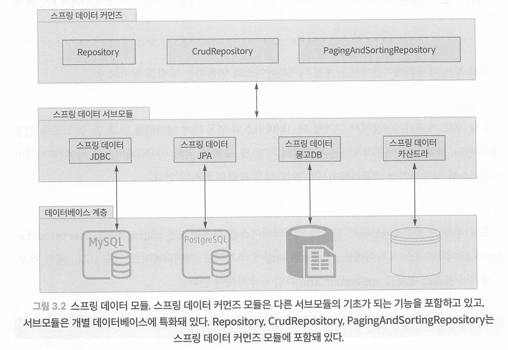

## 몽고 디비 설정 방법 - spring-boot-starter-data-mongo

```groovy
dependencies {
    implementation 'org.springframework.boot:spring-boot-starter-data-mongodb'
    implementation 'de.flapdoodle.embed:de.flapdoodle.embed.mongo'
}
```

* 내장형 Flapdoodle 몽고DB
  * 간편한 사용을 위해 내장형 몽고DB인 Flapdoodle 를 사용
  * https://github.com/flapdoodle-oss/de.flapdoodle.embed.mongo
  * Flap-doodle 몽고DB는 몇 가지 한계가 있어서 실제 운영 환경이나 복잡한 애플리케이션에서는 사용하지 않는 것이 좋다.
  *  자세한 내용은 https://mng.b2Yg5A를 참고한다. 
  * 실제 운영 환경에서는 몽고DB를 사용하거나 테스트 목적 이라면 테스트컨테이너(https://www.testcontainers.org/)를 사용하는 것이 좋다.

```java
@DataMongoTest
@ExtendWith(SpringExtension.class)
public class MongoTest {

	@Autowired
	private MongoTemplate mongoTemplate;

	@Test
	void 몽고_컬렉션_테스트() {
		// given
		DBObject object = BasicDBObjectBuilder.start().add("Manning", "Spring Boot In Practice").get();
		// when

		mongoTemplate.save(object, "collection");
		// then
		Assertions.assertThat(mongoTemplate.findAll(DBObject.class, "collection"))
			.extracting("Manning")
			.containsOnly("Spring Boot In Practice");

	}
}
```

* https://github.com/spring-boot-in-practice/repo/wiki/Beginners-Guide-to-MongoDB

## 커스텀 스프링 데이터 레포지토리

필요한 CRUD 메서드만 노출하는 Repository

```java
@NoRepositoryBean
public interface BaseRepository<T, ID>  extends Repository<T, ID> {

    <S extends T> S save(S entity);

    Iterable<T> findAll();

}
//

@Repository
public interface CustomizedCourseRepository extends BaseRepository<Course, Long> {
}

```

* 스프링 데이터가 자동으로 구현체를 만들지 않도록  @NoRepositoryBean 사용

# CHAPTER 4 스프링 자동 구성과 액추에이터

## 커스텀 스프링 부트 실패 분석기

요구사항 : 외부 API 서비스를 사용 불가하면 애플리케이션이 시작되면 안된다.

- 스프링 부트의 ContextRefreshedEvent를 사용해서 검증 프로세스를 구동한다. 
  - ApplicationContext가 갱신되면 ContextRefreshedEvent를 발행한다.
- API가 사용할 수 없는 상태라면 개발자가 작성한 런타임 예외인 UrlNotAccessibleException예외를 던진다.
- UrlNotAccessibleException 예외가 던져지면 호출되는 UrINotAccessibleFailureAnalyzer를 작성한다.
- 마지막으로 spring.factories 파일에 UrINotAccessibleFailureAnalyzer를 한다. 
- src/main/ java/META-INE 디렉터리에 있는 spring factories 파일은 애플리케이션 시작 시점에 스프링으 로 로딩하는 특수 파일로서 여러 가지 설정 클래스에 대한 참조가 포함돼 있다.

```java
@Getter
public class UrlNotAccessibleException extends RuntimeException {

	private String url;
	
	public UrlNotAccessibleException(String url) {
		this(url, null);
	}

	public UrlNotAccessibleException(String url, Throwable cause) {
		super("URL " + url + " is not accessible", cause);
		this.url = url;
	}
}
//

@Component
public class UrlAccessibilityHandler {

	@Value("${api.url:https://dog.ceo/}")
	private String url;

	@EventListener(classes = ContextRefreshedEvent.class)
	public void onListen() {
		// 데모 목적으로 일부러 예외 발생
		throw new UrlNotAccessibleException(url);
	}
}

// 
public class UrlNotAccessibleFailureAnalyzer extends AbstractFailureAnalyzer<UrlNotAccessibleException> {

	@Override
	protected FailureAnalysis analyze(Throwable rootFailure, UrlNotAccessibleException cause) {
		return new FailureAnalysis("액세스 할 수 없습니다. URL : " + cause.getUrl(),
			"URL의 유효성을 검사하고 액세스 가능한지 확인하세요", cause);
	}

}

```

* 예외가 발생하면 스프링 부트는 FailureAnalyzer를 호출한다.
* 이를 위해 예외를 처리할 수 있는 FailureAnalyzer를 src/main/java/META-INF/spring.factories 파일에 작성한다

```properties
org.springframework.boot.diagnostics.FailureAnalyzer=\
com.ys.practice.fail.UrlNotAccessibleFailureAnalyzer
```

* 복수개로 추가도 가능하다

```properties
org.springframework.boot.diagnostics.FailureAnalyzer=\
com.ys.practice.fail.UrlNotAccessibleFailureAnalyzer,
~~~,
~~~
```


## 액추에이터 엔드포인트 변경

```properties
management:
  endpoints:
    web:
      base-path: /ys
      path-mapping:
        health: apphealth
  server:
    port: 8081

```


## 커스텀 스프링 부트 HealthIndicator 작성

요구사항 : 외부  Rest API 시스템 상태 모니터링

```java

@Component
public class DogsApiHealthIndicator implements HealthIndicator {

	public Health health() {
		try {
			ParameterizedTypeReference<Map<String, String>> reference = new ParameterizedTypeReference<>() {
			};
			
			
			ResponseEntity<Map<String, String>> result = new RestTemplate().exchange(
				"https://dog.ceo/api/breeds/image/random", HttpMethod.GET, null, reference);

			if (result.getStatusCode()
					  .is2xxSuccessful() && result.getBody() != null) {
				return Health.up()
							 .withDetails(result.getBody())
							 .build();
			} else {
				return Health.down()
							 .withDetail("status", result.getStatusCode())
							 .build();
			}
		} catch (RestClientException ex) {
			return Health.down()
						 .withException(ex)
						 .build();
		}
	}
}

```

yml 설정

```yaml
management:
  endpoints:
    web:
      base-path: /ys
  server:
    port: 8081
  endpoint:
    health:
      show-details: always

```

endpoint 호출

```http
http://localhost:8081/ys/health
```

## 액추에이터 info endpoint


`info` 엔드포인트는 애플리케이션에 관한 임의의 애플리케이션 정보를 제공합니다. 

일반적으로 애플리케이션의 메타데이터, 버전, 설명, 사용자 지정 정보 등과 같은 비즈니스적 관점에서 중요한 정보를 제공하는 데 사용

application.yml에 

 info: build.* 프로퍼티를 추가하면 pom.xml, gradle 파일에 명시된 artifactId, groupId, version 정보도 info 엔드포인트에서 표시할 수 있다.

* maven의  properties를 참조하는법

```yaml
info:
  app:
    name: ys Spring Boot Actuator Info Application
    description: Spring Boot application that explores the /info endpoint
    version: 1.0.0
  build:
    artifact: "@project.artifactId@"
    name: "@project.name@"
    description: "@project.description@"
    version: "@project.version@"
    properties:
      java:
        version: "@java.version@"
```

* gradle의  properties를 참조하는법

```yaml
info:
  app:
    name: ys Spring Boot Actuator Info Application
    description: Spring Boot application that explores the /info endpoint
    version: 1.0.0
  build:
    artifact: ${project.artifactId}
    name: ${project.name}
    description: ${project.description}
    version: ${project.version}
    properties:
      java:
        version: ${java.version}
```

build.gradle에서 다음도 해야한다.

```groovy
springBoot {
    buildInfo()
}
```

## info엔드포인트에서 git 정보 보기

git.properties 파일과 build-info.properties 파일은 각각

GitInfoContributor 클래스와 Build-InfoContributor 클래스를 통해 자동으로 인식된다.

Gradle 에선 이미 `build-info` task를 제공하므로 추가 설정 없이 빌드 정보를 생성할 수 있다.

```yaml
springBoot {
    buildInfo()
}
```

plugin 추가

```yaml
plugins {
    id 'com.gorylenko.gradle-git-properties' version '2.3.1'
}
```

info endpoint 접속시 git 정보가 보인다

git 정보는 application.properties 파일의 management. info.git.mode 프로퍼티값을 기준으로 표시된다. 

기본값은 simple이며 commit과 branch 정보만 표시된다. 

full로 지정하면 git.properties에 있는 모든 정보가 표시된다

```yaml
management:
  info:
    git:
      mode: full
```

## info 엔드포인트에서 애플리케이션 정보 커스텀하기

애플리케이션 상세 정보를 스프링 부트 액추에이터 엔드포인트를 통해 표시해야 한다.

스프링 부트의 InfoContributor 인터페이스 구현체를 만들면 스프링 부트 액추에이터의 info 엔드포인트에 원하는 정보를 표시할 수 있다.

contribute() 메서드를 재정의하면 된다.

```java
@Component
public class CourseInfoContributor implements InfoContributor {

    private CourseService courseService;

    @Autowired
    public CourseInfoContributor(CourseService courseService) {
        this.courseService = courseService;
    }

    @Override
    public void contribute(Info.Builder builder) {
        Map<String, Integer> courseNameRatingMap = new HashMap<>();
        List<CourseNameRating> courseNameRatingList = new ArrayList<>();
        for(Course course : courseService.getAvailableCourses()) {
            courseNameRatingList.add(CourseNameRating.builder().name(course.getName()).rating(course.getRating()).build());
        }
        builder.withDetail("courses", courseNameRatingList);
    }

    @Builder
    @Data
    private static class CourseNameRating {
        String name;
        int rating;

    }
}

```

## 애플리케이션 상세 정보 커스텀 엔드포인트

애플리케이션에 특화된 비즈니스 상세 정보를 제공할 수 있는 스프링 부트 액추에이터 엔드포인트를 작성해야 한다.

스프링 부트에서 제공하는 @EndPoint 애너테이션을 붙여서 커스텀 엔드포인트를 추가할 수 있다.

```java
@Component
@Endpoint(id = "releaseNotes")
//@JmxEndpoint(id = "releaseNotes")
public class ReleaseNotesEndpoint {

	private final Collection<ReleaseNote> releaseNotes;

	@Autowired
	public ReleaseNotesEndpoint(Collection<ReleaseNote> releaseNotes) {
		this.releaseNotes = releaseNotes;
	}

	@ReadOperation
	public Iterable<ReleaseNote> releaseNotes() {
		return releaseNotes;
	}

	@ReadOperation
	public Object selectCourse(@Selector String version) {
		Optional<ReleaseNote> releaseNoteOptional = releaseNotes
			.stream()
			.filter(releaseNote -> version.equals(releaseNote.getVersion()))
			.findFirst();
		if(releaseNoteOptional.isPresent()) {
			return releaseNoteOptional.get();
		}
		return String.format("No such release version exists : %s", version);
	}

	@DeleteOperation
	public void removeReleaseVersion(@Selector String version) {
		Optional<ReleaseNote> releaseNoteOptional = releaseNotes
			.stream()
			.filter(releaseNote -> version.equals(releaseNote.getVersion()))
			.findFirst();
		if(releaseNoteOptional.isPresent()) {
			releaseNotes.remove(releaseNoteOptional.get());
		}
	}
}
```

이후 지정한 id를 노출시켜야하므로 application.yml에 추가한다

```yaml
management:
	endpoints:
		web:
			exposure:
				include: releaseNotes
```

http://localhost:8081/ys/releaseNotes로 접속

## 스프링부트 액츄에이터 metric

micrometer 프레임워크를 사용하여 측정지표를 사용한다

프로메테우스 말고 다른 모니터링 시스템 을 사용하려면 

`micrometer-registry-{monitoring_system}` 의존 관계를 추가하면 스프링 부트 가 자동 구성으로 해당 모니터링 시스템을 사용할 수 있게 해준다.

### 측정지표 노출 

```yaml
management:
  metrics:
    export:
      defaults:
        enabled: true
```


### 커스텀 메트릭

NeterRegistry를 사용해서 자동 구성으로 여러 개의 레지스트리 구현체를 추가 할 수 있다.

 그래서 한 개 이상의 모니터링 시스템에 측정지표를 내보내서 사용할 수 있다. 

또한 MeterRegistryCustonizer를 사용해서 레지스트리 커스터마이징도 가능하다

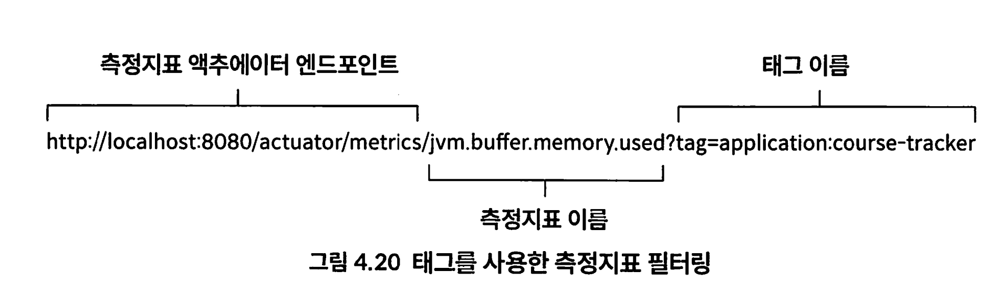

모든 측정지표는 스프링 부트의 `JvmMetricsAutoConfiguration` 클래스를 통해 자동 구성 된다.

마이크로미터 프레임워크는 커스텀 측정지표를 생성할 때 사용할 수 있는 

카운터(counter), 

게이지 (Gauge), 

타이머(Timer), 

분포 요약(Distributionsummary)과 같은 다양한 측정 단위를 제공한다

### Counter

Counter는 증가할 수 있는 갯수나 횟수를 의미한다 

```java
@Configuration
public class CourseTrackerMetricsConfiguration {

    @Bean
    public Counter createCourseCounter(MeterRegistry meterRegistry) {
        return Counter.builder("api.courses.created.count")
                .description("Total number of courses created")
                .register(meterRegistry);
    }
}

```

### Gauge

Counter의 단점은 애플리케이션 종료 후에 카운터값이 유지되지 않고 애플리케이션이 재시작되면 0으로 초기화된다는 점이다.

 따라서 생성된 과정의 개수를 애플리케이션 종료 후에도 추적하려면 Counter를 사용할 수 없다.

게이지Gauge를 사용하면 된다. 

게이지는 카운터와 마찬가지로 개수나 횟수를 셀 수 있지만, 애플리케이션이 종료되면 값이 초기화되는 카운터와 달리,

 데이터베이스를 이용해서 값을 저장하고  Gauge 측정지표를 통해서 값을 확인할 수 있다.

 ```java
 @Configuration
 public class CourseTrackerMetricsConfiguration {
 
     @Bean
     public Gauge createCoursesGauge(MeterRegistry meterRegistry, CourseService courseService) {
         return Gauge.builder("api.courses.created.gauge", courseService::count)
                 .description("Total courses created")
                 .register(meterRegistry);
     }
 
 }
 ```

### Timer

때때로 어떤 연산을 수행할 때 소 요되는 시간을 측정해야 할 때도 있다.

```java
@Configuration
public class CourseTrackerMetricsConfiguration {

    @Bean
    public Timer createCoursesTimer(MeterRegistry meterRegistry) {
        return Timer.builder("api.courses.creation.time")
                .description("Course creation time")
                .register(meterRegistry);
    }
}

public class Service {
  private final Timer createCoursesTimer;
  
  public Course createCourse(Course course) {
    return createCoursesTimer.recordCallable(() -> courseRepository.save(course));
  }
}
```

타이머는 내부적으로 Callable 객체 안에서 과정 생성 시 소요되는 시간을 측정한다.

### Distrubution Summary

분포 요약distribution summary은 이벤트의 분포를 측정한다.

Timer와 구조적으로는 비슷하지만 측정 단위가 시간이 아니라는 점에서 차이가 있다

```java
@Configuration
public class CourseTrackerMetricsConfiguration {
    @Bean
    public DistributionSummary createDistributionSummary(MeterRegistry meterRegistry) {
        return DistributionSummary.builder("api.courses.rating.distribution.summary")
               .description("Rating distribution summary")
                .register(meterRegistry);
    }
}

```

## 그라파나 프로메테우스 연동

스프링 부트는 클래스패스에 프로메테우스 라이브러리가 있으면 스 프링 부트에 내장된 측정지표 및 커스텀 측정지표 전부를 프로메테우스에게 전송한다.

프로메테우스의 측정지표 형식은 스프링 부트와 다른데 전체 목록은 https://mng.bz/aJMz를 참고. 

프로메테우스의 측정지표를 사용해서 그라파나로 시각화 설정까지 살펴보자.

* https://github.com/spring-boot-in-practice/repo/wiki/Sample-Prometheus-Metrics

```yaml
dependencies {
    implementation 'org.springframework.boot:spring-boot-starter-actuator'
    implementation 'io.micrometer:micrometer-registry-prometheus'
}
```

```yaml
management:
  endpoints:
    web:
      exposure:
        include: metrics,prometheus
```

프로메테우스 의존 관계를 추가하면 `PrometheusMetricsexportAutoConfiguration` 클래스가 활성화되고 `PrometheusMeterRegistry` 빈이 등록된다. `PrometheusMeterRegistry` 빈이 플러그인으로 추가되어 측정지표 파사드 역할을 담당한다.

# CHAPTER 5 스프링 부트 애플리케이션 보안

* 스프링 시큐리티 개요와 일반적인 보안 위협

* 스프링 시큐리티 적용과 스프링 시큐리티 자동 구성 이해

- 인메모리, JDBC, LDAP 환경에서 스프링 시큐리티 커스터마이징
- 스프링 부트 프로젝트에 HTTP 기본 인증 적용

## CSRF 방어

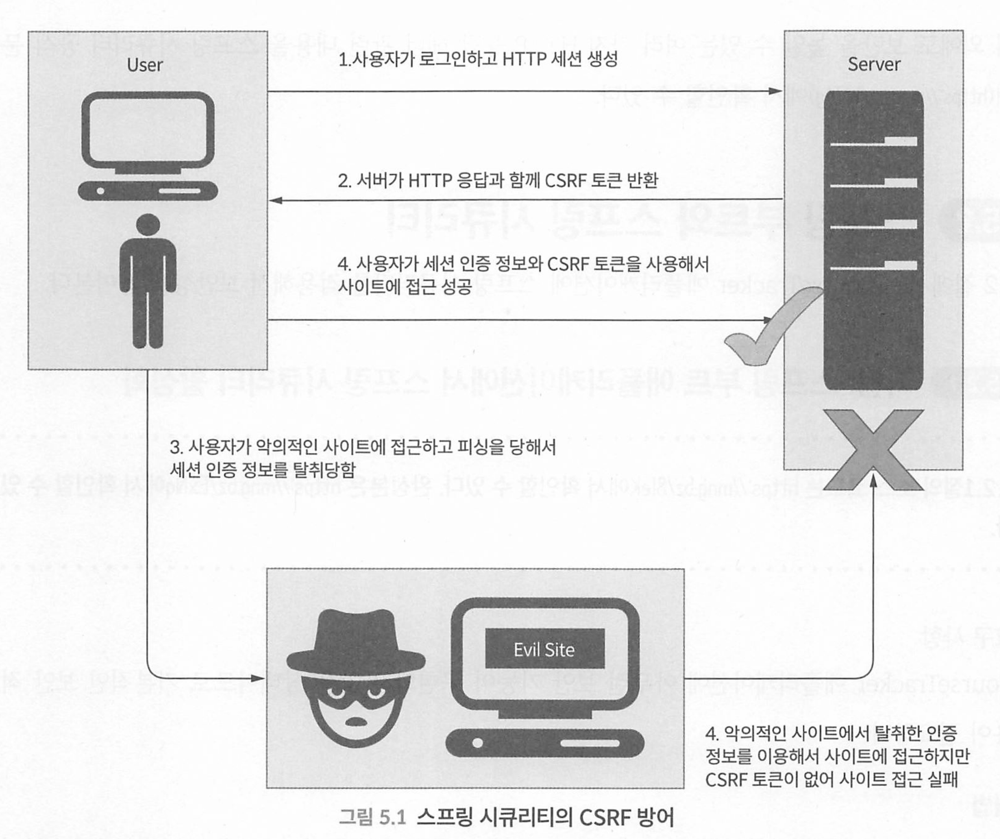

```http
// spring security의 기본 http 응답 헤더 
Cache-Control: no-cache, no-store, max-age=O, must-revalidate
Pragma: no-cache
Expires: 0
X-Content-Type-Options: nosniff
Strict-Transport-Security: max-age=31536000 ; includeSubDomains
X-Frame-Options: DENY
X-XSS-Protection: 1; mode=block
```

- Cache-Control - 브라우저 캐시를 완전하게 비활성화
- X-Content-Type-Options - 브라우저의 콘텐트 타입 추측을 비활성화하고 Content-Type 헤더로 지정된 콘텐트 타입으로만 사용하도록 강제
- Strict-Transport-Security - 응답 헤더에 포함되면 이후 해당 도메인에 대해서는 브라우저 가 자동으로 HTTPS를 통해 연결하도록 강제하는 HSTS(HTTP Strict Transport securty) 활성화 (http://mng.bzl/jyEa)
- X-Frame-Options - 값을 DENY로 설정하면 웹 페이지 콘텐트가 frame, iframe, embed에서 표시 되지 않도록 강제해서 클릭재킹공격 방지
- X-XSS-Protection - 값을 1; mode=block으로 설정하면 브라우저의 XSScross site scripting 필터 링을 활성화하고 XSS 공격이 감지되면 해당 웹 페이지를 로딩하지 않도록 강제

이 외에도 보안을 높일 수 있는 여러 가지 HTTP 응답 헤더 관련 내용을 스프링 시큐리티 공식 문

서(https://mng.bz/W74g)에서 확인할 수 있다.

* https://docs.spring.io/spring-security/site/docs/5.0.x/reference/html/headers.html

### Spring Seucirty 자동 구성 클래스

스프링 부트는 SecurityAutoConfiguration, UserDetailsServiceAutoConfiguration, SecurityFilterAutoConfiguration 이렇게 세 개의 설정 클래스를 사용한다.

## 시큐리티 LDAP 기반 인증

LDAP (Lightweight Directory Access Protocol) 기반 인증은 LDAP 서버를 사용하여 사용자의 자격 증명을 검증하고 인증하는 방법입니다. LDAP는 디렉터리 서비스를 검색하고 수정하는 데 사용되는 프로토콜로, 일반적으로 사용자, 그룹, 기타 객체 정보를 저장하고 구성하는 데 사용됩니다

스프링 부트 애플리케이션에 LDAP 기능을 추가하려면 spring-ldap-core와 spring-security-Idap가 필요하다. LDAP 서버도 필요한데 간단한 내장형 LDAP 서버인 UnboundiD (https://ldap.com/unboundid-ldap-sdk-for-java/)를 사용한다.

```groovy
dependencies {
    implementation 'org.springframework.boot:spring-boot-starter-security'
    implementation 'org.springframework.ldap:spring-ldap-core'
    implementation 'org.springframework.security:spring-security-ldap'
    implementation 'com.unboundid:unboundid-ldapsdk'
}
```

사용자 정보는 LDIF(https://ldap.com/ldif-the-ldap-data-interchange-format/) 파일에 저장되므로

/src/main/resources/users.ldif 파일에 저장한다.

```
dn: dc=manning,dc=com // 1
objectclass: top
objectclass: domain
objectclass: extensibleObject
dc: manning

dn: ou=people,dc=manning,dc=com
objectclass: top
objectclass: organizationalUnit
ou: people

dn: uid=steve,ou=people,dc=manning,dc=com // 2
objectclass: top
objectclass: person
objectclass: organizationalPerson
objectclass: inetOrgPerson
cn: Steve Smith
sn: Smith
uid: steve
userPassword: password

dn: uid=jsocket,ou=people,dc=manning,dc=com // 3
objectclass: top
objectclass: person
objectclass: organizationalPerson
objectclass: inetOrgPerson
cn: John Socket
sn: Socket
uid: jsocket
userPassword: password
```

1. DN(distinguished name) 정의

2.  Steve Smith 계정 정의

3.  John Socket 계정 정의

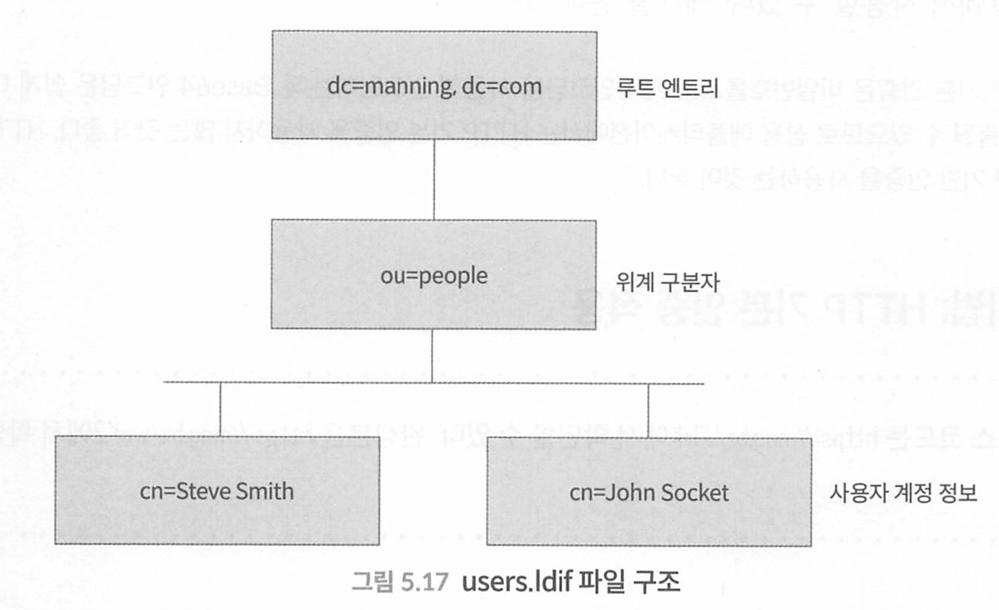

이제 LDAP 서버가 기동하도록 application,yml에 LDAP 서버 설정을 추 가하자.

```yaml
spring:
  ldap:
    embedded:
      # ① 내장 LDAP 서버 포트
      port: 8389
      # ② 내장 LDIF 파일 위치
      ldif: classpath:users.ldif
      # ③ 내장 LDAP 서버 고유 이름
      base-dn: dc=manning,dc=com
```

security 설정

```java
@Configuration
public class SecurityConfiguration extends WebSecurityConfigurerAdapter {

    @Override
    protected void configure(HttpSecurity http) throws Exception {
        http
                .authorizeRequests()
                .antMatchers("/login").permitAll()
                .anyRequest().authenticated()
                .and()
                .formLogin().loginPage("/login");
    }

    @Override
    protected void configure(AuthenticationManagerBuilder auth) throws Exception {
        auth
                .ldapAuthentication()
                .userDnPatterns("uid={0},ou=people")
                .contextSource()
                .url("ldap://localhost:8389/dc=manning,dc=com")
                .and()
                .passwordCompare()
                .passwordEncoder(NoOpPasswordEncoder.getInstance()) // NoOp은 deprecated
                .passwordAttribute("userPassword");
    }

    @Override
    public void configure(WebSecurity web) throws Exception {
        web
                .ignoring()
                .antMatchers("/webjars/**", "/images/*", "/css/*", "/h2-console/**");
    }
}
```

인메모리 인증이나 JDBC 인증에서는 UserDetailsService가 중요한 역할을 담당했던 반면에 LDAP 인증에서는 UserDetailsservice를 사용할 수 없다.

왜냐하면 LDAP 인증에서는 

* LDAP으로 부터 비밀번호를 읽어올 수 없고,
*  LDAP에 비밀번호를 제공하고 
* LDAP이 실제 비밀번호 일치 여부 확인을 담당하기 때문이다. 

스프링 시큐리티는 LdapAuthenticator 인터페이스를 제공하며 이를 통해 LDAP 인증이 처리된다.

스프링 시큐리티에서는 2가지 방식으로 LDAP 인증을 수행할 수 있다.

1. 예제에 사용된 인증 방식인데, 사용자가 입력한 비밀번호와 LDAP 서버에 저장된 비밀번호를 LDAP 서버가 Compare 연산을 사용해서 비교하고 결과를 스프링 시큐리티에게 반환한다. 

2. bind 인증. 사용자가 입력한 비밀번호와 같은 식별 정보(identity proor)를 LDAP 서버가 Bind 연산(https://ldap.com/the-ldap-bind-operation/)을 사용해서 인증을 처리한다.

# CHAPTER 6 스프링 시큐리티 응용

- 스프링 클라우드 볼트(Spring Cloud Vault)를 이용한 비밀 정보 관리, Remember Me, 구글 리캡차(Google reCAPCHA) 사용을 위한 스프링 시큐리티 설정 이메일 확인과 구글 오센티케이터 Google Authenticator를 활용한 다단계 인증
- 스프링 시큐리티 운영과 관련된 스프링 부트 액추에이터 엔드포인트

* HTTPS 활성화
* 비밀번호 관리
* 계정 잠금 
* 리캡차
* 2단계 인증
* 구아로~

## Spring Boot HTTPS 활성화

스프링 부트 애플리케이션에서 HTTPS를 활성화하는 작업은 2단계로 구성된다. 먼저 TLS 인증서 를 확보해야 하고, 이 인증서를 스프링 부트 애플리케이션에 설정한다.

* JDK keytool 자가승인 인증서 : https://github.com/spring-boot-in-practice/repo/wiki/Generating-a-Self-Signed-Certificate-Using-Keytool

https 활성화 

* 인증서를 생성하면 스프링 부트 애플리케이션에 HTTPS 설정을 할 수 있다. 먼저 인증서를 포함하 고 있는keystore 파일을 스프링 부트가 인식할 수 있도록 src/main/resources/keystore 폴더에 저장한다. 
* 그리고 이 파일을 스프링 시큐리티에서 지정해주고 HTTPS를 활성화하면 된다.

```yaml
server:
  ssl:
    key-store-type: PKCS12  # 키 저장소에 사용된 형식. JKS 파일인 경우 JKS로 설정될 수 있습니다.
    key-store: classpath:keystore/sbip.p12 # 인증서가 포함된 키 저장소의 경로
    key-store-password: p@ssw0rd     # 인증서 생성에 사용된 비밀번호
    key-alias: sbip     # 인증서에 매핑된 별칭
  # HTTPS 포트
  port: 8443

```


```java
@Configuration
@EnableWebSecurity
public class SecurityConfiguration {

	@Bean
	public UserDetailsService userDetailsService() {

		UserDetails peter = User.builder()
								.username("user")
								.password(passwordEncoder().encode("pass"))
								.roles("USER")
								.build();

		return new InMemoryUserDetailsManager(peter);
	}

	@Bean
	public SecurityFilterChain httpSecurity(HttpSecurity http) throws Exception {
		http.requiresChannel()
			.anyRequest()
			.requiresSecure() // 강제로 모든 요청에 https 리다이렉트 
			.and()
			.authorizeRequests()
			.antMatchers("/login")
			.permitAll()
			.anyRequest()
			.authenticated()
			.and()
			.formLogin()
			.loginPage("/login");

		return http.build();
	}

	@Bean
	public WebSecurityCustomizer webSecurityCustomizer() {
		// antMatchers 부분도 deprecated 되어 requestMatchers로 대체
		return (web) -> web.ignoring()
						   .antMatchers("/webjars/**", "/images/*", "/css/*", "/h2-console/**");
	}

	@Bean
	public PasswordEncoder passwordEncoder() {
		return new BCryptPasswordEncoder();
	}
}
```

다음과 같이도 설정 가능하다

```java
@Slf4j
@SpringBootApplication
public class PracticeApplication {

	public static void main(String[] args) {
		SpringApplication.run(PracticeApplication.class, args);
	}

	@Bean
	public ServletWebServerFactory servletContainer() {
		TomcatServletWebServerFactory tomcat = new TomcatServletWebServerFactory() {
			@Override
			protected void postProcessContext(Context context) {
				SecurityConstraint securityConstraint = new SecurityConstraint();
				securityConstraint.setUserConstraint("CONFIDENTIAL");
				SecurityCollection collection = new SecurityCollection();
				collection.addPattern("/*");
				securityConstraint.addCollection(collection);
				context.addConstraint(securityConstraint);
			}
		};
		tomcat.addAdditionalTomcatConnectors(redirectConnector());
		return tomcat;
	}

	private Connector redirectConnector() {
		Connector connector = new Connector("org.apache.coyote.http11.Http11NioProtocol");
		connector.setScheme("http");
		connector.setPort(8080);
		connector.setRedirectPort(8443);
		return connector;
	}

}

```


## Spring Cloud Vault 비밀번호 관리

* https://www.vaultproject.io/

yml에 들어가는 민감정보를 관리할 수 있다. 

API 을 사용하여 *민감정보*를 관리하는 시스템.

프로젝트 내에 *보안적인 요소를 고려해야 하는 값(계정 및 패스워드 = 민감정보 등)*들을 HTTP API 통신을 이용하여 외부(=git 저장소 등)에 노출시키지 않은 상태로 사용할 수 있기 때문에 보안에 효율적임.

* https://cloud.spring.io/spring-cloud-vault/reference/html/

https://github.com/spring-boot-in-practice/repo/wiki/Installing-and-Configuring-HashiCorp-Vault

1. https://www.vaultproject.io/downloads에서 운영체제에 맞게 설치 파일을 다운로드한다. 책에서는 맥 OS를 기준으로 진행한다.

```sh
 brew install hashicorp/tap/vault

//
> which vault
/opt/homebrew/bin/vault

cd /opt/homebrew/bin

vi vault.conf
```

2. ZIP 파일 압축을 풀면 vault 실행 파일이 나온다.


3. vault 실행 파일이 있는 폴더와 같은 폴더에 다음과 같이 vault.conf 파일을 작성한다.

```text
 backend "inmem" {
 
 }
 
 listener "tcp" {
	 address = "0.0.0.0:8200"
 	 tls_disable = 1
 }
 disable_mlock = true
```


4. 다른 터미널 창을 열고 환경 변수를 지정한다. 

```yaml
export VAULT_ADDR=http://localhost:8200
```

5. 볼트는 기본적으로 사용할 수 없도록 봉인sealed돼 있다. 봉인을 해제하려면 비밀 키가 필요하며 다음 명령을 통해 비밀 키를 생성할 수 있다.

```sh
# 볼트 서버 시작
vault server -config=./vault.conf

# 시작 후 다른 터미널에서 실행한다. 
./vault opertator init // vault 디렉토리 내에서 

# 만약 Get "https://127.0.0.1:8200/v1/sys/internal/ui/mounts/secret/application/db": http: server gave HTTP response to HTTPS client 이러한 에러가 발생하였을 경우
$ export VAULT_ADDR='http://localhost:8200'

# 다르므로 이용하지 말자 생성한거 쓰자
./vault operator init
Unseal Key 1: Bx9LSQkYmvISCmDdWgDA3aiAHk/9g9LK+KJNPmKCMB
Unseal Key 2: JM2taLcylV8LMsUFm5camxNHHeCVpxnJL1/aIj9+q/l
Unseal Key 3: gYNsPSCphaZKpGijwAtcK6zjIsB5W+AlmRdE8bwE95P
Unseal Key 4: mvo8Km2jIv9r6UCHSaHOZdhxS8kOvGs9GuIyGuacgGc
Unseal Key 5: KvSPa/6qDaTnaHiKr9GGnOJEKYq3Q6mBOLHZ7vEim/T

Initial Root Token: hvs.eqRn7Jhz8WhStBUOfCdNb2P

```

6.  vault status 명령을 실행하면 볼트가 봉인돼 있고 봉인을 해제하려면 적어도 3개의 비밀 키가 필요한 것을 확인할 수 있다.

```sh
./vault status
```

7. 확인한 비밀키 3개를 이용해서 봉인 해제 

```shell
# 위 5개중 하나
./vault operator unseal Bx9LSQkYmvISCmDdWgDA3aiAk/9g9LK+KJNPmKCMBf5
./vault operator unseal JM2taLcylV8LMsUFm5camxNHHeCVpxJL1/aIjy9+q/l
./vault operator unseal gYNsPSCphaZKpGijwAtcK6zjIsB5W+AlmRE8bwjE95P

```

8. 5번에서 확인한 초기 루트 토큰(inital Root token) ㅎ환경변수 등록

```shell
export VAULT_TOKEN=hvs.eqRn7Jhz8WhStBUOfCdNb2I
```

9. kv 비밀정보 엔진 활성화

```shell
./vault secrets enable -path=secret kv
Success! Enabled the kv secrets engine at: secret/
```

10. keystored의 비밀정보를 볼트에 저장

```sh
./vault write secret/coursetracker keystore=p@ssw0rd # yaml 비밀번호 
```

```yaml
server:
  ssl:
    # 키 저장소에 사용된 형식. JKS 파일인 경우 JKS로 설정될 수 있습니다.
    key-store-type: PKCS12
    # 인증서가 포함된 키 저장소의 경로
    key-store: classpath:keystore/sbip.p12
    # 인증서 생성에 사용된 비밀번호
    key-store-password: p@ssw0rd # 이 비밀번호
    # 인증서에 매핑된 별칭
    key-alias: sbip
  # HTTPS 포트
  port: 8443
```

의존관계 추가 

```groovy
plugins {
    id 'io.spring.dependency-management' version '1.0.15.RELEASE'
}
ext {
    set('springCloudVersion', "2021.0.3") // 버전 잘 확인해서 쓸것
}

dependencies {
  implementation 'org.springframework.cloud:spring-cloud-starter-vault-config'
}

dependencyManagement {
    imports {
        mavenBom("org.springframework.cloud:spring-cloud-dependencies:${springCloudVersion}")
    }
}
// https://mvnrepository.com/artifact/org.springframework.cloud/spring-cloud-dependencies
버전 호
```

application.yaml에 추가

```yaml
spring:
  cloud:
    vault:
      token: hvs.eqRn7Jhz8WhStBUOfCdNb2IP
      authentication: token
      host: localhost
      port: 8200
      scheme: http
  config:
    import: vault://
  application:
      name: coursetracker
```

1. 볼트 초기 설정 시 획득한 초기 루트 토큰값을 지정한다. CourseTracker 애플리케이션은 이 값 을 볼트에 제공해서 인증을 통과한다.

2. 볼트 인증 방식을 token으로 지정한다. 볼트는 token 외에 다른 인증 방법도 지원한다.

3. 볼트 서버의 위치를 지정한다. 예제라서 HTTP 프로토콜을 사용하지만 실제 서비스에서는 반드 시 HTTPS를 사용해야 한다.

4. 비밀 정보가 담겨 있는 볼트의 위치를 볼트에서 설정한 위치인 secret/coursetracker로 지정
    한다.

5. 인증서 비밀번호를 ${keystore}로 대체한다.

 

접속시 정상 동작 

* https://mungmange.tistory.com/135

* https://sg-choi.tistory.com/624


## 메일 인증 예

```groovy
implementation 'org.springframework.boot:spring-boot-starter-mail'
```

yaml

```yaml
spring:
  mail:
    host: smtp.gmail.com
    port: 587
    username:
    password:
    properties:
      mail:
        smtp:
          auth: true
          starttls:
            enable: true
    protocol: smtp
    test-connection: false

```

* https://support.google.com/mail/answer/185833
* https://myaccount.google.com/apppasswords?pli=1&rapt=AEjHL4NOjB81mnyAKUh1OiAK4MNuRQpqOE74-nTLSjXw-7JgbqFA2AGOkiPNf1QsncH1cYAdJQS0_8p6iMWeY1htAWagBNorqA

- Google 계정 관리 > 보안 > Google에 로그인 > 2단계 인증 설정
- Google 계정 관리 > 보안 > Google에 로그인 > 앱 비밀번호 설정
  - 앱 선택 > 기타 > SMTP로 설정 후 생성
  - 생성한 비밀번호를 복사

## 로그인 시도 횟수 제한

애플리케이션 로그인을 3회 실패하면 24시간 동안 로그인을 허용하지 않도록 제한해야 한다.


스프링 시큐리티는 여러 가지 보안 활동을 수행하면서 다양한 스프링 이벤트를 발행한다. 

로그인에 성공하면 스프링 시큐리티는 AuthenticationsuccessEvent를 발행하고, 

입력한 정보 가 올바르지 않아 로그인에 실패하면 AuthenticationFailureBadcredentialsEvent를 발행한다.

이외에도 상황에 따라 여러 가지 이벤트가 발행된다.

- 실패한 로그인 횟수를 저장할 캐시cache 정의
- 스프링 시큐리티 이벤트를 활용해서 사용자 상태를 캐시에 저장
- 캐시에 저장된 로그인 실패 횟수가 3회 이상이면 로그인 불허
- 캐시는 24시간 후 자동 만료

guava 캐시, 레디스 사용


## 리캡차 구현

1. 구글에 로그인 후 구글 리캡차 어드민 페이지(https://www.google.com/recaptcha/admin/create)에 접속해 서 그림과 같이 설정 후 [Submit)을 클릭한다. 이렇게 하면 리캡차 컴포넌트에 있는 체크박스를 체크해야 봇이 아닌 사용자로 인식한다.

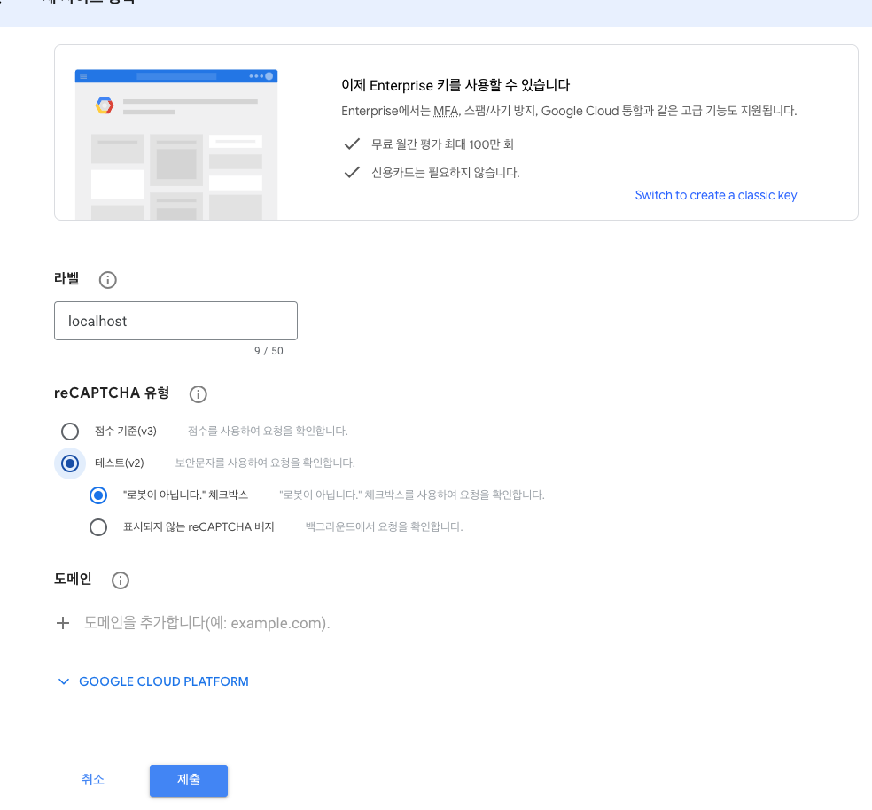

2. [Submit) 클릭 후 표시되는 화면에서 사이트 키Site Key와 시크릿 키secret Key가 표시된다. 이 키값을html에 추가한다.

```html
<div class="g-recaptcha mb-2" data-sitekey="구글 사이트 키"></div>
```

3. 스크립트도 추가해야 한다

```js
<script src="https://www.google.com/recaptcha/api.js"></script>
```

이제 사용자로부터 입력받은 리캡차값을 검증하는 로직 구현이 필요하다.

```java
@Controller
public class RegistrationController {

   private final GoogleRecaptchaService captchaService;
 
    @Value("${app.email.verification:N}")
    private String emailVerification;

    @PostMapping("/adduser")
    public String register(@Valid @ModelAttribute("user") UserDto userDto, HttpServletRequest httpServletRequest, BindingResult result) {
        if(result.hasErrors()) {
            return "add-user";
        }
        String response = httpServletRequest.getParameter("g-recaptcha-response");
        if(response == null) {
            return "add-user";
        }
        String ip = httpServletRequest.getRemoteAddr();
        RecaptchaDto recaptchaDto = captchaService.verify(ip, response);
        if(!recaptchaDto.isSuccess()) {
            return "redirect:adduser?incorrectCaptcha";
        }

        ApplicationUser applicationUser = userService.createUser(userDto);
        if("Y".equalsIgnoreCase(emailVerification)) {
            eventPublisher.publishEvent(new UserRegistrationEvent(applicationUser));
            return "redirect:adduser?validate";
        }
        return "redirect:adduser?success";

    }

}

// dto

public class RecaptchaDto {

	private boolean success;
	private List<String> errors;

	public boolean isSuccess() {
		return success;
	}

	public void setSuccess(boolean success) {
		this.success = success;
	}

	public List<String> getErrors() {
		return errors;
	}

	public void setErrors(List<String> errors) {
		this.errors = errors;
	}
}

// service

@Service
public class GoogleRecaptchaService {

	private static final String VERIFY_URL = "https://www.google.com/recaptcha/api/siteverify";

	private final WebClient webClient;
	private final String secretKey;

	public GoogleRecaptchaService(@Value("${captcha.secret.key}") String secretKey,
		WebClient.Builder webClientBuilder) {
		this.secretKey = secretKey;
		this.webClient = webClientBuilder.baseUrl(VERIFY_URL)
										 .build();
	}

	public RecaptchaDto verify(String ip, String recaptchaResponse) {
		Map<String, String> params = new HashMap<>();
		params.put("remoteip", ip);
		params.put("secret", secretKey);
		params.put("response", recaptchaResponse);

		Map<String, Object> body = webClient.get()
											.uri(uriBuilder -> uriBuilder
												.queryParam("remoteip", "{remoteip}")
												.queryParam("secret", "{secret}")
												.queryParam("response", "{response}")
												.build(params))
											.retrieve()
											.bodyToMono(Map.class)
											.block();

		if (body == null) {
			throw new RuntimeException("Recaptcha verification failed!");
		}

		boolean success = (Boolean)body.get("success");
		RecaptchaDto recaptchaDto = new RecaptchaDto();
		recaptchaDto.setSuccess(success);

		if (!success) {
			recaptchaDto.setErrors((List<String>)body.get("error-codes"));
		}

		return recaptchaDto;
	}
}
```


```yaml
captcha:
  secret:
    key: ${GOOGLE_SECRET}
```

이후 컨트롤러나 인터셉터에서 헤더 값을 받아서 검증에 사용하면 된다.

```java
@Controller
public class RegistrationController {

	private final UserService userService;
	private final GoogleRecaptchaService captchaService;

	private final ApplicationEventPublisher eventPublisher;

	@Value("${app.email.verification:N}")
	private String emailVerification;

	@PostMapping("/adduser") // 캡차값을 전송받는 엔드포인트 
	public String register(@Valid @ModelAttribute("user") UserDto userDto, 
                         HttpServletRequest httpServletRequest,
                         BindingResult result) {
		if (result.hasErrors()) {
			return "add-user";
		}
    
		String response = httpServletRequest.getParameter("g-recaptcha-response"); // 값을 받는다
		
		if (response == null) { // 캡차값이 없다면 잘못된 페이지
			return "add-user";
		}
    
		String ip = httpServletRequest.getRemoteAddr(); // 요청한 ip값 검증 
    
		RecaptchaDto recaptchaDto = captchaService.verify(ip, response); // 캡차서비스로 받아 구글로 전송해서 인증받는다. 
    
		if (!recaptchaDto.isSuccess()) { // 캡차 서비스 실패시 반환 
			return "redirect:adduser?incorrectCaptcha";
		}

    .. 생략
		return "redirect:adduser?success";
	}

}

```


## 구글 multi-factor authentication


다단계 인증(mult-factor authentication, MFA)은 사용자가 여러 단계의 인증 과정을 거치도록 강제하는 인증 패턴이다. 

2단계 인증 two-factor authentication은 다단계 인증의 한 방식으로 서로 다른 수준의 2단 계 인증 과정으로 구성된다.

아이디/패스워드 외에 추가로 일회성 비밀번호one time password를 사용해서 아이디/패스워드 인증의 단점을 보완한다.

2단계 인증 주요 흐름 

1. 사용자가 등록되면 새 계정이 생성된다.
2. 최초 로그인 시 2단계 인증을 활성화할 것인지 묻는다. 사용자가 활성화를 원하지 않으면 index 페이지로 이동한다.
3. 사용자가 2단계 인증 활성화를 선택하면 QR 코드를 생성해서 화면에 보여주고 스마트폰에 있는 구글 오센티케이터 앱으로 스캔하도록 안내한다.
4. 스캔을 통해 CourseTracker 앱이 구글 오센티케이터 앱에 등록되면 앱에 표시된 OIP 값을 2단계 인증 등록 페이지에서 입력받는다. 이를 통해 해당 사용자는 2단계 인증을 사용하도록 설 정된다. 이후 로그인 시 아이디/패스워드뿐만 아니라 구글 오센티케이터 앱에서 생성된 OTP 값 도 입력해야 로그인에 성공한다.
5. 2단계 인증을 활성화하지 않은 사용자에 대해서는 로그인할 때마다 2단계 인증 활성화 여부를 묻는다. 예제에서는 이 방식을 사용하지만 실제로는 로그인할 때마다 사용자를 불편하게 만들지 않고 별도의 메뉴를 두어 2단계 인증 활성화 여부를 설정할 수 있도록 하는것이 좋다

* https://github.com/wstrange/GoogleAuth 참고 가능하다. 

```groovy
implementation 'com.warrenstrange:googleauth:1.5.0'
```

2단계 인증용 사용자 entity

```java
@Entity
@Data
@NoArgsConstructor
@AllArgsConstructor
@Table(name = "CT_TOTP_DETAILS")
public class TotpDetails {

    @Id
    @GeneratedValue(strategy = GenerationType.IDENTITY)
    private long id;
    private String username;
    private String secret;
    
}
```


로그인 성공 후 2단계 인증 활성화를 사용자가 선택할 수 있게 SuccessHandler 구현

```java
@Component
public class DefaultAuthenticationSuccessHandler implements AuthenticationSuccessHandler {

	private RedirectStrategy redirectStrategy = new DefaultRedirectStrategy();

	public void onAuthenticationSuccess(HttpServletRequest request, HttpServletResponse response,
		Authentication authentication) throws IOException, ServletException {
        
		if (isTotpAuthRequired(authentication)) {
			redirectStrategy.sendRedirect(request, response, "/totp-login");
		} else {
			redirectStrategy.sendRedirect(request, response, "/account");
		}
	}

	private boolean isTotpAuthRequired(Authentication authentication) {
		Set<String> authorities = AuthorityUtils.authorityListToSet(authentication.getAuthorities());
		return authorities.contains("TOTP_AUTH_AUTHORITY");
	}
  
}
```

로그인 성공 후 인증 정보에 TOTP_AUTH_AUTHORITY 권한이 포함돼 있으면 totp-login 엔드포인트로 리다이렉트하고, 포함돼 있지 않으면 account 엔드 포인트로 리다이렉트한다.

account 엔드포인트는 사용자가 2단계 인증을 설정할 수 있 는 페이지로 리다이렉트한다. account 엔드포인트와 2단계 인증 설정에 필요한 엔드포인트를 포함 하는 AccountController 클래스를 정의한다

```java
@Controller
@ControllerAdvice
@RequiredArgsConstructor
public class AccountController {

	private final TotpService totpService;

	@GetMapping("/account")
	public String getAccount(Model model, @AuthenticationPrincipal CustomUser customUser) {

		if (customUser != null && !customUser.isTotpEnabled()) {
			model.addAttribute("totpEnabled", customUser.isTotpEnabled());
			model.addAttribute("configureTotp", true);
		} else {
			model.addAttribute("totpEnabled", true);
		}

		return "account";
	}

	@GetMapping("/setup-totp")
	public String getGoogleAuthenticatorQrUrl(Model model, @AuthenticationPrincipal CustomUser customUser) {

		String username = customUser.getUsername();
		boolean isTotp = customUser.isTotpEnabled();

		if (!isTotp) {
			model.addAttribute("qrUrl", totpService.generateAuthenticationQrUrl(username));
			model.addAttribute("code", new TotpCode());
			return "account";
		}

		model.addAttribute("totpEnabled", true);
		return "account";
	}

	@PostMapping("/confirm-totp")
	public String confirmGoogleAuthenticatorSetup(Model model, @AuthenticationPrincipal CustomUser customUser,
		TotpCode totpCode) {

		boolean isTotp = customUser.isTotpEnabled();

		if (!isTotp) {
			try {
				totpService.enableTotpForUser(customUser.getUsername(), Integer.valueOf(totpCode.getCode()));
			} catch (InvalidVerificationCode ex) {
				model.addAttribute("totpEnabled", customUser.isTotpEnabled());
				model.addAttribute("confirmError", true);
				model.addAttribute("configureTotp", false);
				model.addAttribute("code", new TotpCode());
				return "account";
			}

			model.addAttribute("totpEnabled", true);
		}
		
		customUser.setTotpEnabled(true);
		
		return "redirect:/logout";
	}

	@ExceptionHandler(InvalidVerificationCode.class)
	public String handleInvalidTOTPVerificationCode(InvalidVerificationCode ex, Model model,
		@AuthenticationPrincipal CustomUser user) {
		boolean userHasTotpEnabled = user.isTotpEnabled();
		model.addAttribute("totpEnabled", userHasTotpEnabled);
		model.addAttribute("confirmError", true);
		model.addAttribute("code", new TotpCode());
		return "account";
	}

}

```

TotpService는 TOTP를 생성하고 검증하는 역할을 담당한다. 

```java
@Service
public class TotpService {

	private final GoogleAuthenticator googleAuth = new GoogleAuthenticator();
	private final TotpRepository totpRepository;
	private final UserRepository userRepository;
	private static final String ISSUER = "CourseTracker";

	public TotpService(TotpRepository totpRepository, UserRepository userRepository) {
		this.totpRepository = totpRepository;
		this.userRepository = userRepository;
	}

	@Transactional
	public String generateAuthenticationQrUrl(String username) {
		GoogleAuthenticatorKey authenticationKey = googleAuth.createCredentials();
		String secret = authenticationKey.getKey();
		totpRepository.deleteByUsername(username);
		totpRepository.save(new TotpDetails(username, secret));
		return GoogleAuthenticatorQRGenerator.getOtpAuthURL(ISSUER, username, authenticationKey);
	}

	public boolean isTotpEnabled(String userName) {
		return userRepository.findByUsername(userName)
							 .isTotpEnabled();
	}

	public void enableTotpForUser(String username, int code) {
		if (!verifyCode(username, code)) {
			throw new InvalidVerificationCode("Invalid verification code");
		}

		User user = userRepository.findByUsername(username);
		user.setTotpEnabled(true);
		userRepository.save(user);
	}

	public boolean verifyCode(String userName, int verificationCode) {
		TotpDetails totpDetails = totpRepository.findByUsername(userName);
		return googleAuth.authorize(totpDetails.getSecret(), verificationCode);
	}
}
```

다음, 로그인한 사용자의 2단계 인증 활성화 여부에 따라 `TOTP_AUTH_AUTHORITY` 권한을 부여하는 CustomUserDetailsService 클래스를 정의한다

```java

@Service
@RequiredArgsConstructor
public class CustomUserDetailsService implements UserDetailsService {

	private final UserRepository userRepository;

	public UserDetails loadUserByUsername(String username) throws UsernameNotFoundException {
		User user = userRepository.findByUsername(username);

		if (user == null) {
			throw new UsernameNotFoundException(username);
		}

		SimpleGrantedAuthority simpleGrantedAuthority = null;

		if (user.isTotpEnabled()) {
			simpleGrantedAuthority = new SimpleGrantedAuthority("TOTP_AUTH_AUTHORITY");
		} else {
			simpleGrantedAuthority = new SimpleGrantedAuthority("ROLE_USER");
		}

		CustomUser customUser = new CustomUser(user.getUsername(), user.getPassword(), true, true, true, true,
			List.of(simpleGrantedAuthority));

		customUser.setTotpEnabled(user.isTotpEnabled());

		return customUser;
	}

}
```

TOTP가 활성화되면 사용자는 이후 로그인할 때마다 OTP를 입력해야 한다. 

입력받은 OTP 값을 검증하는 방법은 여러 가지다. 

* 예를 들어 컨트롤러에 검증 로직을 두고 검증 결과에 따라 적절한 페이지로 리다이렉트할 수 있다.

하지만 예제에서는 OTP를 검증하는 로직을 포함하는 필터를 정의하고, 이 필터를 스프링 시큐리 티 필터 체인에 포함해서 스프링 시큐리티가 자동으로 검증하도록 구현한다

```java

@Component
@RequiredArgsConstructor
public class TotpAuthFilter extends GenericFilterBean {

	private final TotpService totpService;
	private static final String ON_SUCCESS_URL = "/index";
	private static final String ON_FAILURE_URL = "/totp-login-error";
	
	private final RedirectStrategy redirectStrategy = new DefaultRedirectStrategy();

	public void doFilter(ServletRequest request, ServletResponse response, FilterChain chain) throws
		IOException,
		ServletException {

		Authentication authentication = SecurityContextHolder.getContext()
															 .getAuthentication();

		String code = request.getParameter("totp_code");

		if (!requiresTotpAuthentication(authentication) || code == null) {
			chain.doFilter(request, response);
			return;
		}

		if (totpService.verifyCode(authentication.getName(), Integer.parseInt(code))) {
			Set<String> authorities = AuthorityUtils.authorityListToSet(authentication.getAuthorities());
			authorities.remove("TOTP_AUTH_AUTHORITY");
			authorities.add("ROLE_USER");
			
			authentication = new UsernamePasswordAuthenticationToken(authentication.getPrincipal(),
				authentication.getCredentials(), buildAuthorities(authorities));
			
			SecurityContextHolder.getContext()
								 .setAuthentication(authentication);
			
			redirectStrategy.sendRedirect((HttpServletRequest)request, (HttpServletResponse)response, ON_SUCCESS_URL);
		} else {
			redirectStrategy.sendRedirect((HttpServletRequest)request, (HttpServletResponse)response, ON_FAILURE_URL);
		}

	}

	private boolean requiresTotpAuthentication(Authentication authentication) {
		if (authentication == null) {
			return false;
		}

		Set<String> authorities = AuthorityUtils.authorityListToSet(authentication.getAuthorities());
		boolean hasTotpAuthority = authorities.contains("TOTP_AUTH_AUTHORITY");

		return hasTotpAuthority && authentication.isAuthenticated();
	}

	private List<GrantedAuthority> buildAuthorities(Collection<String> authorities) {
		List<GrantedAuthority> authList = new ArrayList<>(1);

		for (String authority : authorities) {
			authList.add(new SimpleGrantedAuthority(authority));
		}

		return authList;
	}

}

```

필터체인에 등록한다.

```java
@Bean
public SecurityFilterChain httpSecurity(HttpSecurity http) throws Exception {
		http.addFilterBefore(totpAuthFilter, UsernamePasswordAuthenticationFilter.class);
		http.authorizeRequests()
			.... 
      .antMatchers("/totp-login", "/totp-login-error").hasAuthority("TOTP_AUTH_AUTHORITY")
			.anyRequest().hasRole("USER").and()
			.formLogin().loginPage("/login")
			.successHandler(new DefaultAuthenticationSuccessHandler()).failureUrl("/login-error");

		return http.build();
}
```


## 액츄에이터 엔드포인트 보호

```java
@Configuration
@EnableWebSecurity
@RequiredArgsConstructor
public class SecurityConfiguration {

	@Bean
	public UserDetailsService userDetailsService() {

		final var actuatorUser = User.builder()
									 .username("admin")
									 .password(passwordEncoder().encode("admin"))
									 .roles("ENDPOINT_ADMIN")
									 .build();

		return new InMemoryUserDetailsManager(peter);
	}

	@Bean
	public SecurityFilterChain httpSecurity(HttpSecurity http) throws Exception {

		http.authorizeRequests()
			.antMatchers("/adduser", "/login", "/setup-totp","/confirm-totp")
			.permitAll()
			.requestMatchers(EndpointRequest.to("health"))
			.hasAnyRole("USER", "ENDPOINT_ADMIN")
			.requestMatchers(EndpointRequest.toAnyEndpoint())
			.hasRole("ENDPOINT_ADMIN")
			.anyRequest()
			.hasRole("USER")
			.and()
			.formLogin()
			.loginPage("/login")
			.successHandler(new DefaultAuthenticationSuccessHandler())
			.failureUrl("/login-error");

		return http.build();
	}
  
}
```


# CHAPTER 7 스프링 부트 RESTful 웹 서비스 개발

## Rest API 버저닝

다음과 같이 다양한 API 버저닝 기법을 살펴본다.

- URI 버저닝 - URI에 버전 번호를 붙인다.
- 요청 파라미터 버저닝- 버전 번호를 나타내는 HTTP 요청 파라미터를 추가한다.
- 커스텀 HTTP 헤더 버저닝 - 버전을 구분할 수 있는 HTTP 요청 헤더를 추가한다.
- 미디어 타입 버저닝 - 요청에 Accept 헤더를 사용해서 버전을 구분한다.

### URI 버저닝

* /courses/v1 = V1
* /couses/v2 = V2

### Request Parameter 버저닝

```java
@RestController
@RequestMapping("/courses/")
public class RequestParameterVersioningCourseController {

	@GetMapping(params = "version=v1")
	@ResponseStatus(code = HttpStatus.OK)
	public Iterable<Course> getAllLegacyCourses() {
		return courseService.getCourses();
	}

	@GetMapping(params = "version=v2")
	@ResponseStatus(code = HttpStatus.OK)
	public Iterable<ModernCourse> getAllModernCourses() {
		return modernCourseRepository.findAll();
	}

}
```

```http
http POST:8080/courses/?version=v1
--
http POST:8080/courses/?version=v2
```

### 커스텀 HTTP 헤더 버저닝

```java
@RestController
@RequestMapping("/courses/")
public class CustomHeaderVersioningCourseController {

	@GetMapping(headers = "X-API-VERSION=v1")
	@ResponseStatus(code = HttpStatus.OK)
	public Iterable<Course> getAllLegacyCourses() {
		return courseService.getCourses();
	}

	@GetMapping(headers = "X-API-VERSION=v2")
	@ResponseStatus(code = HttpStatus.OK)
	public Iterable<ModernCourse> getAllModernCourses() {
		return modernCourseRepository.findAll();
	}

}
```

```shell
curl -H "X-API-VERSION: v1" http://your-server-address/courses/
--
curl -H "X-API-VERSION: v2" http://your-server-address/courses/
```

### media type(미디어 타입) 버저닝

미디어 타입을 사용하는 버저닝은 콘텐트 협상(content Negotiation) 버저닝 또는 Accept Header 버저닝이라고 부르기도 한다.

 Accept 헤더는 MIME 타입을 사용해서 클라이언트가 받아들일 수 있는 콘텐트 타입을 서버에게 알려줄 수 있다. 클라이언트가 Accept 헤더를 HTTP 요청에 포함하면 서버는 콘텐트 협상(https://developer.mozilla.org/en-US/docs/Web/HTTP/Content_negotiation) 과정에서 내부 알고리듬을 사용해 Accept 헤더에 명시된 타입의 데이터를 반환 하는 API를 호출하고 응답에 Content-Type 헤더를 포함해서 반환한다.

```java
@RestController
@RequestMapping("/courses/")
public class AcceptHeaderVersioningCourseController {

	@GetMapping(produces = "application/vnd.sbip.app-v1+json")
	@ResponseStatus(code = HttpStatus.OK)
	public Iterable<Course> getAllLegacyCourses() {
		return courseService.getCourses();
	}


	@GetMapping(produces = "application/vnd.sbip.app-v2+json")
	@ResponseStatus(code = HttpStatus.OK)
	public Iterable<ModernCourse> getAllModernCourses() {
		return modernCourseRepository.findAll();
	}

}
```

```shell
curl -H "Accept: application/vnd.sbip.app-v1+json" http://your-server-address/courses/

curl -H "Accept: application/vnd.sbip.app-v2+json" http://your-server-address/courses/
```


* 많은 개발자가 엔드포인트 URI에 버전 번호를 포함하는 것을 좋아하지 않는다. 버전은 실제 URI의 일부가 아니기 때문에 URI를 오염시킨다고 생각하기 때문이다.
* 버저닝 목적으로 Accept 헤더를 사용하는 것도 좋아하지 않는데, 원론적으로는 Accept 는 버저닝 목적으로 사용하는 헤더가 아니기 때문이다. 따라서 Accept 헤더를 버저닝에 사용하는 것은 일종의 편법이며 권장할 만한 방식이 아니라고 생각한다
* 동일한 엔드포인트에 대해 여러 버전의 API가 있다면 API 문서화에도 문제가 생길 수 있다. 동일한 서비스를 호출하는 서로 다른 두 가지 방법이 있다면 API 사용자는 혼란스러울 수밖에 없다.

 몇 가지 주요 API 제공자들이 선택한 버저닝 전략은 다음과 같다.

- 아마존- HTTP 요청 파라미터 방식
- 깃허브 ~ 미디어 타입 방식
- 마이크로소프트~ 커스텀 HTTP 헤더 방식
- 트위터 - URI 방식


# CHAPTER 8 리액티브 스프링 부트 애플리케이션 개발

* 리액티브 프로그래밍과 스프링 웹플럭스 소개

* 애너테이션을 붙인 컨트롤러와 함수형 엔드포인트를 사용한 리액티브 RESTful API 개발

* 웹클라이언트를 사용한 리액티브 RESTful API 접근 
* R소켓을 사용하는 스프링 부트 애플리케이션 개발 
* 웹소켓과 스프링 부트를 사용해서 애플리케이션을 개발하는 방법

## 리액티브 프로그래밍

reactive programming은 asynchronous data stream을 사용하는 프로그래밍 패러다임이다. 

리액티브 프로그래밍에서 말하는 데이터 스트림은 데이터가 일정 시간 간격 안에서 한 데이터 포인 트씩 차례로 방출되는 데이터 스트림을 의미한다. 

데이터 스트림은 사용자 입력, 프로퍼티, cache, db 등 기타 여러 소스로부터 생성할 수 있다.

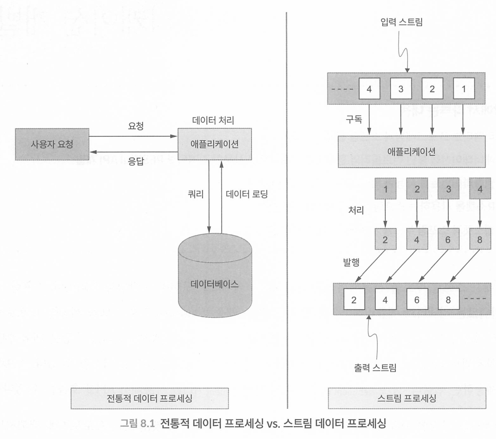

* 전통적 데이터 프로세싱은 요청 도달, 요청 처리, 반환 이다

* 스트림 프로세싱은 애플리케이션이 데이터 스트림을 구독하고, 데이터가 발생하여 획득할 수 있게 되면 구독자가 데이터를 받는다.
* 애플리케이션은 데이터를 처리하고 결과 데이터를 다른 스트림으로 발행한다.


비동기 처리란, 요청에 대한 응답이 올때까지 쓰레드가 기다리지 않고, 응답이 준비됐을 때 스레드가 받아서 처리하는 방식을 의미한다.

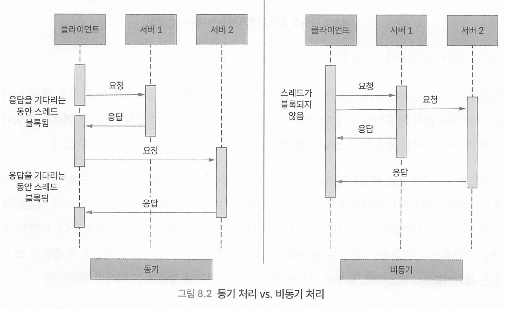

동기 방식에서는 호출하는 스레드가 응답을 기다리는 동안 다른 작업을 처리하지 못하지만, 

비동기 방식에서는 호출하는 스레드가 응답을 기다리지 않고 호출 직후부터 다른 작업을 처리하며, 서버가 응답을 보내면 그때 처리한다.


**현실세계의 비동기 데이터 스트림 예시 - 마우스 클릭 이벤트**

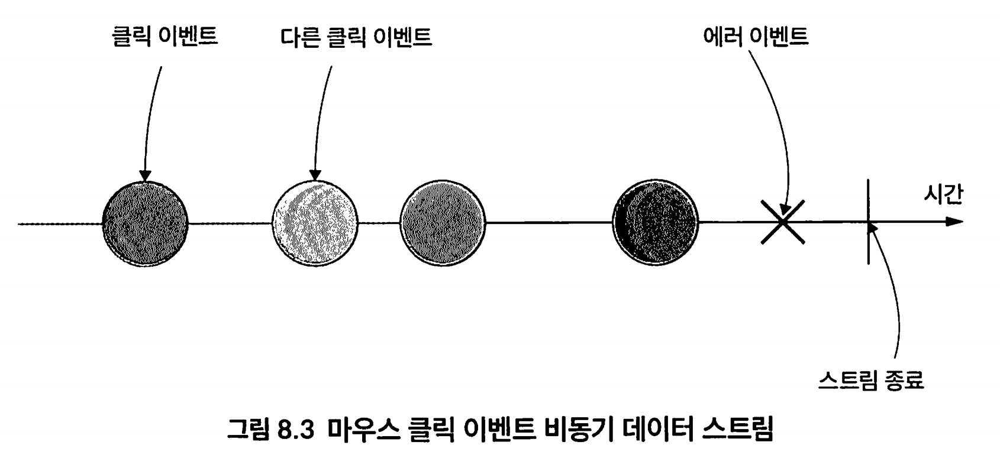

애플리케이션 사용자는 클릭해서 이벤트를 생성하고, 애플리케이션은 이벤트를 관찰하고 반응할 수 있다.

Stream은 시간에 따라 연속으로 발생하는 이벤트다. 

이벤트는 비동기적으로 방출되며 이벤트에 반응해서 이벤트를 처리할 수 있는 함수를 등록해서 이벤트 발생을 기다린다. 

이벤트가 발생하면 값, 에러, 완료 신호를 처리할 수 있는 함수가 실행된다. 

리액티브 프로그래밍에서는 이처럼 

* 이벤트를 기다리는 것을 구독(subscribing)

* 이벤트 발 생을 기다리면서 관찰하는 함수는 옵저버(observer), 

* 관찰할 수 있는 대상인 이벤트를 방출하는 스트림은 옵저버블(observable)이며, 

옵서버 디자인 패턴은 이런 관계를 활용하는 디자인 패턴이다.

* https://github.com/reactive-streams/reactive-streams-jvm/blob/master/README.md
* https://projectreactor.io/docs/core/release/reference/
* https://docs.spring.io/spring-framework/reference/

### 백프레셔

프로듀서 producer와 컨슈머consumer 사이의 bush와 pull 개념을 먼저 살펴보자.


컨슈머는 프로듀서가 만들어내는 이벤트를 구독하고 프로듀서는 컨슈머에게 이벤트를 푸시한다.

컨슈머의 소비율과 프로듀서의 생산율이 같으면 위 구조는 아무런 문제 없이 잘 동작한다. 

하지만 프로듀서의 생산율을 컨슈머의 소비율이 따라가지 못하면 어떻게 될까?

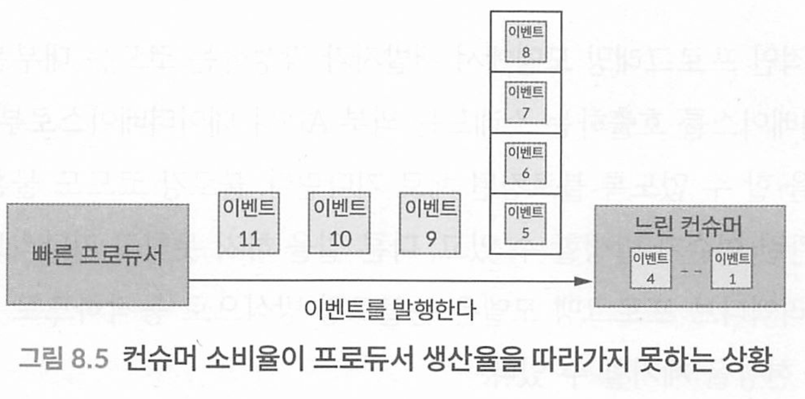

느린 컨슈머는 소비율을 초과해서 들어오는 이벤트를 유한(bounded) 또는 무한 버퍼(unbounded buffer)에 임시로 담아둬야 한다. 

유한 버퍼를 사용한다면 버퍼의 한도를 초과하는 이벤트는 버려진다. 이 경우 프로듀서는 버려진 이벤트를 재전송해야 한다. 

이벤트 재전송에는 추가적인 CPU, 네트워크 오버헤드가 발생하고 재전송을 위한 복잡한 로직도 필요하다. 

무한 버퍼를 사용하면 애플리케이션 메모리가 빠르게 고갈될 수 있으며 결과적으로 애플리케이션은 사용할 수 없는 상태가 된다.

이 문제를 해결하기 위해 `푸시 대신 풀 방식을 선택한다`.


 `풀 방식에서는 컨슈머가 자신의 소비율에 맞게 프로듀서에게 데이터를 요청한다.` 

이렇게 하면 컨슈머가 자신의 상황에 맞게 동적으로 적절한 양의 데이터를 프로듀서로부터 가져올 수 있는데,

`이를 백프레셔 (backpressure)` 라고 부른다.

백프레셔는 리액티브 시스템에서 생산자와 소비자 간의 데이터 흐름을 균형 있게 조절하는 중요한 개념입니다.

- 데이터 생산자(예: 데이터베이스나 다른 서비스)가 데이터를 너무 빠르게 전송하면, 데이터 소비자(예: 사용자 인터페이스나 다른 서비스)가 처리할 수 없게 됩니다.
- 이런 경우에 백프레셔 메커니즘을 사용하면 소비자가 생산자에게 "느리게 해!" 또는 "지금은 데이터를 더 보내지 마!"라고 말할 수 있습니다.

### 리액티브 프로그래밍의 장점

* **논블로킹** - 외부 API나 데이터베이스를 호출하는 스레드는 외부 API나 데이터베이스로부터 데이터가 반환 될 때까지 다른 일을 할 수 없도록 블로킹된 채로 기다린다. 블로킹 코드도 물론 잘 동작하지만 확장성이나 성능 관련 이슈가 발생할 수 있고, 다른 일을 하지 못하고 기다리므로 시스템 자원 낭비를 초래한다. 리액티브는 논블로킹 방식으로 동작하므로 블로킹 코드가 유발 할 수 있는 병목 현상을 제거할 수 있다.
* **JVM에서 동작하는 더 나은 비동기 프로그래밍 모델** 
  * 자바에서는 콜백(callback)과 퓨처(future) 방식으로 비동기 프로그래밍에 접근한다. 콜백 방식에서는 결과를 받으면 실행되는 콜백 파라미터를 비동기 메서드에 추가로 전달한다. 퓨처 방식에서는 비동기 메서드는 호출되는 즉시 `Futuers<T>`를 반환한다. 비동기 메서드가 결과를 받은 이후에만 반환된 퓨처를 통해 결과값을 받아 사용할 수 있다. 
  * 두 가지 방식 모두 단점이 있다. 
  * 비동기 호출이 여러 번 연쇄적으로 필요 한 상황에서는 콜백이 계속 중첩되면서 관리하기가 어려워지는데 이를 callback hell이라고 부른다. 
  * 퓨처는 콜백보다는 상황이 조금 낫긴 하지만 비동기 연산의 조합 관점에서 불편하기는 마찬가지다. 리액티브 프로그래밍 모델은 여러 비동기 연산을 좀 더 매끄럽게 조합할 수 있다.

## 프로젝트 리액터

리액터는 스트림 지향 라이브러리 표준이자 명세인 리액티브 스트림에 바탕을 둔다.

리액터는 시퀀스에 있는 무한한 수의 요소를 처리할 수 있고, 논블로킹 백프레셔를 사용해서 연산자 사이에 요소를 비동기적으로 전달할 수 있다.

```java
public interface Publisher<T> {
    void subscribe(Subscriber<? super T> s);
}

public interface Subscriber<T> {
    void onSubscribe(Subscription s);
    void onNext(T t);
    void onError(Throwable t);
    void onComplete();
}

public interface Subscription {
    void request(long n);
    void cancel();
}

public interface Processor<T, R> extends Subscriber<T>, Publisher<R> {
    // Processor may have additional methods, if required.
}
```

* publisher(발행자): 무한한 수의 요소를 만들어 낼 수 있고 구독자가 요청한 만큼만 발행한다. 
  * Publisher 인터페이스의 subscribe() 메서드를 통해 구독자가 발행자를 구독할 수 있다.
* Subscriber(구독자) : 언제 얼마만큼의 요소를 처리할 수 있을지 결정하고 구독한다. 
  * onSubscribe() 메서드의 파라미터로 구독을 전달받아서 publisher에 데이터를 요청하고 반환받은 데이터를 onNext() 메서드를 사용해서 처리한다.
  * 에러발생시 onError() 메서드로 에러를 처리하고, onComplete() 메서드를 사용해서 처리를 완료한다

* Subscription(구독) : 구독자와 발행자의 관계로, request() 메서드로 데이터를 요청하고 cance()을 통해 구독을 취소한다
* Processor - 프로세서는 처리 단계를 나타내며 publisher, Subscriber 인터페이스를 상속

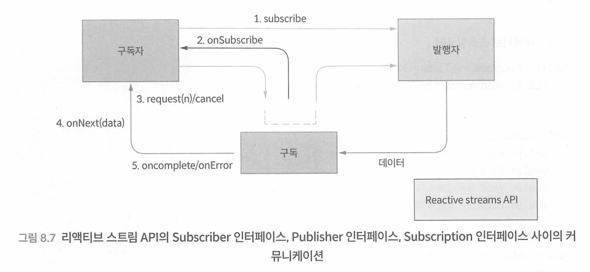

1. 구독자는 Publisher 인터페이스의 subscribe() 메서드를 호출하면서 자신이 구독한다는 사실을 발행자에게 알린다.
2. 발행자는 Subscription을 생성하고 Subscriber 인터페이스의 onsubscribe() 메서드를 호출 해서 구독자에게 전달한다.
3. 구독자는 Subscription 인터페이스의 request() 또는 cancel() 메서드를 호출해서 발행자에 게 데이터를 요청하거나 구독을 취소한다.
4. 발행자는 Subscriber 인터페이스의 onNext(), onComplete(), onError() 메서드를 호출해서 데이터나 에러 또는 완료 신호를 구독자에게 보낸다.

리액터는 Publisher 인터페이스 구현체인 Flux와 Mono라는 타입을 제공한다.

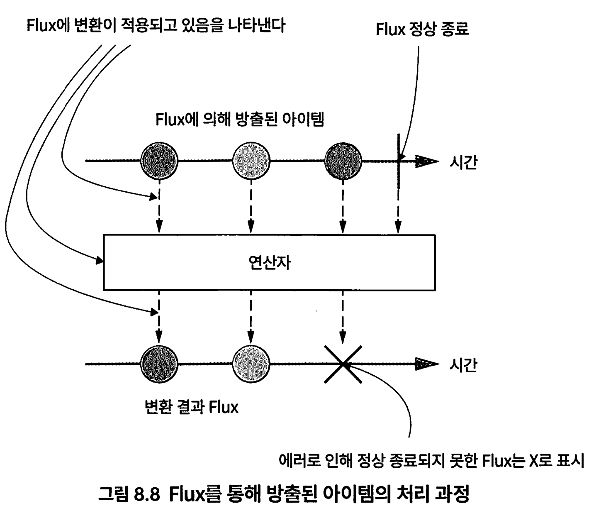

* Flux : 0~N개의 아이템으로 구성된 비동기 시퀀스. 에러나 완료신호를 통해 종결
* Mono : 0~1개의 아이템으로 onNext 시그널을 통해 최대 1개 아이템을 방출(성공 Mono)하거나 에러 (실패 Mono)로 스트림을 종결하는 발행자 

## 스프링 웹플럭스 

애너테이션 컨트롤러 모델과 함수형 엔드포인트라는 두가지 프로그래밍 모델을 가진다

* 애너테이션 컨트롤러 모델은 스프링 MVC와 호환된다
* 함수형 엔드포인트 모델은 람다식 기반의 가변은 함수형 프로그래밍 모델을 제공한다 

```groovy
implementation 'org.springframework.boot:spring-boot-starter-webflux'
implementation 'org.springframework.boot:spring-boot-starter-data-mongodb-reactive'
testImplementation 'io.projectreactor:reactor-test'
```

스프링 웹플럭스에서는 DispatcherHandler가 HTTP 요청을 처리하는 중추 역할을 담당한다. 

 등록된 매퍼와 핸들러에게 요청을 전달해서 처리한다. 

HandlerMapping 인스턴스는 적합한 핸들러 객체에게 요청을 매핑해주는 역할을 담당한다. 

HandlerAdapter는 지원하는 핸들러 객체를 활용해 서 요청을 처리하고 HandlerResult를 반환한다. 

마지막으로 HandlerResultHandler가 HandlerResult를 처리한다.

### Route를 이용한 함수형 엔드포인트

 RouteContext 클래스에 라우트route를 정의한다. 라우트는 CRUD 연산으로 매핑되는 URL을 의미한다.

```java
@Configuration
public class RouterContext {

	@Bean
	RouterFunction<ServerResponse> routes(CourseHandler courseHandler) {
		return route(GET("/courses").and(accept(APPLICATION_JSON)), courseHandler::findAllCourses)
				.andRoute(GET("/courses/{id}").and(accept(APPLICATION_JSON)), courseHandler::findCourseById)
				.andRoute(POST("/courses").and(accept(APPLICATION_JSON)), courseHandler::createCourse)
				.andRoute(PUT("/courses").and(accept(APPLICATION_JSON)), courseHandler::updateCourse)
				.andRoute(DELETE("/courses/{id}").and(accept(APPLICATION_JSON)), courseHandler::deleteCourse)
				.andRoute(DELETE("/courses").and(accept(APPLICATION_JSON)), courseHandler::deleteAllCourses);
	}

}
```

실제 CRUD는 핸들러에게 위임한다

```java
@Component
public class CourseHandler {

	private CourseRepository courseRepository;

	@Autowired
	public CourseHandler(CourseRepository courseRepository) {
		this.courseRepository = courseRepository;
	}

	public Mono<ServerResponse> findAllCourses(ServerRequest serverRequest) {
		Flux<Course> courses = this.courseRepository.findAll();
		return ServerResponse.ok().contentType(APPLICATION_JSON).body(courses, Course.class);
	}

	public Mono<ServerResponse> findCourseById(ServerRequest serverRequest) {
		String courseId = serverRequest.pathVariable("id");
		Mono<Course> courseMono = this.courseRepository.findById(courseId);
		return courseMono.flatMap(course -> ServerResponse.ok().contentType(APPLICATION_JSON).body(fromValue(course)))
				.switchIfEmpty(notFound());
	}
 ...
}
```

*  ServerRequest는 클라이언트의 요청을 담고 있는 서버 측 HTTP 요청 객체다. 모든 과정을 조회해서 Content-typeol application/ json인 과정 목록을 응답 본문으로 ServerResponse에 담는다. ServerResponse는 서버 측 응답 객체다.

* path variable로 넘어온 ID 값으로 과정을 조회해 서 있으면 HTTP 200 OK를, 없으면 HTTP 404 Not Found를 ServerResponse에 담아 반환한다.

### WebClient 커스텀 로깅

```java
public class WebClientApi {
    private final WebClient webClient;

    private static final String BASE_URL = "YourBaseURLHere"; // BASE_URL을 적절하게 설정해주세요.
    private static final String USER_AGENT = "YourUserAgentHere"; // USER_AGENT를 적절하게 설정해주세요.

    public WebClientApi() {
        this.webClient = WebClient.builder()
                .baseUrl(BASE_URL)
                .clientConnector(getClientConnector())
                .defaultHeader(HttpHeaders.USER_AGENT, USER_AGENT)
                .exchangeStrategies(
                        ExchangeStrategies.builder()
                                .codecs(configurer -> configurer.defaultCodecs().maxInMemorySize(30 * 1024 * 1024))
                                .build())
                .filter(logRequest())
                .filter(logResponse())
                .build();
    }

    public ReactorClientHttpConnector getClientConnector() {
        return new ReactorClientHttpConnector(
                HttpClient.create()
                        .followRedirect(true)
                        .compress(true)
                        .secure()
                        .option(ChannelOption.CONNECT_TIMEOUT_MILLIS, 3000)
        );
    }

    private static ExchangeFilterFunction logRequest() {
        return ExchangeFilterFunction.ofRequestProcessor(clientRequest -> {
            System.out.println("Request: " + clientRequest.method() + " " + clientRequest.url());
            clientRequest.headers().forEach((name, values) -> values.forEach(value -> System.out.println(name + ": " + value)));
            return Mono.just(clientRequest);
        });
    }

    private static ExchangeFilterFunction logResponse() {
        return ExchangeFilterFunction.ofResponseProcessor(clientResponse -> {
            System.out.println("Response: " + clientResponse.statusCode());
            clientResponse.headers().asHttpHeaders().forEach((name, values) -> values.forEach(value -> System.out.println(name + ": " + value)));
            return Mono.just(clientResponse);
        });
    }
}

```

## R소켓 (RSocket)

* https://rsocket.io/
* https://github.com/real-logic/aeron

R소켓은 TCP, 웹소켓, 애런Aeron(https://github.com/real-logic/aeron) 같은 프로토콜 위에서 

멀티플렉싱, 듀플렉싱을 지원하는 애플리케이션 프로토콜이다. R소켓은 네 가지 통신 모델을 제공한다.

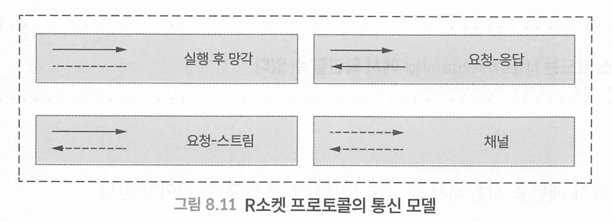

* fire & forget(실행 후 망각) : 클라이언트가 메시지 한개를 전송하고 서버로부터 응답을 기대하지 않는 방식
* request-response(요청-응답) : 클라이언트가 한개의 메시지 전송, 서버로부터 한개로 돌려받음
* request-stream(요청-스트림) : 클라이언트가 한개의 메시지를 전송하고, 서버로부터 여러 메시지를 스트림으로 받음
* channel(채널) : 클라이언트와 서버가 서로 스트림을 주고받는다

R소켓에서는 클라이언트와 서버사이 초기 handShake가 완료된 이후에는 클라,서버가 서로 독립적으로 상호작용 하므로 서로 구별이 사라진다.

**R소켓 프로토콜에서 중요한 몇 가지 키워드와 장점은 다음과 같다.**

- `리액티브 스트림에서 강조하는 스트리밍과 백프레셔` - 요청-스트림 패턴과 채널 패턴에서 streaming 처리를 지원하고, 네 가지 패턴 모두에서 백프레셔를 사용할 수 있다. 이를 통해 요청하는 쪽에서 응답이 들어오는 속도를 조절할 수 있고, 네트워크 계층 혼잡 제어나 네트워크 수준 버퍼링에 대한 의존도를 낮출 수 있다.
- 요청 스로틀링(throttling) - LEASE 프레임을 전송하면 특정 시점에 상대방 쪽에서 수용할 수 있는 요청의 총 개수를 제한할 수 있다
- 대용량 메시지의 분할(frgmentation) 및 재조립(reassembly)
- 생존신호(heartbeat) 메시지를 통한 keepalive 유지


Spring에서는 spring-messaging 모듈을 통해 R소켓 프로토콜을 지원한다.

```groovy
dependencies {
    implementation 'org.springframework.boot:spring-boot-starter-rsocket
    testImplementation 'io.projectreactor:reactor-test'
}

```

application.yml 파일을 작성해서 R소켓 서버 포트와 지연 초기화를 설정 한다.

````yaml
spring:
  rsocket:
    server:
      port: 7000
  main:
    lazy-initialization: true

````

 RSC는 R소켓 엔드포인트를 호출할 수 있는 명령행 도구다. 설치 방법은 https://github.com/making/rsc를 참고하자

* m1의 경우 https://github.com/HomoEfficio/dev-tips/blob/master/Mac-Silicon-homebrew-Intel-x86_64.md

```shell
이거 상당히 귀찮으므로 다음 방법을 이용하자 
```

RSC 대신에 spring-messaging에서 제공하는 RSocketRequester를 사용해서 소켓 엔 드포인트를 호출하는 방법을 알아보자

```java

@SpringBootTest
class RsocketApplicationTests {
	private static RSocketRequester requester;

	@BeforeAll
	static void setUpOnce(
		@Autowired RSocketRequester.Builder builder,
		@LocalRSocketServerPort Integer port,
		@Autowired RSocketStrategies rSocketStrategies) {
		// 초기 설정 메소드
		requester = builder.tcp("localhost", port);
	}

	@Test
	void testRequestResponse() {
		// 요청-응답 테스트: Spring이라는 코스를 요청하고, 응답을 검증합니다.
		Mono<Course> courseMono = requester.route("request-response")
										   .data(new Course("Spring"))
										   .retrieveMono(Course.class);

		StepVerifier.create(courseMono)
					.consumeNextWith(course -> assertThat(course.getCourseName()).isEqualTo("Your course name: Spring"))
					.verifyComplete();
	}

	@Test
	void testFireAndForget() {
		// Fire-and-Forget 테스트: 요청을 보내고, 어떠한 응답도 기다리지 않습니다.
		Mono<Course> courseMono = requester.route("fire-and-forget")
										   .data(new Course("Spring"))
										   .retrieveMono(Course.class);

		StepVerifier.create(courseMono)
					.verifyComplete();
	}

	@Test
	void testRequestStream() {
		// 요청 스트림 테스트: Spring이라는 코스에 대한 스트림 요청을 보내고, 응답 스트림을 검증합니다.
		Flux<Course> courseFlux = requester.route("request-stream")
										   .data(new Course("Spring"))
										   .retrieveFlux(Course.class);

		StepVerifier.create(courseFlux)
					.consumeNextWith(
						course -> assertThat(course.getCourseName()).isEqualTo("Your course name: Spring. Response #0"))
					.expectNextCount(0)
					.consumeNextWith(
						course -> assertThat(course.getCourseName()).isEqualTo("Your course name: Spring. Response #1"))
					.thenCancel()
					.verify();
	}

	@Test
	void testChannel() {
		// 채널 테스트: 설정을 기반으로 스트림 요청을 보내고, 응답 스트림을 검증합니다.
		Mono<Integer> setting1 = Mono.just(2)
									 .delayElement(Duration.ofSeconds(0));
		Mono<Integer> setting2 = Mono.just(1)
									 .delayElement(Duration.ofSeconds(3));

		Flux<Integer> settings = Flux.concat(setting1, setting2);

		Flux<Course> stream = requester.route("stream-stream")
									   .data(settings)
									   .retrieveFlux(Course.class);

		StepVerifier
			.create(stream)
			.consumeNextWith(course -> assertThat(course.getCourseName()).isEqualTo("Spring. Response #0"))
			.consumeNextWith(course -> assertThat(course.getCourseName()).isEqualTo("Spring. Response #0"))
			.thenCancel()
			.verify();
	}

}

```


## 웹소켓

HTTP의 단점을 해결할 목적으로 만들어진 웹소켓 프로토콜(https://datatracker.ietf.org/doc/html/rfc6455)이 나왔다. 

웹소켓은 한 개의 TCP 커넥션상에서 전이중(ull-duplex, 양방향(wo way 의사소통 채널을 만들어 사용할 수 있는 표준 프로토콜이다. 

웹소켓은 양방향 의사소통이 가능하도록 설계됐으므로 다른 우회 방법을 사용할 필요가 없다. 

웹소켓은 HTTP와는 다른 프로토콜이지만 80 포트를 사용하는 HTTP나 443 포트를 사용하는 HTTPS 위에서 동작하도록 설계됐다.

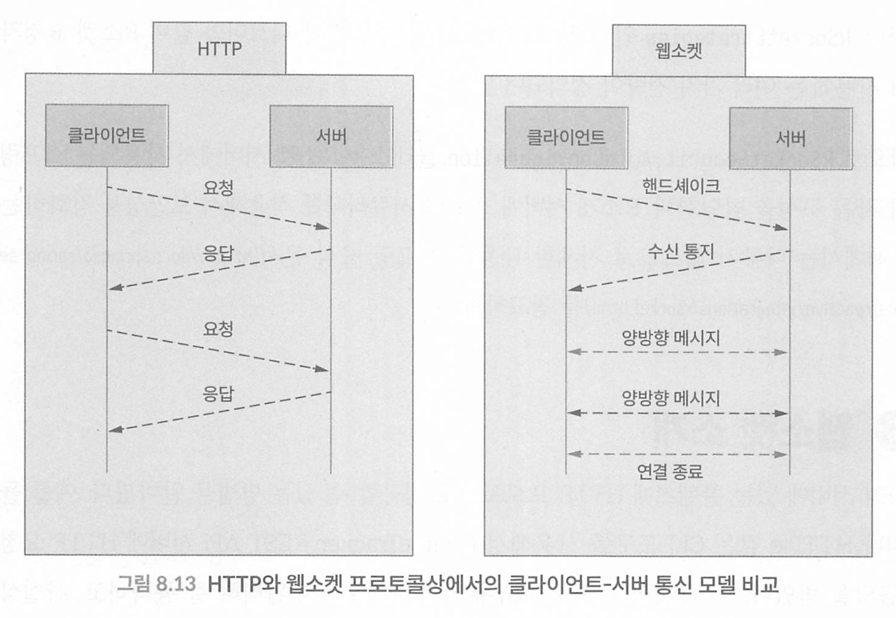

웹소켓에서는 초기 handshake가 성립되면 클라-서버간 서로에게 데이터를 전송할 수 있다.

초기 핸드셰이크에서만 HTTP가 사용되고, 후에는 새로운 TCP/IP 웹소켓 연결로 업그레이드 된다.

웹소켓은 저수준 프로토콜이며 바이트 스트림이 프레임으로 변환되는 방식을 정의한다. 

프레임은 바이너리 메시지나 텍스트 메시지를 포함할 수 있다. 하

지만 메시지에는 라우팅이나 메시지 처리에 대한 추가적인 정보는 포함되지 않는다. 

추가적인 코딩 작업 없이 웹소켓 프로토콜을 있는 그대로 사용하기는 어려운데, 

스프링에서 지원하는 STOMP의 고수준 서브프로토콜로 사용할 수 있다.

```groovy
dependencies {
    implementation 'org.springframework.boot:spring-boot-starter-websocket'
}
```

```java
@Configuration
@EnableWebSocketMessageBroker
public class WebSocketConfiguration implements WebSocketMessageBrokerConfigurer {

	@Override
	public void registerStompEndpoints(StompEndpointRegistry registry) {
		registry.addEndpoint("/ws").withSockJS();
	}
	
	@Override
	public void configureMessageBroker(MessageBrokerRegistry registry) {
		registry.enableSimpleBroker("/topic");
		registry.setApplicationDestinationPrefixes("/app");
	}
}
```

1. StompEndpointRegistry 인터페이스를 사용해서 웹소켓 엔드포인트에 STOMP를 등록한다.
2. MessageBrokerRegistry 클래스를 사용해서 메시지 브로커 옵션을 설정한다.

`registerStompEndpoints()` 메서드는 웹소켓 엔드포인트인 ``/ws`에 STOMP 엔드포인트를 등록한 다. 그리고 withSockJs() 메서드를 호출해서 SockJS 폴백 옵션을 활성화한다. Sockjs(https://github.com/sockjs/sockjs-client)를 사용하면 웹소켓 프로토콜을 지원하지 않는 브라우저에서도 웹소켓이 동작하도록 만들어준다.

`configureMessageBroker` 메서드는 메시지를 주고받을 한 개 이상의 목적지를 가진 인메모리 메시지 브로커를 생성한다. 
예제에서는 /topic으로 시작하는 한 개의 목적지를 생성했다. 

그리고 애플리케이션 목적지 접두어를 /app로 지정했다. 이를 통해 MessagingMapping 애너테이션이 붙어 있는 메서드의 목적지를 필터링할 수 있다.

```java
@Slf4j
@Controller
public class MessageController {

	@MessageMapping("/chat")
	@SendTo("/topic/messages")
	public OutputMessage message(InputMessage message) {
		log.info("Input Message " + message);
		
		return OutputMessage.builder()
							.time(Instant.now(Clock.systemDefaultZone()))
							.content(message.getContent())
							.build();
	}
}
```

@SendTo 애너테이션은 /topic/messages 엔드포인트를 구독하는 모든 클라이언트에게 메시지를 브로드캐스팅한다

이제 메시지를 주고받을 클라이언트 HTML, 페이지를 작성해보자. 
src/main/resources 폴더에 index.html 페이지를 작성한다.

```html
<!DOCTYPE html>
<html lang="en">

<head>
	<meta charset="UTF-8">
	<meta http-equiv="X-UA-Compatible" content="IE=edge">
	<meta name="viewport" content="width=device-width, initial-scale=1.0">
	<title>Spring Boot WebSocket</title>
</head>

<body>
	<label for="message-input">Enter your message</label>
	<input type="text" class="form-control" id="message-input">
	<button type="submit" onclick="sendMessage()">Send</button>
	<ul id="message-list"></ul>
	<script src="https://cdnjs.cloudflare.com/ajax/libs/sockjs-client/1.5.1/sockjs.js"></script>
	<script src="https://cdnjs.cloudflare.com/ajax/libs/stomp.js/2.3.3/stomp.min.js"></script>
	<script src="js/main.js"></script>
</body>

</html>
```

* sockJS와 stomp.js를 CDN으로부터 다운받는다.

다음 main.js파일은 웹소켓 연결을 시작하고 /topic/messages 엔드포인트를 구독한다.

```javascript
// http://localhost:8080/ws에서 WebSocket 연결을 생성합니다.
let sock = new SockJS('http://localhost:8080/ws');

// WebSocket 엔드포인트로 새 StompClient 객체를 생성합니다.
let client = Stomp.over(sock);

// STOMP 통신을 시작하고, CONNECTED 프레임이 도착할 때의 콜백을 제공합니다.
client.connect({}, (frame) => {
    // "/topic/messages"를 구독합니다. 새 메시지가 있을 때마다, 순서 없는 목록에서 list-item 요소에 텍스트를 추가합니다.
    console.log("Frame is: " + frame);
    client.subscribe('/topic/messages', (payload) => {
        let message_list = document.getElementById('message-list');
        let message = document.createElement('li');
        let output = JSON.parse(payload.body);
        message.appendChild(document.createTextNode(output.content + " at " + output.time));
        message_list.appendChild(message);
    });
});

// 메시지를 보내는 함수입니다. HTML 페이지에서 'Send'를 클릭할 때 이 함수가 호출됩니다.
// 'message-input' 텍스트 필드의 값을 가져와서 빈 헤더 ({})로 서버에 전송합니다.
function sendMessage() {
    console.log("Sending message");
    let input = document.getElementById('message-input');
    client.send('/app/chat', {}, JSON.stringify({content: input.value}));
}

```

### 웹소켓 애플리케이션에서 클라이언트와 서버 사이에 핸드셰이크가 일어나는 방법

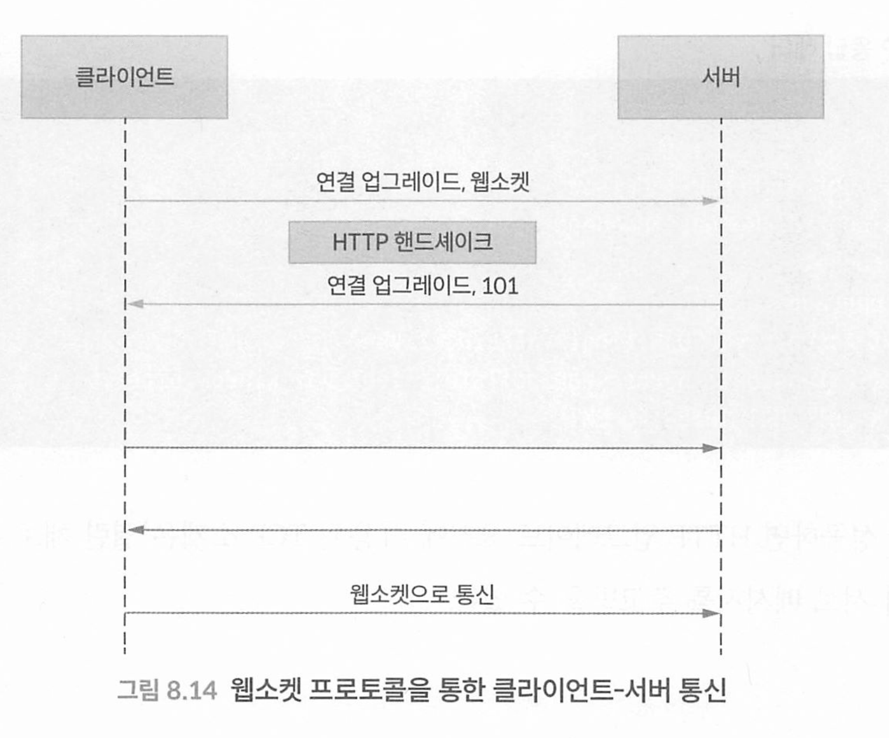

연결이 맺어지는 초기 단계에서 클라이언트는 예제 8.32와 같이 웹소켓 연결을 요청하는 데 필요한 몇 가지 특수 HTTP 헤더를 서버에 보낸다.

```http
GET ws://localhost:8080/ws/257/vktswatd/websocket HTTP/1.1
Host: localhost:8080
Connection: Upgrade
Upgrade: websocket
Origin: http://localhost:8080
Sec-WebSocket-Version: 13
Accept-Encoding: gzip, deflate, br
Accept-Language: en-US, en; q=0.9
Sec-WebSocket-Key: kVE6E10MjfIi4bPZzojWzA==
Sec-WebSocket-Extensions: permessage-deflate; client_max_window_bits
```

* 최초 요청은 HTTP GET 이여야 한다.
* 클라이언트는 웹소켓 프로토콜로 업그레이드 하거나 전환하기 위해 HTTP Upgrade 헤더를 사용해서 서버와 통신을 시작한다.
* 서버가 웹소켓 프로토콜을 지원하면 HTTP 200 OK 대신에 HTTP 101 Switching Protocols 응답코드를 반환한다

```http
HTTP/1.1 101 Switching Protocols
Vary: Origin
Vary: Access-Control-Request-Method
Vary: Access-Control-Request-Headers
Upgrade: websocket
Connection: upgrade
Sec-WebSocket-Accept: VNLDOJwTIhnIFr6XKRZdiCX2VK=
Sec-WebSocket-Extensions: permessage-deflate; client_max_window_bits=15
Date: Wed, 28 Jul 2821 10:30:46 GMT

```

핸드셰이크가 성공하면 HTTP 업그레이드 요청에 사용된 TCP  소켓은 열린채로 유지되고, 클라이언트와 서버가 서로 메시지를 주고 받을 수 있다. 


# CHAPTER 9 스프링 부트 애플리케이션 배포


# CHAPTER 10 스프링 부트와 코틀린, 네이티브 이미지, GraphQ