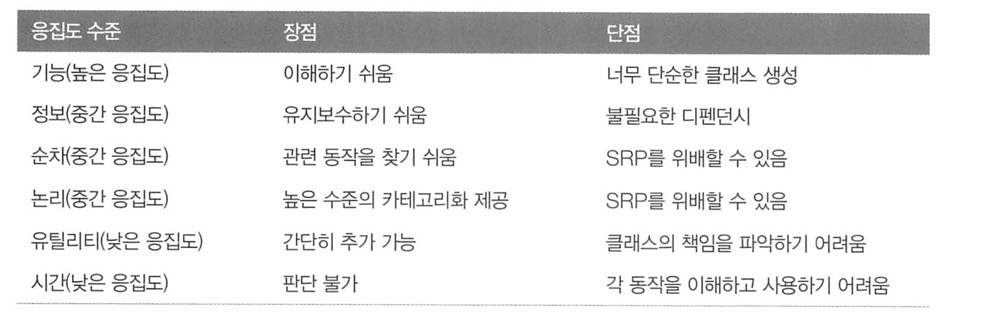

# 실전 자바 소프트웨어 개발


# 2 입출금 내역 분석기 - SRP (단일 책임 원칙)

입출금 내역을 자동으로 분석해 재정 상태를 보여주는 소프트웨어


구현하는 코드가 가졌으면 하는 속성 - 코드 유지보수성

* 특정 기능을 담당하는 코드를 쉽게 찾을 수 있어야 한다.
* 코드가 어떤 일을 수행하는지 쉽게 이해할 수 있어야 한다.

* 새로운 기능을 쉽게 추가하거나 기존 기능을 쉽게 제거할 수 있어야 한다.
* 캡슐화 가 잘 되어 있어야 한다. 즉 코드 사용자에게는 세부 구현 내용이 감춰져 있으므로 사용자가 쉽게 코드를 이해하고 기능을 바꿀 수 있어야 한다. 


단일 책임 원칙 (SRP)는 쉽게 관리하고 유지보수 할 수 있는 코드를 구현하는데 도움을 준다.

* 한 클래스는 한 기능만 책이민다.
* 클래스가 바뀌어야하는 이유는 오직 하나여야 한다.

SRP는 일반적으로 클래스와 메서드에 적용한다.


### 클래스 수준 응집도

다음 과 같은 방법으로 그룹화 한다

* 기능
* 유틸리티
* 정보
* 논리
* 순차
* 시간



### 메서드 수준 응집도

if / else 블록이 여러 개 포함되어 있다면 더 작은 조각으로 메서드를 분리해야 한다.


## 결합도

응집도는 클래스, 패키지, 메서드 등의 동작들의 관련이라면

**결합도는 기능이 다른 클래스에 얼마나 의존하고 있는 지를 가늠한다.**

* 여러 클래스가 서로 어떻게 의존하는가

결합도는 어떤 클래스를 구현하는 데 얼마나 많은 다른 클래스를 참조했는가로 설명할 수 있다.

* 더 많은 클래스를 참조했다면 기능을 변경할 떄 유연성이 그만큼 떨어진다

> ex) 시계
>
> 시계는 어떻게 동작하는지 몰라도 시간을 알아내는데 문제가 없다 
>
> * 사람은 시계 내부 구조에 의존하지 않기 때문, 즉 내부 구조를 바꿔도 시계를 읽는데 문제가 없다.
>
> **인터페이스와 구현이 서로 결합되지 않았기 때문이다**


코드를 구현할 때는 결합도를 낮추고(low coupling) 응집도를 높여야 한다.


## 테스트

테스트 자동화의 장점

**확신**

* 요구사항을 충족하는가, 제대로 동작하는가를 확신할 수 있다.
* 테스트의 규격 사양과 결과를 증거로 전달할 수도 있다.

**변화에도 튼튼함 유지**

* 코드를 바꿨을 때 다른 부분을 망가뜨리지 않는지 알 수 있다.

**프로그램 이해도**

* 소프트웨어의 전체 개요를 빨리 파악할 수 있다.


### 코드 커버리지

* 보통 70 ~ 90%가 적당하다. 게터 세터 처럼 쓸데없는 코드는 테스트할 필요가 없기 때문

* 구문 커버리지 보다는 분기문 (if, while, for)을 확인하는 분기 커버리지를 사용하는 것이 좋다.


## 2. 정리

- 갓 클래스와 코드 중복은 코드를 추론하고 유지보수하기 어렵게 만드는 요인이다.
- 단일 책임 원칙은 관리하고 유지보수하기 쉬운 코드를 구현하는 데 도움을 준다.
- 응집도는 클래스나 메서드의 책임이 얼마나 강하게 연관되어 있는지를 가리킨다.
- 결합도는 클래스가 다른 코드 부분에 얼마나 의존하고 있는지를 가리킨다.
- 높은 응집도와 낮은 결합도는 유지보수가 가능한 코드가 가져야 할 특징이다.
- 자동화된 테스트 스위트는 소프트웨어가 올바로 동작하며, 코드를 수정해도 잘 동작할 것임을 확신할 수 있고, 프로그램을 쉽게 이해할 수 있도록 도움을 준다.

- 자바 테스트 프레임워크로 제이유닛을 활용해 메서드와 클래스의 동작을 테스트하는 유닛 테스트를 만든다.
- 테스트를 쉽게 이해할 수 있도록 Given-When-Then 패턴으로 유닛 테스트를 세 부분으로 분리하는 것이 좋다.


# 3. 입출금 내역 분석기 확장판 - OCP(개방 폐쇄 원칙)


개방 폐쇄 원칙의 장점

* <u>기존 코드를 바꾸지 않으므로 기존 코드가 **잘못될 가능성**</u>이 줄어든다
* 코드가 중복되지 않으므로 기존 코드의 **재사용성이** 높아진다.

* 결합도가 낮아지므로 코드 **유지보수성**이 좋아진다


인터페이스

* 지나치게 인터페이스가 세밀해도 코드 유지보수에 방해가 된다.
* 지나치게 인터페이스가 응집해도 복잡하다

인터페이스의 메서드 이름은 사용자가 쉽게 이해하고 사용하도록 명시적 API로 만드는 것이 합리적인 방법이다.


### 자바의 예외

* checked Exception(확인된 예외) : 회복(recovery)해야하는 예외. throws하거나 try-catch 해야한다
* unchecked Exception(미확인 예외): 언제든 발생할 수 있는 예외. 

### 체크드 익셉션과 언체크드 익셉션을 구분하는 기준

구현하는 API에서 예외가 발생했을 때 프로그램이 정상 동작할것인가를 강제할 것인지를 고민해보자.

* 보통 비즈니스 로직 검증(잘못된 값 , 연산) 등은 언체크드로 한다 -> 불필요한 try-catch를 줄이고 회복(복구)하기 애매한 상황
* 예외를 처리할 수 있는 방법이 명확하지 않으면 언체크드 익셉션을 던지자.
* 불필요하게 체크드 익셉션을 넣지 말자.


### 검증에는 전용 Validator 클래스를 만들자

- 검증 로직을 재사용해 코드를 중복하지 않는다.
- 시스템의 다른 부분도 같은 방법으로 검증할 수 있다.
- 로직을 독립적으로 유닛 테스트할 수 있다.
- 이 기법은 프로그램 유지보수와 이해하기 쉬운 SRP를 따른다.

### 노티피케이션 패턴 (Notification Pattern)

노티피케이션 패턴은 너무 많은 미확인 예외를 사용하는 상황에 적합한 해결책을 제공한다


### 예외로 흐름을 제어하지 말자

```java
try {
	while (true) {
	System.out.printin(source. read());
}
  catch(NoDataException e) {
}
```

* 예외를 처리하느냐 try-catch가 추가되어 가독성이 떨어진다.
* 코드의 이해도가 어려워진다


### null 객체 패턴 (null object pattern)

Optional과 Try 객체가 있다.

* JDK는 Try를 지원하지 않으므로 외부 라이브러리를 이용하자


### 빌드 도구의 장점

메이븐, 그래들 등 

* 프로젝트에 적용되는 공통적인 구조를 제공하기 때문에 동료 개발자가 여러분의 프로젝트를 좀 더 편안하게 받아들인다.

- 응용프로그램을 빌드하고 실행하는 반복적이고, 표준적인 작업을 설정한다.
- 저수준 설정과 초기화에 들이는 시간을 절약하므로 개발에만 집중할 수 있다.
- 잘못된 설정이나 일부 빌드 과정 생략 등으로 발생하는 오류의 범위를 줄인다.
- 공통 빌드 작업을 재사용해 이를 다시 구현할 필요가 없으므로 시간을 절약한다.

### 메이븐 (maven)

* project : pom. xml 파일의 최상위 수준 요소다.

- groupId :  프로젝트를 만드는 조직의 고유 식별자를 지정한다.
- artifactId : 빌드 과정에서 생성된 부산물의 고유한 기본 이름을 지정한다.

* packaging : 부산물에 사용할 패키지 형식(JAR, VAR, EAR 등)을 지정한다. 이 요소를 생략하면 JAR를 사용한다.

*  version : 프로젝트에서 생성하는 부산물 버전을 지정한다.

- build : 플러그인 자원 등 빌드 과정을 가이드하는 다양한 설정을 지정한다.
- dependencies : 프로젝트의 디펜던시 목록을 지정한다.

**메이븐 명령어**

- `mvn clean` : 빌드하기 전에 기존 빌드에서 생성된 부산물을 정리한다.
- `mvn compile` : 프로젝트의 소스코드를 컴파일(기본적으로 생성된 target 폴더에 결과를 저장)한다.
- `mvn test` : 컴파일된 소스코드를 테스트한다.
- `mvn package` : JAR과 같은 적절한 형식으로 컴파일된 코드를 패키징한다.


### 그레이들(Gradle)

그루비, 코틀린 프로그래밍 언어 등을 이용해 도메인 특화 언어(DSL)를 제공한다.

캐시, 컴파일 등 빌드 시간을 단축하는 기능도 지원한다.

**그레이들 명령어**

- `gradle clean` : 이전 빌드에서 생성된 파일을 정리한다.
- `gradle build` : 응용프로그램을 패키징한다.
- `gradle test` : 테스트를 실행한다.
- `gradle run` : application 플러그인의 mainCLassName으로 지정된 메인 클래스를 실행한다.

## 정리

- 개방/폐쇄 원칙을 이용하면 코드를 바꾸지 않고도 메서드나 클래스의 동작을 바꿀 수 있다.
- 개방/폐쇄 원칙을 이용하면 기존 코드를 바꾸지 않으므로 코드가 망가질 가능성이 줄어들며, 기존 코드 의 재사용성을 높이고, 결합도가 높아지므로 코드 유지보수성이 개선된다.
- 많은 메서드를 포함하는 갓 인터페이스는 복잡도와 결합도를 높인다.
- 너무 세밀한 메서드를 포함하는 인터페이스는 응집도를 낮춘다.
- AP의 가독성을 높이고 쉽게 이해할 수 있도록 메서드 이름을 서술적으로 만들어야 한다.
- 연산 결과로 void를 반환하면 동작을 테스트하기가 어렵다.
- 자바의 예외는 문서화, 형식 안정성, 관심사 분리를 촉진한다.
- 확인된 예외는 불필요한 코드를 추가해야 하므로 되도록 사용하지 않는다.
- 너무 자세하게 예외를 적용하면 소프트웨어 개발의 생산성이 떨어진다.
- 노티피케이션 패턴을 이용하면 도메인 클래스로 오류를 수집할 수 있다.
- 예외를 무시하거나 일반적인 Exception을 잡으면 근본적인 문제를 파악하기가 어렵다.
- 빌드 도구를 사용하면 응용프로그램 빌드 테스트. 배포 등 소프트웨어 개발 생명 주기 작업을 자동화할 수 있다.
- 요즘 자바 커뮤니티에서는 빌드 도구로 메이븐과 그레이들을 주로 사용한다.

# 4. 문서 관리 시스템  - LSP 리스코프 치환 원칙

클래스 상속과 인터페이스 구현을 올바르게 사용하도록 도와준다


테스트 위생 : 테스트 대상 코드베이스뿐 아니라 테스트 코드로 깔끔하게 유지하며 유지보수하고 개선해야 한다는 것을 의미

테스트 이름은 다음과 같이 짓는것이 좋다

* 도메인 용어 사용 : 문제 도메인을 설명하거나 응용프로그램에서 문제를 지칭할 때 사용하는 용어를 테스트 이름에 사용
* 자연어 사용 : 일반 문장처럼 쉽게 읽을 수 있도록 해야 한다. 어떤 동작을 쉽게 이해할 수 있도록 묘사하자. 
* 서술적 : 서술적인 좋은 이름을 붙이자


# 5. 비즈니스 규칙 엔진 - TDD

TDD를 왜 사용할까?

- 테스트를 따로 구현하므로 테스트에 대응하는 요구 사항을 한 개씩 구현할 때마다 필요한 요구 사항에 집중하고 개선할 수 있다.
- 코드를 올바르게 조직할 수 있다. 예를 들어 먼저 테스트를 구현하면서 코드에 어떤 공개 인터페이스를 만들어야 하는지 신중히 검토하게 된다.
- TDD 주기에 따라 요구 사항 구현을 반복하면서 종합적인 테스트 스위트를 완성할 수 있으므로 요구 사 항을 만족시켰다는 사실을 조금 더 확신할 수 있으며 버그 발생 범위도 줄일 수 있다.
- 테스트를 통과하기 위한 코드를 구현하기 때문에 필요하지 않은 테스트를 구현하는 일(오버엔지니어링 over engineering)을 줄일 수 있다.


### TDD의 생명주기

1. 실패하는 테스트 구현
2. 모든 테스트 실행
3. 기능이 동작하도록 코드 구현
4. 모든 테스트 실행


유지보수를 위해 리팩토링도 해야한다.


## 인터페이스 분리 원칙 (ISP)

인터페이스 분리 원칙은 어떤 클래스도 사용하지 않는 메서드에 의존성을 갖지 않아야 한다.

* 불필요한 결합을 만들기 때문

ISP는 SRP와 다르게 사용자 인터페이스에 초점을 둔다.

즉 인터페이스가 커지면 인터페이스 사용자는 결국 사용하지 않는 기능을 갖게 되며 이는 불필요한 결합도를 만든다. 

## 플루언트 API

플루언트 API란 특정 문제를 더 직관적으로 해결할 수 있또록 특정 도메인에 맞춰진 API를 가리킨다.

플루언트 API의 메서드 체이닝을 이용하면 더 복잡한 연산도 지정할 수 있다.

* 자바 스트림 API
* 스프링 통합
* JOOQ

## 도메인 모델링

비즈니스 사용자의 편의성을 어떻게 개선할 수 있을까?

어떤 조건이 주어졌을 때 : when

이런 작업을 한다 : then


조건 : 어떤 팩트에 적용할 조건

액션 : 실행할 연산이나 코드 집합

규칙 : 조건과 액션을 합친 것. 조건이 참일 때만 액셩을 실행한다.


# 6. 트우터 (Twootr!)

* 큰 그림을 서로 다른 아키텍처 문제로 쪼개는 방법
* 테스트 더블(모킹)로 코드베이스의 다른 컴포넌트와의 상호작용을 고립하고 테스트하는 방법
* 요구 사항이 응용프로그램 도메인 코어로 이어지도록 뒤집어 생각하는 방법

