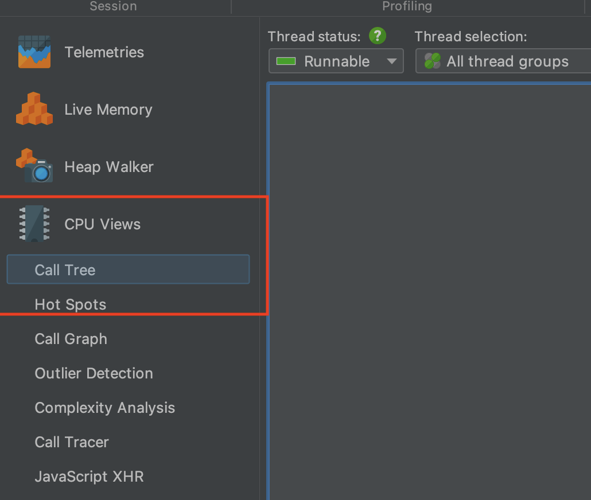
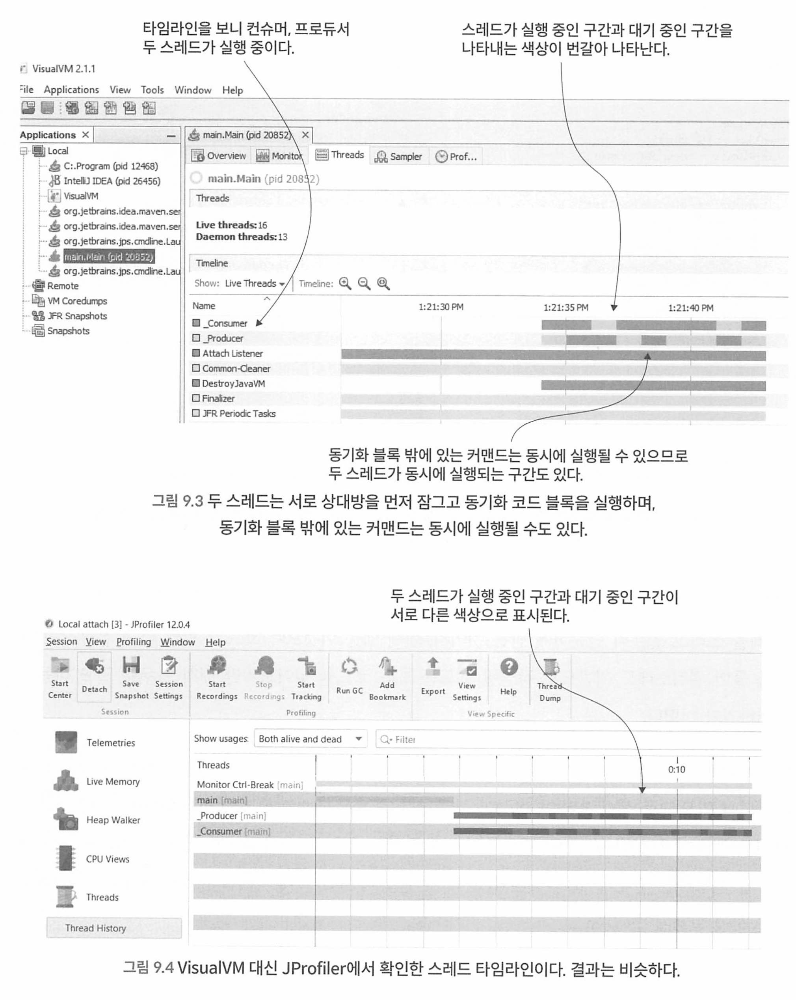

# 자바 잘 읽는법 - Troubleshooting Java


[toc]


# Table of Contents

- [PART I: 트러블슈팅 기본 테크닉](#part-i-트러블슈팅-기본-테크닉)
  - [CHAPTER 1: 앱에서 모호한 부분 밝히기](#chapter-1-앱에서-모호한-부분-밝히기)
  - [CHAPTER 2: 디버깅 기법으로 앱 로직 이해하기](#chapter-2-디버깅-기법으로-앱-로직-이해하기)
  - [CHAPTER 3: 고급 디버깅 기법으로 문제의 근본 원인 찾기](#chapter-3-고급-디버깅-기법으로-문제의-근본-원인-찾기)
  - [CHAPTER 4: 원격 앱 디버깅](#chapter-4-원격-앱-디버깅)
  - [CHAPTER 5: 로그를 활용하여 앱 동작 감시하기](#chapter-5-로그를-활용하여-앱-동작-감시하기)

- [PART II: 트러블슈팅 고급 테크닉](#part-ii-트러블슈팅-고급-테크닉)
  - [CHAPTER 6: 프로파일링 기법으로 리소스 사용 문제 파악하기](#chapter-6-프로파일링-기법으로-리소스-사용-문제-파악하기)
  - [CHAPTER 7: 프로파일링 기법으로 숨겨진 이슈 찾기](#chapter-7-프로파일링-기법으로-숨겨진-이슈-찾기)
  - [CHAPTER 8: 프로파일링한 데이터에 고급 시각화 도구 적용하기](#chapter-8-프로파일링한-데이터에-고급-시각화-도구-적용하기)
  - [CHAPTER 9: 멀티스레드 아키텍처의 락 문제 조사하기](#chapter-9-멀티스레드-아키텍처의-락-문제-조사하기)
  - [CHAPTER 10: 스레드 덤프로 데드락 문제 조사하기](#chapter-10-스레드-덤프로-데드락-문제-조사하기)
  - [CHAPTER 11: 앱 실행 중 메모리 관련 이슈 찾기](#chapter-11-앱-실행-중-메모리-관련-이슈-찾기)

- [PART III: 대규모 시스템의 트러블슈팅](#part-iii-대규모-시스템의-트러블슈팅)
  - [CHAPTER 12: 대규모 시스템에 배포된 앱의 동작 조사하기](#chapter-12-대규모-시스템에-배포된-앱의-동작-조사하기)

- [APPENDIX A: 이 책에서 사용한 도구](#appendix-a-이-책에서-사용한-도구)
- [APPENDIX B: 프로젝트 열기](#appendix-b-프로젝트-열기)
- [APPENDIX C: 기타 참고 도서](#appendix-c-기타-참고-도서)
- [APPENDIX D: 자바 스레드 이해](#appendix-d-자바-스레드-이해)
- [APPENDIX E: 자바 메모리 관리 체계](#appendix-e-자바-메모리-관리-체계)


# PART I 트러블슈팅 기본 테크닉

## CHAPTER 1 앱에서 모호한 부분 밝히기
### 1.1 앱을 더 쉽게 이해하는 방법

디버그 : 버그를 집어내다. 에러를 제거하다.

어떤 문제를 조사하는것뿐만아니라, 코드가 어떻게 동작하는지 정확하게 이해하는 행위. 구조가 복잡한 요즘 앱의 작동 방식을 이해하거나 새로운 기술을 배우기 위한 목적도 있다.

코드를 분석하는 이유

* 문제를 찾아낸다
* 기능이 어떻게 동작하는지 분석한다. 그래야 개선할 수 있다.
* 기술 또는 라이브러리를 학습한다. 

## CHAPTER 2 디버깅 기법으로 앱 로직 이해하기
### 2.1 코드 분석만으로는 불충분한 경우
### 2.2 디버거를 이용한 코드 조사
디버거를 언제 사용해야 할까? -> 지금 내가 조사하려는 로직을 먼저 파악한다. 어느부분에서 조사를 원하는지를 먼저 파악해야 한다. 


디버거 없이 먼저 코드를 읽고 이해할 수 있는지 확인하고 문제가 되는 지점부터 디버깅을 시작하는것이 좋다.

그래야 디버거 없이도 어떤 로직이 무슨일이 일어나는지 알수 있으므로 시간이 절약된다.

* 코드의 맥락, 어떤기능을 하는지 모르는데 디버거를 돌리면 무슨 소용이 있을까? 


#### 2.2.1 실행 스택 트레이스란 무엇이고 어떻게 사용해야 할까?

현재 실행 중인 점에서 프로그램의 호출 스택에 있는 모든 함수 호출 정보를 추적하는 기록.

스프링에서는 Aspect로 분리된 코드를 사용한 경우, 호출 체인목록에서 Aspect코드는 볼 수 없다. 


* 가장 아래 Main 클래스의 main 메서드가 Decoder의 decode()를 호출하고 다시 extractDigits()을 호출한다 

* 스택 트레이스의 맨 아래는 현재 스레드가 시장되기 시작한곳. 

**Apsect는 왜 디버깅하기 힘들까?**


그러나 Apsect 관련 클래스에 브레이크 포인트를 찍게 되면 해당 브레이크 포인트에 멈춘다. 

#### 2.2.2 디버거로 코드 탐색하기

다음은 디버거로 코드를 탐색하는 세 가지 기본 기술이다.

- 스텝 오버(step over): 동일한 메서드에서 다음 코드 라인으로 계속 실행한다.
  - 단축키 F8
- 스텝 인투(step into): 현재 라인에서 호출된 메서드 중 하나의 내부에서 실행을 계속한다.
  - 메서드의 내부 로직을 보고싶을때 사용 
  - 단축키 F7
- 스텝 아웃(step out): 조사하던 메서드의 나머지 부분을 실행하고, 호출한 상위  메서드로 실행을 되돌린다.
  - 현재 메서드의 호출 결과를 확인하고 싶을때 사용 
  - 단축키 Shift + F8


* 스텝 아웃시 이전스택으로 돌아가면서 현재 실행중이던 메소드의 스택 레이어가 사라진다.
* 스텝 인투시 메소드 내부 로직을 보여주므로 새로운 플랜이 생겨 스택 레이어가 많아진다.
* 스텝 오버시 해당 레이어가 종료되거나 예외가 발생할경우 플랜이 닫힌다. 

### 2.3 디버거로도 충분하지 않다면


성능 문제의 경우 디버거로 조사할 수 없는 특수한 종류의 문제다. 

또한 앱에 문제가 생겨 실행 중단된 경우 스레드 또는 힙덤프로 조사해야 한다. 

## CHAPTER 3 고급 디버깅 기법으로 문제의 근본 원인 찾기
### 3.1 조건부 브레이크포인트로 조사 시간 최소화
디버깅 중 특정 상황에서 조건을 만족할 때 브레이크가 걸리길 원한다면 조건부 브레이크 포인트를 쓸 수 있다.

조건부 브레이크 포인트를 걸려면 해당 조건은 true/false로 평가되는 표현식이어야 한다. 

브레이크포인트에 sum ==0이라는 조건식을 넣으면 디버거는 이에 따라 sum 변숫값이 0인 경우에 만 실행을 중단한다

> 만약 사용자 계정 상태 업데이트시 isActive 상태가 false로 바뀌는 시점을 디버깅 하고싶다면 ?


* 브레이크 포인트를 찍고 브레이크 포인트를 우클릭 해서 조건을 넣는다. 

  

### 3.2 실행을 중단시키지 않고도 브레이크포인트를 사용하는 방법

실행을 중단하지 않고 조건부 브레이크를 이용해서 메시지를 출력시킬 수 있다. 

디버거는 브레이크포인트를 찍은 라인에 닿을 때마다 메시지를 기록한다


### 3.3 조사 시나리오를 동적으로 변경하기

실행시간이 긴 프로세스의 문제점을 조사하는 경우나 실행이 매우 빠르지만 로컬환경에서만 재현할 수 없는경우에 해결할 수 있는 방법이 있다. - >원격 디버깅으로 가능 

### 3.4 조사 케이스를 되감기
실행한 코드를 디버거로 되돌릴 수 있다. 이를 execution frame dropping 이라고 한다 . 

실행 프레임을 드롭한다는 것은, 실행 스택 트레이스에서 한 레이어 뒤로 간다는 뜻이다. 

예를 들어, 어떤 메서드에 스텝 인투했다가 다시 되돌아가고 싶을 때, 실행 프레임을 삭제하면 메서드가 호출됐던 위치로 돌아가는 것이다.

현재 실행 프레임을 드롭하려면 실행 스택 트레이스에서 메서드 레이어를 선택하고 마우스 오른쪽 버튼을 클릭한 후 Reset Frame을 선 택한다.


앱의 내부 메모리 밖에서 값을 변경하는 커맨 드를 실행하면, 이를테면 다음과 같은 경우에는 프레임을 드롭해도 해당 변경분은 되돌릴 수 없다.

- DB에 있는 데이터를 수정한다(INSERT, UPDATE, DELETE).
- 다른 Rest API를 호출한다. 
- 파일 시스템을 변경한다(파일 생성, 삭제, 변경).
- 다른 앱을 호출하여 해당 앱의 데이터를 변경한다.
- 다른 앱이 읽는 큐에 메시지를 추가해서 해당 앱의 데이터를 변경한다.
- 이메일 메시지를 전송한다.

## CHAPTER 4 원격 앱 디버깅
### 4.1 원격 디버깅이란?

앱을 배포하면 환경이 매우 다르다. (개발, 스테이징 운영)

이럴때 문제가 생기면 조사하기 힘들다. 이때 원격 디버깅을 이용해서 문제를 추적할 수 있다.

* 그러나 프로덕션에서는 원격 디버깅을 사용해서는 안된다. 

원격 디버깅 사용시 agent라는 소프트웨어를 앱에 부착해야하는데 다음과 같은 문제가 발생할 수 있으므로 프로덕션에서는 주의해야 한다.

- 에이전트 때문에 앱 실행 속도가 느려질 수 있다. 속도가 느려지면 예기치 않은 성능 문제가 발 생할 수 있다.
- 에이전트가 디버거 도구와 통신하려면 네트워크를 통해야 하는데, 특정 포트를 오픈하는 과정 에서 보안 취약 요소가 발생할 수 있다.
- 앱의 어떤 부분을 다른 곳에서 동시 사용 중일 경우, 해당 코드를 디버깅하면 전체적인 기능에 간섭을 일으킬 수 있다.
- 디버깅을 하다가 앱이 무한정 차단돼서 프로세스를 재시작해야 할 때도 있다.

### 4.2 원격 환경에서 조사하기
#### 4.2.1 시나리오

UAT (유저 인수테스트 환경) 환경에서 API 호출시 응답코드는 200이지만 앱은 아무 데이터를 리턴하지 않는문제. 

#### 4.2.2 원격 환경의 문제 조사하기
원격 디버깅할 앱은 커맨드라인에서 앱 실행시 -agentlib:jdwp 매개변수를 추가하여 디버거 에이전트를 연결시켜야 한다.

디버거 에이전트는 서버처럼 작동하면서 디버거 도구가 설정된 포트에 접속해서 디버깅 작업을 수행할 수 있다.

```shell
java -jar -agentlib:jdwp=transport=dt_socket,server=y,suspend=n,address=*:5005 app.jar
--------------------
- agentlib:jdwp : jdwp 에이전트를 통해 디버거와 통신채널을 연다
transport=dt_socket : 앱과 디버거 TCP/IP 통신을 한다
server=y : 디버거를 리스닝 하는 앱에 에이전트를 부착한다
suspend=n : 디버거가 부착되길 기다리지않고 앱을 바로 실행시킨다
address=*:5005: 에이전트가 디버거와 통신하기 위해 여는 포트 정의한다 
```


실행시 에이전트 5005를 리스닝중이라는 메시지가 출력된다.


Intelli) 환경에서 원격 앱에 디버거로 접속하는 방법을 알아보자. 원격 환경에서 실행 중 인 앱에 디버거로 접속하는 절차는 다음과 같다.

1. 실행 구성(running configuration)을 새로 추가한다. 구성 항목중에서 Remote JVM Debug를 선택한다


2. 디버거 에이전트의 원격지 주소(IP 주소 및 포트)를 설정한다

3. 앱 디버깅을 시작한다

이후 디버깅 사용법은 나머지와 같다.

* 그러나 그 코드가 그사이에 변경 추가 삭제 되었을지도 모르고 버전이 다를수도 있다.
* 디버거 화면에 빈 라인 또는 메서드나 클래스 밖 라인까지 탐색할 수도 있다. 스택트레이스도 다를 수 있다.

우리가 앞서 의심하던 이상한 api를 호출하고 브레이크 포인트를 찍어서 추적한다. 

## CHAPTER 5 로그를 활용하여 앱 동작 감시하기
### 5.1 로그를 이용하여 조사하기
일반적인 로그 메시지의 패턴

* 타임스탬프, 심각도(warn, info), 스레드명, 위치, 메시지 


디버거를 사용하여 조사하는 방법은 앱의 현재 실행 상태에 대해 집중하는것이며,

로그를 보면서 조사하는 방법은 과거의 특정 기간에 집중하는것이다. 

#### 5.1.4 멀티스레드 아키텍처에서 커맨드 실행 문제 조사

멀티스레드 앱에서 독립적인 세 스레드(T1,T2, T3)를 명시적으로 동기화하지 않으면 각각의 스레드에서 실행되는 세 커맨드(A, B, C)가 어떤 순서로 실행될지 아무도 모른다.

또한 조사도구를 사용하는순간부터 앱 실행에 간섭을 일으켜 원래 조사하던 코드와 다른 실행이 이어질 수 있따. 


**이때 로그를 사용하면 실행중인 앱에 미치는 영향도를 낮츨 수 있다.** 

### 5.2 로깅을 구현하는 방법
#### 5.2.1 로그 메시지 저장

로그는 다양한곳에 저장할 수 있다.

- 비관계형 DB에 로그 저장
- 파일에 로그 저장
- 관계형 DB에 로그 저장


### 비관계형 DB에 로그 저장

NoSQL DB 사용시 로그를 성능위주로 저장할 수 있다.

그러나 메시지가 소실되거나 기록한 순서대로 저장되지 않을수도 있다. -> 이부분은 로그 메시지에 시간이 있어서 크게 문제되지 않음 

로그를 저장하고 로그 메시지를 조회 검색 분석할 수 있어야 한다.

* ELK, Splunk(유료. 비용이 상당히 비쌈. 사용하기 쉬움 )

#### 파일에 로그 저장

속도도 떨어지고 데이터를 검색하기 어렵기 때문에 별로다.

#### 관계형 DB에 저장

일관성 보장해서 메시지가 소실될일이 별로 없지만 성능 저하라는 비용이 수반된다.

#### 5.2.2 로깅 레벨을 정의하고 로깅 프레임워크를 사용하는 방법

일반적으로 사용되는 로그 레벨은 다음과 같다.

- Error(에러): 아주 중대한 문제가 발생한 것으로, 이런 이벤트는 반드시 기록해야 한다. 보통 자 바 앱에서 처리되지 않은 예외(unhandled exception)는 에러로 기록된다.
- Warn(경고): 잠재적으로 에러일 수 있으나 앱이 처리한 이벤트다. 예를 들어 타사 시스템과의 데이터 연동이 처음에는 실패했지만 두 번째 시도에는 성공했다면 경고로 기록한다.
- Info(정보): '상시(common)' 로그 메시지. 대부분의 상황에서 앱이 어떻게 작동하고 있는지 이해 하는 데 유용한, 주요한 앱 실행 이벤트를 나타낸다.
- Debug(디버그): Info 메시지만으로 불충분한 경우에 한하여 매우 세분화된(fine-grained) 정보를 남긴다.


1. 자바 스프링 부트의 Default 자바 로깅 프레임워크는 logback이다.  아래와 같이 'org.springframework.boot:spring-boot-starter-web'에는 logback이 기본적으로 구현되어있다. 

```java
dependencies {
	implementation 'org.springframework.boot:spring-boot-starter-web'
}
```

 

기존 자바 로깅 프레임워크인 logback의 종속성을 제거해주어야한다.

```java
configurations {
    all {
        exclude group: 'org.springframework.boot', module: 'spring-boot-starter-logging'
    }
}
```

 

2. Log4j2 프레임워크의 종속성을 추가해준다.

```java
dependencies {
    implementation 'org.springframework.boot:spring-boot-starter-log4j2'
}
```

**/src/main/resources** 경로에 **log4j2.xml** 파일을 만들어 아래와 같이 기본적인 설정을 해준다.

```java
<?xml version="1.0" encoding="UTF-8"?>
<Configuration status="debug" monitorInterval="5">
    <!--공통 속성 설정 -->
    <Properties>
        <Property name="logFileName">log4jFile</Property>
        <Property name="consoleLayout">[%d{yyyy-MM-dd HH:mm:ss}] [%-5p] [%c{1}:%L] - %m%n</Property>
        <Property name="fileLayout">%d [%t] %-5level %c(%M:%L) - %m%n</Property>
    </Properties>

    <!-- Log Appender 설정 -->
    <Appenders>
        <Console name="console" target="SYSTEM_OUT">
            <PatternLayout pattern="${consoleLayout}" />
        </Console>
        <!--ConsoleAppender, RollingFileAppneder -->
        <RollingFile name="file"
                     fileName="logs/${logFileName}.log"
                     filePattern="logs/${logFileName}.%d{yyyy-MM-dd-hh}.log">
            <PatternLayout pattern="${fileLayout}" />
            <Policies>
                <TimeBasedTriggeringPolicy
                        modulate="true"
                        interval="1" /><!-- 시간별 로그 파일 생성-->
            </Policies>
            <DefaultRolloverStrategy max="5" fileIndex="min" > <!-- 롤링 파일 5개 까지 생성 -->
                <Delete basePath="/logs" maxDepth="3">
                    <IfLastModified age="10d" />
                </Delete>
            </DefaultRolloverStrategy>
        </RollingFile>


        <RollingFile name="daily_error"
                     fileName="logs/error/error.log"
                     filePattern="logs/error/error.%d{yyyy-MM-dd}.log">
            <PatternLayout pattern="${fileLayout}" />
            <!--LevelRangeFilter필터를 사용할때에 단일 level의 필터만 허용한다. -->
            <LevelRangeFilter minLevel="WARN" maxLevel="WARN" onMatch="ACCEPT" onMismatch="DENY"/>
            <Policies>
                <SizeBasedTriggeringPolicy size="20 MB" />
            </Policies>
            <DefaultRolloverstrategy>
                <Delete basePath="/logs" maxDepth="3">
                    <IfLastModified age="10d" />
                </Delete>
            </DefaultRolloverstrategy>
        </RollingFile>


    </Appenders>

    <!--TRACE > DEBUG > INFO > WARN > ERROR > FATAL -->
    <!--Log가 찍힐 대상 설정.-->
    <Loggers>
        <!-- 스프링 프레임워크에서 찍는건 level을 info로 설정 -->
        <logger name="org.springframework" level="info" additivity="false" >
            <AppenderRef ref="console" />
            <AppenderRef ref="file" />
        </logger>

        <!-- rolling file에는 debug, console에는 info 분리하여 처리 가능하다. -->
        <logger name="kr.pe.study.logforjava2" level="warn" additivity="true" >
            <AppenderRef ref="daily_error" />
        </logger>

		<!-- ROOT logger-->
        <Root level="info"></Root>
    </Loggers>
</Configuration>
```

- 로거(logger): 어떤 메시지를 어느 어펜더에 기록하는가?
  - info 레벨 이상의 메시지만 기록하다든지, 특정 패키지인 경우에만 기록하다던지 
- 어펜더(appender): 로그 메시지를 어디에 기록하는가?
  - 하나는 콘솔에 기록, 하나는 DB에 저장하는식으로 사용 가능 
- 포매터(formatter): 메시지를 어떻게 출력하는가?

크게 3가지로 이루어져 있다.  

- `<Property/>`   : xml파일에서 사용할 공용 속성 값을 정의한다.
- `<Appender/>`  : StringBuilder에서 사용되는 append와 비슷한 개념이다, 실제로 로그를 작성하는 객체를 정의한다고 생각하면 된다.
- `<Logger/> `    : Appender가 작성한 대상들을 명시해준다.

Appender를 정의 ( 콘솔에 찍는 Appender, 파일에 찍는 Appender )하고 Logger대상들을 명시해주고 어떤 Appender가 일을 할지 정의한다.

#### 5.2.3 로깅 때문에 발생하는 문제와 예방 조치
여러모로 유용한 로그 역시 제대로 다루지 않으면 독이 될 수 있다. 로그 때문에 생길 수 있는 세 가지 문제와 이를 방지하는 방법을 알아보자

- 보안 및 프라이버시 문제: 로그 메시지에 개인정보가 노출된다.
  - 비밀키, 비밀번호, 전화번호 등 개인정보. 
- 성능 문제: 지나치게 큰 로그 메시지를 과도하게 생성하면 문제가 된다.
  - 루프내에서도 로그 메시지를 출력하지 마라. 필요한 메시지만 저장하라 
  - 서비스를 재시작하지 않아도 로깅 레벨이나 메커니즘을 변경가능하도록 하자 -> 스프링 액츄에이터 
- 유지보수 문제: 로그를 남기는 커맨드 때문에 소스 코드의 가독성이 떨어진다.


로그를 남길때 다음것들을 고려하자. 

- 메서드의 인숫값과 리턴값 정도만 남기도록 로깅 코드를 적당히 구현하라.
- 프레임워크를 사용하면 일부 로깅 코드를 메서드에서 디커플링할 수 있다. 예를 들어 스프링에 서 커스텀 애스팩트(custom aspect)4를 이용하면 메서드의 실행 결과(인숫값 + 실행 후 메서드가 리턴한 값)를 기록할 수 있다.

### 5.3 로그와 원격 디버깅

원격 디버깅과 로깅, 이 두 가지 기법을 효과적으로 활용할 수 있도록 각자 할 수 있는 일과 할 수 없는 일을 정리했다.


# PART II 트러블슈팅 고급 테크닉

## CHAPTER 6 프로파일링 기법으로 리소스 사용 문제 파악하기
프로파일러는 실행중인 JVM 프로세스를 가로채서 다음 세부정보를 제공한다.

* CPU와 메모리 같은 리소스가 앱에서 어떻게 소비되는가?
* 실행 중 스레드와 현재 상태는 어떤가
* 실행 중인 코드 및 특정 코드 조각에서 사용하는 리소스는 무엇인가. 

### 6.1 프로파일러는 어떤 경우에 유용할까?

* 비정상적인 리소스 사용량 식별
* 코드의 어느 부분이 실행되는지 찾기
* 앱 실행 속도가 저하되는 문제 파악 

#### 비정상적인 리소스 사용량 식별

리소스가 비정상이면(OOM, 앱 다운) 다음을 의심해볼 수 있다.

* 스레드 문제 : 동기화가 결여되어있거나 동시성문제
  * 스레드 생성하는것도 비용이다. 실제로 윈도우는 1MB 리눅스 유닉스는 2MB다. 이때 스레드 덤프를 이용해 추적해야 한다. 
* 메모리 누수 : 메모리를 수거하지 못하여 앱이 죽는 문제 
  * 객체 레퍼런스를 붙들고 있으면 GC가 수거하지 못하므로 메모리가 부족하게 되어 결국 앱은 죽는다

### 6.2 프로파일러 사용 방법
#### 6.2.1 VisualVM 설치 및 구성

mac os 기준 : https://visualvm.github.io/download.html

* https://zzang9ha.tistory.com/386

```

인텔리제이 VisualVM 설치하기

1. Settings - Plugins - VisualVM 검색 후 Install


2. Settings - VisualVM Launcher 설정 이동

VisualVM executable path 설정 : VisualVM 설치한 경로에 visualvm 프로그램 선택
Custom JDK home path 설정 : JDK 설치되어 있는 경로 선택

각각 Run 과 Debug 아이콘으로 애플리케이션을 실행하면 VisualVM이 실행된다.
```

#### 6.2.2 CPU와 메모리 사용량 관찰


#### 6.2.3 메모리 누수 현상 식별


* List에 계속 객체를 추가해서 GC가 객체를 회수하지 못하고 OOM을 발생시키는 예제

OOM을 방지하는 방법 중 하나는 자바 앱에 할당하는 힙 크기를 조정하는것이다. 최대 힙 크기는 JVM 실행옵션의 -Xmx1G(2G, 4G도 가능)을 주면 된다. -Xms는 최소 힙크기를 줄 수 있다. 


힙 외에도 메타스페이스(클래스 메타데이터가 저장되는 공간)에서도 OOM이 발생할 수 있다. 자바 리플렉션을 사용하는 다이나믹 프록시 등을 사용하다보면 이런문제가 발생할 수 있다. 

메타스페이스도 힙처럼 크기를 지정할 수 있다(-XX:MaxMetaspaceSize=100M)

## CHAPTER 7 프로파일링 기법으로 숨겨진 이슈 찾기
중요한 프로파일링 기법 3가지

- 샘플링을 통해 앱 코드의 어떤 부분이 실행되는지 확인한다.
- 실행을 프로파일링(인스트루멘테이션(instrumentation)이라고도 한다)하여 잘못된 부분을 찾아내 최적화한다.
- 앱을 프로파일링하여 DB와 통신하는 SOL 쿼리를 식별한다(DBMS).


ex) 외부 에이피아이 호출에 오래걸릴때.

* 예제 da-ch7-ex1


애플리케이션 실행시 Append JVM parameter `-Xverify:none` to application 해야 에러 안남.

* https://visualvm.github.io/troubleshooting.html

```
CPU Profiling Fails With "Redefinition failed with error 62"
Description: CPU profiling in the Profiler tab or using the Startup Profiler plugin fails, VisualVM displays message "Redefinition failed with error 62".
Resolution:  Restart the application with the VM argument -Xverify:none to disable classfile verification. You must restart the application to disable classfile verification. You cannot disable verification if the application is running.
```


### 7.1 샘플링으로 실행되는 코드 관찰

1. visual vm을 시작한다.

프로세스 (메인 클래스)를 선택하고 우측 Sampler 탭에서 샘플링을 시작한다.


실행을 샘플링하는 목적은 세 가지다.

- 어떤 코드가 실행되는지 알아낸다: 샘플링을 수행하면 백그라운드에서 어떤 코드가 실행되는지 알 수 있다. 
- CPU 사용량 파악하기: 레이턴시 문제를 조사하면서 어떤 메서드가 실행 시간을 공유하는지 파악한다.
- 메모리 소비량 파악하기: 메모리와 관련된 문제를 분석한다. 메모리 샘플링과 프로파일링은 11장 에서 자세히 설명한다.


2. CPU 버튼을 클릭하여 성능 데이터 샘플링을 시작하면 전체 액티브 스레드 리스트와 해당 스택 트 레이스가 표시된다(그림 7.4). 프로파일러는 프로세스 실행을 가로채서 모든 호출된 메서드와 그 대략적인 실행 시간을 표시한다. 

3.  / demo 엔드포인트를 호출해서 실행된 스레드를 보면 어떤 코드가 호출되었는지 아주 자세하게 나온다. 이들을 하나씩 열어보면 무슨일을 하고 무엇을 호출하는지 알 수 있다. 


### 7.2 프로파일링으로 메서드의 실행 횟수 파악

샘플링을 해도 메서드 호출 횟수는 알 길이 없다.

앱을 한번 실행하는 데 50밀리초밖에 안 걸려도 1,000회 호출해서 샘플링하면 50초가 걸린다.


프로파일링은 리소스가 많이 소모되는 작업이므로 정말 성능이 좋은 시스템이 아닌 한, 만사를 프로파일링하려면 엄청난 시간이 소요될 것이다. 따라서 항상 먼저 샘플링부터 해본 후에 프로파일링 대상을 식별하는 것이 합리적이다.


작은 예제라면 별 문제가 아니겠지만, 규모가 큰 앱에서 프로파일링할 때에는 가급적 가로챌 코드의 범위를 제한하라


코드 범위를 제한하는 방법이다. Profiler 탭의 우측에서 앱의 어느 부분을 가로챌지 지 정한다. 이 예제는 다음과 같이 지정하겠다.

- co.example. t*: con. example 이하 모든 패키지에 속한 코드
- feign.**: feign 이하 모든 패키지에 속한 코드

패키지와 클래스를 필터링하는 구문은 다음과 같이 몇 가지 간단한 규칙을 갖고 있다.

- 각 규칙마다 별도의 라인에 작성한다.
- 싱글 애스터리스크(*)는 패키지를 가리킨다. 예를 들어, com. exampLe.*는 com. examp1e 패키지 의 모든 클래스를 프로파일링 대상으로 지정한다는 뜻이다.
- (``**``)는 패키지와 그 하위 패키지를 모두 가리킨다. 예를 들어 com. example.``**`` 는 com. example 패키지의 모든 클래스와 그 하위 패키지를 의미한다.

* 어떤 클래스 하나만 프로파일링하려면 클래스 풀 네임을 지정한다. 예를 들어 com. example.controllers.DemoController는 DemoController 클래스 하나만 대상으로 한다.


어떤 메소드를 호출하고 무슨 문제가 있는지 다 알수있다. 


### 7.3 프로파일러로 앱이 실제로 실행하는 SQL 쿼리 파악

예제 프로젝트 da-ch7-ex2

앱을 시작하고 CURL이나 포스트맨으로 /products 엔드포인트를 호출한다.


* Productservice 클래스의 getProductNamesforPurchases() 메서드는 PurchaseRepository 클래스의 findA11 ( 메서드를 호출한다.

* ProductService 클래스의 getProductNamesForPurchases() 메서드는 ProductRepository 클래스의 **findProduct()를 10번** 호출한다. (문제 지점 발견 )

> 반드시 샘플링을 먼저 하고 프로파일링을 할것. 

프로 파일러를 사용하면 앱이 DB에 보낸 모든 SOL 쿼리를 알아낼 수 있다. 

CPU 버튼 대신 JDBC 버튼을 클릭하면 SQL 쿼리를 프로파일링할 수 있다.


> 앱이 JDBC 드라이버를 통해 DB에 전달한 SOL 쿼리를 프로파일러가 가로채 보여주므로 앱의 어떤 코드가 어떤 쿼리를 몇 번 실행하는지 쉽게 파악할 수 있다.


* 굿.. 여러번 호출하면 호출한만큼 invocation이 늘어난다 

위 문제는 조인으로 해결할 수 있게 되었다. 

#### 7.3.1 프로파일러로 프레임워크에서 생성되지 않은 SQL 쿼리 식별

JPA의 쿼리도 가로채서 확인할 수 있다. 

경험상 퍼시스턴스 프레임워크가 일으키는 대부분의 문제는 다음과 같이 정리할 수 있다.

- 레이턴시를 유발하는 느린 쿼리: 프로파일러로 실행 시간을 조사하면 쉽게 찾아낼 수 있다.
- 프레임워크가 생성한 다수의 불필요한 쿼리: 개발자 사이에서는 N+ 1 쿼리 문제로 더 잘 알려져 있다. 이 역시 프로파일러를 사용해서 쿼리 실행 횟수를 알 수 있다.
- 잘못된 앱 설계로 발생한 긴 트랜잭션 커밋: CPU를 프로파일링하면 쉽게 발견된다.

아래 properties 옵션을 주면 쿼리를 로그에 출력할 수 있다.

```
spring.jpa.show-sql=true
spring.jpa.properties.hibernate.format_sql=true
logging.level.org.hibernate.type.descriptor.sql=trace
```


> 레이턴시 문제를 조사할 때는 언제나 프로파일러로 시작하는 것이 좋다. 첫 번째 단계는 샘플링이다. sQL 쿼 리 문제가 의심된다면 JDBC에 관한 프로파일링을 수행하라. 문제를 쉽게 이해할 수 있고 필요하다면 디버거나 로그를 사용하여 여러분의 추측을 굳힐 수 있다.

### 요약


- 프로파일러는 앱의 실행을 가로채서 각 스레드의 실행 스택 트레이스, 각 메서드의 실행 시간, 특정 메서드의 호출 횟수 등 실행 중인 코드에 관한 필수 세부 정보를 제공한다.
- 지연 시간 문제를 조사할 때 프로파일러를 사용하는 첫 번째 단계는 샘플링이다. 샘플링은 프로파일러로 많은 세부 정보를 얻지 않고 실행 중인 코드를 가로채는 방법으로, 리소스 소모가 적고 실행의 큰 그림을 그려볼 수 있다.
- 샘플링은 세 가지 필수 세부 정보를 제공한다.
  - 실행되는 코드: 문제를 조사할 때 코드의 어떤 부분이 실행되는지 모를 때가 있는데, 샘플링으로 어느 코드가 실행되는지 파악할 수 있다.
  - 각 메서드의 총 실행 시간: 이 정보를 보면 코드의 어떤 부분이 잠재적인 레이턴시 문제를 일으키는지 짐작할 수 있다.
  - 총 CPU 실행 시간: 코드가 실행 시간을 '작동'하는 데 쓰는지, 아니면 '대기'하느라 낭비하는지 알 수 있다.
- 샘플링만으로도 문제의 원인을 파악하기에 충분하지만 대부분 더 자세한 정보가 필요하다. 실행을 프로파일링하면 보다 구체적인 세부 정보를 얻을 수 있다.
- 프로파일링은 리소스를 많이 소모하는 프로세스다. 실제 앱이라면 전체 코드베이스를 프로파일링한다는 것은 사실상 불가능하기 때문에 프로파일링을 수행하기 전에 조사에 집중할 패키지와 클래스를 필터링해야 한다. 대개 먼저 실행을 샘플링하면 앱의 어느 부분에 집중하는 게 좋을지 알 수 있다.
- 프로파일링으로 얻을 수 있는 필수 세부 정보는 메서드의 호출 횟수다. 샘플링을 해도 메서드의 총 실행 시간은 알 수 있지만, 얼마나 자주 호출되었는지는 모른다. 호출 횟수는 너무 느리거나 잘못 사용되고 있는 메서드를 찾아내는 데 중요한 정보다.
- 앱이 DB로 전송한 SQL 쿼리는 프로파일러로 가로채 가져올 수 있다. 프로파일러는 앱의 퍼시스턴스 레이어 구현에 쓰인 기술과 무관하게 모든 쿼리를 가로챈다. 이 기능은 퍼시스턴스 프레임워크(예: 하이버네이트) 기반으로 DB와 연동되는 앱에서 느린 쿼리를 찾아낼 때 매우 유용하다.

## CHAPTER 8 프로파일링한 데이터에 고급 시각화 도구 적용하기

- 관계형 DB 커넥션 문제 감지
- 호출 그래프를 그려 앱 설계를 더 빠르게 이해
- 플레임 그래프로 앱 실행을 좀 더 쉽게 시각화
- 앱이 NoSOL DB 서버에 보낸 쿼리 분석

실행 스택의 또 다른 표현 형태인 플레임 그래프(flame graph)를 소개한다. 플레임 그래프 역시 앱의 실행을 시각화하는 방법으로, 실행된 코드와 실행 시간을 나타낸다. 동일한 데이터도 다른 관점에서 보면 원하는 바를 더 쉽게 얻게 되는 경우가 있 다. 플레임 그래프는 앱 실행을 다른 시각에서 바라보고 잠재적인 레이턴시 및 성능 문제를 식별 하는 데 유용하다.

### 8.1 JDBC 접속 문제 감지

커넥션을 연결해놓고 해제하지 않아서 누수가 생기는 예제.

샘플링으로부터 시작하고, 이후 프로파일링을 진행하는 것이 좋다.

DB 커넥션 문제의 원인은 다음 둘 중 하나일 것이다.

- 인프라 또는 네트워킹 문제로 앱과 DB 간 통신이 실패한다.

- 다음과 같은 이유 때문에 DB가 앱에 커넥션을 제공하지 않는다.

  - 인증이 실패했다.

  - DB가 줄 수 있는 커넥션을 다 써버렸다.

VisualVM만으로는 JDBC 커넥션을 명확하게 조사할 수 없으므로 JProfilerrㅏ 필요하다 

* 다운로드 : https://www.ej-technologies.com/download/jprofiler/files
* 유료임. 10일 무료 사용가능. 

설치후

1. 좌측 Start Center를 클릭해서 자바 프로세스에 프로파일러를 붙인다 
2. StartCenter 클릭후 QuickAttach 클릭 후 com.example.Main 선택 
3. Start를 누르고 JDBC 커넥션에 대한 세부 정보를 얻을것이므로 인스트루멘테이션(프로파일링)을 선택한다 
4. 좌측의 Databases -> JDBC를 선택하여 실행한다 -> 


5. 요청을 두번 보내본다.
6.  HikariPool-1 - Connection is not available, request timed out after 30007ms.가 발생한다. 

7. Connections 탭에서 생성된 커넥션을 본다. 응답한 후에도 커넥션이 닫혀있지 않다. 

커넥션 리크를 일으킨 코드를 어떻게 찾아낼까? 

JProfiler의 CPU 프로파일링 기능을 켜고 다시 앱 을 실행하면 커넥션마다 자신을 생성한 메서드를 추적할 수 있는 스택 트레이스가 표시된다




기존 커넥션 릭을 일으키는 코드를 커넥션을 닫아주도록 수정해보자

before

```java
public Product findProduct(int id) throws SQLException {
  String sql = "SELECT * FROM product WHERE id = ?";
  Connection con = dataSource.getConnection();
  try (PreparedStatement statement = con.prepareStatement(sql)) {
    statement.setInt(1, id);
    ResultSet result = statement.executeQuery();
    if (result.next()) {
      Product p = new Product();
      p.setId(result.getInt("id"));
      p.setName(result.getString("name"));
      return p;
    }
  }
  return null;
}
```

after

```java
public Product findProduct(int id) throws SQLException {
  String sql = "SELECT * FROM product WHERE id = ?";
  
  try (
      Connection con = dataSource.getConnection();
      PreparedStatement statement = con.prepareStatement(sql)) {
    statement.setInt(1, id);
    ResultSet result = statement.executeQuery();
    if (result.next()) {
      Product p = new Product();
      p.setId(result.getInt("id"));
      p.setName(result.getString("name"));
      return p;
    }
  }
  return null;
}
```

이제 여러번 호출해도 Connection Leaks 탭에는 아무것도 없다.

### 8.2 호출 그래프를 보고 앱의 코드 설계 파악

CPU Views를 활성화 하고 Call Tree에서 특정 스택의 우클릭 후 Show Call Graph 하면 호출 그래프를 볼 수 있다.


### 8.4 NoSQL DB에서의 쿼리 분석

몽고디비, 카산드라, 레디스, Neo4je등 모두 분석이 가능하다. 


몽고디비 docker-compose

```
version: '3.8'
services:
  mongo1:
    image: mongo:latest
    hostname: mongo1
    container_name: mongo1
    restart: always
    environment:
      - MONGO_INITDB_ROOT_USERNAME=root
      - MONGO_INITDB_ROOT_PASSWORD=example
    ports:
      - 27017:27017
    volumes:
      - ./Users/ysk/db/mongo/data:/data/db
      - ./mongodb.key:/etc/mongodb.key
```

몽고디비도 마찬가지로 이벤트마다 관련된 스택 트레이스를 분석해서 트러블 슈팅을 할 수 있다.


## CHAPTER 9 멀티스레드 아키텍처의 락 문제 조사하기 - 183
먼저 부록 D를 읽어볼것 

### 스레드의 수명 주기

**New(시작)**: 인스턴스화 직후(시작되기 전) 스레드의 상태다. 이 상태에서 스레드는 단순 자바 객체로, 앱은 아직 스레드에 정의된 커맨드를 실행할 수 없다.

**Runnable(실행 가능)**: start() 메서드가 호출된 이후다. JVM은 스레드에 커맨드를 실행할 수 있으며, 다음 두 하위 상태(substate) 중 하나로 만든다.

- **Ready(준비)**: 스레드는 실행되지 않지만 JVM은 언제라도 스레드를 실행할 수 있는 상태.
- **Running(실행 중)**: 스레드가 실행 중인 상태. 현재 CPU가 커맨드를 실행하고 있다.

**Blocked(차단됨)**: 스레드가 시작은 되었으나 일시적으로 실행 가능(runnable) 상태가 아닌 경우다. 따라서 JVM은 커맨드를 실행할 수 없다. 이 상태는 스레드를 실행할 수 없도록 일시적으로 JVM에서 스레드를 숨겨 스레드 실행을 제어하려고 할 때 유용하다. 차단된 상태에서 스레드는 다음 하위 상태 중 하나에 있다.

- **Monitored(모니터링됨)**: 스레드가 동기화 블록(동기화 블록의 액세스를 제어하는 객체)의 모니터에 의해 중단되고 해당 블록을 실행하기 위해 해제를 기다리는 상태.
- **Waiting(대기 중)**: 실행 도중 모니터의 wait() 메서드가 호출되어 현재 스레드가 중단된 상태. notify() 또는 notifyAll() 메서드가 호출될 때까지 스레드는 차단된 상태를 유지한다.
- **Sleeping(잠자기)**: Thread 클래스의 sleep() 메서드가 호출되어 현재 스레드를 지정된 시간 동안 중단한다. 중단 시간은 sleep() 메서드에 인수값으로 전달한다. 이 시간이 경과한 후에는 스레드가 다시 실행 가능 상태가 된다.
- **Parked(파킹됨)**: 대기 중 상태와 거의 같다. 누군가 park() 메서드를 호출하면 현재 스레드는 이 상태로 바뀌며, 이후 unpark() 메서드가 호출될 때까지 계속 차단된다.

**Dead(종료됨)**: 스레드는 커맨드 집합을 실행 완료하거나, Error나 Exception 때문에 중단되거나 다른 스레드에 의해 중단될 경우 종료된다. 이렇게 한번 종료된 스레드는 재시작할 수 없다.


누군가 `start()` 메서드를 호출하면 스레드는 New에서 Runnable로 바뀐다.

Runnable 상태가 되면 스레드는 Ready와 Running 사이를 들락날락한다. 어떤 스레드를 언제 실행할지는 JVM이 결정한다.

다음과 같은 경우, 스레드는 Blocked 상태가 될 수 있다.

- `Thread` 클래스의 `sleep()` 메서드가 호출되어 현재 스레드가 일시적으로 차단된다.
- 누군가 `join()` 메서드를 호출하여 현재 스레드가 다른 스레드를 기다리게 만든다.
- 누군가 모니터의 `wait()` 메서드를 호출하여 `notify()` 또는 `notifyAll()` 메서드가 호출될 때까지 현재 스레드의 실행을 중단시킨다.
- 동기화 블록의 모니터는 다른 액티브 스레드가 동기화 블록의 실행을 마칠 때까지 스레드 실행을 중단시킨다.

스레드는 실행을 완료하거나 다른 스레드가 끼어들어 중단되면 Dead(종료) 상태로 바뀐다. Blocked에서 Dead로의 상태 전이는 JVM이 허용하지 않는다. 차단된 스레드를 다른 스레드가 끼어들면 `InterruptedException`이 발생한다.

### 스레드 동기화

1. synchronized block of code (동기화 블록)을 이용해서 한번에 하나의 스레드만 접근가능하게 할 수 있다.

- 블록 동기화(block synchronization): 주어진 코드 블록에 synchronized 수정자(modifier)를 적용한다.
- 메서드 동기화(method synchronization): 메서드에 synchronized 수정자를 적용한다.

모든 동기화 블록에는 두 가지 중요한 구성 요소가 있다.

- 모니터(monitor): 동기화 커맨드의 실행을 관장하는 객체
- 커맨드 블록(block of instruction): 동기화한 실제 커맨드

모니터는 스레드가 동기화 블록에 들어가면 모니터에서 락을 얻는다. 락을 가진스레드가 락을 해제할떄까지 다른 스레드는 동기화 블록에 들어갈 수 없다. 

여러 동기화 블록이 각각 다른 모니터 객체를 사용하면 해당 블록들은 동기화 되지 않는다. 즉. 동시에 실행될 수 있다. 

### wait(), notifyl), notifyAll() 사용

### `wait()`

- **설명**: 현재 스레드를 대기 상태로 전환시키며, 해당 스레드는 모니터 락(monitor lock)을 해제하고 다른 스레드가 모니터 락을 획득할 수 있도록 한다.

- **사용 상황**: 특정 조건이 충족될 때까지 스레드를 일시 중지시킬 때 사용된다. 주로 `synchronized` 블록 내에서 사용된다.

- 예제

  ```java
  synchronized (lock) {
      while (조건) {
          lock.wait();
      }
      // 조건이 충족되었을 때 실행되는 코드
  }
  ```

### `notify()`

- **설명**: 모니터 락을 소유한 스레드가 `wait()`로 대기 중인 스레드 중 하나를 깨운다. 깨운 스레드는 모니터 락을 다시 획득할 수 있을 때 실행을 재개한다.

- **사용 상황**: `wait()`로 대기 중인 스레드를 하나만 깨워야 할 때 사용된다. 주로 `synchronized` 블록 내에서 사용된다.

- 예제

  ```java
  synchronized (lock) {
      lock.notify();
  }
  ```

### `notifyAll()`

- **설명**: 모니터 락을 소유한 스레드가 `wait()`로 대기 중인 모든 스레드를 깨운다. 깨운 스레드들은 모니터 락을 다시 획득할 수 있을 때 실행을 재개한다.

- **사용 상황**: `wait()`로 대기 중인 모든 스레드를 깨워야 할 때 사용된다. 주로 `synchronized` 블록 내에서 사용된다.

- 예제

  :

  ```java
  synchronized (lock) {
      lock.notifyAll();
  }
  ```

wait, notify, notifyAll은 동기화 블록에서만 사용할때만 효과가 있다.

* 이 메서드들이 객체의 모니터(lock)를 사용하여 스레드 간의 협력을 관리하기 때문
* 동기화 블록을 통해 객체의 모니터를 획득하지 않은 상태에서 이 메서드들을 호출하면 `IllegalMonitorStateException`이 발생

### 스레드와 블로킹 객체 동기화하기

JDK에는 스레드 동기화에 특화된 꽤 쓸 만한 도구 세트가 많다. 그중 멀티스레드 아키텍처에서 가 장 널리 알려진 클래스는 다음과 같다.

- Semaphore(세마포어): 주어진 코드 블록을 실행할 수 있는 스레드의 수를 제한할 의도로 사용하는 객체
- CyclicBarrier(사이클릭배리어): 주어진 코드 블록을 실행하기 위해 적어도 특정 개수 이상의 스레드가 액티브 상태인지 확인하는 용도로 쓰이는 객체
- Lock(락): 좀 더 광범위한 동기화 옵션을 제공하는 객체
- Latch(래치): 다른 스레드의 특정 로직이 수행될 때까지 일부 스레드를 대기시키는 목적으로 쓰 이는 객체

### 멀티스레드 아키택처의 문제점

다음과 같은 일반적인 문제를 미리 알아두면 더 빨리 원 인을 파악하고 해결하는 데 도움이 될 것이다.

- 경쟁 상태(race condition): 두 개 이상의 스레드가 공유 자원에 동시에 접근하고, 그 결과가 접근 순서에 따라 달라지는 상황. 이로 인해 데이터 일관성이 깨질 수 있다.
  - ex) arrayList의 갯수가 맞지않거나 재고 정합성이 깨짐 
- 데드락(deadlock): 두 개 이상의 스레드가 서로가 소유한 자원을 기다리면서 무한 대기 상태에 빠지는 상황. 스레드가 서로를 기다리기 때문에 작업이 진행되지 않는다. 
- 리브락(livelock): 두 개 이상의 스레드가 서로 상대방에게 자리를 양보하느라 실제로 아무 작업도 수행하지 못하고 계속 실행되는 상황
- 기아(starvation): 특정 스레드가 지속적으로 자원에 접근하지 못하고 다른 스레드에 의해 계속 차단되는 상황


### 9.1 스레드 락 모니터링

스레드 락은 다음과 같은 스레드 동기화 장치 때문에 발생한다.

* 한 스레드가 리소스를 변경하는 동안 다른 스레드가 리소스에 액세스하지 못하게 한다.
* 다른 스레드가 모두 완료되거나 특정 시점까지 실행된 이후에 특정 스레드의 작업을 재개한다. 

락을 잘못구현하면 성능이 떨어질 수 있으므로 주의해야 한다.


프로파일러로 락을 분석해서 스레드가 어떻게 작동하는지 알아 볼 수 있다.

* 어떤 스레드가 다른 스레드를 잠그는 것일까?
* 스레드가 잠긴 횟수
* 스레드가 실행되지 않고 중단된 시간 

VisualVm을 사용하여 스레드가 실행중인 코드를 보는 예제



### 9.2 스레드 락 분석

스레드 락을 사용하는 앱을 최적으로 구현했는지 확인하고 싶다면, 락을 식별해서 스레드가 차단된 횟수와 시간을 알 수 있는 수단이 필요하다.

프로파일링 절차는 7장에서 배운 것과 동일하다. (샘플링 후 프로파일링 )

1. 샘플링을 통해 앱 실행 중에 발생하는 일을 대략 이해하고 더 자세히 살펴보아야 할 부분이 어느 부분인지 파악한다.
2. 프로파일링을 수행하여 조사하려는 특정 주제와 관련된 세부 정보를 얻는다.


* 예제 사진을 보면, 메서드가 어떤 것을 기다린다면 CPU 시간이 총 실행보다 짧다 (CPU를 할당받지 못했으니까.)

만약 특정 코드의 실행시간을 분석했을 때, 실행 시간이 총 CPU보다 길다리면 어디선가 잠겨서 실행되지 못한것이다.

### 9.3 대기 중인 스레드 분석
대기중인 스레드 (wating thread)는 잠긴 스레드와 다르다. 

모니터는 동기화 코드(sync)블록을 실행하기 위해 스레드를 잠근다. 이때 모니터가 차단된 스레드에게 실행을 재개하라고 알려주긴 어렵다.

하지만 모니터가 스레드를 무한 대기시킨 다음 나중에 해당 스레드의 실행을 언제 재개할지 결정하도록 할 수도 있다.

대기중인 스레드는 처음에 자신을 무한 대기시킨 모니터로부터 알림을 받은 이후에만 다시 실행상태로 돌아갈것이다. 

* 모니터는 자바에서 동기화를 제공하는 기본적인 메커니즘이며, 객체단위로 존재하며 여러 스레드가 동시에 접근할 수 없는 코드 블록이나 메서드를 보호하며 한번에 하나의 스레드만 특정 코드블록을 실행할 수 있도록 보장한다.

>  스레드 A가 특정 작업을 수행하고, 그 결과가 준비될 때까지 스레드 B가 기다려야 하는 상황이다. 
>
> 스레드 B는 `wait()` 메서드를 호출해 스스로를 대기 상태로 만들고, 스레드 A가 `notify()` 또는 `notifyAll()` 메서드를 호출할 때까지 대기한다.

**대기중인 스레드가 다시 실행되는 과정**

1. **스레드가 대기 상태로 전환**:
   - 스레드가 `wait()` 메서드를 호출하면, 이 스레드는 해당 객체의 모니터를 놓고 대기 상태로 전환된다.. 이는 다른 스레드가 해당 객체의 모니터를 획득할 수 있게 한다.
2. **다른 스레드가 알림**:
   - 다른 스레드가 객체의 동기화 블록 내에서 `notify()` 또는 `notifyAll()` 메서드를 호출하면, 대기중인 스레드 중 하나(또는 모두)가 다시 실행 상태로 전환될 준비를 한다. 이 스레드는 모니터를 다시 획득해야 실행을 재개할 수 있다.

```java
class SharedResource {
    public synchronized void waitForNotification() throws InterruptedException {
        System.out.println("Thread " + Thread.currentThread().getName() + " is waiting.");
        wait();  // 현재 스레드를 대기 상태로 만듦
        System.out.println("Thread " + Thread.currentThread().getName() + " is notified and running.");
    }

    public synchronized void notifyThread() {
        System.out.println("Thread " + Thread.currentThread().getName() + " is notifying.");
        notify();  // 대기 중인 스레드 하나를 깨움
    }
}
```

* notfy()메서드는 반드시 sync 블록 또는 메서드 안에서 실행되어야 하며, 대기중인 스레드가 모니터를 얻게 되어 기회를 얻게 되는것이다 ( 바로 스레드가 실행하는것이 아님)


즉 잠긴 스레드와 대기중인 스레드의 차이는,

잠긴 스레드는 특정 리소스를 사용하려고 했지만 그 리소스가 잠금이 걸려 접근할 수 없는 상태의 스레드이며, 리소스를 사용할 수 있을떄까지 차단되어 대기하고

대기중인 스레드는 동기화 블록 내에서 wait()를 스스로 호출하여 스스로 대기상태로 전환되어서 다른 스레드가 notfy() 또는 notifyAll()로 깨울떄가지 대기한다.


> 동기화 블록의 스레드가 자연스럽게 잠겼다가 풀리도록 허용하는것이 wait(), notify()를 호출하는것보다 훨씬 빠르다 

### 요약

## CHAPTER 10 스레드 덤프로 데드락 문제 조사하기
### 10.1 스레드 덤프 수집하기
#### 10.1.1 프로파일러로 스레드 덤프 수집
#### 10.1.2 커맨드 라인에서 스레드 덤프 수집
### 10.2 스레드 덤프를 읽는 방법
#### 10.2.1 일반 텍스트 스레드 덤프
#### 10.2.2 도구를 활용하여 스레드 덤프 읽기
### 요약

## CHAPTER 11 앱 실행 중 메모리 관련 이슈 찾기
### 11.1 샘플링과 프로파일링으로 메모리 이슈 진단
### 11.2 힙 덤프를 수집하여 메모리 누수가 발생하는 곳 찾기
#### 11.2.1 힙 덤프 수집
#### 11.2.2 힙 덤프 읽는 방법
#### 11.2.3 OQL 콘솔에서 힙 덤프 쿼리
### 요약

# PART III 대규모 시스템의 트러블슈팅

## CHAPTER 12 대규모 시스템에 배포된 앱의 동작 조사하기
### 12.1 서비스 간 통신 문제 조사
#### 12.1.1 HTTP 서버 프로브로 HTTP 요청 관찰
#### 12.1.2 HTTP 클라이언트 프로브로 앱이 보낸 HTTP 요청 관찰
#### 12.1.3 소켓의 로 레벨 이벤트 조사
### 12.2 통합 로그 모니터링의 중요성
### 12.3 배포 도구를 조사에 활용하는 법
#### 12.3.1 결함 주입으로 재현하기 곤란한 문제를 비슷하게 모방
#### 12.3.2 미러링 기법을 테스트 및 에러 감지에 활용
### 요약

# APPENDIX A 이 책에서 사용한 도구
# APPENDIX B 프로젝트 열기
# APPENDIX C 기타 참고 도서
# APPENDIX D 자바 스레드 이해
### D.1 스레드란 무엇인가?
### D.2 스레드의 수명 주기
### D.3 스레드 동기화
#### D.3.1 동기화 블록
#### D.3.2 wait(), notify(), notifyAll() 사용
#### D.3.3 스레드 조인
#### D.3.4 정해진 시간 동안 스레드 차단
#### D.3.5 스레드와 블로킹 객체 동기화하기
### D.4 멀티스레드 아키텍처의 일반적인 문제
#### D.4.1 경쟁 상태
#### D.4.2 데드락
#### D.4.3 리브락
#### D.4.4 기아
### D.5 추가 자료

# APPENDIX E 자바 메모리 관리 체계
### E.1 JVM이 앱의 메모리를 구성하는 방법
### E.2 스레드가 로컬 데이터를 저장하는 데 사용하는 스택
### E.3 앱이 객체 인스턴스를 저장하는 데 사용하는 힙
### E.4 데이터 유형을 저장하기 위한 메타스페이스 메모리 위치