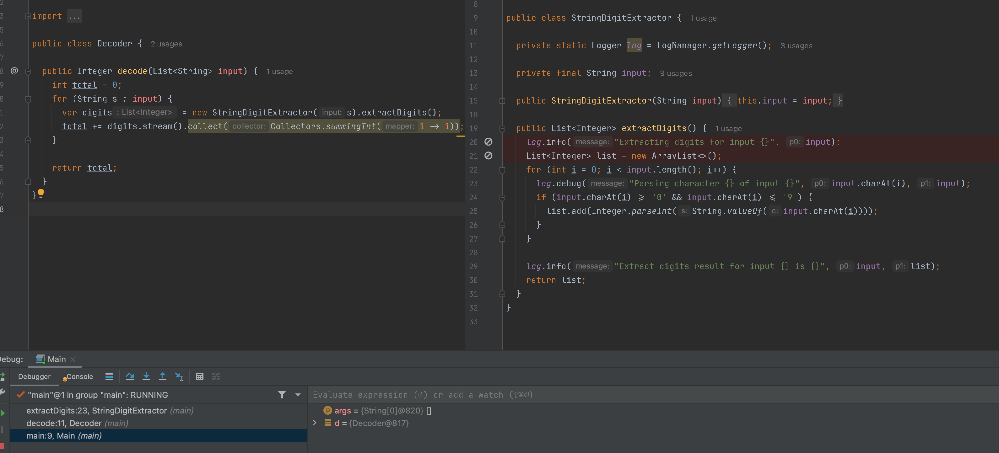
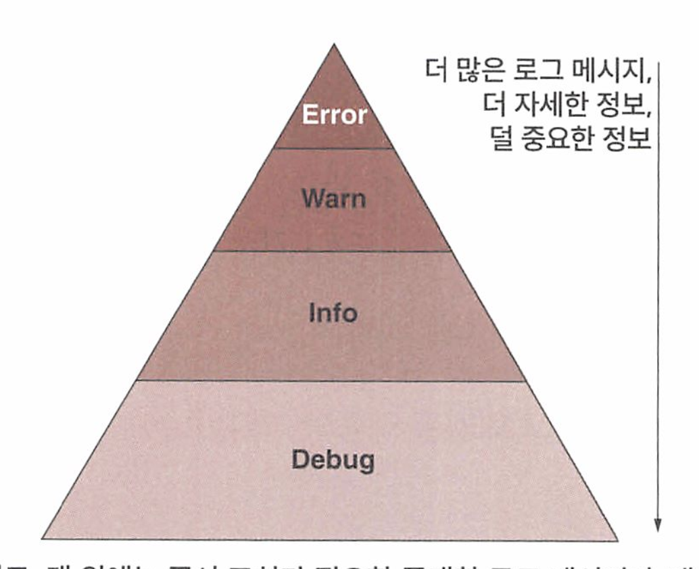

# 자바 잘 읽는법 - Troubleshooting Java


# Table of Contents

- [PART I: 트러블슈팅 기본 테크닉](#part-i-트러블슈팅-기본-테크닉)
  - [CHAPTER 1: 앱에서 모호한 부분 밝히기](#chapter-1-앱에서-모호한-부분-밝히기)
  - [CHAPTER 2: 디버깅 기법으로 앱 로직 이해하기](#chapter-2-디버깅-기법으로-앱-로직-이해하기)
  - [CHAPTER 3: 고급 디버깅 기법으로 문제의 근본 원인 찾기](#chapter-3-고급-디버깅-기법으로-문제의-근본-원인-찾기)
  - [CHAPTER 4: 원격 앱 디버깅](#chapter-4-원격-앱-디버깅)
  - [CHAPTER 5: 로그를 활용하여 앱 동작 감시하기](#chapter-5-로그를-활용하여-앱-동작-감시하기)

- [PART II: 트러블슈팅 고급 테크닉](#part-ii-트러블슈팅-고급-테크닉)
  - [CHAPTER 6: 프로파일링 기법으로 리소스 사용 문제 파악하기](#chapter-6-프로파일링-기법으로-리소스-사용-문제-파악하기)
  - [CHAPTER 7: 프로파일링 기법으로 숨겨진 이슈 찾기](#chapter-7-프로파일링-기법으로-숨겨진-이슈-찾기)
  - [CHAPTER 8: 프로파일링한 데이터에 고급 시각화 도구 적용하기](#chapter-8-프로파일링한-데이터에-고급-시각화-도구-적용하기)
  - [CHAPTER 9: 멀티스레드 아키텍처의 락 문제 조사하기](#chapter-9-멀티스레드-아키텍처의-락-문제-조사하기)
  - [CHAPTER 10: 스레드 덤프로 데드락 문제 조사하기](#chapter-10-스레드-덤프로-데드락-문제-조사하기)
  - [CHAPTER 11: 앱 실행 중 메모리 관련 이슈 찾기](#chapter-11-앱-실행-중-메모리-관련-이슈-찾기)

- [PART III: 대규모 시스템의 트러블슈팅](#part-iii-대규모-시스템의-트러블슈팅)
  - [CHAPTER 12: 대규모 시스템에 배포된 앱의 동작 조사하기](#chapter-12-대규모-시스템에-배포된-앱의-동작-조사하기)

- [APPENDIX A: 이 책에서 사용한 도구](#appendix-a-이-책에서-사용한-도구)
- [APPENDIX B: 프로젝트 열기](#appendix-b-프로젝트-열기)
- [APPENDIX C: 기타 참고 도서](#appendix-c-기타-참고-도서)
- [APPENDIX D: 자바 스레드 이해](#appendix-d-자바-스레드-이해)
- [APPENDIX E: 자바 메모리 관리 체계](#appendix-e-자바-메모리-관리-체계)


# PART I 트러블슈팅 기본 테크닉

## CHAPTER 1 앱에서 모호한 부분 밝히기
### 1.1 앱을 더 쉽게 이해하는 방법

디버그 : 버그를 집어내다. 에러를 제거하다.

어떤 문제를 조사하는것뿐만아니라, 코드가 어떻게 동작하는지 정확하게 이해하는 행위. 구조가 복잡한 요즘 앱의 작동 방식을 이해하거나 새로운 기술을 배우기 위한 목적도 있다.

코드를 분석하는 이유

* 문제를 찾아낸다
* 기능이 어떻게 동작하는지 분석한다. 그래야 개선할 수 있다.
* 기술 또는 라이브러리를 학습한다. 

## CHAPTER 2 디버깅 기법으로 앱 로직 이해하기
### 2.1 코드 분석만으로는 불충분한 경우
### 2.2 디버거를 이용한 코드 조사
디버거를 언제 사용해야 할까? -> 지금 내가 조사하려는 로직을 먼저 파악한다. 어느부분에서 조사를 원하는지를 먼저 파악해야 한다. 


디버거 없이 먼저 코드를 읽고 이해할 수 있는지 확인하고 문제가 되는 지점부터 디버깅을 시작하는것이 좋다.

그래야 디버거 없이도 어떤 로직이 무슨일이 일어나는지 알수 있으므로 시간이 절약된다.

* 코드의 맥락, 어떤기능을 하는지 모르는데 디버거를 돌리면 무슨 소용이 있을까? 


#### 2.2.1 실행 스택 트레이스란 무엇이고 어떻게 사용해야 할까?

현재 실행 중인 점에서 프로그램의 호출 스택에 있는 모든 함수 호출 정보를 추적하는 기록.

스프링에서는 Aspect로 분리된 코드를 사용한 경우, 호출 체인목록에서 Aspect코드는 볼 수 없다. 



* 가장 아래 Main 클래스의 main 메서드가 Decoder의 decode()를 호출하고 다시 extractDigits()을 호출한다 

* 스택 트레이스의 맨 아래는 현재 스레드가 시장되기 시작한곳. 

**Apsect는 왜 디버깅하기 힘들까?**


그러나 Apsect 관련 클래스에 브레이크 포인트를 찍게 되면 해당 브레이크 포인트에 멈춘다. 

#### 2.2.2 디버거로 코드 탐색하기

다음은 디버거로 코드를 탐색하는 세 가지 기본 기술이다.

- 스텝 오버(step over): 동일한 메서드에서 다음 코드 라인으로 계속 실행한다.
  - 단축키 F8
- 스텝 인투(step into): 현재 라인에서 호출된 메서드 중 하나의 내부에서 실행을 계속한다.
  - 메서드의 내부 로직을 보고싶을때 사용 
  - 단축키 F7
- 스텝 아웃(step out): 조사하던 메서드의 나머지 부분을 실행하고, 호출한 상위  메서드로 실행을 되돌린다.
  - 현재 메서드의 호출 결과를 확인하고 싶을때 사용 
  - 단축키 Shift + F8


* 스텝 아웃시 이전스택으로 돌아가면서 현재 실행중이던 메소드의 스택 레이어가 사라진다.
* 스텝 인투시 메소드 내부 로직을 보여주므로 새로운 플랜이 생겨 스택 레이어가 많아진다.
* 스텝 오버시 해당 레이어가 종료되거나 예외가 발생할경우 플랜이 닫힌다. 

### 2.3 디버거로도 충분하지 않다면


성능 문제의 경우 디버거로 조사할 수 없는 특수한 종류의 문제다. 

또한 앱에 문제가 생겨 실행 중단된 경우 스레드 또는 힙덤프로 조사해야 한다. 

## CHAPTER 3 고급 디버깅 기법으로 문제의 근본 원인 찾기
### 3.1 조건부 브레이크포인트로 조사 시간 최소화
디버깅 중 특정 상황에서 조건을 만족할 때 브레이크가 걸리길 원한다면 조건부 브레이크 포인트를 쓸 수 있다.

조건부 브레이크 포인트를 걸려면 해당 조건은 true/false로 평가되는 표현식이어야 한다. 

브레이크포인트에 sum ==0이라는 조건식을 넣으면 디버거는 이에 따라 sum 변숫값이 0인 경우에 만 실행을 중단한다

> 만약 사용자 계정 상태 업데이트시 isActive 상태가 false로 바뀌는 시점을 디버깅 하고싶다면 ?


* 브레이크 포인트를 찍고 브레이크 포인트를 우클릭 해서 조건을 넣는다. 

  

### 3.2 실행을 중단시키지 않고도 브레이크포인트를 사용하는 방법

실행을 중단하지 않고 조건부 브레이크를 이용해서 메시지를 출력시킬 수 있다. 

디버거는 브레이크포인트를 찍은 라인에 닿을 때마다 메시지를 기록한다


### 3.3 조사 시나리오를 동적으로 변경하기

실행시간이 긴 프로세스의 문제점을 조사하는 경우나 실행이 매우 빠르지만 로컬환경에서만 재현할 수 없는경우에 해결할 수 있는 방법이 있다. - >원격 디버깅으로 가능 

### 3.4 조사 케이스를 되감기
실행한 코드를 디버거로 되돌릴 수 있다. 이를 execution frame dropping 이라고 한다 . 

실행 프레임을 드롭한다는 것은, 실행 스택 트레이스에서 한 레이어 뒤로 간다는 뜻이다. 

예를 들어, 어떤 메서드에 스텝 인투했다가 다시 되돌아가고 싶을 때, 실행 프레임을 삭제하면 메서드가 호출됐던 위치로 돌아가는 것이다.

현재 실행 프레임을 드롭하려면 실행 스택 트레이스에서 메서드 레이어를 선택하고 마우스 오른쪽 버튼을 클릭한 후 Reset Frame을 선 택한다.


앱의 내부 메모리 밖에서 값을 변경하는 커맨 드를 실행하면, 이를테면 다음과 같은 경우에는 프레임을 드롭해도 해당 변경분은 되돌릴 수 없다.

- DB에 있는 데이터를 수정한다(INSERT, UPDATE, DELETE).
- 다른 Rest API를 호출한다. 
- 파일 시스템을 변경한다(파일 생성, 삭제, 변경).
- 다른 앱을 호출하여 해당 앱의 데이터를 변경한다.
- 다른 앱이 읽는 큐에 메시지를 추가해서 해당 앱의 데이터를 변경한다.
- 이메일 메시지를 전송한다.

## CHAPTER 4 원격 앱 디버깅
### 4.1 원격 디버깅이란?

앱을 배포하면 환경이 매우 다르다. (개발, 스테이징 운영)

이럴때 문제가 생기면 조사하기 힘들다. 이때 원격 디버깅을 이용해서 문제를 추적할 수 있다.

* 그러나 프로덕션에서는 원격 디버깅을 사용해서는 안된다. 

원격 디버깅 사용시 agent라는 소프트웨어를 앱에 부착해야하는데 다음과 같은 문제가 발생할 수 있으므로 프로덕션에서는 주의해야 한다.

- 에이전트 때문에 앱 실행 속도가 느려질 수 있다. 속도가 느려지면 예기치 않은 성능 문제가 발 생할 수 있다.
- 에이전트가 디버거 도구와 통신하려면 네트워크를 통해야 하는데, 특정 포트를 오픈하는 과정 에서 보안 취약 요소가 발생할 수 있다.
- 앱의 어떤 부분을 다른 곳에서 동시 사용 중일 경우, 해당 코드를 디버깅하면 전체적인 기능에 간섭을 일으킬 수 있다.
- 디버깅을 하다가 앱이 무한정 차단돼서 프로세스를 재시작해야 할 때도 있다.

### 4.2 원격 환경에서 조사하기
#### 4.2.1 시나리오

UAT (유저 인수테스트 환경) 환경에서 API 호출시 응답코드는 200이지만 앱은 아무 데이터를 리턴하지 않는문제. 

#### 4.2.2 원격 환경의 문제 조사하기
원격 디버깅할 앱은 커맨드라인에서 앱 실행시 -agentlib:jdwp 매개변수를 추가하여 디버거 에이전트를 연결시켜야 한다.

디버거 에이전트는 서버처럼 작동하면서 디버거 도구가 설정된 포트에 접속해서 디버깅 작업을 수행할 수 있다.

```shell
java -jar -agentlib:jdwp=transport=dt_socket,server=y,suspend=n,address=*:5005 app.jar
--------------------
- agentlib:jdwp : jdwp 에이전트를 통해 디버거와 통신채널을 연다
transport=dt_socket : 앱과 디버거 TCP/IP 통신을 한다
server=y : 디버거를 리스닝 하는 앱에 에이전트를 부착한다
suspend=n : 디버거가 부착되길 기다리지않고 앱을 바로 실행시킨다
address=*:5005: 에이전트가 디버거와 통신하기 위해 여는 포트 정의한다 
```


실행시 에이전트 5005를 리스닝중이라는 메시지가 출력된다.


Intelli) 환경에서 원격 앱에 디버거로 접속하는 방법을 알아보자. 원격 환경에서 실행 중 인 앱에 디버거로 접속하는 절차는 다음과 같다.

1. 실행 구성(running configuration)을 새로 추가한다. 구성 항목중에서 Remote JVM Debug를 선택한다


2. 디버거 에이전트의 원격지 주소(IP 주소 및 포트)를 설정한다

3. 앱 디버깅을 시작한다

이후 디버깅 사용법은 나머지와 같다.

* 그러나 그 코드가 그사이에 변경 추가 삭제 되었을지도 모르고 버전이 다를수도 있다.
* 디버거 화면에 빈 라인 또는 메서드나 클래스 밖 라인까지 탐색할 수도 있다. 스택트레이스도 다를 수 있다.

우리가 앞서 의심하던 이상한 api를 호출하고 브레이크 포인트를 찍어서 추적한다. 

## CHAPTER 5 로그를 활용하여 앱 동작 감시하기
### 5.1 로그를 이용하여 조사하기
일반적인 로그 메시지의 패턴

* 타임스탬프, 심각도(warn, info), 스레드명, 위치, 메시지 


디버거를 사용하여 조사하는 방법은 앱의 현재 실행 상태에 대해 집중하는것이며,

로그를 보면서 조사하는 방법은 과거의 특정 기간에 집중하는것이다. 

#### 5.1.4 멀티스레드 아키텍처에서 커맨드 실행 문제 조사

멀티스레드 앱에서 독립적인 세 스레드(T1,T2, T3)를 명시적으로 동기화하지 않으면 각각의 스레드에서 실행되는 세 커맨드(A, B, C)가 어떤 순서로 실행될지 아무도 모른다.

또한 조사도구를 사용하는순간부터 앱 실행에 간섭을 일으켜 원래 조사하던 코드와 다른 실행이 이어질 수 있따. 


**이때 로그를 사용하면 실행중인 앱에 미치는 영향도를 낮츨 수 있다.** 

### 5.2 로깅을 구현하는 방법
#### 5.2.1 로그 메시지 저장

로그는 다양한곳에 저장할 수 있다.

- 비관계형 DB에 로그 저장
- 파일에 로그 저장
- 관계형 DB에 로그 저장


### 비관계형 DB에 로그 저장

NoSQL DB 사용시 로그를 성능위주로 저장할 수 있다.

그러나 메시지가 소실되거나 기록한 순서대로 저장되지 않을수도 있다. -> 이부분은 로그 메시지에 시간이 있어서 크게 문제되지 않음 

로그를 저장하고 로그 메시지를 조회 검색 분석할 수 있어야 한다.

* ELK, Splunk(유료. 비용이 상당히 비쌈. 사용하기 쉬움 )

#### 파일에 로그 저장

속도도 떨어지고 데이터를 검색하기 어렵기 때문에 별로다.

#### 관계형 DB에 저장

일관성 보장해서 메시지가 소실될일이 별로 없지만 성능 저하라는 비용이 수반된다.

#### 5.2.2 로깅 레벨을 정의하고 로깅 프레임워크를 사용하는 방법

일반적으로 사용되는 로그 레벨은 다음과 같다.

- Error(에러): 아주 중대한 문제가 발생한 것으로, 이런 이벤트는 반드시 기록해야 한다. 보통 자 바 앱에서 처리되지 않은 예외(unhandled exception)는 에러로 기록된다.
- Warn(경고): 잠재적으로 에러일 수 있으나 앱이 처리한 이벤트다. 예를 들어 타사 시스템과의 데이터 연동이 처음에는 실패했지만 두 번째 시도에는 성공했다면 경고로 기록한다.
- Info(정보): '상시(common)' 로그 메시지. 대부분의 상황에서 앱이 어떻게 작동하고 있는지 이해 하는 데 유용한, 주요한 앱 실행 이벤트를 나타낸다.
- Debug(디버그): Info 메시지만으로 불충분한 경우에 한하여 매우 세분화된(fine-grained) 정보를 남긴다.



1. 자바 스프링 부트의 Default 자바 로깅 프레임워크는 logback이다.  아래와 같이 'org.springframework.boot:spring-boot-starter-web'에는 logback이 기본적으로 구현되어있다. 

```java
dependencies {
	implementation 'org.springframework.boot:spring-boot-starter-web'
}
```

 

기존 자바 로깅 프레임워크인 logback의 종속성을 제거해주어야한다.

```java
configurations {
    all {
        exclude group: 'org.springframework.boot', module: 'spring-boot-starter-logging'
    }
}
```

 

2. Log4j2 프레임워크의 종속성을 추가해준다.

```java
dependencies {
    implementation 'org.springframework.boot:spring-boot-starter-log4j2'
}
```

**/src/main/resources** 경로에 **log4j2.xml** 파일을 만들어 아래와 같이 기본적인 설정을 해준다.

```java
<?xml version="1.0" encoding="UTF-8"?>
<Configuration status="debug" monitorInterval="5">
    <!--공통 속성 설정 -->
    <Properties>
        <Property name="logFileName">log4jFile</Property>
        <Property name="consoleLayout">[%d{yyyy-MM-dd HH:mm:ss}] [%-5p] [%c{1}:%L] - %m%n</Property>
        <Property name="fileLayout">%d [%t] %-5level %c(%M:%L) - %m%n</Property>
    </Properties>

    <!-- Log Appender 설정 -->
    <Appenders>
        <Console name="console" target="SYSTEM_OUT">
            <PatternLayout pattern="${consoleLayout}" />
        </Console>
        <!--ConsoleAppender, RollingFileAppneder -->
        <RollingFile name="file"
                     fileName="logs/${logFileName}.log"
                     filePattern="logs/${logFileName}.%d{yyyy-MM-dd-hh}.log">
            <PatternLayout pattern="${fileLayout}" />
            <Policies>
                <TimeBasedTriggeringPolicy
                        modulate="true"
                        interval="1" /><!-- 시간별 로그 파일 생성-->
            </Policies>
            <DefaultRolloverStrategy max="5" fileIndex="min" > <!-- 롤링 파일 5개 까지 생성 -->
                <Delete basePath="/logs" maxDepth="3">
                    <IfLastModified age="10d" />
                </Delete>
            </DefaultRolloverStrategy>
        </RollingFile>


        <RollingFile name="daily_error"
                     fileName="logs/error/error.log"
                     filePattern="logs/error/error.%d{yyyy-MM-dd}.log">
            <PatternLayout pattern="${fileLayout}" />
            <!--LevelRangeFilter필터를 사용할때에 단일 level의 필터만 허용한다. -->
            <LevelRangeFilter minLevel="WARN" maxLevel="WARN" onMatch="ACCEPT" onMismatch="DENY"/>
            <Policies>
                <SizeBasedTriggeringPolicy size="20 MB" />
            </Policies>
            <DefaultRolloverstrategy>
                <Delete basePath="/logs" maxDepth="3">
                    <IfLastModified age="10d" />
                </Delete>
            </DefaultRolloverstrategy>
        </RollingFile>


    </Appenders>

    <!--TRACE > DEBUG > INFO > WARN > ERROR > FATAL -->
    <!--Log가 찍힐 대상 설정.-->
    <Loggers>
        <!-- 스프링 프레임워크에서 찍는건 level을 info로 설정 -->
        <logger name="org.springframework" level="info" additivity="false" >
            <AppenderRef ref="console" />
            <AppenderRef ref="file" />
        </logger>

        <!-- rolling file에는 debug, console에는 info 분리하여 처리 가능하다. -->
        <logger name="kr.pe.study.logforjava2" level="warn" additivity="true" >
            <AppenderRef ref="daily_error" />
        </logger>

		<!-- ROOT logger-->
        <Root level="info"></Root>
    </Loggers>
</Configuration>
```

- 로거(logger): 어떤 메시지를 어느 어펜더에 기록하는가?
  - info 레벨 이상의 메시지만 기록하다든지, 특정 패키지인 경우에만 기록하다던지 
- 어펜더(appender): 로그 메시지를 어디에 기록하는가?
  - 하나는 콘솔에 기록, 하나는 DB에 저장하는식으로 사용 가능 
- 포매터(formatter): 메시지를 어떻게 출력하는가?

크게 3가지로 이루어져 있다.  

- `<Property/>`   : xml파일에서 사용할 공용 속성 값을 정의한다.
- `<Appender/>`  : StringBuilder에서 사용되는 append와 비슷한 개념이다, 실제로 로그를 작성하는 객체를 정의한다고 생각하면 된다.
- `<Logger/> `    : Appender가 작성한 대상들을 명시해준다.

Appender를 정의 ( 콘솔에 찍는 Appender, 파일에 찍는 Appender )하고 Logger대상들을 명시해주고 어떤 Appender가 일을 할지 정의한다.

#### 5.2.3 로깅 때문에 발생하는 문제와 예방 조치
여러모로 유용한 로그 역시 제대로 다루지 않으면 독이 될 수 있다. 로그 때문에 생길 수 있는 세 가지 문제와 이를 방지하는 방법을 알아보자

- 보안 및 프라이버시 문제: 로그 메시지에 개인정보가 노출된다.
  - 비밀키, 비밀번호, 전화번호 등 개인정보. 
- 성능 문제: 지나치게 큰 로그 메시지를 과도하게 생성하면 문제가 된다.
  - 루프내에서도 로그 메시지를 출력하지 마라. 필요한 메시지만 저장하라 
  - 서비스를 재시작하지 않아도 로깅 레벨이나 메커니즘을 변경가능하도록 하자 -> 스프링 액츄에이터 
- 유지보수 문제: 로그를 남기는 커맨드 때문에 소스 코드의 가독성이 떨어진다.


로그를 남길때 다음것들을 고려하자. 

- 메서드의 인숫값과 리턴값 정도만 남기도록 로깅 코드를 적당히 구현하라.
- 프레임워크를 사용하면 일부 로깅 코드를 메서드에서 디커플링할 수 있다. 예를 들어 스프링에 서 커스텀 애스팩트(custom aspect)4를 이용하면 메서드의 실행 결과(인숫값 + 실행 후 메서드가 리턴한 값)를 기록할 수 있다.

### 5.3 로그와 원격 디버깅

원격 디버깅과 로깅, 이 두 가지 기법을 효과적으로 활용할 수 있도록 각자 할 수 있는 일과 할 수 없는 일을 정리했다.


# PART II 트러블슈팅 고급 테크닉

## CHAPTER 6 프로파일링 기법으로 리소스 사용 문제 파악하기
### 6.1 프로파일러는 어떤 경우에 유용할까?
#### 6.1.1 비정상적인 리소스 사용량 식별
#### 6.1.2 실행되는 코드 찾기
#### 6.1.3 앱 실행 속도가 느려지는 원인을 파악
### 6.2 프로파일러 사용 방법
#### 6.2.1 VisualVM 설치 및 구성
#### 6.2.2 CPU와 메모리 사용량 관찰
#### 6.2.3 메모리 누수 현상 식별
### 요약

## CHAPTER 7 프로파일링 기법으로 숨겨진 이슈 찾기
### 7.1 샘플링으로 실행되는 코드 관찰
### 7.2 프로파일링으로 메서드의 실행 횟수 파악
### 7.3 프로파일러로 앱이 실제로 실행하는 SQL 쿼리 파악
#### 7.3.1 프로파일러로 프레임워크에서 생성되지 않은 SQL 쿼리 식별
#### 7.3.2 프로파일러로 프레임워크에서 생성된 SQL 쿼리 식별
#### 7.3.3 프로파일러로 프로그램에서 생성된 SQL 쿼리 식별
### 요약

## CHAPTER 8 프로파일링한 데이터에 고급 시각화 도구 적용하기
### 8.1 JDBC 접속 문제 감지
### 8.2 호출 그래프를 보고 앱의 코드 설계 파악
### 8.3 플레임 그래프를 그려 성능 문제 밝히기
### 8.4 NoSQL DB에서의 쿼리 분석
### 요약

## CHAPTER 9 멀티스레드 아키텍처의 락 문제 조사하기
### 9.1 스레드 락 모니터링
### 9.2 스레드 락 분석
### 9.3 대기 중인 스레드 분석
### 요약

## CHAPTER 10 스레드 덤프로 데드락 문제 조사하기
### 10.1 스레드 덤프 수집하기
#### 10.1.1 프로파일러로 스레드 덤프 수집
#### 10.1.2 커맨드 라인에서 스레드 덤프 수집
### 10.2 스레드 덤프를 읽는 방법
#### 10.2.1 일반 텍스트 스레드 덤프
#### 10.2.2 도구를 활용하여 스레드 덤프 읽기
### 요약

## CHAPTER 11 앱 실행 중 메모리 관련 이슈 찾기
### 11.1 샘플링과 프로파일링으로 메모리 이슈 진단
### 11.2 힙 덤프를 수집하여 메모리 누수가 발생하는 곳 찾기
#### 11.2.1 힙 덤프 수집
#### 11.2.2 힙 덤프 읽는 방법
#### 11.2.3 OQL 콘솔에서 힙 덤프 쿼리
### 요약

# PART III 대규모 시스템의 트러블슈팅

## CHAPTER 12 대규모 시스템에 배포된 앱의 동작 조사하기
### 12.1 서비스 간 통신 문제 조사
#### 12.1.1 HTTP 서버 프로브로 HTTP 요청 관찰
#### 12.1.2 HTTP 클라이언트 프로브로 앱이 보낸 HTTP 요청 관찰
#### 12.1.3 소켓의 로 레벨 이벤트 조사
### 12.2 통합 로그 모니터링의 중요성
### 12.3 배포 도구를 조사에 활용하는 법
#### 12.3.1 결함 주입으로 재현하기 곤란한 문제를 비슷하게 모방
#### 12.3.2 미러링 기법을 테스트 및 에러 감지에 활용
### 요약

# APPENDIX A 이 책에서 사용한 도구
# APPENDIX B 프로젝트 열기
# APPENDIX C 기타 참고 도서
# APPENDIX D 자바 스레드 이해
### D.1 스레드란 무엇인가?
### D.2 스레드의 수명 주기
### D.3 스레드 동기화
#### D.3.1 동기화 블록
#### D.3.2 wait(), notify(), notifyAll() 사용
#### D.3.3 스레드 조인
#### D.3.4 정해진 시간 동안 스레드 차단
#### D.3.5 스레드와 블로킹 객체 동기화하기
### D.4 멀티스레드 아키텍처의 일반적인 문제
#### D.4.1 경쟁 상태
#### D.4.2 데드락
#### D.4.3 리브락
#### D.4.4 기아
### D.5 추가 자료

# APPENDIX E 자바 메모리 관리 체계
### E.1 JVM이 앱의 메모리를 구성하는 방법
### E.2 스레드가 로컬 데이터를 저장하는 데 사용하는 스택
### E.3 앱이 객체 인스턴스를 저장하는 데 사용하는 힙
### E.4 데이터 유형을 저장하기 위한 메타스페이스 메모리 위치