# 친절한 SQL 튜닝

[toc]


# 1장. SQL 처리 과정과 I/O

## 1.1 SQL 파싱과 최적화
### 1.1.1 구조적, 집합적, 선언적 질의 언어
SQL 은 구조적 질의 언어다. structured이고, set-based이며 declarative인 질의 언어다/.

* 집합(set-based)적이란건, 개별 행을 하나씩 처리하는게 아닌 데이터 집한을 한번에 처리한다는 의미 
* 선언적이라는것은, 어떻게 조회할지는 DBMS 처리에 맡기고, 무엇을 조회할지만 명확히 선언하여 기술한다는 의미

### 1.1.2 SQL 최적화

DBMS 내부에서 프로시저를 작성하고, 컴파일해서 실행 가능한 상태로 만드는 전 과정을 SQL 최적화 라고 한다.

SQL 실행 전 최적화 과정을 세분화하면 아래와 같다. 

1. SQL 파싱: SQL을 전달받으면 먼저 SQL 파서가 파싱을 진행한다
   * 파싱 트리 생성 : SQL문의 개별 구성 요소를 분석해서 파싱 트리 생성
   * Syntax 체크 : 문법적 오류가 없는지 확인. 키워드나 순서 확인 
   * Semantic 체크 : 의미상 오류가 없는지 확인. 존재하지않는 테이블이나 컬럼 및 해당 오브젝트에 대한 권한 확인
2. SQL 최적화 : 옵티마이저가 통계정보를 바탕으로 가장 효율적인 실행 경로를 선택한다. 
3. 로우 소스 생성 : 옵티마이저가 선택한 실행 경로를 실행 가능한 코드 또는 프로시저 형태로 포맷팅 하는 단계

### 1.1.3 SQL 옵티마이저

옵티마이저는 가장 효율적으로 작업을 수행할 수 있는 최적의 데이터 액세스 경로를 선택해주는 핵심 엔진이다.

옵티마이저의 최적화 단계를 요약하면 아래와 같다. 

1. 사용자로부터 전달받은 쿼리를 수행하는데 후보군이 될만한 실행계획들을 찾아낸다
2. 데이터 딕셔너리에 미리 수집해 둔 오브젝트 통계 및 시스템 통계 정보를 이용해 각 실행계획의 예상비용을 산정한다
3. 최저비용을 나타내는 실행계획을 선택한다.


### 1.1.4 실행계획과 비용

옵티마이저의 실행계획은 네비게이션과 비슷하다.

DBMS에도 SQL 실행경로 미리보기 기능이 있다. 그것이 실행 계획이다.

**MySQL**: `EXPLAIN`

```mysql
EXPLAIN SELECT * FROM employees WHERE department = 'IT';
```

**Oracle**: `EXPLAIN PLAN FOR`와 `DBMS_XPLAN`

```oracle
EXPLAIN PLAN FOR SELECT * FROM employees WHERE department = 'IT';
SELECT * FROM TABLE(DBMS_XPLAN.DISPLAY);
```

**PostgreSQL**: `EXPLAIN` 또는 `EXPLAIN ANALYZE`

```postgresql
EXPLAIN ANALYZE SELECT * FROM employees WHERE department = 'IT';
```

**DBMS별 각 테이블의 통계정보 수집방법.**

- **MySQL**: `ANALYZE TABLE`
  
  ```sql
  ANALYZE TABLE employees;
  ```
- **Oracle**: `DBMS_STATS.GATHER_TABLE_STATS`
  ```sql
  BEGIN
     DBMS_STATS.GATHER_TABLE_STATS('schema_name', 'employees');
  END;
  /
  ```
- **PostgreSQL**: `ANALYZE`
  ```sql
  ANALYZE employees;
  ```

Cost(비용)은 쿼리를 수행하는동안 발생할것으로 예상하는 I/O 횟수 또는 예상 소요시간 값인데, 이것이 가장 적은것을 수행하는것이 좋다.

### 1.1.5 옵티마이저 힌트

항상 옵티마이저가 선택한 실행계획이 최적인것은 아니다.

SQL이 복잡할수록 실수한 가능성도 크다. 

이럴때 옵티마이저 힌트를 이용해 데이터 액세스 경로를 지정할 수 있따. 

SQL 힌트는 쿼리의 실행 계획을 최적화하거나 특정 방식으로 강제하기 위해 사용됩니다. 각 DBMS별로 힌트를 적용하는 방법을 설명하겠습니다.

* MySQL에서는 힌트를 쿼리의 `SELECT` 문 뒤에 주석 형태로 작성

```sql
SELECT /*+ INDEX(employees idx_department) */ * 
FROM employees 
WHERE department = 'IT';
```

* Oracle에서는 힌트를 쿼리의 `SELECT` 문 뒤에 `/*+ */` 형식으로 작성

```sql
SELECT /*+ FULL(employees) */ * 
FROM employees 
WHERE department = 'IT';
```


PostgreSQL은 MySQL이나 Oracle과 달리 힌트 기능을 기본적으로 지원하지 않아서 

`pg_hint_plan` extension을 설치한 후, 힌트를 사용할 수 있다.

```sql
SELECT /*+ SeqScan(employees) */ * 
FROM employees 
WHERE department = 'IT';
```

자주 수행하는 힌트 목록

### MySQL 자주 사용하는 힌트 목록

| 힌트                 | 설명                                             | 예제                                                       |
| -------------------- | ------------------------------------------------ | ---------------------------------------------------------- |
| **최적화 목표**      |                                                  |                                                            |
| `MAX_EXECUTION_TIME` | 쿼리의 최대 실행 시간을 설정 (밀리초 단위)       | `SELECT /*+ MAX_EXECUTION_TIME(1000) */ * FROM employees;` |
| **액세스 방식**      |                                                  |                                                            |
| `USE INDEX`          | 특정 인덱스를 사용하도록 강제                    | `SELECT /*+ USE INDEX(idx_name) */ * FROM table_name;`     |
| `FORCE INDEX`        | 지정한 인덱스를 반드시 사용                      | `SELECT /*+ FORCE INDEX(idx_name) */ * FROM table_name;`   |
| `IGNORE INDEX`       | 지정한 인덱스를 사용하지 않도록 강제             | `SELECT /*+ IGNORE INDEX(idx_name) */ * FROM table_name;`  |
| **조인 순서**        |                                                  |                                                            |
| `STRAIGHT_JOIN`      | 조인의 순서를 최적화가 아닌 명시된 순서대로 처리 | `SELECT /*+ STRAIGHT_JOIN */ * FROM table1 JOIN table2;`   |
| **병렬 처리**        |                                                  |                                                            |
| `SQL_NO_CACHE`       | 쿼리 결과를 쿼리 캐시에 저장하지 않음            | `SELECT /*+ SQL_NO_CACHE */ * FROM table_name;`            |

### Oracle 자주 사용하는 힌트 목록

| 힌트                      | 설명                                                    | 예제                                                         |
| ------------------------- | ------------------------------------------------------- | ------------------------------------------------------------ |
| **최적화 목표**           |                                                         |                                                              |
| `ALL_ROWS`                | 최적의 처리량을 위해 전체 쿼리 비용을 최소화            | `SELECT /*+ ALL_ROWS */ * FROM employees;`                   |
| `FIRST_ROWS(n)`           | 응답 시간을 최소화하기 위해 처음 n개의 행 반환을 최적화 | `SELECT /*+ FIRST_ROWS(10) */ * FROM employees;`             |
| **액세스 방식**           |                                                         |                                                              |
| `INDEX`                   | 특정 인덱스를 사용하도록 강제                           | `SELECT /*+ INDEX(employees emp_idx) */ * FROM employees;`   |
| `FULL`                    | 테이블 풀 스캔을 사용하도록 강제                        | `SELECT /*+ FULL(employees) */ * FROM employees;`            |
| **조인 순서**             |                                                         |                                                              |
| `ORDERED`                 | 테이블을 FROM 절에 나열된 순서대로 조인                 | `SELECT /*+ ORDERED */ * FROM employees e, departments d WHERE e.dept_id = d.id;` |
| **조인 방식**             |                                                         |                                                              |
| `USE_NL`                  | NL 조인 사용을 강제                                     | `SELECT /*+ USE_NL(employees) */ * FROM employees e JOIN departments d ON e.dept_id = d.id;` |
| `USE_HASH`                | 해시 조인 사용을 강제                                   | `SELECT /*+ USE_HASH(employees) */ * FROM employees e JOIN departments d ON e.dept_id = d.id;` |
| `USE_MERGE`               | 소트 머지 조인 사용을 강제                              | `SELECT /*+ USE_MERGE(employees) */ * FROM employees e JOIN departments d ON e.dept_id = d.id;` |
| **서브쿼리 팩토링**       |                                                         |                                                              |
| `WITH_PLSQL`              | 서브쿼리를 PLSQL 블록으로 변환                          | `WITH /*+ WITH_PLSQL */ emp_cte AS (SELECT * FROM employees) SELECT * FROM emp_cte;` |
| **쿼리 변환**             |                                                         |                                                              |
| `NO_QUERY_TRANSFORMATION` | 쿼리 변환을 방지                                        | `SELECT /*+ NO_QUERY_TRANSFORMATION */ * FROM employees;`    |
| **병렬 처리**             |                                                         |                                                              |
| `PARALLEL`                | 쿼리를 병렬로 실행                                      | `SELECT /*+ PARALLEL(employees, 4) */ * FROM employees;`     |
| `NOPARALLEL`              | 병렬 실행을 하지 않도록 강제                            | `SELECT /*+ NOPARALLEL(employees) */ * FROM employees;`      |

### PostgreSQL (`pg_hint_plan` 확장) 자주 사용하는 힌트 목록

| 힌트                | 설명                                 | 예제                                                         |
| ------------------- | ------------------------------------ | ------------------------------------------------------------ |
| **최적화 목표**     |                                      |                                                              |
| `Leading`           | 조인의 순서를 제어하는 데 사용       | `SELECT /*+ Leading(t1 t2) */ * FROM t1 JOIN t2 ON t1.id = t2.id;` |
| **액세스 방식**     |                                      |                                                              |
| `SeqScan`           | 시퀀셜 스캔을 사용하도록 강제        | `SELECT /*+ SeqScan(employees) */ * FROM employees;`         |
| `IndexScan`         | 인덱스 스캔을 사용하도록 강제        | `SELECT /*+ IndexScan(employees emp_idx) */ * FROM employees;` |
| `BitmapScan`        | 비트맵 인덱스 스캔을 사용하도록 강제 | `SELECT /*+ BitmapScan(employees emp_idx) */ * FROM employees;` |
| `NoIndexScan`       | 인덱스 스캔을 사용하지 않도록 강제   | `SELECT /*+ NoIndexScan(employees) */ * FROM employees;`     |
| **조인 순서**       |                                      |                                                              |
| `NestLoop`          | NL 조인을 사용하도록 강제            | `SELECT /*+ NestLoop */ * FROM employees e JOIN departments d ON e.dept_id = d.id;` |
| `HashJoin`          | 해시 조인을 사용하도록 강제          | `SELECT /*+ HashJoin */ * FROM employees e JOIN departments d ON e.dept_id = d.id;` |
| `MergeJoin`         | 소트 머지 조인을 사용하도록 강제     | `SELECT /*+ MergeJoin */ * FROM employees e JOIN departments d ON e.dept_id = d.id;` |
| **서브쿼리 팩토링** |                                      |                                                              |
| `NoInline`          | CTE를 인라인화하지 않음              | `WITH emp_cte AS (SELECT * FROM employees) SELECT /*+ NoInline */ * FROM emp_cte;` |
| **쿼리 변환**       |                                      |                                                              |
| `NoPushDown`        | 서브쿼리를 푸시 다운하지 않음        | `SELECT /*+ NoPushDown */ * FROM employees WHERE dept_id IN (SELECT dept_id FROM departments);` |
| **병렬 처리**       |                                      |                                                              |
| `Parallel`          | 쿼리를 병렬로 실행                   | `SELECT /*+ Parallel(employees 4) */ * FROM employees;`      |
| `NoParallel`        | 병렬 실행을 하지 않도록 강제         | `SELECT /*+ NoParallel(employees) */ * FROM employees;`      |

## 1.2 SQL 공유 및 재사용

### 1.2.1 소프트 파싱 vs. 하드 파싱

SQL 파싱, 최적화, 로우소스 생성 과정을 거쳐 생성한 내부 프로시저를 반복 재사용할 수 있도록 캐싱해두는 메모리 공간을 라이브러리 캐시라고 한다.


Oracle의 라이브러리 캐시는 메모리 내에 SQL 문, PL/SQL 패키지 및 프로시저, 다양한 잠금 및 핸들을 저장하여 재사용한다. 

* MySQL 8.0부터는 쿼리 캐시 기능 삭제됌.
* Postgresql은 다음과 같은 캐시 메커니즘 사용
  * **계획 캐시**: 준비된 문과 함께 실행 계획을 캐시. 이는 동일한 쿼리가 여러 번 실행될 때 유용
  * **공유 버퍼**: 데이터 블록을 메모리에 캐시하여 디스크 I/O를 최소화합니다. PostgreSQL은 공유 버퍼를 통해 효율적인 캐시 관리


캐시에서 SQL을 찾아 곧바로 실행단계로 넘어가는 것을 soft parsing이라 하고,

찾는데 실패해 최적화 및 로우 소스 생성 단게까지 모두 거치는 것을 hard parsing 이라고 한다.

**SQL최적화 과정은 왜 하드한가?**

* 다섯개 테이블을 조인하는 쿼리문 하나를 최적화 하는데도 무수히 많은 경우의 수 존재. (5! = 120가지)
* 조인 알고리즘은 어떻게 쓸지, 인덱스는 어떤걸 쓸지 등.

때문에 옵티마이저는 순식간에 엄청난 연산을 통해 최적화 한다. 옵티마이저가 사용하는 정보는 다음과 같다.

* 테이블, 컬럼, 인덱스 정보
* 오브젝트 통계쩡보, 시스템 통계(cpu io block io)

때문에 매우 하드하다고 하며, 캐시가 필요한 이유이기도 하다 

* MySQL에서는 동시성 문제 및 병목 현상, 그리고 동적 데이터 쿼리 문제 때문에 쿼리 캐시를 없앴다고 한다.

### 1.2.2 바인드 변수의 중요성

바인드 변수(Bind Variable)는 SQL 문에서 값을 직접 입력하는 대신, 변수로 값을 전달하는 방법을 의미한다.

바인드 변수는 SQL 문이 실행될 때 값이 바인딩되며, 이를 통해 여러 가지 이점을 얻을 수 있다. 

* 성능 향상, 보안 강화, 그리고 코드 재사용성 증가

라이브러리 캐시에서 SQL을 찾기 위해 사용하는 키 값이 SQL 문 자체이므로 아래는 모두 다른 SQL이다

```sql
SELECT * FROM emp WHERE empno = 7900;
select * from emp where empno = 7900;
select * from emp where empno = 1234;
```

즉 모두 캐싱되서 저장될 수 있단 이야기다.

empno를 변수로 받도록 프로시저 하나를 공유하게 되면, 캐시도 훨씬 적게 사용하므로 부하가 줄어든게 된다.

## 1.3 데이터 저장 구조 및 I/O 메커니즘

### 1.3.1 SQL이 느린 이유
십중팔구 I/O 때문이다. 디스크 I/O


실행중인 프로그램인 프로세스는 위와 같은 생명주기를 가지며, I/O 요청 등이 발생하게 되면 wating 상태로 바뀌어서 일을 할 수 없다.

CPU를 잠시 OS에 반환하고 I/O가 완료되기를 기다리기 때문이다. 

I/O 속도는 Single Block I/O 기준 평균 10ms

* 초당 100블록 정도 읽음 
* 블록 크기가 8KB라고(대부분 DB) 가정하면, 초당 읽을 수 있는 데이터 양은 
  * = (100 블록/초) × (4KB/블록 ÷ 8KB/페이지) = 50 페이지/초
  * 400KB/초는 약 3.2Mbps (메가비트/초)와 비슷
  * 일반적인 영화의 화질 기준으로, SD(표준 화질) 스트리밍 속도는 약 1.5Mbps, HD(고화질)는 약 5Mbps

SSD 스토리지 기준 1~2ms 초당 500~1,000 블록

* 초당 1000블록 x 8kb/블록 = 8000KB (8MB/초)

즉 디스크 I/O가 양이 적고, 빠를수록 DB의 성능을 좌지우지 한다. 

### 1.3.2 데이터베이스 저장 구조


데이터를 저장하려면 먼저 테이블 스페이스를 생성해야 한다. 

테이블 스페이스는 세그먼트를 담는 컨테이너로서, 여러개의 데이터파일로 구성된다.

세그먼트는 테이블, 인덱스 등 데이터 저장 공간이 필요한 오브젝트.

테이블, 인덱스를 생성할 때 어떤 테이블 스페이스에 저장할지 결정한다. 

* 인덱스도 하나의 세그먼트.
* 세그먼트는 특정 하나의 단위? 라고 볼 수 있다. 

**테이블 스페이스 (Tablespace)**:

- 테이블 스페이스는 데이터베이스에서 데이터를 저장하는 논리적인 구조 보통 하나 이상의 데이터 파일로 구성되어 있다. 
- 각각의 테이블 스페이스는 특정한 데이터베이스 오브젝트들을 담을 수 있다. 

**세그먼트 (Segment)**:

- 세그먼트는 테이블, 인덱스 등과 같은 데이터 저장 공간이 필요한 데이터베이스 오브젝트를 위한 물리적인 공간
- 세그먼트는 테이블 스페이스 내에서 관리
- 예를 들어, 특정 테이블이나 인덱스는 각각의 세그먼트를 가지고 있다.

**인덱스**:

- 인덱스는 테이블의 검색 속도를 높이기 위해 사용되는 데이터베이스 오브젝트
- 인덱스도 하나의 세그먼트를 가지며, 해당 세그먼트는 특정 테이블 스페이스에 속한다. 

**테이블**:

- 테이블은 데이터를 저장하기 위한 데이터베이스 오브젝트
- 각 테이블은 하나의 세그먼트를 가지며, 해당 세그먼트는 특정 테이블 스페이스에 속한다. 

익스텐트는 공간을 확장하는 단위로써, 테이블이나 인덱스에 공간이 부족해지면, 해당 오브젝트가 속한 테이블 스페이스로부터 익스텐트를 추가적으로 할당받는다. 


블록, 익스텐트, 세그먼트, 테이블스페이스, 데이터파일을 간단히 정의하면, 다음과 같다.

- 블록 : 데이터를 읽고 쓰는 단위
- 익스텐트 : 공간을 확장하는 단위. 연속된 블록 집합
- 세그먼트 : 데이터 저장공간이 필요한 오브젝트(테이블, 인덱스, 파티션, LOB 등)
- 테이블스페이스 : 세그먼트를 담는 콘테이너
- 데이터파일 : 디스크 상의 물리적인 OS 파일

### 1.3.3 블록 단위 I/O

데이터베이스에서 데이터를 읽고 쓰는 단위는 무엇일까?

데이터 I/O 단위는 블록이다. 

특정 레코드 하나를 읽고 싶어도 해당 블록을 통째로 읽는다. 심지어 1Byte짜리 컬럼 하나도 한 블록을 통째로 읽는다. 

요즘 DB의 평균 블록 크기는 8KB이므로, 1Byte를 얻을라 해도 8KB 블록 하나를 읽어야 한다. 


인덱스도 블록 단위로 데이터를 읽고 쓴다. 

* 이말인 즉슨, DB의 I/O작업으로 블록을 읽는것이고, 블록을 읽어야 트리를 탐색하여 원하는 레코드를 찾을 수 있다. 

### 1.3.4 시퀀셜 액세스 vs. 랜덤 액세스

테이블 , 인덱스 블록을 액세스 하는 방식으로는 시퀀셜 액세스와 랜덤 액세스 두가지가 있다. 

시퀀셜 액세스는 논리적 또는 물리적으로 연결된 순서에 따라 차례대로 블록을 읽는 방식

인덱스 리프 블록은 앞뒤를 가리키는 주소값을 통해 논리적으로 서로 연결돼있다 (링크드리스트 처럼)

이 주소값에 따라 앞 뒤로 순차적으로 스캔하는 방식이다. 


그런데, 그림을 보면 테이블 블록간에는 서로 논리적인 연결고리가 없다.

오라클의 경우 세그먼트에 할당된 익스텐트 목록을 세그먼트 헤더에 map으로 관리하고 이 map에서 각 익스텐트의 첫번째 블록 주소 값을 갖는다.

* **세그먼트 헤더(Segment Header)**: 세그먼트에 대한 메타데이터를 저장하는 블록. 여기에는 익스텐트 목록(map)이 포함

읽어야 할 익스텐트 목록을 익스텐트 맵에서 얻고, 각 익스텐트의 첫 번째 블록 뒤에 연속해서 저장된 블록을 순서대로 읽으면 그게 table full scan이다. 

* 그림의 테이블을 스캔하는 굵은 실선 화살표. 


### PostgreSQL의 경우

PostgreSQL에서는 데이터 저장 및 읽기 방식이 조금 다르다. PostgreSQL의 데이터 파일 구조는 다음과 같다:

1. **블록(Page)**: 기본적으로 8KB
2. **테이블**: 블록의 집합으로, 연속적인 블록으로 저장

PostgreSQL에서 테이블 풀 스캔

1. **테이블 파일 읽기**: PostgreSQL은 테이블 파일을 블록 단위로 읽는다.
2. **순차적 읽기**: 테이블의 모든 블록을 순차적으로 읽어 각 블록의 데이터를 처리한다.

### MySQL의 경우

 InnoDB는 데이터와 인덱스를 B-트리 구조로 관리한다.

1. **블록(Page)**: InnoDB의 기본 저장 단위로, 기본적으로 16KB
2. **테이블스페이스(TableSpace)**: InnoDB에서는 모든 테이블과 인덱스가 테이블스페이스에 저장

MySQL에서 테이블 풀 스캔

1. **테이블스페이스 읽기**: 테이블이 저장된 테이블스페이스에서 블록 단위로 데이터를 읽는다.
2. **순차적 읽기**: 테이블의 모든 블록을 순차적으로 읽어 각 블록의 데이터를 처리한다


랜덤 액세스는 논리적, 물리적 순서를 따르지 않고 레코드 하나를 읽기 위해 한 블록씩 접근하는 방식이다. 

* 그림에서의 순차적이지 않은 점선 화살표

### 1.3.5 논리적 I/O vs. 물리적 I/O


논리적 블록 I/O는 SQL을 처리하는 과정에 발생한 총 블록 I/O를 말한다. 

일반적으로 메모리상의 버퍼 캐시를 경유하므로 메모리 I/O가 곧 논리적 I/O라고 생각해도 무방하다.  

물리적 블록 I/O는 디스크에서 발생한 총 블록 I/O를 의미하며, SQL 처리 도중 읽어야할 블록을 버퍼 캐시에서 찾지 못할때만 디스크를 액세스 하므로 논리적 블록 I/O중 일부를 물리적으로 접근하는것이다.

디스크 I/O는 물리적으로 접근하므로 메모리 I/O에 비해 상당히 느리다. (메모리는 전기적 신호로 접근하므로)

* 버퍼 캐시 히트율

* ```
  BCHR = ( 캐시에서 곧바로 찾은 블록 수 / 총 읽은 블록 수 ) x 100
  		 = ( (논리적 I/0 - 물리적 I/0) / 논리적 I/0) x 100
  		 = (1 - (물리적 1/0) / (논리적 110) ) x 100
  ```

* 

MySQL Postgresl도 버퍼 캐시가 존재한다. 버퍼 캐시 히트율이 높을수록 물리 I/O가 줄어드므로 SQL의 성능이 좋아지고 부하가 줄어든다. 

버퍼 캐시 히트율을 높여도 논리적 I/O를 줄여야 쿼리의 성능이 향상된다

논리적 I/O를 줄임으로써 물리적 I/O가 줄어들고 이것이 곧 쿼리 튜닝이다.

### 1.3.6 Single Block I/O vs. Multiblock I/O

버퍼 캐시에서 찾지못한 블록은 물리적 I/O를 통해 디스크에서 적재하고 읽는다.

한번에 한블록씩 요청해서 메모리에 적재하는 방식을 Single Block I/O라고 한다.

한번에 여러블록씩 요청해서 메모리에 저개하는 방식을 Multiblock I/O 라고 한다. 


아래 목록은 Single Block I/O 대상이다. 특히 인덱스는 소량 데이터를 읽을떄 주로 사용하므로 이 방식이 효율적이다

* 인덱스 루트 블록을 읽을 때
* 인덱스 루트 블록에서 얻은 주소 정보로 브랜치 블록을 읽을 때
* 인덱스 브랜치 블록에서 얻은 주소 정보로 리프 블록을 읽을 때
* 인덱스 리프 블록에서 얻은 주소 정보로 테이블 블록을 읽을 때 
* 또한, MySQL, Postgresql에서 PK를 이용한 단일 레코드를 읽을때에도 사용된다. 


인덱스를 이용하지 않고 테이블 전체 스캔시 멀티 블록 I/O를 사용한다. 

Multi Block I/O는 한 번에 여러 블록(페이지)을 읽거나 쓰는 작업이며 주로 테이블 풀 스캔이나 대량 데이터 읽기 작업에 사용된다.


아래는 MySQL의 MultiBlock I/O 대상이다 

- **테이블 풀 스캔(Table Full Scan)**: 테이블의 모든 데이터를 순차적으로 읽을 때 사용됩니다. 
- **범위 스캔(Range Scan)**: 인덱스를 사용하여 특정 범위의 데이터를 읽을 때 사용. 예를 들어, 특정 날짜 범위 내의 데이터를 조회하는 경우

아래는 Postgresql의 MultiBlock I/O 대상이다.

#### Multi Block I/O 대상

- **시퀀셜 스캔(Sequential Scan)**: 테이블의 모든 데이터를 순차적으로 읽을 때사용 . 
- **비트맵 인덱스 스캔(Bitmap Index Scan)**: 여러 인덱스를 결합하여 대량의 데이터를 읽을 때 사용. 비트맵 인덱스 스캔은 대량의 페이지를 효율적으로 읽기 위해 Multi Block I/O를 사용


**읽고자 하는 블록을 DB 버퍼캐시에서 찾지 못하면 해당 블록을 디스크에서 읽기 위해 I/O call을 하는데 그동안 프로세스는 queue에서 잠을 잔다. 대용량 테이블이면 수많은 블록을 계속 읽는동안 디스크에서 여러차례 쉬게 된다. 이것이 성능 저하의 큰 원인이며,**

기왕에 쉬려면 한번에 많은 양을 읽고 잠들어야 성능을 높일 수 있다 이것이 full scan시 Multiblock I/O단위가 크면 성능이 좋아지는 이유다. 


### 1.3.7 Table Full Scan vs. Index Range Scan

인덱스를 이용하는 경우가 더 느릴수도 있다. 집계용 SQL과 배치 프로그램이 더욱 그렇다.

시퀀셜 액세스와 Multiblock I/O가 좋아도 수십~수백건의 소량 데이터 찾을시 수백만 수천만 데이터를 스캔하는건 비효율적이다.

그러므로 소량 데이터 검색시에만 인덱스를 이용하는 경우가 좋다.

IndexRangeScan을 통한 테이블 액세스는 랜덤 액세스와 SingleBlock I/O 방식으로 디스크 블록을 읽는다. 

캐시에서 블록을 못찾으면 레코드 하나를 찾기 위해 매번 I/O CALl을하고 잠을 자야 한다. 또한 읽었던 블록을 반복해서 읽어야 하는 비효율이 있으므로 매우 불리한것이다.


### 1.3.8 캐시 탐색 메커니즘

Direct Path I/O를 제외한 모든 블록 I/O는 메모리 버퍼캐시를 경유한다. 구체적으로, 아래 오퍼레이션은 모두 버퍼캐시 탐색 과정을 거친다.

* Direct Path I/O는 데이터베이스가 데이터를 읽고 쓸 때 버퍼 캐시(Buffer Cache)를 우회하고 디스크에서 직접 데이터를 읽거나 쓰는 방식을 의미

- 인덱스 루트 블록을 읽을 때
- 인덱스 루트 블록에서 얻은 주소 정보로 브랜치 블록을 읽을 때
- 인덱스 브랜치 블록에서 얻은 주소 정보로 리프 블록을 읽을 때
- 인덱스 리프 블록에서 얻은 주소 정보로 테이블 블록을 읽을 때
- 테이블 블록을 Full Scan 할 때12

# 2장. 인덱스 기본

## 2.1 인덱스 구조 및 탐색
인덱스 탐색 과정은 수직, 수평 두단계로 이루어 진다. 

### 2.1.1 미리 보는 인덱스 튜닝

데이터를 찾는 방법은 크게 2가지다

* 인덱스 이용
* 풀 테이블 스캔

OLTP 시스템에서는 소량 데이터를 주로 검색하므로 인덱스 튜닝이 무엇보다 중요하다.

인덱스 튜닝의 핵심요소는 두가지로 나뉜다

* 인덱스 스캔과정의 비효율 줄이기
* 테이블 액세스 횟수 줄이기. -> 랜덤 액세스 최소화 튜닝

이 둘중 랜덤 액세스 최소화 튜닝이 성향에 미치는 영향이 더 크다. 

* 랜덤 액세스는 디스크 헤드 이동으로 인한 높은 비용이 발생하기 때문 시퀀셜 액세스 보다 훨 비효율적이다. 
* 비트리같은경우 리프노드까지 내려가는데 여러번의 랜덤 I/O가 발생하지만 클러스터링 인덱스가 더 좋은 이유는 순차적으로 접근하기 떄문 


인덱스에서 바로 반환하면 되는데 테이블에 랜덤 액세스를 하게되는것이 매우 비용이 크다 

### 2.1.2 인덱스 구조

인덱스는 대용량 테이블에서 필요한 데이터만 빠르게 효율적으로 액세스하기 위해 사용하는 객체다.

DBMS는 일반적으로 B Tree 인덱스를 사용한다.

Root, Branch, Leaf가 있다. 


루트와 브랜치 블록에 있는 각 레코드는 하위 블록에 대한 주소값을 갖는다. 

키값은 하위 블록에 저장된 키 값의 범위를 나타낸다. 

또한 루트와 브랜치블록에는 키 값을 갖지 않는 특별한 레코드가 있다.

이를 LMC, LeftmostChild라고 한다. 자식 노드 중 가장 왼쪽 끝에 위치한 블록이다.

* B-트리(B-tree)나 B+트리(B+tree)와 같은 트리 기반 인덱스 구조에서 사용되는 중요한 개념. 

* 범위 검색의 시작 지점은 일반적으로 LMC에서 시작한다. 탐색을 왼쪽에서 오른쪽으로 진행하여 전체 범위를 커버하기 위함이다.
* 삭제 삽입 후 트리 균형 위해 리밸런싱 수행시, LMC를 참조하여 트리를 적절히 조정한다. 또한 노드가 분할될때도 LMC를 재설정하여 트리 구조를 유지한다. 

리프블록에 저장된 각 레코드는 키 값순으로 정렬되있을뿐만 아니라, 테이블 레코드를 가리키는 주소값인 ROWID를 갖는다.

* 인덱스 키 값이 같으면 ROWID 순으로 정렬됌

인덱스를 스캔하는 이유는 ROWID를 얻기 위해서다.

ROWID는 아래와 같이 데이터 블록 주소(DBA, Data Block Address)와 로우 번 호로 구성되므로 이 값을 알면 테이블 레코드를 찾아갈 수 있다.

- ROWID = 데이터 블록 주소 + 로우 번호
- 데이터 블록 주소 = 데이터 파일 번호 + 블록 번호
- 블록 번호 : 데이터파일 내에서 부여한 상대적 순번
- 로우 번호 : 블록 내 순번

인덱스 탐색 과정은 수직적 탐색과 수평적 탐색으로 나눌 수 있다.

- 수직적 탐색 : 인덱스 스캔 시작지점을 찾는 과정
- 수평적 탐색 : 데이터를 찾는 과정

### 2.1.3 인덱스 수직적 탐색
인덱스 스캔 시작지점을 찾는 과정이다. -> 조건을 만족하는 첫번째 레코드를 찾는 과정 

수직 탐색은 루트 블록에서부터 시작해서 브랜치블록에 저장된 각 인덱스 레코드는 하위 블록에 대한 주소값을 찾는다. 

수직 탐색 과정에서 찾고자 하는 값이 크거나 같은 값을 만나면, 바로 직전 레코드가 가리키는 하위 블록으로 이동한다. 

### 2.1.4 인덱스 수평적 탐색

수직 탐색을 통해 스캔 시작점을 찾았으면, 찾고자 하는 데이터가 더 안나탈 때까지 인덱스 리프 블록을 수평적으로 스캔한다.

인덱스에서 본격적으로 데이터를 찾는 과정이다.

* 더 안나타날때까지란 뜻은, 나타나면 계속 찾는다는 말이다. 즉 같은 값이 여러개가 있으면.. 계속 찾게된다. 30% 미만 가져야 하는 이유다.

리프블록은 서로 앞뒤 블록에 대한 주소값을 가지는 더블 링크드 리스트 구조여서 우 좌 모두 수평 탐색이 가능하다.

인덱스를 수평적으로 탐색하는 이유는

1. 조건절을 만족하는 모든 데이터를 찾기 위해
2. ROW ID를 얻기 위해

필요한 컬럼을 인덱스가 모두 갖고있으면 바로 인덱스만 스캔하고 리턴하지만, 데이터가 더 있다면 테이블에 액세스 해야하므로 ROW ID가 필요하다. 

### 2.1.5 결합 인덱스 구조와 탐색

두 개 이상 컬럼으로 결합(복합)인덱스를 만들면 어떻게될까?


수직 탐색을 거쳐 인덱스 스캔 시작점이 성별 = '남'이 아니고, 성별 = '남' 이면서 고객명 '이재희'가 첫번째 레코드가 된다. 

인덱스 순서를 바꾸더라도, 인덱스 선두 컬럼을 모두 = 조건으로 검색할때는 어느 컬럼을 앞에 두든 블록 I/O 개수가 같으므로 성능도 똑같다. 

## 2.2 인덱스 기본 사용법

### 2.2.1 인덱스를 사용한다는 것

인덱스를 사용한다는것은, 시작점을 찾을 수 있다는것이다.

시작점을 찾을 수 없다는것은 어디서부터 어떻게 찾아야 할지 모른다는것이다. 

인덱스 컬럼을 가공(변형, 함수 등)해도 인덱스를 사용할 수는 있지만 스캔 시작점을 찾을 수 없고 멈출수도 없어 리프 블록 전체를 스캔해야 되서 인덱스 풀 스캔이 동작하게 된다.


인덱스를 정상적으로 사용한다는 표현은, 리프블록에서 스캔 시작점을 찾아 스캔하다가 중간에 멈추는 것을 의미한다.

-> 이것이 index range scan이다. 


### 2.2.2 인덱스를 Range Scan 할 수 없는 이유

인덱스 스캔 시작점을 찾을 수 없기 때문이다. 

일정 범위 스캔을 시작하려면 시작 지점과 끝지점을 알아야 한다. 만약 시작지점과 끝 지점을 찾지 못하면 전체를 스캔해야 하므로 이때는 인덱스 range scan을 할 수 없다는 의미이다. 

LIKE 검색도 마찬가지다. 대한 으로 시작하는 워딩은 특정 구간에 모여있어 Range Scan이 가능하지만, 대한을 포함하는 값은 전체 구간에 거쳐 흩어져 있으므로 시작범위 ,끝범위를 알 수 없기 때문에 Range 스캔이 불가능하다.

OR 조건도 마찬가지다. 특정 시적 지잠을 찾을수가 없다.

```
WHERE (전화번호 = :tel_no OR 고객명 = :customer_name)
```

다만 아래처럼 OR를 변환시키면 가능하긴 하다

```
SELECT * FROM 고객 WHERE 고객명 = :customer_name
UNION ALL
SELECT * FROM 고객 WHERE 전화번호 = :tel_no AND (고객명 != :customer_NO)
```

즉 아래처럼 힌트를 유도해서 쓸수있따

```
SELECT /*+ use_concat */ * FROM 고객
WHERE (전화번호 = :tel_no OR 고객명 = :customer_name)
```

IN 조건절에 대해서는 옵티마이저가 IN-List Iterator 방식을 사용한다. IN-LIST 개수만큼 인덱스 레인지 스캔을 반복하는것이다

* `IN` 절에서 지정된 값들이 인덱스에 존재하는 경우, 데이터베이스는 해당 인덱스를 사용하여 각 값을 개별적으로 검색하는것을 반복하는것이다. 

#### MySQL

MySQL에서 `IN` 절은 인덱스를 사용할 수 있다. MySQL은 `IN` 절을 여러 개의 `=` 조건으로 변환하여 인덱스를 활용한다

PostgreSQL에서도 마찬가지이다. 

### 인덱스를 정상적으로 사용할 수 없는 조건절들

1. **함수 또는 표현식을 포함한 조건절**
   - **예시**: `WHERE UPPER(name) = 'ALICE'`
   - 인덱스는 컬럼의 원래 값에 기반하여 정렬되므로, 함수나 표현식을 적용한 값에 대해 인덱스를 사용할 수 없습니
2. **범위를 포함한 조건절에서 부정형 연산자 사용**
   - **예시**: `WHERE age != 30` 또는 `WHERE age <> 30`
   - 부정형 연산자는 모든 다른 값을 검색해야 하므로, 인덱스 사용이 비효율적.
3. **비교 연산자와 함께 사용된 NULL 값 조건**
   - **예시**: `WHERE age IS NOT NULL`
   - 인덱스는 NULL 값을 포함하지 않으므로, `IS NOT NULL` 조건에서는 인덱스를 사용할 수 없다.
4. **부정적인 패턴 매칭 연산자**
   - **예시**: `WHERE name NOT LIKE 'A%'`
   - 부정형 패턴 매칭은 인덱스를 효과적으로 사용할 수 없다.
5. **범위를 포함한 조건절에서 비효율적인 패턴 매칭 연산자**
   - **예시**: `WHERE name LIKE '%Alice%'`
   - 와일드카드 `%`가 앞에 오면 인덱스를 사용할 수 없다. 이는 인덱스가 앞부분부터 정렬되어 있기 때문에 패턴의 앞부분이 고정되지 않으면 검색이 비효율적이다.
6. **OR 조건절**
   - **예시**: `WHERE age = 25 OR name = 'Alice'`
   - 인덱스를 사용할 수 없는 경우가 많으며, 풀 테이블 스캔이 발생할 가능성이 높다. 다만, 각 조건이 인덱스를 사용할 수 있는 경우는 예외.
7. **다중 컬럼 인덱스에서 조건이 인덱스 순서와 맞지 않는 경우**
   - **예시**: 인덱스가 `(name, age)`일 때 `WHERE age = 30`만 사용
   - 인덱스는 첫 번째 컬럼에 대한 조건이 있을 때만 효율적으로 사용.
8. **LIKE 연산자에서 패턴이 와일드카드로 시작할 때**
   - **예시**: `WHERE name LIKE '%bob%'`
   - 앞에 와일드카드가 있으면 인덱스를 사용할 수 없다.
9. **비교 연산자와 비일치하는 데이터 타입**
   - **예시**: `WHERE varchar_column = 123`
   - 인덱스가 효과적으로 사용되지 않는다.

### 2.2.3 더 중요한 인덱스 사용 조건


인덱스를 그림처럼 소속팀 + 사원명 + 연령 순으로 구성했다.

* 데이터를 소속팀 순으로 정렬하고, 소속팀이 같으면 사원명으로 정렬하고, 사원명이 같으면 연령순으로 정렬한다. 

```
SELECT * FROM 사원 WHERE 사원명 = '홍길동'
```

위 쿼리에 대해 정상적으로 RANGE SCAN 할 수 없다.


위 쿼리는 사원명을 검색한다.

이름이 같은 사원이더라도, 소속팀이 다르면 서로 멀리 떨어지게 되므로 효과적으로 스캔할 수 없다.

스캔 시작점을 찾을수도, 어디서 멈춰야 할 수도 없기 때문에 인덱스 풀 스캔을 해야한다.

**인덱스를 Range Scan 하기 위한 가장 첫 번째 조건은 인덱스 선두 컬럼이 조건절에 있어야 한다는 사실이다. 가공하지 않은 상태로 말이다**

* 복합 인덱스 사용시 선두 컬럼이 가공되지 않은상태로 조건절에 있으면 인덱스 Range Scan은 무조건 가능하다. 나머지는 가공해도 된다.

### 인덱스를 잘 사용하니까 튜닝 끝?

인덱스를 사용한다는것은 range scan이란 뜻이다.

인덱스를 정말 잘 사용하는지는 **스캔하는 양** 을 잘 따져봐야 한다 

인덱스를 사용하는데 데이터를 100만건이나 조회하면 인덱스를 잘 사용하는것이 맞을까? 

### 2.2.4 인덱스를 이용한 소트 연산 생략

인덱스를 Range Scan할 수 있는 이유는 데이터가 정렬돼 있기 때문이다.

찾고자 하는 데이터를 일정 부분만 읽다가 멈출 수 있다.

정렬되어 있기 때문에 sort 연산도 생략이 가능하다. 


PK를 장비번호 + 변경일자 + 변경순번으로 구성한 상태변경이력 테이블이 있다고 가정한다.

아래 쿼리처럼 이퀄 조건을 검색하면 PK 인덱스를 사용하므로 결과집합은 변경순번 순으로 출력된다

```sql
SELECT *
FROM 상태변경이력
WHERE 장비번호 = 'C'
AND 변경일자 = '20180316'
ORDER BY 변경순번
```

PK인덱스를 스캔하면서 출력한 결과는 어차피 변경순번대로 정렬되기 때문에 ORDER BY가 있어도 정렬 연산을 따로 수행하지 않는다. 


내림차순(Desc)에도 인덱스를 활용한다.

리프 블록은 양방향 연결리스트 이기 때문에, DESC 조건이 있다면 ASC랑 반대로 우측에서부터 좌측으로 수평 탐색을 한다. 

### 2.2.5 ORDER BY 절에서 컬럼 가공

ORDER BY 절에서도 컬럼을 가공하면 인덱스를 제대로 사용할 수 없다.

```sql
SELECT *
FROM 상태변경이력
WHERE 장비번호 = 'C'
AND 변경일자 = '20180316'
ORDER BY 변경일자 || 변경순번
```

예시 : PK는 주문일자 + 주문번호다

```sql
SELECT *
FROM (
    SELECT 
        TO_CHAR(A.주문번호, 'FW000000') AS 주문번호, 
        A.업체번호, 
        A.주문금액
    FROM 주문 A
    WHERE A.주문일자 = :dt
    AND A.주문번호 > NVL(:next_ord_no, 0)
    ORDER BY 주문번호
)
WHERE ROWNUM <= 30;
```

* 위 쿼리 ORDER BY 절은 실행계획에 SORT ORDER BY 를 사용. 왜냐하면 SELECT 절 내의 가공된 주문번호로 정렬하기 때문.
* 아래처럼 사용해야 인덱스를 사용해서 정렬 게획을 하지 않게된다

```sql
SELECT *
FROM (
    SELECT 
        TO_CHAR(A.주문번호, 'FW000000') AS 주문번호, 
        A.업체번호, 
        A.주문금액
    FROM 주문 A
    WHERE A.주문일자 = :dt
    AND A.주문번호 > NVL(:next_ord_no, 0)
    ORDER BY A.주문번호
)
WHERE ROWNUM <= 30;
```


### 2.2.7 자동 형변환

컬럼과 조건절의 타입(형)도 같아야 한다. 문자형을 숫자형으로 비교해도 인덱스를 사용하지 못할수도 있다.

Oracle에서는 숫자형과 문자형 조건절이 혼합되면, 문자형 데이터를 숫자형 데이터로 암묵적으로 변환한다.

```sql
SELECT * FROM orders WHERE order_id = '123';
```

MySQL에서는 조건절에서 숫자형과 문자형이 혼합되면, 일반적으로 문자형 데이터를 숫자형 데이터로 변환하려고 시도한다.

postgredsql은 암묵적인 타입 변환을 허용하지 않으며, 명시적인 타입 변환이 필요하다. 

LIKE는 또 다르다.

LIKE 자체가 문자열 비교이므로 Oracle은 문자형 기준으로 숫자형 컬럼이 변경된다. 

MySQL에서는 `LIKE` 연산자를 숫자형 컬럼에 사용하면 암묵적으로 숫자형을 문자형으로 변환한다.

PostgreSQL에서는 `LIKE` 연산자를 숫자형 컬럼에 사용할 수 없다.


**자동 형변환 성능**

LIKE 조건을 옵션 조건 처리 목적으로 사용하는 경우가 있다.

예를 들어 거래 데이터 조회시 계좌번호는 사용자가 입력할수도, 안할수도 있는 조건인데 이를 처리하려면 두개 SQL이 필요하다

```sql
-- 사용자가 계좌번호 입력시
SELECT * FROM 거래 WHERE 계좌번호 = :acnt_no
AND 거래일자 between :trd_dt1 and :trd_dt2

-- 사용자가 계좌번호 입력하지 않을 경우
SELECT * FROM 거래 WHERE 거래일자 between :trd_dt1 and :trd_dt2
```

많은 개발자가 이것을 1개 쿼리로 처리하려고 LIKE 조건을 사용한다.

```sql
SELECT * FROM 거래
WHERE 계좌번호 LIKE :acnt_no || '%'
AND 거래일자 between :trd_dt1 and :trd_dt2
```

* 사용자가 계좌번호 입력하지 않으면 :anct_no 변수에 null이 되어 모든 계좌번호가 조회됌 
* :acnt_no`가 `'123'이면, LIKE '123%', 만약 `:acnt_no`가 `NULL`이면, `LIKE '%'`와 동일해져서 모든 계좌번호가 조회

이 방식을 사용하면 LIKE 조건을 같이 사용해서 인덱스 스캔 효율이 안좋아진다. 

**또한 만약 계좌번호가 숫자라면 자동형변환이 LIKE에 대해 문자열로 되므로 인덱스 액세스 조건으로 사용되지 못한다.** 


SQL 성능 원리는 TO_CHAR, TO_DATE, TO_NUMBER같은 형변환 함수가 성능이 좋지 않을거라고 에상돼 
의도적으로 생략하곤 한다. 연산 횟수가 줄고 인덱스를 올바르게 사용할것이라고 말이다.

그러나 SQL 성능은 블록 I/O를 줄이는 곳에서 좋아진다. 형변환 함수를 생략한다고 해서 연산 횟수가 주는것도 아니다. 


## 2.3 인덱스 확장기능 사용법

### 2.3.1 Index Range Scan


BTree 인덱스의 가장 일반적이고 정상적인 형태의 액세스 방식이다.

루트에서 리프까지 수직 탐색 후 탐색한 후에 필요한 범위(range)만 스캔한다.

인덱스 선두 컬럼을 가공하지 않은 상태로 조건절에 사용하면 index range scan은 무조건 가능하다.

성능은 인덱스 스캔 범위, 테이블 액세스 횟수를 얼마나 줄일 수 있느냐로 결정된다. 

```
--postgresql
                                                   QUERY PLAN
--------------------------------------------------------------------------------------------------------------
 Bitmap Heap Scan on orders  (cost=4.32..20.44 rows=10 width=48) (actual time=0.016..0.028 rows=5 loops=1)
   Recheck Cond: ((order_date >= '2023-01-01'::date) AND (order_date <= '2023-01-31'::date))
   Heap Blocks: exact=5
   ->  Bitmap Index Scan on orders_order_date_idx  (cost=0.00..4.32 rows=10 width=0) (actual time=0.010..0.010 rows=5 loops=1)
         Index Cond: ((order_date >= '2023-01-01'::date) AND (order_date <= '2023-01-31'::date))
 Planning Time: 0.123 ms
 Execution Time: 0.045 ms


-- oracle
--------------------------------------------------------------------------------
| Id  | Operation                   | Name         | Rows  | Bytes | Cost (%CPU)|
--------------------------------------------------------------------------------
|   0 | SELECT STATEMENT            |              |     5 |   455 |     3   (0)|
|   1 |  TABLE ACCESS BY INDEX ROWID| ORDERS       |     5 |   455 |     3   (0)|
|*  2 |   INDEX RANGE SCAN          | ORDERS_IDX   |     5 |       |     2   (0)|
--------------------------------------------------------------------------------

-- mysql 
id   select_type   table   type    possible_keys        key                  key_len   ref     rows    Extra
1    SIMPLE        orders  range   orders_order_date_idx orders_order_date_idx 3        NULL    5       Using where

```

### 2.3.2 Index Full Scan


수직 탐색 없이 리프 블록을 처음부터 끝까지 수평적으로 스캔하는 방식이다.

```
-- postgresql 
PostgreSQL에서는 인덱스 풀 스캔이라는 용어는 사용되지 않지만, 인덱스를 통해 모든 행을 스캔하는 방식은 다음과같다 
 
--------------------------------------------------------------------------------------------------------------
 Seq Scan on orders  (cost=0.00..20.44 rows=10 width=48) (actual time=0.016..0.028 rows=5 loops=1)
   Filter: (order_date IS NOT NULL)
   Rows Removed by Filter: 0
 Planning Time: 0.123 ms
 Execution Time: 0.045 ms

-- mysql
id   select_type   table   type    possible_keys        key                  key_len   ref     rows    Extra
1    SIMPLE        orders  index   NULL                 orders_order_date_idx 3        NULL    5       Using index

```


옵티마이저는 인덱스 사용 컬럼이 조건절에 없으면 

우선적으로 table full스캔을 고려하고, 테이블이 너무 크다면 인덱스 풀스캔을 고려한다.

데이터 저장공간은 컬럼 길이 x 레코드 수에 의해 결정되므로 인덱스가 차지하는 면적은 테이블보다 훨씬 적다

이럴때 인덱스 풀 스캔 방식을 선택한다. 


**인덱스 풀 스캔이 효율적일 때**

SALARY > 9000이라는 조건일시 (급여가 9천 이상인경우 )

* 전체 테이블중 일부라면 인덱스 풀 스캔을 통한 필터링이 효율적임 

**테이블 풀 스캔이 효율적일 때** 

SALARY > 1000 이라는 조건일시

* 전체 테이블 중 대다수라면 테이블 풀 스캔이 효율적임 

### 2.3.3 Index Unique Scan


수직적 탐색만으로 데이터를 찾는 스캔방식으로서, Unique 인덱스를 = 조건으로 탐색하는 경우에 작동한다.

데이터를 1건만 찾으면 되니까.


만약 UNIQUE 인덱스여도, 범위 조건 으로 검색하게 된다면 그때는 Index Range Scan으로 처리될 수 밖에 없다. 

또한 UNIQUE 결합(복합)인덱스에 대해 일부 컬럼만으로 검색할 때도 Index Range Scan이 나타난다.

* 주문상품 PK가 주문일자 + 고객ID + 상품ID인데 주문 일자와 고객 ID로만 검색하는 경우. 

### 2.3.4 Index Skip Scan

인덱스 스킵 스캔(Index Skip Scan)은 복합 인덱스(composite index)를 사용하는 최적화 기법으로, 인덱스의 선두 컬럼을 생략하고 후속 컬럼을 통해 효율적으로 검색할 수 있게하는 방식이다.

* 선두 컬럼의 Distinct Value(카디널리티가 낮고)이 적고 후행 컬럼의 Distinct Value(카디널리티가 높을)  갯수가 많을때 유용하다. 
* 예를들어 고객 테이블에서 성별이 카디널리티가 낮고 고객번호는 카디널리티가 높다. 


일반적인 인덱스 사용 방식과 달리 인덱스의 선두 컬럼에 대한 값이 없이도 인덱스를 사용할 수 있도록 도와준다.


위 그림은 인덱스 루트 블록과 리프블록이다. 성별 + 연봉으로 구성된 결합 인덱스다.

아래 조건식의 처리 방법을 보자 

```
SELECT * FROM 사원 WHERE 성별 = '남' and 연봉 between 2000 and 4000
```

* 성별 '남'이면서 연봉 2000인 첫 블록을 찾아야함. -> 3번블럭
* 이후 성별 '남' 이면서 연봉 4000 이하인 블럭을 만나면 멈추면 된다.  

 

index Skip Scan은 루트 또는 브랜치(중간) 블록에서 읽은 컬럼 값 정보를 토대로, 조건절에 부합하는 레코드를 포함할 가능성이 있는 리프 블록만 골라서 액세스 하는 스캔 방식이다. 

* 두번째 레코드가 가리키는 리프 블록은 남 & 800 이면서 남 & 1500 이하이므로 스킵
* 세번째 레코드는 1500 이상 5000 이하이므로 액세스
* 네번째 레코드는 5000 이상 8000 이하이므로 스킵.. 5번째 레코드도 마찬가지이다. 

그러나 7번 블럭은 다르다. (여 & 3000)

액세스 안해도 될거같지만 레코드에 액세스 해야한다.

* 여자 중에서 연봉 < 3000 이거나 (조건이 2천 이상이니까 ) 남과 여 사이 다른 성별이 존재한다면 이 블록에 저장되기도 하기 때문이다. 
* 8번 블럭, 9번 블록은 스킵해도 된다. 
* 그러나 마지막 블록은 액세스 해야한다. 여 보다 큰 다른 값이 있을 수 있으므로 액세스해서 파악해야 한다. 


실행계획 예시

mysql

```
mysql> EXPLAIN SELECT * FROM employees WHERE gender = 'M' AND hire_date > '1990-01-01'\G
*************************** 1. row ***************************
           id: 1
  select_type: SIMPLE
        table: employees
   partitions: NULL
         type: range
possible_keys: idx_gender_hiredate
          key: idx_gender_hiredate
      key_len: 4
          ref: NULL
         rows: 155191
     filtered: 100.00
        Extra: Using index condition; Using index skip scan
```

postgresql 

PostgreSQL은 버전 11부터 인덱스 스킵 스캔과 유사한 기능을 제공한다. PostgreSQL에서는 이를 "Index Only Scan"과 "Bitmap Index Scan" 등의 기능을 통해 유사한 최적화를 수행한다. 

Index Only Scan: 인덱스만으로 쿼리를 해결할 수 있을 때 사용

Bitmap Index Scan: 여러 인덱스를 결합하여 효율적으로 데이터를 검색

```
postgres=# EXPLAIN SELECT * FROM employees WHERE gender = 'M' AND hire_date > '1990-01-01';
                                  QUERY PLAN
-------------------------------------------------------------------------------
 Index Only Scan using idx_gender_hiredate on employees
   Index Cond: ((gender = 'M'::bpchar) AND (hire_date > '1990-01-01'::date))
(2 rows)

00000000-


postgres=# EXPLAIN SELECT * FROM employees WHERE gender = 'M' AND hire_date > '1990-01-01';
                                  QUERY PLAN
-------------------------------------------------------------------------------
 Bitmap Heap Scan on employees
   Recheck Cond: ((gender = 'M'::bpchar) AND (hire_date > '1990-01-01'::date))
   ->  Bitmap Index Scan on idx_gender_hiredate
         Index Cond: ((gender = 'M'::bpchar) AND (hire_date > '1990-01-01'::date))
(4 rows)
```


인덱스 선두 컬럼이 카디널리티가 낮고, 후행 컬럼이 카디널리티가 높을때 효과적이라고 했지만

선두 컬럼이 없을때만 인덱스 스킵 스캔이 작동하는것은 아니다

ex) PK = 업종유형코드 + 업종코드 + 기준일자

아래 SQL 처럼 선두 컬럼(업종유형코드)는 있고, 중간 컬럼(업종 코드)에 대한 조건이 없을때도 스킵 스캔이 사용 가능하다

```
SELECT 기준일자..
FROM 일별업종별거래 
WHERE 업종유형코드 = '01'
AND 기준일자 between a and b
```

또한 카디널리티가 낮은 두 개의 선두 컬럼이 모두 조건절에 없는 경우에도 사용할 수 있다. 


선두컬럼이 부등호, BETWEEN, LIKE 같은 범위조건 검색일때도 사용할 수 있다. 

* 원래는 성능이 원하는대로 안나올 수 있다. range scan이 너무 광범위하게 사용될 수 있기 때문이다. 

이처럼 index range scan이 불가능하거나 비효율적인 상황에서는 skip scan이 종종 빛을 발한다. 

### 2.3.5 Index Fast Full Scan

> postgresql, mysql에는 없는 개념이다.
>
> index only scan 이라는 기능이 그나마 유사한 기능이다.
>
> mysql 에서는 covering index scan이라는것과 비슷하다. 

인덱스의 모든 블록을 읽어서 원하는 데이터를 가져오는 방식이다 인덱스의 모든 엔트리를 읽지만, 테이블 액세스는 하지않는다. 

multiblock I/O 방식으로 스캔한다. 

인덱스 리프 노드가 갖는 연결 리스트 구조를 무시하고, 한번에 대량의 인덱스를 읽기 때문에 결과 집합이 인덱스 키 순서대로 정렬되지 않고, 쿼리에 사용한 컬럼이 모두 인덱스에 포함되어있을 때만 사용할 수 있다.

### 2.3.6 Index Range Scan Descending

index range scan은 좌측 리프노드부터 읽지만 index range scan descending은 뒤에서(우측)부터 왼쪽으로 스캔하기 때문에 내림차순으로 정렬된 결과집합을 얻는다는 점만 다르다. 

# 3장. 인덱스 튜닝

SQL 튜닝은 랜덤I/O 액세스와의 전쟁이다.

모든 최적화가 랜덤 I/O를 얼마나 줄이느냐에 관건되어있다. 

## 3.1 테이블 액세스 최소화

### 3.1.1 테이블 랜덤 액세스

수천만 수억건이 있어도 인덱스를 사용하는 경우 빠른경우가 있꼬, 인덱스를 이용하니 풀 테이블 스캔보다 느릴때도 있다.


인덱스 ROWID는 물리적 주소? 논리적 주소?

아래는 인덱스를 이용해 테이블을 액세스하는 실행계획이다.

SQL이 참조하는 컬럼을 인덱스가 모두 포함하는 경우가 아니면 인덱스를 스캔한 후 반드시 테이블에 액세스 한다.

```sql
-- oracle
------------------------------------------------------------------------------------
| Id  | Operation                    | Name        | Rows  | Bytes | Cost (%CPU)|
------------------------------------------------------------------------------------
|   0 | SELECT STATEMENT             |             |    10 |   130 |     5   (0)|
|   1 |  TABLE ACCESS BY INDEX ROWID | MY_TABLE    |    10 |   130 |     5   (0)|
|*  2 |   INDEX RANGE SCAN           | MY_INDEX    |    10 |       |     3   (0)|
------------------------------------------------------------------------------------


-- mysql
+----+-------------+---------+------------+-------+---------------+---------+---------+-------+------+----------+-------------+
| id | select_type | table   | partitions | type  | possible_keys | key     | key_len | ref   | rows | filtered | Extra       |
+----+-------------+---------+------------+-------+---------------+---------+---------+-------+------+----------+-------------+
|  1 | SIMPLE      | my_table| NULL       | range | my_index      | my_index| 4       | const |   10 |   100.00 | Using where |
+----+-------------+---------+------------+-------+---------------+---------+---------+-------+------+----------+-------------+

-- postgresql
---------------------------------------------------------
 Index Scan using my_index on my_table  (cost=0.29..8.50 rows=1 width=10)
   Index Cond: (col1 = 'value'::text)
---------------------------------------------------------

```

인덱스를 스캔하는 이유는, 검색 조건을 만족하는 소량의 데이터를 인덱스에서 빨리 찾은 후, 거기서 테이블 레코드를 찾아가기 위한 주소값인 ROWID를 얻고 조회하려는 이유이다.

인덱스 ROWID는 논리적 주소에 가깝다. 물리적으로 직접연결되지 않고, 테이블 레코드를 찾아가기 위한 논리적 주소 정보를 담고있다. 

* 포인터가 아니다. 물리적으로 연결된 구조도 아니다. 찾아가기 위한 위치 정보를 담는다.
* ex) 7번 데이터 파일 123번 블록 10번째 레코드 -> Data Block Address라고도 한다

**즉 ROWID를 이용한 테이블 액세스가 생각만큼 빠르지가 않다.** 

> mysql에서는 유사한 개념으로 클러스터링 테이블, 클러스터링 인덱스가 사용된다
>
> postgresql에서는 ctid(튜플 아이덴티파이어)라는 시스템 컬럼을 사용한다. 
>
> - (블록 번호, 블록 내 튜플 인덱스) 형태 

### 3.1.2 인덱스 클러스터링 팩터

인덱스 클러스터링 팩터(cf)란 특정 컬럼을 기준으로 같은 값을 갖는 데이터가 서로 모여있는 정도를 의미한다. 

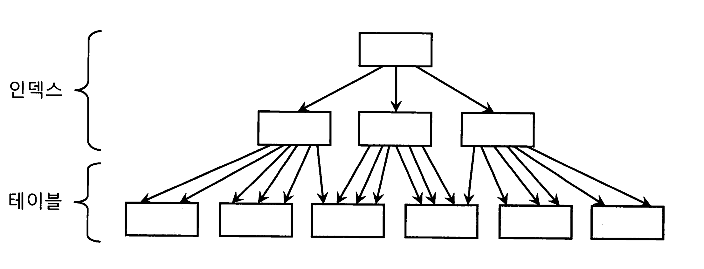

위 그림은, 인덱스 클러스터링 팩터가 가장 좋은 상태를 도식화 한 것으로써, 인덱스 레코드 정렬 순서와 테이블 레코드 정렬 순서가 100% 일치하는것을 볼 수 있다.

반면 아래는 인덱스 레코드 정렬 순서와 테이블 레코드 순서가 일치하지 않는 나쁜 상태이다.

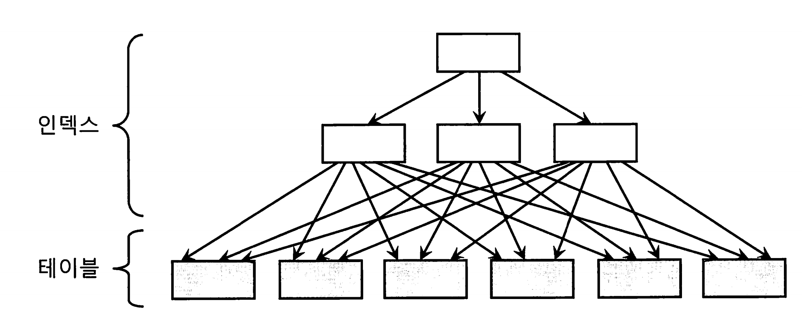

cf가 좋을수록 검색 효율이 좋다. 테이블 액세스량에 비해 블록 I/o가 적게 발생하기 때문이다. 

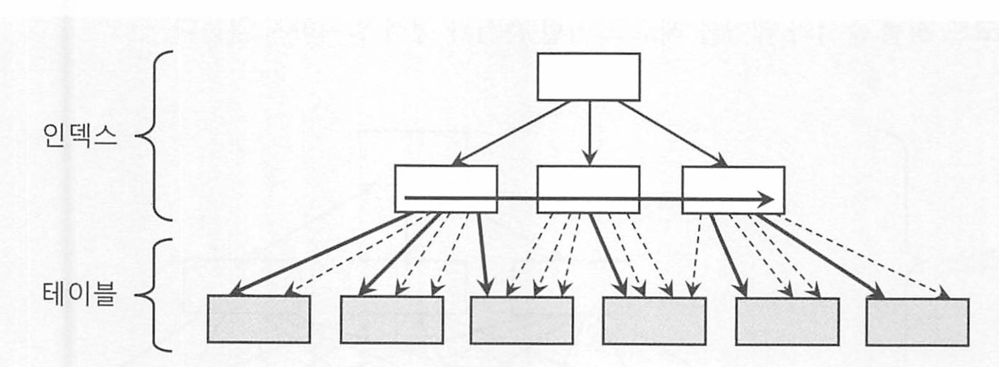

* 굵은 실선은 실제 블록 I/O 발생하는 경우, 가는 점선은 블록을 찾아가는 과정(논리적 블록 I/O) 없이 포인터로 바로 액세스 하는 경우

#### 클러스터링 팩터가 좋은 경우(낮은 경우):

- 인덱스의 순서와 테이블 데이터의 물리적 순서가 유사하다.
- 한 번의 인덱스 스캔으로 읽어들인 블록이 테이블에서 연속적으로 저장된 데이터를 참조한다. (블록단위로 데이터를 읽으니까.)
- 디스크 I/O가 최소화되며, 테이블 블록을 적게 읽게 된다.
- 이로인해 전체 성능이 향상된다 

#### 클러스터링 팩터가 나쁜 경우(높은 경우):

- 인덱스의 순서와 테이블 데이터의 물리적 순서가 일치하지 않는다.
- 인덱스 스캔 시 테이블의 여러 블록을 불연속적으로 읽어야 한다. (I/O가 발생)
- 디스크 I/O가 증가하며, 더 많은 테이블 블록을 읽어야 한다..
- 이로 인해 전체 성능이 저하된다.

클러스터링 팩터가 낮으면 인덱스 스캔 후 테이블 블록에 접근할 때 물리적으로 인접한 블록에 접근하게 되므로 디스크 I/O가 줄어들고 성능이 향상된다. 반대로 클러스터링 팩터가 높으면 여러 블록에 불연속적으로 접근해야 하므로 디스크 I/O가 증가하여 성능이 저하된다. (랜덤 I/O 액세스 )

* MySQL의 주요 스토리지 엔진인 InnoDB는 클러스터형 인덱스를 사용하여 기본 키에 따라 데이터를 물리적으로 정렬하여 저장하므로  기본 키를 기준으로 하는 쿼리에서 클러스터링 팩터가 낮아 성능이 향상된다.

* **Postgre의 경우 Primary Key에 대해 "Index"를 자동으로 생성하지만,**

  **이는 Cluster Index가 아니며 따라서 데이터의 정렬을 보장하지 않는다.**

  * cluster 명령어를 지원하긴 하지만, 일회성일뿐 이후 데이터들은 게속 주기적으로 재정렬되진 않는다 - https://www.postgresql.org/docs/14/sql-cluster.html

### 3.1.3 인덱스 손익분기점

인덱스 ROWID를 이용한 테이블 액세스는 생각보다 고비용이다. 읽어야 할 데이터가 일정량을 넘어서면 테이블 풀 스캔보다 느려진다.

인덱스 레인지 스캔의 테이블 액세스가, 테이블 풀 스캔보다 느려지는 지점을 인덱스 손익 분기점이라고 한다.

인덱스를 이용한 테이블 액세스가 Table Pull Scan보다 더 느려지게 만드는 가장 핵심적인

두 가지 요인은 다음과 같다.

- Table Pall Scan은 시퀀셜 액세스인 반면, 인덱스 ROWID를 이용한 테이블 액세스 는 랜덤 액세스 방식이다.
- Table flall Scan은 Multiblock I/0인 반면, 인덱스 ROWID를 이용한 테이블 액세 스는 Single Block I/O 방식이다.


* 손익분기점 %(퍼센트)
* 가져와야 할 데이터가 만건만 넘어도 시퀀셜 액세스와 멀티블록 I/O를 이용한 풀 테이블 스캔이 빠를 수 있다. 


### OLTP 프로그램 튜닝 vs 배치 프로그램 튜닝

OLTP는 보통 소량 데이터를 읽고 갱신하므로 인덱스를 효과적으로 사용하는것이 중요하다. 

배치 프로그램은 항상 전체범위 기준으로 튜닝해야 한다. 처리대상중 일부가 목표가 아닌, 전체를 빠르게 처리하는것을 목표로 삼아야 한다.

* 이경우 FULL SCAN과 해시 조인이 유리하다.

그렇다고 배치 프로그램에서 초 대용량 테이블을 FULL SCAN하면 오래 기다려야 하므로 파티셔닝, 병렬처리 등을 골라 풀스캔해서 빠르게 처리하는것이 좋다. 

### 3.1.4 인덱스 컬럼 추가

EMP 테이블에 DEPTNO + JOB으로 구성한 인덱스가 있다.

이때 아래 쿼리를 수행하려고 한다.


```
SELECT * FROM EMP WHERE DEPNO = 30 AND sal >= 2000
```

만족하는 사원은 1명뿐인데, sal 조건때문에 테이블을 6번 액세스 했다. 

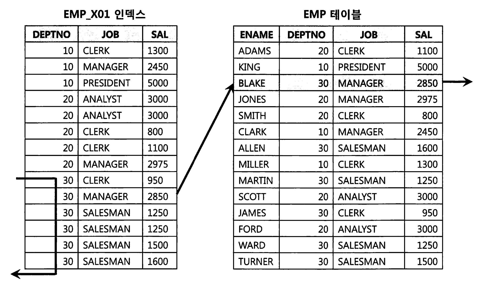

이런경우 그냥 기존 인덱스에 SAL 컬럼을 추가해주는것만으로도 큰 효과를 얻을 수 있다. 인덱스 스캔은 줄지 않지만 테이블 I/O가 줄기 때문이다 

### 3.1.5 인덱스만 읽고 처리
위 사례는 액세스 단계 필터 조건에 의해 버려지는 레코드가 많을 때, 인덱스에 컬럼을 추가함으로써 얻는 성능 효과를 보았다.

그러나 테이블 랜덤 I/O가 많아도, 필터 조건에 의해 버려지는 레코드가 없다면 그것은 비효율적인것은 아니다.

이때는 어떻게 튜닝해야 할까?

반드시 성능을 개선해야 한다면, 쿼리에 사용된 컬럼을 모두 인덱스에 추가해서 테이블 액세스가 아예 발생하지 않게 하는 방법을 고려할 수 있다.

-> 커버링 인덱스. 


### 3.1.6 인덱스 구조 테이블

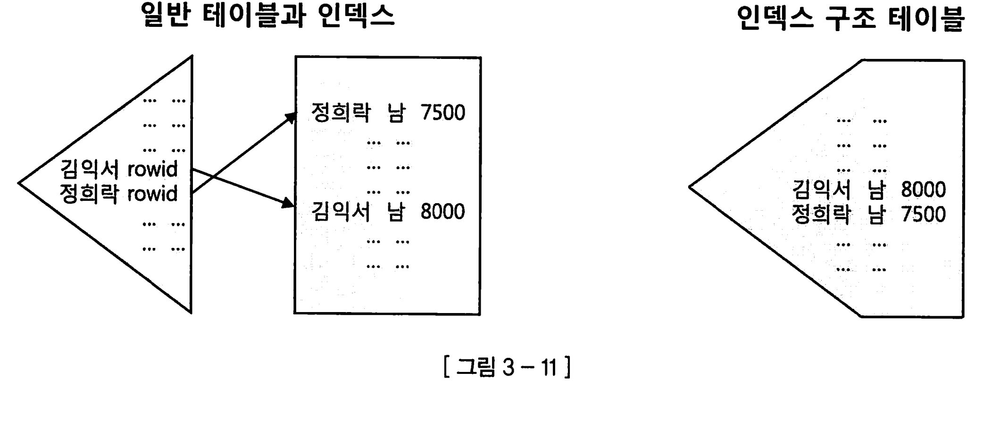

랜덤 액세스가 발생하지 않도록 테이블을 인덱스 구조로 생성한 것을 IOT(Index-Organized Table)이라고 부른다.

테이블 블록에 있어야할 데이터를 인덱스 리프 블록에 모두 저장하고 있다. 

즉 인덱스 리프블록이 곧 데이터블록이다. 

* 테이블 데이터가 기본 키에 따라 인덱스에 물리적으로 정렬되어 저장된다.

* 보조 인덱스 같은경우, pk를 통해 데이터를 다시 조회해야 한다.  

* 세컨더리 인덱스의 리프 노드에는 인덱스 키 값과 함께 이 논리적 ROWID가 저장된다. 

* 세컨더리 인덱스를 통해 조회 시, 먼저 논리적 ROWID를 얻는다.

  이 논리적 ROWID를 사용하여 IOT의 프라이머리 키 인덱스를 검색한다.

  프라이머리 키 인덱스에서 실제 데이터 레코드를 찾는다.

> Mysql의 클러스터링 테이블과는 조금 다르다. 
> 용어와 구현 세부 사항이 다를 뿐, 개념적으로는 유사한 방식으로 데이터를 저장하고 접근한다.  


### 3.1.7 클러스터 테이블

오라클의 클러스터 테이블에는 인덱스 클러스터와 해시 클러스터 두가지가 있다.


인덱스 클러스터 테이블은 클러스터 키 값이 같은 레코드를 한 블록에 모아서 저장하는 구조다. 

> 이름 때문에 SQL 서버나 Sybase에서 말하는 '클러스터형 인덱스(Clustered Index) 와 같다고 생각할지 모르지만 클러스터형 인덱스는 오히려 IOT에 가깝다. 
>
> 오라클 클러스터는 키 값이 같은 데이터를 같은 공간에 저장해 둘 뿐, IOT나 클러스터형 인덱스처럼 정렬하지는 않는다.

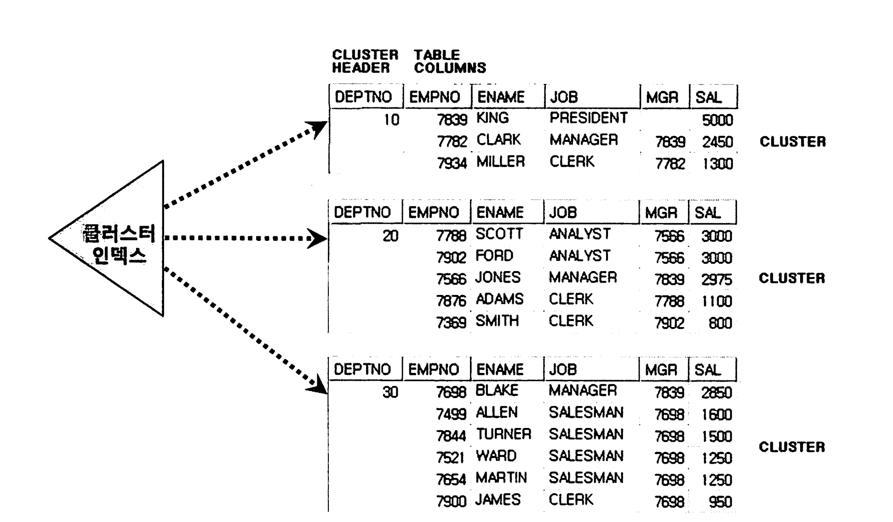

일반 테이블에 생성한 인덱스 레코드는 테이블 레코드와 1:1관계를 갖지만, 클러스터 인덱스는 1:M 관게를 갖는다. (블록을 가리키는 말 같은데..? )

클러스터 인덱스의 키 값은 항상 Unique하다. 

이런 특성 때문에 클러스터 인덱스 스캔시 랜덤 액세스가 값 하나당 한번씩 밖에 발생 안하고, 도달해서 시퀀셜 스캔하기 때문에 비효율이 없다. 


**해시 클러스터 테이블**

해시 클러스터는 인덱스를 사용하지 않고 해시 알고리즘을 사용해 클러스터를 찾아간다는점만 다르다.

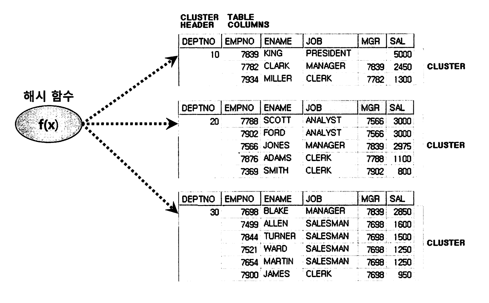

## 3.2 부분범위 처리 활용

부분범위 처리원리를 활용하면 인덱스로 액세스할 대상 레코드가 아무리 많아도 아주 빠른 응답속도를 낼 수 있다. 

### 3.2.1 부분범위 처리

모든 DBMS는 데이터를 조금씩 나눠서 전송한다. 페이징과는 다르다. 결과집합을 조금씩 나눠서 전송한다

* dbms마다 다른듯?

중간에 멈췄다가 사용자의 추가 요청이 있을때마다 데이터를 가져오도록 구현한다. 

```java
String sql = "select...from..";
Statement stmt = con.createStatement();
stmt.setFetchSize(10);
```


## 3.3 인덱스 스캔 효율화

> 점선 ---> 은 시작점을 찾는 과정을 묘사한것이다. 

인덱스 탐색 과정을 좀더 깊게 그림으로 해석해본다. 

### 3.3.1 인덱스 탐색
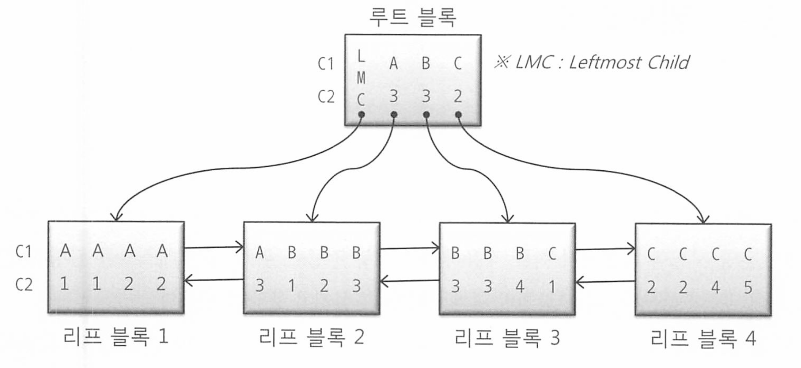

* 루트 블록 C1, C2 컬럼이 각각 (A, 3), (B, 3) (C,2)인 레코드가 있다. 각 레코드는 하위 노드를 가리키는 블록 주소를 갖는다. 
* LMC는 레프트 모스트 차일드 레코드로, 자식 노드 중 가장 왼쪽에 있는 블록을 가리킨다. 

**< 조건절 1>**

```
WHERE C1 = 'B'
```

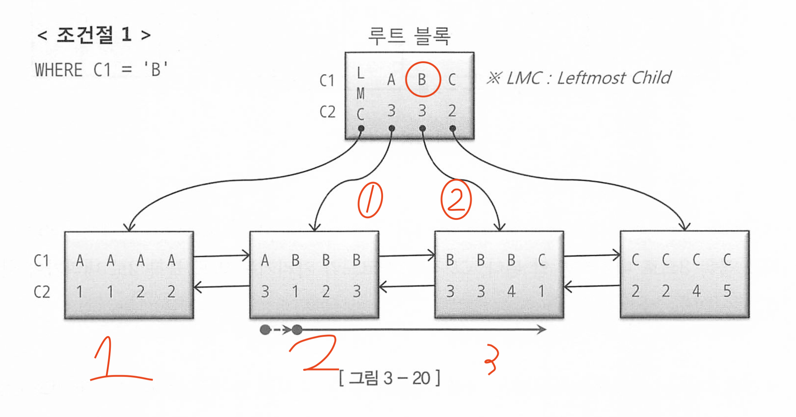

C1 = B 레코드 찾았을 때, 바로 리프블록3으로 가면 안됀다. C1 ='A'레코드가 가리키는 리프블록 2로 먼저 내려가야 한다.

하위블록에 저장된 값들을 보면 그 사실을 쉽게 볼 수 있다.

* BTree는 밸런스드 트리로, 해당 값이거나, 해당값 보다 작은 값들은 왼쪽 노드에 있다.
* 2번째 블록을 보면 C1이 B인 블록들이 있다. 
* 즉 (A,3)에는 (A, 3)부터 시작하고 (이상), (B, 3)이하인 값들이 있다. (B,3)은 (B, 3)부터 시작하고, (C,2)이하인 값들이 있다.  

수직적 탐색은 스캔 시작점을 찾는 과정이다. 

**< 조건절 2>**

```
WHERE C1 = 'B'
AND C2 = 3
```

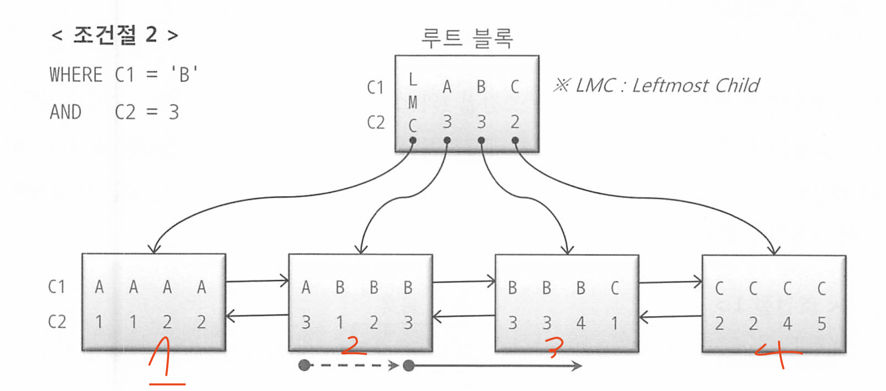

조건절 2의 스캔 시작점과 끝점은 그림과 같다.

수직 탐색을 통해 C1 = B이고 C2 = 3인 첫번째 레코드를 찾고, C1 = B인 레코드 중에서 C2 = 4인 레코드를 만나는 순간 스캔을 멈춘다.

* 그림을 보면 화살표가 `C1= C를 만나고,  스캔을 멈췄다`. 즉 스캔량을 줄였다 (조건절은 C1 = B 니까) 
* 또한 C2 =3이 아니고 C2가 4이므로 B,4까지만 스캔을 하고 멈췄다. 

**< 조건절 3>**

```
WHERE C1 = 'B'
AND C2 >= 3
```

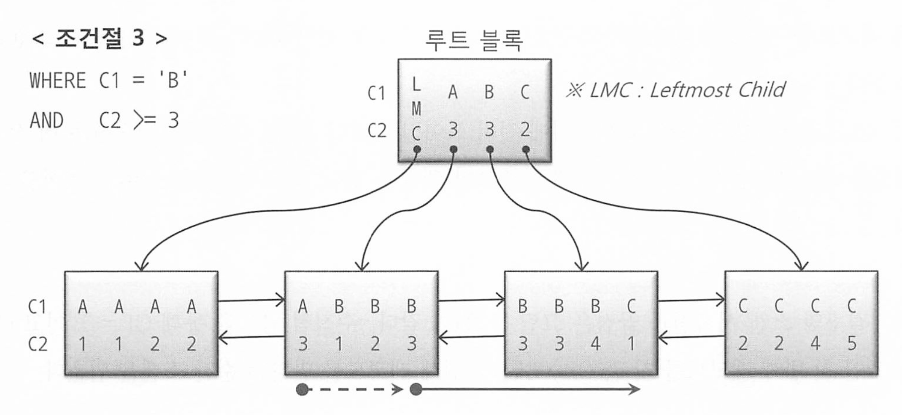

여기서도 마찬가지다. C2 >= 3조건절이 스캔을 멈추는데는 역할을 못하지만, 조건절 1과 다르게 스캔 시작점(실선)이 달라졌다.

조건절 덕분에 스캔 시작점을 명확히 지정할 수 있었다. 


**< 조건절 4>**

```
WHERE C1 = 'B'
AND C2 <= 3
```

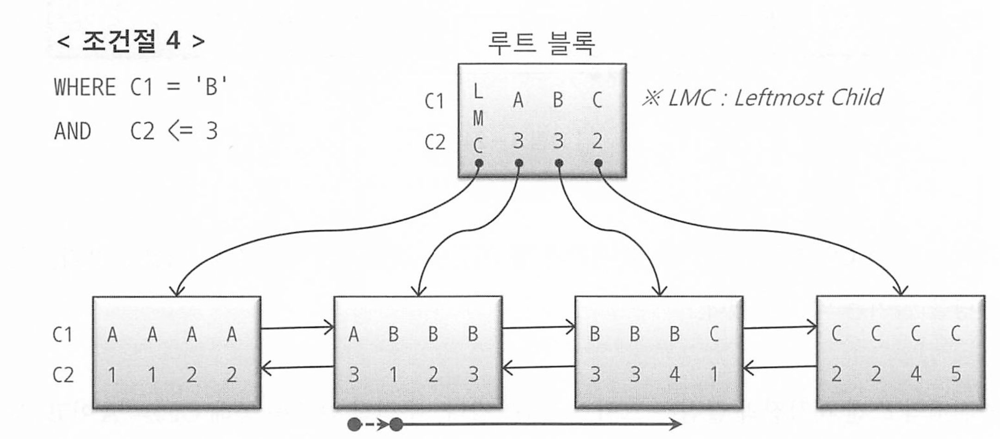

수직 탐색을 통해 C1 = B 인 첫번째 레코드를 찾고 스캔하다가 C2 > 3인 레코드를 만나자마자 스캔을 멈췄다.

C2 <= 3인 조건절은 수직 탐색 과정에 전혀 쓰이지 않아 스캔 시작점을 결정하는데 도움은 되지 못했지만, 스캔을 멈추는데에는 중요한 역할을 했다. 

### 3.3.2 인덱스 스캔 효율성

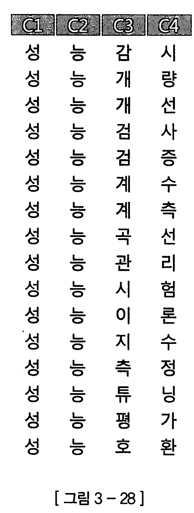

1. 이 테이블에서 성능검 으로 시작하는 레코드를 검색하려면 어디서 스캔을 시작하고 어디서 멈출까?

2. 이테이블에서 성능으로 시작하고 선으로 끝나는 레코드를 검색하려면 어디서 스캔을 시작하고 어디서 멈출까?

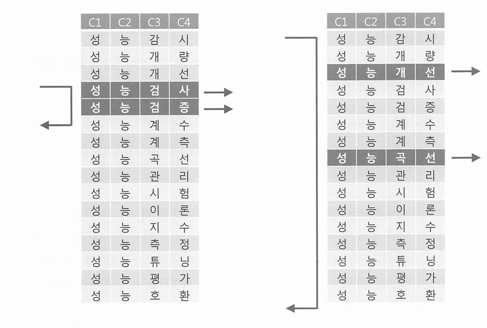

1. 성능검으로 시작하는 레코드는 인덱스 수직 탐색을 통해 바로 성능검사 레코드를 찾고 스캔을 시작해 성능계수까지 총 3개 스캔하고 멈춘다. 두건을 얻기위해 3건을 스캔한다
2. 성능으로 시작하는 모든 레코드를 스캔한다. 결과는 두건이지만 더 많은 레코드를 스캔해야 했다. 


결론적으로, 인덱스가 효율이 좋은지 나쁜지는 얻은 레코드가 몇개인데 블록을 얼마나 읽었는지에 따라 다르다.

결과가 어찌됐든 인덱스 블록을 적게 읽은것이 좋다. 

### 3.3.3 액세스 조건과 필터 조건

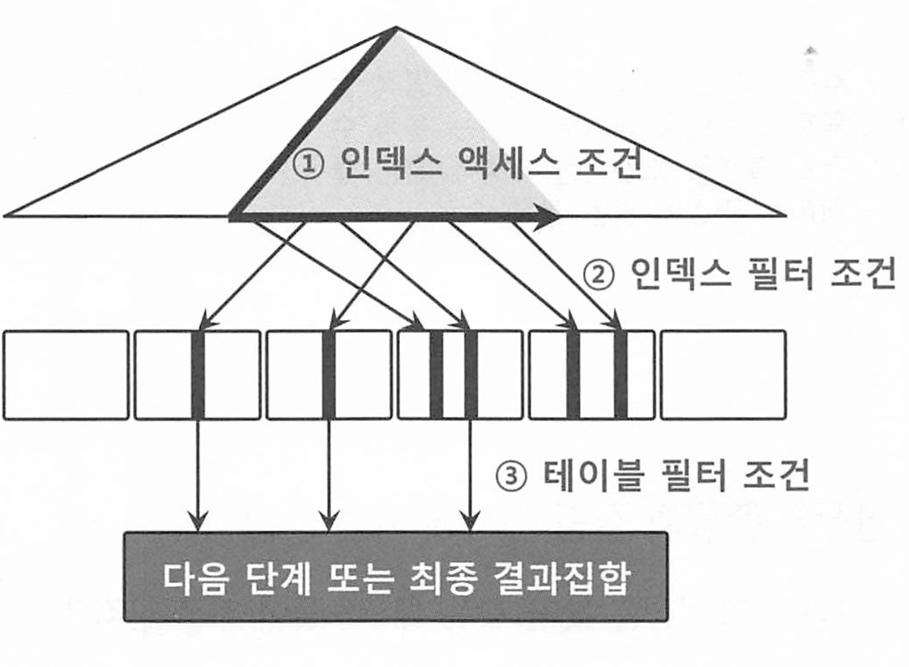

**인덱스 액세스 조건** : 인덱스 스캔 범위를 결정하는 조건절

인덱스 수직 탐색을 통해 스캔 시작점을 결정하는데 영향을 미치고, 리프 블록을 스캔하다가 어디서 멈출지 결정하는데 영향을 미친다


**인덱스 필터조건** : 테이블로 액세스할지를 결정하는 조건이다. 

인덱스 필터 조건은 인덱스를 통해 검색된 후 추가적으로 필터링되는 조건으로, 인덱스 액세스 조건으로 검색된 결과 집합에서 추가적인 필터링을 수행한다. 


**테이블 필터 조건** : 쿼리 수행 다음 단계로 전달하거나, 결과 집합에 포함할지 결정하는 조건이다. 

테이블 필터 조건은 인덱스를 통해 검색된 행을 테이블에서 다시 읽어와서 적용되는 조건


인덱스 액세스 조건과 필터 조건을 효과적으로 사용하면 데이터베이스가 불필요한 행을 읽지 않게 되어 성능이 크게 향상된다. 

**테이블 필터 조건**은 인덱스로는 처리할 수 없는 추가적인 조건을 테이블 레벨에서 적용하는 방식이다. 

### 3.3.4 비교 연산자 종류와 컬럼 순서에 따른 군집성

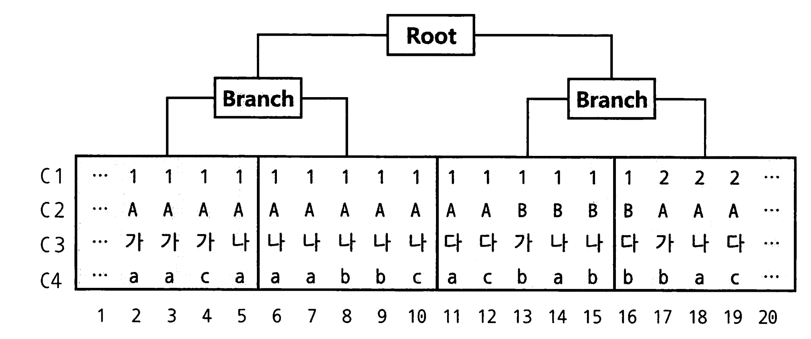

* 편의상 부여한 일련번호다. C1~C4는 컬럼이다.

특정 인덱스 블록에 데이터가 모여있게 되는데, 조건절에 따라 레코드가 서로 흩어진 블록을 조회하게 된다.

앞쪽부터 누락없이 = (이퀄)로 조회하면 레코드는 모여있지만, 누락하거나 = 조건이 아닌 연산자로 조회하면 조건절을 만족하는 레코드가 서로 흩어지게 된다. 

예를들어 다음과 같은 쿼리 두가지에 따라 천차 만별이 된다

```sql
where c1 = 1 and c2 = 'A' and c3 = '나' and c4 = 'a'

where c1 = 1 and c2 <= 'b' c3 = '나' c4 between 'a' and 'b'
```

선행 컬럼이 모두 '=' 조건인 상태에서 첫 번 째 나타나는 범위검색 조건까지만 만족하는 인덱스 레코드는 모두 연속해서 모여 있지만, 그 이하 조건까지 만족하는 레코드는 비교 연산자 종류에 상관없이 흩어진다

```sql
where c1 between 1 and 3 and c2 ='A' and c3 = '나'
```


인덱스 스캔 범위를 결정하는 조건절이 인덱스 액세스 조건이다.

선행 컬럼이 모두 = 조건인 상태에서 첫 번째 나타나는 범위 검색 조건이 인덱스 스캔 범위를 결정한다.

* c1 between 1 and 3이 스캔 범위를 결정하는 인덱스 액세스 조건이다
* 나머지 조건들은 인덱스 필터 조건이 된다. 

간단하게 생각해서, 첫번쨰로 나타나는 범위검색 조건까지가 인덱스 액세스 조건이고, 나머지는 필터 조건이라고 생각하면 된다. 

#### 예시 1: 결합 인덱스 (col1, col2, col3)가 있는 경우

```sql
SELECT * FROM my_table WHERE col1 = 'A' AND col2 > 'B' AND col3 = 'C';
```

- **인덱스 액세스 조건**: `col1 = 'A'`와 `col2 > 'B'`
  - 이 조건들은 인덱스를 통해 데이터를 찾는 데 사용된다.
  - 인덱스가 (col1, col2, col3) 순서로 구성되어 있으므로 `col1`과 `col2`를 사용하여 데이터를 검색할 수 있다.
- **필터 조건**: `col3 = 'C'`
  - 이 조건은 인덱스를 통해 찾은 데이터에서 추가적으로 필터링하는 데 사용된다.
  - `col2` 이후 첫 번째 범위 검색 조건(`col2 > 'B'`)이 나타나면 그 이후 조건들은 인덱스를 통해 직접 검색되지 않고, 필터 조건으로 처리된다.

#### 왜 성능에 영향을 미치는가?

- **인덱스 액세스 조건**은 인덱스를 사용하여 데이터를 빠르게 찾을 수 있게 한다.. 인덱스는 정렬된 구조를 가지고 있기 때문에, 인덱스 액세스 조건을 사용하면 데이터베이스가 원하는 데이터를 찾기 위해 빠르게 탐색할 수 있다.
- **필터 조건**은 인덱스를 통해 검색된 데이터에서 추가적으로 조건을 적용하는 것이므로, 인덱스 액세스 조건만큼 효율적이지 않다. 이는 추가적인 데이터 필터링 작업이 필요하기 때문에 더 많은 리소스를 사용하게 된다. 읽고 버리는 작업등을 하기 때문이다.
- 범위 검색 조건(`>` 또는 `<` 등)이 나타나는 순간 이후의 조건들은 더 이상 인덱스 액세스 조건으로 처리되지 않기 때문에, 인덱스의 효율적인 탐색 능력을 사용하지 못하고, 결과적으로 성능 저하가 발생할 수 있다.


### 3.3.5 인덱스 선행 컬럼이 등치(=) 조건이 아닐 때 생기는 비효율

인덱스 스캔 효율성을 인덱스 컬럼을 조건절에 모두 등치(=)로 쓸때 가장 좋다

부등호(≠)나 범위 조건(>, <, >=, <=)을 사용하면 인덱스의 효율성이 떨어지게된다.

### 비효율의 이유: 부등호와 범위 조건

- **부등호 조건(≠)**: 인덱스가 모든 값을 검사해야 한다. 특정 값을 제외한 나머지 모든 값을 검색해야 하므로 인덱스 스캔 범위가 넓어진다.
- **범위 조건(>, <, >=, <=)**: 범위 조건은 특정 범위 내의 모든 값을 검색해야 하므로 인덱스 스캔 범위가 넓어진다. 이는 인덱스의 리프 노드를 많이 탐색하게 되어 효율성이 떨어진다.

부등호 조건 예시

```sql
-- 인덱스: (col1, col2)
EXPLAIN SELECT * FROM my_table WHERE col1 != 'A';
```

* col1 ≠ 'A'를 만족하는 모든 행을 검색해야 하므로 디스크 I/O가 증가하고 성능이 저하됌

### 3.3.6 BETWEEN을 IN-List로 전환

범위 검색 컬럼이 맨 뒤로 가도록 변경할 수 없는 경우에, between 조건을 IN-List로 바꿔주면 효과를 얻는 경우가 있다.

#### BETWEEN 사용 예시

```sql
-- 인덱스: (col1, col2)
EXPLAIN SELECT * FROM my_table WHERE col1 BETWEEN 'A' AND 'C' AND col2 = 'B';
```

* BETWEEN 조건은 col1의 범위 'A'에서 'C'까지의 모든 값을 검색한다. 이는 인덱스를 사용하지만 범위 스캔이므로 디스크 I/O가 많아질 수 있다.

#### IN-List로 전환 예시

```sql
-- 인덱스: (col1, col2)
EXPLAIN SELECT * FROM my_table WHERE col1 IN ('A', 'B', 'C') AND col2 = 'B';
```

* IN-List 조건은 col1이 'A', 'B', 'C'인 경우를 각각 등치 조건으로 처리해서  데이터베이스는 각 값에 대해 인덱스를 사용하여 별도로 빠르게 접근할 수 있다.


내부적으로 =(등치)로 변환해서 여러번 수직적 탐색 후 스캔하기 때문에 훨씬 빠르다.

그러나 between 조건을 IN-LIST로 조건으로 바꿀시 주의할 점은, IN절에 들어가는 조건이 많지 않아야 한다.

IN절 만큼 브랜치 블록을 반복 탐색하는 비효율이 커질 수 있기 때문이다. 

때문에, IN절로 변환시 조건절이 적어야 하기도 하고, 데이터 분포가 소량이여서 블록을 너무 많이 읽지 않도록 하는것이 좋다. 

### 3.3.7 Index Skip Scan 활용


### 3.3.8 IN 조건은 ‘=’인가

사실 IN  조건은 =이 아니다. 인덱스를 어떻게 구성하느냐에 따라 성능이 달라질수도 있따.

아래 SQL에 대한 인덱스를 상품ID + 고객번호로 설계할 떄와 고객번호 + 상품ID로 설게할 때 차이가 있는지 보면 알 수 있따.

```sql
SELECT *
FROM 고객별 상품
WHERE 고객번호 =:cust_no
AND 상품 ID IN('NH00037', 'NH00041', 'NH00050')
```

* 고객번호의 평균 카디널리티는 3이라고 가정 = 고객별로 평균 3건의 상품 가입 
* 인덱스를 상품ID + 고객번호로 설정시 같은 상품은 고객번호 순으로 정렬된 상태로 저장
* 반대로 고객번호 + 상품ID로 설정시 같은 고객번호가 상품 ID에 따라 뿔뿔이 흩어진다.

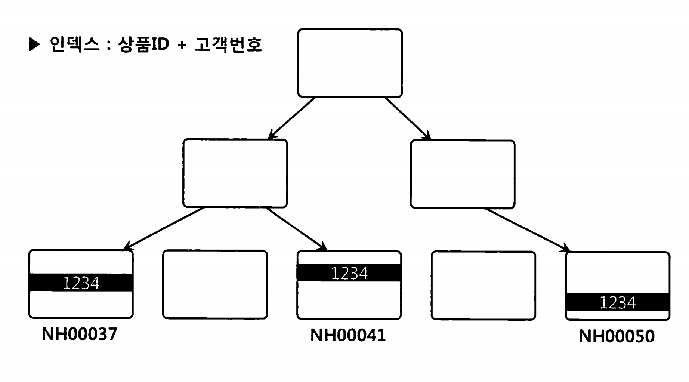

인덱스가 상품ID + 고객번호로 구성돼 있다면 상품ID 조건절이 IN절로 풀리는것이 효과적이다. 고객번호 1234 조건을 만족하는 레코드가 서로 흩어져 있기 때문이다.

* 그림을 보면 인덱스를 수직적으로 3번 탐색하며, 그 과정에서 총 9개 블록만 액세스함 (루트부터 시작해서 1, 2, 4 / 1, 2,6 / 1,3, 8)

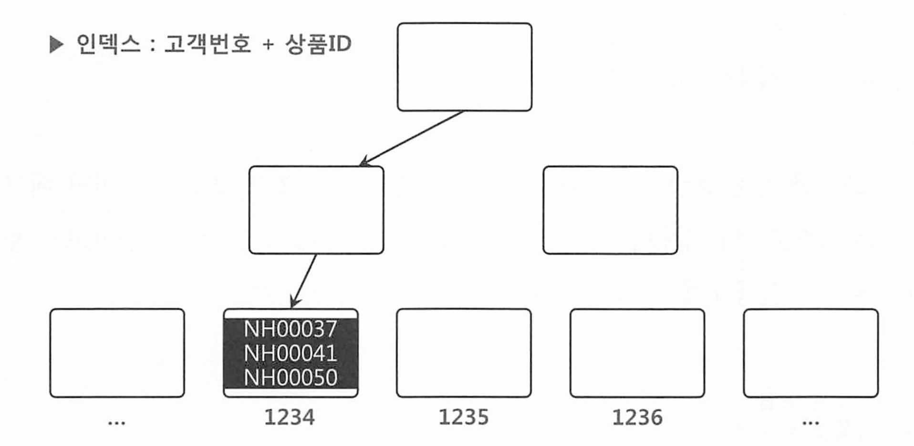

반대로 고객번호 + 상품ID로 두게되면 같은 고객은 상품ID순으로 정렬된 상태로 같은 리프블록에 저장된다. 

여기서도 상품ID를 IN절로 풀면, 인덱스를 수직적으로 세번 탐색하는 과정에 9개 블록을 읽는다. (IN 절을 =로 하게되서 여러번 탐색하는것 )

IN List Iterator절로 풀지 않으면, 상품ID조건절은 필터로 처리한다. 

그러면 고객번호만 액세스 조건이므로 고객번호 = 1234인 레코드를 모두 스캔한다. (오히려 효율적임. )

같은 고객은 한 블록(또는 연속된 블록)에 모여있으므로, 블록I/O는 수직 탐색과정을 포함 3,4개만 발생한다. 


중요한것은. IN조건은 =이아니고, IN 조건이 =이 되려면, 각 IN절 값에 대해 인덱스 액세스를 해서(=로 반복적) 효과적이다. 


### 3.3.9 BETWEEN과 LIKE 스캔 범위 비교

결론부터 말하면 Between이 LIKE보다 낫다. 


### 3.3.11 다양한 옵션 조건 처리 방식의 장단점 비교

**인덱스 선두 컬럼에 OR 조건을 사용하지 말자.** 

인덱스에 포함되지 않은 컬림에 대한 옵션 조건은 어차피 테이블에서 필터링할 수밖에 없으 므로 그럴 때는 OR 조건을 사용해도 무방하다. OR 조건을 활용한 옵션 조건 처리를 정리하 면 다음과 같다.

- 인덱스 액세스 조건으로 사용 불가
- 인덱스 필터 조건으로도 사용 불가
- 테이블 필터 조건으로만 사용 가능


**LIKE/BETWEEN 패턴을** 사용하고자 할 때는 아래 네 가지 경우에 속하는지 반드시 점검해야 한다. (BETWEEN 조건은 1번과 2번 조전에 해당하는지만 점검하면 된다.)

1. 인덱스 선두 컬럼
2. NULL 허용 컬럼
3. 숫자형 컬럼
4. 가변 길이 컬럼

### 3.3.12 함수호출부하 해소를 위한 인덱스 구성

PL/SQL 사용자 정의 함수는 생각하는것보다 매우 느리다.

PL/SQL 사용자 정의 함수가 느린 데는 아래 3가지 이유가 있다.

1. 가상머신(VM) 상에서 실행되는 인터프리터 언어
2. 호출 시마다 컨텍스트 스위칭 발생
3. 내장 SQL에 대한 Recursive Call 발생 (함수나 SQL을 사용하면, 조건을 만족하는 결과가 100만건이면 100만번 실행함)

## 3.4 인덱스 설계

OLTP 시스템에서는 인덱스 설계부터가 중요하다.

* 인덱스 오버로드를 고려하지않고 설계하면 DB 터질수도 있음 . 

### 3.4.1 인덱스 설계가 어려운 이유

인덱스를 막 생성하다 보면, 수십개가 생기고 관리비용 뿐만 아니라 시스템 부하를 증가시키는 요인이 된다.

* DMS 성능 저하 -> TPS 저하로 이어짐
* DB 사이즈 증가 -> 디스크 공간 낭비로 이어짐
* 데이터베이스 관리 및 운영 비용 상승

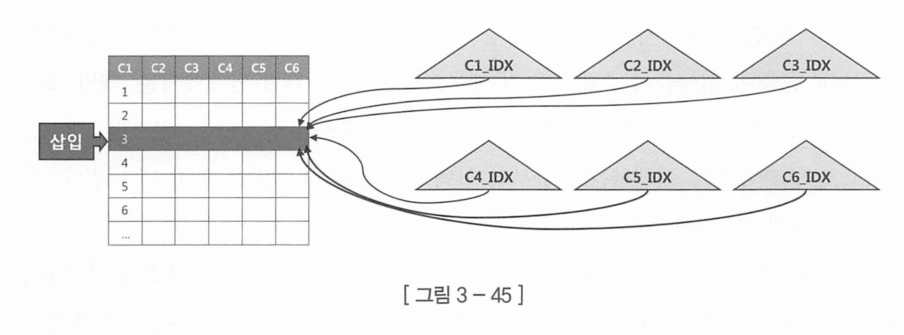

위 그림은 인덱스 6개 있는 테이블이다.

신규 데이터 입력시 6개 인덱스에도 각각 데이터를 입력해야 하며, 수직 탐색을 통해 블록을 찾는다. 블록 찾을시 여유공간이 없다면 인덱스 분할도 발생한다. (특정 위치에 넣어야하는데, 꽉차있으면 데이터를 뒤로 밀어서 중간에 껴넣어야함)

지울때도 마찬가지이다. 하나하나 찾아 지워야 한다. 이는 곳 TPS 저하로 이어진다.

인덱스 설계시 시스템 전체 시각에서 종합적, 전략적으로 접근해야 하는데, 전략을 논하기에 앞서 인덱스를 구성하는 기본 원리부터 보자. 

**개발단계에서 최적 인덱스 설계의 중요성**

* 목표 : 인덱스 개수를 최소화 하고 최적의 효율(TPS)을 얻어야 한다.
* 기존 인덱스 구성을 변경하면, 시스템 변경 영향도가 크다. 영향받는 쿼리를 모두 찾아 성능을 검증해야 한다.
* 신규 인덱스 추가는 비교적 변경 영향도가 적지만, 그럴수록 DML이 부하가 생기므로 시스템의 TPS를 낮아진다.
* 인덱스 추가는 시스템에 부하를 주고, 인덱스 변경은 운영 리스크가 크다. 

### 3.4.2 가장 중요한 두 가지 선택 기준

가장 정상적이고 일반적인 방식은 Index Range Scan이다. 이를 위해서 인덱스 선두 컬럼을 조건절에 반드시 사용해야 한다. 즉 결합 인덱스 구성시 첫번째 기준은 조건절에 항상 사용하거나 자주 사용하는 컬럼을 선정해야 한다.


두번째 기준은 ''='(이퀄) 조건으로 자주 조회하는 컬럼을 앞쪽에 두어야 한다. 

* = 조건을 사용하면 인덱스 스캔 범위가 축소된다. 범위 조건을 사용하면 더 넓은 범위를 스캔해야 하므로 효율이 떨어진다.
* 복합 인덱스는 첫번째 컬럼이 =를 만족해야 다음 컬럼들의 조건을 효율적으로 사용할 수 있다. 인덱스 액세스 조건으로 = 가 < > 같은 범위 조건보다 검색할 범위가 좁아지기 때문에 =를 사용하는것이 좋다. 인덱스 필터조건이 되도록 액세스 조건 뒤로가도록 하자. 


정리 

1. 조건절에 항상 사용하거나 자주 사용하는 컬럼을 선정한다
1. = 조건으로 자주 조회하는 컬럼을 앞쪽에 둔다.

### 3.4.3 스캔 효율성 이외의 판단 기준

인덱스 스캔 효율성 외에도 아래 기준을 판단해야 한다.

* 수행 빈도, 업무상 중요도
* 클러스터링 팩터, 데이터량
* DML 부하 (기존 인덱스 개수, 초당 DML 발생량, 자주 갱신하는 컬럼 포함 여부 등)
* 저장 공간
* 인덱스 관리 비용 

이중 가장 중요한것은 수행 빈도(실행 빈도)일 수 있다. 자주 수행되지 않으면 무용지물이기도 하고 조인에도 연관이 있다.

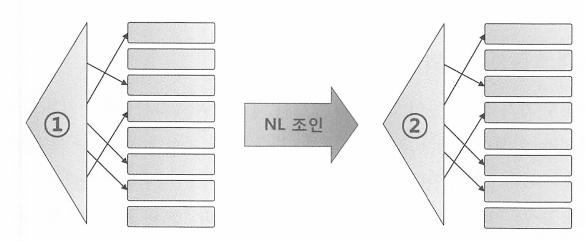

위 그림에서 NL 조인시 1, 2번중 어느쪽 인덱스가 더 중요할까?

OUTER 쪽(드라이빙)에서 액세스하는 인덱스(1번)은 비효율이 있더라도 큰 문제가 아닐 수 있다. 

> `leading`: 쿼리 실행 시 가장 먼저 접근할 테이블을 지정
>
> `use_nl`: Nested Loop 조인을 사용할 때, 드리븐 테이블을 지정
>
> 아래 쿼리는 힌트를 사용해 어떤 테이블을 드라이빙, 드리븐으로 쓸지 지정한다. 
>
> 드라이빙 테이블이 데이터가 적어야 더 효율적. 드라이빙 테이블의 각 행에 대해 반복적으로 검색하기 때문. 드라이빙 테이블 행이 적어야 반복 횟수가 줄어들어 효율적.
>
>
> 드리븐도 적은 데이터량이 효율적이만 인덱스 효율성이 더 중요.
>
> 드라이빙 테이블의 각 행에 대해 반복 접근하기 때문임. 

```sql
select /*+ leading(a) use_nl(b) */
b.상품코드, b.상품명, a.고객번호, a.거래일자, a.거래량, a.거래금액
from 거래 a, 상품 b
where a.거래구분코드 = 'AC'
and a.거래일자 between 20090101 and 20090131
and b.상품번호 = a.상품번호
and b.상품분류 = '가전'
```

* 거래일자 + 거래구분 코드 순으로 인덱스 구성이여도 문제 없다 
* **드라이빙 테이블(Outer 테이블)**: `거래(a)`, **조인된 테이블(Inner 테이블)**: `상품(b)`
* `거래구분코드`가 '=' 조건이지만, 두 번째 컬럼이기 때문에 큰 성능 저하 없이 사용할 수 있다. 범위 검색이 효율적이지 않을 수 있지만, 이 경우 Outer 테이블이므로 큰 문제가 되지 않는다.
* `상품번호`가 '=' 조건이므로, 인덱스는 매우 효율적으로 작동한다.

그러나 Inner쪽 (2번) 인덱스 스캔과정이 비효율쪽이라면 성능에 문제를 야기할 수 있다. 

```sql
select /*+ leading(b) use_nl(a) */
b.상품코드, b.상품명, a.고객번호, a.거래일자, a.거래량, a.거래금액
from 거래 a, 상품 b
where a.거래구분코드 = 'AC'
and a.거래일자 between 20090101 and 20090131
and b.상품번호 = a.상품번호
and b.상품분류 = '가전'
```

* 거래일자 + 상품번호 + 거래구분코드 순으로 구성하면 성능문제 야기 가능하다.
* BETWEEN 조건 컬럼이 인덱스 선두 컬럼이므로 Outer 테이블로부터 액세스하는 횟수만큼 비효율적인 스캔을 반복한다. 
* **드라이빙 테이블(Outer 테이블)**: `상품(b)`
* **조인된 테이블(Inner 테이블)**: `거래(a)`
* `거래일자`가 BETWEEN 조건으로 인덱스의 선두 컬럼에 위치하면, 매번 범위 검색을 수행하게 된다.
  * Inner 테이블에서 인덱스가 범위 검색을 수행하게 되면, 드라이빙 테이블의 각 행에 대해 반복적으로 비효율적인 인덱스 스캔이 발생한다.

### 3.4.4 공식을 초월한 전략적 설계

조건절 패턴이 10개 있을 떄, 패턴마다 인덱스를 만들 수는 없다. 너무 낭비도, 부하도 심하기 떄문이다.

전문가라면 열 개 중 최적을 달성해야 할 핵심적인 경로 한두개를 전략적으로 선택해서 최적 인덱스를 설계하고, 나머지 액세스 경로는 약간 비효율이 있떠라도 목표 성능을 만족하는 수준으로 인덱스를 구성해야 한다. 

업무 상황에 따라 전략적으로 설계하자

* ex) 일자 조회 구간이 길지 않으면 인덱스 스캔 효율 상관 x
* 가장 많이 사용되는 = 패턴을 인덱스 선두 컬럼으로. 

### 3.4.5 소트 연산을 생략하기 위한 컬럼 추가

인덱스는 항상 정렬 상태를 유지하므로, ORDER BY, GROUP BY를 위한 소트 연락을 생략하도록 해준다.

아래 쿼리에서 소트 연산이 발생하지 않도록 인덱스를 구성해보자

```sql
select 계약ID, 청약일자, 입력자ID, 계약상태코드, 보험시작일자, 보험종료일자
from 계약
where
  취급지점ID = :trt_brch_id
  and 청약일자 between :sbcp_dt1 and :sbcp_dt2
  and 입력일자 >= trunc(sysdate - 3)
  and 계약상태코드 in (:ictr_stat_cd1, :ictr_stat_cd2, :ictr_stat_cd3)
order by 청약일자, 입력자ID;
```

성능을 고려하지 않는다면 ORDER BY절 순서대로 청약일자 + 입력자ID로 구성하면 된다.

`=` 조건절 컬럼은 ORDER BY 절에 없더라도 인덱스 구성에 포함할 수 있다. 위 SQL에선 

취급지점ID가 `=` 이므로 청약일자 + 취급지점ID + 입력자 ID 순으로 구성해도 생략할 수 있으며 위치는 어디에 두어도 상관없다. 

* =이 아닌 조건절 컬럼은 반드시 ORDER BY 컬럼보다 뒤쪽에 두어야 소트 연산을 생략할 수 있다.

I/O를 최소화하면서도 소트 연산을 생략하려면 아래 공식에 따라 인덱스를 구성하자

1. = 연산자로 사용할 조건절 컬럼 선정
   * 인덱스가 해당 값을 찾기 위해 전체 범위를 스캔하지 않아도 된다는 의미
2. ORDER BY 절에 기술한 컬럼 추가
   * 추가적인 소트 연산을 생략하게 하여 성능을 향상
3. = 연산자가 아닌 조건절 컬럼은 데이터 분포를 고려해 추가 여부 결정.

최종 인덱스 : 취급지점ID + 청약일자 + 입력자 ID 순

* 입력일자와 계약상태코드는 뒤에 넣어도 되고 안넣어도 된다. 이들 조건을 만족하는 데이터가 적으면 (카디널리티 높으면) 추가하자 테이블 랜덤 액세스를 줄일 수 있기 때문이다. 많으면 추가하지 않아도 된다. 테이블 필터링과 큰 차이가 없다 


#### In조건은 =이 아니다

```sql
select 고객번호, 고객명, 거주지역, 혈액형, 연령
from 고객
where 거주지역 = '서울'
and 혈액형 in ('A', '0')
order by 연령;
```

인덱스는 거주지역 + 혈액형 + 연령 으로 구성됐다. 

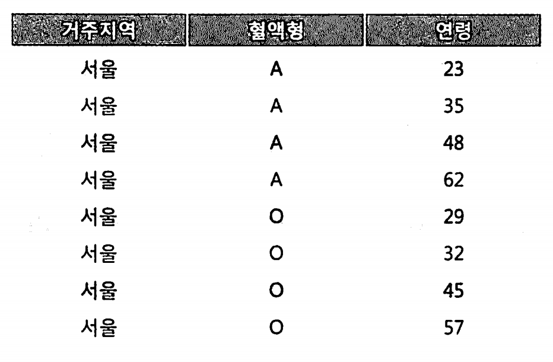

위 쿼리는 IN-List Iterator 방식으로  UNION ALL 위아래 두 집합 두 쿼리로 나누어 합쳐 실행하게 된다.

ORDER BY 절이 있음에도 불구하고 소트 연산을 생략하려면, 서울에 거주하는 모든 A형 고객이 O형 고객보다 연령이 낮아야 정렬이 되어있는데, 그것은 거의 불가능하다.

결론적으로 In-List 이터레이터방식으로는 풀려서 안되며, IN 조건절을 인덱스 액세스 조건으로 사용하면 안되고 필터 조건으로 사용해야 한다. 

즉 인덱스를 거주지역 + 연령 + 혈액형으로 구성해야 한다. 

* `거주지역 + 연령 + 혈액형` 순으로 인덱스를 구성하면, `거주지역`과 `연령`을 인덱스 액세스 조건으로 사용하여 이미 정렬된 상태로 결과를 반환하고, `혈액형`을 필터 조건으로 사용하여 정렬을 유지하면서 결과를 필터링할 수 있다. 

### 3.4.6 결합 인덱스 선택도

인덱스 생성 여부 결정시, 선택도가 충분히 낮은지가 중요한 판단 기준이다.

선택도란 전체 레코드 중에 조건절에 의해 선택되는 레코드 비율을 말하며, 선택도 x 총 레코드를 구해서 카디널리티를 구한다. 

선택도가 낮은(카디널리티가 낮은) 인덱스가 효율성이 높다. 

* 선택도가 높다는 것은 특정 조건이 적은 행을 반환한다는 의미이다. 

> 라고 하는데, 책에서 설명이 잘못된것 같다.
>
> 선택도가 높다면 실제로 인덱스의 효용가치는 높다. 
>
> 특정 조건이 적은 행을 반환하므로, 인덱스를 사용하여 검색 범위를 크게 줄일 수 있기 때문이다.
>
> 주민등록번호와 같은 높은 카디널리티를 가지는 컬럼은 선택도가 높아 인덱스를 사용하여 효율적으로 검색할 수 있다.
>
> 카디널리티가 높은경우 인덱스 효용성은 낮을 수 있다. 고유 값이 많으므로, 인덱스를 사용하여도 결과적으로 많은 행을 검색해야 할 수 있다. 문제는 카디널리티가 높지만 선택도가 낮은 경우이다. 이는 특정 조건이 많은 행을 반환하는 경우이다.

MySQL, Postgresql 테이블 컬럼 카디널리티 조회

```mysql
SELECT column_name, cardinality
FROM information_schema.statistics
WHERE table_schema = 'DATABASE_NAME'
AND table_name = 'TABLE_NAME';

customers 테이블의 카디널리티를 조회하려면
SELECT column_name, cardinality
FROM information_schema.statistics
WHERE table_schema = 'DATABASE_NAME'
AND table_name = 'customers';
```

postgresql

```postgresql
SELECT attname, n_distinct
FROM pg_stats
WHERE tablename = 'TABLE_NAME';

customers 테이블의 카디널리티를 조회하려면
SELECT attname, n_distinct
FROM pg_stats
WHERE tablename = 'customers';
```


#### 컬럼 순서 결정 시 선택도 이슈

결합 인덱스 구성시 선택도가 낮은 컬럼을 앞에 두는것이 유리하지 않다. 인덱스 스캔 효율에 전혀 차이가 없다.

인덱스 액세스 조건으로만 효율적인 (=, 이퀄) 인덱스가 앞으로 오는것이 좋다.

```
WHERE 성별 = :GENDER
AND 고객번호 = :CUST_NO
```


인덱스 생성 여부 결정시, 선택도가 매우 중요하지만 컬럼 간 순서를 결정할 때는 각 컬럼 선택도보다 필수 조건 여부, 연산자 형태가 더 중요한 판단 기준이다.

선택도가 높은 컬럼은 인덱스를 생성할 가치가 높으며, 카디널리티가 높더라도 쿼리 조건에 따라 인덱스의 효용성이 결정된다. 카디널리티가 높더라도, 쿼리가 많은 행을 반환해야 하는 경우 인덱스의 효용성이 떨어질 수 있다

### 3.4.7 중복 인덱스 제거

아래 세 인덱스는 중복이다

- X01: 계약ID + 청약일자
- X02 : 계약ID + 청약일자 + 보험개시일자
- X03 : 계약ID + 청약일자 + 보험개시일자 + 보험종료일자

이경우 X03 인덱스를 남기고 X01, X02 인덱스는 삭제해도 된다


아래 네 개인덱스는 얼핏 보기엔 중복이 아니다.

*  X01: 계약ID + 청약일자

- X02 : 계약ID + 보험개시일자
- X03 : 계약ID + 보험종료일자
- X04: 계약ID + 데이터생성일시

그러나 계약 ID 평균 카디널리티가 낮다면 사실상 중복이다. 

불완전 중복이라 말할 수 있으며, 아래와 같이 하나만 만들면 충분하다

* X01: 계약ID + 청약일자 + 보험개시일자 + 보험종료일자 + 데이터생성일시

이 결합 인덱스를 사용하면, 각 쿼리는 다음과 같이 인덱스를 활용하여 빠르게 검색할 수 있다:

1. **청약일자 검색**: 인덱스의 첫 번째와 두 번째 컬럼을 사용하여 검색 범위를 빠르게 좁힌다.
2. **보험개시일자 검색**: 인덱스의 첫 번째와 세 번째 컬럼을 사용하여 검색 범위를 좁힌다.
3. **보험종료일자 검색**: 인덱스의 첫 번째와 네 번째 컬럼을 사용하여 검색 범위를 좁힌다.
4. **데이터생성일시 검색**: 인덱스의 첫 번째와 다섯 번째 컬럼을 사용하여 검색 범위를 좁힌다.

#### 중복 제거 실습 1

아래 다섯 인덱스 중에서 중복 인덱스를 찾아 재설계해 보자.

- PK : 거래일자 + 관리지점번호 + 일련번호
- N1 : 계좌번호 + 거래일자
- N2 : 결제일자 + 관리지점번호
- N3 : 거래일자 + 종목코드
- N4 : 거래일자 + 계좌번호

| 컬럼명       | NDV(고유 밸류 수) |
| ------------ | ----------------- |
| 거래일자     | 2,356             |
| 관리지점번호 | 127               |
| 일련번호     | 1,850             |
| 계좌번호     | 5,956             |
| 종목코드     | 1,715             |
| 결제일자     | 2,356             |

* 거래일자, 결제일자는 항상 BETWEEN 또는 부등호 조건으로 조회한다.

거래일자가 항상 between 또는 부등호 조건이면 N3, N4는 둘다 거래일자가 액세스 조건이므로 인덱스를 두개나 만들 필요가 없다.  N4를 제거하면 된다. 

- PK : 거래일자 + 관리지점번호 + 일련번호
- NI : 계좌번호 + 거래일자
- N2 : 결제일자 + 관리지점번호
- N3 : 거래일자 + 종목코드

#### 중복제거실습 2

- PK : 주소ID + 건물동번호 + 건물호번호 + 관리번호
- N1 : 상태구분코드 + 관리번호
- N2 : 관리번호
- N3 : 주소ID + 관리번호

| 컬럼명       | NDV     |
| ------------ | ------- |
| 주소ID       | 736,000 |
| 건물동번호   | 175     |
| 건물호번호   | 3,052   |
| 관리번호     | 250,782 |
| 상태구분코드 | 3       |

상태구분코드는 유니크 값이 매우 낮으므로(3) 상태구분코드만으로는 N1 인덱스가 사용되지 않는다.

관리번호가 유니크한 값이 높으므로 다음과 같이 수정한다. 

- PK : 주소ID + 건물동번호 + 건물호번호 + 관리번호
- N1 : 관리번호 + 상태구분코드
- N3 : 주소ID + 관리번호

주의할점은, 상태구분 코드의 특정 값이 변별력이 높을 때 이렇게 구성을 바꾸면 문제가 생길수 있기는 하다. 

### 3.4.8 인덱스 설계도 작성


# 4장. 조인 튜닝

## 4.1 NL 조인
네스티드 루프 조인은 조인의 기본이다. NL조인은 인덱스를 이용한 조인이다. 

### 4.1.1 기본 메커니즘

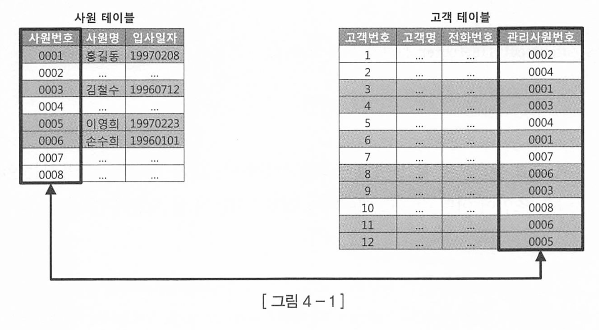

* 사원테이블의 기본키를 고객테이블의 관리사원번호라는 컬럼이 외래키로 맺고있음.

이 둘을 조인한다면?

```
# C/ JAVA
for (int i = 0; i < 100; i++) { 
    // outer loop
    for (int j = 0; j < 100; j++) { 
        // inner loop
        // Do Anything ...
    }
}

# PL/SQL
BEGIN
    FOR outer IN 1..100 LOOP
        FOR inner IN 1..100 LOOP
            dbms_output.put_line(outer || ' : ' || inner);
        END LOOP;
    END LOOP;
END;
```

* 슈도코드일뿐, 실제로 이렇게 반복수행하진 않는다. 

중첩 루프문을 사용해서 하는 조인이다.

NL조인은 아우터와 이너 테이블 모두 인덱스를 이용한다. 아우터 테이블의 사이즈가 크지 않으면 인덱스를 이용하지 않을수도 있다. 

반면, 이너테이블은 인덱스를 사용해야 한다. 이너 루프에서 위 예제의 관리 사원번호(외래키)로 데이터 검색시 인덱스를 이용하지 않으면, 아우터에서 읽은 건수만큼 풀 스캔을 반복하기 때문이다.

### 4.1.2 NL 조인 실행계획 제어
NL조인을 힌트로 제어할 수 있다.

```sql
# 오라클
SELECT /*+ ordered use_nl(c) */
    e.사원명, c.고객명, c.전화번호
FROM
    사원 e, 고객 c
WHERE
    e.입사일자 >= '19960101'
    AND c.관리사원번호 = e.사원번호;
    
    
```

* ordered 힌트는 FROM절에 기술한 순서대로 조인하라고 하는것. 
* 사원 테이블(Driving, outer) 기준으로 고객 테이블(driven, inner)과 NL 조인하라고 하는것이다.

비슷한 다른 언어로는

```sql
# Postgresql 
SET enable_hashjoin = OFF;
SET enable_mergejoin = OFF;

SELECT
    e.사원명, c.고객명, c.전화번호
FROM
    사원 e
JOIN
    고객 c ON c.관리사원번호 = e.사원번호
WHERE
    e.입사일자 >= '19960101';
-- SET enable_hashjoin = OFF;와 SET enable_mergejoin = OFF;를 사용하여 다른 조인 방법을 비활성화하고 NL 조인을 유도

# mysql 
SELECT STRAIGHT_JOIN
    e.사원명, c.고객명, c.전화번호
FROM
    사원 e
JOIN
    고객 c ON c.관리사원번호 = e.사원번호
WHERE
    e.입사일자 >= '19960101';
-- STRAIGHT_JOIN을 사용하면 MySQL이 조인의 순서를 그대로 유지
```

### 4.1.3 NL 조인 수행 과정 분석

아래와 같이 조건절을 추가한 경우 조건절 비교 순서는 어떻게 될까?

```sql
SELECT /*+ ordered use_nl(c) index(e) index(c) */
    e.사원번호, 
    e.사원명, 
    e.입사일자, 
    c.고객번호, 
    c.고객명, 
    c.전화번호, 
    c.최종주문금액
FROM
    사원 e, 고객 c
WHERE
    c.관리사원번호 = e.사원번호      -- 1
    AND e.입사일자 >= '19960101' -- 2
    AND e.부서코드 = '7123'      -- 3
    AND c.최종주문금액 >= 20000;  -- 4

# 인덱스
* 사원_PK : 사원번호
* 사원_X1 : 입사일자
* 고객_PK : 고객번호
* 고객_X1 : 관리사원번호
* 고객_X2 : 최종주문금액
```

* 두 테이블 모두 인덱스 명시했으므로 인덱스를 사용해서 액세스한다. 인덱스명은 명시하지 않아서 옵티마이저가 결정한다. 

```
| Id | Operation                        | Name    | Rows | Bytes | Cost |
|----|----------------------------------|---------|------|-------|------|
|  0 | SELECT STATEMENT                 |        |    5 |    58 |    5 |
|  1 |   NESTED LOOPS                   |        |    5 |    58 |    5 |
|  2 |    TABLE ACCESS BY INDEX ROWID   | 사원    |    3 |    20 |    2 |
|  3 |     INDEX RANGE SCAN             | 사원_X1 |    5 |       |    1 |
|  4 |    TABLE ACCESS BY INDEX ROWID   | 고객    |    5 |    76 |    2 |
|  5 |     INDEX RANGE SCAN             | 고객_X1 |    8 |       |    1 |
```

Sql 조건절 우측에 표시한 번호로 조건절 비교 순서를 나열하면, 2 - 3 - 1 - 4 순이 다.

1. **조건절 번호 ②**: `입사일자 >= '19960101'` 조건을 만족하는 레코드를 찾기 위해 `사원_X1` 인덱스를 Range 스캔한다. (실행 계획 ID = 3)
2. **조건절 번호 ③**: `사원_X1` 인덱스에서 읽은 ROWID로 `사원` 테이블을 액세스해서 `부서코드 = '7123'` 필터 조건을 만족하는지 확인한다. (실행 계획 ID = 2)
3. **조건절 번호 ①**: `사원` 테이블에서 읽은 `사원번호` 값으로 조인 조건(`c.관리사원번호 = e.사원번호`)을 만족하는 `고객` 쪽 레코드를 찾기 위해 `고객_X1` 인덱스를 Range 스캔한다. (실행 계획 ID = 5)
4. **조건절 번호 ④**: `고객_X1` 인덱스에서 읽은 ROWID로 `고객` 테이블을 액세스해서 `최종주문금액 >= 20000` 필터 조건을 만족하는지 확인한다. (실행 계획 ID = 4)

각 단계를 완료하고 다음 단계로 넘어가는게 아니고, 한 레코드씩 순차적으로 실행한다. 

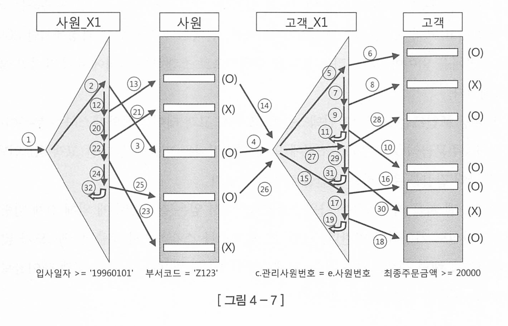

결론적으로, 드라이빙 테이블의 인덱스를 이용해서 접근하고, 필터링 한 후에

조인을 위해 드리븐 테이블의 외래키 인덱스를 이용하여 range 스캔 후 마지막 드리븐 필터 조건을 이용해서 걸러낸다. 

### 4.1.4 NL 조인 튜닝 포인트
첫번째 튜닝 포인트는 **랜덤 액세스를 줄이는 것**이다.

두번째 튜닝 포인트는 **조인 액세스 횟수를 줄여야 한다**. 조인 액세스 횟수는 Outer 테이블을 읽고 필터링한 결과 건수에 의해 결정된다.  - 드라이빙 테이블의 접근 결과를 줄이자.

세번째 튜닝 포인트는 드리븐 테이블의 인덱스를 읽고 액세스 하는 부분이다. 만약 액세스 후 필터링되어 걸러지는 비율이 높다면, 그만큼 쓸데없이 테이블에 액세스 많이 해서 블록 I/O가 발생한 것이므로 필터링 조건을 인덱스에 넣어서 I/O를 줄여야 한다(복합 인덱스를 일부러 조인용으로 만드는것)

마지막으로, 맨 처음 드라이빙 테이블에 액세스하는 인덱스에 의해 얻은 결과 건수에 의해 전체 횟수가 좌지우지 된다는 것을 기억하자. (드라이빙 테이블에서 조건에 의해 뽑은 로우 수만큼 반복해서 드리븐 테이블을 탐색한다) 

### 4.1.5 NL 조인 특징 요약

첫번째 특징은 랜덤 액세스 위주의 조인 방식이다. 레코드 하나를 읽으려고 블록을 통째로 읽는 방식이다. 인덱스 구성이 완벽해도, 대량 데이터 조인시 NL 조인이 불리한 이유다

두번째 특징은 조인을 한 레코드씩 순차적으로 진행한다.  첫번째 특징인 랜덤 액세스 위주 조인 때문에 대량 데이터 처리시 치명적이지만, **부분범위 처리가 가능한 상황**에서 한 레코드씩 순차적으로 처리해서 매우 빠른 응답 속도를 낼 수 있다. 

* 부분범위 처리 : 전체 데이터 집합 중 일부 범위만을 처리하는것
  * 예를들어 LIMIT 이라던가, 백만개 드라이빙 테이블 중 소량만 접근하는 조건을 준다던가

### 4.1.7 NL 조인 확장 메커니즘

오라클 관련 내용이라 생략한다. 

오라클에서는 NL조인 성능을 높이기 위해 테이블 Prefetch, 배치 I/O 기능이 추가됐따고 하는데 

**MySQL**은 **BKA**와 **MRR** 등의 기능을 통해 NL 조인의 I/O 성능을 최적화한다.

**PostgreSQL**은 **Parallel Query Execution**과 **JIT Compilation**을 통해 NL 조인을 포함한 쿼리의 성능을 높이고, **향상된 버퍼 관리**를 통해 효율적인 데이터 접근을 지원한다.

* **Parallel Query Execution**은 PostgreSQL에서 여러 코어를 활용하여 대용량 데이터를 병렬로 처리함으로써 쿼리 성능을 향상시키는 기능

  * 멀티 프로세스 디비이다.
  * 쿼리의 각 단계, 예를 들어 조인이나 스캔 등의 작업을 여러 프로세스가 동시에 수행 

* BKA는 여러 개의 검색 키를 한 번에 묶어서 처리하는 방식으로, 한 번의 I/O로 여러 행을 가져와서  큰 테이블을 조인할 때 I/O 작업을 줄여 성능을 향상

* **Multi-Range Read (MRR)**는 비순차적인 인덱스 조회 성능을 향상시키기 위한 기능.

  MRR은 범위 스캔 시 디스크 접근을 최적화하여, 필요한 데이터 블록을 한 번에 읽어온다.


왜 조인문을 아래와 같이 기록하는 습관이 좋을까? (외부 테이블을 오른쪽으로)

```sql
select *
from PRA_HST_STC a, ODM_TRMS b
where a.SALE_ORG_ID = :sale_org_id
and b.STRD_GRP ID = a.STRD_GRP ID
and b.STRD_ID = a.STRD_ID
order by a.STC_DT desc
```

* NL 조인에서 외부 테이블이 먼저 스캔되고, 그 후 내부 테이블에서 조인 조건에 맞는 데이터를 찾는다.
*  `PRA_HST_STC a`가 외부 테이블이고, `ODM_TRMS b`가 내부 테이블이다. 
  * 조인 조건에서 `b.STRD_GRP_ID = a.STRD_GRP_ID`와 `b.STRD_ID = a.STRD_ID`가 적용된다

* 조인 조건에서 `b.STRD_GRP_ID = a.STRD_GRP_ID`와 같은 조건이 있을 때, `b`가 `a`에 의존하는 내부 테이블임을 명확히 인식할 수 있다.


## 4.2 소트 머지 조인

조인 컬럼에 인덱스가 없거나, 대량 데이터 조인이어서 인덱스가 효과적이지 않을 때,

옵티마이저는 NL 조인 대신 소트 머지 조인이나 해시 조인을 선택한다.

**Sort-Merge Join**은 두 개의 테이블을 조인하는 방법 중 하나로, 조인할 테이블의 데이터가 정렬된 상태일 때 효율적으로 동작하는 조인 방식이다.

큰 데이터셋을 조인할 때 사용되며, 다음과 같은 절차로 수행된다. 

1. **정렬(Sort)**:
   - 조인에 참여하는 두 테이블의 조인 키를 기준으로 데이터를 정렬
     - 이 단계에서, 이미 정렬된 인덱스가 존재하면 정렬 과정이 생략될 수 있다.
2. **병합(Merge)**:
   - 두 테이블의 데이터를 정렬된 상태로 하나씩 비교하면서 병합
   - 정렬된 데이터는 빠르게 비교할 수 있기 때문에, 같은 키를 가진 데이터는 한 번의 스캔으로 결합된다 


MySQL에서는 소트 머지 조인을 지원하지 않는다. 

**PostgreSQL**는 Sort-Merge Join을 기본적으로 지원하며 **실행 계획**에서 `Merge Join`으로 표시된다. 

PostgreSQL 옵티마이저는 조인할 두 테이블이 정렬된 상태이거나, 정렬 비용이 비교적 저렴할 때 Sort-Merge Join을 선택한다.


소트머지조인과 해시 조인을 이해하려면 PGA에 대해 알아야 한다.

* **PGA**(Program Global Area)는 Oracle Database에서 사용되는 메모리 영역 중 하나로, 특정 사용자 세션에 의해 독립적으로 할당되고 사용되는 영역

### 4.2.1 SGA vs. PGA
공유 메모리 영역인 SGA(System or Shared Global Area)에 캐시된 데이터는 여러 프로세스가 공유할 수 있다.

동시에 액세스 할 수는 없다. 

데이터 블록과 인덱스 블록을 캐싱하는 DB 버퍼 캐시는 SGA의 가장 핵심적인 구성요소이며, 블록을 읽으려면 버퍼 Lock도 읽어야 한다.

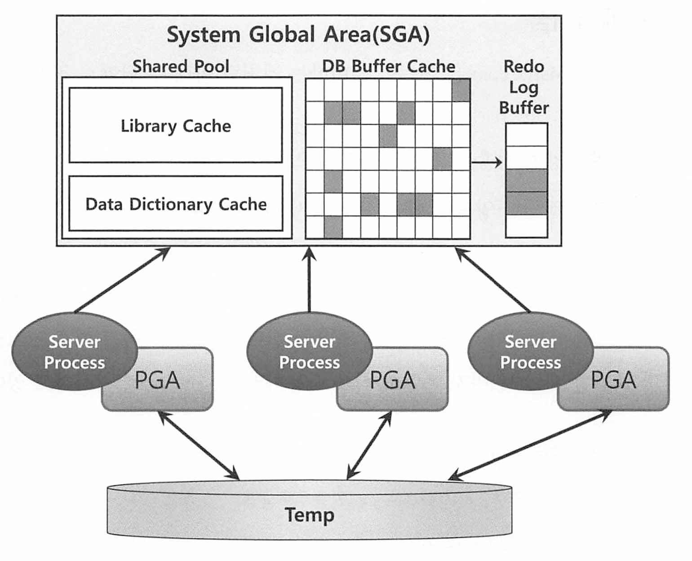

오라클 서버 프로세스는 SGA에 공유된 데이터를 읽고 쓰면서, 동시에 자신만의 고유 메모리 영역을 갖는다.

이 각 서버 프로세스에 할당된 메모리 영역을 PGA(Process/Program/Private Global Area)라고 부르며 프로세스에 종속적인 고유 데이터를 저장하는 용도로 사용된다. 할당받은 PGA 공간이 적어 데이터를 모두 저장할 수 없으며 Temp 테이블 스페이스를 사용한다.


PGA는 다른 프로세스와 공유하지 않는 공간이여서 락(래치)이 불필요하며, 때문에 같은 양의 데이터를 읽더라도 SGA캐시에서 읽을때보다 훨씬 빠르다. 

### 4.2.2 기본 메커니즘

소트 머지 조인(Sort Merge Join)은 이름이 의미하는 것처럼 아래 두 단계로 진행한다.

1. 소트 단계 : 양쪽 집합을 조인 컬럼 기준으로 정렬한다.
2. 머지 단계 : 정렬한 양쪽 집합을 서로 머지(Merge)한다.

아래 소트 머지 조인과정을 보자. 소트 머지 조인을 use_merge 힌트로 유도한다

```sql
SELECT /*+ ordered use_merge(c) */
    e.사원번호, 
    e.사원명, 
    e.입사일자, 
    c.고객번호, 
    c.고객명, 
    c.전화번호, 
    c.최종주문금액
FROM
    사원 e,    고객 c 
WHERE
    c.관리사원번호 = e.사원번호
    AND e.입사일자 >= '19960101'
    AND e.부서코드 = 'Z123'
    AND c.최종주문금액 >= 20000;
```

1. 입사일자 >= '19960101' 이고 부서코드가 Z123에 **사원** 데이터를 읽어 조인 컬럼인 사원번호 순으로 정렬하고, 결과집합은 PGA 영역에 할당된 Sort Area에 할당
2. **고객** 테이블에서 고객의 최종주문금액 >= 20000인 데이터를 읽어 Sort Area에 저장 
3. PGA 또는 Temp 스페이스에 저장한 사원 데이터를 스캔하면서 PGA에 저장된 고객 데이터와 조인함. 

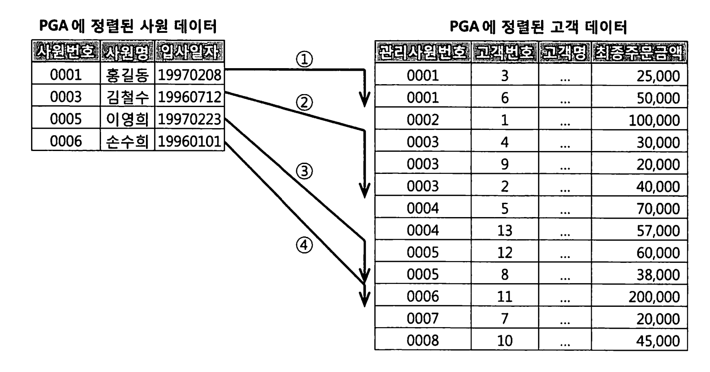

중요한것은, 사원 데이터 기준으로 고객을 매번 풀 스캔 하지 않는다. 고객 데이터가 정렬되어 있으므로 조인 대상 레코드가 시작되는 시점을 쉽게 찾고, 조인에 실패하는 레코드를 만나는 순간 바로 멈출 수 있다.

### 4.2.3 소트 머지 조인이 빠른 이유

소트머지조인은 Sort Area에 미리 정렬해둔 자료구조를 이용한다는 점만 다를 뿐 조인 프로세싱 자체는 NL 조인과 같다.

왜 대량 데이터 조인시 소트 머지 조인이 더 빠를까? 

NL조인은 단적으로 말해 인덱스를 이용한 조인 방식이다. 조인 과정에서 액세스하는 모든 블록을 랜덤액세스 방식으로 **건건이** DB 버퍼캐시를 경유해서 읽기 때문에 읽는 모든 블록에 래치 획득(락) 등을 통하기 때문에 느리다.

반면 소트머지 조인은 양쪽 테이블로부터 조인 대상 집합을 일괄적으로 읽어 저장한 후 조인하기 때문에, 래치 획득(락)과 같은 과정이 없으므로 훨씬 빠르다. 

소트 머지 조인도 양쪽 테이블로부터 **조인 대상 집합을 읽을 때는 DB 버퍼캐시를 경유**한다.

이때 인덱스를 이용하기도 한다. 이 과정에서 생기는 버퍼캐시 탐색 비용과 랜덤 액세스 부하는 소트 머지 조인도 피할 수 없다.

### 4.2.4 소트 머지 조인의 주용도

그러나 해시 조인이 등장한 이후로는 소트머지조인도 필요없다. 해시조인이 더 빠르기 때문이다.

그러나 해시 조인은 조인 조건식이 등치 (=)가 아닐때는 사용할 수 없다는 단점이 있다.

그래서 소트 머지 조인은 아래와 같은 상황에 주로 쓰인다.

* 조인 조건식이 등치(=)가 아닌 대량 데이터 조인
* 조건 조건식이 아예 없는 카테시안 곱, 크로스 조인

### 4.2.5 소트 머지 조인 제어하기

아래는  소트머진 조인 실행계획이다.

양쪽 테이블을 각각 소트 한 후 위쪽 사원 테이블 기준으로 아래쪽 고객 테이블과 머지 조인한다

```
Execution Plan
---------------------------------------------------------
0  SELECT STATEMENT Optimizer=ALL_ROWS
1  0 MERGE JOIN
2  1 SORT (JOIN)
3  2 TABLE ACCESS (BY INDEX ROWID) OF '사원' (TABLE)
4  3 INDEX (RANGE SCAN) OF '사원_X1' (INDEX)
5  1 SORT (JOIN)
6  5 TABLE ACCESS (BY INDEX ROWID) OF '고객' (TABLE)
7  6 INDEX (RANGE SCAN) OF '고객_X1' (INDEX)

# 아래는 postgresql 
Merge Join  (cost=...)
  Merge Cond: (e.사원번호 = c.관리사원번호)
  ->  Sort  (cost=...)
        Sort Key: e.사원번호
        ->  Index Scan using 사원_X1 on 사원 e  (cost=...)
              Index Cond: (입사일자 = '19960101'::date)
              Filter: (부서코드 = '7123')
  ->  Sort  (cost=...)
        Sort Key: c.관리사원번호
        ->  Index Scan using 고객_X1 on 고객 c  (cost=...)
              Filter: (최종주문금액 >= 20000)

```

### 4.2.6 소트 머지 조인 특징 요약

소트 머지 조인은 조인을 위해 실시간으로 인덱스를 생성하는 것과 다름 없다.

소트 부하만 감수한다면, 버퍼 캐시를 경유하는 NL조인보다 빠르다.

소트 머지 조인은 인덱스 유무에 크게 영향을 받지 않는다.

그러나 양쪽 집합으로부터 조인 대상 레코드를 찾는데 인덱스를 사용하면 랜덤 액세스가 일어나고, 버퍼 캐시를 경유할 수도 있다. 

## 4.3 해시 조인
NL조인은 인덱스를 이용해도 랜덤 액세스 I/O때문에 대량 데이터 처리에 불리하고,

소트 머지 조인은 항상 양쪽 테이블을 정렬하는 부담이 있다.

해시 조인은 그런것들이 없지만 항상 사용할 수는 없다. 

### 4.3.1 기본 메커니즘

해시 조인도 소트 머지 조인처럼 두 단계로 진행된다

1. build 단계 : 작은쪽 테이블(build input)을 읽어 해시 테이블(해시 맵)을 생성한다
2. Probe 단계 : 큰쪽 테이블(Prob input)을 읽어 해시 테이블을 탐색하면서 조인한다. 

아래는 해시 조인 힌트를 이용해서 유도하는 쿼리이다.

```sql
SELECT /*+ ordered use_hash(c) */
    e.사원번호, 
    e.사원명, 
    e.입사일자, 
    c.고객번호, 
    c.고객명, 
    c.전화번호, 
    c.최종주문금액
FROM
    사원 e, 고객 c
WHERE 
    c.관리사원번호 = e.사원번호
    AND e.입사일자 >= '19960101'
    AND e.부서코드 = '7123'
    AND c.최종주문금액 >= 20000;

# Postgresql
SET enable_nestloop = OFF;
SET enable_mergejoin = OFF;

SELECT
    e.사원번호, 
    e.사원명, 
    e.입사일자, 
    c.고객번호, 
    c.고객명, 
    c.전화번호, 
    c.최종주문금액
FROM
    사원 e
JOIN
    고객 c ON c.관리사원번호 = e.사원번호
WHERE 
    e.입사일자 >= '19960101'
    AND e.부서코드 = '7123'
    AND c.최종주문금액 >= 20000;
    
# MySQL
SELECT /*+ HASH_JOIN(e c) */
    e.사원번호, 
    e.사원명, 
    e.입사일자, 
    c.고객번호, 
    c.고객명, 
    c.전화번호, 
    c.최종주문금액
FROM
    사원 e
JOIN
    고객 c
WHERE 
    c.관리사원번호 = e.사원번호
    AND e.입사일자 >= '1996-01-01'
    AND e.부서코드 = '7123'
    AND c.최종주문금액 >= 20000;
```

위 SQL 수행 과정을 그림과 함께 풀면

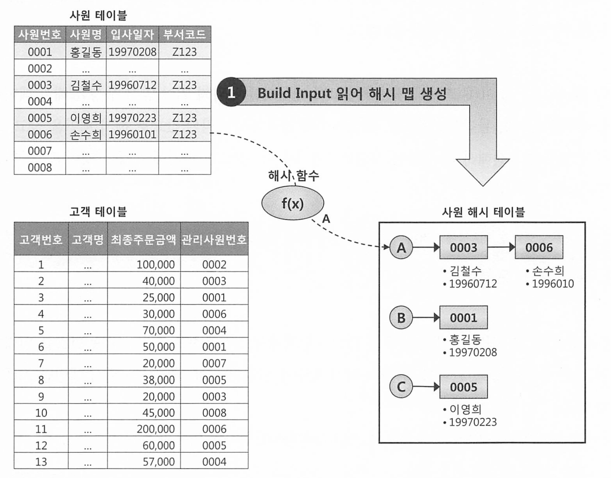

1. build 단계 : 조건에 해당하는 사원 데이터를 읽어 해시 테이블을 생성한다. 조인컬럼인 사원번호를 해시 테이블 키 값으로 사용한다. 사원번호를 해시 함수를 통해 나온 값으로 해시 체인을 찾고 해시 체인에 데이터를 연결한다.

```sql
SELECT 사원번호, 사원명, 입사일자
FROM 사원
WHERE 입사일자 >= '19960101'
AND 부서코드 = 'Z123'
```

2. Probe 단계 : 아래 조건에 해당하는 고객 데이터를 하나씩 읽어 앞서 생성한 해시 테이블을 탐색한다. 마찬가지로 조인 조건의키를 이용해서 해시 체인을 찾고, 해시 체인을 스캔해서 값이 같은 사원번호를 찾는다. 찾으면 조인 성공, 못찾으면 버림

```sql
SELECT 고객번호, 고객명, 전화번호, 최종주문금액, 관리사원번호
FROM 고객
WHERE 최종 주문금액 >= 20000
```

### 4.3.2 해시 조인이 빠른 이유

해시 테이블을 이용한다는점만 다를뿐, 해시 조인도 조인 프로세싱 자체는 NL조인과 같다.

해시 조인이 빠른 이유는 소트 머지 조인과 같다. 해시 테이블을  PGA영역에 할당하기 때문에 락도 필요없다.

이때 인덱스를 이용하기도 한다. 이 과정에서 생기는 버퍼캐시 탐색 비용과 랜덤 액세스 부 하는 해시 조인이라도 피할 수 없다.


어째서대량 데이터 조인시 일반적으로 소트 머지조인보다 해시 조인이 빠를까?

그 성능 차이는 조인 연산 시작 전, 사전 준비 작업에서 차이난다.

해시 조인은 둘 중 작은 테이블을 해시 맵 build input으로 선택하므로, Temp Table Space 즉 디스크에 쓰는 작업이 거의 전혀 일어나지 않는다.(초 대용량일때나 PGA가 딸리지 않은이상)

정리하자면.

1. NL 조인처럼 랜덤 액세스 부하가 없고
2. 소트 머지 조인처럼 양쪽 집합을 미리 정렬하는 부하도 없다.


그리고 Build input(해시 테이블)이 PGA 메모리에 다 담겼을때 즉 인메모리일 때 제일 빠르다. 

### 4.3.3 대용량 Build Input 처리
만약 두 테이블이 초 대용량이여서 인메모리 해시 조인이 불가능하다면?

이때 DBMS는 분할 정복 방식을 이용해서 조인한다.


1. 파티션 단계 : 조인하는 양쪽 집합의 조인 컬럼에 해시 함수를 적용하고 반환된 해시 값에 따라 동적으로 파티셔닝 한다. 독립적으로 처리할 수 있는 여러 작은 서브 집합으로 분할해서 파티션 pair를 생성한다.
   * 이때 양쪽 집합을 읽어 디스크 Temp에 둘다 저장해야하므로 인메모리 해시 조인보다 성능이 많이 떨어진다

2.  조인 단계 : 파티션 단계까 완료되면 각 파티션 pair에 대해 하나씩 조인을 수행한다. 그리고 모든 파티션에 대해 처리를 마칠떄까지 반복한다. 

### 4.3.5 조인 메소드 선택 기준

해시조인이 무조건 빠르다고 선택하면 안된다. 아래 조건들을 보고 조인을 선택하자.

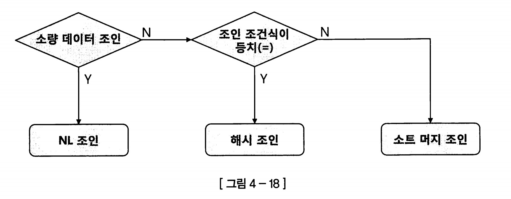

1. 소량 데이터 조인할 때 - NL 조인
2. 대량 데이터 조인할 때 - 해시 조인
3. 대량 데이터 조인인데 해시 조인으로 처리할 수 없을 때, 즉 조인 조건식이 등치(=)
    조건이 아닐 때(조인 조건식이 아예 없는 카테시안 곱 포함) - 소트 머지 조인

> 소량 대량의 기준은, 데이터량에 관한것이 아닌 랜덤 액세스가 많은것을 기준으로 한다. 랜덤 액세스가 많으면 대량 데이터라고 볼 수 있다.

수행빈도가 매우 높은 쿼리에 대해선 아래와 같은 기준도 제시하고 싶다.

1. (최적화된) NL. 조인과 해시 조인 성능이 같으면, NL 조인
2. 해시 조인이 약간 더 빨라도 NL 조인
3. NL 조인보다 해시 조인이 매우 빠른 경우, 해시 조인


왜 해시조인이약간 빨라도 NL 조인을 선택할까?

NL조인에 사용되는 인덱스는 앵간해서 영구적으로 유지되고, 재사용된다. 반면 해시테이블은 하나의 쿼리를 위해 생성하고 조인이 끝나면 바로 소멸한다. **같은 쿼리를 100개 프로세스가 동시에 실행하면, 해시 테이블도 100개가 만들어진다.** <u>이 과정에서 수행시간이 짧고 수행빈도가 잦다면 CPU와 메모리 사용량이 크게 증가하기도 하고 래치 경합도 발생하기 때문에 디비에 큰 부담을 줄 수 있다.</u>


결론적으로 해시 조인은 아래 경우에 사용하자. 

1. 수행 빈도가 낮고
2. 쿼리 수행시간이 오래걸리는
3. 대량 데이터 조인(랜덤 액세스 많이 발생하는)

즉 해시 조인은, 배치, DW(Data WareHouse), OLAP(Online Analytical Processing)성에 해당하는 쿼리에 사용하는것이 좋다. 

## 4.4 서브쿼리 조인

옵티마이저가 서브쿼리를 통한 조인을 만나게 되면 다양한 형태로 쿼리 변환을 시도하므로 어떻게 변환되는지 잘 이해해야 한다. 

### 4.4.1 서브쿼리 변환이 필요한 이유
옵티마이저는 비용(cost)를 평가하고 실행계획 세우기 전 사용자로부터 받은 쿼리를 최적화에 유리한 형태로 변환하는 작업, 쿼리 변환부터 진행한다.

쿼리 변환은 옵티마이저가 SQL을 분석해 같은 결과를 반환하는 쿼리를 더 좋은 성능이 기대되는 형태로 재작성하는것을 말한다. 

서브쿼리를 오라클은 3가지로 뷴라한다.

* 인라인 뷰 : FROM절에 사용한 서브쿼리
* nested subquery : where절에 사용한 서브쿼리. 서브쿼리가 메인쿼리 컬럼을 참조하면 상관 서브쿼리라고 한다
* 스칼라 서브쿼리 : 한 레코드랑 정확히 하나의 값을 반환하는 서브쿼리


### 4.4.2 서브쿼리와 조인

서브쿼리는 메인 쿼리에 종속되므로 단독으로 실행될수없으며, 메인쿼리 건수만큼 받아 반복적으로 필터링하는 방식으로 실행된다. 

#### 서브쿼리 필터 오퍼레이션

서브쿼리를 where절에 사용시 필터방식으로 사용할 수 있다.

```sql
SELECT c.고객번호, c.고객명
FROM 고객 c
WHERE c.가입일시 >= TRUNC(ADD_MONTHS(SYSDATE, -1), 'mm')
AND EXISTS (
    SELECT /*+ no_unnest */
           'x' 
    FROM 거래 
    WHERE 고객번호 = c.고객번호
    AND 거래일시 >= TRUNC(SYSDATE, 'mm')
);
```

필터(Filter) 오퍼레이션은 기본적으로 NL 조인과 처리 루틴이 같다.

또한 필터 서브쿼리는 일반 NL조인과 달리 메인쿼리에 종속되므로 조인 순서가 고정되어 메인 쿼리가 항상 드라이빙 테이블이 된다. 


#### 서브쿼리 unnesting

서브쿼리 언네스팅(Unnesting)이란 데이터베이스에서 서브쿼리를 제거하거나 단순화하여 쿼리 성능을 개선하는 최적화 기술. Nested Subquery에서 주로 사용된다.

```sql
SELECT c.고객번호, c.고객명
FROM 고객 c
WHERE c.가입일시 >= TRUNC(ADD_MONTHS(SYSDATE, -1), 'mm')
AND EXISTS (
    SELECT /*+ unnest */
           'x' 
    FROM 거래 
    WHERE 고객번호 = c.고객번호
    AND 거래일시 >= TRUNC(SYSDATE, 'mm')
);
```

서브쿼리 Unnesting은 메인과 서브쿼리간의 계층 구조를 풀어 서로 같은 flat한 레벨로 만들어 준다. 

Unnesting된 서브쿼리는 메인 쿼리 집합보다 먼저 실행되어 드라이빙이 될 수도 있다.

아래처럼 조인으로 풀릴수있다.

```sql
SELECT DISTINCT c.고객번호, c.고객명
FROM 고객 c
JOIN 거래 t ON c.고객번호 = t.고객번호
WHERE c.가입일시 >= TRUNC(ADD_MONTHS(SYSDATE, -1), 'MM')
AND t.거래일시 >= TRUNC(SYSDATE, 'MM');
```

**서브쿼리 제거**: `EXISTS` 절에 있던 서브쿼리가 제거되고, 메인 쿼리의 `고객` 테이블과 `거래` 테이블 간의 조인으로 변환

**JOIN 사용**: `고객` 테이블과 `거래` 테이블이 고객번호(`고객번호`)를 기준으로 `JOIN`

**DISTINCT 추가**: 중복된 결과를 방지하기 위해 `DISTINCT`를 사용. `JOIN`을 사용하면 한 고객이 여러 번 거래한 경우 중복된 행이 발생할 수 있기 때문

**조건문 유지**: `WHERE` 절에서 `가입일시`와 `거래일시`에 대한 조건을 유지하여, 기존 쿼리와 동일한 결과를 반환


Limit이나 RowNum을 서브쿼리에 사용하는 경우 쿼리 성능을 떨어트리기도 한다.

옵티마이저가 서브 쿼리 블록을 손대지 않을수도 있기 때문이다. 

### 4.4.3 뷰(View)와 조인

인라인 뷰는 서브쿼리가 from절에 사용되었을 때다.

### 4.4.4 스칼라 서브쿼리 조인

#### 1. 스칼라서브쿼리 특징

스칼라 서브쿼리는 메인쿼리 건수만큼 반복 실행한다.

```sql
select empno, ename, sal, hiredate, 
		(select d.dname, from dept d where d.deptno = e.deptno) as dname
from emp e
where sal >= 2000
```

위 쿼리는 아래 OUTER 조인문처럼 NL조인방식으로 풀린다.

```sql
select e.empno, e.ename, e.sal, e.hiredate, d.dname
from emp e, dept d
where d.deptno(+) = e.deptno
and e.sal >= 2000
```

스칼라 서브쿼리 캐싱 기능은 mysql과 postgresql에는 존재하지 않는다. 


# 5장. 소트 튜닝

## 5.1 소트 연산에 대한 이해
### 5.1.1 소트 수행 과정
### 5.1.2 소트 오퍼레이션

## 5.2 소트가 발생하지 않도록 SQL 작성
### 5.2.1 Union vs. Union All
### 5.2.2 Exists 활용

## 5.3 인덱스를 이용한 소트 연산 생략
### 5.3.1 Sort Order By 생략
### 5.3.2 Top N 쿼리
### 5.3.3 최소값/최대값 구하기
### 5.3.4 이력 조회
### 5.3.5 Sort Group By 생략

## 5.4 Sort Area를 적게 사용하도록 SQL 작성
### 5.4.1 소트 데이터 줄이기
### 5.4.2 Top N 쿼리의 소트 부하 경감 원리
### 5.4.3 Top N 쿼리가 아닐 때 발생하는 소트 부하
### 5.4.4 분석함수에서의 Top N 소트

# 6장. DML 튜닝

## 6.1 기본 DML 튜닝
### 6.1.1 DML 성능에 영향을 미치는 요소
### 6.1.2 데이터베이스 Call과 성능
### 6.1.3 Array Processing 활용
### 6.1.4 인덱스 및 제약 해제를 통한 대량 DML 튜닝
### 6.1.5 수정가능 조인 뷰
### 6.1.6 MERGE 문 활용

## 6.2 Direct Path I/O 활용
### 6.2.1 Direct Path I/O
### 6.2.2 Direct Path Insert
### 6.2.3 병렬 DML

## 6.3 파티션을 활용한 DML 튜닝
### 6.3.1 테이블 파티션
### 6.3.2 인덱스 파티션
### 6.3.3 파티션을 활용한 대량 UPDATE 튜닝
### 6.3.4 파티션을 활용한 대량 DELETE 튜닝
### 6.3.5 파티션을 활용한 대량 INSERT 튜닝

## 6.4 Lock과 트랜잭션 동시성 제어
### 6.4.1 오라클 Lock
### 6.4.2 트랜잭션 동시성 제어
### 6.4.3 채번 방식에 따른 INSERT 성능 비교

# 7장. SQL 옵티마이저

## 7.1 통계정보와 비용 계산 원리
### 7.1.1 선택도와 카디널리티
### 7.1.2 통계정보
### 7.1.3 비용 계산 원리

## 7.2 옵티마이저에 대한 이해
### 7.2.1 옵티마이저 종류
### 7.2.2 옵티마이저 모드
### 7.2.3 옵티마이저에 영향을 미치는 요소
### 7.2.4 옵티마이저의 한계
### 7.2.5 개발자의 역할
### 7.2.6 튜닝 전문가 되는 공부방법