# 친절한 SQL 튜닝

[toc]


# 1장. SQL 처리 과정과 I/O

## 1.1 SQL 파싱과 최적화
### 1.1.1 구조적, 집합적, 선언적 질의 언어
SQL 은 구조적 질의 언어다. structured이고, set-based이며 declarative인 질의 언어다/.

* 집합(set-based)적이란건, 개별 행을 하나씩 처리하는게 아닌 데이터 집한을 한번에 처리한다는 의미 
* 선언적이라는것은, 어떻게 조회할지는 DBMS 처리에 맡기고, 무엇을 조회할지만 명확히 선언하여 기술한다는 의미

### 1.1.2 SQL 최적화

DBMS 내부에서 프로시저를 작성하고, 컴파일해서 실행 가능한 상태로 만드는 전 과정을 SQL 최적화 라고 한다.

SQL 실행 전 최적화 과정을 세분화하면 아래와 같다. 

1. SQL 파싱: SQL을 전달받으면 먼저 SQL 파서가 파싱을 진행한다
   * 파싱 트리 생성 : SQL문의 개별 구성 요소를 분석해서 파싱 트리 생성
   * Syntax 체크 : 문법적 오류가 없는지 확인. 키워드나 순서 확인 
   * Semantic 체크 : 의미상 오류가 없는지 확인. 존재하지않는 테이블이나 컬럼 및 해당 오브젝트에 대한 권한 확인
2. SQL 최적화 : 옵티마이저가 통계정보를 바탕으로 가장 효율적인 실행 경로를 선택한다. 
3. 로우 소스 생성 : 옵티마이저가 선택한 실행 경로를 실행 가능한 코드 또는 프로시저 형태로 포맷팅 하는 단계

### 1.1.3 SQL 옵티마이저

옵티마이저는 가장 효율적으로 작업을 수행할 수 있는 최적의 데이터 액세스 경로를 선택해주는 핵심 엔진이다.

옵티마이저의 최적화 단계를 요약하면 아래와 같다. 

1. 사용자로부터 전달받은 쿼리를 수행하는데 후보군이 될만한 실행계획들을 찾아낸다
2. 데이터 딕셔너리에 미리 수집해 둔 오브젝트 통계 및 시스템 통계 정보를 이용해 각 실행계획의 예상비용을 산정한다
3. 최저비용을 나타내는 실행계획을 선택한다.

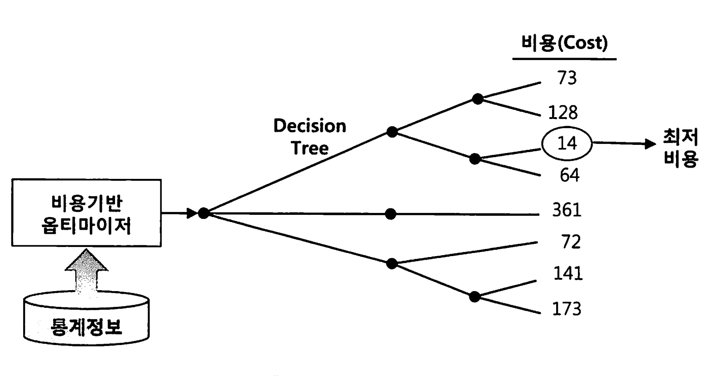

### 1.1.4 실행계획과 비용

옵티마이저의 실행계획은 네비게이션과 비슷하다.

DBMS에도 SQL 실행경로 미리보기 기능이 있다. 그것이 실행 계획이다.

**MySQL**: `EXPLAIN`

```mysql
EXPLAIN SELECT * FROM employees WHERE department = 'IT';
```

**Oracle**: `EXPLAIN PLAN FOR`와 `DBMS_XPLAN`

```oracle
EXPLAIN PLAN FOR SELECT * FROM employees WHERE department = 'IT';
SELECT * FROM TABLE(DBMS_XPLAN.DISPLAY);
```

**PostgreSQL**: `EXPLAIN` 또는 `EXPLAIN ANALYZE`

```postgresql
EXPLAIN ANALYZE SELECT * FROM employees WHERE department = 'IT';
```

**DBMS별 각 테이블의 통계정보 수집방법.**

- **MySQL**: `ANALYZE TABLE`
  
  ```sql
  ANALYZE TABLE employees;
  ```
- **Oracle**: `DBMS_STATS.GATHER_TABLE_STATS`
  ```sql
  BEGIN
     DBMS_STATS.GATHER_TABLE_STATS('schema_name', 'employees');
  END;
  /
  ```
- **PostgreSQL**: `ANALYZE`
  ```sql
  ANALYZE employees;
  ```

Cost(비용)은 쿼리를 수행하는동안 발생할것으로 예상하는 I/O 횟수 또는 예상 소요시간 값인데, 이것이 가장 적은것을 수행하는것이 좋다.

### 1.1.5 옵티마이저 힌트

항상 옵티마이저가 선택한 실행계획이 최적인것은 아니다.

SQL이 복잡할수록 실수한 가능성도 크다. 

이럴때 옵티마이저 힌트를 이용해 데이터 액세스 경로를 지정할 수 있따. 

SQL 힌트는 쿼리의 실행 계획을 최적화하거나 특정 방식으로 강제하기 위해 사용됩니다. 각 DBMS별로 힌트를 적용하는 방법을 설명하겠습니다.

* MySQL에서는 힌트를 쿼리의 `SELECT` 문 뒤에 주석 형태로 작성

```sql
SELECT /*+ INDEX(employees idx_department) */ * 
FROM employees 
WHERE department = 'IT';
```

* Oracle에서는 힌트를 쿼리의 `SELECT` 문 뒤에 `/*+ */` 형식으로 작성

```sql
SELECT /*+ FULL(employees) */ * 
FROM employees 
WHERE department = 'IT';
```


PostgreSQL은 MySQL이나 Oracle과 달리 힌트 기능을 기본적으로 지원하지 않아서 

`pg_hint_plan` extension을 설치한 후, 힌트를 사용할 수 있다.

```sql
SELECT /*+ SeqScan(employees) */ * 
FROM employees 
WHERE department = 'IT';
```

자주 수행하는 힌트 목록

### MySQL 자주 사용하는 힌트 목록

| 힌트                 | 설명                                             | 예제                                                       |
| -------------------- | ------------------------------------------------ | ---------------------------------------------------------- |
| **최적화 목표**      |                                                  |                                                            |
| `MAX_EXECUTION_TIME` | 쿼리의 최대 실행 시간을 설정 (밀리초 단위)       | `SELECT /*+ MAX_EXECUTION_TIME(1000) */ * FROM employees;` |
| **액세스 방식**      |                                                  |                                                            |
| `USE INDEX`          | 특정 인덱스를 사용하도록 강제                    | `SELECT /*+ USE INDEX(idx_name) */ * FROM table_name;`     |
| `FORCE INDEX`        | 지정한 인덱스를 반드시 사용                      | `SELECT /*+ FORCE INDEX(idx_name) */ * FROM table_name;`   |
| `IGNORE INDEX`       | 지정한 인덱스를 사용하지 않도록 강제             | `SELECT /*+ IGNORE INDEX(idx_name) */ * FROM table_name;`  |
| **조인 순서**        |                                                  |                                                            |
| `STRAIGHT_JOIN`      | 조인의 순서를 최적화가 아닌 명시된 순서대로 처리 | `SELECT /*+ STRAIGHT_JOIN */ * FROM table1 JOIN table2;`   |
| **병렬 처리**        |                                                  |                                                            |
| `SQL_NO_CACHE`       | 쿼리 결과를 쿼리 캐시에 저장하지 않음            | `SELECT /*+ SQL_NO_CACHE */ * FROM table_name;`            |

### Oracle 자주 사용하는 힌트 목록

| 힌트                      | 설명                                                    | 예제                                                         |
| ------------------------- | ------------------------------------------------------- | ------------------------------------------------------------ |
| **최적화 목표**           |                                                         |                                                              |
| `ALL_ROWS`                | 최적의 처리량을 위해 전체 쿼리 비용을 최소화            | `SELECT /*+ ALL_ROWS */ * FROM employees;`                   |
| `FIRST_ROWS(n)`           | 응답 시간을 최소화하기 위해 처음 n개의 행 반환을 최적화 | `SELECT /*+ FIRST_ROWS(10) */ * FROM employees;`             |
| **액세스 방식**           |                                                         |                                                              |
| `INDEX`                   | 특정 인덱스를 사용하도록 강제                           | `SELECT /*+ INDEX(employees emp_idx) */ * FROM employees;`   |
| `FULL`                    | 테이블 풀 스캔을 사용하도록 강제                        | `SELECT /*+ FULL(employees) */ * FROM employees;`            |
| **조인 순서**             |                                                         |                                                              |
| `ORDERED`                 | 테이블을 FROM 절에 나열된 순서대로 조인                 | `SELECT /*+ ORDERED */ * FROM employees e, departments d WHERE e.dept_id = d.id;` |
| **조인 방식**             |                                                         |                                                              |
| `USE_NL`                  | NL 조인 사용을 강제                                     | `SELECT /*+ USE_NL(employees) */ * FROM employees e JOIN departments d ON e.dept_id = d.id;` |
| `USE_HASH`                | 해시 조인 사용을 강제                                   | `SELECT /*+ USE_HASH(employees) */ * FROM employees e JOIN departments d ON e.dept_id = d.id;` |
| `USE_MERGE`               | 소트 머지 조인 사용을 강제                              | `SELECT /*+ USE_MERGE(employees) */ * FROM employees e JOIN departments d ON e.dept_id = d.id;` |
| **서브쿼리 팩토링**       |                                                         |                                                              |
| `WITH_PLSQL`              | 서브쿼리를 PLSQL 블록으로 변환                          | `WITH /*+ WITH_PLSQL */ emp_cte AS (SELECT * FROM employees) SELECT * FROM emp_cte;` |
| **쿼리 변환**             |                                                         |                                                              |
| `NO_QUERY_TRANSFORMATION` | 쿼리 변환을 방지                                        | `SELECT /*+ NO_QUERY_TRANSFORMATION */ * FROM employees;`    |
| **병렬 처리**             |                                                         |                                                              |
| `PARALLEL`                | 쿼리를 병렬로 실행                                      | `SELECT /*+ PARALLEL(employees, 4) */ * FROM employees;`     |
| `NOPARALLEL`              | 병렬 실행을 하지 않도록 강제                            | `SELECT /*+ NOPARALLEL(employees) */ * FROM employees;`      |

### PostgreSQL (`pg_hint_plan` 확장) 자주 사용하는 힌트 목록

| 힌트                | 설명                                 | 예제                                                         |
| ------------------- | ------------------------------------ | ------------------------------------------------------------ |
| **최적화 목표**     |                                      |                                                              |
| `Leading`           | 조인의 순서를 제어하는 데 사용       | `SELECT /*+ Leading(t1 t2) */ * FROM t1 JOIN t2 ON t1.id = t2.id;` |
| **액세스 방식**     |                                      |                                                              |
| `SeqScan`           | 시퀀셜 스캔을 사용하도록 강제        | `SELECT /*+ SeqScan(employees) */ * FROM employees;`         |
| `IndexScan`         | 인덱스 스캔을 사용하도록 강제        | `SELECT /*+ IndexScan(employees emp_idx) */ * FROM employees;` |
| `BitmapScan`        | 비트맵 인덱스 스캔을 사용하도록 강제 | `SELECT /*+ BitmapScan(employees emp_idx) */ * FROM employees;` |
| `NoIndexScan`       | 인덱스 스캔을 사용하지 않도록 강제   | `SELECT /*+ NoIndexScan(employees) */ * FROM employees;`     |
| **조인 순서**       |                                      |                                                              |
| `NestLoop`          | NL 조인을 사용하도록 강제            | `SELECT /*+ NestLoop */ * FROM employees e JOIN departments d ON e.dept_id = d.id;` |
| `HashJoin`          | 해시 조인을 사용하도록 강제          | `SELECT /*+ HashJoin */ * FROM employees e JOIN departments d ON e.dept_id = d.id;` |
| `MergeJoin`         | 소트 머지 조인을 사용하도록 강제     | `SELECT /*+ MergeJoin */ * FROM employees e JOIN departments d ON e.dept_id = d.id;` |
| **서브쿼리 팩토링** |                                      |                                                              |
| `NoInline`          | CTE를 인라인화하지 않음              | `WITH emp_cte AS (SELECT * FROM employees) SELECT /*+ NoInline */ * FROM emp_cte;` |
| **쿼리 변환**       |                                      |                                                              |
| `NoPushDown`        | 서브쿼리를 푸시 다운하지 않음        | `SELECT /*+ NoPushDown */ * FROM employees WHERE dept_id IN (SELECT dept_id FROM departments);` |
| **병렬 처리**       |                                      |                                                              |
| `Parallel`          | 쿼리를 병렬로 실행                   | `SELECT /*+ Parallel(employees 4) */ * FROM employees;`      |
| `NoParallel`        | 병렬 실행을 하지 않도록 강제         | `SELECT /*+ NoParallel(employees) */ * FROM employees;`      |

## 1.2 SQL 공유 및 재사용

### 1.2.1 소프트 파싱 vs. 하드 파싱

SQL 파싱, 최적화, 로우소스 생성 과정을 거쳐 생성한 내부 프로시저를 반복 재사용할 수 있도록 캐싱해두는 메모리 공간을 라이브러리 캐시라고 한다.

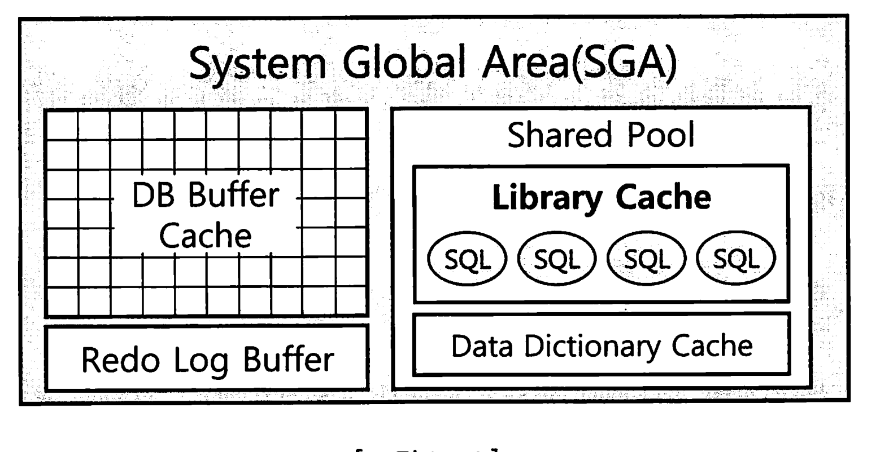

Oracle의 라이브러리 캐시는 메모리 내에 SQL 문, PL/SQL 패키지 및 프로시저, 다양한 잠금 및 핸들을 저장하여 재사용한다. 

* MySQL 8.0부터는 쿼리 캐시 기능 삭제됌.
* Postgresql은 다음과 같은 캐시 메커니즘 사용
  * **계획 캐시**: 준비된 문과 함께 실행 계획을 캐시. 이는 동일한 쿼리가 여러 번 실행될 때 유용
  * **공유 버퍼**: 데이터 블록을 메모리에 캐시하여 디스크 I/O를 최소화합니다. PostgreSQL은 공유 버퍼를 통해 효율적인 캐시 관리

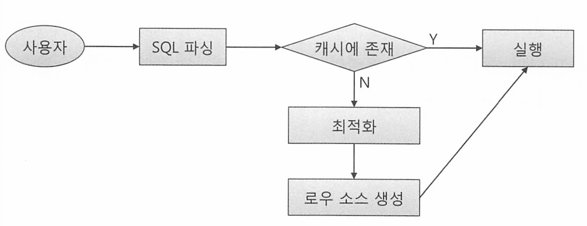

캐시에서 SQL을 찾아 곧바로 실행단계로 넘어가는 것을 soft parsing이라 하고,

찾는데 실패해 최적화 및 로우 소스 생성 단게까지 모두 거치는 것을 hard parsing 이라고 한다.

**SQL최적화 과정은 왜 하드한가?**

* 다섯개 테이블을 조인하는 쿼리문 하나를 최적화 하는데도 무수히 많은 경우의 수 존재. (5! = 120가지)
* 조인 알고리즘은 어떻게 쓸지, 인덱스는 어떤걸 쓸지 등.

때문에 옵티마이저는 순식간에 엄청난 연산을 통해 최적화 한다. 옵티마이저가 사용하는 정보는 다음과 같다.

* 테이블, 컬럼, 인덱스 정보
* 오브젝트 통계쩡보, 시스템 통계(cpu io block io)

때문에 매우 하드하다고 하며, 캐시가 필요한 이유이기도 하다 

* MySQL에서는 동시성 문제 및 병목 현상, 그리고 동적 데이터 쿼리 문제 때문에 쿼리 캐시를 없앴다고 한다.

### 1.2.2 바인드 변수의 중요성

바인드 변수(Bind Variable)는 SQL 문에서 값을 직접 입력하는 대신, 변수로 값을 전달하는 방법을 의미한다.

바인드 변수는 SQL 문이 실행될 때 값이 바인딩되며, 이를 통해 여러 가지 이점을 얻을 수 있다. 

* 성능 향상, 보안 강화, 그리고 코드 재사용성 증가

라이브러리 캐시에서 SQL을 찾기 위해 사용하는 키 값이 SQL 문 자체이므로 아래는 모두 다른 SQL이다

```sql
SELECT * FROM emp WHERE empno = 7900;
select * from emp where empno = 7900;
select * from emp where empno = 1234;
```

즉 모두 캐싱되서 저장될 수 있단 이야기다.

empno를 변수로 받도록 프로시저 하나를 공유하게 되면, 캐시도 훨씬 적게 사용하므로 부하가 줄어든게 된다.

## 1.3 데이터 저장 구조 및 I/O 메커니즘

### 1.3.1 SQL이 느린 이유
십중팔구 I/O 때문이다. 디스크 I/O

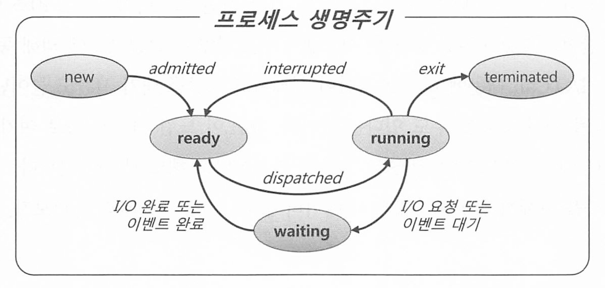

실행중인 프로그램인 프로세스는 위와 같은 생명주기를 가지며, I/O 요청 등이 발생하게 되면 wating 상태로 바뀌어서 일을 할 수 없다.

CPU를 잠시 OS에 반환하고 I/O가 완료되기를 기다리기 때문이다. 

I/O 속도는 Single Block I/O 기준 평균 10ms

* 초당 100블록 정도 읽음 
* 블록 크기가 8KB라고(대부분 DB) 가정하면, 초당 읽을 수 있는 데이터 양은 
  * = (100 블록/초) × (4KB/블록 ÷ 8KB/페이지) = 50 페이지/초
  * 400KB/초는 약 3.2Mbps (메가비트/초)와 비슷
  * 일반적인 영화의 화질 기준으로, SD(표준 화질) 스트리밍 속도는 약 1.5Mbps, HD(고화질)는 약 5Mbps

SSD 스토리지 기준 1~2ms 초당 500~1,000 블록

* 초당 1000블록 x 8kb/블록 = 8000KB (8MB/초)

즉 디스크 I/O가 양이 적고, 빠를수록 DB의 성능을 좌지우지 한다. 

### 1.3.2 데이터베이스 저장 구조

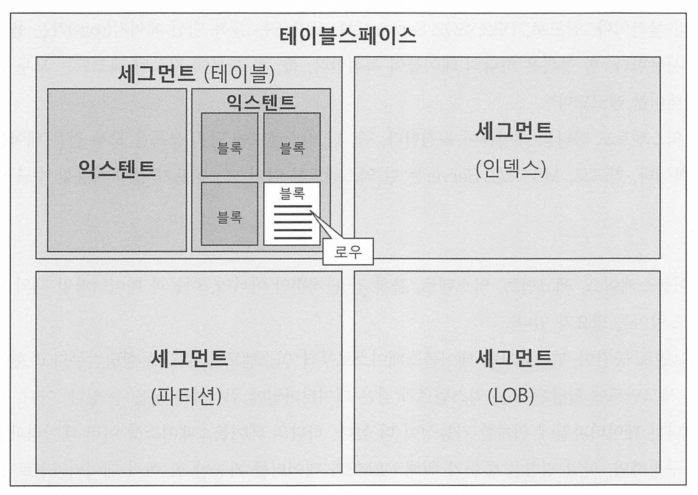

데이터를 저장하려면 먼저 테이블 스페이스를 생성해야 한다. 

테이블 스페이스는 세그먼트를 담는 컨테이너로서, 여러개의 데이터파일로 구성된다.

세그먼트는 테이블, 인덱스 등 데이터 저장 공간이 필요한 오브젝트.

테이블, 인덱스를 생성할 때 어떤 테이블 스페이스에 저장할지 결정한다. 

* 인덱스도 하나의 세그먼트.
* 세그먼트는 특정 하나의 단위? 라고 볼 수 있다. 

**테이블 스페이스 (Tablespace)**:

- 테이블 스페이스는 데이터베이스에서 데이터를 저장하는 논리적인 구조 보통 하나 이상의 데이터 파일로 구성되어 있다. 
- 각각의 테이블 스페이스는 특정한 데이터베이스 오브젝트들을 담을 수 있다. 

**세그먼트 (Segment)**:

- 세그먼트는 테이블, 인덱스 등과 같은 데이터 저장 공간이 필요한 데이터베이스 오브젝트를 위한 물리적인 공간
- 세그먼트는 테이블 스페이스 내에서 관리
- 예를 들어, 특정 테이블이나 인덱스는 각각의 세그먼트를 가지고 있다.

**인덱스**:

- 인덱스는 테이블의 검색 속도를 높이기 위해 사용되는 데이터베이스 오브젝트
- 인덱스도 하나의 세그먼트를 가지며, 해당 세그먼트는 특정 테이블 스페이스에 속한다. 

**테이블**:

- 테이블은 데이터를 저장하기 위한 데이터베이스 오브젝트
- 각 테이블은 하나의 세그먼트를 가지며, 해당 세그먼트는 특정 테이블 스페이스에 속한다. 

익스텐트는 공간을 확장하는 단위로써, 테이블이나 인덱스에 공간이 부족해지면, 해당 오브젝트가 속한 테이블 스페이스로부터 익스텐트를 추가적으로 할당받는다. 

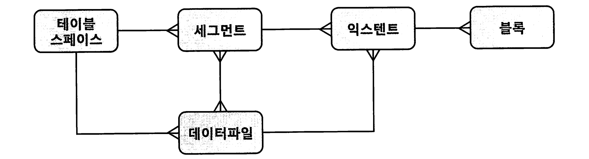

블록, 익스텐트, 세그먼트, 테이블스페이스, 데이터파일을 간단히 정의하면, 다음과 같다.

- 블록 : 데이터를 읽고 쓰는 단위
- 익스텐트 : 공간을 확장하는 단위. 연속된 블록 집합
- 세그먼트 : 데이터 저장공간이 필요한 오브젝트(테이블, 인덱스, 파티션, LOB 등)
- 테이블스페이스 : 세그먼트를 담는 콘테이너
- 데이터파일 : 디스크 상의 물리적인 OS 파일

### 1.3.3 블록 단위 I/O

데이터베이스에서 데이터를 읽고 쓰는 단위는 무엇일까?

데이터 I/O 단위는 블록이다. 

특정 레코드 하나를 읽고 싶어도 해당 블록을 통째로 읽는다. 심지어 1Byte짜리 컬럼 하나도 한 블록을 통째로 읽는다. 

요즘 DB의 평균 블록 크기는 8KB이므로, 1Byte를 얻을라 해도 8KB 블록 하나를 읽어야 한다. 

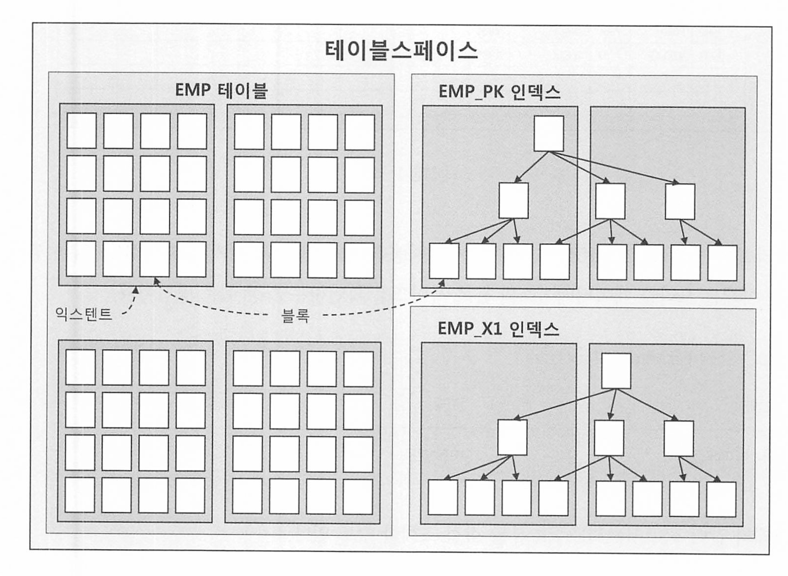

인덱스도 블록 단위로 데이터를 읽고 쓴다. 

* 이말인 즉슨, DB의 I/O작업으로 블록을 읽는것이고, 블록을 읽어야 트리를 탐색하여 원하는 레코드를 찾을 수 있다. 

### 1.3.4 시퀀셜 액세스 vs. 랜덤 액세스

테이블 , 인덱스 블록을 액세스 하는 방식으로는 시퀀셜 액세스와 랜덤 액세스 두가지가 있다. 

시퀀셜 액세스는 논리적 또는 물리적으로 연결된 순서에 따라 차례대로 블록을 읽는 방식

인덱스 리프 블록은 앞뒤를 가리키는 주소값을 통해 논리적으로 서로 연결돼있다 (링크드리스트 처럼)

이 주소값에 따라 앞 뒤로 순차적으로 스캔하는 방식이다. 

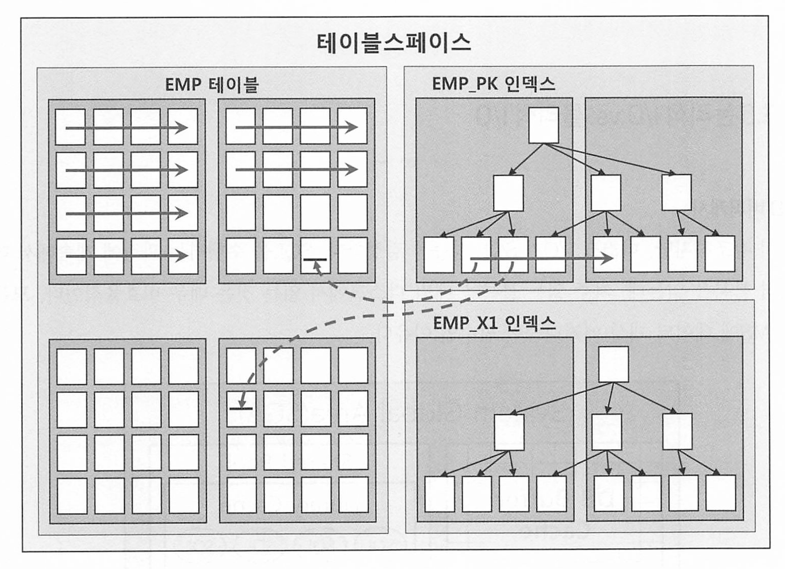

그런데, 그림을 보면 테이블 블록간에는 서로 논리적인 연결고리가 없다.

오라클의 경우 세그먼트에 할당된 익스텐트 목록을 세그먼트 헤더에 map으로 관리하고 이 map에서 각 익스텐트의 첫번째 블록 주소 값을 갖는다.

* **세그먼트 헤더(Segment Header)**: 세그먼트에 대한 메타데이터를 저장하는 블록. 여기에는 익스텐트 목록(map)이 포함

읽어야 할 익스텐트 목록을 익스텐트 맵에서 얻고, 각 익스텐트의 첫 번째 블록 뒤에 연속해서 저장된 블록을 순서대로 읽으면 그게 table full scan이다. 

* 그림의 테이블을 스캔하는 굵은 실선 화살표. 


### PostgreSQL의 경우

PostgreSQL에서는 데이터 저장 및 읽기 방식이 조금 다르다. PostgreSQL의 데이터 파일 구조는 다음과 같다:

1. **블록(Page)**: 기본적으로 8KB
2. **테이블**: 블록의 집합으로, 연속적인 블록으로 저장

PostgreSQL에서 테이블 풀 스캔

1. **테이블 파일 읽기**: PostgreSQL은 테이블 파일을 블록 단위로 읽는다.
2. **순차적 읽기**: 테이블의 모든 블록을 순차적으로 읽어 각 블록의 데이터를 처리한다.

### MySQL의 경우

 InnoDB는 데이터와 인덱스를 B-트리 구조로 관리한다.

1. **블록(Page)**: InnoDB의 기본 저장 단위로, 기본적으로 16KB
2. **테이블스페이스(TableSpace)**: InnoDB에서는 모든 테이블과 인덱스가 테이블스페이스에 저장

MySQL에서 테이블 풀 스캔

1. **테이블스페이스 읽기**: 테이블이 저장된 테이블스페이스에서 블록 단위로 데이터를 읽는다.
2. **순차적 읽기**: 테이블의 모든 블록을 순차적으로 읽어 각 블록의 데이터를 처리한다


랜덤 액세스는 논리적, 물리적 순서를 따르지 않고 레코드 하나를 읽기 위해 한 블록씩 접근하는 방식이다. 

* 그림에서의 순차적이지 않은 점선 화살표

### 1.3.5 논리적 I/O vs. 물리적 I/O

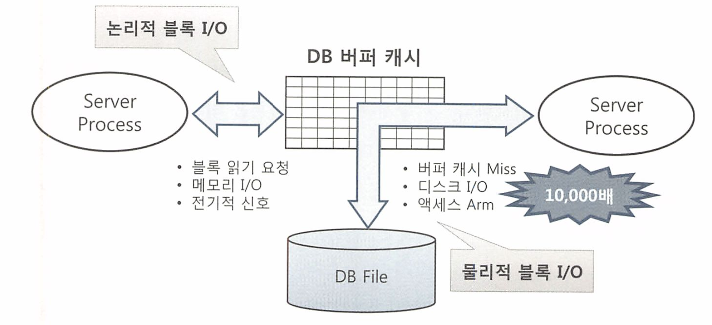

논리적 블록 I/O는 SQL을 처리하는 과정에 발생한 총 블록 I/O를 말한다. 

일반적으로 메모리상의 버퍼 캐시를 경유하므로 메모리 I/O가 곧 논리적 I/O라고 생각해도 무방하다.  

물리적 블록 I/O는 디스크에서 발생한 총 블록 I/O를 의미하며, SQL 처리 도중 읽어야할 블록을 버퍼 캐시에서 찾지 못할때만 디스크를 액세스 하므로 논리적 블록 I/O중 일부를 물리적으로 접근하는것이다.

디스크 I/O는 물리적으로 접근하므로 메모리 I/O에 비해 상당히 느리다. (메모리는 전기적 신호로 접근하므로)

* 버퍼 캐시 히트율

* ```
  BCHR = ( 캐시에서 곧바로 찾은 블록 수 / 총 읽은 블록 수 ) x 100
  		 = ( (논리적 I/0 - 물리적 I/0) / 논리적 I/0) x 100
  		 = (1 - (물리적 1/0) / (논리적 110) ) x 100
  ```

* 

MySQL Postgresl도 버퍼 캐시가 존재한다. 버퍼 캐시 히트율이 높을수록 물리 I/O가 줄어드므로 SQL의 성능이 좋아지고 부하가 줄어든다. 

버퍼 캐시 히트율을 높여도 논리적 I/O를 줄여야 쿼리의 성능이 향상된다

논리적 I/O를 줄임으로써 물리적 I/O가 줄어들고 이것이 곧 쿼리 튜닝이다.

### 1.3.6 Single Block I/O vs. Multiblock I/O

버퍼 캐시에서 찾지못한 블록은 물리적 I/O를 통해 디스크에서 적재하고 읽는다.

한번에 한블록씩 요청해서 메모리에 적재하는 방식을 Single Block I/O라고 한다.

한번에 여러블록씩 요청해서 메모리에 저개하는 방식을 Multiblock I/O 라고 한다. 


아래 목록은 Single Block I/O 대상이다. 특히 인덱스는 소량 데이터를 읽을떄 주로 사용하므로 이 방식이 효율적이다

* 인덱스 루트 블록을 읽을 때
* 인덱스 루트 블록에서 얻은 주소 정보로 브랜치 블록을 읽을 때
* 인덱스 브랜치 블록에서 얻은 주소 정보로 리프 블록을 읽을 때
* 인덱스 리프 블록에서 얻은 주소 정보로 테이블 블록을 읽을 때 
* 또한, MySQL, Postgresql에서 PK를 이용한 단일 레코드를 읽을때에도 사용된다. 


인덱스를 이용하지 않고 테이블 전체 스캔시 멀티 블록 I/O를 사용한다. 

Multi Block I/O는 한 번에 여러 블록(페이지)을 읽거나 쓰는 작업이며 주로 테이블 풀 스캔이나 대량 데이터 읽기 작업에 사용된다.


아래는 MySQL의 MultiBlock I/O 대상이다 

- **테이블 풀 스캔(Table Full Scan)**: 테이블의 모든 데이터를 순차적으로 읽을 때 사용됩니다. 
- **범위 스캔(Range Scan)**: 인덱스를 사용하여 특정 범위의 데이터를 읽을 때 사용. 예를 들어, 특정 날짜 범위 내의 데이터를 조회하는 경우

아래는 Postgresql의 MultiBlock I/O 대상이다.

#### Multi Block I/O 대상

- **시퀀셜 스캔(Sequential Scan)**: 테이블의 모든 데이터를 순차적으로 읽을 때사용 . 
- **비트맵 인덱스 스캔(Bitmap Index Scan)**: 여러 인덱스를 결합하여 대량의 데이터를 읽을 때 사용. 비트맵 인덱스 스캔은 대량의 페이지를 효율적으로 읽기 위해 Multi Block I/O를 사용


**읽고자 하는 블록을 DB 버퍼캐시에서 찾지 못하면 해당 블록을 디스크에서 읽기 위해 I/O call을 하는데 그동안 프로세스는 queue에서 잠을 잔다. 대용량 테이블이면 수많은 블록을 계속 읽는동안 디스크에서 여러차례 쉬게 된다. 이것이 성능 저하의 큰 원인이며,**

기왕에 쉬려면 한번에 많은 양을 읽고 잠들어야 성능을 높일 수 있다 이것이 full scan시 Multiblock I/O단위가 크면 성능이 좋아지는 이유다. 


### 1.3.7 Table Full Scan vs. Index Range Scan

인덱스를 이용하는 경우가 더 느릴수도 있다. 집계용 SQL과 배치 프로그램이 더욱 그렇다.

시퀀셜 액세스와 Multiblock I/O가 좋아도 수십~수백건의 소량 데이터 찾을시 수백만 수천만 데이터를 스캔하는건 비효율적이다.

그러므로 소량 데이터 검색시에만 인덱스를 이용하는 경우가 좋다.

IndexRangeScan을 통한 테이블 액세스는 랜덤 액세스와 SingleBlock I/O 방식으로 디스크 블록을 읽는다. 

캐시에서 블록을 못찾으면 레코드 하나를 찾기 위해 매번 I/O CALl을하고 잠을 자야 한다. 또한 읽었던 블록을 반복해서 읽어야 하는 비효율이 있으므로 매우 불리한것이다.


### 1.3.8 캐시 탐색 메커니즘

Direct Path I/O를 제외한 모든 블록 I/O는 메모리 버퍼캐시를 경유한다. 구체적으로, 아래 오퍼레이션은 모두 버퍼캐시 탐색 과정을 거친다.

* Direct Path I/O는 데이터베이스가 데이터를 읽고 쓸 때 버퍼 캐시(Buffer Cache)를 우회하고 디스크에서 직접 데이터를 읽거나 쓰는 방식을 의미

- 인덱스 루트 블록을 읽을 때
- 인덱스 루트 블록에서 얻은 주소 정보로 브랜치 블록을 읽을 때
- 인덱스 브랜치 블록에서 얻은 주소 정보로 리프 블록을 읽을 때
- 인덱스 리프 블록에서 얻은 주소 정보로 테이블 블록을 읽을 때
- 테이블 블록을 Full Scan 할 때12

# 2장. 인덱스 기본

## 2.1 인덱스 구조 및 탐색
인덱스 탐색 과정은 수직, 수평 두단계로 이루어 진다. 

### 2.1.1 미리 보는 인덱스 튜닝

데이터를 찾는 방법은 크게 2가지다

* 인덱스 이용
* 풀 테이블 스캔

OLTP 시스템에서는 소량 데이터를 주로 검색하므로 인덱스 튜닝이 무엇보다 중요하다.

인덱스 튜닝의 핵심요소는 두가지로 나뉜다

* 인덱스 스캔과정의 비효율 줄이기
* 테이블 액세스 횟수 줄이기. -> 랜덤 액세스 최소화 튜닝

이 둘중 랜덤 액세스 최소화 튜닝이 성향에 미치는 영향이 더 크다. 

* 랜덤 액세스는 디스크 헤드 이동으로 인한 높은 비용이 발생하기 때문 시퀀셜 액세스 보다 훨 비효율적이다. 
* 비트리같은경우 리프노드까지 내려가는데 여러번의 랜덤 I/O가 발생하지만 클러스터링 인덱스가 더 좋은 이유는 순차적으로 접근하기 떄문 


인덱스에서 바로 반환하면 되는데 테이블에 랜덤 액세스를 하게되는것이 매우 비용이 크다 

### 2.1.2 인덱스 구조

인덱스는 대용량 테이블에서 필요한 데이터만 빠르게 효율적으로 액세스하기 위해 사용하는 객체다.

DBMS는 일반적으로 B Tree 인덱스를 사용한다.

Root, Branch, Leaf가 있다. 

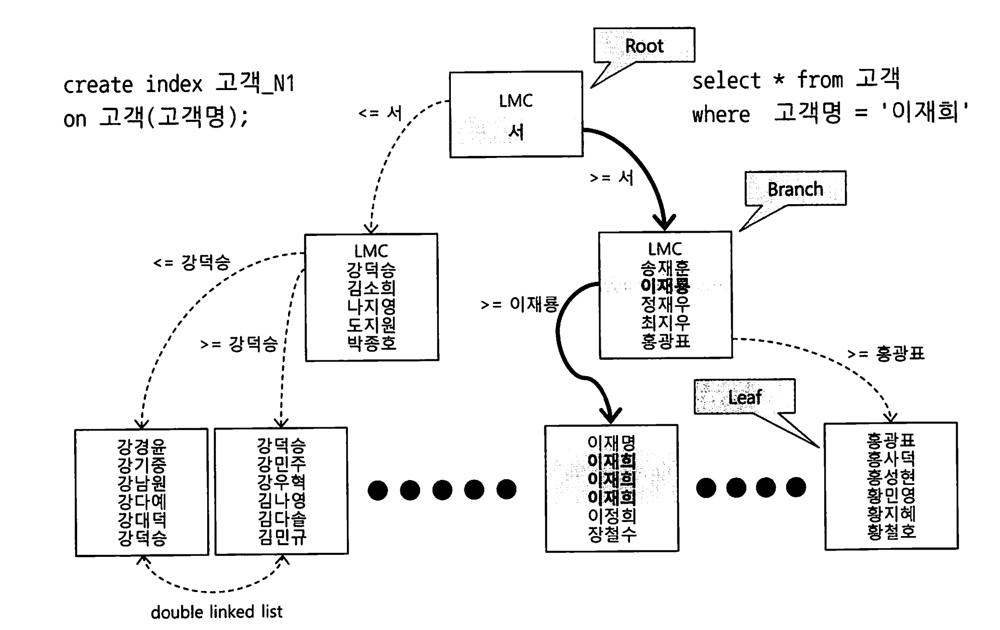

루트와 브랜치 블록에 있는 각 레코드는 하위 블록에 대한 주소값을 갖는다. 

키값은 하위 블록에 저장된 키 값의 범위를 나타낸다. 

또한 루트와 브랜치블록에는 키 값을 갖지 않는 특별한 레코드가 있다.

이를 LMC, LeftmostChild라고 한다. 자식 노드 중 가장 왼쪽 끝에 위치한 블록이다.

* B-트리(B-tree)나 B+트리(B+tree)와 같은 트리 기반 인덱스 구조에서 사용되는 중요한 개념. 

* 범위 검색의 시작 지점은 일반적으로 LMC에서 시작한다. 탐색을 왼쪽에서 오른쪽으로 진행하여 전체 범위를 커버하기 위함이다.
* 삭제 삽입 후 트리 균형 위해 리밸런싱 수행시, LMC를 참조하여 트리를 적절히 조정한다. 또한 노드가 분할될때도 LMC를 재설정하여 트리 구조를 유지한다. 

리프블록에 저장된 각 레코드는 키 값순으로 정렬되있을뿐만 아니라, 테이블 레코드를 가리키는 주소값인 ROWID를 갖는다.

* 인덱스 키 값이 같으면 ROWID 순으로 정렬됌

인덱스를 스캔하는 이유는 ROWID를 얻기 위해서다.

ROWID는 아래와 같이 데이터 블록 주소(DBA, Data Block Address)와 로우 번 호로 구성되므로 이 값을 알면 테이블 레코드를 찾아갈 수 있다.

- ROWID = 데이터 블록 주소 + 로우 번호
- 데이터 블록 주소 = 데이터 파일 번호 + 블록 번호
- 블록 번호 : 데이터파일 내에서 부여한 상대적 순번
- 로우 번호 : 블록 내 순번

인덱스 탐색 과정은 수직적 탐색과 수평적 탐색으로 나눌 수 있다.

- 수직적 탐색 : 인덱스 스캔 시작지점을 찾는 과정
- 수평적 탐색 : 데이터를 찾는 과정

### 2.1.3 인덱스 수직적 탐색
인덱스 스캔 시작지점을 찾는 과정이다. -> 조건을 만족하는 첫번째 레코드를 찾는 과정 

수직 탐색은 루트 블록에서부터 시작해서 브랜치블록에 저장된 각 인덱스 레코드는 하위 블록에 대한 주소값을 찾는다. 

수직 탐색 과정에서 찾고자 하는 값이 크거나 같은 값을 만나면, 바로 직전 레코드가 가리키는 하위 블록으로 이동한다. 

### 2.1.4 인덱스 수평적 탐색

수직 탐색을 통해 스캔 시작점을 찾았으면, 찾고자 하는 데이터가 더 안나탈 때까지 인덱스 리프 블록을 수평적으로 스캔한다.

인덱스에서 본격적으로 데이터를 찾는 과정이다.

* 더 안나타날때까지란 뜻은, 나타나면 계속 찾는다는 말이다. 즉 같은 값이 여러개가 있으면.. 계속 찾게된다. 30% 미만 가져야 하는 이유다.

리프블록은 서로 앞뒤 블록에 대한 주소값을 가지는 더블 링크드 리스트 구조여서 우 좌 모두 수평 탐색이 가능하다.

인덱스를 수평적으로 탐색하는 이유는

1. 조건절을 만족하는 모든 데이터를 찾기 위해
2. ROW ID를 얻기 위해

필요한 컬럼을 인덱스가 모두 갖고있으면 바로 인덱스만 스캔하고 리턴하지만, 데이터가 더 있다면 테이블에 액세스 해야하므로 ROW ID가 필요하다. 

### 2.1.5 결합 인덱스 구조와 탐색

두 개 이상 컬럼으로 결합(복합)인덱스를 만들면 어떻게될까?

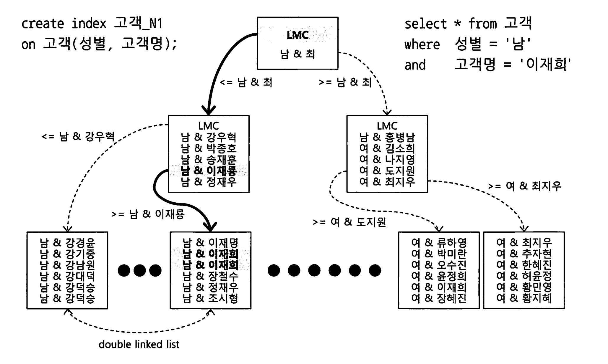

수직 탐색을 거쳐 인덱스 스캔 시작점이 성별 = '남'이 아니고, 성별 = '남' 이면서 고객명 '이재희'가 첫번째 레코드가 된다. 

인덱스 순서를 바꾸더라도, 인덱스 선두 컬럼을 모두 = 조건으로 검색할때는 어느 컬럼을 앞에 두든 블록 I/O 개수가 같으므로 성능도 똑같다. 

## 2.2 인덱스 기본 사용법

### 2.2.1 인덱스를 사용한다는 것

인덱스를 사용한다는것은, 시작점을 찾을 수 있다는것이다.

시작점을 찾을 수 없다는것은 어디서부터 어떻게 찾아야 할지 모른다는것이다. 

인덱스 컬럼을 가공(변형, 함수 등)해도 인덱스를 사용할 수는 있지만 스캔 시작점을 찾을 수 없고 멈출수도 없어 리프 블록 전체를 스캔해야 되서 인덱스 풀 스캔이 동작하게 된다.


인덱스를 정상적으로 사용한다는 표현은, 리프블록에서 스캔 시작점을 찾아 스캔하다가 중간에 멈추는 것을 의미한다.

-> 이것이 index range scan이다. 


### 2.2.2 인덱스를 Range Scan 할 수 없는 이유

인덱스 스캔 시작점을 찾을 수 없기 때문이다. 

일정 범위 스캔을 시작하려면 시작 지점과 끝지점을 알아야 한다. 만약 시작지점과 끝 지점을 찾지 못하면 전체를 스캔해야 하므로 이때는 인덱스 range scan을 할 수 없다는 의미이다. 

LIKE 검색도 마찬가지다. 대한 으로 시작하는 워딩은 특정 구간에 모여있어 Range Scan이 가능하지만, 대한을 포함하는 값은 전체 구간에 거쳐 흩어져 있으므로 시작범위 ,끝범위를 알 수 없기 때문에 Range 스캔이 불가능하다.

OR 조건도 마찬가지다. 특정 시적 지잠을 찾을수가 없다.

```
WHERE (전화번호 = :tel_no OR 고객명 = :customer_name)
```

다만 아래처럼 OR를 변환시키면 가능하긴 하다

```
SELECT * FROM 고객 WHERE 고객명 = :customer_name
UNION ALL
SELECT * FROM 고객 WHERE 전화번호 = :tel_no AND (고객명 != :customer_NO)
```

즉 아래처럼 힌트를 유도해서 쓸수있따

```
SELECT /*+ use_concat */ * FROM 고객
WHERE (전화번호 = :tel_no OR 고객명 = :customer_name)
```

IN 조건절에 대해서는 옵티마이저가 IN-List Iterator 방식을 사용한다. IN-LIST 개수만큼 인덱스 레인지 스캔을 반복하는것이다

* `IN` 절에서 지정된 값들이 인덱스에 존재하는 경우, 데이터베이스는 해당 인덱스를 사용하여 각 값을 개별적으로 검색하는것을 반복하는것이다. 

#### MySQL

MySQL에서 `IN` 절은 인덱스를 사용할 수 있다. MySQL은 `IN` 절을 여러 개의 `=` 조건으로 변환하여 인덱스를 활용한다

PostgreSQL에서도 마찬가지이다. 

### 인덱스를 정상적으로 사용할 수 없는 조건절들

1. **함수 또는 표현식을 포함한 조건절**
   - **예시**: `WHERE UPPER(name) = 'ALICE'`
   - 인덱스는 컬럼의 원래 값에 기반하여 정렬되므로, 함수나 표현식을 적용한 값에 대해 인덱스를 사용할 수 없습니
2. **범위를 포함한 조건절에서 부정형 연산자 사용**
   - **예시**: `WHERE age != 30` 또는 `WHERE age <> 30`
   - 부정형 연산자는 모든 다른 값을 검색해야 하므로, 인덱스 사용이 비효율적.
3. **비교 연산자와 함께 사용된 NULL 값 조건**
   - **예시**: `WHERE age IS NOT NULL`
   - 인덱스는 NULL 값을 포함하지 않으므로, `IS NOT NULL` 조건에서는 인덱스를 사용할 수 없다.
4. **부정적인 패턴 매칭 연산자**
   - **예시**: `WHERE name NOT LIKE 'A%'`
   - 부정형 패턴 매칭은 인덱스를 효과적으로 사용할 수 없다.
5. **범위를 포함한 조건절에서 비효율적인 패턴 매칭 연산자**
   - **예시**: `WHERE name LIKE '%Alice%'`
   - 와일드카드 `%`가 앞에 오면 인덱스를 사용할 수 없다. 이는 인덱스가 앞부분부터 정렬되어 있기 때문에 패턴의 앞부분이 고정되지 않으면 검색이 비효율적이다.
6. **OR 조건절**
   - **예시**: `WHERE age = 25 OR name = 'Alice'`
   - 인덱스를 사용할 수 없는 경우가 많으며, 풀 테이블 스캔이 발생할 가능성이 높다. 다만, 각 조건이 인덱스를 사용할 수 있는 경우는 예외.
7. **다중 컬럼 인덱스에서 조건이 인덱스 순서와 맞지 않는 경우**
   - **예시**: 인덱스가 `(name, age)`일 때 `WHERE age = 30`만 사용
   - 인덱스는 첫 번째 컬럼에 대한 조건이 있을 때만 효율적으로 사용.
8. **LIKE 연산자에서 패턴이 와일드카드로 시작할 때**
   - **예시**: `WHERE name LIKE '%bob%'`
   - 앞에 와일드카드가 있으면 인덱스를 사용할 수 없다.
9. **비교 연산자와 비일치하는 데이터 타입**
   - **예시**: `WHERE varchar_column = 123`
   - 인덱스가 효과적으로 사용되지 않는다.

### 2.2.3 더 중요한 인덱스 사용 조건

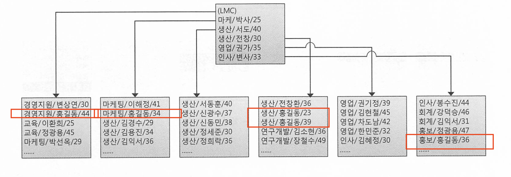

인덱스를 그림처럼 소속팀 + 사원명 + 연령 순으로 구성했다.

* 데이터를 소속팀 순으로 정렬하고, 소속팀이 같으면 사원명으로 정렬하고, 사원명이 같으면 연령순으로 정렬한다. 

```
SELECT * FROM 사원 WHERE 사원명 = '홍길동'
```

위 쿼리에 대해 정상적으로 RANGE SCAN 할 수 없다.


위 쿼리는 사원명을 검색한다.

이름이 같은 사원이더라도, 소속팀이 다르면 서로 멀리 떨어지게 되므로 효과적으로 스캔할 수 없다.

스캔 시작점을 찾을수도, 어디서 멈춰야 할 수도 없기 때문에 인덱스 풀 스캔을 해야한다.

**인덱스를 Range Scan 하기 위한 가장 첫 번째 조건은 인덱스 선두 컬럼이 조건절에 있어야 한다는 사실이다. 가공하지 않은 상태로 말이다**

* 복합 인덱스 사용시 선두 컬럼이 가공되지 않은상태로 조건절에 있으면 인덱스 Range Scan은 무조건 가능하다. 나머지는 가공해도 된다.

### 인덱스를 잘 사용하니까 튜닝 끝?

인덱스를 사용한다는것은 range scan이란 뜻이다.

인덱스를 정말 잘 사용하는지는 **스캔하는 양** 을 잘 따져봐야 한다 

인덱스를 사용하는데 데이터를 100만건이나 조회하면 인덱스를 잘 사용하는것이 맞을까? 

### 2.2.4 인덱스를 이용한 소트 연산 생략

인덱스를 Range Scan할 수 있는 이유는 데이터가 정렬돼 있기 때문이다.

찾고자 하는 데이터를 일정 부분만 읽다가 멈출 수 있다.

정렬되어 있기 때문에 sort 연산도 생략이 가능하다. 


PK를 장비번호 + 변경일자 + 변경순번으로 구성한 상태변경이력 테이블이 있다고 가정한다.

아래 쿼리처럼 이퀄 조건을 검색하면 PK 인덱스를 사용하므로 결과집합은 변경순번 순으로 출력된다

```sql
SELECT *
FROM 상태변경이력
WHERE 장비번호 = 'C'
AND 변경일자 = '20180316'
ORDER BY 변경순번
```

PK인덱스를 스캔하면서 출력한 결과는 어차피 변경순번대로 정렬되기 때문에 ORDER BY가 있어도 정렬 연산을 따로 수행하지 않는다. 


내림차순(Desc)에도 인덱스를 활용한다.

리프 블록은 양방향 연결리스트 이기 때문에, DESC 조건이 있다면 ASC랑 반대로 우측에서부터 좌측으로 수평 탐색을 한다. 

### 2.2.5 ORDER BY 절에서 컬럼 가공

ORDER BY 절에서도 컬럼을 가공하면 인덱스를 제대로 사용할 수 없다.

```sql
SELECT *
FROM 상태변경이력
WHERE 장비번호 = 'C'
AND 변경일자 = '20180316'
ORDER BY 변경일자 || 변경순번
```

예시 : PK는 주문일자 + 주문번호다

```sql
SELECT *
FROM (
    SELECT 
        TO_CHAR(A.주문번호, 'FW000000') AS 주문번호, 
        A.업체번호, 
        A.주문금액
    FROM 주문 A
    WHERE A.주문일자 = :dt
    AND A.주문번호 > NVL(:next_ord_no, 0)
    ORDER BY 주문번호
)
WHERE ROWNUM <= 30;
```

* 위 쿼리 ORDER BY 절은 실행계획에 SORT ORDER BY 를 사용. 왜냐하면 SELECT 절 내의 가공된 주문번호로 정렬하기 때문.
* 아래처럼 사용해야 인덱스를 사용해서 정렬 게획을 하지 않게된다

```sql
SELECT *
FROM (
    SELECT 
        TO_CHAR(A.주문번호, 'FW000000') AS 주문번호, 
        A.업체번호, 
        A.주문금액
    FROM 주문 A
    WHERE A.주문일자 = :dt
    AND A.주문번호 > NVL(:next_ord_no, 0)
    ORDER BY A.주문번호
)
WHERE ROWNUM <= 30;
```


### 2.2.7 자동 형변환

컬럼과 조건절의 타입(형)도 같아야 한다. 문자형을 숫자형으로 비교해도 인덱스를 사용하지 못할수도 있다.

Oracle에서는 숫자형과 문자형 조건절이 혼합되면, 문자형 데이터를 숫자형 데이터로 암묵적으로 변환한다.

```sql
SELECT * FROM orders WHERE order_id = '123';
```

MySQL에서는 조건절에서 숫자형과 문자형이 혼합되면, 일반적으로 문자형 데이터를 숫자형 데이터로 변환하려고 시도한다.

postgredsql은 암묵적인 타입 변환을 허용하지 않으며, 명시적인 타입 변환이 필요하다. 

LIKE는 또 다르다.

LIKE 자체가 문자열 비교이므로 Oracle은 문자형 기준으로 숫자형 컬럼이 변경된다. 

MySQL에서는 `LIKE` 연산자를 숫자형 컬럼에 사용하면 암묵적으로 숫자형을 문자형으로 변환한다.

PostgreSQL에서는 `LIKE` 연산자를 숫자형 컬럼에 사용할 수 없다.


**자동 형변환 성능**

LIKE 조건을 옵션 조건 처리 목적으로 사용하는 경우가 있다.

예를 들어 거래 데이터 조회시 계좌번호는 사용자가 입력할수도, 안할수도 있는 조건인데 이를 처리하려면 두개 SQL이 필요하다

```sql
-- 사용자가 계좌번호 입력시
SELECT * FROM 거래 WHERE 계좌번호 = :acnt_no
AND 거래일자 between :trd_dt1 and :trd_dt2

-- 사용자가 계좌번호 입력하지 않을 경우
SELECT * FROM 거래 WHERE 거래일자 between :trd_dt1 and :trd_dt2
```

많은 개발자가 이것을 1개 쿼리로 처리하려고 LIKE 조건을 사용한다.

```sql
SELECT * FROM 거래
WHERE 계좌번호 LIKE :acnt_no || '%'
AND 거래일자 between :trd_dt1 and :trd_dt2
```

* 사용자가 계좌번호 입력하지 않으면 :anct_no 변수에 null이 되어 모든 계좌번호가 조회됌 
* :acnt_no`가 `'123'이면, LIKE '123%', 만약 `:acnt_no`가 `NULL`이면, `LIKE '%'`와 동일해져서 모든 계좌번호가 조회

이 방식을 사용하면 LIKE 조건을 같이 사용해서 인덱스 스캔 효율이 안좋아진다. 

**또한 만약 계좌번호가 숫자라면 자동형변환이 LIKE에 대해 문자열로 되므로 인덱스 액세스 조건으로 사용되지 못한다.** 


SQL 성능 원리는 TO_CHAR, TO_DATE, TO_NUMBER같은 형변환 함수가 성능이 좋지 않을거라고 에상돼 
의도적으로 생략하곤 한다. 연산 횟수가 줄고 인덱스를 올바르게 사용할것이라고 말이다.

그러나 SQL 성능은 블록 I/O를 줄이는 곳에서 좋아진다. 형변환 함수를 생략한다고 해서 연산 횟수가 주는것도 아니다. 


## 2.3 인덱스 확장기능 사용법

### 2.3.1 Index Range Scan

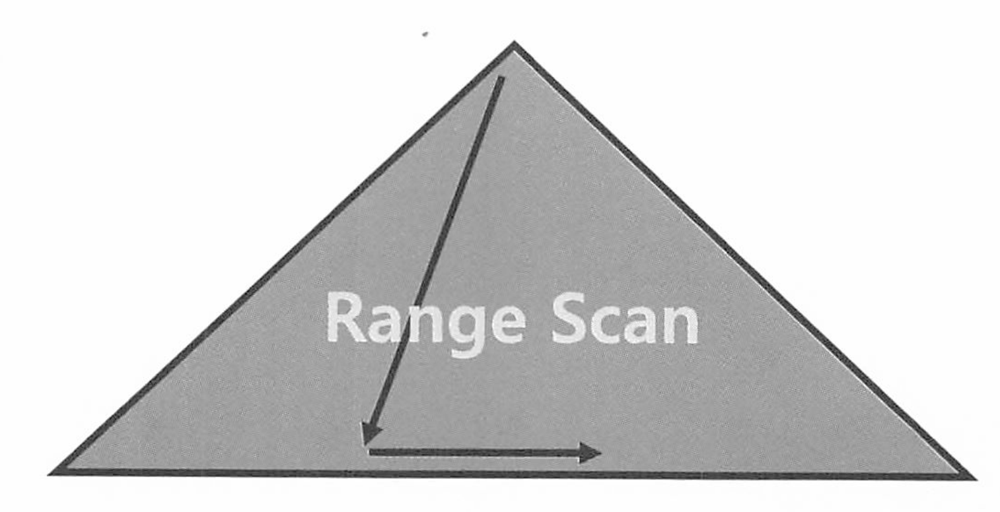

BTree 인덱스의 가장 일반적이고 정상적인 형태의 액세스 방식이다.

루트에서 리프까지 수직 탐색 후 탐색한 후에 필요한 범위(range)만 스캔한다.

인덱스 선두 컬럼을 가공하지 않은 상태로 조건절에 사용하면 index range scan은 무조건 가능하다.

성능은 인덱스 스캔 범위, 테이블 액세스 횟수를 얼마나 줄일 수 있느냐로 결정된다. 

```
--postgresql
                                                   QUERY PLAN
--------------------------------------------------------------------------------------------------------------
 Bitmap Heap Scan on orders  (cost=4.32..20.44 rows=10 width=48) (actual time=0.016..0.028 rows=5 loops=1)
   Recheck Cond: ((order_date >= '2023-01-01'::date) AND (order_date <= '2023-01-31'::date))
   Heap Blocks: exact=5
   ->  Bitmap Index Scan on orders_order_date_idx  (cost=0.00..4.32 rows=10 width=0) (actual time=0.010..0.010 rows=5 loops=1)
         Index Cond: ((order_date >= '2023-01-01'::date) AND (order_date <= '2023-01-31'::date))
 Planning Time: 0.123 ms
 Execution Time: 0.045 ms


-- oracle
--------------------------------------------------------------------------------
| Id  | Operation                   | Name         | Rows  | Bytes | Cost (%CPU)|
--------------------------------------------------------------------------------
|   0 | SELECT STATEMENT            |              |     5 |   455 |     3   (0)|
|   1 |  TABLE ACCESS BY INDEX ROWID| ORDERS       |     5 |   455 |     3   (0)|
|*  2 |   INDEX RANGE SCAN          | ORDERS_IDX   |     5 |       |     2   (0)|
--------------------------------------------------------------------------------

-- mysql 
id   select_type   table   type    possible_keys        key                  key_len   ref     rows    Extra
1    SIMPLE        orders  range   orders_order_date_idx orders_order_date_idx 3        NULL    5       Using where

```

### 2.3.2 Index Full Scan

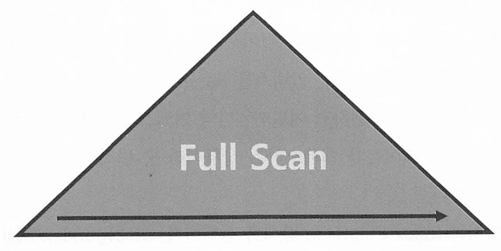

수직 탐색 없이 리프 블록을 처음부터 끝까지 수평적으로 스캔하는 방식이다.

```
-- postgresql 
PostgreSQL에서는 인덱스 풀 스캔이라는 용어는 사용되지 않지만, 인덱스를 통해 모든 행을 스캔하는 방식은 다음과같다 
 
--------------------------------------------------------------------------------------------------------------
 Seq Scan on orders  (cost=0.00..20.44 rows=10 width=48) (actual time=0.016..0.028 rows=5 loops=1)
   Filter: (order_date IS NOT NULL)
   Rows Removed by Filter: 0
 Planning Time: 0.123 ms
 Execution Time: 0.045 ms

-- mysql
id   select_type   table   type    possible_keys        key                  key_len   ref     rows    Extra
1    SIMPLE        orders  index   NULL                 orders_order_date_idx 3        NULL    5       Using index

```


옵티마이저는 인덱스 사용 컬럼이 조건절에 없으면 

우선적으로 table full스캔을 고려하고, 테이블이 너무 크다면 인덱스 풀스캔을 고려한다.

데이터 저장공간은 컬럼 길이 x 레코드 수에 의해 결정되므로 인덱스가 차지하는 면적은 테이블보다 훨씬 적다

이럴때 인덱스 풀 스캔 방식을 선택한다. 


**인덱스 풀 스캔이 효율적일 때**

SALARY > 9000이라는 조건일시 (급여가 9천 이상인경우 )

* 전체 테이블중 일부라면 인덱스 풀 스캔을 통한 필터링이 효율적임 

**테이블 풀 스캔이 효율적일 때** 

SALARY > 1000 이라는 조건일시

* 전체 테이블 중 대다수라면 테이블 풀 스캔이 효율적임 

### 2.3.3 Index Unique Scan

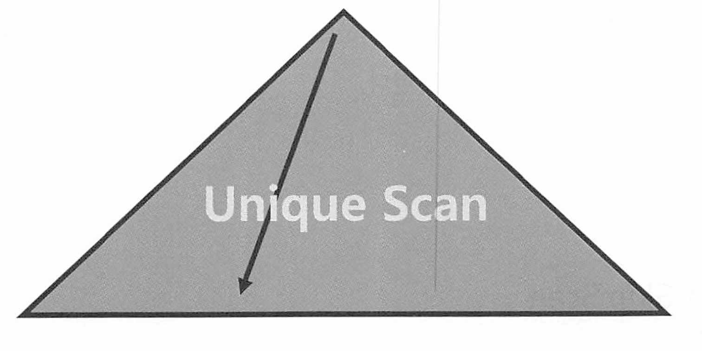

수직적 탐색만으로 데이터를 찾는 스캔방식으로서, Unique 인덱스를 = 조건으로 탐색하는 경우에 작동한다.

데이터를 1건만 찾으면 되니까.


만약 UNIQUE 인덱스여도, 범위 조건 으로 검색하게 된다면 그때는 Index Range Scan으로 처리될 수 밖에 없다. 

또한 UNIQUE 결합(복합)인덱스에 대해 일부 컬럼만으로 검색할 때도 Index Range Scan이 나타난다.

* 주문상품 PK가 주문일자 + 고객ID + 상품ID인데 주문 일자와 고객 ID로만 검색하는 경우. 

### 2.3.4 Index Skip Scan

인덱스 스킵 스캔(Index Skip Scan)은 복합 인덱스(composite index)를 사용하는 최적화 기법으로, 인덱스의 선두 컬럼을 생략하고 후속 컬럼을 통해 효율적으로 검색할 수 있게하는 방식이다.

* 선두 컬럼의 Distinct Value(카디널리티가 낮고)이 적고 후행 컬럼의 Distinct Value(카디널리티가 높을)  갯수가 많을때 유용하다. 
* 예를들어 고객 테이블에서 성별이 카디널리티가 낮고 고객번호는 카디널리티가 높다. 

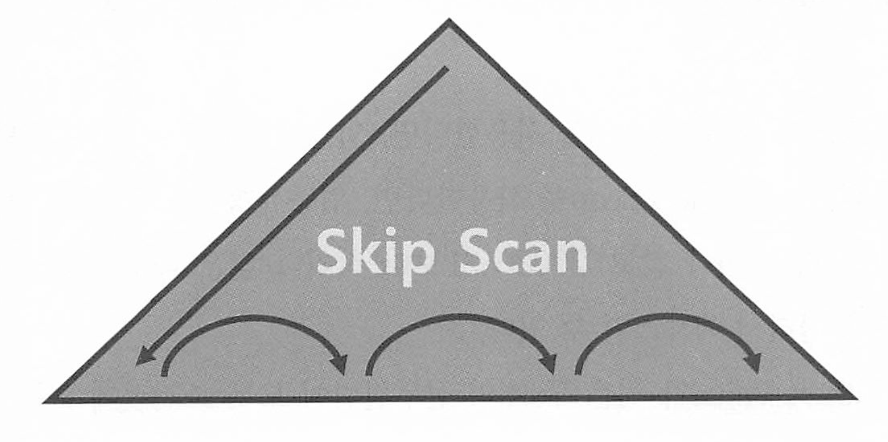

일반적인 인덱스 사용 방식과 달리 인덱스의 선두 컬럼에 대한 값이 없이도 인덱스를 사용할 수 있도록 도와준다.

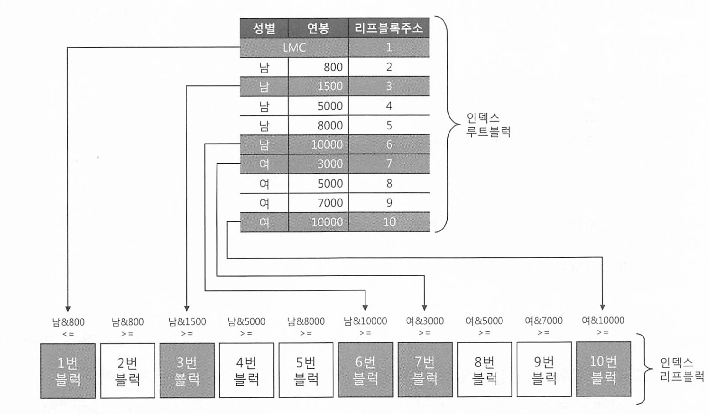

위 그림은 인덱스 루트 블록과 리프블록이다. 성별 + 연봉으로 구성된 결합 인덱스다.

아래 조건식의 처리 방법을 보자 

```
SELECT * FROM 사원 WHERE 성별 = '남' and 연봉 between 2000 and 4000
```

* 성별 '남'이면서 연봉 2000인 첫 블록을 찾아야함. -> 3번블럭
* 이후 성별 '남' 이면서 연봉 4000 이하인 블럭을 만나면 멈추면 된다.  

 

index Skip Scan은 루트 또는 브랜치(중간) 블록에서 읽은 컬럼 값 정보를 토대로, 조건절에 부합하는 레코드를 포함할 가능성이 있는 리프 블록만 골라서 액세스 하는 스캔 방식이다. 

* 두번째 레코드가 가리키는 리프 블록은 남 & 800 이면서 남 & 1500 이하이므로 스킵
* 세번째 레코드는 1500 이상 5000 이하이므로 액세스
* 네번째 레코드는 5000 이상 8000 이하이므로 스킵.. 5번째 레코드도 마찬가지이다. 

그러나 7번 블럭은 다르다. (여 & 3000)

액세스 안해도 될거같지만 레코드에 액세스 해야한다.

* 여자 중에서 연봉 < 3000 이거나 (조건이 2천 이상이니까 ) 남과 여 사이 다른 성별이 존재한다면 이 블록에 저장되기도 하기 때문이다. 
* 8번 블럭, 9번 블록은 스킵해도 된다. 
* 그러나 마지막 블록은 액세스 해야한다. 여 보다 큰 다른 값이 있을 수 있으므로 액세스해서 파악해야 한다. 


실행계획 예시

mysql

```
mysql> EXPLAIN SELECT * FROM employees WHERE gender = 'M' AND hire_date > '1990-01-01'\G
*************************** 1. row ***************************
           id: 1
  select_type: SIMPLE
        table: employees
   partitions: NULL
         type: range
possible_keys: idx_gender_hiredate
          key: idx_gender_hiredate
      key_len: 4
          ref: NULL
         rows: 155191
     filtered: 100.00
        Extra: Using index condition; Using index skip scan
```

postgresql 

PostgreSQL은 버전 11부터 인덱스 스킵 스캔과 유사한 기능을 제공한다. PostgreSQL에서는 이를 "Index Only Scan"과 "Bitmap Index Scan" 등의 기능을 통해 유사한 최적화를 수행한다. 

Index Only Scan: 인덱스만으로 쿼리를 해결할 수 있을 때 사용

Bitmap Index Scan: 여러 인덱스를 결합하여 효율적으로 데이터를 검색

```
postgres=# EXPLAIN SELECT * FROM employees WHERE gender = 'M' AND hire_date > '1990-01-01';
                                  QUERY PLAN
-------------------------------------------------------------------------------
 Index Only Scan using idx_gender_hiredate on employees
   Index Cond: ((gender = 'M'::bpchar) AND (hire_date > '1990-01-01'::date))
(2 rows)

00000000-


postgres=# EXPLAIN SELECT * FROM employees WHERE gender = 'M' AND hire_date > '1990-01-01';
                                  QUERY PLAN
-------------------------------------------------------------------------------
 Bitmap Heap Scan on employees
   Recheck Cond: ((gender = 'M'::bpchar) AND (hire_date > '1990-01-01'::date))
   ->  Bitmap Index Scan on idx_gender_hiredate
         Index Cond: ((gender = 'M'::bpchar) AND (hire_date > '1990-01-01'::date))
(4 rows)
```


인덱스 선두 컬럼이 카디널리티가 낮고, 후행 컬럼이 카디널리티가 높을때 효과적이라고 했지만

선두 컬럼이 없을때만 인덱스 스킵 스캔이 작동하는것은 아니다

ex) PK = 업종유형코드 + 업종코드 + 기준일자

아래 SQL 처럼 선두 컬럼(업종유형코드)는 있고, 중간 컬럼(업종 코드)에 대한 조건이 없을때도 스킵 스캔이 사용 가능하다

```
SELECT 기준일자..
FROM 일별업종별거래 
WHERE 업종유형코드 = '01'
AND 기준일자 between a and b
```

또한 카디널리티가 낮은 두 개의 선두 컬럼이 모두 조건절에 없는 경우에도 사용할 수 있다. 


선두컬럼이 부등호, BETWEEN, LIKE 같은 범위조건 검색일때도 사용할 수 있다. 

* 원래는 성능이 원하는대로 안나올 수 있다. range scan이 너무 광범위하게 사용될 수 있기 때문이다. 

이처럼 index range scan이 불가능하거나 비효율적인 상황에서는 skip scan이 종종 빛을 발한다. 

### 2.3.5 Index Fast Full Scan

> postgresql, mysql에는 없는 개념이다.
>
> index only scan 이라는 기능이 그나마 유사한 기능이다.
>
> mysql 에서는 covering index scan이라는것과 비슷하다. 

인덱스의 모든 블록을 읽어서 원하는 데이터를 가져오는 방식이다 인덱스의 모든 엔트리를 읽지만, 테이블 액세스는 하지않는다. 

multiblock I/O 방식으로 스캔한다. 

인덱스 리프 노드가 갖는 연결 리스트 구조를 무시하고, 한번에 대량의 인덱스를 읽기 때문에 결과 집합이 인덱스 키 순서대로 정렬되지 않고, 쿼리에 사용한 컬럼이 모두 인덱스에 포함되어있을 때만 사용할 수 있다.

### 2.3.6 Index Range Scan Descending

index range scan은 좌측 리프노드부터 읽지만 index range scan descending은 뒤에서(우측)부터 왼쪽으로 스캔하기 때문에 내림차순으로 정렬된 결과집합을 얻는다는 점만 다르다. 

# 3장. 인덱스 튜닝

## 3.1 테이블 액세스 최소화
### 3.1.1 테이블 랜덤 액세스
### 3.1.2 인덱스 클러스터링 팩터
### 3.1.3 인덱스 손익분기점
### 3.1.4 인덱스 컬럼 추가
### 3.1.5 인덱스만 읽고 처리
### 3.1.6 인덱스 구조 테이블
### 3.1.7 클러스터 테이블

## 3.2 부분범위 처리 활용
### 3.2.1 부분범위 처리
### 3.2.2 부분범위 처리 구현
### 3.2.3 OLTP 환경에서 부분범위 처리에 의한 성능개선 원리

## 3.3 인덱스 스캔 효율화
### 3.3.1 인덱스 탐색
### 3.3.2 인덱스 스캔 효율성
### 3.3.3 액세스 조건과 필터 조건
### 3.3.4 비교 연산자 종류와 컬럼 순서에 따른 군집성
### 3.3.5 인덱스 선행 컬럼이 등치(=) 조건이 아닐 때 생기는 비효율
### 3.3.6 BETWEEN을 IN-List로 전환
### 3.3.7 Index Skip Scan 활용
### 3.3.8 IN 조건은 ‘=’인가
### 3.3.9 BETWEEN과 LIKE 스캔 범위 비교
### 3.3.10 범위검색 조건을 남용할 때 생기는 비효율
### 3.3.11 다양한 옵션 조건 처리 방식의 장단점 비교
### 3.3.12 함수호출부하 해소를 위한 인덱스 구성

## 3.4 인덱스 설계
### 3.4.1 인덱스 설계가 어려운 이유
### 3.4.2 가장 중요한 두 가지 선택 기준
### 3.4.3 스캔 효율성 이외의 판단 기준
### 3.4.4 공식을 초월한 전략적 설계
### 3.4.5 소트 연산을 생략하기 위한 컬럼 추가
### 3.4.6 결합 인덱스 선택도
### 3.4.7 중복 인덱스 제거
### 3.4.8 인덱스 설계도 작성

# 4장. 조인 튜닝

## 4.1 NL 조인
### 4.1.1 기본 메커니즘
### 4.1.2 NL 조인 실행계획 제어
### 4.1.3 NL 조인 수행 과정 분석
### 4.1.4 NL 조인 튜닝 포인트
### 4.1.5 NL 조인 특징 요약
### 4.1.6 NL 조인 튜닝 실습
### 4.1.7 NL 조인 확장 메커니즘

## 4.2 소트 머지 조인
### 4.2.1 SGA vs. PGA
### 4.2.2 기본 메커니즘
### 4.2.3 소트 머지 조인이 빠른 이유
### 4.2.4 소트 머지 조인의 주용도
### 4.2.5 소트 머지 조인 제어하기
### 4.2.6 소트 머지 조인 특징 요약

## 4.3 해시 조인
### 4.3.1 기본 메커니즘
### 4.3.2 해시 조인이 빠른 이유
### 4.3.3 대용량 Build Input 처리
### 4.3.4 해시 조인 실행계획 제어
### 4.3.5 조인 메소드 선택 기준

## 4.4 서브쿼리 조인
### 4.4.1 서브쿼리 변환이 필요한 이유
### 4.4.2 서브쿼리와 조인
### 4.4.3 뷰(View)와 조인
### 4.4.4 스칼라 서브쿼리 조인

# 5장. 소트 튜닝

## 5.1 소트 연산에 대한 이해
### 5.1.1 소트 수행 과정
### 5.1.2 소트 오퍼레이션

## 5.2 소트가 발생하지 않도록 SQL 작성
### 5.2.1 Union vs. Union All
### 5.2.2 Exists 활용

## 5.3 인덱스를 이용한 소트 연산 생략
### 5.3.1 Sort Order By 생략
### 5.3.2 Top N 쿼리
### 5.3.3 최소값/최대값 구하기
### 5.3.4 이력 조회
### 5.3.5 Sort Group By 생략

## 5.4 Sort Area를 적게 사용하도록 SQL 작성
### 5.4.1 소트 데이터 줄이기
### 5.4.2 Top N 쿼리의 소트 부하 경감 원리
### 5.4.3 Top N 쿼리가 아닐 때 발생하는 소트 부하
### 5.4.4 분석함수에서의 Top N 소트

# 6장. DML 튜닝

## 6.1 기본 DML 튜닝
### 6.1.1 DML 성능에 영향을 미치는 요소
### 6.1.2 데이터베이스 Call과 성능
### 6.1.3 Array Processing 활용
### 6.1.4 인덱스 및 제약 해제를 통한 대량 DML 튜닝
### 6.1.5 수정가능 조인 뷰
### 6.1.6 MERGE 문 활용

## 6.2 Direct Path I/O 활용
### 6.2.1 Direct Path I/O
### 6.2.2 Direct Path Insert
### 6.2.3 병렬 DML

## 6.3 파티션을 활용한 DML 튜닝
### 6.3.1 테이블 파티션
### 6.3.2 인덱스 파티션
### 6.3.3 파티션을 활용한 대량 UPDATE 튜닝
### 6.3.4 파티션을 활용한 대량 DELETE 튜닝
### 6.3.5 파티션을 활용한 대량 INSERT 튜닝

## 6.4 Lock과 트랜잭션 동시성 제어
### 6.4.1 오라클 Lock
### 6.4.2 트랜잭션 동시성 제어
### 6.4.3 채번 방식에 따른 INSERT 성능 비교

# 7장. SQL 옵티마이저

## 7.1 통계정보와 비용 계산 원리
### 7.1.1 선택도와 카디널리티
### 7.1.2 통계정보
### 7.1.3 비용 계산 원리

## 7.2 옵티마이저에 대한 이해
### 7.2.1 옵티마이저 종류
### 7.2.2 옵티마이저 모드
### 7.2.3 옵티마이저에 영향을 미치는 요소
### 7.2.4 옵티마이저의 한계
### 7.2.5 개발자의 역할
### 7.2.6 튜닝 전문가 되는 공부방법