# 컴퓨터 밑바닥의 비밀


# 1장 프로그래밍 언어부터 프로그램 실행까지, 이렇게 진행된다

## 1.1 여러분이 프로그래밍 언어를 발명한다면?

CPU

* CPU는 매우 원시적이다. 데이터를 한곳에서 다른곳으로 옮기고 간단한 연산 후 다시 데이터를 자리로 옮기는 일만 한다.
* 그러나 매우 엄청나게 빠르다. 이 연산은 인간이 따라가지 못한다. 

CPU는 1과 0밖에 읽지 못한다. 1과 0으로만 이루어져 있어 사람들은 읽을 수 없다.

이를 기계어 라고 하는데 이 기계어와 CPU가 하는 명령어들을 인간이 읽을 수 있도록 대응한것이 어셈블리어다

* x86: `MOV`, `ADD`, `CMP`, `JMP`
* ARM: `LDR`, `STR`, `ADD`, `B`

```assembly
section .data         ; 데이터 섹션
    msg db 'Hello, World!', 0   ; 문자열 저장 (0은 종료 문자)

section .text         ; 코드 섹션
    global _start      ; 엔트리 포인트 선언

_start:               ; 프로그램 시작
    mov edx, 13        ; 출력할 문자열 길이
    mov ecx, msg       ; 출력할 문자열 주소
    mov ebx, 1         ; 파일 디스크립터 (1 = 표준 출력)
    mov eax, 4         ; 시스템 호출 번호 (sys_write)
    int 0x80           ; 인터럽트 호출
```

이 어셈블리어를 어셈블러라는 소프트웨어가 기계어인 0과 1로 번역한다. (기계어는 보통 16진수)

그러나 어셈블리어는 기계어와 마찬가지로 여전히 매우 저수준언어이며, 저수준 언어는 모든 세부사항에 신경을 써야한다. 

* 데이터를 한곳에서 다른곳으로 이동, 다시 연산, 

물 한잔 주세요를 기계어로 번역하면

* 오른쪽 다리 앞으로
* 멈춤
* 왼쪽 다리 이동.. 반복
* 물컵 찾고 ~~

인간의 물 한잔 주세요라는 추상적인 언어는 기계가 이해하기에 너무 어렵다. 

특정 규칙에는 어떤 행동 을 행하기 위해 if else가 나왔고

반복을 위한 while이 나왔다. 

반복되는 명령어들은 세부사항만 차이가 있을뿐 동일하므로 parameter라는 개념을 도입하여 세부사항을 외부에서 주고 함수를 만들었다. 

```
if ~~
  blablab
else 
   blablab
   
while
   blablab
```

blablab는 문장이, if else가, while도, 함수 호출도 될 수 있다.

즉 이말은 모든 코드 자체가 재귀적으로 동작할 수 있다. 

세상의 모든 코드는 재귀적이며 결과적으로 구문(syntax)로 귀결된다. 이것을 이용해 프로그래밍 언어가 나오게 된다. 

프로그래밍 언어를 컴퓨터가 인식할 수 있는 기계어로 어떻게 바꿀까?

* tree를 생각하면 된다. 

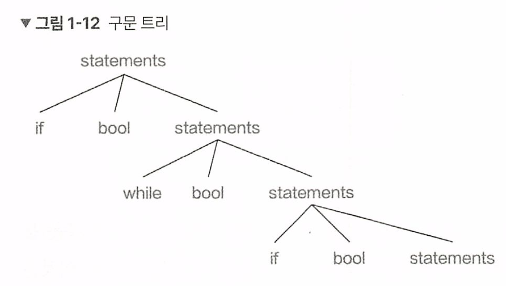

구문 안에 if, bool, 구문이 다시 중첩되고 재귀적으로 반복된다.

코드는 트리형태로 표현할 수 있으며 가장 마지막 리프 노드들을 보면 매우 간단해서 기계어로 번역할 수 있다.

리프 노드를 기계 명령어로 번역하고 그 결과를 리프 노드의 부모 노드로.. 재귀적으로 타고 올라가다보면 전체 트리를 기계 명령어로 번역할 수 있다. 

이것을 담당하는 프로그램이 컴파일러이다. 


다른 문제가 있다.

세상에 CPU는 여러 종류가 있고, 각 CPU마다 기계어를 해석하는 방식이 다르며 각각의 고유 언어가 있다.

이 문제를 해결하기 위해 Acpu가 Bcpu를 CPU 시뮬레이션 하는것이 나오게 되었고 이것이 Vitual machine이다.

표준 공용어를 두고 각각의 CPU 형식마다 가상 머신이 이 명령어들을 자신의 CPU에 맞는 방식으로 해석한다. 

이것들을 요즘의 자바, C++ 같은 고급 언어라고 하며 이 구문 트리를 기계어로 번역하거나 바이트 코드로 변환 후 가상머신으로 넘겨 가상머신에서 실행한다. 

## 1.2장 컴파일러는 어떻게 작동하는 것일까?

사람이 읽을 수 있는 고급 프로그래밍 언어를 컴퓨터가 이해할 수 있는 저수준 언어로 변환하는것이 컴파일러

컴파일러는 각 코드를 쪼갠 후 각 항목이 가지고 있는 추가 정보를 함께 묶어서 관리한다.

``` 
int a = 1;
int b = 2;
```

```
T_Keyword int
T_Identifier a
T_Assign =
T_Int 1
```

각각의 줄은 하나의 토큰이며 T로 시작하는 왼쪽 열은 토큰 의미, 오른쪽은 값이다 

컴파일러는 첫 작업으로 소스 코드를 돌아다니면서 모든 토큰을 찾아 추출하고 정리한다. 

이 소스코드에서 토큰을 추출하는 과정이 lexical analysis라고 한다.


다음으로 구문에 따라 토큰을 처리해야 한다

```
while (표현식) {
  반복 내용 
}
```

while 키워드의 토큰을 찾으면 다음 토큰이 (라는것을 기대하는데, 이때 기대하는값이 아니면 syntax error를 보고한다. 이런식으로 해석(파싱)을하며 빠지지않고 다 검사하게 된다. 

이 구문에 따라 해석해 낸 구조는 트리로 표현되며 이것이 구문 트리이고 트리를 생성하는 과정을 구문 분석이라 한다.

구문을 검사하고 구문이 문제가 없다면 중간 코드를 생성한다. 

```
a = 1
b = 2
goto b
```

* 중간 코드에 최적화를 진행하는 경우도 있다. 미리 계산이 가능하다던가 등

중간 코드를 생성한 이후 어셈블리어 코드로 변환하고, 컴파일러는 이 어셈블리 코드를 기계어로 변환한다.

이게 다가 아니다, 모든 소스파일은 여러개가 있다. 이 대상 파일들을 하나로 합쳐주는 작업이 필요하다

이 작업을 link라고 하며, link를 담당하는 프로그램을 linker라고 한다

## 링커의 말할수 없는 비밀

프로그래머라면 완성된 외부 라이브러리를 가져와 사용한다. 외부 코드 덩어리는 정적, 동적 라이브러리로 제공된다.

이 링커가 이것을 도와준다

링커가 하는 일은, 여러 흩어져 있는 일을 하나로 묶어준다.

주요 역할:

1. **심벌 해석:** 참조된 함수나 변수가 실제로 존재하는지 확인.
2. **재배치:** 참조된 함수나 변수의 실제 메모리 주소를 설정.
3. **실행 파일 생성:** 모든 파일을 합쳐 완전한 실행 파일 생성.

이 과정에서 링커는

- **심벌 해석(Symbol Resolution):** 참조된 함수나 변수가 실제로 존재하는지 확인.
- **재배치(Relocation):** 참조된 함수나 변수의 정확한 메모리 주소를 설정.

예를 들어, `main.c`에서 `print()` 함수를 호출한다고 가정하면, 링커는 `print()` 함수가 `print.c` 파일에 실제로 정의되어 있는지 확인하고 이를 연결한다. 

* 컴파일러는 `main.c`에서 `print()` 함수가 존재한다고 가정하지만, 실제 구현이 `print.c`에 있다. 

`main.c`에서 `print()` 함수 호출 시, `print()`의 위치를 `0x0000`으로 임시 표시하면 링커는 `print()` 함수의 실제 메모리 주소를 확인하고 `0x1234`로 수정한다. 


심벌은 무엇일까?

* 전역 변수와 함수 이름을 포함하는 변수 이름 
* 지역 변수는 외부 모듈에서 어차피 참조 불가능해서 링커의 관심 대상이 아님

링커는 소스 파일에 다른 모듈에서 참조할 수 있는 심벌이 있다는 것과 참조한다는 두가지 정보를 알 고 있어야한다.

이 정보는 컴파일러가 알려준다

컴파일러는 명령어 부분을 코드 영역에 저장하고, 데이터 부분(전역 변수, 외부 변수)등을 데이터 영역에 저장한다. 

그리고 소스 파일마다 외부에서 참조 가능한 심벌들이 어떤것인지 정보를 심벌 테이블에 기록하고 링커에게 알려준다.

심벌 해석이 끝나게 되면 실행 파일을 생성한다.


### 정적 라이브러리, 동적 라이브러리, 실행파일

C언어에서 코드를 별도로 컴파일 한 후, 패키지로 묶고 모든 함수의 선언을 포함하는 헤더파일을 제공하는것을 정적 라이브러리 라고 한다. 이때 미리 컴파일하고 제공하기 때문에 실행파일 생성시 작성한 코드만 컴파일하며, 미리 컴파일되어있는 정적 라이브러리는 다시 컴파일 하지 않고 그대로 링크과정에서 실행파일에 복제된다.

그래서 속도가 빠르며 이과정을 정적 링크라고 한다. 

그러나 정적 링크는 라이브러리를 실행 파일에 직접 복사하기 때문에, 작성한 코드가 여러개라면 생성된 실행 파일이 그만큼 복제되어 낭비된다. 즉 라이브러리 크기가 2MB고 실행 파일이 500개라면 1GB가 중복된다. 

* 링커는 각 실행 파일이 필요로 하는 정적 라이브러리의 코드를 실행 파일 내부에 포함시키며, 정적 라이브러리는 실행 파일이 독립적으로 동작할 수 있도록 필요한 코드를 모두 넣기 때문임. 
* 즉 장점은 독립성과 호환성이지만 단점은 중복이 되는것 

이 문제를 동적 라이브러리를 사용하여 해결한다. 


동적 라이브러리는 실행 파일이 라이브러리 코드를 포함하지 않고 실행 시 공유 라이브러리를 참조한다.

참조된 동적 라이브러리 이름, 심벌 테이블, 등 필수 정보만 실행 파일에 포함 시키기 때문에 실행 파일의 크기를 줄일 수 있다.

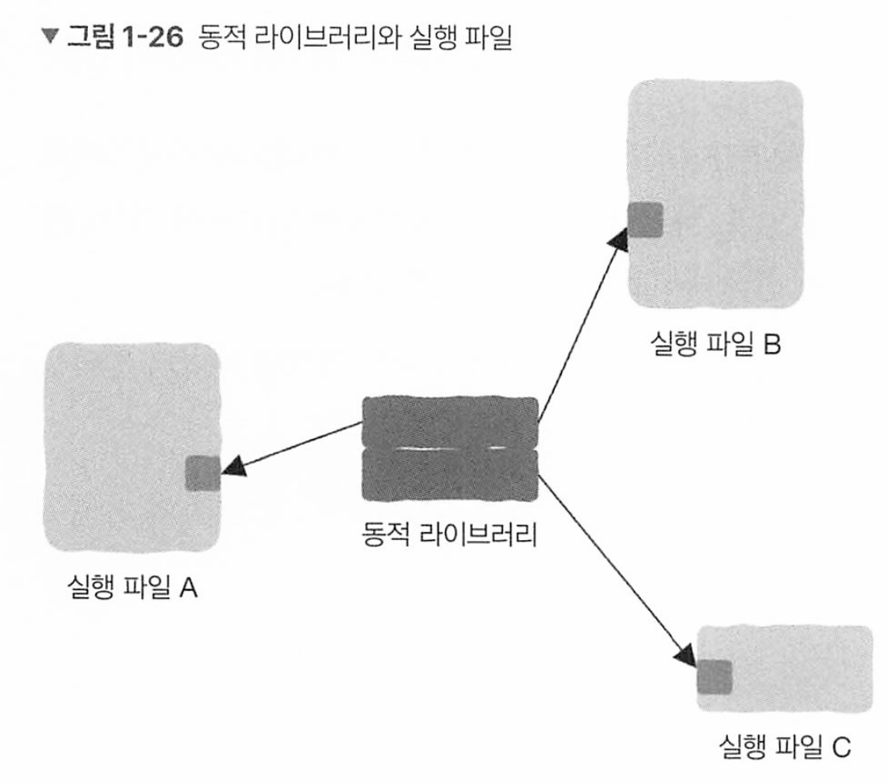

* 윈도우에서 exe 실행시 정적 라이브러리는 exe에 포함되는데, 동적 라이브러리는 dll로 exe 빌드시 포함되지 않고 실행 시점에 dll을 로드하여 사용하는것.

> 왜 이렇게 되었을까?
>
> 컴퓨터 초창기에는 시스템간 호환성 동적 연결한 기술이 모자를뿐더러 실행파일이 독립적으로 동작해야 했기 때문. 
>
> 그러나 점점 발전하는데, 메모리와 디스크도 여전히 제한적이지만 동일 코드를 복제하는것은 큰 낭비이므로 동적 연결 개념이 등장하게 된것. 

동적 라이브러리에 의존하는 프로그램은 동적 링크(링킹)을 프로그램 실행시점까지 미룬다 

두가지 방식이 있는데

1. 프로그램이 메모리에 로딩될떄 동적 링크 진행 (로더라는 전용 프로세스 실행)
2. 런타임에 코드가 동적 링크를 직접 실행해서 필요할떄 사용 -> 런타임 동적 링크 


동적 라이브러리의 장점은

효율성과 유지보수, 즉 라이브러리만 교체하면 되며 플러그인 처럼 확장도 쉬워지게 된다. 

파이썬은 느린데, 빠르게 쓰고싶다면 높은 성능이 요구되는 부분을 C C++로 작성하고 컴파일하여 동적 라이브러리 만든 후 링킹하는것이다. 

* 자바의 native도 네이티브 c, c++로 작성된 네이티브 라이브러리를 사용

그러나 단점은 약간 성능이 떨어질 수 있단것이다. 


### 재배치 : 심벌의 실행시 주소 결정하기 - 링커

모든 변수나 함수는 메모리에 할당되며 메모리 주소가 있다.

링커가 실행 파일 생성시 함수가 적재될 메모리주소를 확정해야 하는데  어떻게 알 수 있을까?

링커는 프로그램에서 호출되거나 참조되는 모든 심벌이 실제로 **어디에 정의되었는지** 확인하는데

컴파일러가 남겨둔 정보를 바탕으로 심벌의 위치를 확인한 후 실행 파일에서 심벌이 위치할 실제 메모리 주소를 결정한다. 

#### **컴파일러가 남긴 단서**

- 객체 파일 구조

  - `.text`: 기계 명령어가 들어 있는 코드 영역.
  - `.data`: 전역 변수 등의 데이터 영역.
  - `.relo.text`: 재배치 정보를 기록하는 영역.
  - `.relo.text`에는 "주소를 수정해야 할 명령어 위치와 관련 심벌 이름" 정보가 저장

  * 예시 : foo함수 호출 

  - 컴파일러가  ```call foo``` 명령어를 생성하며,  ```foo```

    의 주소를 아직 모른다면:

    - `call 0x00`으로 임시 주소를 기록.
    - ```.relo.text```에 다음 정보 추가:
      - 명령어 위치: `코드 영역의 오프셋 60바이트`.
      - 심벌 이름: `foo`.

이렇게 메모리 주소를 수정하는 과정을 재배치라고 한다.

근데, 어떻게 실행 전인데 실행된 후의 변수 등의 메모리 주소를 어떻게 알 수 있을까?

*  이 문제를 가상 메모리를 이용한다

### 가상 메모리와 프로그램 메모리 구조

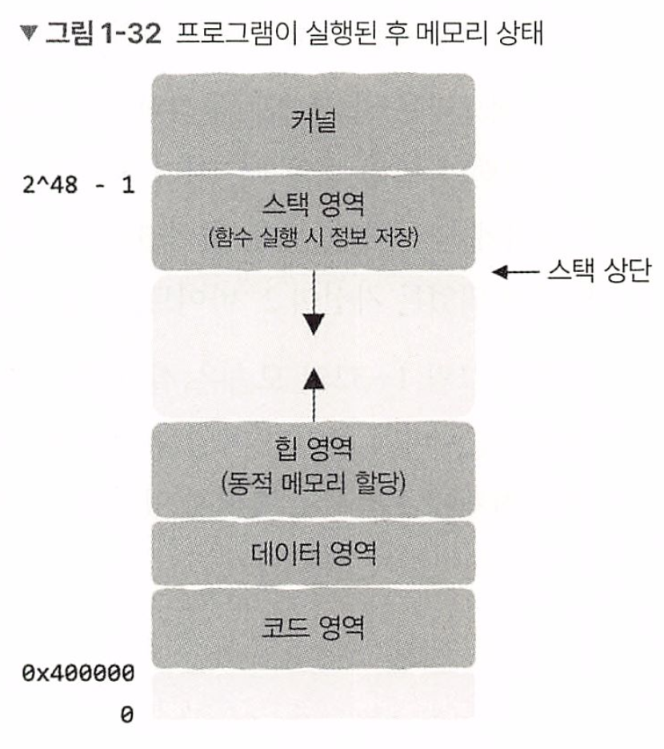

그림 상으로, 모든 프로그램은 실행 된 후 코드 영역이 예외없이 메모리주소 0x400000에서 시작한다. 

* 일반적으로 Linux 시스템에서 실행 파일(ELF 포맷)은 **코드 영역을 메모리 주소 0x400000**에 로드한다고 한다.

두 프로그램이 동시에 실행된다면 둘다 어떻게 같은 메모리 주소에 로드될까?

이것은 물리적으로 존재하지 않는 가짜 메모리 덕분이다. 이 가짜 메모리 기술을 가상 메모리 기술이라고 한다.

가상 메모리는 운영 체제가 제공하는 기술로, 프로그램마다 **독립적인 메모리 공간**을 할당받는 것처럼 보이게 만든다.

실제로는 여러 프로그램이 하나의 물리적 메모리(RAM)를 공유하지만, 각 프로그램은 자신의 **고유한 메모리 공간**만 사용하는 것처럼 동작한다. 

* CPU가 명령어를 실행할 때, 가상 메모리 주소를 **MMU(Memory Management Unit)**가 **물리 메모리 주소**로 변환한다.
* 운영 체제는 각 프로그램마다 **페이지 테이블**을 유지하여, 가상 주소와 물리 주소 간의 매핑 정보를 저장하는데, 프로그램이 실행될 때, 이 페이지 테이블을 참조하여 가상 주소를 물리 주소로 변환한다.

CPU가 프로그램 A를 실행하고 메모리 주소에 접근하면, 페이지 테이블을 참조하여 실 물리 메모리 주소로 변환한후 접근하게 된다. 


특징

* 모든 프로세스의 가상 메모리는 표준화 되어있다.
* 실제 물리 메모리에는 힙, 스택 영역을 구분하진 않음. 운영체제마다 다를 순 있음
* 모든 프로세스는 자신만의 페이지 테이블을 가지며, 같은 가상 메모리 주소라서 페이지 테이블을 확인하여 서로 다른 물리 메모리 주소를 획득한다. 


가상 메모리는 현대 운영 체제의 핵심 기술로, 다음과 같은 장점을 제공

- **프로그램 간 메모리 보호**: 각 프로그램이 자신의 메모리만 접근할 수 있도록 보장.
- **효율적인 메모리 사용**: 실제 메모리를 적게 사용해도 많은 프로그램을 동시에 실행 가능.
  - 메모리 침범으로 인한 충돌과 오류 방지.
- **코드 재사용**: 동일한 실행 파일을 여러 프로세스에서 공유 가능.
- **메모리 주소의 일관성**
  - 모든 프로그램은 자신의 메모리 주소를 0부터 시작하는 것처럼 인식.
  - 개발자가 물리적 메모리 주소를 신경 쓰지 않아도 됨.


가상 메모리는 OS와 MMU, CPU의 협업으로 구현된다.

* 결국 운영체제가
  * **프로세스별 가상 주소 공간 생성**: 각 프로세스에 독립적인 메모리 공간을 할당.
  * **페이지 테이블 관리**: 가상 주소와 물리 주소 간의 매핑 정보를 저장.
  * **메모리 할당 및 해제**: 필요한 메모리를 할당하고, 사용하지 않는 메모리를 반환.
  * **페이지 교체 알고리즘 실행**: 물리 메모리가 부족할 때, 어떤 데이터를 디스크로 스왑할지 결정.

* 메모리 관리 유닛(MMU)

  * MMU**는 CPU와 메모리 사이에서 동작하는 하드웨어 모듈.
    - 가상 주소를 물리 주소로 변환.

* 이덕분에 스왑 메모리도 사용 가능 

* 단점으로는

  * **성능 저하**:

    - 가상 주소를 물리 주소로 변환하는 과정에서 CPU와 MMU의 추가 작업 발생.
    - 디스크에서 데이터를 불러오는 **페이지 폴트**가 발생하면 속도 저하.

    **복잡성 증가**:

    - 운영 체제가 페이지 테이블, 주소 변환, 스왑 공간 등을 관리해야 하므로 구현이 복잡.

    **디스크 의존성**:

    - 물리 메모리가 부족할 경우, 디스크 접근이 많아져 시스템 성능이 크게 감소(스왑 현상).

  * 이 단점들이 다 커버가 될 정도로 장점이 많다. 

## 컴퓨터 과학에서 추상화가 중요한 이유

복잡한 소프트웨어를 추상화를 통해 복잡도를 제어할 수 있다.

모듈 기반 소프트웨어 사용시 각 모듈이 API를 추상화하면 내부 구현 상관없이 추상화된 API에만 집중

고급 언어는 추상화 되어있어 저급 언어와 CPU제어 및 기계어를 신경쓰지 않아도 되고

I/O장치는 파일로 추상화 되어있어서 세부사항은 신경쓰지 않아도 되고

프로그램은 프로세스로 추상화되어 단일 CPU도 수많은 프로세스를 실행 가능하며

물리 메모리와 파일은 가상 메모리로 추상화 되어 메모리를 안심하며 쓰고

네트워크는 소켓으로 추상화되어 패킷 해석 및 네트워크 카드가 데이터를 송수신하는지 신경쓸 필요가 없다. 


그러나 과연 저수준에 대해 알지 못해도 될까? 

# 2장 프로그램이 실행되었지만, 뭐가 뭔지 하나도 모르겠다

## 운영체제, 프로세스, 스레드의 근본 이해하기

CPU는 스레드 프로세스 운영체제 같은 개념을 전혀 모른다.

다음 두가지만 안다.

1. 메모리에서 명령어(instruction을) 하나 dispatche한다
2. 이 명령어를 execute 한 후 1.로 돌아간다

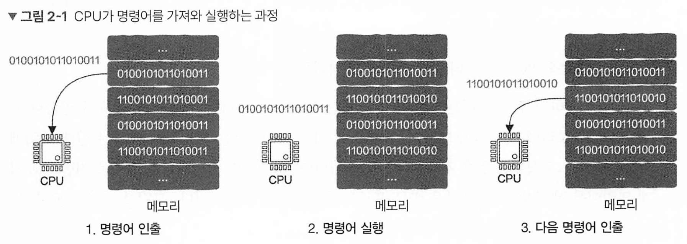

CPU는 program counter라는 register에 저장되어있는 명령어 주소를 가져온다. 

pc 레지스터는 cpu에서 다음에 실행할 명령어의 주소를 저장하는 레지스터이다.

**역할**:

- CPU가 명령어를 처리하는 동안, 다음에 실행할 명령어의 위치를 알려줌.
- 명령어가 실행되면, PC 레지스터는 자동으로 다음 명령어의 주소로 업데이트.

**저장되는 내용**:

- **현재 실행 중인 명령어의 다음 명령어의 주소**.
- 이는 메모리 상의 명령어 주소이며, 보통 프로그램이 로드된 위치를 기준으로 상대적이거나 절대적인 주소

PC 레지스터가 저장하는 주소는 기본적으로 1씩 자동 증가한다. 그러나 if else, 함수 호출 명령어를 만나면 순차적인 실행순서는 파괴된다. 이런 명령어 실행시 CPU는 지정한 점프할 대상 주소에 따라 PC 레지스터 값을 동적으로 변경한다.

프로그램 시작시 주소는 운영체제가 설정한다.

### CPU에서 운영 체제까지

CPU는 한번에 한가지 일만 할 수 있다. 여러 프로세스가 동시에 동작하는건, 잠깐 그 사이에 일시 중지하고 다른 프로세스를 시작해서다. CPU 전환 빈도가 매우 빠르므로 동시에 실행되는것처럼 보이는것이다. 

CPU가 어떤 기계 명령어를 실행했는지, 어디까지했는지를 Context에 저장해놓고 저장된 정보를 이용해서 실행을 재개한다. 

그리고 프로그램을 자동으로 메모리 적재, 멀티태스킹 가능, 프로세스 관리 등을 지원하는것이 운영체제이다. 

### 프로세스는 매우 훌륭하지만 아직 불편하다

```c
int main() {
  int resA = funcA();
  int resB = funcB();
  
  print(resA + resB);
  
  return 0;
}
```

* A함수 B함수 각각 3분 ,4분이 걸린다면 너무 오래걸린다
* 실행 속도를 높이는 법은 프로세스를 나누어 병렬로 처리하고 합치면 된다.

그러나 이 프로세스 간 통신은 단점이 있다.

* 프로세스 생성시 오버헤드, 프로세스마다 자체적인 주소 공간이 있으므로 이 프로세스간 통신은 복잡함.

이를 해결하기 위해 스레드라는 개념이 나오게 됌.


프로세스의 단점은 진입 함수(entry function)이 main밖에 없어 프로세스의 기계 명령을 하나의 CPU에서만 실행할 수 있다. CPU 여러개가 동일한 프로세스의 기계 명령어를 실행하게 할 방법은 없을까?

PC 레지스터가 main 함수를 가르켜 실행하듯이, PC 레지스터가 다른 어떤 함수를 가르켜 실행할 수 있으면 새로운 실행 흐름을 형성할 수 있다. 

즉 하나의 프로세스에 속한 명령어들을 CPU 여러개에서 동시에 실행할 수 있다. 

```c

int resA;
int resB;

int main() {
  resA = thread funcA().join();
  resB = thread funcB().join();
  
  print(resA + resB);
  
  return 0;
}
```

두 값을 더하는 과정에서 프로세스간 통신이 없다.

스레드 사이에는 통신이라는 개념이 없는데 다른 주소공간이 아닌 동일한 프로세스 주소 공간 내에 속해 실행되기 때문이다. 즉 스레드끼리는 자신이 속해있는 프로세스의 주소 공간을 공유하며 스레드가 훨씬 가볍고 생성속도가 빠른 이유기도 하다. 

이것은 큰 편의성을 제공하지만, 여러 스레드들이 공유 리소스에 접근할 때 오류가 발생하는 문제이기도 하다.

상호 배제와 동기화를 이용해서 명시적으로 해결해야 한다.

### 다중 스레드와 메모리 구조

CPU의 PC 레지스터에는 프로세스 또는 스레드의 명령어 주소를 저장할 수 있고 이것에 스레드의 진입 함수를 넣으면 스레드를 실행시킬 수 있다. 

* 스레드는 실행 단위이며 CPU는 스레드를 실행하기 위해 PC 레지스터를 사용 

스레드와 메모리의 관련

* 함수가 실행될때 필요한 정보 : 매개변수, 지역변수, 반환주소

이 정보들은 스택에 저장되며 모든 함수는 실행시 자신만의 runtime stack frame을 가진다.

스레드라는 개념이 존재하기 전 프로세스 내 실행 흐름은 하나만 존재, 스택도 하나만 있었다.

스레드를 사용하고 나서 프로세스에 여러 entry point가 존재할 수 있게 되었고 이것은 곧 동시에 실행 흐름이 여러개 존재할 수 있게 되었다. 

즉 프로세스의 주소 공간에 각 스레드마다 스레드를 위한 스택 영역이 별도로 있게 되는것이다. 

### 스레드 활용 예

라이프사이클 관점에서 볼때 스레드는 긴 작업, 짧은작업 두가지 유형이 있다. 

* 긴 작업 : 워드 실행
* 짧은 작업 : 네트워크, 데이터베이스 등

서버가 하나의 요청을 받으면 스레드를 하나 생성하고 처리가 완료되면 스레드를 종료하는것이 thread per request이다.

이는 대량의 작업에선 큰 단점이 있따.

* 스레드의 생성과 종료에 리소스가 듦
* 스레드마다 독립적인 스택영역이 필요한데, 이는 많은 메모리 사용량을 잡아먹게 됌
* 스레드 수가 많으면 스레드간 전환에 따른 부담이 증가 

이때문에 스레드를 생성하고 사용 후 삭제하는것이 아닌 스레드 풀 개념이 나오게 되었다.

스레드 풀의 스레드 수는 몇개가 적합할까?

* 너무 적으면 CPU 최대 활용 불가능
* 너무 많으면 리소스 낭비, 시스템 성능 저하, 컨텍스트 스위칭간 부하 발생

CPU intensive 테스크와 io intensive task로 구분하여 적합하게 설정하는것이 좋다.

## 스레드간 공유되는 프로세스 리소스

### 스레드 전용 리소스

스레드는 사실 함수 실행이며 하나의 시작점이 존재하고 이 시작점이 진입 함수다. 

CPU는 진입 함수에서 실행을 시작하여 실행 흐름을 생성하는데 이것이 스레드이다.

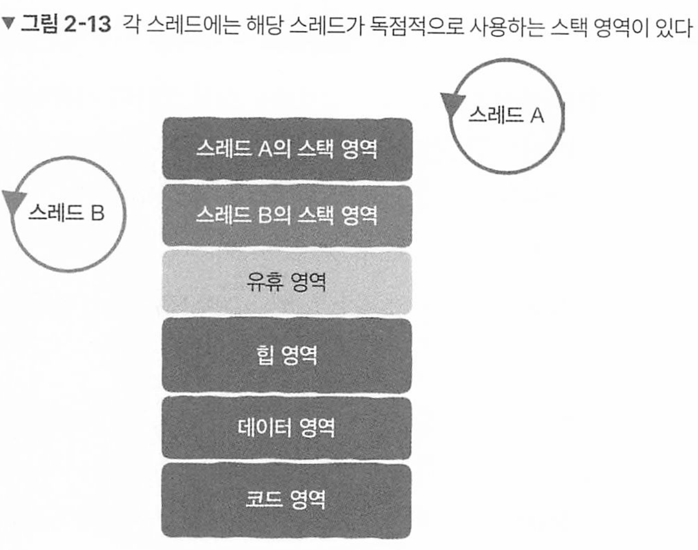

스레드는 자신만 사용할 수 있는 스택 영역을 가지므로 스레드 여러개가 있을떄는 여러 스택 영역이 존재한다.

이외에도 

* 다음에 실행될 명령어 주소를 저장하는 PC 레지스터,
* 스레드 스택 영역에서 스택 상단을 가리키는 스택 포인터

등도 스레드의 현재 실행 상태에 속한다.

이 모든 정보를 thread context 라고 한다.

스레드는 스택 영역을 제외한 나머지 힙, 데이터, 코드 영역을 공유한다. 

### 코드 영역 : 모든 함수를 스레드에 배치하여 실행할 수 있다.

코드 영역은 프로그래머가 작성한 코드, 정확하게는 컴파일한 후 생성된 실행가능한 기계명령어가 저장된다.

코드 영역은 스레드 간에 공유되므로 어떤 함수든 스레드에 적재하여 실행될 수 있고 특정 함수를 특정 스레드에서만 실행하는것은 불가능하다.

코드 영역은 read-only이기때문에 어떤 스레드도 변경할 수 없어서 스레드 세이프하다.

* 데이터 영역이나 힙에서 상태를 공유하는 자원이 없는 한, 코드 실행은 스레드 세이프
* 왜 코드영역은 불변이냐? 프로그램 실행 중 코드 영역에 저장된 명령어(기계어)가 변경된다면, 예상치 못한 동작이 발생할 수 있기 때문 
* 여러 스레드 또는 프로세스가 동일한 코드를 실행하는 경우, 한쪽에서 코드가 수정되면 다른 쪽에서도 영향을 받게됌 이 문제를 원천적으로 방지. 
*  **코드 영역을 읽기 전용으로 설정하고 여러 프로세스 간 공유하면 메모리 사용량을 줄이고 캐시 효율을 높임. 
  * 매개변수는 자기 스레드만의 스택 프레임에 저장 즉 매개변수는 독립적으로 관리됌 지역변수도 마찬가지. 
  * 그러나 매개변수로 참조나 포인터가 전달되면 공유될 수 있음 


### 스레드 전용 저장소

스레드에는 각자 전용 저장소가 있음.

- 이 영역에 저장된 변수는 모든 스레드에서 접근할 수 있다.
- 모든 스레드가 동일한 변수에 접근하는 것처럼 보일 수 있지만, 사실 변수의 인스턴스는 각각의 스레드 에 속한다.. 따라서 하나의 스레드에서 변수 값을 변경해도 다른 스레드에는 반영되지 않는다.

## 스레드 세이프 코드는 어떻게 작성해야 할까

- 전용 리소스를 사용하는 스레드는 스레드 세이프를 달성할 수 있다.
- 공유 리소스를 사용하는 스레드는 다른 스레드에 영향을 주지 않도록 하는 대기 제약 조건에 맞게 공유 리소스를 사용하면 스레드 세이프를 달성할 수 있다.

공유 리소스?

함수의 지역 변수, 스레드의 스택, 스레드 전용 저장소는 스레드 전용 리소스이다.

나머지는 공유 리소스다.

* 힙 영역: 메모리의 동적 할당에 사용되는 영역으로, C/C++ 언어의 malloc 함수와 new 예약어가 요청하는 메모리는 이 영역에 할당.
*  데이터 영역: 전역 변수가 저장되는 영역.
* 코드 영역: 이 영역은 읽기 전용으로, 프로그램이 실행되는 동안은 코드를 수정할 방법이 없으므로 이부분은 신경 쓸 필요가 없다.

공유 리소스를 안전하게 사용하는법은 순서를 따르면서 각종 잠금이나 세마포어를 이용해 다른 스레드가 건드리지 못하도록 해야한다.

1. 전역 리소스 사용해야 하는 경우 스레드 로컬에 저장하여 사용할 수 있는지 확인
2. 읽기 전용으로 수정 불가능하게 한다
3. atomic 연산을 이용한다. **Atomic 연산**은 컴퓨터에서 **더 이상 나눌 수 없는, 중단될 수 없는 연산**으로 즉, **다른 스레드가 간섭할 수 없는 단위 작업**으로, 연산이 시작되면 완료될 때까지 보장된다. 
4. 뮤텍스, 락, 세마포어를 이용해 잠금을 건다

## 프로그래머는 코루틴을 어떻게 이해해야 할까

**코루틴(Coroutine)**은 프로그래밍에서 **비동기 작업을 처리하기 위한 실행 단위**로, 특정 지점에서 **실행을 일시 중단(yield)**하고, **다시 이어서 실행(resume)**할 수 있는 특성을 가진 함수 또는 프로그램 구성 요소이다.

```python
def func():
  print("a")
  // 일시 중지 및 반환
  print("b")
  // 일시 중지 및 반환
  print("c")
  // 일시 중지 및 반환
```

코루틴은 자신의 실행상태를 저장하기 때문에 일시 중지된 지점에서 다시 이어서 실행할 수 있다.

일반 함수는 반환된 후 프로세스 주소 공간의 스택 영역에 더이상 ㅓㅇ떤 함수 실행시 정보도 저장하지 않는다.

코루틴이 반환될때는 함수의 실행시 정보를 저장하는데, 코루틴이 실행이 멈추었던 지점에서 다시 실행시 이정보가 필요하기 때문

```python
def simple_coroutine():
    print("Coroutine started")
    x = yield "First yield"  # 첫 번째 일시 중단, 값을 반환
    print(f"Coroutine resumed with x = {x}")
    y = yield "Second yield"  # 두 번째 일시 중단
    print(f"Coroutine resumed with y = {y}")
    yield "Coroutine finished"

```

실행 과정

```
# 코루틴 객체 생성
coro = simple_coroutine()

# 1. 코루틴 시작
print(next(coro))  # "Coroutine started" 출력 후 "First yield" 반환

# 2. 첫 번째 재개
print(coro.send(10))  # "x = 10" 출력 후 "Second yield" 반환

# 3. 두 번째 재개
print(coro.send(20))  # "y = 20" 출력 후 "Coroutine finished" 반환
```

결과

```
Coroutine started
First yield
Coroutine resumed with x = 10
Second yield
Coroutine resumed with y = 20
Coroutine finished

```

코루틴의 상태는 **스택 프레임**과 **레지스터 정보** 등 실행 컨텍스트를 포함하며, 이 정보는 **메모리의 특정 영역**에 저장한다. 

* 스택 또는 힙 에 저장한다.
  * 현재 실행 위치(PC), 지역변수 매개변수, 콜스택(현재까지 실행 정보), 레지스터 값 등 

### 함수는 그저 코루틴의 특별한 예에 불과하다

코루틴이 일반 함수와 다른 점은 자신이 이전에 마지막으로 실행된 위치를 아는것일 뿐.

코루틴과 스레드는 비슷하다. 스레드도 일시중지 될 수 있으며, 운영체제가 먼저 실행중이던 스레드의 실행 상태를 저장했다가 다른 스레드를 실행하고 다시 기존 스레드를 실행하고 반복한다. 이는 스케줄링과 같다. 

컴퓨터 시스템은 주기적으로 타이머 인터럽트를 생성해서 현재 스레드의 일시정지 여부를 결정한다.

그러나 이 유저 모드로 작성된 코드는 타이머 인터럽트가 없기 때문에 언어의 특정한 예약어를 이용해서 어디서 일시 중지하고 리소스를 내어줄 것인지 명시적으로 지정해야 한다.

### 코루틴은 어떻게 구현될까?

코루틴은 일시중지 및 다시시작될 수 있으므로 상태 정보를 기록해야 하며 이를 기반으로 실행한다

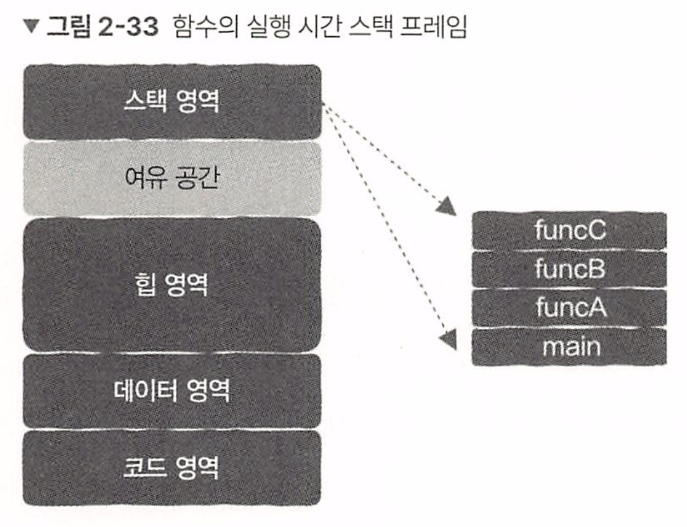

CPU 레지스터 정보, 함수 실행시 상태 정보가 포함된다.

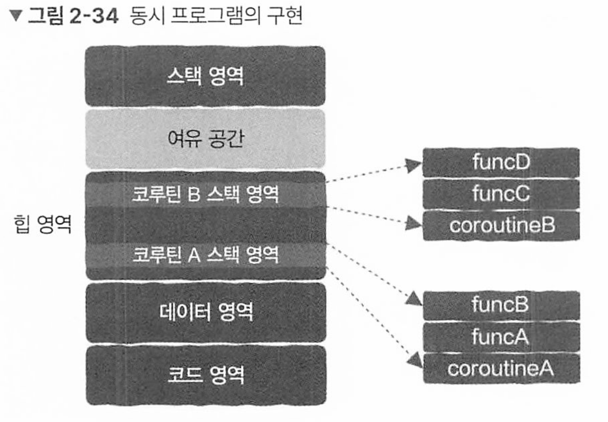

스택 영역은 스레드를 위한 공간이므로, 코루틴의 스택은 힙에 저장할 수 있다.

그림상으로, 실행 흐름이 일반스레드 한개 코루틴 2개가 있는게 보인다.

이론적으로 메모리 공간이 충분하다면 코루틴 수에 제한이 없으며 코루틴 간 전환이나 스케줄링은 사용자 상태에서 일어난다. 저장 또는 복구되는 정보도 훨씬 가볍기 때문에 효율성도 높다.


코루틴의 중요한 역할은, 동기 방식으로 비동기 프로그래밍을 가능하게 한단것이다.

어떻게 스레드, 코루틴을 사용할 것인가 알기 전에 콜백 함수, 동기, 비동기, 블로킹, 논블로킹 개념을 아아야 한다

## 콜백 함수 이해

콜백이 왜 필요할까? 

```
int a = 10;

void func hey() {
  ~~~ a; 
}
```

코드에서 숫자 10을 직접 사용하면 이 값을 바꾸려면 다른 코드를 전부 바꾸어야 한다.

그런데 변수에 담아 사용하면 변수만 사용하면 된다. 바꾸어야 할떄는 변수만 바꾸면 된다.

함수도 변수처럼 사용할 수 있다.

```
void func hey(func a) {
   a();
}
```

콜백 함수의 정의는 다른 함수에 인자로 전달되어, 특정 조건에서 호출되는 함수인데, 넘기는 함수만 바꾸면 어떤 함수든 특정 함수 내에서 실행될 수 있다.


그런데, hey를 호출하고 바로 리턴해야 하는데 5분 이내에 끝나야 하고, a함수가 6분이상 걸린다면?

요구사항을 어기게 된다.

a함수의 반환값이 필요가 없이 바로 끝내고 싶다면? 각 함수를 다른 스레드에서 병렬로 실행하면 된다 

### 비동기 콜백은 새로운 프로그래밍 사고방식

일반적으로 함수 호출시 사고방식은 다음과 같다

1. 함수를 호출하고 결과를 획득
2. 획득한 결과를 처리

이것이 일반적인 동기 방식이다. 

비동기 방식은 호출한 함수의 결과에 신경쓰지 않고 다른 스레드에서 실행시키는 것이다. 

### 블로킹 논블로킹 콜백

동기 콜백은 블로킹 콜백이라고도 하며, 함수 A를 호출할 때 콜백 함수를 매개변수로 전달한다고 가정하면 함수 A가 반환되기 전에 콜백 함수가 실행된다. 

비동기 콜백은 함수 A가 호출되고 바로 종료되며, 다른 스레드에서 실행되는것이다. 

비동기 콜백의 단점은 콜백 지옥에 빠질 수 있따.

```
func a() {
  func b() {
    func c() {
    /...
    } 
   }
}
```

코드가 너무 복잡해지기 때문이다.

이 비동기 콜백의 효율성 + 동기 콜백의 코드 단순성을 얻을 수 있는 방법이 코루틴이다.


동기는, 종속적, 연관, 기다림과 엮이고

비동기는 비종속적, 무관, 기다릴 필요 없는, 동시 발생 과 같은 단어와 엮인다. 

동기는 특정 함수가 다른 함수를 호출했을떄 종료를 기다리며, 비동기는 다른 함수를 호출했을떄 종료를 기다리지 않는다


비동기 호출하면 좋아보이지만, 작업이 언제 완료되었는지 어떻게 알고 어떻게 처리해야 할지 다음 두상황을 고려할 수 있다.

1. 호출자가 실행 결과를 전혀 신경쓰지 않을때
2. 호출자가 실행 결과를 알아야 할때


호출자가 실행 결과를 알 필요가 없으면 콜백 함수를 사용하면 된다

호출자가 실행 결과를 알아야하면, 호출자에게 완료를 알리는 신호나 메시지를 보내야 한다. 

동기 비동기는 호출자에 의존하냐 안하냐이며 

블로킹 논블로킹을 함수를 호출할때, 호출자의 스레드를 일시중지시킨다면 블로킹, 일시중지 시키지 않으면 논블로킹이다 

| **특징**      | **동기**                                   | **비동기**                                    |
| ------------- | ------------------------------------------ | --------------------------------------------- |
| **작업 방식** | 요청 후 작업 완료까지 대기                 | 요청 후 다른 작업 처리 가능                   |
| **블로킹**    | 요청 후 작업 완료 전까지 호출자 멈춤       | 호출자가 작업 완료 전에도 다른 작업 수행 가능 |
| **논블로킹**  | 요청 즉시 결과 반환, 작업 완료 여부는 대기 | 요청 즉시 결과 반환, 완료 시 알림으로 응답    |

이를 잘 이해하면 고성능 서버를 만들 수 있다

### 높은 동시성과 고성능을 갖춘 서버 구현

### 1. 다중 프로세스

부모 프로세스가 fork를 통해 자식 프로세스를 생성하여 요청을 처리함

장점

1. 프로그래밍 간단
2. 개별 프로세스 공간은 격리되어 특정 프로세스가 종료되더라도 다른 프로세스에는 영향이 없음
3. 다중 코어 리소스 최대 활용 가능

단점

* 프로세스간 통신 난이도 증가
* 프로세스 생성시 부담이 큼

### 2. 다중 스레드

스레드는 프로세스 주소 공간을 공유해서 별도의 통신 이 필요없다.

각 요청에 대응하는 thread-per-request를 사용 가능하다. 

다중 프로세스에 비해 다중 스레드가 유리하지만, C10K 문제에 따르면 동시 요청 수가 많을 때는 다중 스레드로 감당이 어렵다

* **C10K**는 **Concurrent 10,000 Connections**의 약자로, **한 대의 서버가 동시에 10,000개의 클라이언트 연결을 처리할 수 있는가?**

### 이벤트 순환과 이벤트 구동 

event based concurrency, event driven programming이다. 

이벤트 프로그래밍에는 두가지 요소가 필요하다

1. 이벤트 : 입출력에 관련된 것 (네트워크 요청 응답 파일 등 )
2. 이벤트 처리 함수 : 이벤트 핸들러

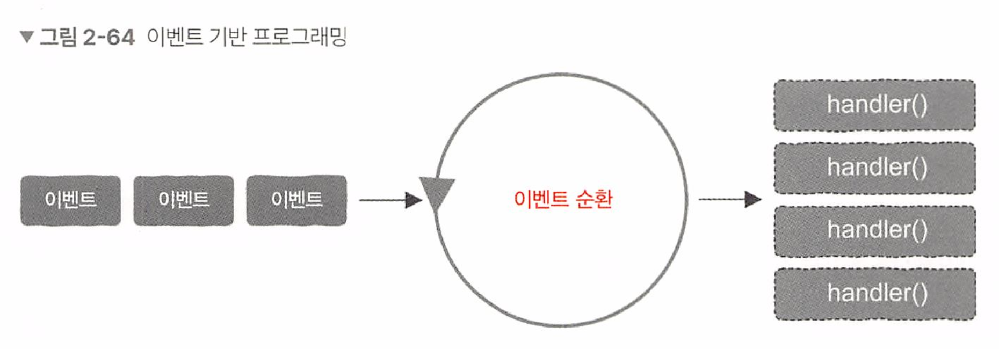

이벤트가 들어오면 적합한핸들러를 찾아 이벤트를 처리함. 

이걸 계쏙 수신하고 처리하는것을 도와주는것이 event loop(이벤트 순환 )

### 이벤트 루프의 첫번째 문제 : 이벤트 소스와 입출력 다중화

리눅스와 유닉스는 모든것이 파일로 취급된다. 파일 디스크립터를 사용하여 입출력작업을 실행하며 소켓도 파일이다.

사용자 연결이 열개면 소켓도 열개가 필요하다.

운영체제한테 소켓 디스크립터 10개를 감시하고 있다가 데이터가 들어오면 프로세스한테 알려달라고 하는것이 입출력 다중화이며 epoll이다.

```
#include <stdio.h>
#include <stdlib.h>
#include <unistd.h>
#include <sys/epoll.h>
#include <fcntl.h>

#define MAX_EVENTS 10

int main() {
    int epoll_fd = epoll_create();  // 1. epoll 인스턴스 생성
    if (epoll_fd == -1) {
        perror("epoll_create");
        exit(EXIT_FAILURE);
    }

    // 2. 파일 디스크립터 등록
    int fd1 = 0; // 예: 표준 입력
    struct epoll_event ev, events[MAX_EVENTS];
    ev.events = EPOLLIN;  // 읽기 이벤트
    ev.data.fd = fd1;

    if (epoll_ctl(epoll_fd, EPOLL_CTL_ADD, fd1, &ev) == -1) {
        perror("epoll_ctl");
        exit(EXIT_FAILURE);
    }

    while (1) {
        // 3. 이벤트 감지
        int n = epoll_wait(epoll_fd, events, MAX_EVENTS, -1);
        if (n == -1) {
            perror("epoll_wait");
            exit(EXIT_FAILURE);
        }

        // 4. 이벤트 처리
        for (int i = 0; i < n; i++) {
            if (events[i].events & EPOLLIN) {
                // 읽기 이벤트 처리
                char buffer[1024];
                ssize_t count = read(events[i].data.fd, buffer, sizeof(buffer));
                if (count > 0) {
                    printf("Read: %s\n", buffer);
                } else if (count == 0) {
                    printf("Connection closed\n");
                    close(events[i].data.fd);
                }
            }
        }
    }

    close(epoll_fd);
    return 0;
}

```

**epoll**은 Linux 커널에서 제공하는 **I/O 멀티플렉싱 API**로, **대량의 파일 디스크립터(file descriptor, FD)**를 효율적으로 관리하기 위해 설계

### 두번째 문제 : 이벤트 순환과 다중 스레드

이벤트 루프는 이벤트 핸들러와 동일한 스레드에서 실행된다.

모든 요청이 단일 스레드에서 순차적으로 처리되는데 요청이 오래 처리되면 다른 핸들러는 일을 하지 못하게 된다.

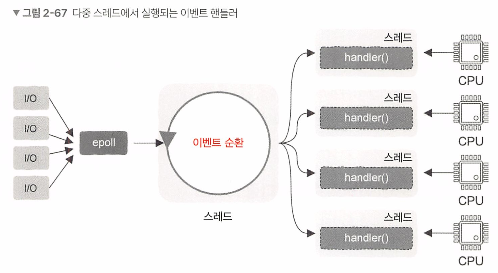

이 처리를 멀티 스레드에 맡겨 독립적인 워커 스레드에 분배하여 처리를 맡긴다. 

이런 설계 방법은 반응자 패턴이라는 이름이 붙었다

### 비동기와 콜백 함수

서버가 다른 서버로 요청을 보낼때 동기 방식으로 호출하면 리소스가 비효율적으로 사용된다

`GetUserInfo(request, response)`와 같은 RPC 호출은 **블로킹** 방식.

요청을 보낸 뒤 응답이 올 때까지 함수가 멈춤 → 스레드도 중단됨.

여러 RPC 호출이 연속되면 CPU 리소스가 비효율적으로 사용.

`GetUserInfo(request, callback)`와 같이 **비동기 호출**로 전환.

요청 후 즉시 반환 → 스레드는 다른 작업을 수행 가능.

응답이 도착하면 **콜백 함수**를 호출하여 결과 처리.

CPU 리소스를 효율적으로 활용.

스레드가 응답 대기 시간 동안 다른 작업 수행.

```
void handler_after_GetStorkInfo(response) {
    // 서버 C 응답 후 작업
    H;
}

void handler_after_GetQueryInfo(response) {
    // 서버 B 응답 후 작업
    F;
    // 서버 C에 요청 (콜백: handler_after_GetStorkInfo)
    GetStorkInfo(request, handler_after_GetStorkInfo);
}

void handler_after_GetUserInfo(response) {
    // 서버 A 응답 후 작업
    C;
    D;
    // 서버 B에 요청 (콜백: handler_after_GetQueryInfo)
    GetQueryInfo(request, handler_after_GetQueryInfo);
}

void handler(request) {
    // 초기 작업
    A;
    B;
    // 서버 A에 요청 (콜백: handler_after_GetUserInfo)
    GetUserInfo(request, handler_after_GetUserInfo);
}

```

그런데 이렇게 관리하다 보면 콜백안에 콜백이 포함되어 이해하기 어려운 코드가 된다.

이걸 해결하기 위해 코루틴이 나온다.

### 코루틴 : 동기방식의 비동기 프로그래밍

이전 코루틴을 이야기 할떄 yield로 CPU 제어권을 반환할 수 있다고 하였다.

코루틴이 일시 중지되더라도 작업자 스레드가 블로킹 되지 않는다.

코루틴이 일시 중지되면 워커 스레드는 준비 완료된 다른 코루틴을 실행하며, 다시 자기의 스케줄링 차례를 기다리고 다시 차례가 돌아오면 중지했던곳에서 실행하게 된다.

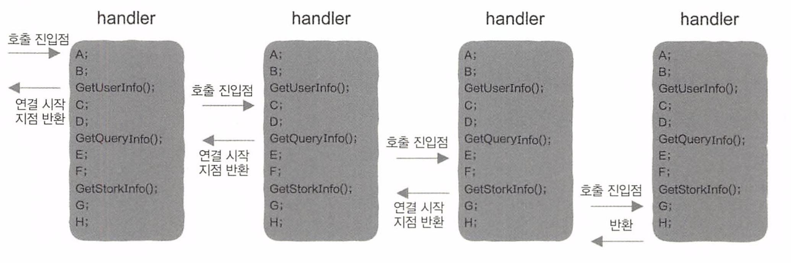

이벤트 루프는 요청을 받은 후 각 핸들러 함수를 코루틴에 담아 스케줄링과 실행을 위해 작업자 스레드에 배포한 후 핸들러를 실행한다. 각 작업자 스레드는 블로킹 되지 않기 때문에 시스템 리소스를 효율적으로 사용한다. 

### CPU - 코루틴 - 스레드 관계

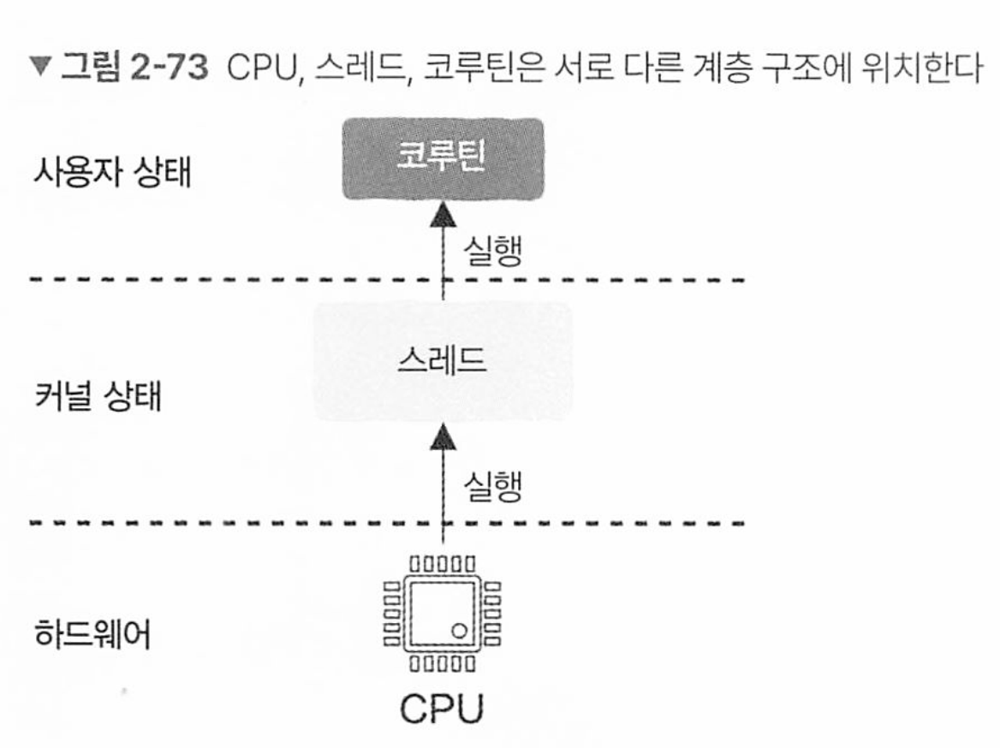

CPU는 컴퓨터를 움직이고 스레드는 CPU를 할당받으며, 코루틴은 스레드에 따라 CPU 시간을 할당하는데 여기서 스케줄링되어 할당된다.

즉 코루틴은 2차 할당되는것이며 사용자 스레드라고 할 수 있다.

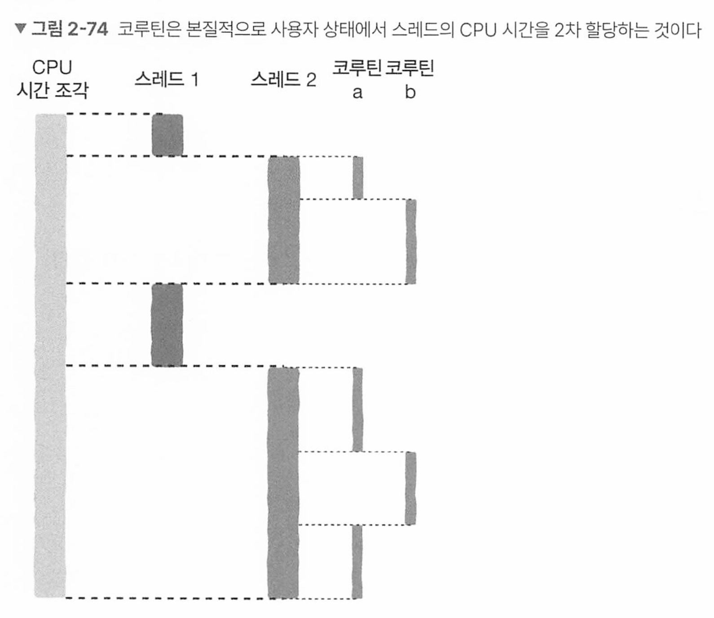 

## 데이터, 코드, 콜백, 클로저에서 컨테이너, 가상머신까지

**클로저(Closure)**는 프로그래밍 언어에서 **함수와 그 함수가 선언된 환경(Scope)의 조합**을 의미

즉, **함수가 자신이 선언된 시점의 변수나 상태를 "기억"하고, 나중에 호출될 때도 해당 상태를 사용할 수 있는 기능**

* 함수가 종료된 이후에도 클로저는 외부 함수의 변수에 접근 가능
* 외부 함수의 변수를 저장하고 이를 유지하며 필요할때 업데이트 가능

#### **JavaScript 예제**

```javascript
function outerFunction(outerVariable) {
    return function innerFunction(innerVariable) {
        console.log(`Outer: ${outerVariable}, Inner: ${innerVariable}`);
    };
}

const closureFunc = outerFunction("Hello");
closureFunc("World"); // Outer: Hello, Inner: World
```

- 분석
  - `outerFunction`은 내부 함수 `innerFunction`을 반환.
  - `closureFunc`는 `outerFunction`의 실행 환경과 함께 캡처된 `outerVariable`을 기억.
  - `closureFunc` 호출 시에도 `outerVariable`을 사용할 수 있음.

클로저의 용도

1. **상태 유지**:
   - 클로저를 사용해 외부 변수의 상태를 유지하며, 함수 호출 간에 데이터를 저장.
2. **정보 은닉**:
   - 외부에서는 접근할 수 없는 데이터를 클로저 내부에서만 관리.
3. **콜백 함수**:
   - 클로저를 사용해 특정 상태를 가진 콜백 함수 생성.
4. **함수 공장(Function Factory)**:
   - 클로저를 사용해 설정이 다른 함수를 동적으로 생성.

### 컨테이너와 가상머신 기술

프로그램이 구성, 라이브러리, 실행환경으로 묶인 것을 컨테이너라고 함.

컨테이너는 가상화 기술로서 운영체제를 가상화 함. 

OS 계층 수준에서 소프트웨어를 가상화 함. 


# 3장 저수준 계층? 메모리라는 사물함에서부터 시작해 보자


# 4장 트랜지스터에서 CPU로, 이보다 더 중요한 것은 없다


# 5장 작은 것으로 큰 성과 이루기, 캐시


# 6장 입출력이 없는 컴퓨터가 있을까?

