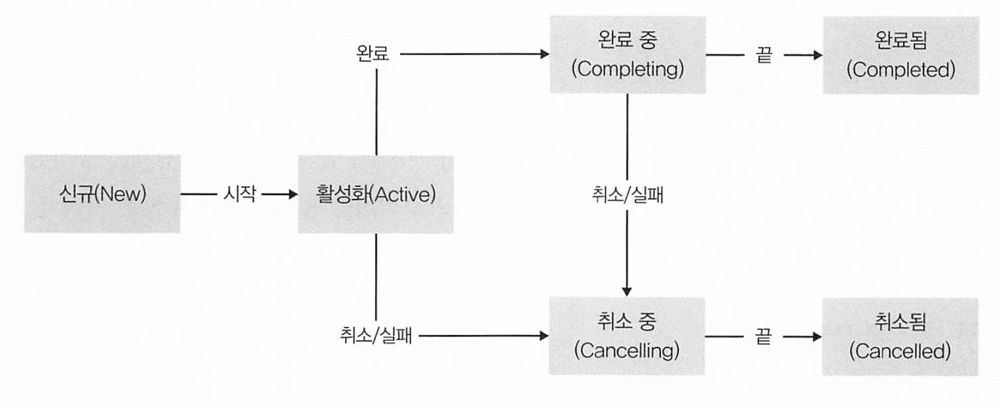

# 13장 동시성

대부분의 코루틴 기능이 별도 라이브러리로 제공되기 때문에 명시적으로 프로젝트 설정에 이를 추가해야 한다.

코루틴을 실행할때 사용하는 여러가지 함수를 코루틴 빌더라고 하며, CoroutineScope 인스턴스의 확장함수로 쓰인다

GlobalScope 객체의 launch(), async(), runBlocking() 메서드를 제공한다.


코루틴을 실행하는 스레드는 데몬 모드로 동작하기 때문에 main() 스레드가 코루틴 스레드보다 빨리 끝나버리면 자동으로 실행이 종료된다.

일시 중단 함수의 내부에서 sleep()과 같은 스레드를 블럭 시키는 함수를 실행할 수도 있지만, 그런 식의 코드는 코루틴을 사용하는 목적에 위배되므로 동시성 작업의 내부에서는 delay()를 사용해야 한다.


lauch() 빌더는 동시성 작업이 결과를 만들어 내지 않는 경우에 적합하므로 Unit 타입을 반환하는 람다를 인자로 받는다.


async() 빌더는 결과가 필요할 때 사용하며 Deferred의 인스턴스를 돌려주고 이 인스턴스는 Job의 하위 타입으로 await() 메서드를 통해 계산 결과에 접근할 수 있게 해준다

await()는 계싼이 완료되거나 계산 작업이 취소될 때까지 현재 코루틴을 일시 중단시키며 작업이 취소되는 경우 await()는 예외를 발생시키면서 실패한다

* 자바의 future에 해당하는 빌더라고 생각할 수 있다.


## 코루틴 문맥

코루틴마다 CorutineContext 인터페이스로 표현되는 문맥이 연관돼 있으며 코루틴을 감싸는 변수 영역의 coroutinContext 프로퍼티를 통해 이 문맥에 접근할 수 있다.

문맥은 키-값 쌍으로 이뤄진 불변 컬렉션이며, 코루틴에서 사용할 수 있는 여러가지 데이터가 들어있다.

* 코루틴이 실행중인 취소가능한 작업을 표현하는 Job
* 코루틴과 스레드의 연관을 제어하는 dispatcher

```kotlin
GlobalScope.launch { 
  println("Task is active : ${coroutineContext[Job.Key]!!.isActive}")
}
```

CorutineContext.Element를 구현하는 아무 데이터나 저장할 수 있다.

특정 원소에 접근하려면 get() 메서드나 인덱스 연산자 [] 에 키를 넘겨야 한다.


기본적으로 launch(), async() 등의 표준 코루틴 빌더에 의해 만들어지는 코루틴은 현재 문맥을 이어받는다. 

필요하면 빌더 함수에 context 파라미터를 지정해서 새 문맥을 넘길수도 있다.

새 문맥을 만들려면 두 문맥의 데이터를 합쳐주는 plus() 함수/+ 연산자를 사용하거나, minusKey 함수를 사용하면 된다.

```kotlin
private fun CoroutineScope.showName() {
    println("Current coroutine: ${coroutineContext[CoroutineName]?.name}")
}

fun main() {
    runBlocking {
        showName() // Current coroutine: null
        
        launch(coroutineContext + CoroutineName("Worker")) {
            showName() // Current coroutine: Worker
        }
   
    }
}
```


## 코루틴 흐름제어와 잡 생명주기

잡은 동시성 작업의 생명주기를 표현하는 객체다.

잡을 사용하면 작업 상태를 추적하고 필요할 때 작업을 취소할 수 있다.



* Active : 작업이 시작됐고 완료나 취소로 끝나지 않은 상태. 디폴트 상태. 생성되자마자 활성화(active) 상태가 된다.
  * CoroutineStart.DEFAULT : 디폴트 동작. 잡을 즉시 시작
  * CoroutineStart.LAZY : 잡을 자동으로 시작하지 말라느는뜻. 신규 상태가 되어 시작을 기다리게 됌 


Job이 다른 Job을 시작할수도 있는데 이 경우 새 Job은 기존 Job의 자식이 된다.

Job의 부모 자식 관계는 동시성 계산 사이에 트리 형태의 의존구조를 만든다.

children 프로퍼티를 통해 완료되지 않은 자식 잡들을 얻을 수 있따

```kotlin
fun main() {

    runBlocking {
        val job = coroutineContext[Job.Key]!!

        launch { println("Task A") }
        launch { println("Task B") }

        println("${job.children.count()} is running")
    }
}
// 결과
2 is running
Task A
Task B
```


Job의 join() 메서드를 사용하면 조인 대상 잡이 완료될 때 까지 현재 코루틴을 일시 중단시킬 수 있다.

```kotlin
fun main() {

    runBlocking {
        val job = coroutineContext[Job.Key]!!

        val jobA = launch { println("Task A") }
        val jobB = launch { println("Task B") }

        jobA.join()
        jobB.join()
        println("${job.children.count()} is running")
    }
}
// 결과
Task A
Task B 
0 is running
```

현재 Job의 상태를 잡의 isActive, isCancelled, isComplete 프로퍼티로 부터 추적할 수 있다.

이에 대한 정보는 Job 인터페이스 문서에서 볼 수 있다.

| 상태                 | isActive | isCompleted | isCancelled |
| -------------------- | -------- | ----------- | ----------- |
| 신규( New)           | false    | false       | false       |
| 활성화 (Active)      | true     | false       | false       |
| 완료 중 (Completing) | true     | false       | false       |
| 취소중 (Cancelling)  | false    | false       | true        |
| 취소됨 (Cancelled)   | false    | true        | true        |
| 완료됨 (Completed)   | false    | true        | false       |

* 완료됨, 취소됨 Job의 isCompleted가 true 라는 점에 유의하라.
* Job 외부에서 활성화된 작업과 완료 중인 작업을 구분할 수 없다

### Job 취소

Job의 cancel() 메소드를 호출하면 Job을 취소할 수 있다. 

더 이상 필요 없는 계산을 중단시킬 수 있는 표준적인 방법이며, 취소 가능한 코루틴이 스스로 취소가 요청됐는지 검사해서 적절히 반응해줘야 한다.

```kotlin
suspend fun main() {
    
    val squarePrinter = GlobalScope.launch(Dispatchers.Default) {
        var i = 1
        while (isActive) {
            println(i++)
        }
    }

    delay(100) // 자식 잡이 어느 정도 실행될 시간을 준다
    squarePrinter.cancel()

}
```

* isActive 확장 프로퍼티는 현재 Job이 활성화된 상태인지 검사한다.
* 부모 코루틴이 cancel() 메서드를 호출하면 squarePrinter의 상태가 취소 중으로 바뀌고 그다음 isActive 검사를 통해 루프를 종료시킬 수 있다.

다른 방법은 상태(isActive)를 검사하는 대신 CancellationException을 발새이키면서 취소에 반응할 수 있게 일시 중단 함수를 호출하는 것이다.

이는 Job을 취소하는 과정이 진행 중이라는 사실을 전달하는 토큰 역할을 하기 위해 코루틴 라이브러리 내에서 쓰이는 예외이다.

코루틴 라이브러리에 정의된 delay()나 join() 등의 모든 일시 중단 함수가 이 예외를 발생시켜준다.

yield() 메서드는 실행 중인 잡을 일시 중단 시켜서 자신을 실행 중인 스레드를 다른 코루틴에게 양보한다.(마치 Thread.yield()와 비슷) 


부모 코루틴이 취소되면 자동으로 모든 자식의 실행을 취소한다.

```kotlin
fun main() {

    runBlocking {
        println("Parent task started")

        launch {
            println("Task A started")
            delay(200)
            println("Task A finished")
        }

        launch {
            println("Task B started")
            delay(200)
            println("Task B finished")
        }

        delay(100)
        println("Parent task finished")
    }
    println("Shutting down...")

}
// 출력
Parent started
Child 1 started
Child 2 started
```

* 부모 잡이 100미리초 만에 취소되므로 세 잡중 어느 하나도 완료 상태에 도달하지 못한다.

### 코루틴 타임아웃

작업이 완료되기를 무작정 기다릴 수 없을때 타임아웃을 지원한다

withTimeout() 함수

```kotlin
fun main() {
    runBlocking {
        val asyncData = async { File("data.txt").readText() }
        try {
            val text = withTimeout(50) { asyncData.await() }
            println("Data loaded: $text")
        } catch (e: Exception) {
            println("Timeout exceeded")
        }
    }
}

```

* 파일을 50미리초 안에 읽을 수 있다면 withTimeout()은 결과를 돌려주고, 읽지 못한다면 TimeoutCancellationException을 던진다.

비슷한 함수로 withTimeoutOrNull()이 있는데, 이 함수는 타임아웃이 발생하면 예외를 던지는 대신 널 값을 돌려준다.


## 코루틴 디스패치 (dispatch)

코루틴은 스레드와 무관하게 일시 중단 가능한 계산을 구현할 수 있게 해주지만, 코루틴을 실행하려면 여전히 스레드와 연관시켜야 한다.

**디스패처는** 특정 코루틴을 실행할 때 사용할 스레드를 제어하는 작업을 담당하는 컴포넌트이다.

* 디스패처는 코루틴 문맥의 일부로, launch()나 runBlocking() 등의 코루틴 빌더 함수에서 이를 지정할 수 있다.
* 디스패처는 그 자체가 원소가 하나뿐인 문맥이기도 하므로 코루틴 빌더에 디스패처를 넘길 수 있다.

```kotlin
fun main() {
    runBlocking {
        // 전역 스레드 풀 디스패처를 사용해 코루틴을 실행한다.
        launch (Dispatchers.Default ) {
            println(Thread.currentThread().name)
        }
    }

}
// DefaultDispatcher-worker-1
```

코루틴 디스패처는 자바 Executor와 비슷하다.

실제로 asCoroutineDispacher() 확장 함수를 사용하면 기존 Executor 구현을 그에 상응하는 코루틴 디스패처로 바꿀 수 있다.

```kotlin
fun main() {

    val id = AtomicInteger(0)

    val executor = ScheduledThreadPoolExecutor(5) { runnable ->
        Thread(
            runnable,
            "WorkerThread-${id.incrementAndGet()}"
        ).also { it.isDaemon = true }
    }

    executor.asCoroutineDispatcher().use { dispatcher ->
        runBlocking {
            for (i in 1..3) {
                launch(dispatcher) {
                    println(Thread.currentThread().name)
                    delay(1000)
                }
            }
        }
    }

}
//출력
WorkerThread-1
WorkerThread-2
WorkerThread-3
```

* 실행하는 쓰레드에 WorkerThread1, 2 등의 이름을 부여하여 커스텀 스레드 팩토리를 사용하는 풀 기반의 Executor를 정의한다.
* 명시적으로 작업자 스레드를 데몬 스레드(isDaemon = true)로 지정해서 코루틴 실행이 끝난 후에 프로그램이 종료되지 못하는 일이 없게 해야한다.
* 구체적인 실행 결과는 다를 수 있다.

ExecutorService의 인스턴스에 대해 asCoroutineDispatcher()를 호출하면 ExecutorCoroutineDispatcher를 반환하는데,

이 디스패처는 Closeable 인스턴스도 구현하므로 시스템 자원을 해제하려면 close() 함수를 직접호출하거나 use() 함수 블록 안에서 디스패처를 사용해야 한다.


코루틴 라이브러리에서는 기본적으로 몇 가지 디스패처를 재공한다. 

* Dispatchers.Default : 공유 쓰레드 풀로 풀 크기는 디폴트로 사용 가능한 CPU 코어 수이거나 2다(둘 중 큰값.)
  * 이 구현은 일반적으로 작업 성능이 주로 CPU 속도에 의해 결정되는 CPU 위주의 작업에 적합하다.
* Dispatchers.IO : 스레드 풀 기반이며 디폴트와 비슷하지만 파일을 읽고 쓰는것처럼 잠재적으로 블로킹 될 수있는 I/O를 많이 사용하는 작업에 최적화 돼 있다.
  * 필요에 따라 스레드를 추가하거나 종료시켜 준다
* Dispatchers.Main: 사용자 입력이 처리되는 UI 스레드에서만 배타적으로 작동하는 디스패처

newFixedThreadPoolContext()나 newSingleThreadPoolContext()를 사용하면 커스텀 스레드 풀을 사용하는 디스패처도 만들 수 있다.

```kotlin
@Suppress("EXPERIMENTAL_API_USAGE")
fun main() {
    newFixedThreadPoolContext(5, "WorkerThread").use { dispatcher ->
        runBlocking {
            for (i in 1..3) {
                launch(dispatcher) {
                    println(Thread.currentThread().name)
                    delay(1000)
                }
            }
        }
    }
}

```

* newFixedThreadPoolContext()나 newSingleThreadPoolContext()가 실험적인 기능으로 표시되어 있고, 향후 공유 스레드 풀을 기반으로 하는 더 새로운 함수로 대치될 예정이기 때문에 컴파일러는 경고를 한다.


디스패처를 명시적으로 지정하지 않으면, 코루틴을 시작한 영역으로부터 디스패처가 자동으로 상속된다.

```kotlin
fun main() {

    runBlocking {
        println("Root: ${Thread.currentThread().name}")

        launch {
            println("Nested, inherited: ${Thread.currentThread().name}")
        }

        launch(Dispatchers.Default) {
            println("Nested, explicit: ${Thread.currentThread().name}")
        }
    }
}
// 결과
Root: main
Nested, explicit: DefaultDispatcher-worker-1
Nested, inherited: main
```

부모 코루틴이 없으면 암시적으로 Dispatchers.Default로 디스패처를 가정한다.

다만 runBlocking() 빌더는 현재 스레드를 사용한다.


디스패처를 withContext() 함수를 사용해 오버라이드 할 수도 있다.

```kotlin
@Suppress("EXPERIMENTAL_API_USAGE")
fun main() {
    newSingleThreadContext("Worker").use { worker ->
        runBlocking {
            println(Thread.currentThread().name)   // main
            withContext(worker) {
                println(Thread.currentThread().name) // Worker
            }
            println(Thread.currentThread().name)   // main
        }
    }
}
// 결과
main
Worker
main
```

* 이 기법은 중단 가능 루틴의 일부를 한 스레드에서만 실행하고 싶을 때 유용하다


## 코루틴 예외처리

코루틴 빌더들은 두 가지 기본 전략 중 하나를 따른다

첫 번째는 launch() 같은 빌더가 선택한 전략으로, 예외를 부모 코루틴으로 전달하는것. 다음과 같이 전파된다.

* 부모 코루틴이 (자식에게서 발생한 오류와) 똑같은 오류로 취소된다. 이로 인해 부모의 나머지 자식도 모두 취소된다.
* 자식들이 모두 취소되고 나면 부모는 예외를 코루틴 트리의 윗부분으로 전달한다. 

전역 영역에 있는 코루틴에 도달할 때 까지 이 과정이 반복되고 CoroutineExceptionHandler.Consider 에 의해 처리된다


CoroutineExceptionHandler는 현재 코루틴 문맥(CoroutineContext)과 던져진 예외를 인자로 전달받는다

```kotlin
fun handleException(context: CoroutineContext, exception: Throwable)
```

핸들러를 만드는 가장 간단한 방법은 인자가 두 개인 람다를 받는 CoroutineExceptionHandler()를 사용하는것

```kotlin
val handler = CoroutineExceptionHandler{ _, exception ->
        println("Caught $exception")
}
```

이 핸들러의 인스턴스가 예외를 처리하도록 지정하려면 코루틴 문맥에 인스턴스를 넣어야 한다.

핸들러도 그냥 코루틴 문맥이므로 그냥 코루틴 빌더의 context 인자로 핸들러를 넘길 수 있다.

```kotlin
suspend fun main() {
    val handler = CoroutineExceptionHandler{ _, exception ->
        println("Caught $exception") // 2 예외 출력
    }

    GlobalScope.launch(handler) {
        launch {
            throw Exception("Error in task A")
            println("Task A completed")
        }

        launch {
            delay(1000)
            println("Task B completed")
        }

        println("Root") // 1 출력 
    }.join()
}
//결과
Root
Caught java.lang.Exception: Error in task A
```

만약 Context(문맥)에 핸들러 인스턴스 정의가 없는 경우 코루틴 라이브러리는 JVM ServiceLoader 장치를 통해 설정된 모든 전역 핸들러를 호출하고 현재 스레드에 대해서는 uncaughtExceptionHAndler를 발생시킨다. 

CoroutineExceptionHandler는 전역 영역에서 실행된 코루틴에 대해서만 정의할 수 있고, CoroutineExceptionHandler가 정의된 코루틴에 자식에 대해서만 적용된다.

때문에 runBlocking()을 쓰면 적용이 되지 않으며, GlobalScope로 변경하고 main() 함수를 suspend로 표시하고 join() 호출을 사용해야 한다. 그렇지 않으면 디폴트 핸들러를 사용하기 때문이다. 


###  async 예외처리

던져진 예외를 저장했다가 예외가 발생한 계산에 대한 await() 호출을 받았을 때 다시 던진다. 

```kotlin
fun main() {
    runBlocking {
        val deferredA = async {
            throw Exception("Error in task A")
            println("Task A completed")
        }
        val deferredB = async {
            println("Task B completed")
        }
        deferredA.await() // 여기서 예외가 다시 던져짐 
        deferredB.await()
        println("Root")
    }
}
// 출력
Exception in thread "main" java.lang.Exception: Error in task A
```

deferredA.await() 에서 예외가 다시 던져지므로 프로그램은 println("Root")를 실행하지 못한다.

즉 async와 유사한 빌더는 데이터 접근시 예외를 다시 던진다.

그리고 CoroutineExceptionHandler를 사용하지 않아서 Context에 CoroutineExceptionHandler 인스턴스를 설정했더라도 아무 효과가 없다. 그냥 전역 디폴트 핸들러가 호출된다.


또한 부모 코루틴 수준에서 try-catch블록으로 예외를 처리하려고 시도해도 예외와 함께 중단된다. 

```kotlin
fun main() {
    runBlocking {
        val deferredA = async {
            throw Exception("Error in task A")
            println("Task A completed")
        }

        val deferredB = async {
            println("Task B completed")
        }

        try {
            deferredA.await()
            deferredB.await()
        } catch (e: Exception) {
            println("Caught $e")
        }
        println("Root")
    }
}
// 출력
Exception in thread "main" java.lang.Exception: Error in task A
```

자식 코루틴이 실패한 경우(여기서는 deferredA)에 부모를 취소시키기 위해 자동으로 예외를 다시 던지기 때문이다.

이 동작을 변경하려면 Supervisor(슈퍼바이저) 잡을 사용해야 한다 . 

슈퍼바이저 Job이 있으면 취소가 아래방향으로만 절달되고, 슈퍼바이저를 취소하면 자동으로 자신의 모든 자식을 취소한다.

하지만 슈퍼바이저가 아니라 자식이 취소된 경우, 슈퍼바이저나 다른 자식들은 아무 영향을 받지 않는다. 


**부모 코루틴을 슈퍼바이저로 변환하는법**

coroutinScope() 대신 supervisorScope() 함수를 사용해 새로운 영역을 정의하면 된다

```kotlin
fun main() {
    runBlocking {
        supervisorScope {
            val deferredA = async {
                throw Exception("Error in task A")
                println("Task A completed")
            }

            val deferredB = async {
                println("Task B completed")
            }

            try {
                deferredA.await()
            } catch (e: Exception) {
                println("Caught $e")
            }
            deferredB.await()
            println("Root")
        }
    }
}
```

* 부모 코루틴에서 try-catch로 캐치해도 다른 작업과 루트 코루틴에 영향을 끼치지 않는다 

슈퍼바이저 스코프의 자식 중 하나에 cancel()을 호출해도 해당 코루틴의 형제자매나 슈퍼바이저 자신에는 아무 영향이 없다. 


### 코루틴 동시성 통신

threaf-safe 하게 동시성 작업 사이에 효율적으로 데이터를 공유할 수 있다.

코루틴과 actor (액터) 사이에서 동기화나 락(lock)을 사용하지 않고도 변경 가능한 상태를 안전하게 공유할 수 있는 데이터 스트림을 제공하는 메커니즘이 채널(channel) 이다.


채널은 임의의 데이터 스트림을 코루틴 사이에 공유할 수 있는 편리한 방법이다. 

Channel 인터페이스가 제공하는 채널에 대한 기본 연산은 다음과 같다. 

* send() : 데이터를 보냄
* receive() : 데이터를 받음.

이 메서드들은 자신의 작업을 완료할 수 없을 때, 예를 들어 채널 내부 버퍼가 꽉 찼는데 데이터를 채널에 보내려고 하면

채널은 현재 코루틴을 일시 중단시키고 나중에 처리가 가능할 때 재개한다.

이 부분이 자바의 동시성 API에서 채널과 비슷한 역할을 하는 Blocking queue와 채널의 가장 큰차이이다.

* 블로킹 큐는 스레드를 블럭 시킨다. 

제네릭 Channel() 함수를 사용해 채널을 만들 수 있다. 이 함수는 채널의 용량을 지정하는 최솟값을 받는다.

```kotlin
val channel = Channel<Int>(3) // 채널 용량 3
```

채널 기본 구현은 크기가 정해진 내부 버퍼를 사용하며, 버퍼가 꽉 차면 최소 하나 이상의 채널 원소가 상대방에 의해 수신될 때 까지

send() 호출이 일시 중단된다.

비슷하게, 버퍼가 비어있으면 누군가 채널로 송신할 때까지 receive() 호출이 일시 중단된다.

```kotlin
fun main() {
    runBlocking {
        val streamSize = 5
        val channel = Channel<Int>(3)

        launch { // 첫번째 코루틴
            for (n in 1..streamSize) {
                delay(Random.nextLong(100))
                val square = n*n
                println("Sending: $square")
                channel.send(square)
            }
        }

        launch { // 두번째 코루틴
            for (i in 1..streamSize) {
                delay(Random.nextLong(100))
                val n = channel.receive()
                println("Receiving: $n")
            }
        }
    }
}
// 출력
Sending: 1
Receiving: 1
Sending: 4
Receiving: 4
Sending: 9
Sending: 16
Sending: 25
Receiving: 9
Receiving: 16
Receiving: 25
```

* 첫번째 코루틴은 정수 제곱값의 스트림을 만들어내서 채널에 스트림을 전송한다.
* 두번째 코루틴은 채널에서 수신하여 출력한다. 
* 출력은 일정하지 않다. 어느 한쪽이 채널 버퍼가 꽉 차거나 비는 경우가 생겨 일시중단이 발생할 수 있기 때문이다. 

channel() 함수는 채널의 동작을 바꿀 수 있는 여러 특별한 값을 받을 수 있다. 

Channel 인터페이스의 동반 객체에 상수로 정의되어 있다.

- Channel. UNLIMITED (= Int.MAX_VALUE): 이 경우 채널의 용량은 제한이 없고, 내부 버퍼 는 필요에 따라 증가한다. 
  - 이런 채널은 send() 시에 결코 일시 중단되는 일이 없다. 다만 receive()를 하는 경우 버퍼가 비어있으면 일시 중단될 수 있다.
- Channel.RENDEZVOUS (= 0): 이 경우 채널은 아무 내부 버퍼가 없는 랑데부 채널이 된다.
  * send() 호출은 다른 어떤 코루틴이 receive()를 호출할 때까지 항상 일시 중단된다. 
  * 마찬가지로 receive() 호출은 다른 어떤 코루틴이 send()를 호출할 때까지 일시 중단된다. 
  * 채널 생성 시 용량을 지정하지 않으면 이 방식의 채널이 생성된다.
- Channel.CONFLATED (=-1): 이 경우에는 송신된 값이 합쳐지는 채널(contlated channel)이다.
  * 이 말은 send()로 보낸 원소를 최대 하나만 버퍼에 저장하고 이 값이 누군가에 의해 수신되 기 전에 다른 send() 요청이 오면 기존의 값을 덮어 쓴다는 뜻이다. 
  * 따라서 수신되지 못한 원소 값은 소실된다. 
  * 이 채널의 경우 send() 메서드는 결코 일시 중단되지 않는다.
- Channel. UNLINITED보다 작은 임의의 양수를 지정하면 버퍼 크기가 일정하게 제한된 채널이
   생긴다.

랑데부 채널은 생산자(pub)와 소비자(sub) 코루틴이 교대로 활성화 되도록 보장한다.

예를들어 Channel<Int>(Channel.RENDEZVOUS) 처럼 채널 크기를 0으로 바꾸면 딜레이 시간과 관계 업싱 안정적인 동작 순서를 볼 수 있다. 

```
Sending: 1
Receiving: 1
Sending: 4
Receiving: 4
Sending: 9
Receiving: 9
Sending: 16
Receiving: 16
Sending: 25
Receiving: 25
// 안정적인 순서 - send - receive
```

또한, streamSize만큼 이터레이션(for) 하게 된 경우 프로그램이 종료되지 않을 수 있으므로 channel에서 들어오는 데이터에 대해 이터레이션 하거나 consumeEach() 함수를 사용할 수 있다.

```kotlin
launch {

  for (n in channel) {
    println("Receiving: $n")  
    delay(200)
  }  
}
// 또는
launch {
           
  channel.consumeEach {
    println("Receiving: $it")
    delay(200) 
  }  
}
```

채널이 닫힌 후 send()를 호출하면 ClosedSendChannelException 예외가 발생하며 실패하고,

채널이 닫힌 후 receive()를 호출하면 버퍼에 있는 원소를 다 소진 후 ClosedSendChannelException 예외가 발생한다.

채널 통신에 참여하는 생산자와 소비자가 꼭 하나씩일 필요는 없다.

한 채널을 여러 코루틴이 동시에 읽을 수도 있으며 이런 경우를 팬 아웃(fan out) 이라고 한다.

```kotlin
fun main() {
    runBlocking {
        val streamSize = 5
        val channel = Channel<Int>(2)

        launch {
            for (n in 1..streamSize) {
                val square = n*n
                println("Sending: $square")
                channel.send(square)
            }
            channel.close()
        }

        for (i in 1..3) {
            launch {
                for (n in channel) {
                    println("Receiving by consumer #$i: $n")
                    delay(Random.nextLong(100))
                }
            }
        }
    }
}
// 출력
Sending: 1
Sending: 4
Sending: 9
Receiving by consumer #1: 1
Receiving by consumer #2: 4
Receiving by consumer #3: 9
Sending: 16
Sending: 25
Receiving by consumer #1: 16
Receiving by consumer #2: 25
```


### 생산자 ((produce))

동시성 데이터 스트림을 생성할 수 있는 produce() 라는 특별한 코루틴 빌더가 있다.

이 빌더는 채널과 비슷한 send() 메소드를 제공하는 ProducerScope 영역을 도입해준다. 

```kotlin
fun main() {
    runBlocking {
        val channel = produce {
            for (n in 1..5) {
                val square = n*n
                println("Sending: $square")
                send(square)
            }
        }

        launch {
            channel.consumeEach { println("Receiving: $it") }
        }
    }
}
```

명시적으로 채널을 닫을 필요 없이 코루틴이 종료되면 produce() 빌더가 채널을 자동으로 닫아준다

예외 처리 관점에서 produce()는 async() / await() 정책을 따라 produce() 안에서 예외가 발생하면 저장했다가 

해당 채널에 대해 receive()를 가장 처음 호출한 코루틴 쪽에 예외가 다시 던져진다


### 티커(ticker)

특별한 랑데부 채널. Unit값을 계속 발생시키되 한 원소와 다음 원소의 발생 시점이 주어진 지연 시간만큼 떨어져 있는 스트림을 만든다.

이 채널을 만들려면 ticker() 함수를 사용해야 한다.

- **delaymillis**: 티커 원소의 발생 시간 간격을 밀리초 단위로 지정한다.
- initialDelayMillis: 티커 생성 시점과 원소가 최초로 발생하는 시점 사이의 시간 간격이다. 디폴트 값은 delaymillis와 같다.
- context: 티커를 실행할 코루틴 문맥이다(디폴트는 빈 문맥이다).
- mode: 티커의 행동을 결정하는 Tickerwode 이넘이다.
  - TickerNode.FIXED_PERIOD: 생성되는 원소 사이의 시간 간격을 지정된 지연 시간에 최대 한 맞추기 위해 실제 지연 시간을 조정한다.
  - Tickerllode.FIXED_DELAY: 실제 흘러간 시간과 관계없이 delayMillis로 지정한 지연 시 간만큼 시간을 지연시킨 후 다음 원소를 송신한다.

```kotlin
fun main() = runBlocking {
    val ticker = ticker(100) // 지연시간 100
    println(withTimeoutOrNull(50) { ticker.receive() }) // 1
    println(withTimeoutOrNull(60) { ticker.receive() }) // 2
    delay(250) // 3
    println(withTimeoutOrNull(1) { ticker.receive() })  // 4
    println(withTimeoutOrNull(60) { ticker.receive() }) // 5
    println(withTimeoutOrNull(60) { ticker.receive() }) // 6
}
// 출력
null
kotlin.Unit
kotlin.Unit
kotlin.Unit
null
```

1. 50 밀리초 간격으로 티커 신호를 받으려고 시도하지만 지연 시간이 100 이므로 타임아웃이 걸려 null 반환 

2. 60밀리초 안에 신호를 받으려고 시도. 티커가 시작하고 나서 100밀리초가 지날 것이므로 널이 아닌 결괏값을 받음. receive()가 호출되면 티커가 재개

3. 소비자 코루틴이 250밀리초 동안 중리되어 100 밀리초 후에 티커는 다른 신호를 보내고 수신될 때까지 일시 중단.
4. 소비자 코루틴이 재개되고 신호를 요청하려고 시도. 신호가 이미 보내졌기 때문에 receive()는 즉시 결과를 반환. 

5. 소비자는 50밀리초 타임아웃 안에 신호를 받으려고 시도한다. 다음 신호가 50밀리초 이전에 보내졌기 때문에 이 시도는 거의 확실히 성공할 것이다.

6. 마지막으로, 신호를 받으려는 receive() 호출이 거의 즉시 일어난다. 따라서 티커는 전체 지 연 시간(100밀리초)을 다시 기다린다. 그 결과. 마지막 receive() 호출은 60밀리초 타임아웃 안에 티커로부터 신호를 받지 못하기 때문에 널을 받는다.

티커 관련 API는 실험 단계에 있으므로 언제든 바뀔 수 있다.

### 액터 (actor)

가변 상태를 threaf safe하게 공유하는 방법으로 actor 모델이 있다.

액터는 내부 상태와 다른 액터에게 메시지를 보내서 동시성 통신을 진행할 수 있는 수단을 제공하는 객체다.

자신에게 들어오는 메시지를 listen 하고 상태를 바꾸면서 메시지에 응답할 수 잇으며 다른 메시지를 자신이나 다른 액터에게 보낼 수 있고 새로운 액터를 시작할 수 있다.

**그러나 액터의 상태는 액터 내부에 감춰줘 있으므로 다른 액터가 직접 이 상태에 접근할 수 없다.**

다른 액터를 단지 메시지를 보내고 응답을 받아서 상태를 알 수 있을 뿐이다.

따라서 액터 모델은 락기반의 동기화와 관련한 여러 문제로부터 자유로울 수 있다.

actor() 코루틴 빌더를 사용해 액터를 만들 수 있다.

액터는 ActorScope를 만들며 이 영역은 기본 코루틴 영역에 자신에게 들어오는 메시지에 접근할 수 있는 수신차 채널이 추가된것. 

actor() 빌더는 결과를 생성해내는 것이 목적이 아닌 Job을 시작한다는 점에서 launch()와 비슷하지만,

CoroutineExceptionHandler에 의존하는 launch()와 같은 예외 처리 정책을 따른다.


### 코틀린에서 자바 동시성 사용하기

- start: 스레드를 생성하자마자 시작할지 여부(디폴트는 true)
- isDaemon: 스레드를 데몬 모드로 시작할지 여부(디폴트는 false). 데몬 스레드는 JVM의 종료를 방해하지 않고 메인 스레드가 종료될 때 자동으로 함께 종료된다.

- contextClassloader: 스레드 코드가 클래스와 자원을 적재할 때 사용할 클래스 로더(디폴트 는 널)
- name: 커스텀 스레드 이름. 디폴트는 널인데, 이는 JVM이 이름을 자동으로 지정한다는 뜻 이다(Thread-1. Thread-2 등으로 정해진다).
- priority: Thread. MIN_ PRIORITY(=1)부터 Thread. MAX_PRIORITY(=10) 사이의 값으로 정해지 는 우선순위로, 어떤 스레드가 다른 스레드에 비해 얼마나 많은 CPU 시간을 배정받는지 결 정한다. 디폴트 값은 -1이며, 이 값은 자동으로 우선순위를 정하라는 뜻이다.
- block: () -> Unit 타입의 함숫값으로 새 스레드가 생성되면 실행할 코드다.


