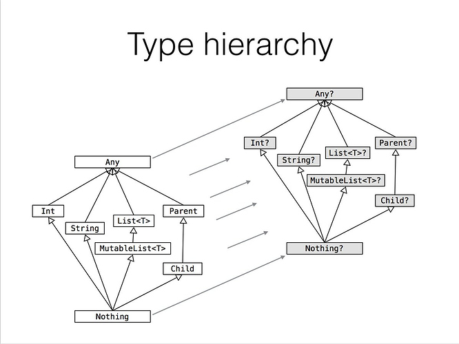
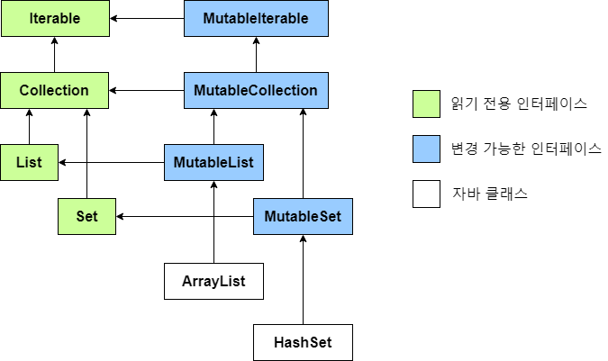
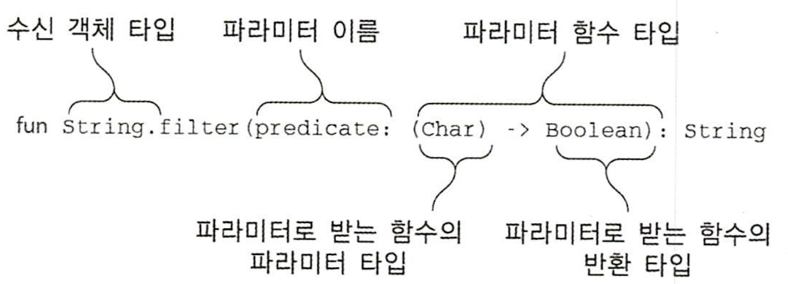
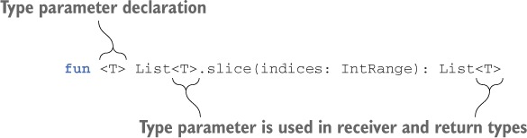
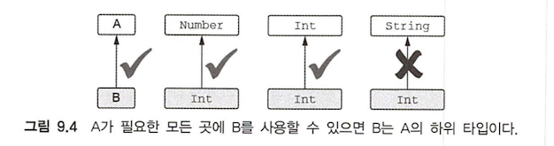
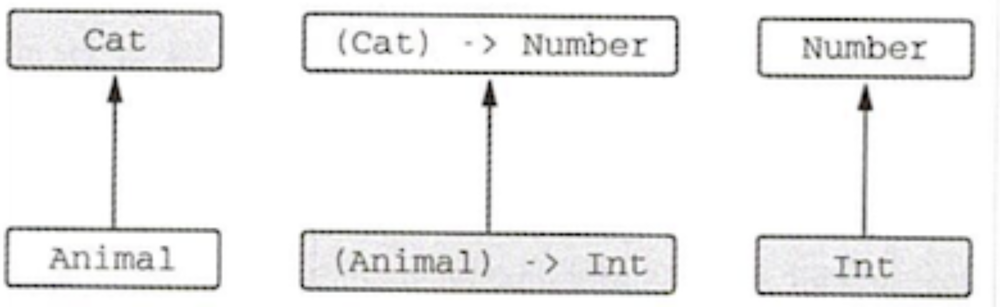
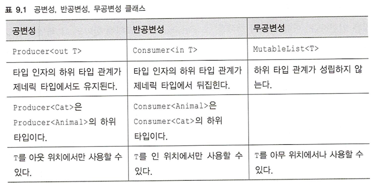

# 목차

[toc]

- [1장. 코틀린이란 무엇이며, 왜 필요한가?](#1장-코틀린이란-무엇이며-왜-필요한가)
  - [코틀린의 주요 특성](#코틀린의-주요-특성)
    - [정적 타입 지정 언어](#정적-타입-지정-언어)
    - [함수형 프로그래밍과 객체지향 프로그래밍](#함수형-프로그래밍과-객체지향-프로그래밍)
  - [코틀린의 철학](#코틀린의-철학)
    - [실용성](#실용성)
    - [간결성](#간결성)
    - [안전성](#안전성)
    - [상호운용성](#상호운용성)
  - [코틀린 도구 사용](#코틀린-도구-사용)
    - [코틀린 코드 컴파일](#코틀린-코드-컴파일)
- [2장. 코틀린 기초](#2장-코틀린-기초)
  - [기본 요소: 함수와 변수](#기본-요소-함수와-변수)
    - [Hello, World!](#hello-world)
    - [함수](#함수)
    - [변수](#변수)
    - [더 쉽게 문자열 형식 지정: 문자열 템플릿](#더-쉽게-문자열-형식-지정-문자열-템플릿)
  - [클래스와 프로퍼티](#클래스와-프로퍼티)
    - [프로퍼티](#프로퍼티)
    - [커스텀 접근자](#커스텀-접근자)
    - [코틀린 소스코드 구조: 디렉터리와 패키지](#코틀린-소스코드-구조-디렉터리와-패키지)
  - [선택의 표현과 처리: enum과 when](#선택의-표현과-처리-enum과-when)
    - [enum 클래스 정의](#enum-클래스-정의)
    - [when으로 enum 클래스 다루기](#when으로-enum-클래스-다루기)
    - [when과 임의의 객체를 함께 사용](#when과-임의의-객체를-함께-사용)
    - [인자 없는 when 사용](#인자-없는-when-사용)
    - [스마트 캐스트: 타입 검사와 타입 캐스트를 조합](#스마트-캐스트-타입-검사와-타입-캐스트를-조합)
    - [리팩토링: if를 when으로 변경](#리팩토링-if를-when으로-변경)
    - [if와 when의 분기에서 블록 사용](#if와-when의-분기에서-블록-사용)
  - [대상을 이터레이션: while과 for 루프](#대상을-이터레이션-while과-for-루프)
    - [while 루프](#while-루프)
    - [숫자에 대한 이터레이션: 범위와 수열](#숫자에-대한-이터레이션-범위와-수열)
    - [맵에 대한 이터레이션](#맵에-대한-이터레이션)
    - [in으로 컬렉션이나 범위의 원소 검사](#in으로-컬렉션이나-범위의-원소-검사)
  - [코틀린의 예외 처리](#코틀린의-예외-처리)
- [3장. 함수 정의와 호출](#3장-함수-정의와-호출)
  - [코틀린에서 컬렉션 만들기](#코틀린에서-컬렉션-만들기)
  - [함수를 호출하기 쉽게 만들기](#함수를-호출하기-쉽게-만들기)
    - [이름 붙인 인자](#이름-붙인-인자)
    - [디폴트 파라미터 값](#디폴트-파라미터-값)
    - [정적인 유틸리티 클래스 없애기: 최상위 함수와 프로퍼티](#정적인-유틸리티-클래스-없애기-최상위-함수와-프로퍼티)
  - [메소드를 다른 클래스에 추가: 확장 함수와 확장 프로퍼티](#메소드를-다른-클래스에-추가-확장-함수와-확장-프로퍼티)
    - [임포트와 확장 함수](#임포트와-확장-함수)
    - [자바에서 확장 함수 호출](#자바에서-확장-함수-호출)
    - [확장 함수로 유틸리티 함수 정의](#확장-함수로-유틸리티-함수-정의)
    - [확장 함수는 오버라이드 할 수 없다](#확장-함수는-오버라이드-할-수-없다)
    - [확장 프로퍼티](#확장-프로퍼티)
  - [컬렉션 처리: 가변 길이 인자, 중위 함수 호출, 라이브러리 지원](#컬렉션-처리-가변-길이-인자-중위-함수-호출-라이브러리-지원)
    - [자바 컬렉션 API 확장](#자바-컬렉션-api-확장)
    - [가변인자 함수: 인자의 개수가 달라질 수 있는 함수 정의](#가변인자-함수-인자의-개수가-달라질-수-있는-함수-정의)
    - [값의 쌍 다루기: 중위 호출과 구조 분해 선언](#값의-쌍-다루기-중위-호출과-구조-분해-선언)
  - [문자열과 정규식 다루기](#문자열과-정규식-다루기)
    - [문자열 나누기](#문자열-나누기)
  - [코드 다듬기: 로컬 함수와 확장](#코드-다듬기-로컬-함수와-확장)
  - [요약](#요약)
- [4장. 클래스, 객체, 인터페이스](#4장-클래스-객체-인터페이스)
  - [클래스 계층 정의](#클래스-계층-정의)
    - [코틀린 인터페이스](#코틀린-인터페이스)
    - [open, final, abstract 변경자: 기본적으로 final](#open-final-abstract-변경자-기본적으로-final)
    - [가시성 변경자: 기본적으로 공개](#가시성-변경자-기본적으로-공개)
    - [내부 클래스와 중첩된 클래스: 기본적으로 중첩 클래스](#내부-클래스와-중첩된-클래스-기본적으로-중첩-클래스)
    - [봉인된 클래스: 클래스 계층 정의 시 계층 확장 제한](#봉인된-클래스-클래스-계층-정의-시-계층-확장-제한)
  - [뻔하지 않은 생성자와 프로퍼티를 갖는 클래스 선언](#뻔하지-않은-생성자와-프로퍼티를-갖는-클래스-선언)
    - [클래스 초기화: 주 생성자와 초기화 블록](#클래스-초기화-주-생성자와-초기화-블록)
    - [부 생성자: 상위 클래스를 다른 방식으로 초기화](#부-생성자-상위-클래스를-다른-방식으로-초기화)
    - [인터페이스에 선언된 프로퍼티 구현](#인터페이스에-선언된-프로퍼티-구현)
    - [게터와 세터에서 뒷받침하는 필드에 접근](#게터와-세터에서-뒷받침하는-필드에-접근)
    - [접근자의 가시성 변경](#접근자의-가시성-변경)
  - [컴파일러가 생성한 메소드: 데이터 클래스와 클래스 위임](#컴파일러가-생성한-메소드-데이터-클래스와-클래스-위임)
    - [모든 클래스가 정의해야 하는 메소드](#모든-클래스가-정의해야-하는-메소드)
    - [데이터 클래스: 모든 클래스가 정의해야 하는 메소드 자동 생성](#데이터-클래스-모든-클래스가-정의해야-하는-메소드-자동-생성)
    - [클래스 위임: by 키워드 사용](#클래스-위임-by-키워드-사용)
  - [object 키워드: 클래스 선언과 인스턴스 생성](#object-키워드-클래스-선언과-인스턴스-생성)
    - [객체 선언: 싱글턴을 쉽게 만들기](#객체-선언-싱글턴을-쉽게-만들기)
    - [동반 객체: 팩터리 메소드와 정적 멤버가 들어갈 장소](#동반-객체-팩터리-메소드와-정적-멤버가-들어갈-장소)
    - [동반 객체를 일반 객체처럼 사용](#동반-객체를-일반-객체처럼-사용)
    - [객체 식: 익명 내부 클래스를 다른 방식으로 작성](#객체-식-익명-내부-클래스를-다른-방식으로-작성)
  - [요약](#요약)
- [5장. 람다로 프로그래밍](#5장-람다로-프로그래밍)
  - [람다 식과 멤버 참조](#람다-식과-멤버-참조)
    - [람다 소개: 코드 블록을 함수 인자로 넘기기](#람다-소개-코드-블록을-함수-인자로-넘기기)
    - [람다와 컬렉션](#람다와-컬렉션)
    - [람다 식의 문법](#람다-식의-문법)
    - [현재 영역에 있는 변수에 접근](#현재-영역에-있는-변수에-접근)
  - [지연 계산 lazy 컬렉션 연산](#지연-계산-lazy-컬렉션-연산)
    - [시퀀스 연산 실행: 중간 연산과 최종 연산](#시퀀스-연산-실행-중간-연산과-최종-연산)
    - [시퀀스 만들기](#시퀀스-만들기)
  - [수신 객체 지정 람다: with와 apply](#수신-객체-지정-람다-with와-apply)
    - [with함수](#with함수)
    - [apply함수](#apply함수)
- [6장. 코틀린 타입 시스템](#6장-코틀린-타입-시스템)
  - [널 가능성](#널-가능성)
    - [널이 될 수 있는 타입](#널이-될-수-있는-타입)
    - [타입의 의미](#타입의-의미)
    - [안전한 호출 연산자: "?."](#안전한-호출-연산자-)
    - [엘비스 연산자 "?:"](#엘비스-연산자-)
    - [안전한 캐스트: as?](#안전한-캐스트-as)
    - [널 아님 단언: !!](#널-아님-단언-)
    - [let함수](#let함수)
    - [나중에 초기화할 프로퍼티](#나중에-초기화할-프로퍼티)
    - [널이 될 수 있는 타입 확장](#널이-될-수-있는-타입-확장)
    - [타입 파라미터의 널 가능성](#타입-파라미터의-널-가능성)
    - [널 가능성과 자바](#널-가능성과-자바)
  - [코틀린의 기본 타입](#코틀린의-기본-타입)
    - [기본 타입: Int, Boolean 등](#기본-타입-int-boolean-등)
    - [널이 될 수 있는 기본 타입: Int?, Boolean? 등](#널이-될-수-있는-기본-타입-int-boolean-등)
    - [숫자 변환](#숫자-변환)
    - [Any, Any?: 최상위 타입](#any-any-최상위-타입)
    - [Unit 타입: 코틀린의 void](#unit-타입-코틀린의-void)
    - [Nothing 타입: “이 함수는 결코 정상적으로 끝나지 않는다.”](#nothing-타입-이-함수는-결코-정상적으로-끝나지-않는다)
  - [컬렉션과 배열](#컬렉션과-배열)
    - [널 가능성과 컬렉션](#널-가능성과-컬렉션)
    - [읽기 전용과 변경 가능한 컬렉션](#읽기-전용과-변경-가능한-컬렉션)
    - [코틀린 컬렉션과 자바](#코틀린-컬렉션과-자바)
    - [컬렉션을 플랫폼 타입으로 다루기](#컬렉션을-플랫폼-타입으로-다루기)
    - [객체의 배열과 기본 타입의 배열](#객체의-배열과-기본-타입의-배열)
- [7장. 연산자 오버로딩과 기타 관례](#7장-연산자-오버로딩과-기타-관례)
  - [산술 연산자 오버로드](#산술-연산자-오버로드)
    - [이항 산술 연산 오버로딩](#이항-산술-연산-오버로딩)
    - [복합 대입 연산자 오버로딩](#복합-대입-연산자-오버로딩)
    - [단항 연산자 오버로딩](#단항-연산자-오버로딩)
  - [비교 연산자 오버로딩](#비교-연산자-오버로딩)
    - [동등성 연산자: "equals"](#동등성-연산자-equals)
    - [순서 연산자: compareTo](#순서-연산자-compareto)
  - [컬렉션과 범위에 대해 쓸 수 있는 관례](#컬렉션과-범위에-대해-쓸-수-있는-관례)
    - [인덱스로 원소에 접근: get과 set](#인덱스로-원소에-접근-get과-set)
    - [in관례](#in관례)
    - [rangeTo관례](#rangeto관례)
    - [for 루프를 위한 iterator 관례](#for-루프를-위한-iterator-관례)
  - [구조 분해 선언과 component 함수](#구조-분해-선언과-component-함수)
    - [구조 분해 선언과 루프](#구조-분해-선언과-루프)
  - [프로퍼티 접근자 로직 재활용: 위임 프로퍼티](#프로퍼티-접근자-로직-재활용-위임-프로퍼티)
    - [위임 프로퍼티 소개](#위임-프로퍼티-소개)
    - [위임 프로퍼티 사용: by lazy()를 사용한 프로퍼티 초기화 지연](#위임-프로퍼티-사용-by-lazy를-사용한-프로퍼티-초기화-지연)
    - [위임 프로퍼티 구현](#위임-프로퍼티-구현)
    - [위임 프로퍼티 컴파일 규칙](#위임-프로퍼티-컴파일-규칙)
    - [프로퍼티 값을 맵에 저장](#프로퍼티-값을-맵에-저장)
    - [프레임워크에서 위임 프로퍼티 활용](#프레임워크에서-위임-프로퍼티-활용)
  - [요약](#요약)
- [8장. 고차 함수: 파라미터와 반환 값으로 람다 사용](#8장-고차-함수-파라미터와-반환-값으로-람다-사용)
  - [고차 함수 정의](#고차-함수-정의)
    - [함수 타입](#함수-타입)
    - [인자로 받은 함수 호출](#인자로-받은-함수-호출)
  - [인라인 함수: 람다의 부가 비용 없애기](#인라인-함수-람다의-부가-비용-없애기)
    - [인라이닝이 작동하는 방식](#인라이닝이-작동하는-방식)
    - [인라인 함수의 한계](#인라인-함수의-한계)
    - [컬렉션 연산 인라이닝](#컬렉션-연산-인라이닝)
    - [함수를 인라인으로 선언해야 하는 경우](#함수를-인라인으로-선언해야-하는-경우)
    - [자원 관리를 위해 인라인된 람다 사용](#자원-관리를-위해-인라인된-람다-사용)
  - [고차 함수 안에서 흐름 제어](#고차-함수-안에서-흐름-제어)
    - [람다 안의 return문: 람다를 둘러싼 함수로부터 반환](#람다-안의-return문-람다를-둘러싼-함수로부터-반환)
    - [람다로부터 반환: 레이블을 사용한 return](#람다로부터-반환-레이블을-사용한-return)
    - [무명 함수: 기본적으로 로컬 return](#무명-함수-기본적으로-로컬-return)
  - [요약](#요약)
- [9장. 제네릭스](#9장-제네릭스)
  - [제네릭 타입 파라미터](#제네릭-타입-파라미터)
    - [제네릭 함수와 프로퍼티](#제네릭-함수와-프로퍼티)
    - [제네릭 클래스 선언](#제네릭-클래스-선언)
    - [타입 파라미터 제약](#타입-파라미터-제약)
    - [타입 파라미터를 널이 될 수 없는 타입으로 한정](#타입-파라미터를-널이-될-수-없는-타입으로-한정)
  - [실행 시 제네릭스의 동작: 소거된 타입 파라미터와 실체화된 타입 파라미터](#실행-시-제네릭스의-동작-소거된-타입-파라미터와-실체화된-타입-파라미터)
    - [실행 시점의 제네릭: 타입 검사와 캐스트](#실행-시점의-제네릭-타입-검사와-캐스트)
    - [실체화한 타입 파라미터를 사용한 함수 선언](#실체화한-타입-파라미터를-사용한-함수-선언)
    - [실체화한 타입 파라미터로 클래스 참조 대신](#실체화한-타입-파라미터로-클래스-참조-대신)
    - [실체화한 타입 파라미터의 제약](#실체화한-타입-파라미터의-제약)
  - [변성: 제네릭과 하위 타입](#변성-제네릭과-하위-타입)
    - [변성이 있는 이유: 인자를 함수에 넘기기](#변성이-있는-이유-인자를-함수에-넘기기)
    - [클래스, 타입, 하위 타입](#클래스-타입-하위-타입)
    - [공변성: 하위 타입 관계를 유지](#공변성-하위-타입-관계를-유지)
    - [반공변성: 뒤집힌 하위 타입 관계](#반공변성-뒤집힌-하위-타입-관계)
    - [사용 지점 변성: 타입이 언급되는 지점에서 변성 지정](#사용-지점-변성-타입이-언급되는-지점에서-변성-지정)
    - [스타 프로젝션: 타입 인자 대신 * 사용](#스타-프로젝션-타입-인자-대신--사용)
  - [요약](#요약)
- [10장. 애노테이션과 리플렉션](#10장-애노테이션과-리플렉션)
  - [애노테이션 선언과 적용](#애노테이션-선언과-적용)
    - [애노테이션 대상](#애노테이션-대상)
  - [리플렉션: 실행 시점에 코틀린 객체 내부 관찰](#리플렉션-실행-시점에-코틀린-객체-내부-관찰)
    - [코틀린 리플렉션 API: KClass, KCallable, KFunction, KProperty](#코틀린-리플렉션-api-kclass-kcallable-kfunction-kproperty)

# 1장. 코틀린이란 무엇이며, 왜 필요한가?

코틀린은 간결하고 실용적이며, 자바 코드와의 상호운용성을 중시한다.  코틀린은 주목적은 현재 자바가 사용되고 있는 모든 용도에 적합하면서도 더 간결하고 생상적이며 안전한 대체 언어를 제공하는 것이다.

## 코틀린의 주요 특성

### 대상 플랫폼: 서버, 안드로이드 등 자바가 실행되는 모든 곳

### 정적 타입 지정 언어

자바와 마찬가지로 코틀린도 정적 타입 지정 언어다.

정적 타입 지정이 타입을 컴파일 시점에서 알 수 있고 프로그램 안에서 `객체 필드나 메서드를 사용할 때마다 컴파일러가 타입을 검증`해준다.

동적 타입 지정 언어에서는 타입과 관계 없이 모든 값을 변수에 넣을 수 있고, 메서드나 필드 접근에 대한 검증이 실행 시점에 일어나며, 그에 따라 코드가 더 짧아지고 데이터 구조를 더 유연하게 생성하고 사용할 수 있다. 하지만 컴파일 시 걸러내지 못하고 런타임에 오류가 발생한다.

코틀린은 `컴파일러가 문맥으로 부터 변수 타입을 자동으로 유추`할 수 있기 때문에 모든 변수의 타입을 프로그래머가 직접 명시할 필요가 없다. 

정적 타입의 지정의 장점은 다음과 같다.

- 성능 - 실행 시점에 어떤 메서드를 호출할지 알아내는 과정이 필요 없음으로 메소드 호출이 더 빠르다.
- 신뢰성 - 컴파일러가 프로그램 정확성을 검증하기 때문에 실행 시 프로그램 오류로 중단될 가능성이 더 적어진다.
- 유지보수 - 코드에서 다르는 객체가 어떤 타입에 속하는지 알수 있기 때문에 처음 보는 코드를 다룰 때도 더 쉽다.
- 도구 지원 - 정적 타입 지정을 활용하면 더 안전하게 리팩토링 할 수 있고, 도구는 더 정확한 코드 완성 기능을 제공할 수 있으며, IDE의 다른 지원 기능도 더 잘 만들수 있다.

### 함수형 프로그래밍과 객체지향 프로그래밍

함수형 프로그래밍의 핵심 개념

- 일급 시민(first-class) 함수 : 함수를 일반 값처럼 다룰 수 있다.
  - 함수를 변수에 저장하고 함수를 인자로 다른 함수에 전달할 수 있고 함수에서 새로운 함수를 만들어서 반환 할 수있다
- 불변성(immutability) : 함수형 프로그래밍에서는 불변 객체를 사용해 프로그램을 작성한다.
- 부수 효과(side effect) 가 없다.
  - 입력이 같으면 항상 같은 출력을 하고 다른 객체의 상태를 변경하지 않는다.
  - 함수 외부나 다른 바깥 환경과 상호작용하지 않는 순수 함수를 사용한다

함수형 스타일의 장점

1. 간결성
   - 함수를 값처럼 활용 → 더 강력한 추상화 → 코드 중복 막을 수 있음
   - ex) 공통부분을 따로 함수로 뽑아내고 서로 다른 사항을 인자에 함수로 전달.

```kotlin
fun findAlice() = findPerson { it.name == "Alice" }
fun findBob() = findPerson { it.name == "Bob" }
```

2. 다중 스레드를 사용해도 안전하다 
   - 불변 데이터 구조를 사용하고 순수 함수를 그 데이터 구조에 적용한다면 다중 스레드 환경에서 같은 데이터를 여러 스레드가 변경할 수 없다. (따라서 복잡한 동기화를 적용하지 않아도 된다)
3. 함수형 프로그램은 테스트하기 쉽다.
   - 순수함수는 준비 코드(setup code) 없이 독립적으로 테스트할 수 있다.

## 코틀린의 철학

### 실용성

코틀린은 연구를 위한 언어가 아니다. 다른 프로그래밍 언어가 채택한 이미 성공적으로 검증된 해법과 기능들을 구현하여

복잡도가 낮다. 

### 간결성

코틀린은 코드에서 의미 없는 부분을 줄이기 위해 많은 노력을 기울였다.

게터 세터 생성자 파라미터 필드 초기화 로직 등, 자바에 존재하는 여러 번거로운 코드를 묵시적으로 제공하기 대문에 지저분하지 않다. 

코드가 간결하면 읽고 쓰는데 시간이 덜 걸려 생산성을 향상시킨다. 

### 안전성

코틀린은 JVM에서 실행한다는 사실은 메모리, 버퍼 오버플로 방지 메모리 해제 등 안전성을 보장할 수 있다.. 

코틀린은 타입 시스템은 null이 될수 없는 값을 추적하며, 실행 시점에 NullPointerException이 발생할 수 있는 연산을 사용하는 코드를 금지한다.

```kotlin
var s2: String? = null // null이 될 수 있음
var s2: String = "" // null이 될 수 없음
```

또한 ClassCaseException을 방지하게 도와준다.

```kotlin
if (value is String) {
	print(value.toUpperCase())
}
```

### 상호운용성

자바 코드에서 코틀린 코드를 호출할 때도 아무런 노력이 필요 없다.

기존 자바 라이브러리를 가능하면 최대한 활용하며 자체 컬렉션 라이브러리를 제공하지 않고, 자바 표준 라이브러리 클래스에 의존한다.

## 코틀린 도구 사용

### 코틀린 코드 컴파일과정

1. **코틀린 소스코드**: 프로젝트에 작성된 `.kt` 파일들입니다.
2. **코틀린 컴파일러**: 코틀린 소스코드를 바이트코드로 변환하는 도구입니다.
3. **JVM 바이트코드**: 컴파일러에 의해 생성된 `.class` 파일들입니다. 이 바이트코드는 JVM(Java Virtual Machine)에서 실행될 수 있습니다.
4. **JVM**: 바이트코드를 실행하는 가상 머신입니다.


코틀린 컴파일러로 컴파일한 코틀은 코틀린 런타임 라이브러리에 의존하므로 배포시 런타임 라이브러리도 함께 배포해야 한다

* 런타임 라이브러리에는 코틀린 자체 표준 라이브러리 클래스와 자바 API를 확장한 내용들이 있다.


# 2장. 코틀린 기초

## 기본 요소: 함수와 변수

### 함수

```kotlin
// 함수이름(파라미터): 리턴타입
fun max(a: Int, b: Int): Int {
    return if (a > b) a else b
}
```

- 함수의 선언은 fun 키워드로 시작
- 함수 이름 뒤에는 괄호 안에 파라미터 목록
- 함수의 반환 타입은 파라미터 목록의 닫는 괄호 다음에 위치, 단 괄호와 반환 타입 사이를 콜론으로 구분
  - 없는 경우 생략


**코틀린이 반환 타입을 생략할 수 있는 이유는 타입 컴파일러의 추론 때문이다.** 

식이 본문인 함수의 반환 타입만 생략 가능하다. 식의 결과 타입이 있을 수 있기 때문이다.

```kotlin
fun max(a: Int, b: Int) = if (a > b) a else b
```

### 문(statement)과 식(expression)의 구분

코틀린에서 if는 expression이지 statement가 아니다.

expression은 값을 만들어 내며, 다른 식의 하위 요소로 계산에 참여할 수 있는 반면

statement은 자신을 둘러싸고 있는 가장 안쪽 블록의 최상위 요소로 존재하며 아무런 값을 만들어 내지 않는다.

자바에서는 모든 제어구조가 statement이며 코틀린은 대부분 제어구조가 expression이다. 

### 변수

```kotlin
val answer = 42 // 타입을 명시 하지 않아도 됨
val answer: Int = 42 // 타입명시 
val yeaerToCompute = 7.5e6
```

cㅗ기화 식을 사용하지 않고 변수를 선언하려면 타입을 명시해야 한다

```kotlin
val answer: Int
asnwer = 42
```


타입을 지정하지 않으면 컴파일러가 초기화 식을 분석해서 초기화 식의 타입 변수 타입으로 지정한다.

```kotlin
var result = 10; // 변경 가능한 참조를 저장
val result = 10; // 변경 불가능한 참조를 저장

val str = "String"
str.add("string") // 값변경 가능
```

* val : value, 값 변경 불가능. final
* var : variable, 변수, 변경 가능함

`val` 참조는 자체는 불면일지라도 그 참조가 가리키는 객체의 내부 값은 변경될 수 있다.

어떤 블록이 실행될때 오직 1개만의 초기화가 실행된다면 조건에 따라 여러 값으로 초기화 가능

```kotlin
val message: String

if (a1()) {
  message = ""
}

else {
  message = "?"
}
```

### 더 쉽게 문자열 형식 지정: 문자열 템플릿

```kotlin
fun main(args: Array<String>) {
    val name = if (agrs.SIZE > 0) args[0] else "kotlin"
    println("Hello, $name!")
}
```

인자가 없는 경우, 있는 경우에 따라 간단한 문자열 템플릿 만들수 있다.

컴파일 시점에 정적으로 식을 검사하기 때문에 컴파일 타임 에러 잡기가 가능하다. 

## 클래스와 프로퍼티


### 프로퍼티

**클래스라는 개념의 목적은 데이터를 캡슐화하고 캡슐화한 데이터를 다루는 코드를 한 주체 아래에 가두는 것이다.** 

자바에서는 필드와 접근자를 한데 묶어 프로퍼티라고 부른다.

* 자바의 멤버 필드의 가시성은 보통 private 으로 선언하고 접근하기 위한 방법으로 접근자 메서드(accessor method)를 제공

코틀린의 프로퍼티는 자바와 같은 개념이며 기본 기능으로 제공한다.

또한 게터를 호출하는 대신 프로퍼티에 직접 접근한다. 메서드()를 사용하지 않는다  

```kotlin
class Person(
  val name: String,  // 읽기전용 프로퍼티. private field와 public getter 제공
  var isMarried: Boolean // 수정 가능 프로퍼티, private field와 public getter,setter 제공 
)

fun main() {
    val myPerson = Person("name", true)
    myPerson.name // myPerson.getName()
    myPerson.isMarried // myPerson.getIsMarried()
    myPerson.isMarried = false // myPerson.setIsMarried(false)

} 
```

### 커스텀 접근자

프로퍼티에는 프로퍼티 값을 저장하기 위한 필드가 있는데 이를 프로퍼티 backing filed(뒷받침)라고 한다.

```kotlin
class Rectangle(
  val height: Int, 
  val width: Int
) {
    val isSquare: Boolean
        get() { // 프로퍼티 getter 재정의
            return hieght = width
        }
}
```


## 선택의 표현과 처리: enum과 when

### enum 클래스 정의

```kotlin
 enum class Color(
    val r: Int, val g: Int, val b: Int
) {
    RED(255, 0, 0),
    ORANGE(255, 165, 0),
    YELLOW(255, 255, 0),
    GREEN(0, 255, 0),
    BLUE(0, 0, 255);  // 세미콜론 필수

    fun rgb() = (r * 256 * g) * 256 + b
}
```

- 코틀린에서 enum은 soft keyword. 즉 enum이란 키워드를 변수로도 사용 가능.
- class 앞에서는 enum 클래스를 의미하며  enum class가 없다면 키워드가 아니다
- enum에서도 일반적인 클래스와 마찬가지로 생성자와 프로퍼티를 선언
- `코틀린에서 유일하게 ; 이 필요한 곳이 enum이다.`


### when으로 enum 클래스 다루기

```kotlin
fun getMnemonic(color: Color) = 
    when (color) {
        Color.RED -> "Richard"
        Color.ORANGE -> "Of"
        Color.YELLOW -> "York"
        Color.GREEN -> "Gave"
        Color.BLUE -> "Battle"
        Color.INDIGO -> "In"
        Color.VIOLET -> "Vain"
    }
```

if와 마찬가지로 when도 식이며 함수의 반환 값으로 when 식을 직접 사용 가능하다. 

자바와 달리  break를 쓰지 않아도 된다.

한 분기 안에서 여러 값을 콤마로 분리 하여 사용 가능

```kotlin
fun getWarmth(color: Color) = when (color) {
    Color.RED, Color.ORANGE, Color.YELLOW -> "Warm"
    Color.GREEN -> "neutral"
    else -> "cold"
}
```

### when과 임의의 객체를 함께 사용

코틀린에서 when은 자바의 switch보다 훨씬 더 강력하다. 분기 조건에 상수(enum 상수나 숫자 리터럴)만을 사용할 수있는 자바 switch와 달리 코틀린 when의 분기 조건은 임의의 객체를 허용 한다.

```kotlin
fun mix(c1: Color, c2: Color) =
    when (setOf(c1, c2)) {
        setOf(Color.RED, Color.YELLOW) -> Color.ORANGE
        setOf(Color.YELLOW, Color.BLUE) -> Color.GREEN
        else -> throw IllegalArgumentException("argument is invalid")
    }
```


c1, c2가 RED, YELLOW라면 그 둘을 혼합한 결과는 ORANGE다. 이를 구현해서 집합 비교를 사용한다.

when의 분기 조건 부분에 `식을` 넣을 수 있기 때문에 많은 경우 코드를 더 간결하고 아름답게 작성 할 수 있다.

### 인자 없는 when 사용

set 인스턴스를 생성하는 불필요한 비용을 줄이기 위해서 인자가 없는 when 식을 사용할 수 있다.

```kotlin
fun mix(c1: Color, c2: Color) =
    when {
        (c1 == RED && c2 == YELLOW) -> ORANGE
        (c1 == BLUE && c2 == YELLOW) -> GREEN
        else -> throw Exception("dirty color")
    }
```

### 스마트 캐스트: 타입 검사와 타입 캐스트를 조합

Expr 인터페이스에는 두 가지 구현 클래스가 존재한다

- 식을 평가하려면 두 가지 경우를 고려해야 한다.
- 어떤 식이 수라면 그 값을 반환한다
- 어떤 식의 합계라면 좌항과 우항의 값을 계산 한 뒤 그 두 값을 합한 값을 반환한다.

```kotlin
interface Expr

classNum(val value: Int) : Expr
class Sum(val left: Expr, val right : Expr) : Expr

fun eval(e: Expr): Int =
    when (e) {
        is Num -> e.value
        is Sum -> eval(e.right) + eval(e.left)
        else -> throw IllegalArgumentException("unknown")
    }
```


**어떤 변수나 원하는 타입인자를 일단 is로 검사하고 나면 굳이 변수를 원하는 타입으로 캐스팅 하지 않아도 마치 처음부터 그 변수가 원하는 타입으로 선언된 것처럼 사용할 수 있다.** 

코틀린의 is는 자바의 instanceof와 비슷하다. 하지만 실제로는 자바와 달리  컴파일러가 캐스팅을 수행해준다. 이를 **스마트 캐스트**라고 한다.

### 리팩토링: if를 when으로 변경

코틀린에서는 if가 값을 만들어 내기 때문에 자바와 달리 3항 연산자가 따로 없다 

### if와 when의 분기에서 블록 사용

```kotlin
fun eval(e: Expr): Int =
    when(e) {
        is Num -> { // 블록으로 사용할 수도 있다.
            println("hello $e.value")
            e.value
        }
        is Sum -> evalu(e.right) + eval(e.left)
        else -> throw IllegalArgumentException("Unknown expression")
    }
```


## 대상을 이터레이션: while과 for 루프

### while 루프

자바와 while은 같다.

for은 for-each만 존재한다. 

### 숫자에 대한 이터레이션: 범위와 수열

루프의 가장 흔한 용례인 초깃값, 증가 값, 최종 값을 사용한 루프를 대신하기 위해 코틀린에서는 범위를 사용한다. 

범위는 기본적으로 두 값으로 이뤄진 구간이다. 

보통 그 두 값을 정수 등의 숫자 타입이며, `..` 연산자로 시작 값과 끝 값을 연결해서 범위를 만든다.

```kotlin
fun fizzBuzz(i: Int) = when {
    i % 15 == 0 -> "FizzBuzz"
    i % 3 == 0 -> "Fizz"
    i % 5 == 0 -> "Buzz"
    else -> "$i"
}

fun main(args: Array<String>) {

    val oneToTen = 1..10

    println(oneToTen)

    for (i in 1..100){
        println(fizzBuzz(i))
    }

    for (i in 100 downTo 1 step 2) { // 증가값 step을 갖는 수열에 대해 이터레이션 
        println(fizzBuzz())
    }
}
```

* downTo 1은 역방향. 즉 감소에 대해 이터레이션 한다 
* 스텝은 증가, 감소 값이다. 

### 맵에 대한 이터레이션

```kotlin
val binaryReps = TreeMap<Char, String>()

for (c in 'A'..'F') { // A ~ F까지 이터레이션
    val binary = Integer.toBinaryString(c.toInt()) // 아스키 코드를 2진표현으로 
    binaryReps[c] = binary // c를 키로 c의 2진 표현을 맵에 put
}

for ((letter, binary) in binaryReps) { // 맵에 대한 이터레이션, 맵의 키와 값을 두 변수에 각각 대입한다.
    println("$letter = $binary")
}
```

키를 사용해 맵의 값을 가져오거나 키에 해당 하는 값을 넣는 작업인 get(), put()을 사용 하는 대신에

 `map[key]` `[key] = value` 을 사용한다

`구조 분해 할당`

### in으로 컬렉션이나 범위의 원소 검사

```kotlin
fun isLetter(c: Char) = c in 'a'..'z' || c in 'A'..'Z'

fun isNotDigit(c: Char) = c !in '0'..'9'
```

in 연산자를 사용해 어떤 값이 범위에 속하는지 검사할 수 있다. 반대로 !in을 사용하면 어떤 값이 범위에 속하지 않는지 검사 할 수 있다.

```kotlin
fun reconize(c: Char) = when (c) {
    in '0'..'9' -> "number" // c 값이 0~ 9 사이 속해있는지 검사
    in 'a'..'z', in 'A'..'Z' -> "string" // 여러 범위 조건 지정 가능
    else -> "what ? "
}
```

컬렉션도 가능

```kotlin
println("kotlin" in setOf("java", "Scala"))
```

## 코틀린의 예외 처리

기본적인 사용방법은 자바와 크게 다를 건 없다.

`코틀린은Checked 예외를 반드시 처리할 필요없다` . 자바에서는 반드시 처리하거나 method throws 표시

* 자바에서의 불편함인 `try catch` 으로 감싸고 다음 로직을 이어가는 코드를 작성하는 경우를 없앴다.

- try, throw 같은 키워드가 식(Expression)으로 취급되어서 다른 식에 포함이 가능하다

```kotlin
fun readNumber(reader: BufferedReader): Int?{
    try {
        val line = reader.readLine()
        return Integer.parseInt(line)
    } catch (e: NumberFormatException){
        return null
    } finally {
        reader.close()
    }
}
```

# 3장. 함수 정의와 호출

- 컬렉션, 문자열, 정규식을 다루기 위한 함수
- 이름 붙인 인자, 디폴트 파라미터 값, 중위 호출 문법 사용
- 확장 함수와 확장 프로퍼티를 사용해 자바 라이브러리 적용
- 최상위 및 로컬 함수와 프로퍼티를 사용해 코드 구조화

## 코틀린에서 컬렉션 만들기

```kotlin
val hashSetOf = hashSetOf(1, 7, 53 // 해시셋
println(hashSetOf) // [1, 53, 7]

val arrayListOf = arrayListOf(1, 7, 53) // 어레이리스트
println(arrayListOf) // [1, 7, 53]

val hashMapOf = hashMapOf(1 to "one", 7 to "seven", 53 to "fifty-three") // 해시맵
println(hashMapOf) // {1=one, 53=fifty-three, 7=seven}

// 어떤 클래스에 속하는지 검사
println(hashSetOf.javaClass) // class java.util.HashSet
println(arrayListOf.javaClass) // class java.util.ArrayList
println(hashMapOf.javaClass) // class java.util.HashMap
```

* `javaClass`는 자바의 `getClass()`에 해당하는 코틀린 코드다. 이 코드는 코틀린이 자신만의 컬렉션 기능을 제공하지 않는 다는 뜻이다.

코틀린이 자체 컬렉션을 제공하지 않는 이유는 표준 자바 컬렉션을 활용하면 자바 코드와 상호작용하기가 훨씬 쉽기 때문이다 

자바에서 코틀린 함수를 호출하거나 코틀린에서 자바 함수를 호출할 때 자바와 코틀린 컬렉션을 서로 변환할 필요가 없다.

 **코틀린 컬렉션은 자바 컬렉션과 똑같은 클래스다.** 하지만 코틀린에서는 자바보다 더 많은 기능을 쓸 수 있다.

## 함수를 호출하기 쉽게 만들기

```kotlin
fun main(args: Array<String>) {
    val list = listOf(1, 2, 3)
    println(list) // [1, 2, 3]
}
```

위와 같은 toString() 결과를 바꾸고 싶을 때, joinToString 확장 함수를 새로 만든다.

```kotlin
fun <T> joinToString(
    collection: Collection<T>,
    separator: String,
    prefix: String,
    postfix: String
): String {
    val result = StringBuilder(prefix)
                                        
    for ((index, element) in collection.withIndex()) {
        if (index > 0) result.append(separator)
        result.append(element)
    }

    result.append(postfix)
    return result.toString()
}

val list = listOf(1, 7, 53)
println(joinToString(list, "; " ,"(",")")) // (1; 7; 53)
println(joinToString(list, separator = "; ", prefix = "(", postfix = ")")) // // (1; 7; 53)
```

### 디폴트 파라미터 값

함수의 디폴트 파라미터 값은 함수를 호출하는 쪽이 아니라 함수 선언 쪽에서 지정된다. 

`그래서 디폴트 값을 변경하면 이미 작성된 코드중에 값을 지정하지 않은 모든 인자는 자동으로 바뀐 디폴트 값으로 적용 받는다.`

* 주의 해야 한다. 

> 자바에서는 디폴트 파라미터를 지원하지 않기 때문에, 자바쪽에서 코틀린 함수를 호출하면 
>
> @JvmOverloads 어노테이션을 추가하면 코틀린 컴파일러가 자동으로 파라미터를 하나씩 생략한 여러 오버로딩 메소드를 추가해준다. 

### 정적인 유틸리티 클래스 없애기: 최상위 함수와 프로퍼티

자바에서는 어느 클래스에 포함시키기 어려운 공통 코드가 생겨 다양한 유틸성 정적 메소드를 모아두는 유틸 클래스가 생겨버린다. 

코틀린에서는 이럴 필요 없다. 함수와 프로퍼티는 클래스 밖에 최상위에 위치시킬 수 있다.

아래와 같은 코드를 최상위 함수라고 한다. 

```kotlin
package strings

fun joinToString(...): String {...}

// 파일이름 : join.kt
```

클래스 밖에서도 이 함수를 정의하고 호출할 수 있다. 

원리

-> JVM이 join.kt를 컴파일할때 새 클래스를 정의해준다.  

```java
// Java
package strings;

public class JoinKt { // join.kt 파일
	public static String joinToString(...) { ... } 
}
```

코틀린 컴파일러가 생성하는 클래스의 이름은 최상위 함수가 들어있떤 코틀린 소스파일의 이름과 대응한다 

만약 이름을 변경하고 싶다면 파일에 `@JvmName` 애너테이션 추가하면된다.

```kotlin
@file:JvmName("StringFunctions") // 클래스 이름 지정 어노테이션
package strings // @JvmName 어노테이션 뒤에 패키지 문이 와야 한다

fun joinToString(...): String {...}

```

to

```java
import strings.StringFunctions;

StringFunctions.joinToString(list, ...);
```

### 최상위 프로퍼티 

- 코틀린 컴파일러가 생성하는 클래스 이름은 최상위 함수가 들어있던 코틀린 소스 파일의 이름과 대응한다.

```kotlin
const val UNIX_LINE_SEPARATOR = "\n"
```

```java
public static final String UNIX_LINE_SEPARATOR = "\n";
```

프로퍼티를 최상위에 놓으면 다른 필드들과 동일하게 public getter를 통해 접근 가능하다 

만약 상수처럼 사용하고 싶다면 `const val` 사용 시 `public static final String` 처럼 사용 가능하다.

## 메소드를 다른 클래스에 추가: 확장 함수와 확장 프로퍼티

**확장 함수를 함수는 어떤 클래스의 멤버 메소드인 것처럼 호출할 수 있지만 그 클래스 밖에 선언된 함수.**

확장 함수를 만들려면 추가하려는 함수 이름 앞에 그 함수가 확장할 클래스의 이름을 덧붙인다.

- 클래스 이름: 수신 객체 타입 / 확장함수가 호출하는 대상: 수신 객체


```kotlin
package strings

// 어떤 문자열의 마지막 문자를 돌려주는 확장함수
fun String.lastChar() : Char = this.get(this.length - 1)
```

* 수신 객체 타입(receiver type) : 확장할 클래스의 이름 (위에서는 String)
* 수신 객체 (receiver object) : 확장 함수의 타겟. 즉 호출되는 대상. (위에서는 this) 

다음과 같이 사용 가능

```kotlin
"Kotlin".lastChar() // 결과 : n

// "Kotlin"의 타입인 String이 수신 객체 타입
// "Kotlin"이 수신 객체
```

일반 메소드와 마찬가지로 this를 생략할 수 있고,

확장함수 내부에서는 일반 인스턴스 메소드와 같이 수신객체의 메소드나 프로퍼티를 바로 사용할 수 있다.

`그러나 확장함수가 캡슐화를 깨지는 않는다 .`

* private field나 protected aㅔㅁ버는 사용할 수 없다. 

### 임포트와 확장 함수

확장 함수를 사용하려면 그 함수를 다른 클래스나 함수와 마찬가지로 임포트 해야 한다.

as 키워드를 사용하면 임포트한 클래스나 함수를 다른 이름으로 부를 수 있음.

```kotlin
import strings.lastChar as last // 다른이름은 last로 호출 가능
//

val c = "Kotlin".last()
```

다른 여러 패키지에 속해있는이름이 같은 확장함수를 가져와 사용하는 경우 as로 이름을 바꿔서 유용하게 쓸 수 있다. 

임포트할 때 이름을 바꾸는 것이 확장함수 충돌을 막을 수 있는 유일한 방법이다. 

### 자바에서 확장 함수 호출

확장 함수를 StringUtil.kt 파일에 정의했다면 자바 파일에서도  

```java
char c = StringUtilKt.lastChar("Java");
```

와 같이 호출 가능하다. 

### 확장 함수는 오버라이드 할 수 없다

확장 함수는 사실 클래스 밖에 선언된다 .

확장함수를 호출할 때 수신 객체로 지정한 변수의 `정적 타입에 의해 결정되지, 동적 타입에 의한 확장 함수가 결정되지 않는다.`

```kotlin
open class View {
    open fun click() = println("View clicked")
}

class Button: View() {
    override fun click() = println("Button clicked")
}

fun View.showOff() = println("I'm a view!")
fun Button.showOff() = println("I'm a button!")

fun main(args: Array<String>) {
    val view: View = Button() // 정적 타입은 View
    view.showOff()  // 결과 : I`m a View!
}
```

확장 함수는 정적으로 결정되기 때문에 view의 실제 객체 타입은(구현체, 서브클래스) Button이지만, 

view타입이 View이기 때문에 View에 정의된 확장 함수가 호출된다.


또한 확장 함수와 멤버 함수의 이름과 시그니처가 같다면 멤버 함수가 우선순위가 더 높아서 멤버 함수가 호출된다. 

* 확장함수도 쓰고싶다면 as를 이용해 이름을 바꾸면 되지않을까? ㅎㅎ 

### 확장 프로퍼티

확장 프로퍼티

```kotlin
val String.lastChar: Char
    get() = get(length - 1)
```


변경 가능한 확장 프로퍼티

```kotlin
var StringBuilder.lastChar: Char
    get() = get(length - 1)
    set(value: Char) {
        this.setCharAt(length - 1, value)
    }
```


실제 사용 시 아래와 같이 나온다.

```kotlin
fun main(args: Array<String>) {
    println("Kotlin".lastChar) // n

    val sb = StringBuilder("Kotlin?")
    sb.lastChar = '!'
    println(sb) // Kotlin!
}
```

## 컬렉션 처리: 가변 길이 인자, 중위 함수 호출, 라이브러리 지원

- vararg 키워드: 가변 인자로 받을 수 있는 함수를 정의 가능
- 중위 함수 호출 구문: 인자가 하나 뿐인 메서드를 간편하게 호출
- 구조 분해 선언: 복잡한 값을 분해해서 여러 변수에 나눠 담을 수 있음

### 자바 컬렉션 API 확장

어떻게 자바 라이브러리 클래스의 인스턴스인 컬렉션에 대해 코틀린이 새로운 기능을 추가할 수 있을까? 

 last, max 등 코틀린에서 지원하는 언어는 모두 `확장함수` 이다!

코틀린 표준 라이브러리는 수많은 확장 함수를 지원한다. 

### 가변인자 함수: 인자의 개수가 달라질 수 있는 함수 정의


```kotlin
fun listOf<T> (vararg values: T) : List<T> {...}
```

자바의 가변인자인 ‘…’ 처럼 vararg 를 사용할 수 있다.

혹은 그냥 배열로 넘기되 배열 앞에 *만 붙여서 배열의 각 원소를 명시적으로 풀어서 사용할 수 있도록 *args로 스프레드 연산자를 붙여주어 사용할 수 있다.

```kotlin
var args = [1, 2, 3, 4]

fun main(args: Array<String>) {
    val list = listOf("args: ", *args) // 알아서 풀어서 가변인자로 바꿔줌 
    println(list)
}
```

### 값의 쌍 다루기: 중위 호출과 구조 분해 선언

중위 호출(infix call) : 중위 호출 시에는 수신 객체와 유일한 메소드 인자 사이에 메소드 이름을 넣어야 한다

```kotlin
1.to("one") // "to" 메소드를 일반 호출
1 to "one" // "to" 메소드를 중위 호출(infix) 방식으로 호출
```

인자가 하나뿐인 일반 메소드나 인자가 하나뿐인 확장 함수에 중위 호출을 사용할 수 있다.

중위 호출 선언 방법

```kotlin
infix fun Any.to(other: Any) = Pair(this, other)
```

* infix 변경자를 함수 선언 앞에 추가해야 한다

Pair는 다음과 같이 선언할 수 있다.

```kotlin
var (number, name) = 1 to "one"
```

이런 기능을 destructuring declaration(구조 분해 선언) 이라고 한다. 

```kotlin
for ((index, element) in collection.withIndex()) {
  println("$index: $element")
}
```

위와 같이 컬렉션의 원소를 인덱스와 값을 분해해서 따로 담을수도 있다. 


## 문자열과 정규식 다루기

### 문자열 나누기

자바 split() 메소드로는 .을 사용해 문자열을 분리할 수 없다.

split 메소드의 구분 문자열을 정규식 이기 때문이다

```java
"12.345-6.A".split("."); // 불가능 .을 정규식으로 인식
```

코틀린은 다른 조합의 파라미터를 받는 split 확장함수를 제공하여 전달하는 값의 타입에 따라 정규식이나 텍스트로 분리해준다

```kotlin
fun main(args: Array<String>) {
    println("12.345-6.A".split(".", "-"))
}
```

## 코드 다듬기: 로컬 함수와 확장

코틀린에서는 함수에서 추출한 함수를 원 함수 내부에 중첩시킬 수 있다. 그렇게 되면 문법적인 부가 비용을 들이지 않고도 깔끔하게 코드를 조작할 수 있다.

```kotlin
class User(val id: Int, val name: String, val address: String)

fun saveUser(user: User) {
    if (user.name.isEmpty()) {
        throw IllegalArgumentException(
            "Can't save user ${user.id}: empty Name")
    }

    if (user.address.isEmpty()) {
        throw IllegalArgumentException(
            "Can't save user ${user.id}: empty Address")
    }

    // Save user to the database
}
```

위 중복을 제거할 수 있다?

```kotlin
class User(val id: Int, val name: String, val address: String)

fun saveUser(user: User) {

    fun validate(value: String, // 로컬 함수
                 fieldName: String) {
        if (value.isEmpty()) {
            throw IllegalArgumentException(
                "Can't save user ${user.id}: empty $fieldName")
        }
    }

    validate(user.name, "Name") // 로컬함수 이용하여 필드 검증
    validate(user.address, "Address") \

    // Save user to the database
}

fun main(args: Array<String>) {
    saveUser(User(1, "", ""))
}
```

이 경우 검증 로직은 User를 사용하는 다른 곳에서 쓰이지 않을 기능이기 때문에 User에 포함시키고 싶지는 않고 User를 간결하게 유지하려면 검증 로직을 확장 함수로 작성할 수 도 있다.

# 4장. 클래스, 객체, 인터페이스

인터페이스에 프로퍼티 선언이 들어갈 수 있다. 

코틀린 선언 기본적으로 final이며 public이다

중첩 클래스는 기본적으로 내부 클래스가 아니다. 즉, 코틀린 중첩 클래스에는 외부 클래스에 대한 참조가 없다. 

코틀린에서 클래스를 data로 선언하면 컴파일러가 일부 표준 메서드를 생성해준다.

## 클래스 계층 정의

### 코틀린 인터페이스

코틀린 인터페이스 안에는 추상 메서드 뿐 아니라 구현이 있는 메서드도 정의할 수 있다. (자바8의 Default Method 와 비슷하다) 

다만 인터페이스에는 아무런 상태도 들어갈 수 없다.

```kotlin
interface Clickable {
    fun click()
  
    fun showOff() = println() // 디폴트 구현
}
class Button : Clickable {
    override fun click() = println("I was clicked")
}

fun main(args: Array<String>) {
    Button().click()
}
```

동일한 메소드시그니처를 가진 인터페이스를 구현할때는 하위클래스에 직접 구현하게 강제한다.

```kotlin
interface Focusable {
  fun showOff = println()
}

class Buttn: Clickable, Focusable {
  override fun showOff() {
    super<Clickable>.showOff()
    super<Focusable>.showOff() 
  }
}
```

* 상위 타입의 이름을 `<>` 사이에 넣어 superfmf 지정하면 어떤 상위 타입의 메소드를 호출할지 지정할 수 있다. 

### open, final, abstract 변경자: 기본적으로 final

자바에서는 final로 상속을 금지하지 않은 모든 클래스를 다른 클래스가 상속 할수 있다. 
이러한 경우 많은 문제가 있다. 

* 취약한 기반 클래스 라는 문제 :  하위클래스가 기반 클래스에 대해 가졌던 가정이 기반 클래스를 변경함으로써 깨져버린 경우에 생긴다

코틀린은 "상속을 위한 설계와 문서를 갖추거나, 그럴 수 없다면 상속을 금지하라"는 철학에 따라서 

디폴트로 모든 클래스와 메소드가 final이다.

`어떤 클래스, 메소드, 프로퍼티의 상속이나 오버라이딩을 허용하고 싶으면 open 키워드를 붙여야 한다.`

### 가시성 변경자: 기본적으로 공개

기본적으로 코틀린 가시성 변경자는 자바와 비슷하다. 

자바와 같은 public, protected, private 변경자가 있다. 

하지만 코틀린의 기본 가시성은 자바와 다르다. 아무 변경자도 없는 경우 모두 public이다.

`**자바의 기본 가시성인 패키지 전용 pckage-private은 코틀린에 없다. **`

**코틀린은 패키지를 네임스페이스를 관리하는 용도로만 사용한다. 그래서 패키지를 가시성 제어에 사용하지 않는다.**

| 변경자              | 클래스 멤버                      | 최상위 선언                    |
| ------------------- | -------------------------------- | ------------------------------ |
| public(기본 가시성) | 모든 곳에서 볼 수 있다.          | 모든 곳에서 볼 수 있다.        |
| internal            | 같은 모듈 안에서만 볼 수 있다.   | 같은 모듈 안에서만 볼 수 있다. |
| protected           | 하위 클래스 안에서만 볼 수 있다. | 최상위 선언에 적용할 수 없다.  |
| private             | 같은 클래스 안에서만 볼 수 있다. | 같은 파일 안에서만 볼 수 있다. |

```kotlin
internal open class TalkativeButton {
    private fun yell() = println("Hey!")

    protected fun whisper() = print("Let talk")
}

fun TalkativeButton.giveSpeech() { // 오류 : pulbic 멤버가 자신의 internal 수신 타입인 TalkativeButton을 노출함
    yell() // 오류: yell 접근할 수 없음, yell은 private 멤버임
    whisper() // 오류: whisper 접근할 수 없음, whisper는 protected 임
}
```


**자바에서는 같은 패키지안에서 protected는 멤버에 접근할 수 있지만, 코틀린에서는 그렇지 않다는 점에서 자바와 코틀린의 protected가 다르다. **

**코틀린의 protected는 오직 어떤 클래스나 그 클래스를 상속한 클래스 안에서만 접근 가능하다.**

> 자바는 private class가 존재하지 않아서 코틀린은 내부적으로 private class를 package-default 클래스로 컴파일한다.
>
> 자바에는 internal(모듈)가 존재하지 않아서 바이트코드상에서는 pubic이 된다. 
>
> 이 차이 때문에 코틀린에서 접근할 수 없는 대상을 자바에서 접근할 수 있는 경우가 생긴다. 
>
> 하지만 코틀린 컴파일러가 intenal 멤버의 이름을 보기 나쁘게 바꿔서 자바에서 문제없이 사용할 수 있지만 이름이 보기 불편하고 못생기게 만든다. (mangling 맹글링 이라고 한다 )
> 왜이럴까?
>
> 1. 자바에서 한 모듈에 속한 어떤 클래스를 모듈 밖에서 상속한 경우 그 하위 클래스 내부의 메소드 이름을 상위 클래스의 internal 메소드와 코드와 같아져서 오버라이딩 하는것을 방지하기 위함
> 2. 실수로 internal 클래스를 모듈 외부에서 사용하는 일을 막기 위함 

```kotlin
class Example {
    internal fun internalFunction() {
        println("This is an internal function.")
    }
}
```

to java

```java
public class Example {
    public void internalFunction$moduleName() {
        System.out.println("This is an internal function.");
    }
}
```

### 내부 클래스와 중첩된 클래스: 기본적으로 중첩 클래스

코틀린에서는 외부 클래스가 내부 클래스나 중첩(nested) 클래스의 private 멤버에 접근할 수 없다.

클래스안에 다른 클래스를 선언하면 도우미 클래스를 캡슐화하거나 코드 정의를 그 코드를 **사용하는 곳 가까이 두고 응집 시킬 때  유용하다.** 

자바와의 차이는 코틀린의 중첩 클래스는 명시적으로 요청하지 않으면 바깥쪽 클래스 인스턴스에 대한 접근 권한이 없다.

Button 클래스의 상태를 저장하는 클래스는 Button 클래스 내부에 선언하면 편하다. 자바에서 그런 선언을 하려면 아래 코드와 같다

```java
public class Button implements View {

    @Override
    public State getCueentState() {
        return new ButtonState();
    }
    
    @Override
    public void restoreState(State state) {...}

    public class ButtonState implements {...};

}
```

```
java.io.NotSerializeableException:Button 
```

오류가 발생한다. 자바에서는 다른 클래스 안에 정의한 클래스는 자동으로 Inner Class가 된다. 
ButtonState 클래스는 바깥쪽 Button 클래스에 대한 참조를 묵시적으로 포함한다. 
그 참조로 인해 ButtonState를 직렬화할 수 없다.
Button을 직렬화할 수 없음으로 버튼에 대한 참조 ButtonState의 직렬화를 방해한다.

* 이 문제를 해결하려면 ButtonState를 static으로 선언해야 한다. 
* **자바에서 중첩 클래스를 static으로 선언하면 그 클래스를 둘러싼 바깥쪽 클래스에 대한 묵시적인 참조가 사라진다.**

코틀린에서 중첩된 클래스가 기본적으로 동작하는 `방식은 지금 설명한 것과 정반대다.`

```kotlin
class Button : View {

    override fun getCurrentState(): State {}

    override fun restoreState(state: State) {}

    class ButtonState : State {} // 이 클래스는 자바 중첩 static class 클래스와 대응된다

}
```

**코틀린 중첩 클래스에 아무런 변경자가 붙지 않으면 자바 static 중첩 클래스와 같다. **

**이를 내부 클래스로 변경해서 바깥쪽 클래스에 대한 참조를 포함하게 만들고싶다면 inner 변경자를 붙여야한다.**

| 클래스 B 안에 정의된 클래스 A                          | 자바에서는     | 코틀린에서는  |
| ------------------------------------------------------ | -------------- | ------------- |
| 중첩 클래스(바깥쪽 클래스에 대한 참조를 지정하지 않음) | static class A | class A       |
| 내부 클래스(바깥쪽 클래스에 대한 참조를 지정함)        | class A        | inner class A |

내부 클래스 Inner 안에서 바깥쪽 클래스의 Outer의 참조에 접근하려면 `this@Outer`라고 써야 한다.

```kotlin
class Outer {
    inner class Inner {
        fun getOuterReference(): Outer = this@Outer
    }
}
```

### 봉인된 클래스: 클래스 계층 정의 시 계층 확장 제한

상위 클래스에 sealed 변경자를 붙이면 그 상위 클래스를 상속한 하위 클래스 정의를 제한할 수 있다. 

sealed 클래스의 하위 클래스를 정의할 때는 반드시 상위 클래스 안에 중첩시켜야 한다.

- sealed로 표시된 클래스는 자동으로 open된다.


* https://kotlinlang.org/docs/sealed-classes.html

## 뻔하지 않은 생성자와 프로퍼티를 갖는 클래스 선언

코틀린은 

* 주(primary) 생성자 : 보통 주 생성자는 클래스를 초기화할 때 주로 사용하는 간략한 생성자로, 클래스 본문 밖에서 정의한다.

* 부(secondary) 생성자 : 클래스 본문안에 정의한다 

구분한다

### 클래스 초기화: 주 생성자와 초기화 블록

```kotlin

class User(val nickname: String ) // 주 생성자

class User constructor(_nickname: String) { // 주 생성자
    val nickname: String

    init { // 초기화 불록. 주생성자와 함께 사용 
        nickname = _nickname
    }
}
```

* _nickname의 맨앞 밑줄(_)은 프로퍼티와 생성자 파라미터를 구분해준다

```kotlin
class User constructor(_nickname: String)
    val nickname = _nickname // 프로퍼티를 주 생성자 파라미터로 초기화 

}
```

자바에도 생성자 블록은 존재한다.

```java
class Constructor {
    static int a = 1; // static
    
    int b = 2; // intance field

    static {
        a = 3;
    } //  static 생성자 초기화 블록

    {
        b = 4;
    } // 생성자  초기화 블록

    public initTest() { 
        b = 5;
    }
}
```

생성자를 잠그고 싶다면 `private constructor()` 로 선언

```kotlin
class Secret private constructor() {}
```


### 부 생성자: 상위 클래스를 다른 방식으로 초기화

일반적으로 코틀린은 생성자가 많지 않다. 디폴트 파라미터랑 네임드 파라미터로 생성자를 초기화할 수 있기 때문이다

> 인자에 대한 디폴트 값을 제공하기 위해 여러 부 생성자를 만들 필요 없다

디폴트 파라메타가 있기 때문에 잘 쓰지는 않지만, 자바처럼 생성자를 만들 때 `this(...)` `super(...)` 등을 활용할 수 있다.

```kotlin
class MyButton : View {
  
    constructor(context: Context) : super(ctx) {
        // ...
    }

    constructor(context: Context, attr: AttributeSet) : super(ctx, attr) {
        // ...
    }

    constructor(context: Context, _name: String) : this(ctx) {// 다른 생성자를 재사용
        name = _name
    }
}
```

### 인터페이스에 선언된 프로퍼티 구현

코틀린에서는 필드접근은 존재하지 않고, 프로퍼티 접근(`getter, setter`)만 기본으로 제공해준다.

- 이러한 특성때문에, 인터페이스에서도 프로퍼티를 선언할 수 있다

```kotlin
interface User {
    val nickname: String
}

class MyUser(override val nickname: String) : User

class MyUser2 : User {
  override val nickname: String
  	get() = "myUser2"
}
```


### 게터와 세터에서 뒷받침하는 필드에 접근

`get, set`을 재정의할 때 실제 필드에 접근하고 싶다면 키워드 `field`를 사용할 수 있다. 이를 백킹 필드라고 한다.

-  프로퍼티만 있고, 실제 필드가 존재하지 않는 경우도 있다. `필드를 따로 만들 필요가 없다면 컴파일러에 의해 최적화된다.`

```kotlin
class User(val name: String){
    var address: String = "unspecified"
        set(value: String){
            field = value // 실제필드에 값 할당
        }
}
```


백킹 필드를 사용하지 않고 `address = value` 처럼 사용하면 프로퍼티 setter가 호출되어 무한 재귀하며 컴파일 오류가 발생한다.

```kotlin
// 자바코드로 변환하면 아래와 같다.
setAddress(value){
    setAddress(value)
}
```

var로 선언한 필드를 아래와 같이 변경하지 못하게 막을 수도 있다.

```kotlin
class User{
    var counter: Int = 0
        private set // 더 이상 수정하지 못한다.
}
```

### 접근자의 가시성 변경

```kotlin
class LengthCounter {
    var counter: Int = 0
        private set
    
    fun addWord(word: String) {
        counter += word.length
    }
}
```


접근자의 가지성은 기본적으로 프로퍼티의 가시성과 같다. 하지만 **원한다면 get, set 앞에 가시성 변경자를 추가해서 접근자의 가기성을 변경할 수 있다.**


## 컴파일러가 생성한 메소드: 데이터 클래스와 클래스 위임

코틀린은 IDE를 통해 생성할 필요도 없이 `data`라는 변경자를 클래스 앞에 붙이면 필요한 toString, equals, hashCode 메서드를 컴파일러가 자동으로 만들어 준다. 이런 클래스를 데이터 클래스라고 부른다.

```kotlin
data class Client(val name: String, val postalCode: Int)
```


**동등성 연산애 ==를 사용함**

자바에서 == 원시 타입과 참조 타입을 비교할 때 사용한다.

 코틀린에서 == 연산자가 두 객체를 비교하는 기본적인 방법이다 ==는 내부적으로 equals를 호출해서 객체를 비교한다. 

따라서 클래스가 equals를 오버라이드하면 ==를 통해서 안전하게 클래스의 인스턴스륿 비교할 수 있다. 

참조 비교를 위해서는 === 연산자를 사용할 수 있다. === 연산자는 자바에서 객체의 참조를비교할 때 사용하는 == 연산자와 같다.

### 데이터 클래스: 모든 클래스가 정의해야 하는 메소드 자동 생성

* equals : 인스턴스 간 비교

- hashCode : HashMap과 같은 해시 기반 컨테이너에 키로 사용할 수 있는 hashCode를 생성해준다.
- toString : 클래스를 각 필드를 선언 순서대로 표시하는 문자열 표현을 만들어준다.
- copy : 객체를 복사하면서 일부 프로퍼티를 바꿀 수 있게 해주는 메서드 (deep copy)

를 자동으로 만들어준다. 

### 클래스 위임: by 키워드 사용

상속을 허용하지 않는 클래스에 새로운 동작을 추가해야 할 때 데코레이터 패턴을 이용할 수 있다.

상속을 허용하지 않는 클래스(기존 클래스) 대신 사용할 수 있는 새로운 클래스(데코레이터)를 만들되 기존 클래스와 같은 인터페이스를 데코레이터가 구현하고, 기존 클래스를 데코레이터 내부에 필드로 유지한다 ( 프록시처럼 )

- 새로 정의해야 하는 기능 → 데코레이터 메서드로 새로 정의
- 기존 기능이 그대로 필요한 부분 → 데코레이터 메서드가 기존 클래스의 메서드에게 요청을 전달

데코레이터의 단점은 준비 코드가 많이 필요한데, 코틀린에서는 by 키워드로 상위 인터페이스에 대한 구현을 다른 객체에 위임중이라는 사실을 명시할 수 있다.

```kotlin
class DelegatingCollection<T>(
		innerList: Collection<T> = ArrayList<T>()
) : Colelction<T> by innerList {} // innerList에 위임중 
```

메서드 오버라이드가 필요하면, 오버라이딩 시 컴파일러가 생성한 메서드 대신 오버라이드한 메서드가 쓰이게 된다

```kotlin 
class CountingSet<T>(
        val innerSet: MutableCollection<T> = HashSet<T>()
) : MutableCollection<T> by innerSet { // MultableCollection의 구현을 innerSet에 위임 

    var objectsAdded = 0

    override fun add(element: T): Boolean { // 오버라이딩하여 새로운 구현을 제공 
        objectsAdded++
        return innerSet.add(element)
    }

    override fun addAll(c: Collection<T>): Boolean { // 오버라이딩하여 새로운 구현을 제공 
        objectsAdded += c.size
        return innerSet.addAll(c)
    }
}
```


## object 키워드: 클래스 선언과 인스턴스 생성

코틀린에서 object 클래스를 정의 하면서 동시에 인스턴스를 생성한다는 공통점이 있다.

- 객체 선언은 싱글턴을 정의하는 방법 중 하나다.
- 동반 객체는 인스턴스 메서드는 아니지만 **어떤 클래스와 관련 있는 메서드와 팩토리 메서드를 담을 때 쓰인다.** 동반 객체 메서드에 접근할 때는 동반 객체가 포함된 클래스의 이름은 사용할 수 있다.
- 객체 식은 자바의 **무명 내부 클래스(anonymous inner class)** 대신에 쓰인다.

### 객체 선언: 싱글턴을 쉽게 만들기

object 키워드를 통해 선언한다

```kotlin
object Payroll {
	val allEmployees = arrayListOf<Person>()

	fun calculateSalary() {
		fun (person in allEmployees) {
			...
		}
	}
}
```

* object 키워드는 내부적으로 클래스를 정의하고 클래스의 인스턴스를 만들어 변수에 저장하는 작업을 한다 
* 일반 클래스 인스턴스와 달리 싱글턴 객체는 객체 선언문이 있는 위치에서 생성자 호출 없이 즉시 만들어진다. 따라서 객체 선언에는 생성자 정의가 필요 없다.

### 동반 객체: 팩터리 메소드와 정적 멤버가 들어갈 장소

코틀린 클래스 안에는 정적 멤버가 없다. 코틀린 언어는 자바 static 키워드를 지원하지 않는다. 

대신 코틀린 패키지 수준의 최상위 함수와 객체 선언을 활용한다

클래스 안에 정의된 객체(object) 중 하나에 **companion이라는 특별한 표시를 붙이면 그 클래스의 동반 객체로 만들 수 있다.** 

동반 객체의 프로퍼티나 메서드에 접근하려면 그 동반 객체가 정의된 클래스 이름을 사용해서 따로 객체(object)의 이름을 정의할 필요가 없다

```kotlin
class A {
    companion object {
        fun bar() {
            println("Companion object called")
        }
    }
}

fun main(args: Array<String>) {
    A.bar()
}
```

`companoin` 이라는 동반객체를 사용하면, 결국 자바의 정적 메서드 호출이나 정적 필드 사용 구문과 같아진다.

또한 private 생성자를 호출하기 좋은 위치가 companion object이다. 동반 객체는 자신을 둘러싼 클래스의 모든 private 멤버에 접근할 수 있어서 바깥쪽 클래스의 private 생성자도 호출할 수 있다. 

따라서 동반객체는  `팩토리 패턴, 정적 메소드` 을 구현하기에 가장 적합하다.

`클래스를 확장(상속)해야 하는 경우에는 동반 객체 멤버를 하위 클래스에서 오버라이드 할 수 없으므로 여러 생성자를 사용하는 편이 더 낫다.`

### 동반 객체를 일반 객체처럼 사용

```kotlin
class Person(val name: String) {
	companion object Loader {
		fun fromJson(jsonText: String): Person = ...
	}
}
```

위와 같이 동반 객체에 이름을 붙여서 사용할 수 있다.

또한 아래와 같이 동반객체에서 인터페이스를 구현할 수도 있다.

```kotlin
interface JsonFactory<T> {
	fun fromJson(jsonText: String): T
}
class Person(val name: String){
	companion object: JSONFactory<Person> {
		override fun fromJson(jsonText: String): Person = ... // 동반 객체에서 인터페이스를 구현
	}
}
```

> 동반객체에 이름을 붙이지 않았다면, 자바 코드에서는 Companion 이라는 이름으로 그 참조해 접근할 수 있다

```java
Person.Companion.fromJson("...");
```

코틀린 동반 객체와 정적 멤버 `@JvmStatic` 어노테이션을 코틀린 멤버에 붙여서 사용하면 코틀린 클래스의 멤버를 정적인 멤버로 만들어서 자바에서 코틀린 동반 객체를 사용할 수 있다.

### 동반 객체 확장 (companion object)

Person 클래스는 핵심 비즈니스 로직 모듈이다. 하지만 그 비즈니스 모듈이 특정 데이터 타입에 의존하기를 원치 않는다. 

**따라서 역직렬화 함수를 비즈니스 모듈이 아니라 클라인트/서버 통신을 담당하는 모듈 안에 포함시키고 싶다. **

**이때 확장 함수를 사용하면 아래와 같이 구조를 가질 수 있다.**

```kotlin
// 비즈니스 로직 모듈 : 해당 객체
class Person(val firstName: String, val lastName: String) {
    companion object {}
}

// 클라이언트, 서버 통신 모듈
fun Person.Companion.fromJson(json: String): Person { // 확장 함수
    return Person("firstName", "lastNameL`")
}

val person = Person.fromJson(json)
```

* 주의할점은, 동반 객체에 대한 확장 함수를 사용하려면, 원래 클래스에 동반 객체를 꼭 선언해야 한다 


### 객체 식: 익명 내부 클래스를 다른 방식으로 작성

object 키워드를 싱글턴과 같은 객체를 정의하고 그 객체에 이름을 붙일 때만 사용하지 않는다. 

무명 객체를 정의할 때도 object 키워드를 쓴다. 무명 객체는 자바의 무명 내부 클래스를 대신한다.

```kotlin
val listener = object : MouseAdapter() {
		override fun mouseClicked(e: MouseEvent) {
			// ...
		}
		override fun mouseEntered(e: MouseEvent) {
		}
} 
```

무명 객체는 싱글턴이 아니다. 객체 식이 쓰일 때마다 새로운 인스턴스가 생성된다.


# 5장. 람다로 프로그래밍

람다 식(lambda expression) 또는 람다는 기본적으로 다른 함수에 넘길 수 있는 작은 코드 조각 을 뜻한다. 람다를 사용하면 쉽게 공통 코드 구조를 라이브러리 함수로 뽑아낼 수 있다

## 람다 식과 멤버 참조


### 람다 소개: 코드 블록을 함수 인자로 넘기기

클래스를 선언하고 그 클래스의 인스턴스를 함수에 넘기는 대신, `함수형 언어`에서는 `함수를 직접 다른 함수에 전달`할 수 있다. 

이를 람다 식을 사용하여 함수를 선언하지 않고, 코드 블록을 직접 함수의 인자로 전달하여 결과를 만들어 낼 수 있다.

```kotlin
button.setOnClickListener { 람다~ } // 람다를 넘긴다
```

### 람다 식의 문법

**람다를 따로 선언해서 변수에 저장할 수도 있다. 하지만 함수에 인자로 넘기면서 바로 람다를 정의하는 경우가 대부분이다.**

```kotlin
{x: Int, y: int -> x + y}

x: Int, y: int  =  파라미터
x + y  =  본문
```

```kotlin
people.maxBy({ p: Person -> p.age })
```

중괄호 안에 있는 코드는 람다 식이고 람다 식을 maxBy에 넘긴다. 

코틀린에서는 함수 호출 시 맨 뒤에 있는 인자가 람다 식이라면 그 람다를 괄호 밖으로 뺼 수 있다.

```kotlin
people.maxByo() {p: Person -> p.age}
```

또한 다음처럼 파라미터 타입도 제거하고 컴파일러 추론에 맡길수도 있다.

```kotlin
person.maxBy { p -> p.age}
```

변수에 람다를 저장할 때는 파라미터 타입을 추론할 문맥이 존재하지 않으므로 타입을 명시해줘야 한다


### 현재 영역에 있는 변수에 접근

람다 함수 안에서 정의하면 함수의 파라미터뿐 아니라 람다 정의의 밖에서 선언된 로컬 변수까지 람다에서 모두 사용할 수 있다.

```kotlin
fun printProblemCounts(responses: Collection<String>) {
    var clientErrors = 0 // 람다에서 사용할 변수를 정의한다.
    var serverErrors = 0 // 람다에서 사용할 변수를 정의한다.

    responses.forEach {
        if (it.startsWith("4")) {
            clientErrors++ // 람다 안에서 람다 밖의 변수를 변경한다.
        } else if (it.startsWith("5")) {
            serverErrors++ // 람다 안에서 람다 밖의 변수를 변경한다.
        }
    }

    println("$clientErrors client errors, $serverErrors server errors")
}
```

- 람다 안에서 `바깥 함수의 로컬 변수 변경`
  - 람다 안에서 사용하는 외부 변수를 람다가 `포획한 변수(chapture)`라 부른다.
  - 일반적으로 함수 안에 정의된 로컬 변수의 생명주기는 함수가 반환되면 끝이 난다.
  - 하지만 어떤 함수가 자신의 `로컬 변수를 포획한 람다를 반환`하거나 `다른 변수에 저장`하게 되면 `로컬 변수의 생명주기`와 `함수의 생명주기`가 달라질 수 있다.

코틀린은 자바와 달리 람다 밖의 파이널이 아닌 변수에 접근할 수 있고 변경도 가능하다. (자바는 파이널, 또는 이펙티브 파이널 이여야 한다)

파이널이 아닌 변수를 포획한 경우 변수를 특별한 래퍼로 감싸, 나중에 변경하거나 읽을 수 있게 한 다음, 래퍼에 대한 참조를 람다 코드와 함께 저장한다.

> 원리
>
> 교모한 속임수를 통해 변경 가능한 변수를 포획(캡쳐)할 수 있다. 
> **그 속임수는 변경 가능한 변수를 저장하는 원소가 단 하나뿐인 배열을 선언하거나, 변경 가능한 변수를 필드로 하는 클래스를 선언하는 것이다.**

```kotlin
class Ref<T> (val value: T) // 변경 가능한 변수를 포획하는 방법을 보여주기 위한 클래스

>>> val count = Ref(0) 
>>> val inc = { counter.Value++ } // 공싱적으로 변경 불가능한 변수를 포홱했지만 그 변수가 가리키는 객체의 멤버 필드 값을 바꿀수 있다.
```

* 람다가 val을 포획하면 값을 복사한다.
* var를 포획하면 Ref라는 클래스 인스턴스 내부 필드에 넣은 후, Ref라는 인스턴스에 대한 참조를 파이널로 만든다.
  * 일종의 Wrapper인것이다. 람다 안에서는 Ref 인스턴스 내부의 필드를 변경 가능한것이다. 

주의할점은, 이벤트 핸들러나 다른 비동기 코드에서는 제대로 동작하지 않을수도 있다. 

핸들러나 람다가 외부 메소드가 끝난 이후에 호출되면, 지역변수(멤버변수)가 반환되기 때문이다.

## 지연 계산 lazy 컬렉션 연산

### 시퀀스 연산 실행: 중간 연산과 최종 연산

map과 filter는 내부적으로 결과 컬렉션을 즉시 생성, 이는 컬렉션 함수를 연쇄하게 되는 경우 매 단계마다 계산 중간 결과를 새로운 컬렉션에 임시로 담게된다.

즉 map().filter 하게 되면 리스트를 2개 만들어 메모리 낭비하는 문제가 생길 수 있다.

이때 각 연산이 컬렉션을 직접 1개만 사용하도록 sequence 를 사용하게 만들 수 있다.

Sequence안에는 iterator라는 단 하나의 메서드가 존재하여, 해당 메서드를 통해 시퀀스로부터 원소 값을 얻을 수 있다.

Sequence 인터페이스의 강점은 그 인터페이스 위에 구현된 연산에 계산을 수행하는 방법 때문에 생긴다. 시퀀스는 원소를 필요할 때 비로소 계산하여, 중간 처리결과를 저장하지 않고도 연산을 연쇄적으로 적용하여 효율적으로 계산을 수행할 수 있다.

asSequence 확장함수는 어떤 컬렉션이든 시퀀스로 변환하는 것이 가능하다. 시퀀스를 리스트로 변환하기 위해서는 toList를 사용한다.

> 큰 컬렉션에 대해서 연산을 연쇄하려는 경우 시퀀스를 사용하는 것을 규칙으로 삼아라

```kotlin
people.asSequence()
	.map {}
  .filter {}
  .toList()
```

### 시퀀스 만들기

시퀀스에 대한 연산은 중간(intermediate) 연산과 최종(terminal) 연산으로 나뉜다. 중간 연산은 다른 시퀀스를 반환하고, 최종 연산은 결과를 반환한다

중간 연산은 항상 지연(lazy) 계산되고, 최종 연산을 호출하면 비로소 연기되었던 모든 계산이 수행된다.

**컬렉션 사용과 시퀀스 사용의 동작 방식차이**

- 즉시 계산은 전체 컬렉션에 연산을 적용하지만 지연 계산은 원소를 한번에 하나씩 처리한다，

```kotlin
val people = listOf(
		Person("Alice", 29), 
		Person("Bob", 31), 
		Person("Charles", 31), 
		Person("Dan", 21)
	)

people.asSequence() // map 이후 filter 수행
        .map(Person::name) // 모든 원소에 대한 변환을 수행
        .filter { it.length < 4 }
        .toList();

people.asSequence() // filter 이후 map 수행
        .filter { it.length < 4 } // 부적절한 원소를 먼저 제외
        .map(Person::name)
        .toList();
```

* 예를들어, 위 예제에서 나이가 31인 사람 이름을 모두 대문자로 변경해야 한다면 map -> filter보다 filter -> map 순서가 성능에 더 좋다.
* 왜냐하면 filter로 2개 (bob, charles)만 걸러내고 변환을 수행하면 되기 때문이다. map->filter는 모두 바꾸고 나서 필터 처리한다.

코틀린의 시퀀스 개념은 자바 스트림의 개념과 같다. 

## 자바 함수형 인터페이스 활용

### 자바 메소드에 람다를 인자로 전달

### SAM 생성자: 람다를 함수형 인터페이스로 명시적으로 변경

## 수신 객체 지정 람다: with와 apply

코틀린의 표준 라이브러리 with와 apply의 기능인 수신 객체 지정 람다에 대해 이해한다. 

수신 객체 지정 람다(lambda with receiver)란, 수신 객체를 명시하지 않고, 람다의 본문 안에서 다른 객체의 메서드를 호출하는 것을 말한다.

### with함수

- 알파벳을 만드는 일반적인 코드

```kotlin
fun alphabet(): String {  
    val result = StringBuilder()  // StringBuilder 객체를 생성
    for (letter in 'A'..'Z') {  
         result.append(letter)  // 생성된 StringBuilder 객체에 append
    }    result.append("\nNow I know the alphabet!")  
    return result.toString()  // StringBuilder로 만든 String 결과를 반환
}  
  
fun main(args: Array<String>) {  
    println(alphabet())  
}
```

* 매번 result를 반복 사용하는 단점이 있다. 

코틀린에는 함수 호출 시 맨 뒤에 있는 인자가 람다 식이라면 그 람다를 괄호 밖으로 빼낼 수 있다는 문법 관습이 존재한다. 

람다를 밖으로 빼낼 수도 있고, 람다를 괄호 안에 유지해서 함수의 인자임을 분명히 할 수도 있다.

 둘 이상의 람다를 인자로 받는 경우 인자 목록의 맨 마지막 람다만 밖으로 뺄 수 있다.

`with`**를 활용하여 개선한 코드**

```kotlin
fun alphabet(): String {  
    val stringBuilder = StringBuilder()  
    return with(stringBuilder) {  // 메서드를 호출하려는 수신 객체를 지정
        for (letter in 'A'..'Z') { 
            this.append(letter)  // this를 명시하여 수신 객체의 메서드를 호출
        }  
      
        append("Now I know the alphabet!")  
        this.toString()  
    }  
}

fun main(args: Array<String>) {  
    println(alphabet())  
}
```

with는 실제로 파라미터가 2개있는 함수다

* 첫번째 파라미터는 수신객체(사용할 객체)
* 두번째 파라미터는 람다이다.

인자 값의 마지막에 람다가 있는 경우 밖으로 빼내는 방식으로 작성이 가능하므로 

with는 `첫 번째 인자로 받은 객체`를 두 번째 인자로 받은 람다의 `수신 객체`로 만든다.

`수신 객체 지정 람다`와 `확장 함수` 비교

- 확장 함수 안에서 this는 그 함수가 확장하는 타입의 인스턴스를 가리킨다.
- 수신 객체 this의 멤버를 호출할 때는 this.를 생략할 수 있다.
- 확장 함수와 수신 객체 지정 함수의 관계
  - 일반 함수 - 확장 함수
  - 일반 람다 - 수신 객체 지정 람다
- with와 식을 본문으로 하는 함수를 활용하는 사례
  - StringBuilder의 인스턴스를 만들고 즉시 with에게 인자로 넘기고, 람다 안에서 this를 사용해 그 인스턴스를 참조한다.

```kotlin
fun alphabet() = with(StringBuilder()) {  
    for (letter in 'A'..'Z') {  
        append(letter)  // this 생략. this는 StringBuilder
    }    
    append("\nNow I know the alphabet!")  // this 생략
    toString()   // this 생략
}  
  
fun main(args: Array<String>) {  
    println(alphabet())  
}
```

**메서드 이름 충돌 문제**

alphabet함수가 OuterClass의 메서드라할 때, StringBuilder가 아닌 바깥쪽 클래스(OuterClass)에 정의된 toString을 호출하고 싶다면 `this@OuterClass.toString()`을 사용해야 한다.


### apply함수

with와 비슷하지만, 결과값 대신 수신 객체가 필요한 경우에 사용한다.

* 즉 넘긴 객체를 반환하는것이다

아래 코드의 실행 결과는 StringBuilder 객체로 해당 객체의 toString을 호출하여 String 객체를 얻을 수 있다.

```kotlin
fun alphabet() = StringBuilder().apply {  
    for (letter in 'A'..'Z') {  
        append(letter)  
    }    append("\nNow I know the alphabet!")  
}.toString()  
  
fun main(args: Array<String>) {  
    println(alphabet())  
}
```

apply 함수는 객체의 인스턴스를 만들면서 즉시 프로퍼티 중 일부를 초기화해야 하는 경우 유용하다.

* 자바에서는 보통 builder 객체가 이런 역할을 담당한다. 

- buildString을 사용하여 리펙토링
  - buildString은 alphabet 코드에서 StringBuilder 객쳬를 만드는 일과 toString을 호출해주는 일을 알아서 해준다.
  - buildString의 인자는 수신 객쳬 지정 람다며, 수신 객쳬는 항상 StringBuilder가 된다.

```kotlin
fun alphabet() = buildString {  
    for (letter in 'A'..'Z') {  
        append(letter)  
    }    append("\nNow I know the alphabet!")  
}  
  
fun main(args: Array<String>) {  
    println(alphabet())  
}
```


# 6장. 코틀린 타입 시스템

## 널 가능성

### 널이 될 수 있는 타입

`String?, Int?, MycustomType?` 등 어떤 타입이든 타입 이름 뒤에 물읖표를 붙이면 그 타입의 변수나 프로퍼티에 null 참조를 저장할 수 있다는 뜻이다.

- 코틀린의 nullable 타입과 스마트 캐스팅등을 이용하여 Null을 안전하게 사용할 수 있다.

```kotlin
// Tip. 타입이 맞지않으면 컴파일 시점에 Type Mismatch 에러가 발생한다.
fun foo(): String = null // 컴파일 에러. 대입 불가
fun bar(): String? = null // 대입 가능
```

### 타입의 의미

**타입은 분류로 ... 타입은 어떤 값이 가능한지와 그 타입에 대해 수행할 수 있는 연산의 종류를 결정한다**

### 안전한 호출 연산자: "?."

코틀린에서 제공하는 가장 유용한 도구 중 하나가 안전한 호출 연산자인 `?.`이다. **`?.`은 null 검사와 메서드 호출을 한 번의 연산으로 수행한다.**

호출하려는 값이 null이 아니라면 `?.`은 일반 메서드 처럼 작동한다. 호출하려는 값이 null이면 이 호출은 무시되고 null이 결과 값이 된다.

```kotlin
foo?.bar() // foo가 null이 아니면 bar()를 실행, foo == null 이면 null을 반환
```

### 엘비스 연산자 "?:"

코틀린은 null 대신 사용할 디폴트 값을 지정할 때 편리하게 사용할 수있는 연산자를 제공한다. 그 연산자를 엘비스 연산자라고 한다.

```kotlin
fun foo(s: String?){
    val t: String = s ?: "" // `s`가 null이면 빈문자열 
}

fun strLenSafe(S: String?): Int = s?.length ?: 0
```


코틀린에서는 return이나 throw 등의 연산자도 식이다. **따라서 엘리스 연산자의 우항에 return, throw 등의 연산을 넣을 수 있고, 엘비스 연산자를 더욱 편리하게 사용할 수 있다.** 그런 경우 엘비스 연산자의 좌항이 널이면 함수가 즉시 어떤 값을 변환하거나 예외를 던진다.

```kotlin
fun findById(id: Long) ?: User

fun someMethod(id: Long) {
  findById(id) ?: throw IllegalArgumentException()
}
```

### 안전한 캐스트: as?

코틀린에서는 타입캐스팅을 하고 싶다면 연산자 as 를 사용하면 된다.

**`as?`는 값을 대상 타입으로 변환할 수 었으면 null을 리턴한다.** 즉 타입 캐스트 연산자는 값을 주어진 타입으로 변환하려 시도하고 타입이 맞지 않으면 null을 반환한다. 이 패턴은 equals를 구현할 때 유용하다.

```kotlin
class Person2(val firstName: String, val lastName: String) {
  override fun equals(o: Any?): Boolean {
      val otherPerson = o as Person2 ?: return false // 타입이 서로 일치하지 않으면 false를 반환한다.
        
      // 안전한 캐스트를 하고 나면 otherPerson이 Person 타입으로 스마트 캐스트 된다.
      return otherPerson.firstName == firstName && otherPerson.lastName == lastName; 
  }
}
```

### 널 아님 단언: !!

널 아님 단언은 코틀린에서 타입의 값을 다룰 때 사용할 수있는 도구이다.

 **`!!`으로 사용하면 어떤 값이든 널이 될 수 없는 타입으로(강제로) 바꿀 수 있다. 실제 널에 대해서 !!를 적용하면 NPE가 발생한다.**

```kotlin
fun ignoreNulls(s: String?) {
    val sNotnull: String = s!! // 예외는 이 지점을 가리킨다.
    print(sNotnull.length)
}
```

`sNotnull.length` NPE이 발생할거 같지만 컴파일러는 `!!`는 `나는 이 값이 null이 아님을 잘알 고 있어, 내가 잘못 생각했다면 예외가 발생해도 감수하겠다`라고 말하는 것이다.

### let함수

아주 유용하다.

let 함수를 사용하면 널이 될수 있는 식을 더 쉽게 다룰 수 있다. 

let 함수를 안전한 호출 연산자와 함께 사용하면 원하는 식을 평가해서 결과가 널인지 검사한 다음에 그결과를 변수에 넣을 작업을 간단한 식을 사용해 한꺼번에 처리할 수 있다.

기존 반환값을 함수 체이닝하여 사용할 떄 유용하다.

`**let을 사용하는 가장 흔한 용례는 널이 될 수 있는 값을 널이 아닌 값만 인자로 받는 함수에 넘기는 경우다.**`

```kotlin
fun sendEmailTo(email: String) {...} // 이 함수는 널이 될수 있는 타입의 값을 넘길 수 없다.

// 인자를 넘기기 전에 주어진 값이 널인지 검사 해야한다.
if (email != null)  { 	
	sendtoEmail(email)
}

email?.let { sendEmailTo(it) } // good
```

let 함수는 자신의 수신 객체를 인자로 전달받은 람다로 넘기는데, 
수신 객체가 null이 아닌 경우에만 함수를 실행하며 널이 될 수 없는 타입(!!)으로 바꿔서 던진다. 

 let을 중첩 시키면 코드가 복잡해져서 알아보기 어려운 경우 일반적인 if를 사용해 모든 값을 한꺼번에 검사하는 편이 낫다.

### 나중에 초기화할 프로퍼티

`lateinit` 

**코틀린에서 클래스 안의 널이 될 수 없는 프로퍼티를 생성자 안에서 초기화하지 않고 특별한 메서드 안에서 초기화할 수 없다.**

코틀린에서는 일반적으로 생성자에서 모든 프로퍼티를 초기화해야 한다.

때문에, 초기화 값을 제공할 수 없으면 널이 될 수 있는 타입을 사용할 수밖에 없는 문제가 생긴다

**이런 문제를 해결하기 위해 프로퍼티를 `lateinit` 변경자를 붙이면 프로퍼티를 나중에 초기화할 수 있다.**

```kotlin
class MyTest {
    private lateinit var myService: Myservice? = null // 초기화하지 않고 널이 될수 없는 프로퍼티를 선언한다.
    
    @Before 
    fun setUp() {
        myService = MyService() // setUp 메서드 안에서 진짜 초깃값을 지정한다.
    }

    @Test 
    fun testAction() {
        Assert.assertEquals("foo", myService.performAction()) // 널 감사를 수행하지 않고 프로퍼티를 사용한다.
    }
}
```

* **나중에 초기화하는 프로퍼티는 항상 var 여야 한다**

### 널이 될 수 있는 타입 확장

어떤 메소드를 호출하기 전에, 수신 객체역할을 하는 변수가 null이 될수 없다고 보장하면 
확장 함수인 메소드가 알아서 null을 처리해준다. 

```kotlin
fun verifyUserInput(input: String?) {
    if(input.isNullOrBlank()) { // 안전한 호출을 하지 않아도 된다.
        println("Please fill in the required fields")
    }
}
```

**안전한 호출 없이도 널이 될 수 있는 수신 객체 타입에 대해 선언된 확장 함수를 호출 가능하다.**

```kotlin
fun String?.isNullOrBlank(): Boolean =  // 널이 될 수 있는 String의 확장
    this == null || this.isBlank() // 두번째 this에는 스마트 캐스트가 적용 된다.
```

함수 내부에서는 this는 null이 될 수 있으므로  명시적으로 null 여부를 검사해야한다. 
**자바에서는 메서드 안에 this는 그 메서드가 호출된 수신 객체를 가리키므로 항상 널이 아니다. **
**코틀린에서는 null이 될 수 있는 타입의 확장 함수 안에서는 this가 널이 될 수 있다는 점이 자바와 다르다.**

즉 자바코드로는 다음처럼 바뀐다

```java
public final class ExtensionFunctionsKt {
    public static final boolean isNullOrBlank(String $receiver) {
        return $receiver == null || $receiver.isBlank();
    }
}

// 확장함수를 호출하는쪽

public static void verifyUserInput(String input) {
    if (ExtensionFunctionsKt.isNullOrBlank(input)) {
        System.out.println("Please fill in the required fields");
    }
}
```

> 확장함수 팁
>
> 초기에는 널이 될 수 없는 타입에 대해 정의하고, 나중에 대부분 널이 될 수 있는 타입을 인지하고 널을 제대로 처리하게 되면 
> 안전하게 널이 될 수 있는 타입에 대해 처리할 수 있다. 

### 타입 파라미터의 널 가능성

코틀린에서는 함수나 클래스의 모든 타입 파라미터는 기본적으로 널이 될 수 있다. 
`널이 될 수 있는 타입을 포함하는 어떤 타입이라도 타입 파라미터를 대신할 수 있다.`

```kotlin
fun <T> printHashCode(t: T){ // `t`가 null이 될수 있으므로 
    printlng(t?.hashCode()) // null에 안전한 호출을 써야 한다.
}

>>> printHashCode(null)
null
```

* t: T는 ?가 붙어있진 않지만, t는 null을 받을 수 있다.
* 왜냐하면 T의 타입은 Any? 로 추론되기 때문이다.

타입 파라미터가 null이 아님을 확신을 하려면, 타입 상한(upper bound)를 지정해야한다.
`<T: Any>`

```kotlin
fun <T: Any> printHashCode(t: T) { // 이제 `T`는 널이 될 수 없는 타입이다.
    println(h.hashCode())
}

printHashCode(null) // 이 코드는 컴파일되지 않는다.
```


### 널 가능성과 자바

자바와 코틀린을 조합하면 null에 대한 검사에 대한 방법을 알아보자.

**첫째로 자바 코드에 애노테이션을 활용하는 방법이다 `@Nullable String`은 코틀린 쪽에서 볼 때 `String?`와 같고 자바의 `@NotNull String`은 코틀린쪽에서 볼때 `String`과 같다. 이렇게 JSR-304표준 애노테이션을 활용하는 방법이다.**

```java
javax.annotation

public @interface NotNull { ... }

public @interface Nullable { ... }
```

```
@Nullable + Type = Type?
@NotNull + Type = Type
```

* javax, jakarta, org.jetbrains.annotations 등이 코틀린이 이해할 수 있는 널 가능성 어노테이션이다.

### 플랫폼 타입

플랫폼 타입은 코틀린이 null 관련 정보를 알 수 없는 타입을 말한다. 

해당 타입들은 null이 될수있는 타입 또는 null이 될 수 없는 타입으로 처리해도 상관 없다

> 이는 NPE가 발생하는건 순전히 개발자 책임으로 본다는 뜻이다.

#### 코틀린은 왜 플랫폼 타입을 도입했을까?

코틀린의 플랫폼 타입은 자바와의 상호 운용성 때문에 도입된 특별한 타입

코틀린이 자바 라이브러리와 상호 작용할 때, 이러한 널 여부를 확실하게 알 수 없기 때문이다 

## 코틀린의 기본 타입

### 기본 타입: Int, Boolean 등

자바는 원시 타입과 참조 타입으로 구분한다. 원시 타입의 변수에는 그 값을 직접 들어가지만, 참조 타입의 변수에는 메모리상의 객체 위치가 들어간다.

원시 타입과 참조 타입이 같다면 항상 객체로 표현하는 경우 비효율 적일것이다. 

코틀린은 그러지 않는다.

**실행 시점에 숫자 타입은 가능한 가장 효율적인 방식으로 표현된다.** 

대부분의 경우 코틀린의 Int 타입은 자바 int 타입으로 컴파일된다. 

**이런 컴파일이 불가능한 경우가 있는데, 컬렉션과 같은 제네릭 클래스를 사용하는 경우뿐이다.**

Int?는 원시타입이 될 수 없고, Int는 원시타입이 될 수 있다. 

반대로 int는 Int가 될 수 있지만 Int?는 될 수 없다 

### 널이 될 수 있는 기본 타입: Int?, Boolean? 등

### 숫자 변환

코틀린에서는 Long - Int - Double 등이 자동으로 캐스팅 되지 않는다.

```kotlin
val i = 1
val lo: Long = i // 타입이 다르므로 Error: type mismatch 가 런타임에 발생한다.
println(i == lo) // Compile Error: Op '==' cannot be applied to 'Int' and 'Long'
```


변환이 필요하다면 아래와 같이 명시적으로 호출해주어야한다.

```kotlin
val i = 1
val lo1: Long = i.toLong() // toLong()에서 변환에 실패한 경우 type mismatch 가 발생한다.
val loNull: Long? = i.toLongOrNull() // 변환에 실패한 경우 null 을 반환한다.
```

### Any, Any?: 최상위 타입

자바에서는 `Object`가 클래스 계층 최상위 타입이듯 **코틀린에서는 `Any`가 타입이 모든 널이 될 수 없는 타입의 최상위 타입이다.**

코틀린에서 모든 객체는 Any 를 상속받는다. `자바의 Object와 같다.`

**`Any`가 널이 될수 없는 타입에 유의하라.** 코틀린에서 널을 포함하는 모든 값을 대입할 변수를 선언하면 `Any?` 타입을 사용해야 한다.

### Unit 타입: 코틀린의 void

코틀린에서 void는 존재하지 않고, `Unit` 타입이 존재한다.
`Unit`은 함수가 정상적으로 종료됨을 의미하며 함수에서 아무것도 반환하지 않으면 Unit 타입이 반환된다.

**Unit 타입에 속한 값은 단 하나뿐이며 그 이름도 Unit이다.** 
다음과 같은 제네릭 파라미터를 반환하는 함수를 오버라이드하면서 반환 타입으로 Unit을 쓸 때 유용하다.

```kotlin
interface Processor<T> {
    fun processor(): T
}

class NoResultProcessor: Processor<Unit> { // `Unit`을 반환하지만 타입을 지정할 필요는 없다.
    override fun process() {
        // 업무처리 코드, 여기서 코드에서는 return을 명시할 필요가 없다.
    }
}
```

Unit를 명시적으로 반환할 필요없이 컴파일러가 묵시적으로 `return Unit`을 넣어준다.

### Nothing 타입: “이 함수는 결코 정상적으로 끝나지 않는다.”



테스트 라이브러리들은 fail이라는 함수를 제공하는 경우가 많다. 

fail 특별한 메세지가 들어 있는 예외를 던져 현재 테스트를 실패시킨다. 
무한루프를 도는 코드도 마찬가지다. 정상적으로 끝나지 않는다.

함수가 정상적으로 끝나지 않는다는것을 표현하기 위해 코틀린에는 Nothing이라는 특별한 반환 타입이 있다.

```kotlin
fun faul(message: String): Nothing {
    throw IllegalStateException(message)
}

fail("Error...")
java.lang.IllegalArgumentException: Error occurred
```

`Nothing` 타입은 아무 값도 포함하지 않는다. 컴파일러는 `Nothing` 이 반환 타입 함수가 결코 정상 종료되지 않음을 알고 그 함수를 호출하는 코드를 분석할 때 사용한다.

이렇게 Nothing 타입을 별도로 둔 이유는, 코틀린에서는 아래와 같이 구문이 아닌 식(`Expression`)을 사용하는 경우가 많기 때문이다.

```kotlin
val a = if(isBook()) "book" else "item" // if-else 를 식으로 사용 

fun sum(a:Int, b:Int) : Int = a + b // 함수를 식으로 선언
```


이럴 때 식(`Expression`)에서 예외가 터진 경우, 할당하는 값에 `Nothing`타입을 넣어서 컴파일 예외를 명시적으로 만들어주는 용도이다.

```kotlin
val value: Int = nullableValue?.toInt() ?: return // value 는 Nothing 타입이 될 수 있다.
```


## 컬렉션과 배열

### 널 가능성과 컬렉션



`List<Int?>`는 `Int?` 타입의 값을 저장할 수 있다. 즉  `Int`, `null`을 지정할 수 있다.

null이 될 수 있는 값으로 이뤄진 null이 될 수 있는 리스트를 정의 할 때는 물음표 2개를 사용한다. `List<Int?>?`

### 읽기 전용과 변경 가능한 컬렉션

코틀린에서는 컬렉션안의 데이터에 접근하는 인터페이스와 컬렉션 안의 데이터를 변경하는 인터페이스를 분리 했다는 것이다. (`kotlin.collection.Collection`, `kotlin.collection.MutableCollection`)

* 자바와의 상호 호환성을 위해서인 이유도 있다.

| 컬렉션 | 변경 불가능 (읽기전용) | 변경 가능 (가변)                                  | 타입 예제                   |
| ------ | ---------------------- | ------------------------------------------------- | --------------------------- |
| List   | listOf                 | mutableListOf, arrayListOf                        | List<T>, MutableList<T>     |
| Set    | setOf                  | mutableSetOf, hashSetOf, linkedSetOf, sortedSetOf | Set<T>, MutableSet<T>       |
| Map    | mapOf                  | mutableMapOf, hashMapOf, linkedMapOf, sortedMapOf | Map<K, V>, MutableMap<K, V> |

**코드에서는 가능하면 항상 읽기 전용 인터페이스를 사용하는 것을 일반적인 규칙으로 삼아라. **

**val var 구별과 마찬가지로 컬렉션의 읽기 전용 인터페이스와 변경 가능 인터페이스를 구별하는 이유는 프로그램에서 데이터에 어떤 일이 벌어지는지를 더 쉽게 이해하기 위함이다.**

### 객체의 배열과 기본 타입의 배열

코틀린에서 배열을 만드는 방법

* array() 함수

```kotlin
val arr1 = arrayOf(1, 2, 3, 4, 5)
```

* arrayOfNulls() 함수 

```kotlin
val arr2 = arrayOfNulls<String>(5)  // [null, null, null, null, null]
```

* Array 생성자  : Array 클래스의 생성자를 사용하여 초기화 함수를 기반으로 배열을 생성

```kotlin
val arr3 = Array(5) { i -> (i * i).toString() }  // ["0", "1", "4", "9", "16"]
```


# 2부. 코틀린답게 사용하기

# 7장. 연산자 오버로딩과 기타 관례

관례 : 언어의 어떤 기능과 미리 정해진 이름의 함수를 연결해주는 기법

- ex) `+` 연산자와 `plus`라는 함수를 연결시킬 수 있다. → + 연산자를 사용하면 plus가 호출되는 방식

자바는 언어 기능을 타입에 의존하고, 코틀린은 (함수 이름을 통한) 관례에 의존한다.

- 코틀린은 왜 관례에 의존할까?
  - 기존 자바 클래스를 코틀린 언어에 적용하기 위함
  - 기존 자바 클래스에 대해 확장 함수를 구현하면서 관례에 이름을 붙이면 기존 자바 코드를 바꾸지 않아도 새로운 기능을 쉽게 부여할 수 있다.

연산자 오버로딩은 operator fun 키워드를 이용하여 구현할 수 있다. 
연산자를 오버로딩하는 함수 앞에는 꼭 operator를 붙여야한다.

## 산술 연산자 오버로드

### 이항 산술 연산 오버로딩

```kotlin
data class Point(val x: Int, val y: Int) {
    operator fun plus(other: Point): Point {
        return Point(x + other.x, y + other.y)
    }
}
```

다음과 같이 사용 가능

```kotlin
println(p1 +  p2) // + 로 계산하면 "plus" 함수가 호출된다.

Potin(x=40, y=60)
```

* 내부에서 p1.plus(p2)가 호출된다.

`연산자를 확장 함수로 정의할 수도 있다.`

```kotlin
operator fun Point.plus(other: Point) : Point {
  return Point(x + other.x, y + other.y)
}
```

> 외부 함수의 클래스에 대한 연산자를 정의할 때는 관례를 따르는 이름의 확장함수로 구하는게 일반적인 패턴이다.

오버로딩 가능한 이항 산술 연산자

| 식    | 함수 이름        |
| ----- | ---------------- |
| a * b | times            |
| a / b | div              |
| a % b | mod(1.1부터 rem) |
| a + b | plus             |
| a - b | minus            |

- 코틀린에서는 프로그래머가 `직접 연산자를 만들어 사용할 수 없고` `언어에서 미리 정해둔 연산자만 오버로딩할 수 있으며`, 관례에 따르기 위해 클래스에서 정의해야 하는 이름이 연산자별로 정해져 있다.
- 연산자 우선순위는 언제나 표준 숫자 타입에 대한 연산자 우선순위와 같다.
  - ex) a + b * c 라는 식에서 언제나 곱셈이 항상 덧셈보다 먼저 수행된다.

### 복합 대입 연산자 오버로딩

이항 산술 연산자를 오버로딩하면 연산자 뿐 아니라 그와 관련있는 연산(+=, -=)도 자동으로 함께 지원한다.

```kotlin
fun main(args: Array<String>) {
    var point = Point(1, 2)
    point += Point(3, 4)
    println(point)
}
```

mutable Collection에 원소를 추가하는 연산도 사용할 수 있다.

반환타입이 Unit인 plusAssign 함수를 정의하면 코틀린은 += 연산자에 그 함수를 사용한다.

```kotlin
operator fun<T> MutableCollection<T>.plusAssign(element: T) {
  this.add(element)
}

// 실행
var numbers = ArrayList<Int>()

numbers += 42

println(numbers[0]) // 42
```

코틀린 표준 라이브러리는 컬렉션에 대해 두 가지 접근 방법을 함께 제공한다.

- +와 - 연산자 ⇒ 두 컬렉션을 연산하여 항상 새로운 컬렉션 반환
- +=와 -= 연산자 ⇒ 항상 변경 가능한 원본 컬렉션에 작용해 메모리에 있는 객체 상태를 변화 

따라서 var로 선언한 변수가 가리키는 읽기 전용 컬렉션에만 += 와 -=를 적용할 수 있다

### 단항 연산자 오버로딩

```kotlin
data class Point(val x: Int, val y: Int)

operator fun Point.unaryMinus(): Point {
    return Point(-x, -y)
}

fun main(args: Array<String>) {
    val p = Point(10, 20)
    println(-p)
}
```

| 식           | 함수 이름    | 간단한 설명             |
| ------------ | ------------ | ----------------------- |
| `+a`         | `unaryPlus`  | 양의 부호를 반환합니다. |
| `-a`         | `unaryMinus` | 값의 부호를 바꿉니다.   |
| `!a`         | `not`        | 부울 값을 반전시킵니다. |
| `++a`, `a++` | `inc`        | 값을 1 증가시킵니다.    |
| `--a`, `a--` | `dec`        | 값을 1 감소시킵니다.    |

**직접 정의한 함수를 통해 구현하더라도 연산자 우선순위는 언제나 표준 숫자 타입에 대한 연산자의 우선순위와 같다.**

## 비교 연산자 오버로딩

equals나 compareTo를 호출해야 하는 자바와 달리 코틀린에서는 == 비교 연산자를 직접 사용할 수 있어서

코드가 equals나 compareTo를 사용한 코드보다 간결하며 이해하기 쉽다.

### 동등성 연산자: "equals"

코틀린은 ==, `!=` 연산자 호출을 equals 메서드 호출로 컴파일한다.

- ==와 `!=`는 내부에서 인자가 널인지 검사하므로 다른 연산과 달리 널이 될 수 있는 값에도 적용할 수 있다.
  - a == b 비교를 처리할 때 코틀린은 a가 널인지 판단해서 널이 아닌 경우에만 a.equals(b)를 호출한다.

즉 a.equals(b)인데, a가 null이면 false여서 null-safe하고 Objects.equals()를 쓸 필요가 없다

```kotlin
data class Point(val x: Int, val y: Int) {

    override fun equals(other: Any?): Boolean { // Any에 정의된 메소드를 오버라이딩한다.
        if (this === other) return true // 최적화: 파라미터 `this`와 같은 객체인지 살펴본다
        if (other !is Point) return false // 파라미터 타입을 검사한다.

        if (x != other.x) return false
        if (y != other.y) return false
        return true
    }
}
```

equals에 operator 키워드를 붙일 필요가 없다.

Any의 equals에 operator가 붙어 있기 때문이다.
equals를 오버라이드하는 경우 operator 변경자를 붙이지 않아도 자동으로 상위 클래스의 operator 지정이 적용된다.

- Any에서 상속받은 equals가 확장 함수보다 우선순위가 높기 때문에 equals를 확장 함수로 정의할 수 없다.

식별자 비교 연산자인 `===`는 자신의 두 피연산자가 서로 같은 객체를 가리키는지 비교한다. (동일성) `===`를 오버로딩할 수는 없다

### 순서 연산자: compareTo

비교 연산자(<, >, ≤, ≥)는 compareTo 호출로 컴파일된다. compareTo가 반환하는 값은 Int다.

- ex) a ≥ b → a.compareTo(b) ≥ 0
- 코틀린은 Comparable 인터페이스를 지원하며, Comparable.compareTo 메소드를 호출하는 관례를 제공한다.

```kotlin
data class Point(
  val x: Int, 
  val y: Int) 
: Comparable<Point> {
    override fun compareTo(other: Point): Int {
        return compareValuesBy(this, other, Point::x, Point::y)
    }
}
```

코틀린 표준 라이브러리의`compareValuesBy`함수를 사용해 `compareTo`함수를 통해 구현한다.

## 컬렉션과 범위에 대해 쓸 수 있는 관례


컬렉션을 이용할 때 인덱스를 사용하는데, a[b]라는 식이나 in 연산자를 사용할 수 있다. 

### 인덱스로 원소에 접근: get과 set

```kotlin
x[a, b] → x.get(a, b)
```

- 인덱스를 사용해 원소를 읽는 연산은 get 연산자 메서드로 변환된다.

```kotlin
x[a, b] = c → x.set(a, b. c)
```

- 원소를 쓰는 연산은 set 연산자 메서드로 변환된다.

```kotlin
operator fun Point.get(index: Int): Int {
	return when(index) {
		0 -> x, 
		1 -> y,
		else -> throw IndexOutOfBoundsException("Invalid coordinate $index")
	}
}

operator fun MutablePoint.set(index: Int, value: Int) {
	when(index) {
		0 -> x = value
		1 -> y = value
		else ->
			throw IndexOutOfBoundsException("Invalid coordinate $index")
	}
}
```

### in관례

```kotlin
a in c → c.contains(a)
```

- in의 우항에 있는 객체는 contains 메서드의 수신 객체가 되고 in의 좌항에 있는 객체는 contains 메서드에 인자로 전달된다.

```kotlin
data class Rectangle(val upperLeft: Point, val lowerRight: Point)

operator fun Rectangle.contains(p: Point): Boolean {
	return p.x in upperLeft.x until lowerRight.x && 
		p.y in upperLeft.y until lowerRight.y 
}
```

### rangeTo관례

범위(range)를 만드려면 .. 구문을 사용해야 한다.

- start..end → start.rangeTo(end)
  - .. 연산자는 rangeTo 함수 호출로 컴파일된다.

코틀린 표준 라이브러리에는 모든 Comparable 객체에 대해 적용 가능한 rangeTo 함수가 들어있다.

- rangeTo 연산자는 다른 산술 연산자보다 우선순위가 낮으므로 혼동을 피하기 위해 괄호로 인자를 감싸주면 좋다.

```kotlin
(0..n).forEach {print(it)}
```

### for 루프를 위한 iterator 관례

for루프는 in 연산자를 사용하지만 이 경우 in의 의미는 다르다

for (x in list) {...} 같은 문장은 list.iterator()를 호출해서 hasNext와 next를 반복하는 식으로 변환된다.

```kotlin
// 날짜 범위에 대한 이터레이터 구하기
operator fun ClosedRange<LocalDate>.iterator(): Iterator<LocalDate> =
        object : Iterator<LocalDate> {
            var current = start

            override fun hasNext() =
                current <= endInclusive

            override fun next() = current.apply {
                current = plusDays(1)
            }
        }

fun main(args: Array<String>) {
    val newYear = LocalDate.ofYearDay(2017, 1)
    val daysOff = newYear.minusDays(1)..newYear
    for (dayOff in daysOff) { println(dayOff) }
}
```

## 구조 분해 선언과 component 함수

구조 분해를 사용하면 복합적인 값을 분해해서 여러 다른 변수를 한꺼번에 초기화할 수 있다.

```kotlin
val (a, b) = p
val a = p.component1()
val b = p.component2()
```

참고로 구조 분해는 component1 ~ component5 까지만 사용할 수 있다.

* 컴파일러가 자동으로 componentN 함수를 만들어준다. 무한히 만들수는 없기 때문에 5개만 지원한다. 

컬렉션 크기를 벗어나는 위치의 원소에 대한 구조 분해 선언을 사용하면 실행 시점에 java.lang.ArrayIndexOutOfBoundException 예외가 발생한다.

### 구조 분해 선언과 루프

Map 원소에 대해 이터레이션할 때 구조 분해 선언이 유용하다.

```kotlin
for (entry in map.entries) {
  val key = entry.component1()
	val value = entry.component2()
}
```

확장함수 지린다.. 관례(컨벤션)를 다구현한다

## 프로퍼티 접근자 로직 재활용: 위임 프로퍼티

### 위임 프로퍼티 소개

위임 프로퍼티를 사용하면 값을 뒷받침하는 필드에 단순히 저장하는 것보다 더 복잡한 방식으로 작동하는 프로퍼티를 쉽게 구현할 수 있다.

위임은 객체가 직접 작업을 수행하지 않고 다른 도우미 객체가 그 작업을 처리하게 맡기는 디자인 패턴이다.

이때 작업을 처리하는 객체를 위임 객체라고 부른다.
예를들어, 프로퍼티는 위임을 사용해 값을 필드가 아니라 DB 테이블이나 브라우저 세션 등에도 저장할 수 있다. 

아래와 같이 p 프로퍼티는 접근자 로직을 다른 객체에 위임한다.

```kotlin
class Foo {
  var p: Type by Delegate()
}
```


아래와 같이 컴파일러는 숨겨진 도우미 프로퍼키를 만들고 그 프로퍼티를 위임 객체의 인스턴스로 초기화한다.

```kotlin
class Foo {
  private val delegate = Delegate() // 컴파일러가 생성한 도우미 프로퍼티 
  var p: Type
  set(value: Type) = delegate.setValue(..., value) 
  get() = delegate.getValue(...)
}
```

* p 프로퍼티를 위해 컼파일러가 생성한 접근자는 delegate의 setValue()와 getValie()를 호출한다.

Deletegate 클래스는 getValue()와 setValue()를 제공해야 한다.

* 멤버 메소드이거나 확장 함수 일 수 있다. 

```kotlin
class Delegate {
  operator fun getValue(...) {}
  operator fun setValue(..., value: Type) {}
}
```

### 위임 프로퍼티 사용: by lazy()를 사용한 프로퍼티 초기화 지연

지연 초기화는 객체의 일부분을 초기화하지 않고 남겨뒀다가 실제로 그 부분의 값이 필요한 경우 초기화할 때 쓰이는 패턴이다.

초기화 과정에 자원을 많이 사용하거나 객체를 사용할 때마다 꼭 초기화하지 않아도 되는 프로퍼티에 대해 지연초기화 패턴을 사용할 수 있다.

ex) Person 클래스가 자신이 작성한 이메일 목록을 제공한다고 가정. 이메일은 DB에 들어있다.

```kotlin
class Person(val name: String) {
  private var _emails: List<Email>? = null // 
  
	val emails: List<Email>
    get() {
      if (_emails == null) {
		    _emails = loadEmails(this) // 최초 접근시 이메일 가져옴 
      }
		
      return _emails!! 
    }
}

class Email {}
fun loadEmails(person: Person) : List<Email> {
  ~~ 구현 
}
```

이렇게 지연 초기화를 구현할 수 있지만, 코드가 많아지고 스레드 세이프를 보장하지 않는다.

코틀린을 사용한다면 위임 프로퍼티를 사용하여 간단하게 지연 초기화를 사용할 수 있다.

```kotlin
class Person(val name: String) {
  val emails by lazy {loadEmails(this)}
}
```

### 위임 프로퍼티 구현

by 키워드를 사용해 위임 객체를 지정하면 이전 예제에서 직접 코드를 짜야 했던 여러 작업을 코틀린 컴파일러가 자동으로 처리해준다. 

* by 오른쪽에 오는 객체를 위임 객체라고 부른다.

### 위임 프로퍼티 컴파일 규칙

```kotlin
// 컴파일 전
class C {
	var prop: Type by MyDelegate()
}

val c = C()

// 컴파일 후
class C {
	private val <delegate> = MyDelegate()
	var prop: Type
	get() = <delegate>.getValue(this, <property>)
	set(value: Type) = <delegate>.setValue(this, <property>, value)
}
```

* MyDelegate의 인스턴스를 감춰진 프로퍼티에 저장하며, `<delegate>` 라는 이름으로 부른다. 
* 컴파일러는 프로퍼티를 표현하기 위해 KProperty 타입 객체를 사용하며 그 객체를 저장하는 공간
* 컴파일러는 프로퍼티 접근자 안에 getValue(), setValue() 호출 코드를 생성해준다 

```kotlin
val x = c.prop —> val x = <delegate>.getValue(c, <property>)
c.prop = x —> <delegate>.setValue(c, <property> , x)
```

### 프로퍼티 값을 맵에 저장

Map 을 사용하는 코드에 위임 프로퍼티를 적용해볼 수 있다.

```kotlin
// 위임 프로퍼티 X
class Person {
	private val _attributes = hashMapOf<String, String>()
	
	fun setAttribute(attrName: String, value: String) {
		_attribute[attrName] = value
	}

	val name: String
	get() = _attributes["name"]!!
}

// 위임 프로퍼티 활용 O
class Person {
	private val _attributes = hashMapOf<String, String>()
	
	fun setAttribute(attrName: String, value: String) {
		_attribute[attrName] = value
	}

	val name: String by _attributes
}
```

### 프레임워크에서 위임 프로퍼티 활용

데이터베이스에서 가져오는 예제.

데이터베이스에 Users 라는 테이블이 있고 그 테이블에는 name, age 칼럼이 있다고 하자.

테이블 객체를 Users 객체로 정의하고 엔티티를 User 클래스로 정의를 하면 아래와 같이 위임 프로퍼티를 사용하여 간단하게 작성할 수 있다.

```kotlin
// DB 매핑 객체
Object Users : IdTable() {
	val name = varchar("name", length = 50).index()
	val age = integer("age")
}

// VO
class User(id: EntityID) : Entity(id) {
	var name = String by Users.name
	var age = Int by Users.age
}
```


# 8장. 고차 함수: 파라미터와 반환 값으로 람다 사용

## 고차 함수 정의

고차함수란 다른 함수를 인자로 받거나 함수를 반환하는 함수

- 함수를 인자로 받는 동시에 함수를 반환하는 함수도 고차함수

```kotlin
list.filter { x > 0} // 함수를 인자로 받으므로 고차 함수 
```

```kotlin
var canReturnNull: (Int, Int) -> Int? = {x, y => null}

var funOrNull: ((Int, Int) -> Int) ? null
```

- funOrNull과 같이 null이 될 수 있는 함수 타입 변수 정의 가능
- funOrNull 타입 지정 시 괄호를 빼먹으면 널이 될 수 있는 함수 타입이 아니라 널이 될 수 있는 반환 타입을 갖는 함수 타입을 선언

함수 타입에서 파라미터 이름을 지정할 수도 있다.

### 인자로 받은 함수 호출

```kotlin
fun twoAndThree(operation: (Int, Int) -> Int) { // 함수 타입인 파라미터 선언 
    val result = operation(2, 3) // 함수 타입인 파라미터 호출 
    println("The result is $result")
}

fun main(args: Array<String>) {
    twoAndThree { a, b -> a + b }
    twoAndThree { a, b -> a * b }
}
```




### 자바에서 코틀린 함수 타입 사용

### 디폴트 값을 지정한 함수 타입 파라미터나 널이 될 수 있는 함수 타입 파라미터

### 함수를 함수에서 반환

### 람다를 활용한 중복 제거

## 인라인 함수: 람다의 부가 비용 없애기

람다를 사용할때마다 새로운 클래스가 만들어지지는 않는다.

람다가 외부 변수를 캡쳐하면 람다 생성 시점마다 새로운 무명 클래스 객체가 생겨 부가 비용이 든다.

inline 변경자를 어떤 함수에 붙이면 컴파일러는 그 함수를 호출하는 모든 문장을 함수 본문에 해당하는 바이트 코드로 바꿔치기 해준다 
`inline` 함수를 사용하면 함수 호출이 아닌 함수 본문의 코드가 호출 위치에 복사됩니다. 
즉, 실제 함수 호출이 발생하지 않고 함수의 코드가 직접 삽입됩니다.

### 장점

1. **성능 향상**: 함수 호출 오버헤드가 없어집니다.
2. **람다 부가 비용 제거**: 람다가 생성하는 추가 객체와 메모리 할당이 제거됩니다.
3. **코드 최적화**: `inline` 함수와 함께 사용되는 `return`, `break` 등의 제어 구문이 더 효율적으로 작동할 수 있습니다.

### 단점

1. **코드 크기 증가**: `inline` 함수의 본문이 모든 호출 위치에 복사되므로, 코드 크기가 커질 수 있습니다.
2. **컴파일 시간 증가**: 더 많은 코드를 생성해야 하므로 컴파일 시간이 늘어날 수 있습니다.

### 인라이닝이 작동하는 방식

inline으로 함수 선언시 

```kotlin
inline fun <T> List<T>.customFilter(predicate: (T) -> Boolean): List<T> {
    val result = mutableListOf<T>()
    for (item in this) {
        if (predicate(item)) {
            result.add(item)
        }
    }
    return result
}
```

아래처럼 호출시
```kotlin
fun main() {
    val numbers = listOf(1, 2, 3, 4, 5, 6)
    val evenNumbers = numbers.customFilter { it % 2 == 0 }
    println(evenNumbers)
}
```

아래처럼 바꿔치기한다

```kotlin
fun main() {
    val numbers = listOf(1, 2, 3, 4, 5, 6)
    
    val result = mutableListOf<Int>()
    for (item in numbers) {
        if (item % 2 == 0) {
            result.add(item)
        }
    }
    val evenNumbers = result

    println(evenNumbers)
}
```

### 함수를 인라인으로 선언해야 하는 경우

람다를 인자로 받는 함수를 인라이닝하면 이익이 많다.

1. 함수 호출비용을 줄이고 람다 인스턴스에 해당하는 객체를 만들 필요가 없어진다

2. nonLocal 반환이 있다. `inline` 함수에서 람다를 사용할 때 `return`을 사용하면 람다를 호출한 함수 자체를 빠져나올 수 있어서 얼리 리턴을 할 수 있다.

인라이닝 하는 함수가 큰 경우 바이트 코드가 전체적으로 커질 수 있으므로 주의해야 한다.

* 코틀린 표준 라이브러리가 제공하는 인라인 함수들은 크기가 매우 작다.

### 자원 관리를 위해 인라인된 람다 사용

use 함수. 

use 함수는 closeable 을 구현한 클래스에 사용할 수 있는 확장 함수며 람다를 인자로 받는다.

람다를 호출한 이후 자원을 닫아준다

```kotlin
fun readFirstLineFromFile(path: String) : String {
  BufferedReader(FileReader(path)).use {
    br -> return br.readLine()
  }
}
```


## 고차 함수 안에서 흐름 제어

### 람다 안의 return문: 람다를 둘러싼 함수로부터 반환

```kotlin
data class Person(val name: String, val age: Int)

val people = listOf(Person("Alice", 29), Person("Bob", 31))

fun lookForAlice(people: List<Person>) {
    people.forEach {
        if (it.name == "Alice") {
            println("Found!")
            return
        }
    }
    println("Alice is not found")
}

fun main(args: Array<String>) {
    lookForAlice(people) // Found!
}
```

람다 안에서 return을 사용하면 람다로부터 반환되는 게 아니라 **그 람다를 호출하는 함수가 실행을 끝내고 반환된다.**

* 이를 넌로컬 리턴이라고 하며 자신을 둘러싸고 있는 블록보다 더 바깥에 있는 다른 블록을 반환하게 만드는 return 문이다

* return이 바깥쪽 함수를 반환시킬 수 있는 때는 람다를 인자로 받는 함수가 인라인 함수인 경우 뿐이다.


함수를 직관적으로 빠르게 종료시킬 수 있으며 코드가 간결해지지만

가독성이 저하되고 코드 추적이 어려워 가독성이 떨어질 수 있고 인라인 람다 함수에서만 사용할 수 있다

### 람다로부터 반환: 레이블을 사용한 return

@label 키워드 -> 로컬 리턴(Local Return)

```kotlin
data class Person(val name: String, val age: Int)

val people = listOf(Person("Alice", 29), Person("Bob", 31))

fun lookForAlice(people: List<Person>) {
    people.forEach label@{
        if (it.name == "Alice") return@label // forEach를 끝내고 println()을 실행한다. 
    }
    println("Alice might be somewhere")
}

fun main(args: Array<String>) {
    lookForAlice(people) // Alice might be somewhere
}
```

넌로컬 리턴과 달리,

람다의 실행을 끝내고 람다를 호출했던 코드의 실행을 이어가고 싶으면 local return을 하면 된다

* 람다 안에서 로컬 return은 for 루프의 break와 비슷한 역할을 한다.

넌 로컬 반환문을 여러번 사용해야 하는 코드는 무명함수를 통해 해결할 수 있다.

### 무명 함수: 기본적으로 로컬 return

```kotlin
fun lookForAlice(people: List<Person>) {
    people.forEach(fun (person) { // 무명 함수 
        if (person.name == "Alice") return
        println("${person.name} is not Alice")
    })
}
```

무명 함수 안에서 레이블이 붙지 않은 return 식은 무명 함수 자체를 반환시킬 뿐 무명 함수를 둘러싼 다른 함수를 반환시키지 않는다.

식이 본문인 무명 함수

```kotlin
people.filter(fun (person) = person.age < 30)
```

- 람다 식은 fun 키워드를 사용해 정의되지 않으므로 람다 본문의 return은 가까운 fun인 람다 밖의 함수를 반환해버린다
  - 넌로컬 리턴.
- 무명 함수 fun 키워드를 사용해 정의되므로 무명 함수 본문의 return은 그 무명 함수를 반환 시키고 무명 함수 밖의 다른 함수를 반환시키지 못한다.
  - 로컬 리턴

- 넌로컬 리턴 : 자신을 둘러싸고 있는 블록보다 더 바깥에 있는 다른 블록을 반환하게 만드는 return 문
- 로컬 리턴 : 람다의 실행을 끝내고 람다를 호출했던 코드의 실행을 계속 이어간다. for 루프의 break와 비슷한 역할을 한다.


# 9장. 제네릭스

### 실체화한 타입 파라미터 (Reified Type Parameters)

코틀린에서는 제네릭 타입을 `inline` 함수 내에서 실체화(reify)할 수 있습니다.
 Java와 대부분의 다른 언어에서는 타입 지우기(type erasure) 때문에 런타임에 제네릭 타입 정보를 알 수 없습니다. 
그러나 코틀린의 `reified` 키워드를 사용하면 런타임에도 타입을 검사하거나 접근할 수 있게 됩니다.

```kotlin
inline fun <reified T> isOfType(value: Any): Boolean {
    return value is T
}

val isString = isOfType<String>("Hello")  // true 반환
```

### 선언 지점 변성 (Declaration-Site Variance)

코틀린은 "선언 지점 변성"을 통해 제네릭 클래스가 해당 타입 파라미터에 대해 공변성(covariant)이나 반공변성(contravariant)을 가질 것인지 미리 지정할 수 있게 해줍니다.

예를 들어, `List<out T>`는 공변성을 가집니다. 따라서 `List<String>`은 `List<Any>`의 하위 타입으로 간주됩니다.

- `out T`: `T`에 대해 공변적이다. (생산만 가능, 소비 불가)
- `in T`: `T`에 대해 반공변적이다. (소비만 가능, 생산 불가)

예제:

```kotlin
kotlinCopy code
fun copyFromStrings(dest: Array<in String>, src: Array<String>) {
    for (i in src.indices) {
        dest[i] = src[i]
    }
}

val anyArray: Array<Any> = Array(3) { "" }
val strArray: Array<String> = arrayOf("a", "b", "c")
copyFromStrings(anyArray, strArray)
```

이러한 선언 지점 변성은 제네릭 사용 시 더 유연한 타입 관계를 정의할 수 있게 해줍니다.


## 제네릭 타입 파라미터

### 제네릭 함수와 프로퍼티

어떤 특정 타입을 저장하는 리스트 뿐만 아니라 모든 리스트(제네릭 리스트)를 다룰 수 있는 함수를 원한다면 아래와 같이 제네릭 함수를 작성한다.



```kotlin
fun <T> List<T>.slice(indices: IntRange): List<T> // 제네릭 함수인 slice는 T를 타입 파라미터로 받는다.

val letters = ('a'..'z').toList()
println(letters.slice<Char>(0..2)) // 타입 인자를 명시적으로 지정한다.
> [a, b , c]

println(letters.slice(10..13)) // 컴파일러는 여기서 T가 Char라는 사실을 추론한다. 
```

제네릭 확장 프로퍼티 선언

```kotlin
val <T> List<T>.penultimate: T // 모든 리스트 타입에 이 제네릭 확장 프로터리를 사용할 수 있다.
    get() = this[size - 2]

fun main(args: Array<String>) {
    println(listOf(1, 2, 3, 4).penultimate) // T는 int로 추론된다
}
```

일반(확장이 아닌) 프로퍼티는 타입 파라미터를 가질 수 없다.

* 왜?
* 클래스 프로퍼티에 여러 타입의 값은 저장할 수 없으므로 제네릭한 일반 프로퍼티는 말이 되지 않는다. 

### 제네릭 클래스 선언

코틀린에서도 타입 파라미터로 넣은 꺾쇠 기호(<>)를 클래스 또는 인터페이스 이름 뒤에 붙이면 클래스나 인터페이스를 제네릭하게 만들 수 있다.

```kotlin
interface List<T> { // List 인터페이스에 T라는 타입 파라미터 정의
	operator fun get(index: Int): T // 인터페이스 안에서 T를 일반 타입처럼 사용
	// ...
}

class ArrayList<T>: List<T> {  // ArrayList의 제네릭 타입 파라미터 T를 List의 타입으로 넘김
	override fun get(index : Int): T = ...
}

// String 타입의 제네릭 클래스를 확장하는 클래스.
class StringList: List<String> { // 클래스는 구체적인 타입 인자로 String을 지정
	override fun get(index: Int): String = ...}

```

* 하위 클래스에서 상위 클래스에 정의된 함수를 오버라이드하거나 사용하려면 타입 인자 T를 구체적 타입 String으로 치환해야 한다

### 타입 파라미터 제약

타입 파라미터 제약은 클래스나 함수에 사용할 수 있는 타입 인자를 제한하는 기능이다. 

* 상한 : Upper bound
* 자바의 extend와 비슷하다 
* `상한을 정하지 않은 타입 파라미터는 결과적으로 Any?를 상한으로 정한 것과 같다.`

타입 파라미터의 상한 타입

```kotlin
fun <T : Number> oneHalf(value: T): Double { // Number는 상한 타입
    return value.toDouble() / 2.0 // Number에 정의된 메서드 호출
}

fun main(args: Array<String>) {
    println(oneHalf(3))
}
```

### 타입 파라미터를 널이 될 수 없는 타입으로 한정

제네릭 클래스나 함수를 정의하고 그 타입을 인스턴스화할 때에는 널이 될 수 있는 타입을 포함한다.

```kotlin
class Processor<T> {
	fun process(value T) {
		value?.hashCode() // "value"는 널이 될 수 있다.  따라서 안전한 호출을 사용해야 한다.
	}
}
```

때문에 항상 널이 될 수 없는 타입만 인자로 받게 만드려면 타입 파라미터에 제약을 가해야 한다 

```kotlin
class Processor<T: Any> {
	fun process(value T){
		value.hashCode()
	}
}
```

- 널 가능성을 제외한 아무 제약도 필요 없다면 Any를 상한 타입으로 사용한다.

`<T: Any>`라는 제약은 T 타입이 항상 널이 될 수 없는 타입이 되게 보장한다. 타입 파라미터를 널이 될 수 없는 타입으로 제약하면 타입 인자로 널이 될 수 있는 타입이 들어오는 일을 컴파일 시점에서 막을 수 있다.

## 실행 시 제네릭스의 동작: 소거된 타입 파라미터와 실체화된 타입 파라미터

JVM의 제네릭스는 보통 타입 소거를 사용해서 구현된다. 즉, 실행 시점에 제네릭 클래스의 인스턴스에 타입 인자 정보가 들어있지 않다.

그러나 코틀린에서는 함수를 inline으로 선언하여 이런 제약을 우회할 수 있다.  

### 실행 시점의 제네릭: 타입 검사와 캐스트

자바와 마찬가지로 코틀린 제네릭 타입 인자 정보는 런타임에 지워진다.

- 즉 List 객체가 있을 때, 실행 시점에는 그 객체를 오직 List로만 볼 수 있다.

어떤 값이 리스트라는 사실은 `스타 프로젝션(star projection)` 을 사용해서 확인할 수 있다.

```koltin
if (value is List<*>) {...}
```

- 타입 파라미터가 2개 이상이라면 모든 타입 파라미터에 *를 포함한다.
- 인자를 알 수 없는 제네릭 타입을 표현할 때 (자바의 List<?>와 비슷함) 스타 프로젝션을 사용한다.

**제네릭 타입으로 타입 캐스팅 하기**

```kotlin
fun printSum(c: Collection<*>) {
    val intList = c as? List<Int> // 경고 발생
            ?: throw IllegalArgumentException("List is expected")
    println(intList.sum())
}

fun main(args: Array<String>) {
    printSum(listOf(1, 2, 3))
}
```

- 잘못된 타입의 원소가 들어있는 리스트를 전달하면 실행 시점에 ClassCastException이 발생한다.
- 코틀린 컴파일러는 컴파일 시점에 타입 정보가 주어진 경우에는 is 검사를 수행하게 허용할 수 있다.

**알려진 타입 인자를 사용해 타입 검사하기**

```kotlin
fun printSum(c: Collection<Int>) {
    if (c is List<Int>) {
        println(c.sum())
    }
}

fun main(args: Array<String>) {
    printSum(listOf(1, 2, 3))
}
```


### 실체화한 타입 파라미터를 사용한 함수 선언

제네릭 함수를 인라인 함수로 만들고 타입 파라미터를 reified로 지정하면 value의 타입이 T의 인스턴스인지를 실행 시점에 검사할 수 있다.

```kotlin
inline fun <reified T> isA(value: Any) = value is T

fun main(args: Array<String>) {
    println(isA<String>("abc"))
    println(isA<String>(123))
}
```

실체화한 타입 파라미터를 사용하는 예로 표준 라이브러리 함수인 filterIsInstance가 있다.

```kotlin
public inline fun <reified R> kotlin.collections.Iterable<*>.filterIsInstance(): kotlin.collections.List<@kotlin.internal.NoInfer R> { /* compiled code */ }
```

* filterIsInstance는 그 타입 인자를 사용해 리스트의 원소 중에 타입 인자와 타입이 일치하는 원소만을 추려낼 수 있다.

#### **인라인 함수에서만 실체화한 타입 인자를 쓸 수 있는 이유**

컴파일러는 인라인 함수의 최적화를 위해 인라인 함수의 본문을 구현한 바이트코드를 그 함수가 호출되는 곳에 집어 넣는다. 

컴파일러는 실체화한 타입 인자를 사용해 인라인 함수를 호출하는 각 부분의 정확한 타입 인자를 알 수 있다. 
따라서 컴파일러는 타입 인자로 쓰인 구체적인 클래스를 참조하는 바이트 코드를 생성해 삽입할 수 있다.

`자바 코드에서는 reified 타입 파라미터를 사용하는 inline 함수는 호출할 수 없다`

### 실체화한 타입 파라미터의 제약

**다음과 같은 경우 실체화한 타입 파라미터를 사용할 수 있다.**

- 타입 검사와 캐스팅(is, !is, as, as?)
- 10장에서 설명할 코틀린 리플렉션 API(::class)
- 코틀린 타입에 대응하는 java.lang.Class를 얻기(::class.java)
- 다른 함수를 호출할 때 타입 인자로 사용

**하지만 다음과 같은 일은 할 수 없다.**

- 타입 파라미터 클래스의 인스턴스 생성하기
- 타입 파라미터 클래스의 동반 객체 메서드 호출하기
- 실체화한 타입 파라미터를 요구하는 함수를 호출하면서 실체화하지 않은 타입 파라미터로 받은 타입을 타입 인자로 넘기기
- 클래스, 프로퍼티, 인라인 함수가 아닌 함수의 타입 파라미터를 reified로 지정하기

마지막 제약으로 인해 실체화한 타입 파라미터를 인라인 함수에만 사용할 수 있으므로 ‘실체화한 타입 파라미터를 사용하는 함수는 자신에게 전달되는 모든 람다와 함께 인라이닝된다.’

만약 성능문제로 람다를 인라인하고 싶지 않은 경우 noinline 변경자를 함수 타입 파라미터에 붙여서 인라이닝을 금지할 수 있다.

### 실체화한 타입 파라미터의 사용 예:

```kotlin
inline fun <reified T> isType(value: Any): Boolean {
    return value is T
}

val result = isType<String>("Hello")  // true 반환
```

위의 예제에서 `isType` 함수는 `reified` 키워드로 실체화된 타입 파라미터 `T`를 가지고 있습니다. 이 덕분에 `value is T`와 같은 타입 검사가 가능합니다. 만약 `reified` 키워드가 없다면, 컴파일러는 `T`의 실제 타입을 알 수 없기 때문에 이러한 검사를 수행할 수 없습니다.

## 변성: 제네릭과 하위 타입

코틀린에서 변성을 잘 활용하면 사용에 불편하지 않으면서 타입 안정성을 보장하는 API를 만들 수 있다.

변성(variance)은 기본적으로 "타입의 호환성"에 관한 것
`고양이(Cat)`가 `동물(Animal)`이라는 것을 알고 있다. 따라서 `고양이`는 `동물`의 하위 타입

두 개의 상자(Box)가 있을 때  한 상자는 `동물`만을 담을 수 있고, 다른 상자는 `고양이`만을 담을 수 있다.

`고양이`를 담는 상자는 `동물`을 담는 상자로 간주될 수 있을까?

답은 "변성"에 따라 다르다.

1. **공변성 (Covariance)**: `고양이 상자`는 `동물 상자`로 간주될 수 있습니다. (코틀린에서는 `out` 키워드로 표시)
2. **반공변성 (Contravariance)**:  하지만 반대로 `동물 상자`는 `고양이 상자`로 간주될 수 있습니다. (코틀린에서는 `in` 키워드로 표시)
3. **무변성 (Invariance)**: 둘 다 아닙니다. `고양이 상자`는 `고양이 상자`로만, `동물 상자`는 `동물 상자`로만 간주됩니다


### 변성이 있는 이유: 인자를 함수에 넘기기

이 함수는 각 원소를 Any로 취급하며 모든 문자열은 Any 타입이기도 하므로 완전 안전하다.

```kotlin
fun printContents(list: List<Any>) {
    println(list.joinToString())
}

fun main(args: Array<String>) {
    printContents(listOf("abc", "bac"))
}
```

그러나 다음 코드는 안전하지 않다. 

```kotlin
fun addAnswer(list: MutableList<Any>) {
    list.add(42)
}

fun main(args: Array<String>) {
    val strings = mutableListOf("abc", "bac")
    addAnswer(strings)
}
```

만약 위 컴파일 에러가 나지 않았다면 `addAnsert` 메서드 내부에서 42를 더할 때 예외가 발생했을 것이다.

### 클래스, 타입, 하위 타입



타입과 클래스의 차이

- 제네릭 클래스가 아닌 클래스에는 클래스 이름을 바로 타입으로 쓸 수 있다.
- 올바른 타입을 얻으려면 제네릭 타입의 타입 파라미터를 구체적인 타입 인자로 바꿔줘야 한다.
- 하위 타입
  - 타입 A의 값이 필요한 모든 장소에 어떤 타입 B의 값을 넣어도 아무 문제가 없다면 타입 B는 타입 A의 하위 타입이다.
- 상위 타입
  - A타입이 B 타입의 하위 타입이라면 B는 A의 상위 타입이다.

무공변

- 타입 인자로 서로 다른 타입이 들어가면 인스턴스 타입 사이의 하위 타입 관계가 성립하지 않으면 그 제테릭 타입을 무공변이라 한다.

공변적

- A가 B의 하위 타입이면 `List<A>`는  `List<B>`**의 하위 타입이다. 그런 클래스나 인터페이스를 ‘공변적'이라고 한다.**

### 공변성: 하위 타입 관계를 유지

A가 B의 하위 타입일 때 Producer가 Producer**의 하위 타입이면 Producer는 공변적이다.**

코틀린에서 제네릭 클래스가 타입 파라미터에 대해 공변적임을 표시하려면 타입 파라미터 이름 앞에 `out`을 넣어야 한다.

```kotlin
interface Producer<out T> {
	fun produce(): T // 클래스가 T에 대해 공변적이다.
}
```

```kotlin
interface Producer<T> { // 무공변이다. 변성 지정을 안함 
	fun produce(): T 
}
```

```kotlin
class Herd<out T : Anymal> { // T는 이제 공변적이다.
	...
}
fun takeCareOfCats(cats: Herd<Cat>){
	for (i in 0 until cats.size) {
		cats[i].cleanLitter()
	}
	feedAll(cats) // 캐스팅 불필요
}
```

- 타입 파라미터를 공변적으로 지정하면 클래스 내부에서 그 파라미터를 사용하는 방법을 제한한다.
- 클래스가 T 타입의 값을 생산(만들어냄, Out )할 수 는 있지만 T 타입의 값을 사용(In)할 수는 없다.
- 클래스 타입 파라미터 T 앞에 out 키워드를 붙이면 클래스 안에서 T를 사용하는 메서드가 아웃 위치에서만 T를 사용하게 허용하고 인 위치에서는 T를 사용하지 못하게 막는다.
- out 키워드는 T의 사용법을 제한하며 T로 생기는 하위 타입 관계의 타입 안전성을 보장한다.

### 반공변성: 뒤집힌 하위 타입 관계

타입 B가 타입 A의 하위 타입인 경우 `Consumer<A>`소비(In)가 `Consumer<B>`의 하위 타입인 관계가 성립하면 제네릭 클래스 Consumer는 타입 인자 T에 대해 반공변이다.



```kotlin
interface Function1<in P, out R> {
  operator fun invoke(p: P) : R
}
```

* in은 소비(consume, 인자)하는 곳에서만 들어올 수 있고 R은 오직 생산(produce, 반환)하는데만 사용할 수 있다.



함수 타입 (T) → R은 인자의 타입에 대해서는 반공변적이면서 반환 타입에 대해서는 공변적이다

### 사용 지점 변성: 타입이 언급되는 지점에서 변성 지정

선언 지점 변성 : 클래스를 선언하면서 변성을 지정하면 그 클래스를 사용하는 모든 장소가 변성 지정자가 영향을 끼치므로 편리하다.

사용 지점 변성 : 자바에서는 타입 파라미터가 있는 타입을 사용할 때마다 해당 타입 파라미터를 하위 타입이나 상위 타입 중 어떤 타입으로 대치할 수 있는지 명시한다.


선언 지점 변성을 사용하면 변성 변경자를 단 한번만 표시하고, 사용하는 쪽에서는 변성에 대해 신경을 쓸 필요가 없으므로 코드가 더 간결해진다

```java
public interface Stream {
  <R> Stream <R> map(Function<? super T, ? extends R> mapper);
}
// 클래스 선언 지점에서 변성을 한번만 지정하면 훨씬 더 간결하다
```

코틀린의 사용 지점 변성 선언은 자바의 `한정 와일드 카드(bounded wildcard)와 똑같다. 코틀린 MutableList는 자바 MutableList와 같고 MutableList는 자바 MutableList와 같다.


### 스타 프로젝션: 타입 인자 대신 * 사용

스타 프로젝션은 List<*>라는 구믄으로 표현한다.

제네릭 타입 인자 정보가 없는 경우 사용한다. 

1. MutableList<*>는 MutableList<Any?>와 같지 않다 

왜냐하면 MutableList<*> 는 정해진 어떤 타입만을 담지만, 어떤 타임을 정확히 모르기 때문이다. 

* 아무거나 담아도 된다는 뜻은 아니다. 

코틀린의 MyType<*>는 자바의 MyType<?>에 대응한다.

# 10장. 애노테이션과 리플렉션

## 애노테이션 선언과 적용

* 클래스를 어노테이션 인자로 지정할때는 @MyAnnotation(MyClass::class)처럼 클래스 이름 뒤에 넣어얗 ㅏㄴ다
* 다른 어노테이션을 인자로 받을때에는 @를 넣지 않는다.
* 배열을 인자로 지정하려면 @GetMapping(path = arrayOf("/foo", "/bar"))로 지정해야 한다 

### 애노테이션 대상

사용 지점 대상(use-site target) 선언으로 애노테이션을 붙일 요소를 정할 수 있다.

```kotlin
@get:Rule 
```

* get은 사용 지점 대상
* Rule은 어노테이션 이름

| 사용지점 대상 | 설명                                                         |
| ------------- | ------------------------------------------------------------ |
| `file`        | 파일 상단의 `@file:JvmName`과 같은 파일 레벨 어노테이션에 적용됩니다. |
| `property`    | 속성 자체에 적용됩니다. (백링 필드, 게터, 세터는 아님)       |
| `field`       | 속성의 백링 필드에 적용됩니다.                               |
| `get`         | 속성의 게터에 적용됩니다.                                    |
| `set`         | 속성의 세터에 적용됩니다.                                    |
| `receiver`    | 확장 함수 또는 확장 속성의 수신자 매개변수에 적용됩니다.     |
| `param`       | 생성자 매개변수에 적용됩니다.                                |
| `setparam`    | 속성 세터의 매개변수에 적용됩니다.                           |
| `delegate`    | 위임 속성의 위임 인스턴스를 유지하는 필드에 적용됩니다.      |
| `expression`  | 어노테이션 대상이 되는 식에 적용됩니다. (현재 아직 실험적)   |
| `constructor` | 타입의 주 생성자에 적용됩니다.                               |
| `file`        | 파일에 적용됩니다. (패키지 레벨 어노테이션에 사용)           |


코틀린은 코틀린으로 선언한 내용을 자바 바이트코드로 컴파일하는 방법과 코틀린 선언을 자바에 노출하는 방법을 제어하기 위한 어노테이션을 제공한다.

| 어노테이션              | 설명                                                         |
| ----------------------- | ------------------------------------------------------------ |
| `@JvmName`              | 함수, 프로퍼티 또는 파일에 대한 자바에서 사용될 이름을 변경합니다. |
| `@JvmStatic`            | 객체 선언이나 컴패니언 오브젝트의 멤버에 적용하여 자바의 정적 메서드나 필드로 노출합니다. |
| `@JvmOverloads`         | 함수의 매개변수에 기본값이 있을 때, 해당 매개변수를 생략하는 오버로드 버전의 자바 메서드를 생성합니다. |
| `@JvmField`             | 프로퍼티에 적용하여 프로퍼티의 백링 필드를 public 필드로 노출합니다. 게터와 세터가 생성되지 않습니다. |
| `@JvmSuppressWildcards` | 제네릭 타입을 사용할 때 와일드카드를 생성하지 않게 합니다.   |
| `@JvmWildcard`          | 제네릭 타입의 특정 위치에 와일드카드를 강제로 추가합니다.    |
| `@JvmSynthetic`         | 해당 멤버를 자바에서 접근할 수 없게 만듭니다.                |


### 애노테이션을 활용한 JSON 직렬화 제어

### 애노테이션 선언

### 메타애노테이션: 애노테이션을 처리하는 방법 제어

### 애노테이션 파라미터로 클래스 사용

### 애노테이션 파라미터로 제네릭 클래스 받기

## 리플렉션: 실행 시점에 코틀린 객체 내부 관찰

코틀린에서 리플렉션을 사용하려면 두 가지 서로 다른 리플렉션 API를 다뤄야 한다

자바의 리플렉션과 kotlin.reflect 패키지를 통해 제공되는 코틀린 리플렉셔니다. 