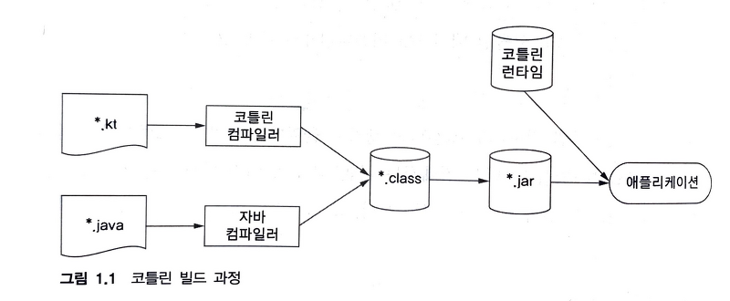
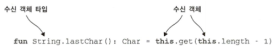
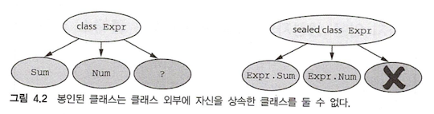

# 목차

[toc]

- [1장. 코틀린이란 무엇이며, 왜 필요한가?](#1장-코틀린이란-무엇이며-왜-필요한가)
  - [코틀린의 주요 특성](#코틀린의-주요-특성)
    - [정적 타입 지정 언어](#정적-타입-지정-언어)
    - [함수형 프로그래밍과 객체지향 프로그래밍](#함수형-프로그래밍과-객체지향-프로그래밍)
  - [코틀린의 철학](#코틀린의-철학)
    - [실용성](#실용성)
    - [간결성](#간결성)
    - [안전성](#안전성)
    - [상호운용성](#상호운용성)
  - [코틀린 도구 사용](#코틀린-도구-사용)
    - [코틀린 코드 컴파일](#코틀린-코드-컴파일)
- [2장. 코틀린 기초](#2장-코틀린-기초)
  - [기본 요소: 함수와 변수](#기본-요소-함수와-변수)
    - [Hello, World!](#hello-world)
    - [함수](#함수)
    - [변수](#변수)
    - [더 쉽게 문자열 형식 지정: 문자열 템플릿](#더-쉽게-문자열-형식-지정-문자열-템플릿)
  - [클래스와 프로퍼티](#클래스와-프로퍼티)
    - [프로퍼티](#프로퍼티)
    - [커스텀 접근자](#커스텀-접근자)
    - [코틀린 소스코드 구조: 디렉터리와 패키지](#코틀린-소스코드-구조-디렉터리와-패키지)
  - [선택의 표현과 처리: enum과 when](#선택의-표현과-처리-enum과-when)
    - [enum 클래스 정의](#enum-클래스-정의)
    - [when으로 enum 클래스 다루기](#when으로-enum-클래스-다루기)
    - [when과 임의의 객체를 함께 사용](#when과-임의의-객체를-함께-사용)
    - [인자 없는 when 사용](#인자-없는-when-사용)
    - [스마트 캐스트: 타입 검사와 타입 캐스트를 조합](#스마트-캐스트-타입-검사와-타입-캐스트를-조합)
    - [리팩토링: if를 when으로 변경](#리팩토링-if를-when으로-변경)
    - [if와 when의 분기에서 블록 사용](#if와-when의-분기에서-블록-사용)
  - [대상을 이터레이션: while과 for 루프](#대상을-이터레이션-while과-for-루프)
    - [while 루프](#while-루프)
    - [숫자에 대한 이터레이션: 범위와 수열](#숫자에-대한-이터레이션-범위와-수열)
    - [맵에 대한 이터레이션](#맵에-대한-이터레이션)
    - [in으로 컬렉션이나 범위의 원소 검사](#in으로-컬렉션이나-범위의-원소-검사)
  - [코틀린의 예외 처리](#코틀린의-예외-처리)
- [3장. 함수 정의와 호출](#3장-함수-정의와-호출)
  - [코틀린에서 컬렉션 만들기](#코틀린에서-컬렉션-만들기)
  - [함수를 호출하기 쉽게 만들기](#함수를-호출하기-쉽게-만들기)
    - [이름 붙인 인자](#이름-붙인-인자)
    - [디폴트 파라미터 값](#디폴트-파라미터-값)
    - [정적인 유틸리티 클래스 없애기: 최상위 함수와 프로퍼티](#정적인-유틸리티-클래스-없애기-최상위-함수와-프로퍼티)
  - [메소드를 다른 클래스에 추가: 확장 함수와 확장 프로퍼티](#메소드를-다른-클래스에-추가-확장-함수와-확장-프로퍼티)
    - [임포트와 확장 함수](#임포트와-확장-함수)
    - [자바에서 확장 함수 호출](#자바에서-확장-함수-호출)
    - [확장 함수로 유틸리티 함수 정의](#확장-함수로-유틸리티-함수-정의)
    - [확장 함수는 오버라이드 할 수 없다](#확장-함수는-오버라이드-할-수-없다)
    - [확장 프로퍼티](#확장-프로퍼티)
  - [컬렉션 처리: 가변 길이 인자, 중위 함수 호출, 라이브러리 지원](#컬렉션-처리-가변-길이-인자-중위-함수-호출-라이브러리-지원)
    - [자바 컬렉션 API 확장](#자바-컬렉션-api-확장)
    - [가변인자 함수: 인자의 개수가 달라질 수 있는 함수 정의](#가변인자-함수-인자의-개수가-달라질-수-있는-함수-정의)
    - [값의 쌍 다루기: 중위 호출과 구조 분해 선언](#값의-쌍-다루기-중위-호출과-구조-분해-선언)
  - [문자열과 정규식 다루기](#문자열과-정규식-다루기)
    - [문자열 나누기](#문자열-나누기)
  - [코드 다듬기: 로컬 함수와 확장](#코드-다듬기-로컬-함수와-확장)
  - [요약](#요약)
- [4장. 클래스, 객체, 인터페이스](#4장-클래스-객체-인터페이스)
  - [클래스 계층 정의](#클래스-계층-정의)
    - [코틀린 인터페이스](#코틀린-인터페이스)
    - [open, final, abstract 변경자: 기본적으로 final](#open-final-abstract-변경자-기본적으로-final)
    - [가시성 변경자: 기본적으로 공개](#가시성-변경자-기본적으로-공개)
    - [내부 클래스와 중첩된 클래스: 기본적으로 중첩 클래스](#내부-클래스와-중첩된-클래스-기본적으로-중첩-클래스)
    - [봉인된 클래스: 클래스 계층 정의 시 계층 확장 제한](#봉인된-클래스-클래스-계층-정의-시-계층-확장-제한)
  - [뻔하지 않은 생성자와 프로퍼티를 갖는 클래스 선언](#뻔하지-않은-생성자와-프로퍼티를-갖는-클래스-선언)
    - [클래스 초기화: 주 생성자와 초기화 블록](#클래스-초기화-주-생성자와-초기화-블록)
    - [부 생성자: 상위 클래스를 다른 방식으로 초기화](#부-생성자-상위-클래스를-다른-방식으로-초기화)
    - [인터페이스에 선언된 프로퍼티 구현](#인터페이스에-선언된-프로퍼티-구현)
    - [게터와 세터에서 뒷받침하는 필드에 접근](#게터와-세터에서-뒷받침하는-필드에-접근)
    - [접근자의 가시성 변경](#접근자의-가시성-변경)
  - [컴파일러가 생성한 메소드: 데이터 클래스와 클래스 위임](#컴파일러가-생성한-메소드-데이터-클래스와-클래스-위임)
    - [모든 클래스가 정의해야 하는 메소드](#모든-클래스가-정의해야-하는-메소드)
    - [데이터 클래스: 모든 클래스가 정의해야 하는 메소드 자동 생성](#데이터-클래스-모든-클래스가-정의해야-하는-메소드-자동-생성)
    - [클래스 위임: by 키워드 사용](#클래스-위임-by-키워드-사용)
  - [object 키워드: 클래스 선언과 인스턴스 생성](#object-키워드-클래스-선언과-인스턴스-생성)
    - [객체 선언: 싱글턴을 쉽게 만들기](#객체-선언-싱글턴을-쉽게-만들기)
    - [동반 객체: 팩터리 메소드와 정적 멤버가 들어갈 장소](#동반-객체-팩터리-메소드와-정적-멤버가-들어갈-장소)
    - [동반 객체를 일반 객체처럼 사용](#동반-객체를-일반-객체처럼-사용)
    - [객체 식: 익명 내부 클래스를 다른 방식으로 작성](#객체-식-익명-내부-클래스를-다른-방식으로-작성)
  - [요약](#요약)
- [5장. 람다로 프로그래밍](#5장-람다로-프로그래밍)
  - [람다 식과 멤버 참조](#람다-식과-멤버-참조)
    - [람다 소개: 코드 블록을 함수 인자로 넘기기](#람다-소개-코드-블록을-함수-인자로-넘기기)
    - [람다와 컬렉션](#람다와-컬렉션)
    - [람다 식의 문법](#람다-식의-문법)
    - [현재 영역에 있는 변수에 접근](#현재-영역에-있는-변수에-접근)
    - [멤버 참조](#멤버-참조)
  - [컬렉션 함수형 API](#컬렉션-함수형-api)
    - [필수적인 함수: filter와 map](#필수적인-함수-filter와-map)
    - [all, any, count, find: 컬렉션에 술어 적용](#all-any-count-find-컬렉션에-술어-적용)
    - [groupBy: 리스트를 여러 그룹으로 이뤄진 맵으로 변경](#groupby-리스트를-여러-그룹으로-이뤄진-맵으로-변경)
    - [flatMap과 flatten: 중첩된 컬렉션 안의 원소 처리](#flatmap과-flatten-중첩된-컬렉션-안의-원소-처리)
  - [지연 계산 lazy 컬렉션 연산](#지연-계산-lazy-컬렉션-연산)
    - [시퀀스 연산 실행: 중간 연산과 최종 연산](#시퀀스-연산-실행-중간-연산과-최종-연산)
    - [시퀀스 만들기](#시퀀스-만들기)
  - [자바 함수형 인터페이스 활용](#자바-함수형-인터페이스-활용)
    - [자바 메소드에 람다를 인자로 전달](#자바-메소드에-람다를-인자로-전달)
    - [SAM 생성자: 람다를 함수형 인터페이스로 명시적으로 변경](#sam-생성자-람다를-함수형-인터페이스로-명시적으로-변경)
  - [수신 객체 지정 람다: with와 apply](#수신-객체-지정-람다-with와-apply)
    - [with함수](#with함수)
    - [apply함수](#apply함수)
  - [요약](#요약)
- [6장. 코틀린 타입 시스템](#6장-코틀린-타입-시스템)
  - [널 가능성](#널-가능성)
    - [널이 될 수 있는 타입](#널이-될-수-있는-타입)
    - [타입의 의미](#타입의-의미)
    - [안전한 호출 연산자: "?."](#안전한-호출-연산자-)
    - [엘비스 연산자 "?:"](#엘비스-연산자-)
    - [안전한 캐스트: as?](#안전한-캐스트-as)
    - [널 아님 단언: !!](#널-아님-단언-)
    - [let함수](#let함수)
    - [나중에 초기화할 프로퍼티](#나중에-초기화할-프로퍼티)
    - [널이 될 수 있는 타입 확장](#널이-될-수-있는-타입-확장)
    - [타입 파라미터의 널 가능성](#타입-파라미터의-널-가능성)
    - [널 가능성과 자바](#널-가능성과-자바)
  - [코틀린의 기본 타입](#코틀린의-기본-타입)
    - [기본 타입: Int, Boolean 등](#기본-타입-int-boolean-등)
    - [널이 될 수 있는 기본 타입: Int?, Boolean? 등](#널이-될-수-있는-기본-타입-int-boolean-등)
    - [숫자 변환](#숫자-변환)
    - [Any, Any?: 최상위 타입](#any-any-최상위-타입)
    - [Unit 타입: 코틀린의 void](#unit-타입-코틀린의-void)
    - [Nothing 타입: “이 함수는 결코 정상적으로 끝나지 않는다.”](#nothing-타입-이-함수는-결코-정상적으로-끝나지-않는다)
  - [컬렉션과 배열](#컬렉션과-배열)
    - [널 가능성과 컬렉션](#널-가능성과-컬렉션)
    - [읽기 전용과 변경 가능한 컬렉션](#읽기-전용과-변경-가능한-컬렉션)
    - [코틀린 컬렉션과 자바](#코틀린-컬렉션과-자바)
    - [컬렉션을 플랫폼 타입으로 다루기](#컬렉션을-플랫폼-타입으로-다루기)
    - [객체의 배열과 기본 타입의 배열](#객체의-배열과-기본-타입의-배열)
- [7장. 연산자 오버로딩과 기타 관례](#7장-연산자-오버로딩과-기타-관례)
  - [산술 연산자 오버로드](#산술-연산자-오버로드)
    - [이항 산술 연산 오버로딩](#이항-산술-연산-오버로딩)
    - [복합 대입 연산자 오버로딩](#복합-대입-연산자-오버로딩)
    - [단항 연산자 오버로딩](#단항-연산자-오버로딩)
  - [비교 연산자 오버로딩](#비교-연산자-오버로딩)
    - [동등성 연산자: "equals"](#동등성-연산자-equals)
    - [순서 연산자: compareTo](#순서-연산자-compareto)
  - [컬렉션과 범위에 대해 쓸 수 있는 관례](#컬렉션과-범위에-대해-쓸-수-있는-관례)
    - [인덱스로 원소에 접근: get과 set](#인덱스로-원소에-접근-get과-set)
    - [in관례](#in관례)
    - [rangeTo관례](#rangeto관례)
    - [for 루프를 위한 iterator 관례](#for-루프를-위한-iterator-관례)
  - [구조 분해 선언과 component 함수](#구조-분해-선언과-component-함수)
    - [구조 분해 선언과 루프](#구조-분해-선언과-루프)
  - [프로퍼티 접근자 로직 재활용: 위임 프로퍼티](#프로퍼티-접근자-로직-재활용-위임-프로퍼티)
    - [위임 프로퍼티 소개](#위임-프로퍼티-소개)
    - [위임 프로퍼티 사용: by lazy()를 사용한 프로퍼티 초기화 지연](#위임-프로퍼티-사용-by-lazy를-사용한-프로퍼티-초기화-지연)
    - [위임 프로퍼티 구현](#위임-프로퍼티-구현)
    - [위임 프로퍼티 컴파일 규칙](#위임-프로퍼티-컴파일-규칙)
    - [프로퍼티 값을 맵에 저장](#프로퍼티-값을-맵에-저장)
    - [프레임워크에서 위임 프로퍼티 활용](#프레임워크에서-위임-프로퍼티-활용)
  - [요약](#요약)
- [8장. 고차 함수: 파라미터와 반환 값으로 람다 사용](#8장-고차-함수-파라미터와-반환-값으로-람다-사용)
  - [고차 함수 정의](#고차-함수-정의)
    - [함수 타입](#함수-타입)
    - [인자로 받은 함수 호출](#인자로-받은-함수-호출)
    - [자바에서 코틀린 함수 타입 사용](#자바에서-코틀린-함수-타입-사용)
    - [디폴트 값을 지정한 함수 타입 파라미터나 널이 될 수 있는 함수 타입 파라미터](#디폴트-값을-지정한-함수-타입-파라미터나-널이-될-수-있는-함수-타입-파라미터)
    - [함수를 함수에서 반환](#함수를-함수에서-반환)
    - [람다를 활용한 중복 제거](#람다를-활용한-중복-제거)
  - [인라인 함수: 람다의 부가 비용 없애기](#인라인-함수-람다의-부가-비용-없애기)
    - [인라이닝이 작동하는 방식](#인라이닝이-작동하는-방식)
    - [인라인 함수의 한계](#인라인-함수의-한계)
    - [컬렉션 연산 인라이닝](#컬렉션-연산-인라이닝)
    - [함수를 인라인으로 선언해야 하는 경우](#함수를-인라인으로-선언해야-하는-경우)
    - [자원 관리를 위해 인라인된 람다 사용](#자원-관리를-위해-인라인된-람다-사용)
  - [고차 함수 안에서 흐름 제어](#고차-함수-안에서-흐름-제어)
    - [람다 안의 return문: 람다를 둘러싼 함수로부터 반환](#람다-안의-return문-람다를-둘러싼-함수로부터-반환)
    - [람다로부터 반환: 레이블을 사용한 return](#람다로부터-반환-레이블을-사용한-return)
    - [무명 함수: 기본적으로 로컬 return](#무명-함수-기본적으로-로컬-return)
  - [요약](#요약)
- [9장. 제네릭스](#9장-제네릭스)
  - [제네릭 타입 파라미터](#제네릭-타입-파라미터)
    - [제네릭 함수와 프로퍼티](#제네릭-함수와-프로퍼티)
    - [제네릭 클래스 선언](#제네릭-클래스-선언)
    - [타입 파라미터 제약](#타입-파라미터-제약)
    - [타입 파라미터를 널이 될 수 없는 타입으로 한정](#타입-파라미터를-널이-될-수-없는-타입으로-한정)
  - [실행 시 제네릭스의 동작: 소거된 타입 파라미터와 실체화된 타입 파라미터](#실행-시-제네릭스의-동작-소거된-타입-파라미터와-실체화된-타입-파라미터)
    - [실행 시점의 제네릭: 타입 검사와 캐스트](#실행-시점의-제네릭-타입-검사와-캐스트)
    - [실체화한 타입 파라미터를 사용한 함수 선언](#실체화한-타입-파라미터를-사용한-함수-선언)
    - [실체화한 타입 파라미터로 클래스 참조 대신](#실체화한-타입-파라미터로-클래스-참조-대신)
    - [실체화한 타입 파라미터의 제약](#실체화한-타입-파라미터의-제약)
  - [변성: 제네릭과 하위 타입](#변성-제네릭과-하위-타입)
    - [변성이 있는 이유: 인자를 함수에 넘기기](#변성이-있는-이유-인자를-함수에-넘기기)
    - [클래스, 타입, 하위 타입](#클래스-타입-하위-타입)
    - [공변성: 하위 타입 관계를 유지](#공변성-하위-타입-관계를-유지)
    - [반공변성: 뒤집힌 하위 타입 관계](#반공변성-뒤집힌-하위-타입-관계)
    - [사용 지점 변성: 타입이 언급되는 지점에서 변성 지정](#사용-지점-변성-타입이-언급되는-지점에서-변성-지정)
    - [스타 프로젝션: 타입 인자 대신 * 사용](#스타-프로젝션-타입-인자-대신--사용)
  - [요약](#요약)
- [10장. 애노테이션과 리플렉션](#10장-애노테이션과-리플렉션)
  - [애노테이션 선언과 적용](#애노테이션-선언과-적용)
    - [애노테이션 대상](#애노테이션-대상)
    - [애노테이션을 활용한 JSON 직렬화 제어](#애노테이션을-활용한-json-직렬화-제어)
    - [애노테이션 선언](#애노테이션-선언)
    - [메타애노테이션: 애노테이션을 처리하는 방법 제어](#메타애노테이션-애노테이션을-처리하는-방법-제어)
    - [애노테이션 파라미터로 클래스 사용](#애노테이션-파라미터로-클래스-사용)
    - [애노테이션 파라미터로 제네릭 클래스 받기](#애노테이션-파라미터로-제네릭-클래스-받기)
  - [리플렉션: 실행 시점에 코틀린 객체 내부 관찰](#리플렉션-실행-시점에-코틀린-객체-내부-관찰)
    - [코틀린 리플렉션 API: KClass, KCallable, KFunction, KProperty](#코틀린-리플렉션-api-kclass-kcallable-kfunction-kproperty)
    - [리플렉션을 사용한 객체 직렬화 구현](#리플렉션을-사용한-객체-직렬화-구현)
    - [애노테이션을 활용한 직렬화 제어](#애노테이션을-활용한-직렬화-제어)
    - [JSON 파싱과 객체 역직렬화](#json-파싱과-객체-역직렬화)
    - [최종 역직렬화 단계: callBy(), 리플렉션을 사용해 객체 만들기](#최종-역직렬화-단계-callby-리플렉션을-사용해-객체-만들기)
  - [요약](#요약)
- [11장. DSL 만들기](#11장-dsl-만들기)
  - [API에서 DSL로](#api에서-dsl로)
    - [영역 특화 언어라는 개념](#영역-특화-언어라는-개념)
    - [내부 DSL](#내부-dsl)
    - [DSL의 구조](#dsl의-구조)
    - [내부 DSL로 HTML 만들기](#내부-dsl로-html-만들기)
  - [구조화된 API 구축: DSL에서 수신 객체 지정 DSL 사용](#구조화된-api-구축-dsl에서-수신-객체-지정-dsl-사용)
    - [수신 객체 지정 람다와 확장 함수 타입](#수신-객체-지정-람다와-확장-함수-타입)
    - [수신 객체 지정 람다를 HTML 빌더 안에서 사용](#수신-객체-지정-람다를-html-빌더-안에서-사용)
    - [코틀린 빌더: 추상화와 재사용을 가능하게 하는 도구](#코틀린-빌더-추상화와-재사용을-가능하게-하는-도구)
  - [invoke 관례를 사용한 더 유연한 블록 중첩](#invoke-관례를-사용한-더-유연한-블록-중첩)
    - [invoke 관례: 함수처럼 호출할 수 있는 객체](#invoke-관례-함수처럼-호출할-수-있는-객체)
    - [invoke 관례와 함수형 타입](#invoke-관례와-함수형-타입)
    - [DSL의 invoke 관례: 그레이들에서 의존관계 정의](#dsl의-invoke-관례-그레이들에서-의존관계-정의)
  - [실전 코틀린 DSL](#실전-코틀린-dsl)
    - [중위 호출 연쇄: 테스트 프레임워크의 should](#중위-호출-연쇄-테스트-프레임워크의-should)
    - [기본 타입에 대한 확장 함수 정의: 날짜 처리](#기본-타입에-대한-확장-함수-정의-날짜-처리)
    - [멤버 확장 함수: SQL을 위한 내부 DSL](#멤버-확장-함수-sql을-위한-내부-dsl)
    - [안코: 안드로이드 UI를 동적으로 생성하기](#안코-안드로이드-ui를-동적으로-생성하기)
  - [요약](#요약)

# 1장. 코틀린이란 무엇이며, 왜 필요한가?

코틀린은 간결하고 실용적이며, 자바 코드와의 상호운용성을 중시한다.  코틀린은 주목적은 현재 자바가 사용되고 있는 모든 용도에 적합하면서도 더 간결하고 생상적이며 안전한 대체 언어를 제공하는 것이다.

## 코틀린의 주요 특성

### 대상 플랫폼: 서버, 안드로이드 등 자바가 실행되는 모든 곳

### 정적 타입 지정 언어

자바와 마찬가지로 코틀린도 정적 타입 지정 언어다.

정적 타입 지정이 타입을 컴파일 시점에서 알 수 있고 프로그램 안에서 `객체 필드나 메서드를 사용할 때마다 컴파일러가 타입을 검증`해준다.

동적 타입 지정 언어에서는 타입과 관계 없이 모든 값을 변수에 넣을 수 있고, 메서드나 필드 접근에 대한 검증이 실행 시점에 일어나며, 그에 따라 코드가 더 짧아지고 데이터 구조를 더 유연하게 생성하고 사용할 수 있다. 하지만 컴파일 시 걸러내지 못하고 런타임에 오류가 발생한다.

코틀린은 `컴파일러가 문맥으로 부터 변수 타입을 자동으로 유추`할 수 있기 때문에 모든 변수의 타입을 프로그래머가 직접 명시할 필요가 없다. 

정적 타입의 지정의 장점은 다음과 같다.

- 성능 - 실행 시점에 어떤 메서드를 호출할지 알아내는 과정이 필요 없음으로 메소드 호출이 더 빠르다.
- 신뢰성 - 컴파일러가 프로그램 정확성을 검증하기 때문에 실행 시 프로그램 오류로 중단될 가능성이 더 적어진다.
- 유지보수 - 코드에서 다르는 객체가 어떤 타입에 속하는지 알수 있기 때문에 처음 보는 코드를 다룰 때도 더 쉽다.
- 도구 지원 - 정적 타입 지정을 활용하면 더 안전하게 리팩토링 할 수 있고, 도구는 더 정확한 코드 완성 기능을 제공할 수 있으며, IDE의 다른 지원 기능도 더 잘 만들수 있다.

### 함수형 프로그래밍과 객체지향 프로그래밍

함수형 프로그래밍의 핵심 개념

- 일급 시민(first-class) 함수 : 함수를 일반 값처럼 다룰 수 있다.
  - 함수를 변수에 저장하고 함수를 인자로 다른 함수에 전달할 수 있고 함수에서 새로운 함수를 만들어서 반환 할 수있다
- 불변성(immutability) : 함수형 프로그래밍에서는 불변 객체를 사용해 프로그램을 작성한다.
- 부수 효과(side effect) 가 없다.
  - 입력이 같으면 항상 같은 출력을 하고 다른 객체의 상태를 변경하지 않는다.
  - 함수 외부나 다른 바깥 환경과 상호작용하지 않는 순수 함수를 사용한다

함수형 스타일의 장점

1. 간결성
   - 함수를 값처럼 활용 → 더 강력한 추상화 → 코드 중복 막을 수 있음
   - ex) 공통부분을 따로 함수로 뽑아내고 서로 다른 사항을 인자에 함수로 전달.

```kotlin
fun findAlice() = findPerson { it.name == "Alice" }
fun findBob() = findPerson { it.name == "Bob" }
```

2. 다중 스레드를 사용해도 안전하다 
   - 불변 데이터 구조를 사용하고 순수 함수를 그 데이터 구조에 적용한다면 다중 스레드 환경에서 같은 데이터를 여러 스레드가 변경할 수 없다. (따라서 복잡한 동기화를 적용하지 않아도 된다)
3. 함수형 프로그램은 테스트하기 쉽다.
   - 순수함수는 준비 코드(setup code) 없이 독립적으로 테스트할 수 있다.

## 코틀린의 철학

### 실용성

코틀린은 연구를 위한 언어가 아니다. 다른 프로그래밍 언어가 채택한 이미 성공적으로 검증된 해법과 기능들을 구현하여

복잡도가 낮다. 

### 간결성

코틀린은 코드에서 의미 없는 부분을 줄이기 위해 많은 노력을 기울였다.

게터 세터 생성자 파라미터 필드 초기화 로직 등, 자바에 존재하는 여러 번거로운 코드를 묵시적으로 제공하기 대문에 지저분하지 않다. 

코드가 간결하면 읽고 쓰는데 시간이 덜 걸려 생산성을 향상시킨다. 

### 안전성

코틀린은 JVM에서 실행한다는 사실은 메모리, 버퍼 오버플로 방지 메모리 해제 등 안전성을 보장할 수 있다.. 

코틀린은 타입 시스템은 null이 될수 없는 값을 추적하며, 실행 시점에 NullPointerException이 발생할 수 있는 연산을 사용하는 코드를 금지한다.

```kotlin
var s2: String? = null // null이 될 수 있음
var s2: String = "" // null이 될 수 없음
```

또한 ClassCaseException을 방지하게 도와준다.

```kotlin
if (value is String) {
	print(value.toUpperCase())
}
```

### 상호운용성

자바 코드에서 코틀린 코드를 호출할 때도 아무런 노력이 필요 없다.

기존 자바 라이브러리를 가능하면 최대한 활용하며 자체 컬렉션 라이브러리를 제공하지 않고, 자바 표준 라이브러리 클래스에 의존한다.

## 코틀린 도구 사용

### 코틀린 코드 컴파일과정

1. **코틀린 소스코드**: 프로젝트에 작성된 `.kt` 파일들입니다.
2. **코틀린 컴파일러**: 코틀린 소스코드를 바이트코드로 변환하는 도구입니다.
3. **JVM 바이트코드**: 컴파일러에 의해 생성된 `.class` 파일들입니다. 이 바이트코드는 JVM(Java Virtual Machine)에서 실행될 수 있습니다.
4. **JVM**: 바이트코드를 실행하는 가상 머신입니다.



코틀린 컴파일러로 컴파일한 코틀은 코틀린 런타임 라이브러리에 의존하므로 배포시 런타임 라이브러리도 함께 배포해야 한다

* 런타임 라이브러리에는 코틀린 자체 표준 라이브러리 클래스와 자바 API를 확장한 내용들이 있다.


# 2장. 코틀린 기초

## 기본 요소: 함수와 변수

### 함수

```kotlin
// 함수이름(파라미터): 리턴타입
fun max(a: Int, b: Int): Int {
    return if (a > b) a else b
}
```

- 함수의 선언은 fun 키워드로 시작
- 함수 이름 뒤에는 괄호 안에 파라미터 목록
- 함수의 반환 타입은 파라미터 목록의 닫는 괄호 다음에 위치, 단 괄호와 반환 타입 사이를 콜론으로 구분
  - 없는 경우 생략


**코틀린이 반환 타입을 생략할 수 있는 이유는 타입 컴파일러의 추론 때문이다.** 

식이 본문인 함수의 반환 타입만 생략 가능하다. 식의 결과 타입이 있을 수 있기 때문이다.

```kotlin
fun max(a: Int, b: Int) = if (a > b) a else b
```

### 문(statement)과 식(expression)의 구분

코틀린에서 if는 expression이지 statement가 아니다.

expression은 값을 만들어 내며, 다른 식의 하위 요소로 계산에 참여할 수 있는 반면

statement은 자신을 둘러싸고 있는 가장 안쪽 블록의 최상위 요소로 존재하며 아무런 값을 만들어 내지 않는다.

자바에서는 모든 제어구조가 statement이며 코틀린은 대부분 제어구조가 expression이다. 

### 변수

```kotlin
val answer = 42 // 타입을 명시 하지 않아도 됨
val answer: Int = 42 // 타입명시 
val yeaerToCompute = 7.5e6
```

cㅗ기화 식을 사용하지 않고 변수를 선언하려면 타입을 명시해야 한다

```kotlin
val answer: Int
asnwer = 42
```


타입을 지정하지 않으면 컴파일러가 초기화 식을 분석해서 초기화 식의 타입 변수 타입으로 지정한다.

```kotlin
var result = 10; // 변경 가능한 참조를 저장
val result = 10; // 변경 불가능한 참조를 저장

val str = "String"
str.add("string") // 값변경 가능
```

* val : value, 값 변경 불가능. final
* var : variable, 변수, 변경 가능함

`val` 참조는 자체는 불면일지라도 그 참조가 가리키는 객체의 내부 값은 변경될 수 있다.

어떤 블록이 실행될때 오직 1개만의 초기화가 실행된다면 조건에 따라 여러 값으로 초기화 가능

```kotlin
val message: String

if (a1()) {
  message = ""
}

else {
  message = "?"
}
```

### 더 쉽게 문자열 형식 지정: 문자열 템플릿

```kotlin
fun main(args: Array<String>) {
    val name = if (agrs.SIZE > 0) args[0] else "kotlin"
    println("Hello, $name!")
}
```

인자가 없는 경우, 있는 경우에 따라 간단한 문자열 템플릿 만들수 있다.

컴파일 시점에 정적으로 식을 검사하기 때문에 컴파일 타임 에러 잡기가 가능하다. 

## 클래스와 프로퍼티


### 프로퍼티

**클래스라는 개념의 목적은 데이터를 캡슐화하고 캡슐화한 데이터를 다루는 코드를 한 주체 아래에 가두는 것이다.** 

자바에서는 필드와 접근자를 한데 묶어 프로퍼티라고 부른다.

* 자바의 멤버 필드의 가시성은 보통 private 으로 선언하고 접근하기 위한 방법으로 접근자 메서드(accessor method)를 제공

코틀린의 프로퍼티는 자바와 같은 개념이며 기본 기능으로 제공한다.

또한 게터를 호출하는 대신 프로퍼티에 직접 접근한다. 메서드()를 사용하지 않는다  

```kotlin
class Person(
  val name: String,  // 읽기전용 프로퍼티. private field와 public getter 제공
  var isMarried: Boolean // 수정 가능 프로퍼티, private field와 public getter,setter 제공 
)

fun main() {
    val myPerson = Person("name", true)
    myPerson.name // myPerson.getName()
    myPerson.isMarried // myPerson.getIsMarried()
    myPerson.isMarried = false // myPerson.setIsMarried(false)

} 
```

### 커스텀 접근자

프로퍼티에는 프로퍼티 값을 저장하기 위한 필드가 있는데 이를 프로퍼티 backing filed(뒷받침)라고 한다.

```kotlin
class Rectangle(
  val height: Int, 
  val width: Int
) {
    val isSquare: Boolean
        get() { // 프로퍼티 getter 재정의
            return hieght = width
        }
}
```


## 선택의 표현과 처리: enum과 when

### enum 클래스 정의

```kotlin
 enum class Color(
    val r: Int, val g: Int, val b: Int
) {
    RED(255, 0, 0),
    ORANGE(255, 165, 0),
    YELLOW(255, 255, 0),
    GREEN(0, 255, 0),
    BLUE(0, 0, 255);  // 세미콜론 필수

    fun rgb() = (r * 256 * g) * 256 + b
}
```

- 코틀린에서 enum은 soft keyword. 즉 enum이란 키워드를 변수로도 사용 가능.
- class 앞에서는 enum 클래스를 의미하며  enum class가 없다면 키워드가 아니다
- enum에서도 일반적인 클래스와 마찬가지로 생성자와 프로퍼티를 선언
- `코틀린에서 유일하게 ; 이 필요한 곳이 enum이다.`


### when으로 enum 클래스 다루기

```kotlin
fun getMnemonic(color: Color) = 
    when (color) {
        Color.RED -> "Richard"
        Color.ORANGE -> "Of"
        Color.YELLOW -> "York"
        Color.GREEN -> "Gave"
        Color.BLUE -> "Battle"
        Color.INDIGO -> "In"
        Color.VIOLET -> "Vain"
    }
```

if와 마찬가지로 when도 식이며 함수의 반환 값으로 when 식을 직접 사용 가능하다. 

자바와 달리  break를 쓰지 않아도 된다.

한 분기 안에서 여러 값을 콤마로 분리 하여 사용 가능

```kotlin
fun getWarmth(color: Color) = when (color) {
    Color.RED, Color.ORANGE, Color.YELLOW -> "Warm"
    Color.GREEN -> "neutral"
    else -> "cold"
}
```

### when과 임의의 객체를 함께 사용

코틀린에서 when은 자바의 switch보다 훨씬 더 강력하다. 분기 조건에 상수(enum 상수나 숫자 리터럴)만을 사용할 수있는 자바 switch와 달리 코틀린 when의 분기 조건은 임의의 객체를 허용 한다.

```kotlin
fun mix(c1: Color, c2: Color) =
    when (setOf(c1, c2)) {
        setOf(Color.RED, Color.YELLOW) -> Color.ORANGE
        setOf(Color.YELLOW, Color.BLUE) -> Color.GREEN
        else -> throw IllegalArgumentException("argument is invalid")
    }
```


c1, c2가 RED, YELLOW라면 그 둘을 혼합한 결과는 ORANGE다. 이를 구현해서 집합 비교를 사용한다.

when의 분기 조건 부분에 `식을` 넣을 수 있기 때문에 많은 경우 코드를 더 간결하고 아름답게 작성 할 수 있다.

### 인자 없는 when 사용

set 인스턴스를 생성하는 불필요한 비용을 줄이기 위해서 인자가 없는 when 식을 사용할 수 있다.

```kotlin
fun mix(c1: Color, c2: Color) =
    when {
        (c1 == RED && c2 == YELLOW) -> ORANGE
        (c1 == BLUE && c2 == YELLOW) -> GREEN
        else -> throw Exception("dirty color")
    }
```

### 스마트 캐스트: 타입 검사와 타입 캐스트를 조합

Expr 인터페이스에는 두 가지 구현 클래스가 존재한다

- 식을 평가하려면 두 가지 경우를 고려해야 한다.
- 어떤 식이 수라면 그 값을 반환한다
- 어떤 식의 합계라면 좌항과 우항의 값을 계산 한 뒤 그 두 값을 합한 값을 반환한다.

```kotlin
interface Expr

classNum(val value: Int) : Expr
class Sum(val left: Expr, val right : Expr) : Expr

fun eval(e: Expr): Int =
    when (e) {
        is Num -> e.value
        is Sum -> eval(e.right) + eval(e.left)
        else -> throw IllegalArgumentException("unknown")
    }
```


**어떤 변수나 원하는 타입인자를 일단 is로 검사하고 나면 굳이 변수를 원하는 타입으로 캐스팅 하지 않아도 마치 처음부터 그 변수가 원하는 타입으로 선언된 것처럼 사용할 수 있다.** 

코틀린의 is는 자바의 instanceof와 비슷하다. 하지만 실제로는 자바와 달리  컴파일러가 캐스팅을 수행해준다. 이를 **스마트 캐스트**라고 한다.

### 리팩토링: if를 when으로 변경

코틀린에서는 if가 값을 만들어 내기 때문에 자바와 달리 3항 연산자가 따로 없다 

### if와 when의 분기에서 블록 사용

```kotlin
fun eval(e: Expr): Int =
    when(e) {
        is Num -> { // 블록으로 사용할 수도 있다.
            println("hello $e.value")
            e.value
        }
        is Sum -> evalu(e.right) + eval(e.left)
        else -> throw IllegalArgumentException("Unknown expression")
    }
```


## 대상을 이터레이션: while과 for 루프

### while 루프

자바와 while은 같다.

for은 for-each만 존재한다. 

### 숫자에 대한 이터레이션: 범위와 수열

루프의 가장 흔한 용례인 초깃값, 증가 값, 최종 값을 사용한 루프를 대신하기 위해 코틀린에서는 범위를 사용한다. 

범위는 기본적으로 두 값으로 이뤄진 구간이다. 

보통 그 두 값을 정수 등의 숫자 타입이며, `..` 연산자로 시작 값과 끝 값을 연결해서 범위를 만든다.

```kotlin
fun fizzBuzz(i: Int) = when {
    i % 15 == 0 -> "FizzBuzz"
    i % 3 == 0 -> "Fizz"
    i % 5 == 0 -> "Buzz"
    else -> "$i"
}

fun main(args: Array<String>) {

    val oneToTen = 1..10

    println(oneToTen)

    for (i in 1..100){
        println(fizzBuzz(i))
    }

    for (i in 100 downTo 1 step 2) { // 증가값 step을 갖는 수열에 대해 이터레이션 
        println(fizzBuzz())
    }
}
```

* downTo 1은 역방향. 즉 감소에 대해 이터레이션 한다 
* 스텝은 증가, 감소 값이다. 

### 맵에 대한 이터레이션

```kotlin
val binaryReps = TreeMap<Char, String>()

for (c in 'A'..'F') { // A ~ F까지 이터레이션
    val binary = Integer.toBinaryString(c.toInt()) // 아스키 코드를 2진표현으로 
    binaryReps[c] = binary // c를 키로 c의 2진 표현을 맵에 put
}

for ((letter, binary) in binaryReps) { // 맵에 대한 이터레이션, 맵의 키와 값을 두 변수에 각각 대입한다.
    println("$letter = $binary")
}
```

키를 사용해 맵의 값을 가져오거나 키에 해당 하는 값을 넣는 작업인 get(), put()을 사용 하는 대신에

 `map[key]` `[key] = value` 을 사용한다

`구조 분해 할당`

### in으로 컬렉션이나 범위의 원소 검사

```kotlin
fun isLetter(c: Char) = c in 'a'..'z' || c in 'A'..'Z'

fun isNotDigit(c: Char) = c !in '0'..'9'
```

in 연산자를 사용해 어떤 값이 범위에 속하는지 검사할 수 있다. 반대로 !in을 사용하면 어떤 값이 범위에 속하지 않는지 검사 할 수 있다.

```kotlin
fun reconize(c: Char) = when (c) {
    in '0'..'9' -> "number" // c 값이 0~ 9 사이 속해있는지 검사
    in 'a'..'z', in 'A'..'Z' -> "string" // 여러 범위 조건 지정 가능
    else -> "what ? "
}
```

컬렉션도 가능

```kotlin
println("kotlin" in setOf("java", "Scala"))
```

## 코틀린의 예외 처리

기본적인 사용방법은 자바와 크게 다를 건 없다.

`코틀린은Checked 예외를 반드시 처리할 필요없다` . 자바에서는 반드시 처리하거나 method throws 표시

* 자바에서의 불편함인 `try catch` 으로 감싸고 다음 로직을 이어가는 코드를 작성하는 경우를 없앴다.

- try, throw 같은 키워드가 식(Expression)으로 취급되어서 다른 식에 포함이 가능하다

```kotlin
fun readNumber(reader: BufferedReader): Int?{
    try {
        val line = reader.readLine()
        return Integer.parseInt(line)
    } catch (e: NumberFormatException){
        return null
    } finally {
        reader.close()
    }
}
```

# 3장. 함수 정의와 호출

- 컬렉션, 문자열, 정규식을 다루기 위한 함수
- 이름 붙인 인자, 디폴트 파라미터 값, 중위 호출 문법 사용
- 확장 함수와 확장 프로퍼티를 사용해 자바 라이브러리 적용
- 최상위 및 로컬 함수와 프로퍼티를 사용해 코드 구조화

## 코틀린에서 컬렉션 만들기

```kotlin
val hashSetOf = hashSetOf(1, 7, 53 // 해시셋
println(hashSetOf) // [1, 53, 7]

val arrayListOf = arrayListOf(1, 7, 53) // 어레이리스트
println(arrayListOf) // [1, 7, 53]

val hashMapOf = hashMapOf(1 to "one", 7 to "seven", 53 to "fifty-three") // 해시맵
println(hashMapOf) // {1=one, 53=fifty-three, 7=seven}

// 어떤 클래스에 속하는지 검사
println(hashSetOf.javaClass) // class java.util.HashSet
println(arrayListOf.javaClass) // class java.util.ArrayList
println(hashMapOf.javaClass) // class java.util.HashMap
```

* `javaClass`는 자바의 `getClass()`에 해당하는 코틀린 코드다. 이 코드는 코틀린이 자신만의 컬렉션 기능을 제공하지 않는 다는 뜻이다.

코틀린이 자체 컬렉션을 제공하지 않는 이유는 표준 자바 컬렉션을 활용하면 자바 코드와 상호작용하기가 훨씬 쉽기 때문이다 

자바에서 코틀린 함수를 호출하거나 코틀린에서 자바 함수를 호출할 때 자바와 코틀린 컬렉션을 서로 변환할 필요가 없다.

 **코틀린 컬렉션은 자바 컬렉션과 똑같은 클래스다.** 하지만 코틀린에서는 자바보다 더 많은 기능을 쓸 수 있다.

## 함수를 호출하기 쉽게 만들기

```kotlin
fun main(args: Array<String>) {
    val list = listOf(1, 2, 3)
    println(list) // [1, 2, 3]
}
```

위와 같은 toString() 결과를 바꾸고 싶을 때, joinToString 확장 함수를 새로 만든다.

```kotlin
fun <T> joinToString(
    collection: Collection<T>,
    separator: String,
    prefix: String,
    postfix: String
): String {
    val result = StringBuilder(prefix)
                                        
    for ((index, element) in collection.withIndex()) {
        if (index > 0) result.append(separator)
        result.append(element)
    }

    result.append(postfix)
    return result.toString()
}

val list = listOf(1, 7, 53)
println(joinToString(list, "; " ,"(",")")) // (1; 7; 53)
println(joinToString(list, separator = "; ", prefix = "(", postfix = ")")) // // (1; 7; 53)
```

### 디폴트 파라미터 값

함수의 디폴트 파라미터 값은 함수를 호출하는 쪽이 아니라 함수 선언 쪽에서 지정된다. 

`그래서 디폴트 값을 변경하면 이미 작성된 코드중에 값을 지정하지 않은 모든 인자는 자동으로 바뀐 디폴트 값으로 적용 받는다.`

* 주의 해야 한다. 

> 자바에서는 디폴트 파라미터를 지원하지 않기 때문에, 자바쪽에서 코틀린 함수를 호출하면 
>
> @JvmOverloads 어노테이션을 추가하면 코틀린 컴파일러가 자동으로 파라미터를 하나씩 생략한 여러 오버로딩 메소드를 추가해준다. 

### 정적인 유틸리티 클래스 없애기: 최상위 함수와 프로퍼티

자바에서는 어느 클래스에 포함시키기 어려운 공통 코드가 생겨 다양한 유틸성 정적 메소드를 모아두는 유틸 클래스가 생겨버린다. 

코틀린에서는 이럴 필요 없다. 함수와 프로퍼티는 클래스 밖에 최상위에 위치시킬 수 있다.

아래와 같은 코드를 최상위 함수라고 한다. 

```kotlin
package strings

fun joinToString(...): String {...}

// 파일이름 : join.kt
```

클래스 밖에서도 이 함수를 정의하고 호출할 수 있다. 

원리

-> JVM이 join.kt를 컴파일할때 새 클래스를 정의해준다.  

```java
// Java
package strings;

public class JoinKt { // join.kt 파일
	public static String joinToString(...) { ... } 
}
```

코틀린 컴파일러가 생성하는 클래스의 이름은 최상위 함수가 들어있떤 코틀린 소스파일의 이름과 대응한다 

만약 이름을 변경하고 싶다면 파일에 `@JvmName` 애너테이션 추가하면된다.

```kotlin
@file:JvmName("StringFunctions") // 클래스 이름 지정 어노테이션
package strings // @JvmName 어노테이션 뒤에 패키지 문이 와야 한다

fun joinToString(...): String {...}

```

to

```java
import strings.StringFunctions;

StringFunctions.joinToString(list, ...);
```

### 최상위 프로퍼티 

- 코틀린 컴파일러가 생성하는 클래스 이름은 최상위 함수가 들어있던 코틀린 소스 파일의 이름과 대응한다.

```kotlin
const val UNIX_LINE_SEPARATOR = "\n"
```

```java
public static final String UNIX_LINE_SEPARATOR = "\n";
```

프로퍼티를 최상위에 놓으면 다른 필드들과 동일하게 public getter를 통해 접근 가능하다 

만약 상수처럼 사용하고 싶다면 `const val` 사용 시 `public static final String` 처럼 사용 가능하다.

## 메소드를 다른 클래스에 추가: 확장 함수와 확장 프로퍼티

**확장 함수를 함수는 어떤 클래스의 멤버 메소드인 것처럼 호출할 수 있지만 그 클래스 밖에 선언된 함수.**

확장 함수를 만들려면 추가하려는 함수 이름 앞에 그 함수가 확장할 클래스의 이름을 덧붙인다.

- 클래스 이름: 수신 객체 타입 / 확장함수가 호출하는 대상: 수신 객체



```kotlin
package strings

// 어떤 문자열의 마지막 문자를 돌려주는 확장함수
fun String.lastChar() : Char = this.get(this.length - 1)
```

* 수신 객체 타입(receiver type) : 확장할 클래스의 이름 (위에서는 String)
* 수신 객체 (receiver object) : 확장 함수의 타겟. 즉 호출되는 대상. (위에서는 this) 

다음과 같이 사용 가능

```kotlin
"Kotlin".lastChar() // 결과 : n

// "Kotlin"의 타입인 String이 수신 객체 타입
// "Kotlin"이 수신 객체
```

일반 메소드와 마찬가지로 this를 생략할 수 있고,

확장함수 내부에서는 일반 인스턴스 메소드와 같이 수신객체의 메소드나 프로퍼티를 바로 사용할 수 있다.

`그러나 확장함수가 캡슐화를 깨지는 않는다 .`

* private field나 protected aㅔㅁ버는 사용할 수 없다. 

### 임포트와 확장 함수

확장 함수를 사용하려면 그 함수를 다른 클래스나 함수와 마찬가지로 임포트 해야 한다.

as 키워드를 사용하면 임포트한 클래스나 함수를 다른 이름으로 부를 수 있음.

```kotlin
import strings.lastChar as last // 다른이름은 last로 호출 가능
//

val c = "Kotlin".last()
```

다른 여러 패키지에 속해있는이름이 같은 확장함수를 가져와 사용하는 경우 as로 이름을 바꿔서 유용하게 쓸 수 있다. 

임포트할 때 이름을 바꾸는 것이 확장함수 충돌을 막을 수 있는 유일한 방법이다. 

### 자바에서 확장 함수 호출

확장 함수를 StringUtil.kt 파일에 정의했다면 자바 파일에서도  

```java
char c = StringUtilKt.lastChar("Java");
```

와 같이 호출 가능하다. 

### 확장 함수는 오버라이드 할 수 없다

확장 함수는 사실 클래스 밖에 선언된다 .

확장함수를 호출할 때 수신 객체로 지정한 변수의 `정적 타입에 의해 결정되지, 동적 타입에 의한 확장 함수가 결정되지 않는다.`

```kotlin
open class View {
    open fun click() = println("View clicked")
}

class Button: View() {
    override fun click() = println("Button clicked")
}

fun View.showOff() = println("I'm a view!")
fun Button.showOff() = println("I'm a button!")

fun main(args: Array<String>) {
    val view: View = Button() // 정적 타입은 View
    view.showOff()  // 결과 : I`m a View!
}
```

확장 함수는 정적으로 결정되기 때문에 view의 실제 객체 타입은(구현체, 서브클래스) Button이지만, 

view타입이 View이기 때문에 View에 정의된 확장 함수가 호출된다.


또한 확장 함수와 멤버 함수의 이름과 시그니처가 같다면 멤버 함수가 우선순위가 더 높아서 멤버 함수가 호출된다. 

* 확장함수도 쓰고싶다면 as를 이용해 이름을 바꾸면 되지않을까? ㅎㅎ 

### 확장 프로퍼티

확장 프로퍼티

```kotlin
val String.lastChar: Char
    get() = get(length - 1)
```


변경 가능한 확장 프로퍼티

```kotlin
var StringBuilder.lastChar: Char
    get() = get(length - 1)
    set(value: Char) {
        this.setCharAt(length - 1, value)
    }
```


실제 사용 시 아래와 같이 나온다.

```kotlin
fun main(args: Array<String>) {
    println("Kotlin".lastChar) // n

    val sb = StringBuilder("Kotlin?")
    sb.lastChar = '!'
    println(sb) // Kotlin!
}
```

## 컬렉션 처리: 가변 길이 인자, 중위 함수 호출, 라이브러리 지원

- vararg 키워드: 가변 인자로 받을 수 있는 함수를 정의 가능
- 중위 함수 호출 구문: 인자가 하나 뿐인 메서드를 간편하게 호출
- 구조 분해 선언: 복잡한 값을 분해해서 여러 변수에 나눠 담을 수 있음

### 자바 컬렉션 API 확장

어떻게 자바 라이브러리 클래스의 인스턴스인 컬렉션에 대해 코틀린이 새로운 기능을 추가할 수 있을까? 

 last, max 등 코틀린에서 지원하는 언어는 모두 `확장함수` 이다!

코틀린 표준 라이브러리는 수많은 확장 함수를 지원한다. 

### 가변인자 함수: 인자의 개수가 달라질 수 있는 함수 정의


```kotlin
fun listOf<T> (vararg values: T) : List<T> {...}
```

자바의 가변인자인 ‘…’ 처럼 vararg 를 사용할 수 있다.

혹은 그냥 배열로 넘기되 배열 앞에 *만 붙여서 배열의 각 원소를 명시적으로 풀어서 사용할 수 있도록 *args로 스프레드 연산자를 붙여주어 사용할 수 있다.

```kotlin
var args = [1, 2, 3, 4]

fun main(args: Array<String>) {
    val list = listOf("args: ", *args) // 알아서 풀어서 가변인자로 바꿔줌 
    println(list)
}
```

### 값의 쌍 다루기: 중위 호출과 구조 분해 선언

중위 호출(infix call) : 중위 호출 시에는 수신 객체와 유일한 메소드 인자 사이에 메소드 이름을 넣어야 한다

```kotlin
1.to("one") // "to" 메소드를 일반 호출
1 to "one" // "to" 메소드를 중위 호출(infix) 방식으로 호출
```

인자가 하나뿐인 일반 메소드나 인자가 하나뿐인 확장 함수에 중위 호출을 사용할 수 있다.

중위 호출 선언 방법

```kotlin
infix fun Any.to(other: Any) = Pair(this, other)
```

* infix 변경자를 함수 선언 앞에 추가해야 한다

Pair는 다음과 같이 선언할 수 있다.

```kotlin
var (number, name) = 1 to "one"
```

이런 기능을 destructuring declaration(구조 분해 선언) 이라고 한다. 

```kotlin
for ((index, element) in collection.withIndex()) {
  println("$index: $element")
}
```

위와 같이 컬렉션의 원소를 인덱스와 값을 분해해서 따로 담을수도 있다. 


## 문자열과 정규식 다루기

### 문자열 나누기

자바 split() 메소드로는 .을 사용해 문자열을 분리할 수 없다.

split 메소드의 구분 문자열을 정규식 이기 때문이다

```java
"12.345-6.A".split("."); // 불가능 .을 정규식으로 인식
```

코틀린은 다른 조합의 파라미터를 받는 split 확장함수를 제공하여 전달하는 값의 타입에 따라 정규식이나 텍스트로 분리해준다

```kotlin
fun main(args: Array<String>) {
    println("12.345-6.A".split(".", "-"))
}
```

## 코드 다듬기: 로컬 함수와 확장

코틀린에서는 함수에서 추출한 함수를 원 함수 내부에 중첩시킬 수 있다. 그렇게 되면 문법적인 부가 비용을 들이지 않고도 깔끔하게 코드를 조작할 수 있다.

```kotlin
class User(val id: Int, val name: String, val address: String)

fun saveUser(user: User) {
    if (user.name.isEmpty()) {
        throw IllegalArgumentException(
            "Can't save user ${user.id}: empty Name")
    }

    if (user.address.isEmpty()) {
        throw IllegalArgumentException(
            "Can't save user ${user.id}: empty Address")
    }

    // Save user to the database
}
```

위 중복을 제거할 수 있다?

```kotlin
class User(val id: Int, val name: String, val address: String)

fun saveUser(user: User) {

    fun validate(value: String, // 로컬 함수
                 fieldName: String) {
        if (value.isEmpty()) {
            throw IllegalArgumentException(
                "Can't save user ${user.id}: empty $fieldName")
        }
    }

    validate(user.name, "Name") // 로컬함수 이용하여 필드 검증
    validate(user.address, "Address") \

    // Save user to the database
}

fun main(args: Array<String>) {
    saveUser(User(1, "", ""))
}
```

이 경우 검증 로직은 User를 사용하는 다른 곳에서 쓰이지 않을 기능이기 때문에 User에 포함시키고 싶지는 않고 User를 간결하게 유지하려면 검증 로직을 확장 함수로 작성할 수 도 있다.

# 4장. 클래스, 객체, 인터페이스

인터페이스에 프로퍼티 선언이 들어갈 수 있다. 

코틀린 선언 기본적으로 final이며 public이다

중첩 클래스는 기본적으로 내부 클래스가 아니다. 즉, 코틀린 중첩 클래스에는 외부 클래스에 대한 참조가 없다. 

코틀린에서 클래스를 data로 선언하면 컴파일러가 일부 표준 메서드를 생성해준다.

## 클래스 계층 정의

### 코틀린 인터페이스

코틀린 인터페이스 안에는 추상 메서드 뿐 아니라 구현이 있는 메서드도 정의할 수 있다. (자바8의 Default Method 와 비슷하다) 

다만 인터페이스에는 아무런 상태도 들어갈 수 없다.

```kotlin
interface Clickable {
    fun click()
  
    fun showOff() = println() // 디폴트 구현
}
class Button : Clickable {
    override fun click() = println("I was clicked")
}

fun main(args: Array<String>) {
    Button().click()
}
```

동일한 메소드시그니처를 가진 인터페이스를 구현할때는 하위클래스에 직접 구현하게 강제한다.

```kotlin
interface Focusable {
  fun showOff = println()
}

class Buttn: Clickable, Focusable {
  override fun showOff() {
    super<Clickable>.showOff()
    super<Focusable>.showOff() 
  }
}
```

* 상위 타입의 이름을 `<>` 사이에 넣어 superfmf 지정하면 어떤 상위 타입의 메소드를 호출할지 지정할 수 있다. 

### open, final, abstract 변경자: 기본적으로 final

자바에서는 final로 상속을 금지하지 않은 모든 클래스를 다른 클래스가 상속 할수 있다. 
이러한 경우 많은 문제가 있다. 

* 취약한 기반 클래스 라는 문제 :  하위클래스가 기반 클래스에 대해 가졌던 가정이 기반 클래스를 변경함으로써 깨져버린 경우에 생긴다

코틀린은 "상속을 위한 설계와 문서를 갖추거나, 그럴 수 없다면 상속을 금지하라"는 철학에 따라서 

디폴트로 모든 클래스와 메소드가 final이다.

`어떤 클래스, 메소드, 프로퍼티의 상속이나 오버라이딩을 허용하고 싶으면 open 키워드를 붙여야 한다.`

### 가시성 변경자: 기본적으로 공개

기본적으로 코틀린 가시성 변경자는 자바와 비슷하다. 

자바와 같은 public, protected, private 변경자가 있다. 

하지만 코틀린의 기본 가시성은 자바와 다르다. 아무 변경자도 없는 경우 모두 public이다.

`**자바의 기본 가시성인 패키지 전용 pckage-private은 코틀린에 없다. **`

**코틀린은 패키지를 네임스페이스를 관리하는 용도로만 사용한다. 그래서 패키지를 가시성 제어에 사용하지 않는다.**

| 변경자              | 클래스 멤버                      | 최상위 선언                    |
| ------------------- | -------------------------------- | ------------------------------ |
| public(기본 가시성) | 모든 곳에서 볼 수 있다.          | 모든 곳에서 볼 수 있다.        |
| internal            | 같은 모듈 안에서만 볼 수 있다.   | 같은 모듈 안에서만 볼 수 있다. |
| protected           | 하위 클래스 안에서만 볼 수 있다. | 최상위 선언에 적용할 수 없다.  |
| private             | 같은 클래스 안에서만 볼 수 있다. | 같은 파일 안에서만 볼 수 있다. |

```kotlin
internal open class TalkativeButton {
    private fun yell() = println("Hey!")

    protected fun whisper() = print("Let talk")
}

fun TalkativeButton.giveSpeech() { // 오류 : pulbic 멤버가 자신의 internal 수신 타입인 TalkativeButton을 노출함
    yell() // 오류: yell 접근할 수 없음, yell은 private 멤버임
    whisper() // 오류: whisper 접근할 수 없음, whisper는 protected 임
}
```


**자바에서는 같은 패키지안에서 protected는 멤버에 접근할 수 있지만, 코틀린에서는 그렇지 않다는 점에서 자바와 코틀린의 protected가 다르다. **

**코틀린의 protected는 오직 어떤 클래스나 그 클래스를 상속한 클래스 안에서만 접근 가능하다.**

> 자바는 private class가 존재하지 않아서 코틀린은 내부적으로 private class를 package-default 클래스로 컴파일한다.
>
> 자바에는 internal(모듈)가 존재하지 않아서 바이트코드상에서는 pubic이 된다. 
>
> 이 차이 때문에 코틀린에서 접근할 수 없는 대상을 자바에서 접근할 수 있는 경우가 생긴다. 
>
> 하지만 코틀린 컴파일러가 intenal 멤버의 이름을 보기 나쁘게 바꿔서 자바에서 문제없이 사용할 수 있지만 이름이 보기 불편하고 못생기게 만든다. (mangling 맹글링 이라고 한다 )
> 왜이럴까?
>
> 1. 자바에서 한 모듈에 속한 어떤 클래스를 모듈 밖에서 상속한 경우 그 하위 클래스 내부의 메소드 이름을 상위 클래스의 internal 메소드와 코드와 같아져서 오버라이딩 하는것을 방지하기 위함
> 2. 실수로 internal 클래스를 모듈 외부에서 사용하는 일을 막기 위함 

```kotlin
class Example {
    internal fun internalFunction() {
        println("This is an internal function.")
    }
}
```

to java

```java
public class Example {
    public void internalFunction$moduleName() {
        System.out.println("This is an internal function.");
    }
}
```

### 내부 클래스와 중첩된 클래스: 기본적으로 중첩 클래스

코틀린에서는 외부 클래스가 내부 클래스나 중첩(nested) 클래스의 private 멤버에 접근할 수 없다.

클래스안에 다른 클래스를 선언하면 도우미 클래스를 캡슐화하거나 코드 정의를 그 코드를 **사용하는 곳 가까이 두고 응집 시킬 때  유용하다.** 

자바와의 차이는 코틀린의 중첩 클래스는 명시적으로 요청하지 않으면 바깥쪽 클래스 인스턴스에 대한 접근 권한이 없다.

Button 클래스의 상태를 저장하는 클래스는 Button 클래스 내부에 선언하면 편하다. 자바에서 그런 선언을 하려면 아래 코드와 같다

```java
public class Button implements View {

    @Override
    public State getCueentState() {
        return new ButtonState();
    }
    
    @Override
    public void restoreState(State state) {...}

    public class ButtonState implements {...};

}
```

```
java.io.NotSerializeableException:Button 
```

오류가 발생한다. 자바에서는 다른 클래스 안에 정의한 클래스는 자동으로 Inner Class가 된다. 
ButtonState 클래스는 바깥쪽 Button 클래스에 대한 참조를 묵시적으로 포함한다. 
그 참조로 인해 ButtonState를 직렬화할 수 없다.
Button을 직렬화할 수 없음으로 버튼에 대한 참조 ButtonState의 직렬화를 방해한다.

* 이 문제를 해결하려면 ButtonState를 static으로 선언해야 한다. 
* **자바에서 중첩 클래스를 static으로 선언하면 그 클래스를 둘러싼 바깥쪽 클래스에 대한 묵시적인 참조가 사라진다.**

코틀린에서 중첩된 클래스가 기본적으로 동작하는 `방식은 지금 설명한 것과 정반대다.`

```kotlin
class Button : View {

    override fun getCurrentState(): State {}

    override fun restoreState(state: State) {}

    class ButtonState : State {} // 이 클래스는 자바 중첩 static class 클래스와 대응된다

}
```

**코틀린 중첩 클래스에 아무런 변경자가 붙지 않으면 자바 static 중첩 클래스와 같다. **

**이를 내부 클래스로 변경해서 바깥쪽 클래스에 대한 참조를 포함하게 만들고싶다면 inner 변경자를 붙여야한다.**

| 클래스 B 안에 정의된 클래스 A                          | 자바에서는     | 코틀린에서는  |
| ------------------------------------------------------ | -------------- | ------------- |
| 중첩 클래스(바깥쪽 클래스에 대한 참조를 지정하지 않음) | static class A | class A       |
| 내부 클래스(바깥쪽 클래스에 대한 참조를 지정함)        | class A        | inner class A |

내부 클래스 Inner 안에서 바깥쪽 클래스의 Outer의 참조에 접근하려면 `this@Outer`라고 써야 한다.

```kotlin
class Outer {
    inner class Inner {
        fun getOuterReference(): Outer = this@Outer
    }
}
```

### 봉인된 클래스: 클래스 계층 정의 시 계층 확장 제한

상위 클래스에 sealed 변경자를 붙이면 그 상위 클래스를 상속한 하위 클래스 정의를 제한할 수 있다. 

sealed 클래스의 하위 클래스를 정의할 때는 반드시 상위 클래스 안에 중첩시켜야 한다.

- sealed로 표시된 클래스는 자동으로 open된다.



* https://kotlinlang.org/docs/sealed-classes.html

## 뻔하지 않은 생성자와 프로퍼티를 갖는 클래스 선언

코틀린은 

* 주(primary) 생성자 : 보통 주 생성자는 클래스를 초기화할 때 주로 사용하는 간략한 생성자로, 클래스 본문 밖에서 정의한다.

* 부(secondary) 생성자 : 클래스 본문안에 정의한다 

구분한다

### 클래스 초기화: 주 생성자와 초기화 블록

```kotlin

class User(val nickname: String ) // 주 생성자

class User constructor(_nickname: String) { // 주 생성자
    val nickname: String

    init { // 초기화 불록. 주생성자와 함께 사용 
        nickname = _nickname
    }
}
```

* _nickname의 맨앞 밑줄(_)은 프로퍼티와 생성자 파라미터를 구분해준다

```kotlin
class User constructor(_nickname: String)
    val nickname = _nickname // 프로퍼티를 주 생성자 파라미터로 초기화 

}
```

자바에도 생성자 블록은 존재한다.

```java
class Constructor {
    static int a = 1; // static
    
    int b = 2; // intance field

    static {
        a = 3;
    } //  static 생성자 초기화 블록

    {
        b = 4;
    } // 생성자  초기화 블록

    public initTest() { 
        b = 5;
    }
}
```

생성자를 잠그고 싶다면 `private constructor()` 로 선언

```kotlin
class Secret private constructor() {}
```


### 부 생성자: 상위 클래스를 다른 방식으로 초기화

일반적으로 코틀린은 생성자가 많지 않다. 디폴트 파라미터랑 네임드 파라미터로 생성자를 초기화할 수 있기 때문이다

> 인자에 대한 디폴트 값을 제공하기 위해 여러 부 생성자를 만들 필요 없다

디폴트 파라메타가 있기 때문에 잘 쓰지는 않지만, 자바처럼 생성자를 만들 때 `this(...)` `super(...)` 등을 활용할 수 있다.

```kotlin
class MyButton : View {
  
    constructor(context: Context) : super(ctx) {
        // ...
    }

    constructor(context: Context, attr: AttributeSet) : super(ctx, attr) {
        // ...
    }

    constructor(context: Context, _name: String) : this(ctx) {// 다른 생성자를 재사용
        name = _name
    }
}
```

### 인터페이스에 선언된 프로퍼티 구현

코틀린에서는 필드접근은 존재하지 않고, 프로퍼티 접근(`getter, setter`)만 기본으로 제공해준다.

- 이러한 특성때문에, 인터페이스에서도 프로퍼티를 선언할 수 있다

```kotlin
interface User {
    val nickname: String
}

class MyUser(override val nickname: String) : User

class MyUser2 : User {
  override val nickname: String
  	get() = "myUser2"
}
```


### 게터와 세터에서 뒷받침하는 필드에 접근

`get, set`을 재정의할 때 실제 필드에 접근하고 싶다면 키워드 `field`를 사용할 수 있다. 이를 백킹 필드라고 한다.

-  프로퍼티만 있고, 실제 필드가 존재하지 않는 경우도 있다. `필드를 따로 만들 필요가 없다면 컴파일러에 의해 최적화된다.`

```kotlin
class User(val name: String){
    var address: String = "unspecified"
        set(value: String){
            field = value // 실제필드에 값 할당
        }
}
```


백킹 필드를 사용하지 않고 `address = value` 처럼 사용하면 프로퍼티 setter가 호출되어 무한 재귀하며 컴파일 오류가 발생한다.

```kotlin
// 자바코드로 변환하면 아래와 같다.
setAddress(value){
    setAddress(value)
}
```

var로 선언한 필드를 아래와 같이 변경하지 못하게 막을 수도 있다.

```kotlin
class User{
    var counter: Int = 0
        private set // 더 이상 수정하지 못한다.
}
```

### 접근자의 가시성 변경

```kotlin
class LengthCounter {
    var counter: Int = 0
        private set
    
    fun addWord(word: String) {
        counter += word.length
    }
}
```


접근자의 가지성은 기본적으로 프로퍼티의 가시성과 같다. 하지만 **원한다면 get, set 앞에 가시성 변경자를 추가해서 접근자의 가기성을 변경할 수 있다.**


## 컴파일러가 생성한 메소드: 데이터 클래스와 클래스 위임

코틀린은 IDE를 통해 생성할 필요도 없이 `data`라는 변경자를 클래스 앞에 붙이면 필요한 toString, equals, hashCode 메서드를 컴파일러가 자동으로 만들어 준다. 이런 클래스를 데이터 클래스라고 부른다.

```kotlin
data class Client(val name: String, val postalCode: Int)
```


**동등성 연산애 ==를 사용함**

자바에서 == 원시 타입과 참조 타입을 비교할 때 사용한다.

 코틀린에서 == 연산자가 두 객체를 비교하는 기본적인 방법이다 ==는 내부적으로 equals를 호출해서 객체를 비교한다. 

따라서 클래스가 equals를 오버라이드하면 ==를 통해서 안전하게 클래스의 인스턴스륿 비교할 수 있다. 

참조 비교를 위해서는 === 연산자를 사용할 수 있다. === 연산자는 자바에서 객체의 참조를비교할 때 사용하는 == 연산자와 같다.

### 데이터 클래스: 모든 클래스가 정의해야 하는 메소드 자동 생성

* equals : 인스턴스 간 비교

- hashCode : HashMap과 같은 해시 기반 컨테이너에 키로 사용할 수 있는 hashCode를 생성해준다.
- toString : 클래스를 각 필드를 선언 순서대로 표시하는 문자열 표현을 만들어준다.
- copy : 객체를 복사하면서 일부 프로퍼티를 바꿀 수 있게 해주는 메서드 (deep copy)

를 자동으로 만들어준다. 

### 클래스 위임: by 키워드 사용

상속을 허용하지 않는 클래스에 새로운 동작을 추가해야 할 때 데코레이터 패턴을 이용할 수 있다.

상속을 허용하지 않는 클래스(기존 클래스) 대신 사용할 수 있는 새로운 클래스(데코레이터)를 만들되 기존 클래스와 같은 인터페이스를 데코레이터가 구현하고, 기존 클래스를 데코레이터 내부에 필드로 유지한다 ( 프록시처럼 )

- 새로 정의해야 하는 기능 → 데코레이터 메서드로 새로 정의
- 기존 기능이 그대로 필요한 부분 → 데코레이터 메서드가 기존 클래스의 메서드에게 요청을 전달

데코레이터의 단점은 준비 코드가 많이 필요한데, 코틀린에서는 by 키워드로 상위 인터페이스에 대한 구현을 다른 객체에 위임중이라는 사실을 명시할 수 있다.

```kotlin
class DelegatingCollection<T>(
		innerList: Collection<T> = ArrayList<T>()
) : Colelction<T> by innerList {} // innerList에 위임중 
```

메서드 오버라이드가 필요하면, 오버라이딩 시 컴파일러가 생성한 메서드 대신 오버라이드한 메서드가 쓰이게 된다

```kotlin 
class CountingSet<T>(
        val innerSet: MutableCollection<T> = HashSet<T>()
) : MutableCollection<T> by innerSet { // MultableCollection의 구현을 innerSet에 위임 

    var objectsAdded = 0

    override fun add(element: T): Boolean { // 오버라이딩하여 새로운 구현을 제공 
        objectsAdded++
        return innerSet.add(element)
    }

    override fun addAll(c: Collection<T>): Boolean { // 오버라이딩하여 새로운 구현을 제공 
        objectsAdded += c.size
        return innerSet.addAll(c)
    }
}
```


## object 키워드: 클래스 선언과 인스턴스 생성

코틀린에서 object 클래스를 정의 하면서 동시에 인스턴스를 생성한다는 공통점이 있다.

- 객체 선언은 싱글턴을 정의하는 방법 중 하나다.
- 동반 객체는 인스턴스 메서드는 아니지만 **어떤 클래스와 관련 있는 메서드와 팩토리 메서드를 담을 때 쓰인다.** 동반 객체 메서드에 접근할 때는 동반 객체가 포함된 클래스의 이름은 사용할 수 있다.
- 객체 식은 자바의 **무명 내부 클래스(anonymous inner class)** 대신에 쓰인다.

### 객체 선언: 싱글턴을 쉽게 만들기

object 키워드를 통해 선언한다

```kotlin
object Payroll {
	val allEmployees = arrayListOf<Person>()

	fun calculateSalary() {
		fun (person in allEmployees) {
			...
		}
	}
}
```

* object 키워드는 내부적으로 클래스를 정의하고 클래스의 인스턴스를 만들어 변수에 저장하는 작업을 한다 
* 일반 클래스 인스턴스와 달리 싱글턴 객체는 객체 선언문이 있는 위치에서 생성자 호출 없이 즉시 만들어진다. 따라서 객체 선언에는 생성자 정의가 필요 없다.

### 동반 객체: 팩터리 메소드와 정적 멤버가 들어갈 장소

코틀린 클래스 안에는 정적 멤버가 없다. 코틀린 언어는 자바 static 키워드를 지원하지 않는다. 

대신 코틀린 패키지 수준의 최상위 함수와 객체 선언을 활용한다

클래스 안에 정의된 객체(object) 중 하나에 **companion이라는 특별한 표시를 붙이면 그 클래스의 동반 객체로 만들 수 있다.** 

동반 객체의 프로퍼티나 메서드에 접근하려면 그 동반 객체가 정의된 클래스 이름을 사용해서 따로 객체(object)의 이름을 정의할 필요가 없다

```kotlin
class A {
    companion object {
        fun bar() {
            println("Companion object called")
        }
    }
}

fun main(args: Array<String>) {
    A.bar()
}
```

`companoin` 이라는 동반객체를 사용하면, 결국 자바의 정적 메서드 호출이나 정적 필드 사용 구문과 같아진다.

또한 private 생성자를 호출하기 좋은 위치가 companion object이다. 동반 객체는 자신을 둘러싼 클래스의 모든 private 멤버에 접근할 수 있어서 바깥쪽 클래스의 private 생성자도 호출할 수 있다. 

따라서 동반객체는  `팩토리 패턴, 정적 메소드` 을 구현하기에 가장 적합하다.

`클래스를 확장(상속)해야 하는 경우에는 동반 객체 멤버를 하위 클래스에서 오버라이드 할 수 없으므로 여러 생성자를 사용하는 편이 더 낫다.`

### 동반 객체를 일반 객체처럼 사용

```kotlin
class Person(val name: String) {
	companion object Loader {
		fun fromJson(jsonText: String): Person = ...
	}
}
```

위와 같이 동반 객체에 이름을 붙여서 사용할 수 있다.

또한 아래와 같이 동반객체에서 인터페이스를 구현할 수도 있다.

```kotlin
interface JsonFactory<T> {
	fun fromJson(jsonText: String): T
}
class Person(val name: String){
	companion object: JSONFactory<Person> {
		override fun fromJson(jsonText: String): Person = ... // 동반 객체에서 인터페이스를 구현
	}
}
```

> 동반객체에 이름을 붙이지 않았다면, 자바 코드에서는 Companion 이라는 이름으로 그 참조해 접근할 수 있다

```java
Person.Companion.fromJson("...");
```

코틀린 동반 객체와 정적 멤버 `@JvmStatic` 어노테이션을 코틀린 멤버에 붙여서 사용하면 코틀린 클래스의 멤버를 정적인 멤버로 만들어서 자바에서 코틀린 동반 객체를 사용할 수 있다.

### 동반 객체 확장 (companion object)

Person 클래스는 핵심 비즈니스 로직 모듈이다. 하지만 그 비즈니스 모듈이 특정 데이터 타입에 의존하기를 원치 않는다. 

**따라서 역직렬화 함수를 비즈니스 모듈이 아니라 클라인트/서버 통신을 담당하는 모듈 안에 포함시키고 싶다. **

**이때 확장 함수를 사용하면 아래와 같이 구조를 가질 수 있다.**

```kotlin
// 비즈니스 로직 모듈 : 해당 객체
class Person(val firstName: String, val lastName: String) {
    companion object {}
}

// 클라이언트, 서버 통신 모듈
fun Person.Companion.fromJson(json: String): Person { // 확장 함수
    return Person("firstName", "lastNameL`")
}

val person = Person.fromJson(json)
```

* 주의할점은, 동반 객체에 대한 확장 함수를 사용하려면, 원래 클래스에 동반 객체를 꼭 선언해야 한다 


### 객체 식: 익명 내부 클래스를 다른 방식으로 작성

object 키워드를 싱글턴과 같은 객체를 정의하고 그 객체에 이름을 붙일 때만 사용하지 않는다. 

무명 객체를 정의할 때도 object 키워드를 쓴다. 무명 객체는 자바의 무명 내부 클래스를 대신한다.

```kotlin
val listener = object : MouseAdapter() {
		override fun mouseClicked(e: MouseEvent) {
			// ...
		}
		override fun mouseEntered(e: MouseEvent) {
		}
} 
```

무명 객체는 싱글턴이 아니다. 객체 식이 쓰일 때마다 새로운 인스턴스가 생성된다.


# 5장. 람다로 프로그래밍

## 람다 식과 멤버 참조

### 람다 소개: 코드 블록을 함수 인자로 넘기기

### 람다와 컬렉션

### 람다 식의 문법

### 현재 영역에 있는 변수에 접근

### 멤버 참조

## 컬렉션 함수형 API

### 필수적인 함수: filter와 map

### all, any, count, find: 컬렉션에 술어 적용

### groupBy: 리스트를 여러 그룹으로 이뤄진 맵으로 변경

### flatMap과 flatten: 중첩된 컬렉션 안의 원소 처리

## 지연 계산 lazy 컬렉션 연산

### 시퀀스 연산 실행: 중간 연산과 최종 연산

### 시퀀스 만들기

## 자바 함수형 인터페이스 활용

### 자바 메소드에 람다를 인자로 전달

### SAM 생성자: 람다를 함수형 인터페이스로 명시적으로 변경

## 수신 객체 지정 람다: with와 apply

### with함수

### apply함수

## 요약


# 6장. 코틀린 타입 시스템

## 널 가능성

### 널이 될 수 있는 타입

### 타입의 의미

### 안전한 호출 연산자: "?."

### 엘비스 연산자 "?:"

### 안전한 캐스트: as?

### 널 아님 단언: !!

### let함수

### 나중에 초기화할 프로퍼티

### 널이 될 수 있는 타입 확장

### 타입 파라미터의 널 가능성

### 널 가능성과 자바

## 코틀린의 기본 타입

### 기본 타입: Int, Boolean 등

### 널이 될 수 있는 기본 타입: Int?, Boolean? 등

### 숫자 변환

### Any, Any?: 최상위 타입

### Unit 타입: 코틀린의 void

### Nothing 타입: “이 함수는 결코 정상적으로 끝나지 않는다.”

## 컬렉션과 배열

### 널 가능성과 컬렉션

### 읽기 전용과 변경 가능한 컬렉션

### 코틀린 컬렉션과 자바

### 컬렉션을 플랫폼 타입으로 다루기

### 객체의 배열과 기본 타입의 배열

6.4요약


2부. 코틀린답게 사용하기

# 7장. 연산자 오버로딩과 기타 관례

## 산술 연산자 오버로드

### 이항 산술 연산 오버로딩

### 복합 대입 연산자 오버로딩

### 단항 연산자 오버로딩

## 비교 연산자 오버로딩

### 동등성 연산자: "equals"

### 순서 연산자: compareTo

## 컬렉션과 범위에 대해 쓸 수 있는 관례

### 인덱스로 원소에 접근: get과 set

### in관례

### rangeTo관례

### for 루프를 위한 iterator 관례

## 구조 분해 선언과 component 함수

### 구조 분해 선언과 루프

## 프로퍼티 접근자 로직 재활용: 위임 프로퍼티

### 위임 프로퍼티 소개

### 위임 프로퍼티 사용: by lazy()를 사용한 프로퍼티 초기화 지연

### 위임 프로퍼티 구현

### 위임 프로퍼티 컴파일 규칙

### 프로퍼티 값을 맵에 저장

### 프레임워크에서 위임 프로퍼티 활용

## 요약


# 8장. 고차 함수: 파라미터와 반환 값으로 람다 사용

## 고차 함수 정의

### 함수 타입

### 인자로 받은 함수 호출

### 자바에서 코틀린 함수 타입 사용

### 디폴트 값을 지정한 함수 타입 파라미터나 널이 될 수 있는 함수 타입 파라미터

### 함수를 함수에서 반환

### 람다를 활용한 중복 제거

## 인라인 함수: 람다의 부가 비용 없애기

### 인라이닝이 작동하는 방식

### 인라인 함수의 한계

### 컬렉션 연산 인라이닝

### 함수를 인라인으로 선언해야 하는 경우

### 자원 관리를 위해 인라인된 람다 사용

## 고차 함수 안에서 흐름 제어

### 람다 안의 return문: 람다를 둘러싼 함수로부터 반환

### 람다로부터 반환: 레이블을 사용한 return

### 무명 함수: 기본적으로 로컬 return

## 요약


# 9장. 제네릭스

## 제네릭 타입 파라미터

### 제네릭 함수와 프로퍼티

### 제네릭 클래스 선언

### 타입 파라미터 제약

### 타입 파라미터를 널이 될 수 없는 타입으로 한정

## 실행 시 제네릭스의 동작: 소거된 타입 파라미터와 실체화된 타입 파라미터

### 실행 시점의 제네릭: 타입 검사와 캐스트

### 실체화한 타입 파라미터를 사용한 함수 선언

### 실체화한 타입 파라미터로 클래스 참조 대신

### 실체화한 타입 파라미터의 제약

## 변성: 제네릭과 하위 타입

### 변성이 있는 이유: 인자를 함수에 넘기기

### 클래스, 타입, 하위 타입

### 공변성: 하위 타입 관계를 유지

### 반공변성: 뒤집힌 하위 타입 관계

### 사용 지점 변성: 타입이 언급되는 지점에서 변성 지정

### 스타 프로젝션: 타입 인자 대신 * 사용

## 요약


# 10장. 애노테이션과 리플렉션

## 애노테이션 선언과 적용

### 애노테이션 대상

### 애노테이션을 활용한 JSON 직렬화 제어

### 애노테이션 선언

### 메타애노테이션: 애노테이션을 처리하는 방법 제어

### 애노테이션 파라미터로 클래스 사용

### 애노테이션 파라미터로 제네릭 클래스 받기

## 리플렉션: 실행 시점에 코틀린 객체 내부 관찰

### 코틀린 리플렉션 API: KClass, KCallable, KFunction, KProperty

### 리플렉션을 사용한 객체 직렬화 구현

### 애노테이션을 활용한 직렬화 제어

### JSON 파싱과 객체 역직렬화

### 최종 역직렬화 단계: callBy(), 리플렉션을 사용해 객체 만들기

## 요약


# 11장. DSL 만들기

## API에서 DSL로

### 영역 특화 언어라는 개념

### 내부 DSL

### DSL의 구조

### 내부 DSL로 HTML 만들기

## 구조화된 API 구축: DSL에서 수신 객체 지정 DSL 사용

### 수신 객체 지정 람다와 확장 함수 타입

### 수신 객체 지정 람다를 HTML 빌더 안에서 사용

### 코틀린 빌더: 추상화와 재사용을 가능하게 하는 도구

## invoke 관례를 사용한 더 유연한 블록 중첩

### invoke 관례: 함수처럼 호출할 수 있는 객체

### invoke 관례와 함수형 타입

### DSL의 invoke 관례: 그레이들에서 의존관계 정의

## 실전 코틀린 DSL

### 중위 호출 연쇄: 테스트 프레임워크의 should

### 기본 타입에 대한 확장 함수 정의: 날짜 처리

### 멤버 확장 함수: SQL을 위한 내부 DSL

### 안코: 안드로이드 UI를 동적으로 생성하기

## 요약