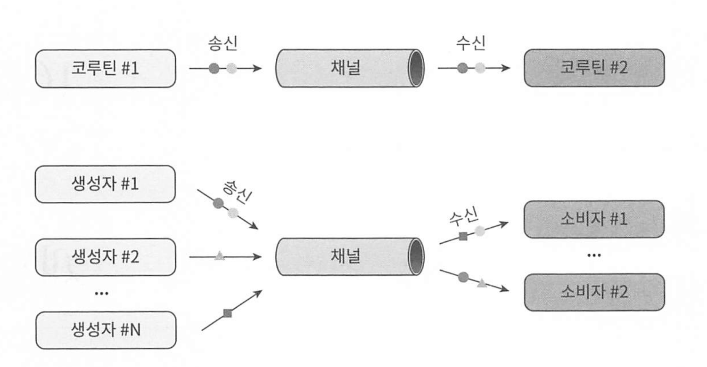

# 코틀린 코루틴 : Deep Dive

* 깃허브 : https://github.com/MarcinMoskala/coroutines_sources


# 1부 코틀린 코루틴 이해하기
## 1장 코틀린 코루틴을 배워야 하는 이유
스레드를 사용하는 비용은 매우 크다. 명시적으로 생성하고, 유지되어야 하며 스레드를 위한 메모리 할당도 되어야 한다.

또한 수백만의 요청의 응답할때마다 블로킹을 한다면 메모리와 프로세서 사용에 엄청난 비용이 든다.

10만개의 스레드를 생성하는것과 10만개의 코루틴을 생성하는 비용은 어마어마하게 차이가 난다. 

## 2장 시퀀스 빌더

코틀린의 sequence는 List, set과 비슷하지만 필요할 때마다 값을 하나씩 계산하는 lazy 처리를 한다.

특징은 다음과 같다.

* 요구되는 연산을 최소한으로 수행
* 무한정이 될 수 있음
* 메모리 사용이 효율적

```kotlin
val seq = sequence {
    yield(1)
    yield(2)
    yield(3)
}

fun main() {
    for (num in seq) {
        print(num)
    } // 123
}
```

시퀀스는 sequence 함수를 이용해 정의하며 yield함수를 호출하여 다음 값을 생성한다.


## 3장 중단은 어떻게 작동할까?

코루틴은 중단되었을 때 Continuation 객체를 반환하고, 이 객체를 이용하면 멈췄던 곳에서 다시 시작할 수 있다.

코루틴은 스레드와 다르다. 스레드는 저장이 불가능하고 멈추는것만 가능하다. 

다음 코드의 중단 지점은 어디일까

```kotlin
suspend fun main() {
    println("Before")

    suspendCancellableCoroutine<Unit> { continuation ->
        println("Before too")
        continuation.resume(Unit)
    }

    println("After")
}
```

* suspendCancellableCoroutine의 인자로 들어간 람다 함수는 중단되기 전에 실행된다. 

continuation.resume을 호출하면 중단된 코루틴을 실행한다. 

```kotlin
suspend fun main() {
    val i: Int = suspendCancellableCoroutine<Int> { c ->
        c.resume(42)
    }
    println(i) // 42

    val str: String = suspendCancellableCoroutine<String> { c ->
        c.resume("Some text")
    }
    println(str) // Some text

    val b: Boolean = suspendCancellableCoroutine<Boolean> { c ->
        c.resume(true)
    }
    println(b) // true
}
```

resume을 통해 반환되는 값은 반드시 지정된 타입과 같은 타입 이어야 한다. 

즉 중단함과 동시에 데이터를 받고 나면, 받은 데이터를 resume 함수로 통해 보내는것이다. 

### 예외로 재개하기 

suspendCoroutine에서 resumeWithException으로 예외를 받을  수 있다.

```kotlin
class MyException : Throwable("Just an exception")

suspend fun main() {
    try {
        suspendCancellableCoroutine<Unit> { cont ->
            cont.resumeWithException(MyException())
        }
    } catch (e: MyException) {
        println("Caught!")
    }
}
```

예를들어 api 네트워크 관련 예외로 던질 수 있다. 핸들러로 가라잇~

```kotlin
suspend fun main2() {
    try {
        suspendCancellableCoroutine<Unit> { cont ->
            if (true) {
                // api 에러 반환 
                cont.resumeWithException(MyException())
            } else {
                cont.resume(Unit)
            }
        }
    } catch (e: MyException) {
        println("Caught!")
    }
}
```

## 4장 코루틴의 실제 구현

- 중단 함수는 함수가 시작할 때와 중단 함수가 호출되었을 때 상태를 가진다 는 점에서 상태 머신(state machine)과 비슷합니다. (상태 패턴)
- 컨티뉴에이션(continuation) 객체는 상태를 나타내는 숫자와 로컬 데이터를 가지고 있습니다.
- 함수의 컨티뉴에이션 객체가 이 함수를 부르는 다른 함수의 컨티뉴에이션 객체를 장식(decorate)합니다. 그 결과, 모든 컨티뉴에이션 객체는 실행을 재개하거나 재개된 함수를 완료할 때 사용되는 콜 스택으로 사용됩니다.

코틀린 팀은 컨티뉴에이션 전달 방식을 택했다. CPS

서스펜드 함수를 자세하게 보면

```kotlin
suspend fun getUser(): User?
suspend fun setUser(user: User)
suspend fun checkAvailability(flight: Flight): Boolean

// under the hood is
fun getUser(continuation: Continuation<*>): Any?
fun setUser(user: User, continuation: Continuation<*>): Any
fun checkAvailability(
  flight: Flight,
  continuation: Continuation<*>
): Any
```

이렇게 컨티뉴에이션을 전달한다.

반환 타입이 Any? 또는 Any인 이유는 중단 함수 실행 도중 중단되면 값을 반환하지 않을 수 있기 때문이다. 이때 중단함수는 marker인 COROUTINE_SUSPENDED를 반환한다. 

아마도 언젠가 유니언 타입인 User? | COROUTINE_SUSPENDED 같은 타입을 도입하면 이렇게 바뀔것이다.

* 도입한다고 한다 ㅎ 

아래 예시를 보자

```kotlin
suspend fun myFunction() {
  println("Before")
  delay(1000) // suspending
  println("After")
}
// 벗기면 아래이다 
fun myFunction(continuation: Continuation<*>): Any
```

이 함수는 state(상태)를 저장하기 위해 자신만의 Continuation 객체가 필요하다. 

이제 이걸 row하게 까보면 아래처럼 된다.

```kotlin
// A simplified picture of how myFunction looks under the hood
fun myFunction(continuation: Continuation<Unit>): Any {
    val continuation = continuation as? MyFunctionContinuation
        ?: MyFunctionContinuation(continuation)

    if (continuation.label == 0) {
        println("Before")
        continuation.label = 1
        if (delay(1000, continuation) == COROUTINE_SUSPENDED){
            return COROUTINE_SUSPENDED
        }
    }
    if (continuation.label == 1) {
        println("After")
        return Unit
    }
    error("Impossible")
}
```

* 내부적으로 라벨을 맥여 처리를 하고 있다.

delay에 의해 중단된경우 COROUTINE_SUSPENDED를 반환한다. 

중단이 일어나면 콜 스택에 있는 모든 함수가 종료되며 중단된 코루틴을 실행하던 스레드를 실행 가능한 코드가 사용할 수 있게 된다. 


함수가 중간된 후에 다시 사용할 지역 변수나 파라미터와 같은 상태를 가지고 있다면 함수의 continuation 객체에 상태를 저장해야 한다.

````kotlin

suspend fun myFunction() {
  println("Before")
  var counter = 0
  delay(1000) // suspending
  counter++
  println("Counter: $counter")
  println("After")
}
```


```
//2
import java.util.concurrent.Executors
import java.util.concurrent.TimeUnit
import kotlin.coroutines.*

fun myFunction(continuation: Continuation<Unit>): Any {
    val continuation = continuation as? MyFunctionContinuation
        ?: MyFunctionContinuation(continuation)

    var counter = continuation.counter

    if (continuation.label == 0) {
        println("Before")
        counter = 0
        continuation.counter = counter
        continuation.label = 1
        if (delay(1000, continuation) == COROUTINE_SUSPENDED){
            return COROUTINE_SUSPENDED
        }
    }
    if (continuation.label == 1) {
        counter = (counter as Int) + 1
        println("Counter: $counter")
        println("After")
        return Unit
    }
    error("Impossible")
}
````

r간략화된 코드를 보면, 지역변수나 파라미터 같이 함수 내에서 사용되던 값들은 함수 내부 필드에 있다가 중단되기 직전에 저장되고 재개될 때 복구된다. 

### 콜스택 (call stack)

함수 a가 함수 b를 호출하면 a의 상태와 b가 끝나면 실행될 지점을 어딘가에 저장해야 한다. 이 정보들을 콜스택 이라는 자료구조에 저장한다.

코루틴을 중단하면 스레드를 반환해 콜 스택에 있는 정보가 사라진다. 

대신 컨티뉴 에이션 객체가 콜 스택의 역할을 대신한다.

중단이 되었을 때 상태(abel)과 함수의 지역 변수와 파라미터(필드) 그리고 중단 함수를 호출한 함수가 재개될 위치 정보를 가지고 있어 다행이다.

하나의 컨티뉴에이션 객체가 다른 하나를 참조하고, 참조된 객체가 또 다른 컨티뉴 에이션 객체를 참조한다.  

### 실제 코드

컨티뉴에이션 객체와 중단 함수를 컴파일한 실제 코드는 최적화 되어 있으며 몇가지 처리 과정이 더 포함되어있어 복잡하다

* 예외가 발생했을 때 더 나은 스택 트레이스 생성
* 코루틴 중단 인터셉션
* 사용하지 않는 변수 제거 및 테일콜 최적화


### suspend 함수의 성능과 비용

함수를 상태로 나누는 것은 숫자를 비교하는 것만큼 쉬운 일이며 실행점이 변하는 비용 또한 거의 들지 않는다.

지역 변수를 복사하지 않고 새로운 변수가 메모리 내 특정 값을 가리키게 한다.

즉 컨티뉴에이션 객체 생성시에만 비용이 좀 들지만 큰 문제는 아니다.

### 요약 및 결론

- 중단 함수는 상태 머신과 비슷해 함수가 시작될 때와 중단 함수를 호출한 뒤 의 상태를 가집니다.
- 상태를 나타내는 값과 로컬 데이터는 컨티뉴에이션 객체에 저장됩니다.
- 호출된 함수의 컨티뉴에이션 객체는 호출한 함수의 컨티뉴에이션을 장식합 니다. 그 결과, 모든 컨티뉴에이션 객체는 함수가 재개될 때 또는 재개된 함 수가 완료될 때 사용되는 콜 스택의 역할을 합니다.


## 5장 코루틴: 언어 차원에서의 지원 vs 라이브러리

라이브러리 없이 언어 차원에서도 지원한다.

suspendCoroutine, Continuation을 지원하지만 매우 로우하며, 애플리케이션 개발자보다 라이브러리 개발자들에게 더 적합하다.

때문에 kotlinx.coroutines 라이브러리가 있으며 훨씬 코루틴을 쉽게 사용할 수 있다

| 항목              | 언어 차원에서의 지원                                         | kotlinx.coroutines 라이브러리                                |
| ----------------- | ------------------------------------------------------------ | ------------------------------------------------------------ |
| **의존성**        | 코틀린 기본 라이브러리에 포함되어 있으며 별도의 의존성 추가가 필요 없다. | 컴파일러가 지원하며, 코틀린 기본 라이브러리에 의존성을 추가해야 한다. |
| **포함 패키지**   | `kotlin.coroutines` 패키지에 포함되어 있다.                  | `kotlinx.coroutines` 패키지에 포함되어 있다.                 |
| **제공 기능**     | `Continuation`, `suspendCoroutine` 등의 기본적인 기능들과 `suspend` 키워드만 제공한다. | `launch`, `async`, `Deferred` 등 다양한 기능을 제공한다.     |
| **사용 편의성**   | 직접 사용하기 매우 어렵다.                                   | 직접 사용하기 편리하게 설계되어 있다.                        |
| **동시성 스타일** | 거의 모든 동시성 스타일이 허용된다.                          | 단 하나의 명확한 동시성 스타일을 위해 설계되어 있다.         |

# 2부 코틀린 코루틴 라이브러리

## 6장 코루틴 빌더
모든 서스펜드 함수는 서스펜드 함수에 의해서만 호출되어야 한다.

서스펜드 함수를 연속으로 호출하면 시작되는 지점이 있는데 그곳이 바로 **코루틴 빌더이다.**

kotlinx.coroutines 라이브러리가 제공하는 3가지 필수적인 코루틴 빌더를 보자

* launch
* runBlocking
* async

### launch 빌더

launch가 작동하는 방식은 새 스레드를 시작하는것과 비슷하다.

각자 별개로 실행된다.

블로킹된 스레드를 유지하는건 비용이 들지만 중단된 코루틴을 유지하는건 거의 공짜다 ( 코루틴 구현을 봐라.)

### runBlocking 빌더

시작한 스레드를 중단시키는 코루틴 빌더이다.

정확하게 말하면, 새로운 코루틴을 실행한 뒤 완료될 때까지 현재 물고있는 스레드를 중단 가능한 상태로 블로킹 한다. 

주로 다음과 같은 사유로 사용된다

* 프로그램 종료 방지 위해 스레드 블로킹
* 유닛 테스트 블로킹
* 일반 함수에서 서스펜드 함수 호출시 


### async 빌더

launch와 비슷하지만 값을 생성하여 반환한다. 

Deffered<T> 객체를 반환하며 작업이 끝나면 값을 반환하는 메서드인데 await가 있다. 

async 빌더는 호출되자마자 코루틴을 즉시 시작한다.

따라서 여러 작업을 이용해 호출하는데 도움된다 


### 현업에서의 코루틴 사용

큰 애플리케이션에서는 코루틴 스코프를 직접 만들어 사용한다.

첫번째 빌더가 스코프에 시작되면 다른 빌더가 첫 빌더의 스코프에서 시작될 수 있다. 

### coroutineScope 사용하기

스코프가 필요하지만, 함수의 인자로 스코프를 넘기고 싶지 않다면 중단함수 밖에서 coroutineScope 함수를 사용한다

```kotlin
suspend fun getArticlesForUser(
    userToken: String?,
): List<ArticleJson> = coroutineScope {
    val articles = async { articleRepository.getArticles() }
    val user = userService.getUser(userToken)
  
    articles.await()
        .filter { canSeeOnList(user, it) }
        .map { toArticleJson(it) }
}
```

## 7장 코루틴 컨텍스트

코루틴 빌더의 시그니처를 보면 첫번째 파라미터가 CoroutineContext다

```kotlin
public fun CoroutineScope.launch( // 확장함수 
    context: CoroutineContext = EmptyCoroutineContext,
    start: CoroutineStart = CoroutineStart.DEFAULT,
    block: suspend CoroutineScope.() -> Unit // 리시버 
): Job 

public fun <T> CoroutineScope.async( // 확장함수 
    context: CoroutineContext = EmptyCoroutineContext,
    start: CoroutineStart = CoroutineStart.DEFAULT,
    block: suspend CoroutineScope.() -> T // 리시버 
): Deferred<T> 
```

마지막 인자의 리시버도 CoroutineScope 타입이다. 


### CoroutineContext 인터페이스

CoroutineContext는 원소나 원소들의 집합을 나타내는 인터페이스

Job CoroutineName, CoroutineDispatcher 같은 element 또한 CoroutineContext다

두개의 CoroutineContext 인터페이스를 더하면 합쳐 하나의 CoroutineContext가 된다 

### 컨텍스트 폴딩 

fold란 함수형 프로그래밍에서 많이 사용하는 패턴으로, 리스트나 컬렉션 모든 요소를 하나의 값으로 축약하는 연산을 의미한다.

이 fold를 이용해서 여러 CoroutineContext를 합쳐 하나의 CoroutineContext를 만든다. 

### Suspend 함수에서 컨텍스트에 접근하기

CoroutineScope는 Context에 접근할 때 사용하는 coroutineContext 프로퍼티를 가지고 있으며, 컨텍스트는 suspend 함수 사이에 전달되는 continuation 객체가 참조하고 있어 접근이 가능하다. 

## 8장 잡과 자식 코루틴 기다리기

구조화된 동시성에서 부모-자식 관계는 다음 특성을 갖는다.

- 자식은 부모로부터 컨텍스트를 상속받습니다.
- 부모는 모든 자식이 작업을 마칠 때까지 기다립니다.
- 부모 코루틴이 취소되면 자식 코루틴도 취소됩니다.
- 자식 코루틴에서 에러가 발생하면, 부모 코루틴 또한 에러로 소멸합니다.

이 특성은 Job (Context)와 관련이 있다.

Job은 생명주기를 가지며 취소 가능하다. 


## 9장 코루틴 취소

코틀린 코루틴이 제시한 중단함수의 취소방식은 아주 간단하고 편리하며 안전하다.

Job 인터페이스는 cancel 메서드를 가지고 있어 Deferred도 cancel 메서드가 있다.

다음과 같은 효과를 가져올 수 있다.

- 호출한 코루틴은 첫 번째 중단점(아래 예제에서는 deLay)에서 잡을 끝냅 니다.
- 잡이 자식을 가지고 있다면, 그들 또한 취소됩니다. 하지만 부모는 영향을 받지 않습니다.
- 잡이 취소되면, 취소된 잡은 새로운 코루틴의 부모로 사용될 수 없습니다.
   취소된 잡은 Canceling 상태가 되었다가 Cancelled 상태로 바뀝니다.

```kotlin
suspend fun main(): Unit = coroutineScope {
    val job = launch {
        repeat(1_000) { i ->
            delay(200)
            println("Printing $i")
        }
    }

    delay(1100)
    job.cancel()
    job.join()
    println("Cancelled successfully")
}

```

cancel 메서드 인자로 예외를 넣으면 원인을 명확하게 할 수 있다.

```kotlin
 public fun cancel(cause: CancellationException? = null)

    /**
     * @suppress This method has bad semantics when cause is not a [CancellationException]. Use [cancel].
     */
    @Deprecated(level = DeprecationLevel.HIDDEN, message = "Since 1.2.0, binary compatibility with versions <= 1.1.x")
    public fun cancel(cause: Throwable? = null): Boolean
```

cancel이 호출된 뒤 취소과정이 완료되는걸 기다리기 위해 join을 호출해야 한다. join을 호출하지 않으면 경쟁 상태에 빠질 수 있다. 

job.join을 추가하면 코루틴이 취소를 마칠때까지 중단되므로 경쟁 상태가 발생하지 않는다. 

간단한 방법으로 cancelAndJoin()을 호출하면 된다 그냥.

```kotlin
job.cancelAndJoin()
```

코루틴이 취소되었을 때도 반드시 실행해야 하는 작업이 있다면, 그 코드를 **`withContext(NonCancellable)`**로 감싸서 **취소되지 않고 실행**될 수 있도록 해야 한다

**코루틴이 취소되면**: 보통 코루틴이 취소되면 모든 작업이 중단됩니다. 즉, 어떤 코드를 실행하려고 해도 취소 상태에서는 제대로 실행되지 않을 수 있습니다.

**중단 함수가 필요할 때**: 하지만 취소된 후에도 **꼭 실행해야 하는 작업**이 있을 수 있습니다. 예를 들어, 데이터베이스 작업이 실패하면 그동안 변경된 데이터를 롤백해야 하죠. 이 작업을 취소된 코루틴 상태에서 하려고 하면 실행이 안 될 수 있습니다.

**`withContext(NonCancellable)`의 역할**: 이때 `withContext(NonCancellable)`를 사용합니다. 이 코드는 **특정 코드 블록이 취소되지 않도록 보호**해줍니다. 즉, 코루틴이 취소된 상태여도 이 블록 안의 코드는 **취소되지 않고** 실행됩니다. 덕분에 중단 함수도 블록 내부에서 제대로 호출할 수 있게 됩니다.

```kotlin
suspend fun performDatabaseOperation() {
    try {
        // 데이터베이스에 변경사항 적용
    } catch (e: Exception) {
        // 코루틴이 취소되었어도 롤백은 반드시 수행해야 함
        withContext(NonCancellable) {
            rollbackDatabaseChanges()
        }
    }
}
```

### invokeOnCompletion

자원을 해제하는데 자주 사용되는 또 다른 방법은 invokeOnCompletion메서드다.

invokeOnCompletion메서드는 Jobdㅣ Completed나 Cancelled와 같은 마지막 상태에 도달했을 때 호출될 핸들러를 지정하는 역할을 한다

```kotlin
suspend fun main(): Unit = coroutineScope {
  val job = launch {
    delay(1000)
  }
  
  job.invokeOnCompletion { exeception: Throwable? ->
    println("finished")
  }
  delay(400)
  job.cancelAndJoin()
}
```

* throwable은 job이 예외없이 끝나면 null이다
* 코루틴이 취소되었으면 CancellationException이다
* 코루틴을 종료시킨 또다른 예외일 수 잇다.

### 취소할수 없는 Job 취소하기 yield, job.isActive, ensureActive()

중단 가능하지않으면서, CPU 집약적이거나 시간 집약적인 연산들이 suspend 함수에 있따면 각 연산들 사이에 yield를 사용하는것이 좋다. 그래야 중단 가능하기 때문이다. yield가 없으면 절대 코루틴이 스레드를 양보하지 않기 때문에 취소 등을 알 수 없다

```kotlin
suspend fun cpuIntensiveOperations() = 
	withContext(Dispatcher.Default) {
    cpuRun()
    yield()
    cpuRun()
    yield()
    cpuRun()
  }
```

또는

```kotlin
suspend fun cpuIntensiveOperations() = coroutinScope {
  val job = Job()
  launch(job) {
    do {
      Thread.sleep(200)
    } while(isActive)
  }
}
```

또는

```kotlin
suspend fun cpuIntensiveOperations() = coroutinScope {
  val job = Job()
  launch(job) {
    while(true) {
      ensureActive()
      println("")
    }
  }
}
```

일반적으로 ensureActive()가 가벼워 제일 많이 쓰이고, yield함수는 최상위 중단 함수이고, 스코프가 필요 없어서 스레드가 바뀌는 문제가 생길수도 있다.


yield는 cpu 사용량이 크거나 스레드를 블로킹하는 중단 함수에서 자주 사용된다

## 10장 예외 처리

잡히지 않은 예외가 발생하면 코루틴은 종료된다. 

코루틴은 부모도 종료시키며 취소된 부모는 자식들 모두를 취소시킨다.


코루틴이 종료되기 전 예외를 잡는거 도움이 되지만 늦으면 손 쓸 수 없다.

코루틴 빌더인 async, launch를 try-catch로 래핑하는건 전혀 도움이 안되고 빌더 내부에서 잡아야 한다

```kotlin
fun main() = runBlocking {
  try {
    launch {
      delay(100)
      throw Error("error")
    }
  } catch (e: Throwable) { // 전혀 도움이 안됌. 
    println("예외를 잡았을까? ")
  }
}
// 위는 x

fun main() = runBlocking {

   launch {
		 try {
     	delay(100)
     	throw Error("error")
     } catch (e: Throwable) {
       println("good")
     }
   }
 
}

```

때문에 내부에서 잡아야 한다 

### SupervisorJob

supervisorJob을 사용하면 자식에서 발생한 모든 예외를 무시할 수 있다. 


* 코루틴 6번이 예외가 발생해서, 일반적으로 예외 처리가 안되어 있으면 코루틴3, 코루틴1까지 예외가 전파되어서 모두 취소되지만 SupervisorJob은 무시하기 때문에 형제 코루틴인 5, 7도 전파되지 않아 취소되지 않는다

때문에 일반적으로 SupervisorJob은 다수의 코루틴을 시작하는 스코프로 사용된다

다음처럼 SuperVisorjob을 부모 코루틴의 인자로 사용하면 안된다.

```kotlin
fun main(): Unit = runBlocking {
    // 이렇게 작성하면 안된다 
  // 자식 코루틴 하나가 있고 부모 코루틴이 없는 잡은 일반 잡과 동일하게 작동한다. 
    launch(SupervisorJob()) { // 1
        launch {
            delay(1000)
            throw Error("Some error")
        }

        launch {
            delay(2000)
            println("Will not be printed")
        }
    }

    delay(3000)
}
```

왜냐하면 `runBlocking`이 부모 코루틴이기 때문에, 이 코드 구조에서는 `SupervisorJob`이 제대로 작동하지 않게 된다. 그리고 이 경우 runBlocking의 잡을 사용하지 않기 때문에 예외는 runBlockingdㅡ로 전파되지 않는다.

```kotlin
fun main(): Unit = runBlocking {
    val job = SupervisorJob()

    launch(job) {
        delay(1000)
        throw Error("Some error")
    }

    launch(job) {
        delay(2000)
        println("Will not be printed")
    }

    delay(3000)
}
```

위 코드는 수퍼바이저잡이 되어서 

```kotlin
fun main(): Unit = runBlocking {  // 부모 코루틴, runBlocking 자체도 잡을 가지고 있음
    val job = SupervisorJob()     // SupervisorJob 생성 (자식 잡)

    launch(job) {  // 첫 번째 자식 코루틴, 부모 잡은 SupervisorJob
        delay(1000)
        throw Error("Some error")  // 1초 후 예외 발생, 하지만 다른 코루틴에 영향 없음
    }

    launch(job) {  // 두 번째 자식 코루틴, 부모 잡은 SupervisorJob
        delay(2000)
        println("Will not be printed")  // 2초 후 출력 시도 (출력되지 않음)
    }

    delay(3000)  // runBlocking이 자식 코루틴들이 끝날 때까지 기다림
}
```

이런식으로 설명할 수 있다. 

또다른 방법으로 supervisorScipe가 있다

### SupervisorScope

예외 전파를 막는 또다른 방법이다. 다른 코루틴에서 발생한 예외를 무시하고 부모와의 연결을 유지한다. 

```kotlin
fun main(): Unit = runBlocking {
    supervisorScope { // here
        launch {
            delay(1000)
            throw Error("Some error")
        }
        launch {
            delay(2000)
            println("Will be printed")
        }
        launch {
            delay(2000)
            println("Will be printed")
        }
    }
    println("Done")
}

```

* 수퍼바이저스코프는 자식에게 예외 전파를 안함. 부모한테도 안가기 때문 

수퍼바이즈스코프의 목적은, 서로 무관한 다수의 작업을 스코프 내에서 실행하는것,

supervisorScope는 withContext(SupervisorJob))으로 대체될 수 없다

```kotlin
suspend fun send(
	noties : List<Noti>
) = withContext(SupervisorJob()) {
  for (notification in noties) {
    launch {
      client.send(notification)
    }
  }
}
```

위 코드는 매우 주의해야 한다  Job이 상속되지 않는 유일한 컨텍스트이기 때문이다.


SupervisorJob이 withContext의 부모가 되어서, 자식에서 예외 발생시 withContext 코루틴으로 전달이 되며, Job이 취소되고 자식 코루틴 또한 전부 취소되며 마지막에 예외가 던져진다.


### CancellationException은 부모까지 전파되지 않는다

예외가 CancellationException의 서브클래스라면 부모로 전파되지 않고 현재 코루틴을 취소시킨다. open class이기 때문에 마음껏 확장할 수 있다. 


### 코루틴 예외 핸들러 CoroutineExceptionHandler

예외 전파를 중단시키지는 않지만 예외가 발생했을 때 해야 할 것들을 정의하는데 사용 가능하다.


## 11장 코루틴 스코프 함수

GlobalScope는 사용하면 안된다. 

그저 EmptyCoroutineContext를 가진 스코프일 뿐이다.

```kotlin
@DelicateCoroutinesApi
public object GlobalScope : CoroutineScope {
    /**
     * Returns [EmptyCoroutineContext].
     */
    override val coroutineContext: CoroutineContext
        get() = EmptyCoroutineContext
}
```

GlobalScope에서 async를 호출하면 부모 코루틴과 아무런 관계가 없다.

이 async 코루틴은 

* 취소될 수 없다 (부모가 취소되어도 async 내부의 함수가 실행중이 되므로 자원 낭비 )
* 부모로부터 스코프를 상속받지 않음. 항상 기본 디스패처에서 실행됌

이것의 결과로 안좋은 점은

* 메모리 누수 및 cpu 낭비
* 단위테스트하는 도구가 작동하지 않아 테스트가 어려움 


아래처럼 인자로 넘기면 어떨까?

```kotlin
suspend fun getUserProfile(
	scope: CoroutineScope
) : UserProfileData {
  val user = async {get() }
  val notifications = async {getNotifications()}
}
```

단위테스트는 가능하지만, 스코프가 함수에서 함수로 전달되어서 예상하지 못한 부작용이 발생할 수 있다.

async에서 예외가 발생시 모든 스코프가 닫히거나 (SuperVisorJobdㅣ 아닐 때) cancel 등 을통해 스코프를 취소하는 문제도 생길 수 있다.

### 코루틴 스코프 함수

supervisorScope : Job대신 SuperVisorJob을 사용

withContext : 코루틴 컨텍스트를 바꿀 수 있는 coroutineScope

withTimeout : 타임아웃이 있는 coroutineScope

| **코루틴 빌더**(runBlocking 제외)              | **코루틴 스코프 함수**                                      |
| ---------------------------------------------- | ----------------------------------------------------------- |
| launch, async, produce                         | coroutineScope, supervisorScope,, withContext, withTimeout  |
| CoroutineScope의 확장 함수                     | 중단 함수                                                   |
| CoroutineScope 리시버의 코루틴 컨텍스트를 사용 | 중단 함수의 컨티뉴에이션 객체가 가진 코루틴 컨텍스트를 사용 |
| 예외는 Job을 통해 부모로 전파됨                | 일반 함수와 같은 방식으로 예외를 던짐                       |
| 비동기인 코루틴을 시작함                       | 코루틴 빌더가 호출된 곳에서 코루틴을 시작함                 |

### withContext

현재 실행 중인 코루틴의 **컨텍스트를 변경**하여 다른 디스패처나 컨텍스트에서 코드를 실행하고, 작업이 끝나면 원래 컨텍스트로 돌아가는 역할을 합니다. 즉, 특정 작업을 다른 스레드나 디스패처에서 수행하고 싶은 경우에 사용됩니다.

withContext는 coroutineScope와 비슷하지만 스코프의 컨텍스트를 변경할 수 있다는 점에서 다르다

withContext의 인자로 Context를 제공하면, 부모 스코프의 Context를 대체한다.

#### **`withContext`의 특징**

- **컨텍스트 변경**: `withContext`는 지정된 코루틴 컨텍스트(예: 디스패처)에서 블록 내의 코드를 실행합니다.
- **중단 함수**: `withContext`는 중단 함수이므로 다른 코루틴 스레드에서 실행될 수 있으며, 호출한 코루틴은 `withContext` 블록이 완료될 때까지 일시 중단됩니다.
- **안전한 실행**: `withContext`는 예외 처리 및 자원 관리를 더 쉽게 하며, 예외가 발생하면 해당 코루틴 블록이 끝나고 호출한 곳으로 예외가 전달됩니다.

withContext`를 사용하는 이유*

1. **다른 디스패처에서 작업 수행**: CPU 집약적인 작업이나 IO 작업을 다른 스레드에서 실행하고 싶을 때 사용합니다. 예를 들어, 파일을 읽거나 네트워크 요청을 처리할 때는 `Dispatchers.IO`, CPU 집약적인 계산을 할 때는 `Dispatchers.Default`에서 작업을 실행할 수 있습니다.
2. **비동기 처리의 간결화**: `withContext`는 비동기적인 스레드 전환을 명시적으로 처리할 수 있도록 돕습니다. 특정 작업을 다른 디스패처에서 실행하고자 할 때 쉽게 사용할 수 있어 코드 가독성을 높입니다.
3. **작업 분리**: CPU 작업과 IO 작업을 적절히 분리하여 성능을 최적화하고, 병렬적으로 수행할 수 있도록 돕습니다. 예를 들어, UI 스레드에서는 CPU 연산이나 네트워크 호출을 피하고, 이러한 작업을 별도의 스레드에서 수행하여 애플리케이션의 응답성을 높일 수 있습니다.

### supervisorScope

수퍼바이저스코프는 부모에게 예외가 전달되지 않아 예외가 전파되어 취소되는일이없다.

주로 서로 독립적인 작업을 시작하는 함수에서 사용한다.


## 12장 디스패처

디스패처는 스케줄러와 비슷한 개념으로 코루틴을 실행시킬 스레드를 결정하는 역할을 한다.


기본 디스패처로 CPU 집약 연산을 위한 Dispatchers.Default다.

Disatchers.IO는 IO연산을위한 디스패처다. 

블로킹 함수 호출시 withContext(Dispatchers.IO)로 사용해 suspend 함수로 만들어 사용한다.  


Dispatchers.Default의 LimitedParalLelism은 디스패처에 스레드 수 제한을 추가합니다.

Dispatchers.Io의 LimitedParalLelism은 Dispatchers.IO와 독립적인 디스패처를 만듭니다.

하지만 모든 디스패처는 스레드가 무제한인 스레드 풀을 함께 공유합니다.


limitedParallism는 스레드를 블로킹하는경우가 잦은 클래스에서 자기만의 한도를 가진 커스텀 디스패처를 정의할때 사용한다. 한도에 정해진 답은 없다. 이때 사용하는 limited는 다른 디스패처와 무관하므로 한 서비스가 다른 서비스를 블로킹하는경우는없다. 


### virtual thread와 코루틴 (가상스레드, 프로젝트 룸 )

```kotlin
val LoomDispatcher = Executors.newVirtualThreadPerTaskExecutor()
.asCoroutineDispatcher()
```


### Unconfined Dispatcher

이 디스패처는 스레드를 바꾸지 않는다. 시작한 스레드에서 실행이되며 재개되었을때는 재개한 스레드에서 실행된다. 

이 Unconfined Dispatcher는 단위테스트할때 유용하다. 

모든 작업이 같은 스레드에서 실행되기 때문에 순서를 통제할 수 있다. 


### Continuation Interceptor

코루틴 디스패칭은 컨티뉴에이션 인터셉션을 기반으로 작동한다.

ContinuationInterceptor라는 코루틴 컨텍스트는 코루틴이 중단되었을 때 interceptContinuation 메서드로 컨튜네이션 객체를 수정하고 포장한다. releaseInterceptedContinuation 메서드는 컨티네이션이 종료되었을때 호출된다.

```kotlin
public interface ContinuationInterceptor : CoroutineContext.Element {

    companion object Key : CoroutineContext.Key<ContinuationInterceptor>

    public fun <T> interceptContinuation(continuation: Continuation<T>): Continuation<T>

    public fun releaseInterceptedContinuation(continuation: Continuation<*>) {
        /* do nothing by default */
    }
```


## 13장 코루틴 스코프 만들기


CoroutineScope는 인터페이스다.

인터페이스를 구현해 쓸순 있지만 그러면 안된다. cancel이나 ensureActive같은 다른 메서드를 직접 호출시 문제가 발생한다.

스코프 인스턴스를 프로퍼티로 가지고 있다 코루틴 빌더를 호출할때 사용하는 방법이 선호된다

```kotlin

class SomeClass {
  val scope; CoroutineScope
  
  fun start() {
    scope.launch {
      
    }
  }
}
```

### 스프링 백엔드에서 코루틴 스코프 만들기

필요한것

- 스레드 풀(또는 Dispatchers.Default)을 가진 커스텀 디스패처
- 자각의 코루틴을 독립적으로 만들어 주는 SupervisorJob
- 적절한 에러 코드에 응답하고, 데드 레터2를 보내거나, 발생한 문제에 대해 로그를 남기는 CoroutineExceptionHandler


```kotlin
@Configuration
class CoroutineScopeConfig {
  @Bean
  fun coroutineDispatcher(): CoroutineDispatcher = Dispatchers.IO.limitedParallelism(5)
  
  @Bean
  fun coroutineExceptionHandler() = 
  	CoroutineExceptionHandler {_, throwable -> 
    	// todo                           
		}
  
  @Bean
  fun corotineScope(
  	coroutineDispatcher: CoroutineDispatcher,
    coroutineExceptionHandler: CoroutineExceptionHandler,
  ) = CoroutineScope (
  	SupervisorJob() + coroutineDispatcher + coroutineExceptionHandler
  )
}
```


## 14장 공유 상태로 인한 문제

공유 변수를 사용해야 하는 경우 ArtomicReference 등으로 막아놓는것이 좋다.


싱글 스레드 디스패처를 이용하는 방법 중  fine-grained thread confinement 방법이 있다. 

상태를 변경하는 구문들만 래핑해서 사용하는 방법이다. 

```kotlin
class UserDownloader(
    private val networkService: NetworkService
) {
    private val users = mutableListOf<User>()
    private val dispatcher = Dispatchers.IO.limitedParallelism(1)
    
    suspend fun downloaded(): List<User> =withContext(dispatcher){
        users.toList()
    }
    
    suspend fun fetchUser(id: Int) {
        val newUser = networkService.fetchUser(id)
        
	       withContext(dispatcher) {
        	users += newUser   
        }
				
    }
}
```

또다른 방법으로 Mutext와 Semaphore가 있다.

```kotlin
val mutex = Mutext()

suspend fun delayAndPrint() {
	mutex.lock()
  delay(1000)
  println("Done")
  mutext.unlock()
}

suspend fun test() {
	mutext.withLock {
  	counter++
	}
}
```

lock과 unLock을 직접 사용하는건 위험으로 withLock이 좋다 

synchronized 블록과 달리 뮤텍스의 이점은 스레드 블로킹 대신 코루틴을 중단시키는것이라 더 안전하고 가볍다. 

뮤텍스 사용시 주의할점은 교착상태이다.

```kotlin
import kotlinx.coroutines.sync.Mutex
import kotlinx.coroutines.sync.withLock

suspend fun main() {
    val mutex = Mutex()
    println("Started")
    mutex.withLock {
        mutex.withLock {
            println("Will never be printed")
        }
    }
}
// Started
// (runs forever)
```

* 중지되지 않는다.

두번째 문제점은 코루틴이 중단되면 뮤텍스를 풀수없다. 

전체 함수를 뮤텍스로 래핑하지 말고 사용하자.

```kotlin
    private val mutex = Mutex()

    override suspend fun updateUser(
        userId: String,
        userUpdate: UserUpdate
    ): Unit = mutex.withLock {
        val currentUser = getUser(userId) // Deadlock!
        deleteUser(userId) // Deadlock!
        addUser(currentUser.updated(userUpdate)) // Deadlock!
    }

    override suspend fun getUser(
        userId: String
    ): User = mutex.withLock {
        // ...
    }

    override suspend fun deleteUser(
        userId: String
    ): Unit = mutex.withLock {
        // ...
    }

    override suspend fun addUser(
        user: User
    ): User = mutex.withLock {
        // ...
    }
```

이러면 바로 데드락이다.

- 그런데 이 함수들(`getUser`, `deleteUser`, `addUser`) 각각도 `mutex.withLock`을 사용하고 있습니다.
- `Mutex`는 비재진입적이므로, `updateUser`가 잠금을 획득한 상태에서 내부에서 `getUser`, `deleteUser`, `addUser`를 호출하면서 다시 잠금을 시도하면, 동일한 코루틴이나 스레드에서 이미 잠금을 획득했기 때문에 데드락이 발생하게 됩니다.

### 


## 15장 코틀린 코루틴 테스트하기


### 취소와 컨텍스트 전달 테스트하기

특정 함수가 구조화된 동시성 지키고있는지 테스트하려면, 서스펜드함수로부터 컨텍스트를 받은 뒤 컨텍스트가 기대한 값을 가지고 있는지 확인하는것이 가장 쉽다

```kotlin
@Test
fun `should support context propagation`() = runTest {
    var ctx: CoroutineContext? = null
    
    val name1 = CoroutineName("Name 1")
    withContext(name1) {
        listOf("A").mapAsync {
            ctx = currentCoroutineContext()
            it
        }
        assertEquals(name1, ctx?.get(CoroutineName))
    }
    
    val name2 = CoroutineName("Some name 2")
    withContext(name2) {
        listOf(1, 2, 3).mapAsync {
            ctx = currentCoroutineContext()
            it
        }
        assertEquals(name2, ctx?.get(CoroutineName))
    }
}
```

취소를 확인하는 법은 내부에서 잡을 참조하고, 외부코루틴에서 취소한 뒤 참조 된 잡의 상태를 확인한다

```kotlin
@Test
fun `should support cancellation`() = runTest {
    var job: Job? = null
    
    val parentJob = launch {
        listOf("A").mapAsync {
            job = currentCoroutineContext().job
            delay(Long.MAX_VALUE)
        }
    }
    
    
    delay(1000)
    parentJob.cancel()
    assertEquals(true, job?.isCancelled)
}
```

함수가 실제로 디스패처를 바꾸는 건 어떻게 확인할까요? 호출하는 함수를 모 킹하여, 사용한 스레드의 이름을 가지고 오는 방법으로 확인할 수 있습니다.

```kotlin
@Test
fun `should change dispatcher`() = runBlocking {
    // given
    val csvReader = mockk<CsvReader>()
    val startThreadName = "MyName"
    var usedThreadName: String? = null
    every {
        csvReader.readCsvBlocking(
            aFileName,
            GameState::class.java
        )
    } coAnswers {
        usedThreadName = Thread.currentThread().name
        aGameState
    }
    val saveReader = SaveReader(csvReader)

    // when
    withContext(newSingleThreadContext(startThreadName)) {
        saveReader.readSave(aFileName)
    }

    // then
    assertNotNull(usedThreadName)
    val expectedPrefix = "DefaultDispatcher-worker-"
    assert(usedThreadName!!.startsWith(expectedPrefix))
}

```

### 새로운 코루틴을 시작하는 함수 테스트하기

```kotlin
@Scheduled(fixedRate = 5000)
fun sendNotifications() {
    notificationsScope.launch {
        val notifications = notificationsRepository
            .notificationsToSend()
        for (notification in notifications) {
            launch {
                notificationsService.send(notification)
                notificationsRepository
                    .markAsSent(notification.id)
            }
        }
    }
}

@Test
fun testSendNotifications() {
    // given
    val notifications = List(100) { Notification(it) }
    val repo = FakeNotificationsRepository(
        delayMillis = 200,
        notifications = notifications,
    )
    val service = FakeNotificationsService(
        delayMillis = 300,
    )
    val testScope = TestScope()
    val sender = NotificationsSender(
        notificationsRepository = repo,
        notificationsService = service,
        notificationsScope = testScope
    )

    // when
    sender.sendNotifications()
    testScope.advanceUntilIdle()

    // then all notifications are sent and marked
    assertEquals(
        notifications.toSet(),
        service.notificationsSent.toSet()
    )
    assertEquals(
        notifications.map { it.id }.toSet(),
        repo.notificationsMarkedAsSent.toSet()
    )

    // and notifications are sent concurrently
    assertEquals(700, testScope.currentTime)
}
```


# 3부 채널과 플로우
## 16장 채널

코루틴끼리의 통신을 위한 방법. 

채널은 송신자와 송신자의 수에 제한이 없으며 채널을 통해 전송된 모든 값은 한번만 받을 수 있다.



Channel은 두 개의 서로 다른 인터페이스를 구현한 하나의 인터페이스입니다.

- SendChannel은 원소를 보내거나(또는 더하거나) 채널을 닫는 용도로 사용됩 니다.
- ReceiveChannel은 원소를 받을 때(또는 꺼낼 때) 사용됩니다.

```kotlin
interface SendChannel<in E> {
    suspend fun send(element: E)
    fun close(): Boolean
    //...
}

interface ReceiveChannel<out E> {
    suspend fun receive(): E
    fun cancel(cause: CancellationException? = null)
    // ...
}

interface Channel<E> : SendChannel<E>, ReceiveChannel<E>
```

* receive호출시 채널에 원소가 없다면 원소가 들어올때까지 코루틴은 중단된다
* send는 채널 용량이 다차면 중단된다.

```kotlin
import kotlinx.coroutines.*
import kotlinx.coroutines.channels.Channel

suspend fun main(): Unit = coroutineScope {
    val channel = Channel<Int>()
    launch {
        repeat(5) { index ->
            delay(1000)
            println("Producing next one")
            channel.send(index * 2)
        }
    }

    launch {
        repeat(5) {
            val received = channel.receive()
            println(received)
        }
    }
}
```

채널은 반드시 닫아야 하늗네 닫는걸 깜빡할 수 있다.

예외로 인해 코루틴이 원소 보내는걸 중단하면 다른 코루틴은 영원히 기다려야 한다.

이걸 방지하기 위해 produce 함수를 사용하는것이 좀더 편리하다. 

```kotlin
import kotlinx.coroutines.channels.produce
import kotlinx.coroutines.*

suspend fun main(): Unit = coroutineScope {
    val channel = produce {
        repeat(5) { index ->
            println("Producing next one")
            delay(1000)
            send(index * 2)
        }
    }

    for (element in channel) {
        println(element)
    }
}
```

### 채널 타입

설정한 용량 크기에 따라 4가지로 구분 가능하다

- 무제한(Unlimited): 제한이 없는 용량 버퍼를 가진 Channel.UNLIMITED로 설 정된 채널로, send가 중단되지 않습니다.
- 버퍼(Buffered): 특정 용량 크기 또는 
  Channel.BUFFERED(기본값은 64이며 JVM의 Kotlinx.coroutines.channels.defaultBuffer를 설정하면 오버라이 드할 수 있습니다)로 설정된 채널
- 랑데뷰(Rendezyous)?: 용량이 0이거나 ChanneL.RENDEZVOUS(용량이 0입니 다)인 채널로, 송신자와 수신자가 만날 때만 원소를 교환합니다(책장이 아 넌 책을 교환하는 장소와 비슷합니다).
- 융합(Conflated): 버퍼 크기가 1인 ChanneL.CONFLATED를 가진 채널로, 새로 운 원소가 이전 원소를 대체합니다.

### 버퍼 오버플로 옵션

채널을 커스텀화하기 위해 버퍼가 꽉 찼을 때(onBufferOverflow 파라미터)의 행동을 정의할 수 있습니다. 다음은 오버플로와 관련된 옵션입니다.

- SUSPEND(기본 옵션): 버퍼가 가득 찼을 때, send 메서드가 중단됩니다.
- DROP_OLDEST: 버퍼가 가득 찼을 때, 가장 오래된 원소가 제거됩니다.
- DROP_LATEST: 버퍼가 가득 찼을 때, 가장 최근의 원소가 제거됩니다.

```kotlin
suspend fun main(): Unit = coroutineScope {
    val channel = Channel<Int>(
        capacity = 2,
        onBufferOverflow = BufferOverflow.DROP_OLDEST
    )

    launch {
        repeat(5) { index ->
            channel.send(index * 2)
            delay(100)
            println("Sent")
        }
        channel.close()
    }

    delay(1000)
    for (element in channel) {
        println(element)
        delay(1000)
    }
}
```

### 팬아웃

여러개의 코루틴이 하나의 채널로부터 원소를 받을수도 있다. 원소를 적절히 처리하려면 반드시 for 루프를 사용해야 한다 (consumeEach는 여러 코루틴이 사용하기에 안전하지 않다. )

```kotlin
fun CoroutineScope.produceNumbers() = produce {
    repeat(10) {
        delay(100)
        send(it)
    }
}

fun CoroutineScope.launchProcessor(
    id: Int,
    channel: ReceiveChannel<Int>
) = launch {
    for (msg in channel) {
        println("#$id received $msg")
    }
}

suspend fun main(): Unit = coroutineScope {
    val channel = produceNumbers()
    repeat(3) { id ->
        delay(10)
        launchProcessor(id, channel)
    }
}
```

채널은 코루틴들을 FIFO 큐로 가져 순차적으로 원소를 받는다.


### 팬인

여러 코루틴이 하나의 채널로 원소를 전송할 수 있다.

```kotlin
suspend fun sendString(
    channel: SendChannel<String>,
    text: String,
    time: Long
) {
    while (true) {
        delay(time)
        channel.send(text)
    }
}

fun main() = runBlocking {
    val channel = Channel<String>()
    launch { sendString(channel, "foo", 200L) }
    launch { sendString(channel, "BAR!", 500L) }
    repeat(50) {
        println(channel.receive())
    }
    coroutineContext.cancelChildren()
}

```

### 파이프라인

한 채널로 부터 받은 원소를 다른 채널로 전송한다

```kotlin
// 이 함수는 코루틴 스코프에서 정수를 생성하는 채널을 반환하는 함수입니다.
// ReceiveChannel<Int>는 숫자를 보내고 받을 수 있는 채널을 의미합니다.
// produce 빌더를 사용하여 코루틴을 시작하고, 1부터 3까지의 숫자를 채널로 보냅니다.
fun CoroutineScope.numbers(): ReceiveChannel<Int> =
    produce {
        repeat(3) { num -> // 3번 반복
            send(num + 1) // 1, 2, 3을 채널로 보냄
        }
    }

// 이 함수는 주어진 정수 채널(numbers)의 값을 제곱한 값을 반환하는 채널을 생성합니다.
// receiveChannel을 받아 produce를 통해 새 채널을 반환합니다.
fun CoroutineScope.square(numbers: ReceiveChannel<Int>) =
    produce {
        for (num in numbers) { // numbers 채널로부터 값을 수신함
            send(num * num) // 수신된 값을 제곱한 값을 채널로 보냄
        }
    }

// 메인 함수로, 이 코드는 코루틴 스코프에서 실행됩니다.
suspend fun main() = coroutineScope {
    val numbers = numbers() // 1, 2, 3을 생성하는 채널을 반환받음
    val squared = square(numbers) // numbers 채널에서 값을 받아 그 값을 제곱한 새 채널을 생성
    for (num in squared) { // squared 채널에서 값을 수신하고 출력
        println(num) // 제곱된 값 출력: 1, 4, 9
    }
}
```


### 채널의 실제 사용 예 

한쪽에서 생성되고 다른쪽에서 처리하는경우이다.

* 사용자 클릭에 반응
* 서버로부터 새로운 알림
* 검색 결과를 업데이트 하는경우 (스카이스캐너 )


## 17장 셀렉트

가장 먼저 완료되는 코루틴의 결과를 기다리는 select 함수이다.

여러 개의 채널 중 버퍼에 남은 공간이 있는 채널을 먼저 확인하여 데이터를 보내거나, 이용가능한 원속 ㅏ있는 채널로부터 데이터를 받을 수 있는지 여부도 확인가능하다. 

## 18장 핫 데이터와 콜드 데이터 소스

List,Set 컬렉션은 핫이며, Sequence와 자바의 Stream은 콜드이다.

Channel은 핫이지만 Flow는 콜드이다.

핫 스트림(Hot Stream)과 콜드 스트림(Cold Stream)은 데이터 스트림 처리 방식에서 중요한 개념으로, 데이터를 생성하고 소비하는 시점에 차이가 있습니다.

### 1. **핫 스트림 (Hot Stream)**

- **핫 스트림**은 데이터를 생산하는 소스가 **이미 동작**하고 있고, 구독자(subscriber)가 스트림을 구독할 때 즉시 데이터를 받기 시작합니다.
- 스트림은 **독립적으로 실행**되며, 구독자가 존재하지 않더라도 데이터 생산이 계속됩니다. 즉, 스트림의 구독자가 새로 추가되더라도 이미 생성된 데이터를 놓칠 수 있습니다.
- **실시간 데이터**를 다룰 때 자주 사용됩니다. 예를 들어, 주식 가격 스트림, 센서 데이터, 네트워크 패킷 등이 이에 해당합니다.

#### 특징:
- 스트림을 구독할 때 이전 데이터를 받을 수 없고, 구독 시점 이후에 생성되는 데이터만 받을 수 있습니다.
- 데이터 생산은 구독자와 상관없이 계속됩니다.
  
#### 예시:
- 주식 시장 가격, IoT 센서 데이터 등.
- 예를 들어, 센서가 실시간으로 온도를 측정하고 데이터를 보내는 경우, 구독자는 실시간 데이터를 받지만 과거 데이터는 놓치게 됩니다.

```kotlin
val hotStream = Observable.interval(1, TimeUnit.SECONDS)
```

여기서 `Observable`은 1초마다 새로운 값을 생성하지만, 구독자가 언제 구독하느냐에 따라 다른 데이터를 받게 됩니다.

### 2. **콜드 스트림 (Cold Stream)**

- **콜드 스트림**은 데이터를 구독할 때 스트림이 **새로 생성**되고 데이터 생산이 시작됩니다.
- 구독자가 없으면 데이터는 생성되지 않으며, 각 구독자는 스트림의 **독립된 인스턴스**를 받습니다. 즉, 각 구독자는 동일한 데이터를 처음부터 끝까지 받을 수 있습니다.
- **재생 가능**한 데이터 또는 요청에 의해 **동적**으로 생성되는 데이터를 다룰 때 주로 사용됩니다.

#### 특징:
- 스트림을 구독할 때 구독자마다 데이터 생성을 시작합니다.
- 데이터는 구독자가 요청할 때마다 새로 생성됩니다.
  
#### 예시:
- 파일 읽기, API 호출, DB 쿼리 등.
- 예를 들어, 파일을 읽는 스트림의 경우 각 구독자는 파일을 처음부터 끝까지 읽을 수 있습니다.

**핫 스트림 vs 콜드 스트림 비교**

| 속성                   | 핫 스트림 (Hot Stream)               | 콜드 스트림 (Cold Stream)                 |
| ---------------------- | ------------------------------------ | ----------------------------------------- |
| 데이터 생성 시점       | 구독과 상관없이 미리 생성됨          | 구독 시점에 데이터 생성 시작              |
| 데이터 소비 방식       | 구독 시점 이후의 데이터만 소비 가능  | 구독자마다 처음부터 데이터 소비 가능      |
| 구독자에게 데이터 공유 | 여러 구독자에게 같은 데이터가 공유됨 | 구독자마다 독립적으로 데이터 생성         |
| 사용 예시              | 실시간 데이터 (주식, 센서 데이터 등) | 파일 읽기, API 요청, 데이터베이스 쿼리 등 |

핫 스트림은 실시간 데이터 흐름이 필요할 때 사용되고, 콜드 스트림은 데이터 요청 시점에 처리와 생성이 필요할 때 사용됩니다.

## 19장 플로우란 무엇인가?

비동기적으로 계산해야 할 값의 스트림.

flow interface 자체는 떠다니는 원소들을 모으는 역할. 


시퀀스(Sequence)는 CPU 집약적인 연산 또는 블로킹 작업에서 필요할 때 값을 계산하는 게 적합하지만, **중단 함수(suspend function)**를 사용할 수 없다는 제약이 있습니다. 따라서 비동기 작업을 처리할 때는 시퀀스 대신 **플로우(Flow)**를 사용하는 것이 좋습니다

**시퀀스는 중단 함수 사용 불가**:

- `sequence` 블록 내부에서는 `yield`와 `yieldAll` 같은 시퀀스 전용 함수 외에 중단 함수(`delay`, `suspend function`)를 사용할 수 없습니다.
- 시퀀스의 최종 연산(예: `forEach`)은 코루틴이 아닌 스레드를 **블로킹**하기 때문에, 중단 함수가 필요한 작업(예: 네트워크 요청 등)에 적합하지 않습니다.

**시퀀스를 사용할 때 발생할 수 있는 문제**:

- 시퀀스는 **비동기 작업**을 처리하는 데 적합하지 않습니다. 예를 들어, HTTP API에서 페이징 기법으로 데이터를 가져오는 상황에서 중단 함수를 사용하려면 시퀀스 대신 플로우를 사용해야 합니다.
- 중단 함수(`delay`나 네트워크 요청)를 사용하는 경우에는 시퀀스가 적합하지 않으며, **플로우(Flow)**가 더 나은 선택입니다.

**시퀀스의 적합한 사용 사례**:

- **무거운 연산**이나 **무한한 데이터**를 지연 계산할 때 유용합니다.
- 예시: 피보나치 수열 같은 **무한 시퀀스** 계산이나, **파일을 읽는 작업**에서 한 줄씩 데이터를 처리하는 경우.

시퀀스를 잘못 사용하면 코루틴을 중단시키는 대신 스레드를 블로킹하는 문제가 생길 수 있다.

시퀀스(Sequence)에서 **스레드 블로킹**이 발생하는 이유는 시퀀스가 **동기적**으로 동작하기 때문입니다. 시퀀스는 코루틴이나 비동기 처리를 지원하는 구조가 아니기 때문에, 내부에서 값을 계산하거나 생성하는 동안 **현재 스레드를 계속 사용**합니다. 이 과정에서 시간이 오래 걸리는 연산이나 네트워크 요청 등의 **중단 함수(suspend function)**를 사용할 수 없기 때문에, 이러한 작업이 발생할 경우 스레드를 블로킹하게 됩니다.


이때문에 sequence 대신 Flow를 사용해야 한다.

Flow의 빌더와 연산은 suspend 함수이며, 구조화된 동시성과 적절한 예외처리를 지원한다. 

```kotlin
fun getFlow(): Flow<String> = flow {
    repeat(3) {
        delay(1000)
        emit("User$it")
    }
}

suspend fun main() {
    withContext(newSingleThreadContext("main")) {
        launch {
            repeat(3) {
                delay(100)
                println("Processing on coroutine")
            }
        }

        val list = getFlow()
        list.collect { println(it) }
    }
}
```

### 플로우의 특징

플로우의 최종 연산은 스레드를 블로킹하는 대신 코루틴을 중단시킨다. 

플로우 처리는 취소 가능하다. 플로우 빌더는 중단 함수가 아니며 어떠한 스코프도 플요로 하지 않는다.

### 플로우 명명법


### 실제 사용 예

- 웹소켓이나 RSocket 알림과 같이 서버가 보낸 이벤트를 통해 전달된 메시지 를 받는 경우
- 텍스트 입력 또는 클릭과 같은 사용자 액션이 감지된 경우
- 센서 또는 위치나 지도와 같은 기기의 정보 변경을 받는 경우
- 데이터베이스의 변경을 감지하는 경우

또한 동시성으로 처리가 가능하다. 여러 상품을 가져온다면?

```kotlin
suspend fun getOffers(
   sellers: List<Seller>
): List<Offer> = coroutineScope {
   sellers
       .map { seller ->
           async { api.requestOffers(seller.id) }
       }
       .flatMap { it.await() }
}
```

동시성 호출의 제한을둬서 처리율을 제한할수도 있다.

```kotlin
suspend fun getOffers(
   sellers: List<Seller>
): List<Offer> = sellers
   .asFlow()
   .flatMapMerge(concurrency = 20) { seller ->
       suspend { api.requestOffers(seller.id) }.asFlow()
   }
   .toList()
```

* 20이상 실행안됌.


## 20장 플로우의 실제 구현

플로우는 어떤 연산을 실행할지 정의한 것이며, 중단 가능한 람다식에 몇가지 요소를 추가한것이다.

```kotlin
//1 람다식은 한번만 정의되고 여러번 호출 가능 
fun main() {
    val f: () -> Unit = {
        print("A")
        print("B")
        print("C")
    }
    f() // ABC
    f() // ABC
}

//2 지연이 필요한 람다식으로 변환 
import kotlinx.coroutines.delay

suspend fun main() {
    val f: suspend () -> Unit = {
        print("A")
        delay(1000)
        print("B")
        delay(1000)
        print("C")
    }
    f()
    f()
}

//3 람다식은 함수를 나타내는 파라미터를 가질 수 있음. emit이라고 명명 
suspend fun main() {
    val f: suspend ((String) -> Unit) -> Unit = { emit ->
        emit("A")
        emit("B")
        emit("C")
    }
    f { print(it) } // ABC
    f { print(it) } // ABC
}

//4 함수형이 복잡하므로 emit라는 추상 메서드를 가진 함수형 인터페이스 만들고, it을 호출하기 불편하므로 FlowCollector를 리시버로 만든다. 
import kotlin.*

fun interface FlowCollector {
    suspend fun emit(value: String)
}

suspend fun main() {
    val f: suspend FlowCollector.() -> Unit = {
        emit("A")
        emit("B")
        emit("C")
    }
    f { print(it) } // ABC
    f { print(it) } // ABC
}

// 마지막 결과 

fun interface FlowCollector<T> {
    suspend fun emit(value: T)
}

interface Flow<T> {
    suspend fun collect(collector: FlowCollector<T>)
}

fun <T> flow( // 플로우 빌더 
    builder: suspend FlowCollector<T>.() -> Unit
) = object : Flow<T> {
    override suspend fun collect(
        collector: FlowCollector<T>
    ) {
        collector.builder()
    }
}

suspend fun main() {
    val f: Flow<String> = flow {
        emit("A")
        emit("B")
        emit("C")
    }
    f.collect { print(it) } // ABC
    f.collect { print(it) } // ABC
}

public fun <T> Iterator<T>.asFlow(): Flow<T> = flow {
    forEach { value ->
        emit(value)
    }
}

public fun <T> Sequence<T>.asFlow(): Flow<T> = flow {
    forEach { value ->
        emit(value)
    }
}

public fun <T> flowOf(vararg elements: T): Flow<T> = flow {
    for (element in elements) {
        emit(element)
    }
}
```


### 동기로 작동하는 Flow

플로우 또한 suspend 함수처럼 동기로 작동하기 때문에, 플로우가 완료될때까지 collect 호출이 중단된다.

각각의 처리단계는 동기로 실행된다. 


## 21장 플로우 만들기

원시값을 가지는 플로우

```kotlin
suspend fun main() {
    flowOf(1, 2, 3, 4, 5)
        .collect { print(it) } // 12345
}
```

값이없는 플로우

```kotlin
suspend fun main() {
    emptyFlow<Int>()
        .collect { print(it) } // (nothing)
}
```

suspend 함수를 플로우로 바꾸기

```kotlin
@FlowPreview
public fun <T> (suspend () -> T).asFlow(): Flow<T> = flow {
    emit(invoke())
}

suspend fun main() {
    val function = suspend {
        // this is suspending lambda expression
        delay(1000)
        "UserName"
    }

    function.asFlow()
        .collect { println(it) }
}
```

### 플로우와 리액티브 스트림

Reactor의 Flux 등은 asFlow를 사용해 Flow로 변환 가능하다. 

```kotlin
suspend fun main() = coroutineScope {
    Flux.range(1, 5).asFlow()
        .collect { print(it) } // 12345
    Flowable.range(1, 5).asFlow()
        .collect { print(it) } // 12345
    Observable.range(1, 5).asFlow()
        .collect { print(it) } // 12345
}
```

물론 반대로도 가능하다. 

```kotlin
suspend fun main(): Unit = coroutineScope {
    val flow = flowOf(1, 2, 3, 4, 5)

    flow.asFlux()
        .doOnNext { print(it) } // 12345
        .subscribe()

    flow.asFlowable()
        .subscribe { print(it) } // 12345

    flow.asObservable()
        .subscribe { print(it) } // 12345
}
```

### 플로우 빌더

flow builder ({} 함수)

```kotlin
fun makeFlow(): Flow<Int> = flow {
    repeat(3) { num ->
        delay(1000)
        emit(num)
    }
}

suspend fun main() {
    makeFlow()
        .collect { println(it) }
}
```

```kotlin
fun main() = runBlocking {
  flow { // 1
    emit("A")
    emit("B")
  }.collect { value -> // 2
    println(2)
  }
}
```

* collect를 호출하면 collector 인터페이스의 block 함수를 호출한다.
* 람다식으로 정의된 함수 인터페이스를 정의하면, 본체는 함수형 인터페이스의 함수 본체로 사용된다
* 그러므로 위 예제의 emit 함수의 본체는 println(value)가 된다
* 즉 collector 호출시 1에서 정의된 람다식을 실행하는데, emit을 호출하면 2에서 정의된 람다식을 호출한다 


### 채널 플로우 channelFlow

Flow는 콜드데이터스트림이므로 필요할때만 값을 생성한다.

channelFlow함수는 채널과 같은 핫 스트림을 채널과 플로우를 합친 형태로 제공한다.

```kotlin
fun allUsersFlow(api: UserApi): Flow<User> = channelFlow {
    var page = 0
    do {
        println("Fetching page $page")
        val users = api.takePage(page++) // suspending
        users?.forEach { send(it) }
    } while (!users.isNullOrEmpty())
}
```

여러개의 값을 독립적으로 계산할 때 channelFlow를 주로 사용한다.

channelFlow는 코루틴 스코프를 생성하여 코루틴 빌더를 직접 시작할 수 있다

`channelFlow`는 **핫 스트림**의 성격을 가질 수 있습니다. 이는 특정 상황에서 외부 이벤트를 처리하거나, 여러 코루틴 간에 데이터를 안전하게 교환할 필요가 있을 때 유용합니다.

### 언제 사용하는가?

- **비동기 이벤트 처리**: 여러 비동기 소스에서 데이터를 생성하거나 외부 이벤트(예: 소켓 통신, 센서 데이터 등)를 수집해야 할 때.
- **코루틴 간 데이터 통신**: 여러 코루틴이 데이터를 생산하고, 그 데이터를 하나의 `Flow`로 결합해야 할 때.
- **백프레셔 (Backpressure) 관리**: 생산자가 소비자를 따라잡지 못하는 상황에서 안전한 데이터 처리를 해야 할 때 유용합니다. `channelFlow` 내부에서 데이터를 안전하게 버퍼링하거나, 소비자와 생산자 사이의 속도 차이를 조절할 수 있습니다.

```kotlin
import kotlinx.coroutines.*
import kotlinx.coroutines.flow.*

fun myChannelFlow(): Flow<Int> = channelFlow {
    // 비동기 작업에서 데이터를 생산하고 send()로 전달
    launch {
        for (i in 1..5) {
            send(i) // 값을 채널에 보냄
            delay(100) // 비동기 작업 시뮬레이션
        }
    }
    // 이외의 비동기 작업 추가 가능
    launch {
        for (j in 6..10) {
            send(j)
            delay(200)
        }
    }
}

fun main() = runBlocking {
    myChannelFlow()
        .collect { value ->
            println("Received: $value") // 스트림에서 값을 받음
        }
}

```


## 22장 플로우 생명주기 함수

onEach, onStart, onComplection, onEmpty


onEach, 

플로우의 값을 하나씩 받기 위해 onEach 함수를 사용한다

```kotlin
suspend fun main() {
    flowOf(1, 2, 3, 4)
        .onEach { print(it) }
        .collect() // 1234
}
```

onStart, 

최종 연산이 호출될 때와 같이 플로우가 시작되는 경우에 호출되는 리스너를 설정한다.

첫번째 원소가 생성되는걸 기다렸다 호출되는게 아닌 첫번째 원소를 요청했을 때 호출되는 함수다

```kotlin
suspend fun main() {
    flowOf(1, 2)
        .onEach { delay(1000) }
        .onStart { println("Before") }
        .collect { println(it) }
}

Before
1
2
```

onComplection, 

플로우가 완료되는 때는 잡히지 않은 예외 발생, 코루틴 취소, 마지막 원소 전송시이다

onStart와 반대로 플로우 완료시 호출되는 리스너이다

```kotlin
suspend fun main() = coroutineScope {
    flowOf(1, 2)
        .onEach { delay(1000) }
        .onStart { println("Before") }
        .onCompletion { println("Completed") }
        .collect { println(it) }
}

Before
1
2
Completed

```

onEmpty

원소를 내보내기 전에 플로우가 완료되면 실행된다.

기본값을 내보내기 위한 목적으로 사용될 수 있다.

```kotlin
suspend fun main() = coroutineScope {
    flow<List<Int>> { delay(1000) }
        .onEmpty { emit(emptyList()) }
        .collect { println(it) }
}
```

catch

플로우를 만들거나 처리하는 도중 예외를 잡고 관리하는 용도로 사용된다

```kotlin
class MyError : Throwable("My error")

val flow = flow {
    emit(1)
    emit(2)
    throw MyError()
}

suspend fun main(): Unit {
    flow.onEach { println("Got $it") }
        .catch {  cause -> println("Caught $cause, ${cause.message}") }
        .collect { println("Collected $it") }
}

Got 1
Collected 1
Got 2
Collected 2
Caught f_307_flow_lifecycle.s_8.MyError: My error, My error

```

예외를 잡아 점파되는걸 멈추고 남은 플로우를 지속한다.

그리고 순서가 중요한데, 위에서 내려오는 예외를 잡는것이다. catch함수의 윗부분에서 던진 예외만 반응한다. 

### 잡히지 않은 예외

플로우에서 잡히지 않은 예외는 플로우를 즉시 취소하며 collect는 예외를 다시 밖으로 던진다

```kotlin
val flow = flow {
    emit("Message1")
    throw MyError()
    emit("Message2")
}

suspend fun main(): Unit {
    try {
        flow.collect { println("Collected $it") }
    } catch (e: MyError) {
        println("Caught")
    }
}

Collected Message1
Caught

```

### flowOn

플로우의 함수들은 collect가 호출되는곳의 컨텍스트에서 컨텍스트를 얻어온다

```kotlin
fun usersFlow(): Flow<String> = flow {
    repeat(2) {
        val ctx = currentCoroutineContext()
        val name = ctx[CoroutineName]?.name
        emit("User$it in $name")
    }
}

suspend fun main() {
    val users = usersFlow()
    withContext(CoroutineName("Coroutine Name1")) {
        users.collect { println(it) }
    }
    withContext(CoroutineName("Coroutine Name2")) {
        users.collect { println(it) }
    }
}

User0 in Coroutine Name1
User1 in Coroutine Name1
User0 in Coroutine Name2
User1 in Coroutine Name2
```

flowOn 함수로 컨텍스트를 변경할 수 있다.

```kotlin
suspend fun present(place: String, message: String) {
    val ctx = coroutineContext
    val name = ctx[CoroutineName]?.name
    println("[$name] $message on $place")
}

fun messagesFlow(): Flow<String> = flow {
    present("flow builder", "Message")
    emit("Message")
}

suspend fun main() {
    val users = messagesFlow()
    withContext(CoroutineName("Name1")) {
        users
            .flowOn(CoroutineName("CoroutineName3"))
            .onEach { present("onEach", it) }
            .flowOn(CoroutineName("CoroutineName2"))
            .collect { present("collect", it) }
    }
}

[CoroutineName3] Message on flow builder
[CoroutineName2] Message on onEach
[Name1] Message on collect
```

### launchIn

collect는 플로우가 완료될때까지 코루틴을 중단하는 중단 연산이다.

launch 빌더로 collect를 래핑하면 플로우를 다른 코루틴에서 처리할 수 있다.

```kotlin
public fun <T> Flow<T>.launchIn(scope: CoroutineScope): Job = scope.launch {
    collect() // tail-call
}
```

```kotlin
suspend fun main(): Unit = coroutineScope {
    flowOf("User1", "User2")
        .onStart { println("Users:") }
        .onEach { println(it) }
        .launchIn(this)
}

```


## 24장 공유플로우와 상태플로우

## 25장 플로우 테스트하기

# 4부 코틀린 코루틴 적용하기
## 26장 일반적인 사용 예제
## 27장 코루틴 활용 비법
## 28장 다른 언어에서의 코루틴 사용법
## 29장 코루틴을 시작하는 것과 중단 함수 중 어떤 것이 나을까?
## 30장 모범 사례