# 코틀린 코루틴의 정석

* https://product.kyobobook.co.kr/detail/S000212376884
* https://github.com/seyoungcho2/coroutinesbook

코루틴 디스패처, 코루틴 빌더, Job, Deferred, 코루틴 컨텍스트, 구조화된 동시성, 예외 처리


기존 스레드 블로킹방식에서는 스레드 제어를 위해 많은 코드가 추가되고 가독성이 해치는 콜백 같은 방식이 사용되어 불편했다. 코루틴은 간단한 경량스레드라는 개념을 도입해 스레드 블로킹을 방지하고, 구조화된 동시성 원칙을 적용해 비동기 작업을 구조화 해서 동작하는 범위를 한정해 안정성을 높였다. 


# 1장 스레드 기반 작업의 한계와 코루틴의 등장

## 1.1. JVM 프로세스와 스레드

## 1.2. 단일 스레드의 한계와 멀티 스레드 프로그래밍

## 1.3. 스레드, 스레드풀을 사용한 멀티 스레드 프로그래밍

executor 프레임워크는 스레드를 직접 관리 안해도 되고, 스레드를 재사용하려고 등장

미리 스레드풀에 스레드를 생성해놓고, 요청할때마다 쉬는 스레드를 반환하며 작업이 끝나면 다시 스레드풀에 반환한다.

그러나 스레드 블로킹 상태를 막을수는 없다.

스레드 블로킹을 발생시키는 원이는 다양하다

* synchronized 블록에 접근
* Mutex, Semaphore 등
* Future객체를 사용하여 언제올지 모르는 값을 기다리는 get함수 

## 1.4. 기존 멀티 스레드 프로그래밍의 한계와 코루틴

코루틴은 작업 단위 코루틴을 통해 스레드 블로킹 문제를 해결한다.

작업단위 코루틴이란, 스레드에서 작업 도중 일시 중단 할 수 있는 작업 단위이다.


코루틴은 작업이 일시 중단되면 스레드 사용이 필요 없으므로 스레드 사용 권한을 양보하며, 양보된 스레드가 다른 작업을 실행한다. 재개 시점에 일시 중단된 코루틴은 다시 스레드에 할당돼 실행된다.


개발자가 코루틴을 만들어 코루틴 스케줄러에 넘기면, 코루틴 스케줄러는 자신이 사용할 수 있는 스레드나 스레드풀에 해당 코루틴을 분배해 작업을 수행한다. 즉 스레드에 코루틴을 뗏다 붙엿다 하여 블로킹 되지 않는것이다. 

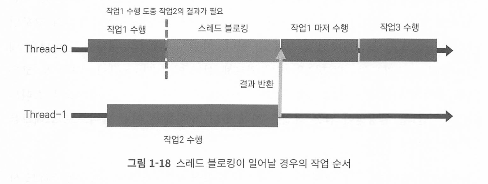

위 그림을 보면, thread-0에서 작업 3을 수행하기 위해서는 작업 1이 끝난 후 해야한다, thread-0 스레드는 작업 1이 점유하고 있기 때문이다. 

이 상황을 코루틴은 간단히 해결한다

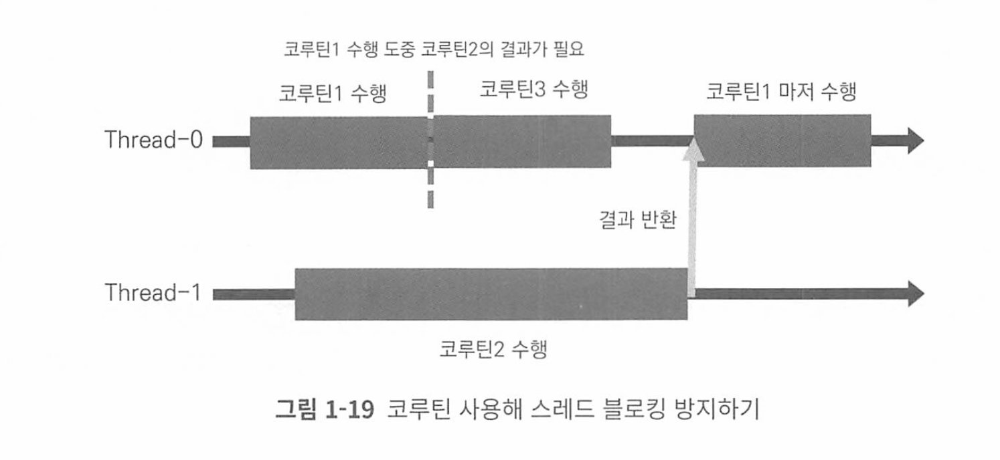

* 작업1, 작업2, 작업3을 코루틴 123으로 변경하여 부른다
* 코루틴 스케줄러가 사용할 수 있는 스레드는 스레드 0 1 2개라고 가정

코루틴 1 실행 도중 코루틴 2 결과가 필요하면 코루틴1은 코루틴2로부터 반환할때까지 기다리면서 스레드 사용 권한을 반납하고 일시 중단한다. 그러면 기존에 작업이 할당된 thread0이 다시 사용가능해져 코루틴3이 실행하는것이다. 


## 1.5. 요약

1. JVM상에서 실행되는 코틀린 애플리케이션은 실행 시 메인 스레드를 생성하고 메인 스레드를 사용해 코드를 실행한다.
2. 단일 스레드 애플리케이션은 한 번에 하나의 작업만 수행할 수 있으며, 복잡한 작업이나 네트워크 요청 등이 있으면 응답성이 떨어질 수 있다.
3. 멀티 스레드 프로그래밍을 사용하면 여러 작업을 동시에 실행할 수 있어서 단 일 스레드 프로그래밍을 사용할 때의 문제를 해결할 수 있다.
4. 직접 Thread 클래스를 상속해 스레드를 생성하고 관리할 수 있으나 생성된 스 레드의 재사용이 어려워 리소스의 낭비를 일으킨다.
5. Executor 프레임웍은 스레드풀을 사용해 스레드의 생성과 관리를 최적화하고 스레드 재사용을 용이하게 했다.
6. Executor 프레임웍을 비롯한 기존의 멀티 스레드 프로그래밍 방식들은 스레 드 블로킹 문제를 근본적으로 해결하지 못한다.
7. 스레드 블로킹은 스레드가 작업을 기다리면서 리소스를 소비하지만 아무 일도 하지 않는 상태를 말한다.
8. 코루틴은 스레드 블로킹 문제 해결을 위해 등장했다. 코루틴은 필요할 때 스레 드 사용 권한을 양보하고 일시 중단하며, 다른 작업이 스레드를 사용할 수 있게 한다.
9. 일시 중단 후 재개된 코루틴은 재개 시점에 사용할 수 있는 스레드에 할당돼 실행된다.
10. 코루틴은 스레드와 비교해 생성과 전환 비용이 적게 들고 스레드에 자유롭게 뗐다 붙였다 할 수 있어 경량 스레드라고 불린다.
11. 코루틴을 사용하면 스레드 블로킹 없이 비동기적으로 작업을 처리할 수 있으 며, 이를 통해 애플리케이션의 응답성을 크게 향상시킬 수 있다.

# 2장 코루틴 개발 환경 설정

코루틴을 사용하기 위해서는 젯브레인 라이브러리 kotlinx.coroutines를 사용한다.

```kotlin
// 코루틴 라이브러리. 버전은 그냥 변경하면 ㄷ됌 
implementation("org.jetbrains.kotlinx:kotlinx-coroutines-core:1.7.2")
```


runBlocking은 람다식 내부의 모든 코드가 실행 완료될때까지 코루틴은 종료되지 않는다.

```kotlin
fun main() = runBlocking<Unit> {
  println("Hello Coroutines")
  Log.log.error("Hello Coroutines")
}
```


코루틴 이름을 출력하려면 VM Option을 줘야한다

```
-Dkotlinx.coroutines.debug
```

또는 코드로 박아 쓸려면

```gradle
 implementation("org.jetbrains.kotlinx:kotlinx-coroutines-debug:1.7.3")
```

```kotlin
fun main() = runBlocking<Unit> {
  // 코루틴 디버깅 활성화
  DebugProbes.install()
  println("[${Thread.currentThread().name}] 실행")
}
```


# 3장 CoroutineDispatcher

## 3.1. CoroutineDispatcher란 무엇인가?

dispatcher : 무언가를 보내는 주체.

CoroutineDispatcher: 코루틴을 스레드로 보내는 주체

CoroutineDispatcher는 코루틴을 스레드나 스레드풀을 가지며, 코루틴을 실행되도록 만든다.

* 내부적으로 코루틴을 할당하는 큐처럼 작업 대기열을 가지고 있다.

CoroutineDispatcher는 코루틴의 실행을 관리하는 주체로 자신에게 실 행 요청된 코루틴들을 작업 대기열에 적재하고, 자신이 사용할 수 있는 스레드가 새로운 작업을 실행할 수 있는 상태라면 스레드로 코루틴을 보내 실행될 수 있게 만드 는 역할을 한다.

## 3.2. 제한된 디스패처와 무제한 디스패처

Confined Dispatcher(제한된 디스패처) : 사용하는 스레드나 스레드풀이 제한됌 

Unconfined Dispatcher(무제한 디스패처) : 제한되지 않음 


무제한 디스패처는 실행요청된 코루틴이 이전 코드가 실행되던 스레드에서 계속해서 실행되도록 해서 실행되는 스레드가 매번 달라질 수 있고, 특정 스레드로 제한되어있찌 않다 


## 3.3. 제한된 디스패처 생성하기

1. 싱글 스레드 디스패처 생성

```kotlin
val dispatcher: CoroutineDispatcher = newSingleThreadContext(name = "SingleThread")
```

2. 멀티 스레드 디스패처

```kotlin
val multiThreadDispatcher: CoroutineDispatcher = newFixedThreadPoolContext(
  nThreads = 2,
  name = "MultiThread"
)
```

내부적으로는 생성하는 스레드가 모두 데몬 스레드이다.

## 3.4. CoroutineDispatcher 사용해 코루틴 실행하기

단일 스레드 디스패처 사용해 코루틴 실행하기

```kotlin
fun main() = runBlocking<Unit> {
  val dispatcher = newSingleThreadContext(name = "SingleThread")
  launch(context = dispatcher) {
    println("[${Thread.currentThread().name}] 실행")
  }
}
```

멀티 스레드 디스패처 사용하기

```kotlin
fun main() = runBlocking<Unit> {
  val multiThreadDispatcher = newFixedThreadPoolContext(
    nThreads = 2,
    name = "MultiThread"
  )
  launch(context = multiThreadDispatcher) {
    println("[${Thread.currentThread().name}] 실행")
  }
  launch(context = multiThreadDispatcher) {
    println("[${Thread.currentThread().name}] 실행")
  }
}
```

### 부모 코루틴의 Dispatcher 사용해 자식 코루틴 실행하기

```kotlin
fun main() = runBlocking<Unit> {
  val multiThreadDispatcher = newFixedThreadPoolContext(
    nThreads = 2,
    name = "MultiThread"
  )
  launch(multiThreadDispatcher) { // 부모 Coroutine
    Log.logger.info("[${Thread.currentThread().name}] 부모 코루틴 실행")
    launch { // 자식 코루틴 실행
      Log.logger.info("[${Thread.currentThread().name}] 자식 코루틴 실행")
    }
    launch { // 자식 코루틴 실행
      Log.logger.info("[${Thread.currentThread().name}] 자식 코루틴 실행")
    }
  }
}
```

부모 코루틴의 내부에서 생성된 코루틴을 자식 코루틴이라고 한다.

만약 자식 코루틴에 CoroutineDispatcher 객체가 설정되지 않았으면 부모 코루틴의 디스패처 객체를 사용한다. 


## 3.5. 미리 정의된 CoroutineDispatcher

```
val multiThreadDispatcher = newFixedThreadPoolContext(
    nThreads = 2,
    name = "MultiThread"
  )
```

만약 직접 Context 객체를 생성하면 다음과 같은 경고과 출력된다

```
This is a delicate API and its use requires care. Make sure you fully read and understand documentation of the declaration that is marked as a delicate API.
섬세하게 다뤄져야하는 API 이므로 문서를 읽고 제대로 사용해야 한다 
```

왜냐하면 사용자가 해당 함수를 사용해 객체를 만드는것이 비효율적일 가능성이 높기 때문이다. 

또한 여러 개발자가 함께 개발할 경우 이미 있는데 또 생성해서 리소스를 낭비할 수 있다.

코루틴 라이브러리는 개발자가 직접 Dispatcher 객체를 생성하는 문제 방지를 위해 미리 정의된 목록을 제공한다.

- Dispatchers.IO: 네트워크 요청이나 파일 입출력 등의 입출력(I/0) 작업을 위한 CoroutineDispatcher
- Dispatchers.Default: CPU를 많이 사용하는 연산 작업을 위한 Coroutine
   Dispatcher
- Dispatchers.Main: 메인 스레드를 사용하기 위한 CoroutineDispatcher

Dispatchers.Unconfined는 제한된 디스패처가 아니기 때문에 별도의 장에서 다룬다.

### Dispatchers.IO

네트워크 통신 등이나 I/O를 위한 디스패처

최대 사용할 수 있는 스레드 수는 JVM 사용가능 프로세서 수와 64 중 큰 값으로 설정돼 있다.

### Dispatchers.Default

CPU 바운드 작업에 사용하는 Dispatcher다

### limitedParallelism 사용해 Dispatchers.Default 스레드 사용하기

Default를 사용해 무겁고 오래 걸리는 연산을 처리하면, 특정 연산을 위해 모든 스레드가 사용될 수 있다. 이 경우 나머지 다른 연산이 실행되지 못한다.

이를 방지하기 위해 Default의 일부 스레드만 사용해 특정 연산을 실행할 수 있도록 하는 limitedParallelism 함수를 지원한다

```kotlin
fun main() = runBlocking<Unit> {
  launch(Dispatchers.Default.limitedParallelism(2)){
    repeat(10) {
      launch {
        println("[${Thread.currentThread().name}] 코루틴 실행")
      }
    }
  }
}
```


Dispatcher.IO와 DispatcherDefault는 공유 스레드 풀을 사용한다.

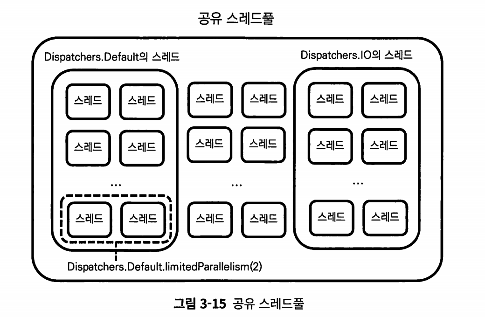


Dispatcher.IO의 limitedParallelism을 사용해야 할 때는, 특정한 작업이 다른 작업에 영향을 받지 않아야 하고 별도 스레드 풀에서 실행되는것이 필요할때 사용해야 한다.

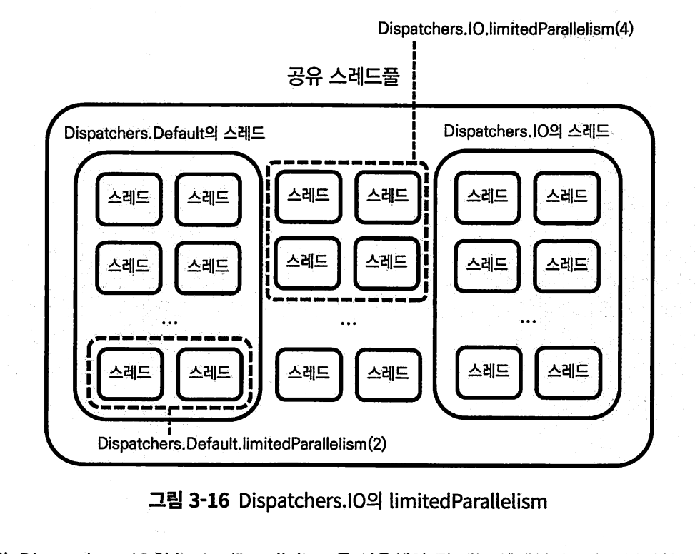

다만, 공유 스레드 풀에서 새로운 스레드를 만드는 작업이라 비싸다.


## 3.6. 요약

1. CoroutineDispatcher 객체는 코루틴을 스레드로 보내 실행하는 객체이다.
    코루틴을 작업 대기열에 적재한 후 사용이 가능한 스레드로 보내 실행한다.
2. 제한된 디스패처는 코루틴을 실행하는 데 사용할 수 있는 스레드가 특정 스레 드 또는 스레드풀로 제한되지만 무제한 디스패처는 코루틴을 실행하는 데 사용 할 수 있는 스레드가 제한되지 않는다.
3. newSingleThreadContext 및 newFixedThreadPoolContext 함수를 사 용해 제한된 디스패처 객체를 생성할 수 있다.
4. launch 함수를 사용해 코루틴을 실행할 때 context 인자로 Coroutine Dispatcher 객체를 넘기면 해당 CoroutineDispatcher 객체를 사용해 코루 틴이 실행된다.
5. 자식 코루틴은 기본적으로 부모 코루틴의 CoroutineDispatcher 객체를 상 속받아 사용한다.
6. 코루틴 라이브러리는 미리 정의된 CoroutineDispatcher 객체인 Dispatchers.I0, Dispatchers.Default, Dispatchers.Main을 제공한다.
7. Dispatchers.IO는 입출력 작업을 위한 CoroutineDispatcher 객체로 네트 워크 요청이나 파일 I/O 등에 사용된다.
8. Dispatchers.Default는 CPU 바운드 작업을 위한 CoroutineDispatcher 객체로 대용량 데이터 처리 등을 하는 데 사용된다.
9. limitedParallelism 함수를 사용해 특정 연산을 위해 사용되는 Dispatchers.
    Default의 스레드 수를 제한할 수 있다.
10. Dispatchers.IO Dispatchers.Default는 코루틴 라이브러리에서 제공하 는 공유 스레드풀을 사용한다.
11. Dispatchers.Main은 메인 스레드에서 실행돼야 하는 작업에 사용되는 CoroutineDispatcher 객체로 Dispatchers.Main을 사용하기 위해서는 별 도의 라이브러리를 추가해야 한다.
12. Dispatchers.Main은 일반적으로 UI가 있는 애플리케이션에서 UI를 업데이 트하는 데 사용된다.

# 4장 코루틴 빌더와 Job

코루틴 빌더란 코루틴을 생성하는데 사용되는 함수이다.

모든 코루틴 빌더 함수는 코루틴을 만들고 코루틴을 추상화한 Job 객체를 생성한다.


## 4.1. join을 사용한 코루틴 순차 처리

DB작업을 순차 처리해야 하거나, 캐싱된 토큰 값이 업데이트 된 이후 요청을 해야 하는 상황에서는 각 작업을 하는 코루틴이 순차 처리돼야 한다.

Job 객체의 join 함수를 사용해 순차 처리를 할 수 있다.

```kotlin

fun main() = runBlocking<Unit> {
  val updateTokenJob = launch(Dispatchers.IO) {
    println("[${Thread.currentThread().name}] 토큰 업데이트 시작")
    delay(100L)
    println("[${Thread.currentThread().name}] 토큰 업데이트 완료")
  }
  updateTokenJob.join() // updateTokenJob이 완료될 때까지 일시 중단
  val networkCallJob = launch(Dispatchers.IO) {
    println("[${Thread.currentThread().name}] 네트워크 요청")
  }
}
```

join 함수를 호출하면, join의 대상이 된 코루틴의 작업이 완료될 때 까지 join을 호출한 코루틴이 일시 중단된다.

즉 updateTokenJob.join을 호출하면 해당 코루틴이 완료될때까지 일시 중단된다.

join 함수는 join을 호출한 코루틴만 일시 중단한다.

## 4.2. joinAll을 사용한 코루틴 순차 처리

여러 코루틴을 한번에 실행하고 끝날때까지 호출한 코루틴을 일시 중단시키는 joinAll함수가 있다.

```kotlin
public suspend fun joinAll(vararg jobs: Job): Unit = jobs.forEach { it.join() }
```

## 4.3. CoroutineStart.LAZY 사용해 코루틴 지연 시작하기

나중에 실행되어야 할 코루틴을 미리 생성할 수 있다.

CoroutineStart.LAZY를 이용하면 된다

```kotlin
fun main() = runBlocking<Unit> {
  val startTime = System.currentTimeMillis()
  val lazyJob: Job = launch(start = CoroutineStart.LAZY) {
    println("[${chapter4.code6.getElapsedTime(startTime)}] 지연 실행")
  }
}

fun getElapsedTime(startTime: Long): String =
  "지난 시간: ${System.currentTimeMillis() - startTime}ms"
```

이렇게 지연 코루틴을 만든 후, 실행하기 위해서는 Job 객체의 start를 명시적으로 호출해야 한다.

```kotlin

fun main() = runBlocking<Unit> {
  val startTime = System.currentTimeMillis()
  val lazyJob: Job = launch(start = CoroutineStart.LAZY) {
    println("[${Thread.currentThread().name}][${getElapsedTime(startTime)}] 지연 실행")
  }
  delay(1000L) // 1초간 대기
  lazyJob.start() // 코루틴 실행
}
/*
// 결과:
[main @coroutine#2][지난 시간: 1014ms] 지연 실행
*/


fun getElapsedTime(startTime: Long): String =
  "지난 시간: ${System.currentTimeMillis() - startTime}ms"
```

## 4.4. 코루틴 취소하기

예를들어, 시간이 오래걸리는 파일 변환 작업을 코루틴에서 실행하는데 해당 파일을 변환하는 코루틴이 계속 실행된다면 낭비가 된다. 

먼저 job.cancel을 사용해 코루틴을 취소할 수 있다.

```kotlin
job.cancel()
```

주의해야 할것은, cancel 호출시 바로 취소되는것이 아닌, 코루틴 내부에서 취소 요청됨으로 변경하고 취소가 요청돼었는지 체크하고 취소한다.

예를들어 어떤 Job을 반드시 취소후에 실행 해야 한다고 했을 때

```kotlin
job.cancel()
otherJob()
```

취소 된 이후 otherJob이 바로 실행된다는것을 보장할 수 없다.

취소된 이후에 실행하고 싶다면, 순차성 보장을 위해 cancelAndJoin함수를 이용한다.

```kotlin
fun main() = runBlocking<Unit> {
  val longJob: Job = launch(Dispatchers.Default) {
// 작업 실행
  }
  longJob.cancelAndJoin() // longJob이 취소될 때까지 runBlocking 코루틴 일시 중단
  executeAfterJobCancelled()
}

fun executeAfterJobCancelled() {
  // 작업 실행
}
```

cancelAndJoin 함수를 사용하면 순차 처리가 가능하다. 

호출시, 호출한 코루틴이 일시 중단된다. 


## 4.5. 코루틴의 취소 확인

앞서 이야기 했듯, cancel()을 호출해도 바로 취소되지 않고 확인 이후 취소한다고 했는데 확인하는 시점은 언제일까?

**코루틴이 취소를 확인하는 시점은, 일시 중단 지점이나 코루틴이 실행을 대기하는 시점이다.**

예를들어 아래 코드는, 일시 중단 지점이 없어 무한히 반복된다.

```kotlin
fun main() = runBlocking<Unit> {
  val whileJob: Job = launch(Dispatchers.Default) {
    while(true) {
      println("작업 중")
    }
  }
  delay(100L) // 100밀리초 대기
  whileJob.cancel() // 코루틴 취소

```

위 코드를 취소시키도록 만드는데는 3가지 방법이 있다.

1. delay를 사용한 취소 확인
2. yield를 사용한 취소 확인
3. CoroutineScope.isActive를 사용한 취소 확인

이들을 사용하면 취소 확인 시점을 만들어 취소 요청 시 취소되도록 만들 수 있다.

각각에 대해 알아보자.

### delay를 사용한 취소 확인

delay함수는 suspend 함수로 선언돼, 특정 시간만큼 호출한 코루틴을 일시 중단하게 만든다. **코루틴은 일시 중단하는 시점에 취소를 확인하기 때문에** delay(1)만 줘도 바로 취소 확인 가능하다.  그러나 0.001초라도 멈추므로 효율적이진 않다..

### yield를 사용한 취소 확인

yield는 양보라는 뜻으로, yield함수가 호출되면 코루틴은 자신이 사용하던 스레드를 양보한다. 즉 yield를 호출한 시점에 일시 중단되며 다른 스레드에게 양보하고, 취소 체크가 일어나서 코루틴이 취소 상태에 들어가게 된다. 

역시 이 방법도 반복되며 일시 중단되므로 비효율적이다.

### CoroutinScope.isActive

CoroutineScope는 코루틴이 활성화됐는지 확인할 수 있는 Boolean 타입인 isActive를 제공한다. 

```kotlin
fun main() = runBlocking<Unit> {
  val whileJob: Job = launch(Dispatchers.Default) {
    while(this.isActive) { // here
      println("작업 중")
    }
  }
  delay(100L)
  whileJob.cancel()
}
```

내부적으로 isActive를 조건으로 삼아 취소를 준비하고,, **코루틴에 취소가 요청되면 this.isActive는 false가 된다.**


**이렇게 코루틴 내부 작업이 일시 중단 지점 없이 계속된다면 명시적으로 코루틴이 취소됐는지 확인해야 한다** 

## 4.6. 코루틴의 상태와 Job의 상태 변수

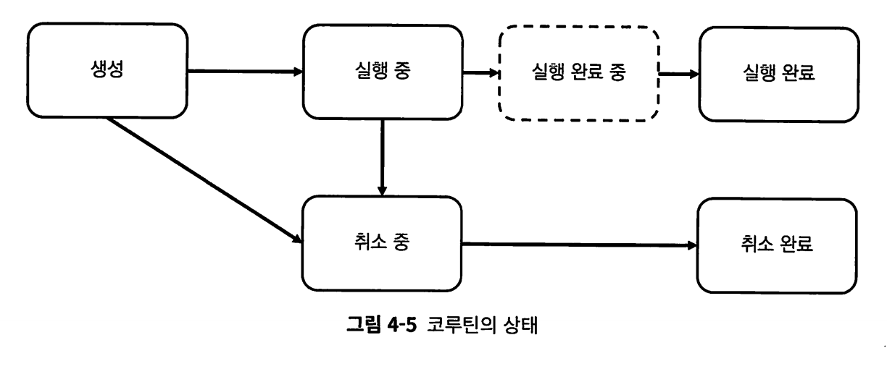

코루틴은 생성, 실행 중, 실행 완료 중, 실행 완료, 취소 중, 취소 완료를 가질 수 있다.

**생성(new**) : 생성시 자동으로 실행 중 상태로 넘어간다.

* 만약 자동으로 실행 중으로 넘어가고 싶지 않다면, 코루틴 빌더의 start 인자로 CoroutineStart.Lazy를 넘겨 지연 코루틴을 만들면 된다

**실행 중(Active)** : 지연 코루틴이 아닌 코루틴을 만들면 자동으로 바뀐다.

* 실행된 후 일시 중단일때도 실행 중 상태로 본다

실행 완료(Completed) : 코루틴의 모든 코드가 실행 완료된 경우 실행 완료 상태이다.

**취소 중(Cancelling)** : Job.cancel()등을 통해 취소가 요청 된 경우 취소 중 상태로 넘어가며, 이는 아직 취소된 상태가 아니고 계속해서 실행된다

**취소 완료 (Canceled)** : 코루틴의 취소 확인 시점(일시 중단)에 취소가 확인된 경우 취소 완료 상태가 된다. 


Job 객체의 코루틴의 상태변수로는 isActive, isCanceled, isCompeleted가 있다.

* isActive : 코루틴 활성화 여부. 활성화란 실행된 후 취소가 요청되거나 실행이 완료되지 않은 상태라는 의미이다. 취소가 요청된경우 false이다 
* isCancelled : 코루틴 취소 요청된 여부. 요청되기만 해도 true여서 즉시 취소된것은 아니다
* isCompleted: 코루틴 실행이 완료됐는지 여부


# 5장 async와 Deferred

## 5.1. async 사용해 결괏값 수신하기

Deffered 객체는 미래의 어느 시점에 결괏값이 반환될 수 있음을 표현하는 코루틴 객체. 결괏값 수신의 대기를 위해 await()함수를 제공한다.

await()를 호출 하면 호출한 코루틴을 일시 중단하며 실행완료되어야 결괏값을 반환하고 호출부의 코루틴을 재개한다. 

```kotlin
fun main() = runBlocking<Unit> {
  val networkDeferred: Deferred<String> = async(Dispatchers.IO) {
    delay(1000L) // 네트워크 요청
    return@async "Dummy Response" // 결과값 반환
  }
  val result = networkDeferred.await() // networkDeferred로부터 결과값이 반환될 때까지 runBlocking 일시 중단
  println(result) // Dummy Response 출력
}
```

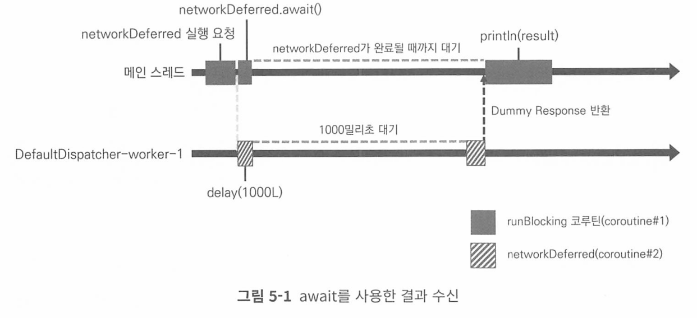

Deffered 인터페이스는 Job 인터페이스의 서브타입으로 된 인터페이스로, Job객체에서 몇가지 기능이 추가됐을 뿐 여전히 Job 객체의 일종이다

즉 Job의 모든 기능을 사용할 수 있고, 상태도 같다.

## 5.3. 복수의 코루틴으로부터 결괏값 수신하기

```kotlin
fun main() = runBlocking<Unit> {
    val startTime = System.currentTimeMillis() // 1. 시작 시간 기록
    val participantDeferred1: Deferred<Array<String>> = async(Dispatchers.IO) { // 2. 플랫폼1에서 등록한 관람객 목록을 가져오는 코루틴
        println("deferred1 start")
        delay(1000L)
        return@async arrayOf("James", "Jason")
    }

    println("deferred1 선언 후")

    val participantDeferred2: Deferred<Array<String>> = async(Dispatchers.IO) { // 3. 플랫폼2에서 등록한 관람객 목록을 가져오는 코루틴
        println("deferred2 start")
        delay(1000L)
        return@async arrayOf("Jenny")
    }
    println("deferred2 선언 후")

    val participants1 = participantDeferred1.await() // 4. 결과가 수신 될 때까지 대기
    val participants2 = participantDeferred2.await() // 5. 결과가 수신 될 때까지 대기

    println(
        "[${getElapsedTime(startTime)}] 참여자 목록: ${
            listOf(
                *participants1,
                *participants2
            )
        }"
    ) // 6. 지난 시간 기록 및 참여자 목록 병합
}
// 결과
deferred1 선언 후
deferred1 start
deferred2 선언 후
deferred2 start
[지난 시간: 1011ms] 참여자 목록: [James, Jason, Jenny]
```

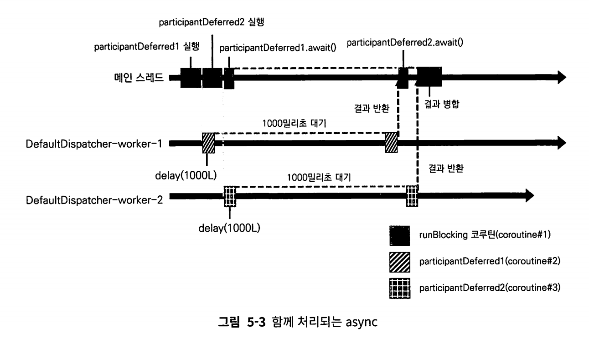

deffered1 코루틴과 deffered2 코루틴이 동시에 실행된다.

### awaitAll

await 함수 사용시 10개의 await 함수를 호출해야 하므로 awaitAll을 사용하면 된다.

```kotlin
public suspend fun <T> awaitAll(vararg deferreds: Deferred<T>): List<T> =
    if (deferreds.isEmpty()) emptyList() else AwaitAll(deferreds).await()

private class AwaitAll<T>(private val deferreds: Array<out Deferred<T>>) {
    private val notCompletedCount = atomic(deferreds.size)

    suspend fun await(): List<T> = suspendCancellableCoroutine { cont ->
        // Intricate dance here
        // Step 1: Create nodes and install them as completion handlers, they may fire!
        val nodes = Array(deferreds.size) { i ->
            val deferred = deferreds[i]
            deferred.start() // To properly await lazily started deferreds
            AwaitAllNode(cont).apply {
                handle = deferred.invokeOnCompletion(asHandler)
            }
        }
```


## 5.4. withContext

withContext 함수를 사용하면 async-await 작업을 대채할 수 있다.

```kotlin
public suspend fun <T> withContext(
    context: CoroutineContext,
    block: suspend CoroutineScope.() -> T
): T {
	...
}
```

함수의 인자로 설정된 CoroutineContext 객체를 사용해 block 람다식을 실행하고, 완료되면 그 결과를 반환한다.

block 람다식을 모두 실행하면 다시 기존의 CoroutineContext 객체를 사용해 코루틴이 재개된다.  즉 async-await를 연속적으로 실행했을때와 매우 비슷하다.

```kotlin
fun main() = runBlocking<Unit> {
  val networkDeferred: Deferred<String> = async(Dispatchers.IO) {
    delay(1000L) // 네트워크 요청
    return@async "Dummy Response" // 문자열 반환
  }
  val result = networkDeferred.await() // networkDeferred로부터 결과값이 반환될 때까지 대기
  println(result)
}

fun main() = runBlocking<Unit> {
  val result: String = withContext(Dispatchers.IO) {
    delay(1000L) // 네트워크 요청
    return@withContext "Dummy Response" // 문자열 반환
  }
  println(result)
}

```

async-await가 withContext 함수로 대체되면 중간에 Deffered 객체가 생성되는 부분이 없어지고 결과가 바로 반환된다.

**그러나 내부적으로 둘은 다르게 동작한다.**


async-await는 새로운 코루틴을 생성해 작업을 처리하지만

withContext 함수는 실행중이던 코루틴을 그대로 유지한 채로, 코루틴의 실행 환경만 변경해 작업을 처리한다.

* 새로운 코루틴을 시작하지 않고, 현재 코루틴에서 실행 중인 스레드를 변경하고 싶을 때 사용

* 즉, 현재 실행 중인 코루틴의 **스레드를 변경**하거나 **작업 환경을 변경**하는 것이 목적.  **순차적으로** 작업을 처리하며, 병렬 실행이 필요하지 않을 때 적합

withContext 함수의 인자값인 context로 변경돼 실행되며 이를 Context Switching 이라고 부른다.

```kotlin
fun main() = runBlocking<Unit> {
  val result: String = withContext(Dispatchers.IO) {
    delay(1000L) // 네트워크 요청
    return@withContext "Dummy Response" // 문자열 반환
  }
  println(result)
}
[main @coroutine#1] runBlocking 블록 실행
[DefaultDispatcher-worker-1 @coroutine#1] withContext 블록 실행
```

* 로그를 봐라. 코루틴이름이 같다. 즉 기존 코루틴 그대로 사용한다. 

withContext(Dispatchers.IO)가 호출되면, 해당 코루틴은 Dispatcher.IO의 작업 대기열로 이동 후 해당 스케줄러가 쓸 수 있는 스레드 중 하나로 보내져 실행된다. 

* 기존 runBlocking은 메인 쓰레드에서 실행중이였음. 

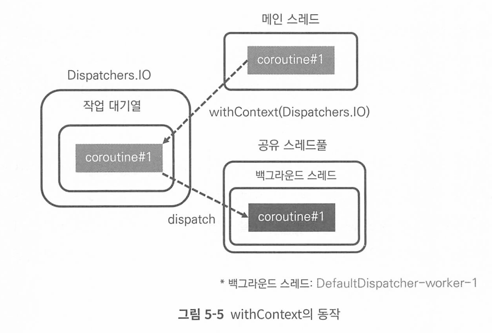

그리고, withContext 함수가 block 람다식을 다시 벗어나면 다시 원래의 CoroutineContext 객체를 사용해 실행된다. 


자 다시, async-await와 withContext 함수를 호출했을 때와 내부적으로 어떻게 동작 방식이 다른가?

```kotlin
fun main() = runBlocking<Unit> {
  println("[${Thread.currentThread().name}] runBlocking 블록 실행")
  async(Dispatchers.IO) {
    println("[${Thread.currentThread().name}] async 블록 실행")
  }.await()
}

[main @coroutine#1] runBlocking 블록 실행
[DefaultDispatcher-worker-1 @coroutine#2] async 블록 실행

```

async 블록을 실행하는 코루틴과 runBlocking 코루틴과 다르다.

* coroutine1, coroutine2


정리하자면, withContext 호출시 코루틴은 유지 - 실행 스레드만 변경되어서 동기적으로 실행되는것이고, async-await는 새로운 코루틴을 만들지만 await 함수를 통해 순차 처리가 돼 동기적으로 실행되는것이다. 

이로 인해 주의해야 할 점이 있다. 

### 왜 withContext를 사용하는가  그럼

`withContext`의 주된 사용 목적은 **스레드나 컨텍스트 전환**을 통해 특정 작업을 **비차단 방식으로** 실행하는 것입니다. 주로 IO 작업이나 CPU 집약적인 작업에서 사용됩니다.

`withContext`의 주된 사용 목적은 **스레드나 컨텍스트 전환**을 통해 특정 작업을 **비차단 방식으로** 실행하는 것입니다. 주로 IO 작업이나 CPU 집약적인 작업에서 사용됩니다.

#### **주요 사용 시나리오**:

1. **스레드 전환**:

   - 코루틴은 일반적으로 메인 스레드에서 실행되지만, 특정 작업(예: 네트워크 통신, 파일 읽기/쓰기, 데이터베이스 작업)은 메인 스레드에서 수행하면 안 됩니다.
   - 이럴 때, `withContext(Dispatchers.IO)`를 사용하여 **IO 작업에 적합한 스레드 풀**로 전환한 뒤, 작업을 수행합니다.

   ```kotlin
   withContext(Dispatchers.IO) {
       // 파일 읽기/쓰기, 네트워크 작업 등 IO 관련 작업을 여기서 실행
   }
   ```

2. **논블로킹 작업 처리**:

   - `withContext`는 스레드를 변경하는 동안 **코루틴이 블록되지 않도록** 합니다. 예를 들어, `Dispatchers.IO`에서 오래 걸리는 작업을 처리하면서도, 해당 코루틴이 다른 작업을 처리하는 것을 방해하지 않게 할 수 있습니다.

3. **간단한 동기 작업**:

   - 여러 비동기 작업을 **병렬로 처리할 필요가 없고**, 순차적으로 작업을 실행할 때 유용합니다.
   - 새로운 코루틴을 만들 필요가 없고, **이미 실행 중인 코루틴에서 스레드만 전환**하고 싶을 때 사용합니다.

### withContext 사용시 주의점.

withContext함수는 새로운 코루틴을 만들지 않기 때문에 하나의 코루틴에서 withContext 함수가 여러번 호출되면 순차적으로 실행된다.

즉 복수의 독립적 병렬 작업을 실행할 수 없다는 소리이다.


## 5.5. 요약

1. async 함수를 사용해 코루틴을 실행하면 코루틴의 결과를 감싸는 Deferred
    객체를 반환받는다.
2. Deferred는 Job의 서브타입으로 Job 객체에 결값을 감싸는 기능이 추가된 객체이다.
3. Deferred 객체에 대해 await 함수를 호출하면 결값을 반환받을 수 있다.
    await 함수를 호출한 코루틴은 Deferred 객체가 결값을 반환할 때까지 일 시 중단 후 대기한다.
4. awaitAll 함수를 사용해 복수의 Deferred 코루틴이 결값을 반환할 때까지 대기할 수 있다.
5. awaitAll 함수는 컬렉션에 대한 확장 함수로도 제공된다.
6. withContext 함수를 사용해 async-await 쌍을 대체할 수 있다.
7. withContext 함수는 코루틴을 새로 생성하지 않는다. 코루틴의 실행 환경을 담는 CoroutineContext만 변경해 코루틴을 실행하므로 이를 활용해 코루틴 이 실행되는 스레드를 변경할 수 있다.
8. withContext 함수는 코루틴을 새로 생성하지 않으므로 병렬로 실행돼야 하는 복수의 작업을 withContext로 감싸 실행하면 순차적으로 실행된다. 이럴 때 는 withContext 대신 async를 사용해 작업이 병렬로 실행될 수 있도록 해야 한다.
9. withContext로 인해 실행 환경이 변경돼 실행되는 코루틴은 withContext의 작업을 모두 실행하면 다시 이전의 실행 환경으로 돌아온다.

# 6장 CoroutineContext

launch나 async 함수 모두 매개변수로 context, start, block을 가진다

CoroutineContext는 코루틴을 실행하는 실행환경을 설정하고 관리하는 인터페이스로, CoroutineDispatcher, CoroutineName, Job 등의 객체를 조합해 코루틴의 실행 환경을 설정한다. 

6장에서 다루는 내용

- CoroutineContext의 구성 요소
- CoroutineContext 구성 방법
- CoroutineContext 구성 요소에 접근하기
- CoroutineContext 구성 요소를 제거하는 방법

## 6.1. CoroutineContext의 구성 요소

CoroutineName, CoroutineDispatcher, Job, CoroutineExceptionHandler 4가지 구성 요소를 가진다.

1. CoroutineName: 코루틴의 이름을 설정한다.

2. CoroutineDispatcher: 코루틴을 스레드에 할당해 실행한다.

3. Job: 코루틴의 추상체로 코루틴을 조작하는 데 사용된다.

4. CoroutineExceptionHandler: 코루틴에서 발생한 예외를 처리한다.

## 6.2. CoroutineContext 구성하기

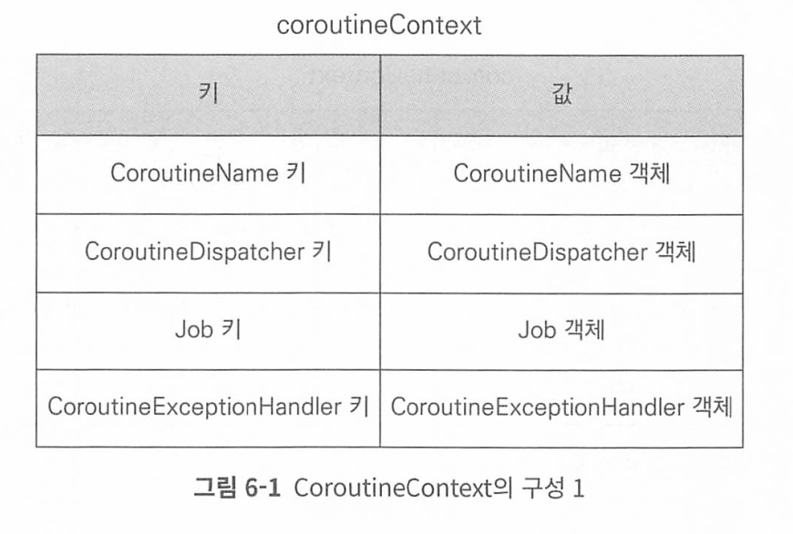

CoroutineContext 객체는 키-값 쌍으로 각 구성요소를 관리한다.

각 구성요소를 고유 키를 가지며 중복 허용이 안된다. 따라서 각 요소들을 1개씩만 가질 수 있다.

### CoroutineContext 구성

```kotlin
fun main() = runBlocking<Unit> {
  val coroutineContext: CoroutineContext = 
    newSingleThreadContext("MyThread") + CoroutineName("MyCoroutine")

  launch(context = coroutineContext) {
    println("[${Thread.currentThread().name}] 실행")
  }
}
/*
// 결과:
[MyThread @MyCoroutine#2] 실행
```

키-값 쌍으로 구성요소를 관리하지만, 키에 값을 직접 대입하진 않고 더하기(+) 연산자 오버라이딩이 되어있어 이것으로 객체를 구성한다.

위 구성 객체는 아래와 같다.

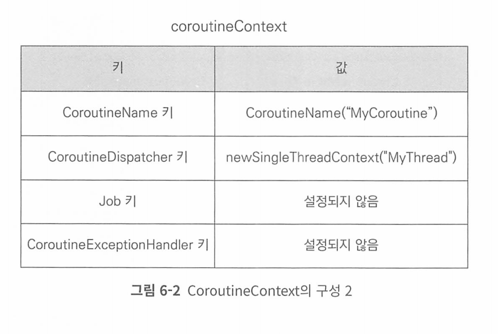

### 덮어씌우기

앞서 코루틴컨텍스트 객체는 중복을 허용하지 않는다고 했다.

같은 구성 요소가 둘 이상 더해진다면 나중에 추가된  CoroutineContext 구성요소가 이전 값을 덮어 씌우게 된다. 

### 여러 구성 요소로 이뤄진 CoroutineContext 합치기

```kotlin

val coroutineContext1 = CoroutineName("MyCoroutine1") + newSingleThreadContext("MyThread1")
val coroutineContext2 = CoroutineName("MyCoroutine2") + newSingleThreadContext("MyThread2")
val combinedCoroutineContext = coroutineContext1 + coroutineContext2
```

coroutineContext2의 구성요소만 남는다. 

### Job 생성해 추가

```kotlin
import kotlinx.coroutines.*
import kotlin.coroutines.CoroutineContext

val myJob = Job()
val coroutineContext: CoroutineContext = Dispatchers.IO + myJob
```

Job을 직접 생성해 추가하면 코루틴 구조가 깨질 수 있기 때문에 앵간하면 새로운  Job 객체를 생성해 추가하지 말자. 


## 6.3. CoroutineContext 구성 요소에 접근하기

```kotlin
public data class CoroutineName(
    /**
     * User-defined coroutine name.
     */
    val name: String
) : AbstractCoroutineContextElement(CoroutineName) {
    /**
     * Key for [CoroutineName] instance in the coroutine context.
     */
    public companion object Key : CoroutineContext.Key<CoroutineName>

    /**
     * Returns a string representation of the object.
     */
    override fun toString(): String = "CoroutineName($name)"
}
```

내부적으로 동반객체로 Key가 있다

CoroutineName.Key를 사용해 CoroutineName에 접근해보자.

```kotlin
fun main() = runBlocking<Unit> {
  val coroutineName : CoroutineName = CoroutineName("MyCoroutine")
  val dispatcher : CoroutineDispatcher = Dispatchers.IO
  val coroutineContext = coroutineName + dispatcher

  println(coroutineContext[coroutineName.key]) // CoroutineName("MyCoroutine")
  println(coroutineContext[dispatcher.key]) // Dispatchers.IO
}
/*
// 결과:
CoroutineName(MyCoroutine)
Dispatchers.IO
*/
```

## 6.4. CoroutineContext 구성 요소 제거하기

minusKey 함수로 구성 요소를 제거할 수 있다.

```kotlin
val coroutineContext: CoroutineContext = coroutineName + dispatcher + myJob
val deletedCoroutineContext = coroutineContext.minusKey(CoroutineName)
```

중요한것은 불변처럼 다뤄져서 minusKey를 호출하면 해당 Key가 제거된 CoroutineContext가 반환된다. 

## 6.5. 요약

# 7장 구조화된 동시성

구조화된 동시성이란, 비동기 작업을 구조화 함으로써 비동기 프로그래밍을 보다 안정적이고 예측할 수 있게 만드는 원칙이다.

코루틴은 비동기 작업인 코루틴을 부모-자식관계로 구조화함으로써 코루틴이 보다 안전하게 관리되고 제어된다. 


부모 코루틴 내에서 새 코루틴 빌더를 호출하면 부모-자식 관계가 된다. 

```kotlin
fun main() = runBlocking<Unit> {
  launch { // 부모 코루틴
    launch {  // 자식 코루틴
      println("자식 코루틴 실행")
    }
  }
}
```

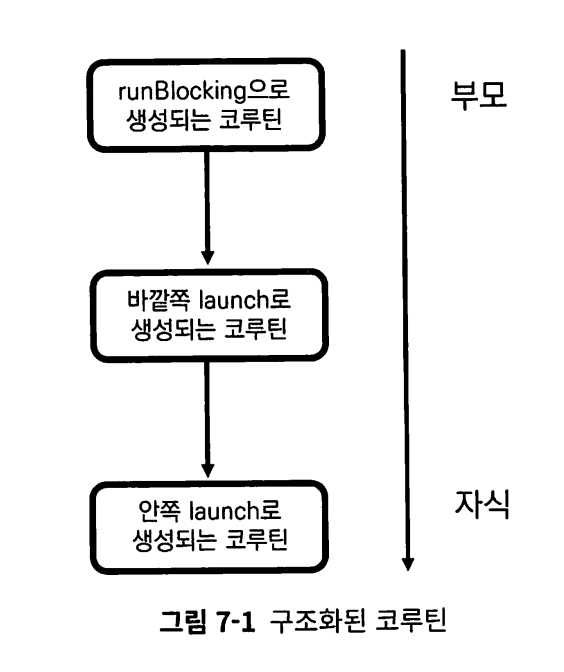

구조화된 코루틴의 특징

* 부모 코루틴의 실행 환경이 자식 코루틴에게 상속된다
* 부모 코루틴이 취소되면 자식 코루틴도 취소된다
* 부모 코루틴은 자식 코루틴이 완료될때까지 대기한다
* CoroutineScope를 사용해 코루틴이 실행되는 범위를 제한할 수 있다.


## 7.1. 실행 환경 상속

자식 코루틴은 부모 코루틴의 context에 설정을 따라간다.

그러나 부모 코루틴의 모든 실행 환경이 항상 자식 코루틴에게 상속되지는 않는다.

만약 자식 코루틴을 생성하는 빌더 함수에서 새로운 context가 전달되면 부모로 부터 전달받은 context는 새로운 context로 덮어 씌워진다.

```kotlin
fun main() = runBlocking<Unit> {
  val coroutineContext = newSingleThreadContext("MyThread") + CoroutineName("ParentCoroutine")
  launch(coroutineContext){ // 부모 코루틴 생성
    println("[${Thread.currentThread().name}] 부모 코루틴 실행")
    launch(CoroutineName("ChildCoroutine")) {  // 자식 코루틴 생성
      println("[${Thread.currentThread().name}] 자식 코루틴 실행")
    }
  }
}
/*
// 결과:
[MyThread @ParentCoroutine#2] 부모 코루틴 실행
[MyThread @ChildCoroutine#3] 자식 코루틴 실행
*/
```

자. 중요한것은 덮어 씌운단것이다. CoroutineContext의 특징은 덮어 씌웠을때, A라는 요소가 기존 context에 있었고, 자신이 없다면  기존 A라는 요소를 자신의 것으로 만든다.

* 위 예시로는 newSingleThreadContext가 없었으므로, ChildCoroutine + newSingleThreadContext가 구성 요소가 된다. 

 

주의할점은 다른 CoroutineContext 구성 요소들과 다르게 Job 객체는 상속되지 않고 코루틴 빌더 함수가 호출되면 새롭게 생성된다. 

왜일까?

### 상속되지 않는 Job

모든 코루틴 빌더 함수는 (withContext 제외) Job 객체를 새로 생성한다.

코루틴 제어에 Job 객체가 필요한데(다양한 정보가 들어있으므로, 상태라던가) Job 객체를 부모 코루틴으로부터 상속받으면 각 코루틴들 제어가 어렵기 때문이다. 따라서 코루틴 빌더를 통해 생성된 코루틴들은 서로 다른 Job을 가진다. 

* Job 인터페이스 까보자

```kotlin
public interface Job : CoroutineContext.Element {
  
  @ExperimentalCoroutinesApi
  public val parent: Job?
  
  public val children: Sequence<Job> // 오옷..??
}
```

Job은 구조화에 사용된다.

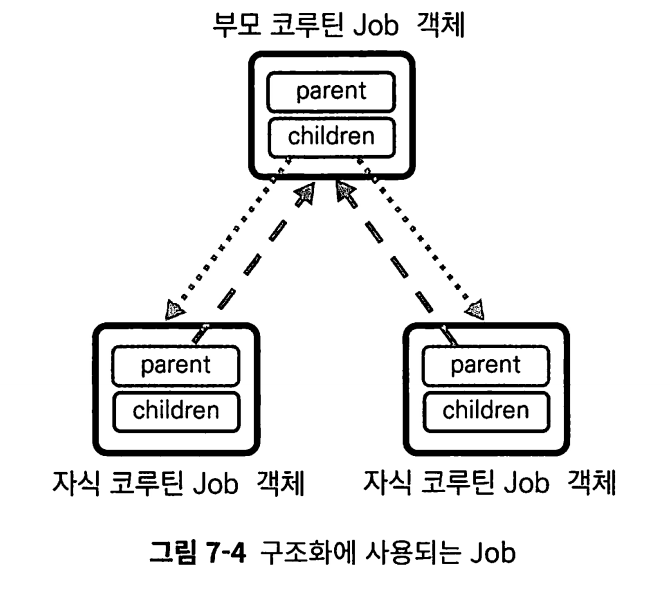

코루틴 빌더가 호출되면 Job은 새로 생성되지만, 내부에 정의된 parent 프로퍼티를 통해 부모 코루틴의 Job 객체에 대한 참조를 가지고, children 프로퍼티를 통해 자식 코루틴에 Job에 대한 참조를 서로 갖게된다.


```kotlin
fun main() = runBlocking<Unit> { // 부모 코루틴
  val parentJob = coroutineContext[Job] // 부모 코루틴의 CoroutineContext로부터 부모 코루틴의 Job 추출
  launch { // 자식 코루틴
    val childJob = coroutineContext[Job] // 자식 코루틴의 CoroutineContext로부터 자식 코루틴의 Job 추출
    println("1. 부모 코루틴과 자식 코루틴의 Job은 같은가? ${parentJob === childJob}")
    println("2. 자식 코루틴의 Job이 가지고 있는 parent는 부모 코루틴의 Job인가? ${childJob?.parent === parentJob}")
    println("3. 부모 코루틴의 Job은 자식 코루틴의 Job을 참조를 가지는가? ${parentJob?.children?.contains(childJob)}")
  }
}
/*
// 결과:
1. 부모 코루틴과 자식 코루틴의 Job은 같은가? false
2. 자식 코루틴의 Job이 가지고 있는 parent는 부모 코루틴의 Job인가? true
3. 부모 코루틴의 Job은 자식 코루틴의 Job을 참조를 가지는가? true
*/
```

## 7.2. 코루틴의 구조화와 작업 제어

여러 서버로부터 데이터를 다운로드 받고 합쳐 반환하는 작업이 있다고 가정.

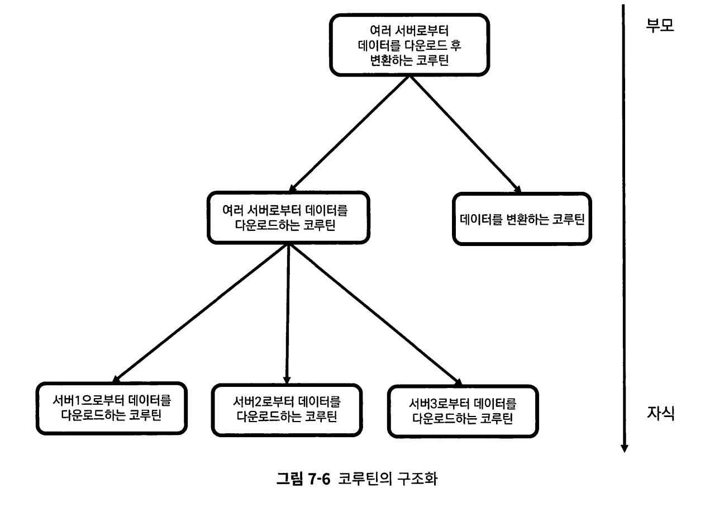

코루틴의 구조화는 큰 작업을 연관된 작은 작업으로 분할하는 방식으로 이뤄진다.

구조화하는 가장 중요한 이유는, 안전하게 관리하고 제어하기 위함이다.

안전하게 제어되기 위해 다음 두가지 특성에 대해서만 먼저 다룬다

1. **코루틴으로 취소가 요청되면 자식 코루틴으로 전파된다.**
2. **부모 코루틴은 모든 자식 코루틴이 실행 완료돼야 완료될 수 있다.**

> 곰곰히 생각해보면 원리가 쉽다.
>
> 부모가 취소했는데 자식을 진행시켜야 하는가?
>
> 자식이 끝나지도않았는데 부모를 먼저 끝내야하는가? 

다음 트리를 보자

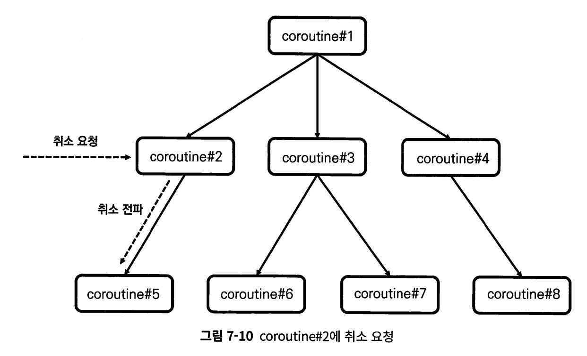

특정 코루틴에 취소가 요청되면 취소는 자식 코루틴으로만 전파되며 부모로는 전파되지 않는다.

* 루트인 coroutine#1로 취소시 전체로 전파
* 중간인 coroutine#2로 취소시 coroutine#5로만 전파

자식 코루틴으로만 취소가 전파되는 이유는 자식 코루틴의 부모 작업의 일부이기 때문. 

```kotlin
fun main() = runBlocking<Unit> {
  
  val parentJob = launch(Dispatchers.IO) { // 부모 코루틴 생성
    val dbResultsDeferred: List<Deferred<String>> = listOf("db1", "db2", "db3").map {
      async { // 자식 코루틴 생성
        delay(1000L) // DB로부터 데이터를 가져오는데 걸리는 시간
        println("${it}으로부터 데이터를 가져오는데 성공했습니다")
        return@async "[${it}]data"
      }
    }
    val dbResults: List<String> = dbResultsDeferred.awaitAll() // 모든 코루틴이 완료될 때까지 대기

    println(dbResults) // 화면에 표시
  }
}
/*
// 결과:
db3으로부터 데이터를 가져오는데 성공했습니다
db2으로부터 데이터를 가져오는데 성공했습니다
db1으로부터 데이터를 가져오는데 성공했습니다
[[db1]data, [db2]data, [db3]data]
*/
```


또한 자식 코루틴이 완료 되어야 부모 코루틴이 완료 된다고 했다.

자신의 작업을 다 끝내고, 자식 코루틴의 작업을 기다리는 상태가 바로 실행 완료 중 상태이다. 

자식 코루틴이 모두 실행 완료되면 자동으로 실행 완료 상태로 바뀐다.

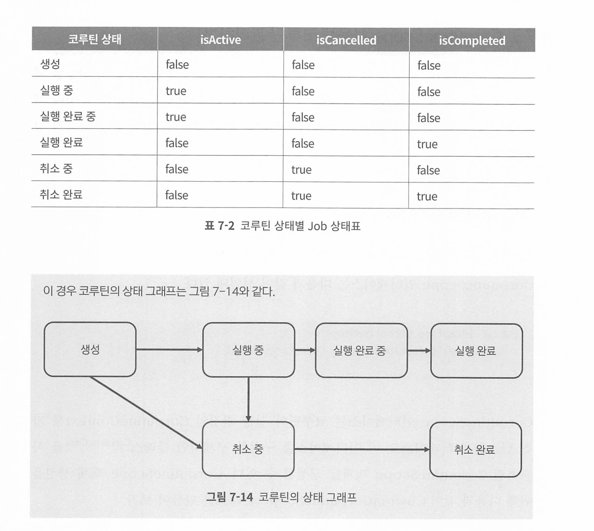

## 7.3. CoroutineScope 사용해 코루틴 관리하기

CoroutineScope 객체는 자신의 범위 내에서 생성된 코루틴들에게 실행 환경을 제공하고, 이들의 실행 범위를 관리하는 역할을 한다.

```kotlin
public interface CoroutineScope {
  public val coroutineContext: CoroutineContext
}
```

구체 클래스는 아래처럼 생성한다.

```kotlin
class CustomCoroutineScope : CoroutineScope {
  override val coroutineContext: CoroutineContext = Job() +
      newSingleThreadContext("CustomScopeThread")
}

fun main() {
  val coroutineScope = CustomCoroutineScope() // CustomCoroutineScope 인스턴스화
  coroutineScope.launch {
    delay(100L) // 100밀리초 대기
    println("[${Thread.currentThread().name}] 코루틴 실행 완료")
  }
  Thread.sleep(1000L) // 코드 종료 방지
}
```

아래처럼도 가능하다.

```kotlin
fun main() {
  val coroutineScope = CoroutineScope(Dispatchers.IO)
  coroutineScope.launch {
    delay(100L) // 100밀리초 대기
    println("[${Thread.currentThread().name}] 코루틴 실행 완료")
  }
  Thread.sleep(1000L)
}
```

이렇게 생성된  coroutineScope 변수는 coroutineScope가 호출돼 만들어진 CoroutineScope 객체를 가리키므로, 이 객체에 대해 launch나 async를 실행하면 coroutinescope 범위에서 코루틴이 실행되며, 해당 coroutineContext가 실행 환경으로 제공된다. 

```kotlin
fun main() {
  val newScope = CoroutineScope(CoroutineName("MyCoroutine") + Dispatchers.IO)

  newScope.launch(CoroutineName("LaunchCoroutine")) {
    println(this.coroutineContext[CoroutineName])
    println(this.coroutineContext[CoroutineDispatcher])

    val launchJob = this.coroutineContext[Job]
    val newScopeJob = newScope.coroutineContext[Job]

    println("launchJob?.parent === newScopeJob >> ${launchJob?.parent === newScopeJob}")
  }
  
  Thread.sleep(1000L)
}
```


## 7.4. 구조화와 Job

부모  Job이 없는 Job을 루트 Job이라고 하고, 이 Job에 의해 제어되는 코루틴을 루트 코루틴이라고 한다.


CoroutineScope는 코루틴 실행 환경으로 CoroutineContext객체를 갖기 때문에 기존 코루틴의 구조화를 깰 수 있다.

```kotlin

fun main() = runBlocking<Unit> { // 루트 Job 생성
  val newScope = CoroutineScope(Dispatchers.IO) // 새로운 루트 Job 생성

  newScope.launch(CoroutineName("Coroutine1")) { // Coroutine1 실행
    launch(CoroutineName("Coroutine3")) { // Coroutine3 실행
      delay(100L)
      println("[${Thread.currentThread().name}] 코루틴 실행")
    }
    launch(CoroutineName("Coroutine4")) { // Coroutine4 실행
      delay(100L)
      println("[${Thread.currentThread().name}] 코루틴 실행")
    }
  }

  newScope.launch(CoroutineName("Coroutine2")) { // Coroutine2 실행
    launch(CoroutineName("Coroutine5")) { // Coroutine5 실행
      delay(100L)
      println("[${Thread.currentThread().name}] 코루틴 실행")
    }
  }
}
/*
// 결과:
Process finished with exit code 0
*/
```

이렇게 구조화를 깨면 아무 결과가 안나오는데, runBlokcing 코루틴이 자식들이 구조화가 깨져서 자식들을 기다리지 않고 먼저 종료되기 때문이다. 


## 7.5. 요약


# 8장 예외 처리

## 8.1. 코루틴의 예외 전파

## 8.2. 예외 전파 제한

## 8.3. CoroutineExceptionHandler를 사용한 예외 처리

## 8.4. try catch문을 사용한 예외 처리

## 8.5. async의 예외 처리

## 8.6. 전파되지 않는 예외

## 8.7. 요약


# 9장 일시 중단 함수

## 9.1. 일시 중단 함수와 코루틴

## 9.2. 일시 중단 함수의 사용

## 9.3. 요약


# 10장 코루틴의 이해

## 10.1. 서브루틴과 코루틴

## 10.2. 코루틴의 스레드 양보

## 10.3. 코루틴의 실행 스레드

## 10.4. 요약

# 11장 코루틴 심화

## 11.1. 공유 상태를 사용하는 코루틴의 문제와 데이터 동기화

## 11.2. CoroutineStart의 다양한 옵션들 살펴보기

## 11.3. 무제한 디스패처

## 11.4. 코루틴의 동작 방식과 Continuation

## 11.5. 요약


# 12장 코루틴 단위 테스트

## 12.1. 단위 테스트 기초

## 12.2. 코루틴 단위 테스트 시작하기

## 12.3. 코루틴 테스트 라이브러리

## 12.4. 코루틴 단위 테스트 만들어 보기

## 12.5. 코루틴 테스트 심화

## 12.6. 요약