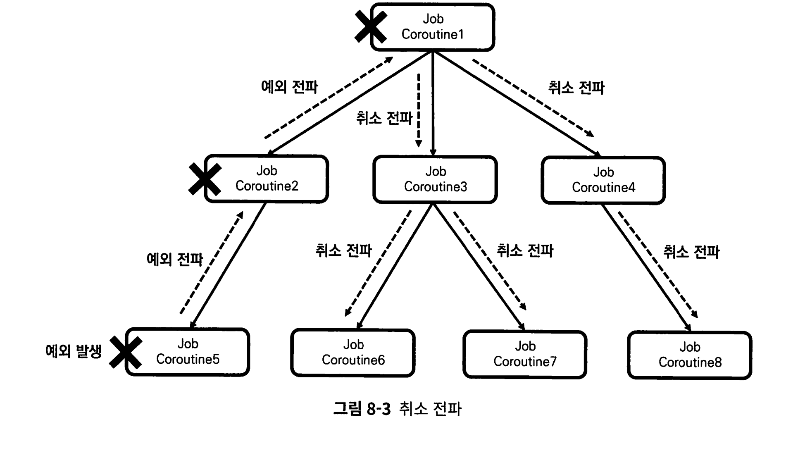
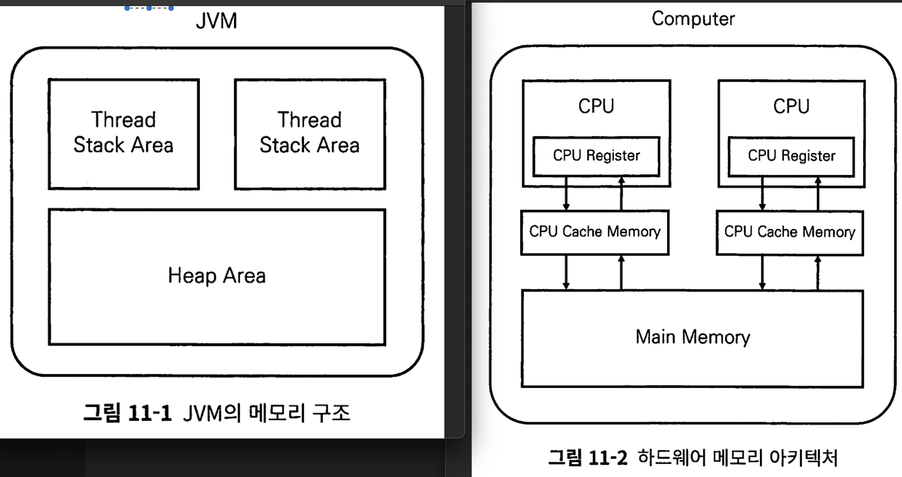

# 코틀린 코루틴의 정석

[toc]


* https://product.kyobobook.co.kr/detail/S000212376884
* https://github.com/seyoungcho2/coroutinesbook

코루틴 디스패처, 코루틴 빌더, Job, Deferred, 코루틴 컨텍스트, 구조화된 동시성, 예외 처리


기존 스레드 블로킹방식에서는 스레드 제어를 위해 많은 코드가 추가되고 가독성이 해치는 콜백 같은 방식이 사용되어 불편했다. 코루틴은 간단한 경량스레드라는 개념을 도입해 스레드 블로킹을 방지하고, 구조화된 동시성 원칙을 적용해 비동기 작업을 구조화 해서 동작하는 범위를 한정해 안정성을 높였다. 


# 1장 스레드 기반 작업의 한계와 코루틴의 등장

## 1.1. JVM 프로세스와 스레드

## 1.2. 단일 스레드의 한계와 멀티 스레드 프로그래밍

## 1.3. 스레드, 스레드풀을 사용한 멀티 스레드 프로그래밍

executor 프레임워크는 스레드를 직접 관리 안해도 되고, 스레드를 재사용하려고 등장

미리 스레드풀에 스레드를 생성해놓고, 요청할때마다 쉬는 스레드를 반환하며 작업이 끝나면 다시 스레드풀에 반환한다.

그러나 스레드 블로킹 상태를 막을수는 없다.

스레드 블로킹을 발생시키는 원이는 다양하다

* synchronized 블록에 접근
* Mutex, Semaphore 등
* Future객체를 사용하여 언제올지 모르는 값을 기다리는 get함수 

## 1.4. 기존 멀티 스레드 프로그래밍의 한계와 코루틴

코루틴은 작업 단위 코루틴을 통해 스레드 블로킹 문제를 해결한다.

작업단위 코루틴이란, 스레드에서 작업 도중 일시 중단 할 수 있는 작업 단위이다.


코루틴은 작업이 일시 중단되면 스레드 사용이 필요 없으므로 스레드 사용 권한을 양보하며, 양보된 스레드가 다른 작업을 실행한다. 재개 시점에 일시 중단된 코루틴은 다시 스레드에 할당돼 실행된다.


개발자가 코루틴을 만들어 코루틴 스케줄러에 넘기면, 코루틴 스케줄러는 자신이 사용할 수 있는 스레드나 스레드풀에 해당 코루틴을 분배해 작업을 수행한다. 즉 스레드에 코루틴을 뗏다 붙엿다 하여 블로킹 되지 않는것이다. 


위 그림을 보면, thread-0에서 작업 3을 수행하기 위해서는 작업 1이 끝난 후 해야한다, thread-0 스레드는 작업 1이 점유하고 있기 때문이다. 

이 상황을 코루틴은 간단히 해결한다


* 작업1, 작업2, 작업3을 코루틴 123으로 변경하여 부른다
* 코루틴 스케줄러가 사용할 수 있는 스레드는 스레드 0 1 2개라고 가정

코루틴 1 실행 도중 코루틴 2 결과가 필요하면 코루틴1은 코루틴2로부터 반환할때까지 기다리면서 스레드 사용 권한을 반납하고 일시 중단한다. 그러면 기존에 작업이 할당된 thread0이 다시 사용가능해져 코루틴3이 실행하는것이다. 


## 1.5. 요약

1. JVM상에서 실행되는 코틀린 애플리케이션은 실행 시 메인 스레드를 생성하고 메인 스레드를 사용해 코드를 실행한다.
2. 단일 스레드 애플리케이션은 한 번에 하나의 작업만 수행할 수 있으며, 복잡한 작업이나 네트워크 요청 등이 있으면 응답성이 떨어질 수 있다.
3. 멀티 스레드 프로그래밍을 사용하면 여러 작업을 동시에 실행할 수 있어서 단 일 스레드 프로그래밍을 사용할 때의 문제를 해결할 수 있다.
4. 직접 Thread 클래스를 상속해 스레드를 생성하고 관리할 수 있으나 생성된 스 레드의 재사용이 어려워 리소스의 낭비를 일으킨다.
5. Executor 프레임웍은 스레드풀을 사용해 스레드의 생성과 관리를 최적화하고 스레드 재사용을 용이하게 했다.
6. Executor 프레임웍을 비롯한 기존의 멀티 스레드 프로그래밍 방식들은 스레 드 블로킹 문제를 근본적으로 해결하지 못한다.
7. 스레드 블로킹은 스레드가 작업을 기다리면서 리소스를 소비하지만 아무 일도 하지 않는 상태를 말한다.
8. 코루틴은 스레드 블로킹 문제 해결을 위해 등장했다. 코루틴은 필요할 때 스레 드 사용 권한을 양보하고 일시 중단하며, 다른 작업이 스레드를 사용할 수 있게 한다.
9. 일시 중단 후 재개된 코루틴은 재개 시점에 사용할 수 있는 스레드에 할당돼 실행된다.
10. 코루틴은 스레드와 비교해 생성과 전환 비용이 적게 들고 스레드에 자유롭게 뗐다 붙였다 할 수 있어 경량 스레드라고 불린다.
11. 코루틴을 사용하면 스레드 블로킹 없이 비동기적으로 작업을 처리할 수 있으 며, 이를 통해 애플리케이션의 응답성을 크게 향상시킬 수 있다.

# 2장 코루틴 개발 환경 설정

코루틴을 사용하기 위해서는 젯브레인 라이브러리 kotlinx.coroutines를 사용한다.

```kotlin
// 코루틴 라이브러리. 버전은 그냥 변경하면 ㄷ됌 
implementation("org.jetbrains.kotlinx:kotlinx-coroutines-core:1.7.2")
```


runBlocking은 람다식 내부의 모든 코드가 실행 완료될때까지 코루틴은 종료되지 않는다.

```kotlin
fun main() = runBlocking<Unit> {
  println("Hello Coroutines")
  Log.log.error("Hello Coroutines")
}
```


코루틴 이름을 출력하려면 VM Option을 줘야한다

```
-Dkotlinx.coroutines.debug
```

또는 코드로 박아 쓸려면

```gradle
 implementation("org.jetbrains.kotlinx:kotlinx-coroutines-debug:1.7.3")
```

```kotlin
fun main() = runBlocking<Unit> {
  // 코루틴 디버깅 활성화
  DebugProbes.install()
  println("[${Thread.currentThread().name}] 실행")
}
```


# 3장 CoroutineDispatcher

## 3.1. CoroutineDispatcher란 무엇인가?

dispatcher : 무언가를 보내는 주체.

CoroutineDispatcher: 코루틴을 스레드로 보내는 주체

CoroutineDispatcher는 코루틴을 스레드나 스레드풀을 가지며, 코루틴을 실행되도록 만든다.

* 내부적으로 코루틴을 할당하는 큐처럼 작업 대기열을 가지고 있다.

CoroutineDispatcher는 코루틴의 실행을 관리하는 주체로 자신에게 실 행 요청된 코루틴들을 작업 대기열에 적재하고, 자신이 사용할 수 있는 스레드가 새로운 작업을 실행할 수 있는 상태라면 스레드로 코루틴을 보내 실행될 수 있게 만드 는 역할을 한다.

## 3.2. 제한된 디스패처와 무제한 디스패처

Confined Dispatcher(제한된 디스패처) : 사용하는 스레드나 스레드풀이 제한됌 

Unconfined Dispatcher(무제한 디스패처) : 제한되지 않음 


무제한 디스패처는 실행요청된 코루틴이 이전 코드가 실행되던 스레드에서 계속해서 실행되도록 해서 실행되는 스레드가 매번 달라질 수 있고, 특정 스레드로 제한되어있찌 않다 


## 3.3. 제한된 디스패처 생성하기

1. 싱글 스레드 디스패처 생성

```kotlin
val dispatcher: CoroutineDispatcher = newSingleThreadContext(name = "SingleThread")
```

2. 멀티 스레드 디스패처

```kotlin
val multiThreadDispatcher: CoroutineDispatcher = newFixedThreadPoolContext(
  nThreads = 2,
  name = "MultiThread"
)
```

내부적으로는 생성하는 스레드가 모두 데몬 스레드이다.

## 3.4. CoroutineDispatcher 사용해 코루틴 실행하기

단일 스레드 디스패처 사용해 코루틴 실행하기

```kotlin
fun main() = runBlocking<Unit> {
  val dispatcher = newSingleThreadContext(name = "SingleThread")
  launch(context = dispatcher) {
    println("[${Thread.currentThread().name}] 실행")
  }
}
```

멀티 스레드 디스패처 사용하기

```kotlin
fun main() = runBlocking<Unit> {
  val multiThreadDispatcher = newFixedThreadPoolContext(
    nThreads = 2,
    name = "MultiThread"
  )
  launch(context = multiThreadDispatcher) {
    println("[${Thread.currentThread().name}] 실행")
  }
  launch(context = multiThreadDispatcher) {
    println("[${Thread.currentThread().name}] 실행")
  }
}
```

### 부모 코루틴의 Dispatcher 사용해 자식 코루틴 실행하기

```kotlin
fun main() = runBlocking<Unit> {
  val multiThreadDispatcher = newFixedThreadPoolContext(
    nThreads = 2,
    name = "MultiThread"
  )
  launch(multiThreadDispatcher) { // 부모 Coroutine
    Log.logger.info("[${Thread.currentThread().name}] 부모 코루틴 실행")
    launch { // 자식 코루틴 실행
      Log.logger.info("[${Thread.currentThread().name}] 자식 코루틴 실행")
    }
    launch { // 자식 코루틴 실행
      Log.logger.info("[${Thread.currentThread().name}] 자식 코루틴 실행")
    }
  }
}
```

부모 코루틴의 내부에서 생성된 코루틴을 자식 코루틴이라고 한다.

만약 자식 코루틴에 CoroutineDispatcher 객체가 설정되지 않았으면 부모 코루틴의 디스패처 객체를 사용한다. 


## 3.5. 미리 정의된 CoroutineDispatcher

```
val multiThreadDispatcher = newFixedThreadPoolContext(
    nThreads = 2,
    name = "MultiThread"
  )
```

만약 직접 Context 객체를 생성하면 다음과 같은 경고과 출력된다

```
This is a delicate API and its use requires care. Make sure you fully read and understand documentation of the declaration that is marked as a delicate API.
섬세하게 다뤄져야하는 API 이므로 문서를 읽고 제대로 사용해야 한다 
```

왜냐하면 사용자가 해당 함수를 사용해 객체를 만드는것이 비효율적일 가능성이 높기 때문이다. 

또한 여러 개발자가 함께 개발할 경우 이미 있는데 또 생성해서 리소스를 낭비할 수 있다.

코루틴 라이브러리는 개발자가 직접 Dispatcher 객체를 생성하는 문제 방지를 위해 미리 정의된 목록을 제공한다.

- Dispatchers.IO: 네트워크 요청이나 파일 입출력 등의 입출력(I/0) 작업을 위한 CoroutineDispatcher
- Dispatchers.Default: CPU를 많이 사용하는 연산 작업을 위한 Coroutine
   Dispatcher
- Dispatchers.Main: 메인 스레드를 사용하기 위한 CoroutineDispatcher

Dispatchers.Unconfined는 제한된 디스패처가 아니기 때문에 별도의 장에서 다룬다.

### Dispatchers.IO

네트워크 통신 등이나 I/O를 위한 디스패처

최대 사용할 수 있는 스레드 수는 JVM 사용가능 프로세서 수와 64 중 큰 값으로 설정돼 있다.

### Dispatchers.Default

CPU 바운드 작업에 사용하는 Dispatcher다

### limitedParallelism 사용해 Dispatchers.Default 스레드 사용하기

Default를 사용해 무겁고 오래 걸리는 연산을 처리하면, 특정 연산을 위해 모든 스레드가 사용될 수 있다. 이 경우 나머지 다른 연산이 실행되지 못한다.

이를 방지하기 위해 Default의 일부 스레드만 사용해 특정 연산을 실행할 수 있도록 하는 limitedParallelism 함수를 지원한다

```kotlin
fun main() = runBlocking<Unit> {
  launch(Dispatchers.Default.limitedParallelism(2)){
    repeat(10) {
      launch {
        println("[${Thread.currentThread().name}] 코루틴 실행")
      }
    }
  }
}
```


Dispatcher.IO와 DispatcherDefault는 공유 스레드 풀을 사용한다.


Dispatcher.IO의 limitedParallelism을 사용해야 할 때는, 특정한 작업이 다른 작업에 영향을 받지 않아야 하고 별도 스레드 풀에서 실행되는것이 필요할때 사용해야 한다.


다만, 공유 스레드 풀에서 새로운 스레드를 만드는 작업이라 비싸다.


## 3.6. 요약

1. CoroutineDispatcher 객체는 코루틴을 스레드로 보내 실행하는 객체이다.
    코루틴을 작업 대기열에 적재한 후 사용이 가능한 스레드로 보내 실행한다.
2. 제한된 디스패처는 코루틴을 실행하는 데 사용할 수 있는 스레드가 특정 스레 드 또는 스레드풀로 제한되지만 무제한 디스패처는 코루틴을 실행하는 데 사용 할 수 있는 스레드가 제한되지 않는다.
3. newSingleThreadContext 및 newFixedThreadPoolContext 함수를 사 용해 제한된 디스패처 객체를 생성할 수 있다.
4. launch 함수를 사용해 코루틴을 실행할 때 context 인자로 Coroutine Dispatcher 객체를 넘기면 해당 CoroutineDispatcher 객체를 사용해 코루 틴이 실행된다.
5. 자식 코루틴은 기본적으로 부모 코루틴의 CoroutineDispatcher 객체를 상 속받아 사용한다.
6. 코루틴 라이브러리는 미리 정의된 CoroutineDispatcher 객체인 Dispatchers.I0, Dispatchers.Default, Dispatchers.Main을 제공한다.
7. Dispatchers.IO는 입출력 작업을 위한 CoroutineDispatcher 객체로 네트 워크 요청이나 파일 I/O 등에 사용된다.
8. Dispatchers.Default는 CPU 바운드 작업을 위한 CoroutineDispatcher 객체로 대용량 데이터 처리 등을 하는 데 사용된다.
9. limitedParallelism 함수를 사용해 특정 연산을 위해 사용되는 Dispatchers.
    Default의 스레드 수를 제한할 수 있다.
10. Dispatchers.IO Dispatchers.Default는 코루틴 라이브러리에서 제공하 는 공유 스레드풀을 사용한다.
11. Dispatchers.Main은 메인 스레드에서 실행돼야 하는 작업에 사용되는 CoroutineDispatcher 객체로 Dispatchers.Main을 사용하기 위해서는 별 도의 라이브러리를 추가해야 한다.
12. Dispatchers.Main은 일반적으로 UI가 있는 애플리케이션에서 UI를 업데이 트하는 데 사용된다.

# 4장 코루틴 빌더와 Job

코루틴 빌더란 코루틴을 생성하는데 사용되는 함수이다.

모든 코루틴 빌더 함수는 코루틴을 만들고 코루틴을 추상화한 Job 객체를 생성한다.


## 4.1. join을 사용한 코루틴 순차 처리

DB작업을 순차 처리해야 하거나, 캐싱된 토큰 값이 업데이트 된 이후 요청을 해야 하는 상황에서는 각 작업을 하는 코루틴이 순차 처리돼야 한다.

Job 객체의 join 함수를 사용해 순차 처리를 할 수 있다.

```kotlin

fun main() = runBlocking<Unit> {
  val updateTokenJob = launch(Dispatchers.IO) {
    println("[${Thread.currentThread().name}] 토큰 업데이트 시작")
    delay(100L)
    println("[${Thread.currentThread().name}] 토큰 업데이트 완료")
  }
  updateTokenJob.join() // updateTokenJob이 완료될 때까지 일시 중단
  val networkCallJob = launch(Dispatchers.IO) {
    println("[${Thread.currentThread().name}] 네트워크 요청")
  }
}
```

join 함수를 호출하면, join의 대상이 된 코루틴의 작업이 완료될 때 까지 join을 호출한 코루틴이 일시 중단된다.

즉 updateTokenJob.join을 호출하면 해당 코루틴이 완료될때까지 일시 중단된다.

join 함수는 join을 호출한 코루틴만 일시 중단한다.

## 4.2. joinAll을 사용한 코루틴 순차 처리

여러 코루틴을 한번에 실행하고 끝날때까지 호출한 코루틴을 일시 중단시키는 joinAll함수가 있다.

```kotlin
public suspend fun joinAll(vararg jobs: Job): Unit = jobs.forEach { it.join() }
```

## 4.3. CoroutineStart.LAZY 사용해 코루틴 지연 시작하기

나중에 실행되어야 할 코루틴을 미리 생성할 수 있다.

CoroutineStart.LAZY를 이용하면 된다

```kotlin
fun main() = runBlocking<Unit> {
  val startTime = System.currentTimeMillis()
  val lazyJob: Job = launch(start = CoroutineStart.LAZY) {
    println("[${chapter4.code6.getElapsedTime(startTime)}] 지연 실행")
  }
}

fun getElapsedTime(startTime: Long): String =
  "지난 시간: ${System.currentTimeMillis() - startTime}ms"
```

이렇게 지연 코루틴을 만든 후, 실행하기 위해서는 Job 객체의 start를 명시적으로 호출해야 한다.

```kotlin

fun main() = runBlocking<Unit> {
  val startTime = System.currentTimeMillis()
  val lazyJob: Job = launch(start = CoroutineStart.LAZY) {
    println("[${Thread.currentThread().name}][${getElapsedTime(startTime)}] 지연 실행")
  }
  delay(1000L) // 1초간 대기
  lazyJob.start() // 코루틴 실행
}
/*
// 결과:
[main @coroutine#2][지난 시간: 1014ms] 지연 실행
*/


fun getElapsedTime(startTime: Long): String =
  "지난 시간: ${System.currentTimeMillis() - startTime}ms"
```

## 4.4. 코루틴 취소하기

예를들어, 시간이 오래걸리는 파일 변환 작업을 코루틴에서 실행하는데 해당 파일을 변환하는 코루틴이 계속 실행된다면 낭비가 된다. 

먼저 job.cancel을 사용해 코루틴을 취소할 수 있다.

```kotlin
job.cancel()
```

주의해야 할것은, cancel 호출시 바로 취소되는것이 아닌, 코루틴 내부에서 취소 요청됨으로 변경하고 취소가 요청돼었는지 체크하고 취소한다.

예를들어 어떤 Job을 반드시 취소후에 실행 해야 한다고 했을 때

```kotlin
job.cancel()
otherJob()
```

취소 된 이후 otherJob이 바로 실행된다는것을 보장할 수 없다.

취소된 이후에 실행하고 싶다면, 순차성 보장을 위해 cancelAndJoin함수를 이용한다.

```kotlin
fun main() = runBlocking<Unit> {
  val longJob: Job = launch(Dispatchers.Default) {
// 작업 실행
  }
  longJob.cancelAndJoin() // longJob이 취소될 때까지 runBlocking 코루틴 일시 중단
  executeAfterJobCancelled()
}

fun executeAfterJobCancelled() {
  // 작업 실행
}
```

cancelAndJoin 함수를 사용하면 순차 처리가 가능하다. 

호출시, 호출한 코루틴이 일시 중단된다. 


## 4.5. 코루틴의 취소 확인

앞서 이야기 했듯, cancel()을 호출해도 바로 취소되지 않고 확인 이후 취소한다고 했는데 확인하는 시점은 언제일까?

**코루틴이 취소를 확인하는 시점은, 일시 중단 지점이나 코루틴이 실행을 대기하는 시점이다.**

예를들어 아래 코드는, 일시 중단 지점이 없어 무한히 반복된다.

```kotlin
fun main() = runBlocking<Unit> {
  val whileJob: Job = launch(Dispatchers.Default) {
    while(true) {
      println("작업 중")
    }
  }
  delay(100L) // 100밀리초 대기
  whileJob.cancel() // 코루틴 취소

```

위 코드를 취소시키도록 만드는데는 3가지 방법이 있다.

1. delay를 사용한 취소 확인
2. yield를 사용한 취소 확인
3. CoroutineScope.isActive를 사용한 취소 확인

이들을 사용하면 취소 확인 시점을 만들어 취소 요청 시 취소되도록 만들 수 있다.

각각에 대해 알아보자.

### delay를 사용한 취소 확인

delay함수는 suspend 함수로 선언돼, 특정 시간만큼 호출한 코루틴을 일시 중단하게 만든다. **코루틴은 일시 중단하는 시점에 취소를 확인하기 때문에** delay(1)만 줘도 바로 취소 확인 가능하다.  그러나 0.001초라도 멈추므로 효율적이진 않다..

### yield를 사용한 취소 확인

yield는 양보라는 뜻으로, yield함수가 호출되면 코루틴은 자신이 사용하던 스레드를 양보한다. 즉 yield를 호출한 시점에 일시 중단되며 다른 스레드에게 양보하고, 취소 체크가 일어나서 코루틴이 취소 상태에 들어가게 된다. 

역시 이 방법도 반복되며 일시 중단되므로 비효율적이다.

### CoroutinScope.isActive

CoroutineScope는 코루틴이 활성화됐는지 확인할 수 있는 Boolean 타입인 isActive를 제공한다. 

```kotlin
fun main() = runBlocking<Unit> {
  val whileJob: Job = launch(Dispatchers.Default) {
    while(this.isActive) { // here
      println("작업 중")
    }
  }
  delay(100L)
  whileJob.cancel()
}
```

내부적으로 isActive를 조건으로 삼아 취소를 준비하고,, **코루틴에 취소가 요청되면 this.isActive는 false가 된다.**


**이렇게 코루틴 내부 작업이 일시 중단 지점 없이 계속된다면 명시적으로 코루틴이 취소됐는지 확인해야 한다** 

## 4.6. 코루틴의 상태와 Job의 상태 변수


코루틴은 생성, 실행 중, 실행 완료 중, 실행 완료, 취소 중, 취소 완료를 가질 수 있다.

**생성(new**) : 생성시 자동으로 실행 중 상태로 넘어간다.

* 만약 자동으로 실행 중으로 넘어가고 싶지 않다면, 코루틴 빌더의 start 인자로 CoroutineStart.Lazy를 넘겨 지연 코루틴을 만들면 된다

**실행 중(Active)** : 지연 코루틴이 아닌 코루틴을 만들면 자동으로 바뀐다.

* 실행된 후 일시 중단일때도 실행 중 상태로 본다

실행 완료(Completed) : 코루틴의 모든 코드가 실행 완료된 경우 실행 완료 상태이다.

**취소 중(Cancelling)** : Job.cancel()등을 통해 취소가 요청 된 경우 취소 중 상태로 넘어가며, 이는 아직 취소된 상태가 아니고 계속해서 실행된다

**취소 완료 (Canceled)** : 코루틴의 취소 확인 시점(일시 중단)에 취소가 확인된 경우 취소 완료 상태가 된다. 


Job 객체의 코루틴의 상태변수로는 isActive, isCanceled, isCompeleted가 있다.

* isActive : 코루틴 활성화 여부. 활성화란 실행된 후 취소가 요청되거나 실행이 완료되지 않은 상태라는 의미이다. 취소가 요청된경우 false이다 
* isCancelled : 코루틴 취소 요청된 여부. 요청되기만 해도 true여서 즉시 취소된것은 아니다
* isCompleted: 코루틴 실행이 완료됐는지 여부


# 5장 async와 Deferred

## 5.1. async 사용해 결괏값 수신하기

Deffered 객체는 미래의 어느 시점에 결괏값이 반환될 수 있음을 표현하는 코루틴 객체. 결괏값 수신의 대기를 위해 await()함수를 제공한다.

await()를 호출 하면 호출한 코루틴을 일시 중단하며 실행완료되어야 결괏값을 반환하고 호출부의 코루틴을 재개한다. 

```kotlin
fun main() = runBlocking<Unit> {
  val networkDeferred: Deferred<String> = async(Dispatchers.IO) {
    delay(1000L) // 네트워크 요청
    return@async "Dummy Response" // 결과값 반환
  }
  val result = networkDeferred.await() // networkDeferred로부터 결과값이 반환될 때까지 runBlocking 일시 중단
  println(result) // Dummy Response 출력
}
```


Deffered 인터페이스는 Job 인터페이스의 서브타입으로 된 인터페이스로, Job객체에서 몇가지 기능이 추가됐을 뿐 여전히 Job 객체의 일종이다

즉 Job의 모든 기능을 사용할 수 있고, 상태도 같다.

## 5.3. 복수의 코루틴으로부터 결괏값 수신하기

```kotlin
fun main() = runBlocking<Unit> {
    val startTime = System.currentTimeMillis() // 1. 시작 시간 기록
    val participantDeferred1: Deferred<Array<String>> = async(Dispatchers.IO) { // 2. 플랫폼1에서 등록한 관람객 목록을 가져오는 코루틴
        println("deferred1 start")
        delay(1000L)
        return@async arrayOf("James", "Jason")
    }

    println("deferred1 선언 후")

    val participantDeferred2: Deferred<Array<String>> = async(Dispatchers.IO) { // 3. 플랫폼2에서 등록한 관람객 목록을 가져오는 코루틴
        println("deferred2 start")
        delay(1000L)
        return@async arrayOf("Jenny")
    }
    println("deferred2 선언 후")

    val participants1 = participantDeferred1.await() // 4. 결과가 수신 될 때까지 대기
    val participants2 = participantDeferred2.await() // 5. 결과가 수신 될 때까지 대기

    println(
        "[${getElapsedTime(startTime)}] 참여자 목록: ${
            listOf(
                *participants1,
                *participants2
            )
        }"
    ) // 6. 지난 시간 기록 및 참여자 목록 병합
}
// 결과
deferred1 선언 후
deferred1 start
deferred2 선언 후
deferred2 start
[지난 시간: 1011ms] 참여자 목록: [James, Jason, Jenny]
```


deffered1 코루틴과 deffered2 코루틴이 동시에 실행된다.

### awaitAll

await 함수 사용시 10개의 await 함수를 호출해야 하므로 awaitAll을 사용하면 된다.

```kotlin
public suspend fun <T> awaitAll(vararg deferreds: Deferred<T>): List<T> =
    if (deferreds.isEmpty()) emptyList() else AwaitAll(deferreds).await()

private class AwaitAll<T>(private val deferreds: Array<out Deferred<T>>) {
    private val notCompletedCount = atomic(deferreds.size)

    suspend fun await(): List<T> = suspendCancellableCoroutine { cont ->
        // Intricate dance here
        // Step 1: Create nodes and install them as completion handlers, they may fire!
        val nodes = Array(deferreds.size) { i ->
            val deferred = deferreds[i]
            deferred.start() // To properly await lazily started deferreds
            AwaitAllNode(cont).apply {
                handle = deferred.invokeOnCompletion(asHandler)
            }
        }
```


## 5.4. withContext

withContext 함수를 사용하면 async-await 작업을 대채할 수 있다.

```kotlin
public suspend fun <T> withContext(
    context: CoroutineContext,
    block: suspend CoroutineScope.() -> T
): T {
	...
}
```

함수의 인자로 설정된 CoroutineContext 객체를 사용해 block 람다식을 실행하고, 완료되면 그 결과를 반환한다.

block 람다식을 모두 실행하면 다시 기존의 CoroutineContext 객체를 사용해 코루틴이 재개된다.  즉 async-await를 연속적으로 실행했을때와 매우 비슷하다.

```kotlin
fun main() = runBlocking<Unit> {
  val networkDeferred: Deferred<String> = async(Dispatchers.IO) {
    delay(1000L) // 네트워크 요청
    return@async "Dummy Response" // 문자열 반환
  }
  val result = networkDeferred.await() // networkDeferred로부터 결과값이 반환될 때까지 대기
  println(result)
}

fun main() = runBlocking<Unit> {
  val result: String = withContext(Dispatchers.IO) {
    delay(1000L) // 네트워크 요청
    return@withContext "Dummy Response" // 문자열 반환
  }
  println(result)
}

```

async-await가 withContext 함수로 대체되면 중간에 Deffered 객체가 생성되는 부분이 없어지고 결과가 바로 반환된다.

**그러나 내부적으로 둘은 다르게 동작한다.**


async-await는 새로운 코루틴을 생성해 작업을 처리하지만

withContext 함수는 실행중이던 코루틴을 그대로 유지한 채로, 코루틴의 실행 환경만 변경해 작업을 처리한다.

* 새로운 코루틴을 시작하지 않고, 현재 코루틴에서 실행 중인 스레드를 변경하고 싶을 때 사용

* 즉, 현재 실행 중인 코루틴의 **스레드를 변경**하거나 **작업 환경을 변경**하는 것이 목적.  **순차적으로** 작업을 처리하며, 병렬 실행이 필요하지 않을 때 적합

withContext 함수의 인자값인 context로 변경돼 실행되며 이를 Context Switching 이라고 부른다.

```kotlin
fun main() = runBlocking<Unit> {
  val result: String = withContext(Dispatchers.IO) {
    delay(1000L) // 네트워크 요청
    return@withContext "Dummy Response" // 문자열 반환
  }
  println(result)
}
[main @coroutine#1] runBlocking 블록 실행
[DefaultDispatcher-worker-1 @coroutine#1] withContext 블록 실행
```

* 로그를 봐라. 코루틴이름이 같다. 즉 기존 코루틴 그대로 사용한다. 

withContext(Dispatchers.IO)가 호출되면, 해당 코루틴은 Dispatcher.IO의 작업 대기열로 이동 후 해당 스케줄러가 쓸 수 있는 스레드 중 하나로 보내져 실행된다. 

* 기존 runBlocking은 메인 쓰레드에서 실행중이였음. 


그리고, withContext 함수가 block 람다식을 다시 벗어나면 다시 원래의 CoroutineContext 객체를 사용해 실행된다. 


자 다시, async-await와 withContext 함수를 호출했을 때와 내부적으로 어떻게 동작 방식이 다른가?

```kotlin
fun main() = runBlocking<Unit> {
  println("[${Thread.currentThread().name}] runBlocking 블록 실행")
  async(Dispatchers.IO) {
    println("[${Thread.currentThread().name}] async 블록 실행")
  }.await()
}

[main @coroutine#1] runBlocking 블록 실행
[DefaultDispatcher-worker-1 @coroutine#2] async 블록 실행

```

async 블록을 실행하는 코루틴과 runBlocking 코루틴과 다르다.

* coroutine1, coroutine2


정리하자면, withContext 호출시 코루틴은 유지 - 실행 스레드만 변경되어서 동기적으로 실행되는것이고, async-await는 새로운 코루틴을 만들지만 await 함수를 통해 순차 처리가 돼 동기적으로 실행되는것이다. 

이로 인해 주의해야 할 점이 있다. 

### 왜 withContext를 사용하는가  그럼

`withContext`의 주된 사용 목적은 **스레드나 컨텍스트 전환**을 통해 특정 작업을 **비차단 방식으로** 실행하는 것입니다. 주로 IO 작업이나 CPU 집약적인 작업에서 사용됩니다.

`withContext`의 주된 사용 목적은 **스레드나 컨텍스트 전환**을 통해 특정 작업을 **비차단 방식으로** 실행하는 것입니다. 주로 IO 작업이나 CPU 집약적인 작업에서 사용됩니다.

#### **주요 사용 시나리오**:

1. **스레드 전환**:

   - 코루틴은 일반적으로 메인 스레드에서 실행되지만, 특정 작업(예: 네트워크 통신, 파일 읽기/쓰기, 데이터베이스 작업)은 메인 스레드에서 수행하면 안 됩니다.
   - 이럴 때, `withContext(Dispatchers.IO)`를 사용하여 **IO 작업에 적합한 스레드 풀**로 전환한 뒤, 작업을 수행합니다.

   ```kotlin
   withContext(Dispatchers.IO) {
       // 파일 읽기/쓰기, 네트워크 작업 등 IO 관련 작업을 여기서 실행
   }
   ```

2. **논블로킹 작업 처리**:

   - `withContext`는 스레드를 변경하는 동안 **코루틴이 블록되지 않도록** 합니다. 예를 들어, `Dispatchers.IO`에서 오래 걸리는 작업을 처리하면서도, 해당 코루틴이 다른 작업을 처리하는 것을 방해하지 않게 할 수 있습니다.

3. **간단한 동기 작업**:

   - 여러 비동기 작업을 **병렬로 처리할 필요가 없고**, 순차적으로 작업을 실행할 때 유용합니다.
   - 새로운 코루틴을 만들 필요가 없고, **이미 실행 중인 코루틴에서 스레드만 전환**하고 싶을 때 사용합니다.

### withContext 사용시 주의점.

withContext함수는 새로운 코루틴을 만들지 않기 때문에 하나의 코루틴에서 withContext 함수가 여러번 호출되면 순차적으로 실행된다.

즉 복수의 독립적 병렬 작업을 실행할 수 없다는 소리이다.


## 5.5. 요약

1. async 함수를 사용해 코루틴을 실행하면 코루틴의 결과를 감싸는 Deferred
    객체를 반환받는다.
2. Deferred는 Job의 서브타입으로 Job 객체에 결값을 감싸는 기능이 추가된 객체이다.
3. Deferred 객체에 대해 await 함수를 호출하면 결값을 반환받을 수 있다.
    await 함수를 호출한 코루틴은 Deferred 객체가 결값을 반환할 때까지 일 시 중단 후 대기한다.
4. awaitAll 함수를 사용해 복수의 Deferred 코루틴이 결값을 반환할 때까지 대기할 수 있다.
5. awaitAll 함수는 컬렉션에 대한 확장 함수로도 제공된다.
6. withContext 함수를 사용해 async-await 쌍을 대체할 수 있다.
7. withContext 함수는 코루틴을 새로 생성하지 않는다. 코루틴의 실행 환경을 담는 CoroutineContext만 변경해 코루틴을 실행하므로 이를 활용해 코루틴 이 실행되는 스레드를 변경할 수 있다.
8. withContext 함수는 코루틴을 새로 생성하지 않으므로 병렬로 실행돼야 하는 복수의 작업을 withContext로 감싸 실행하면 순차적으로 실행된다. 이럴 때 는 withContext 대신 async를 사용해 작업이 병렬로 실행될 수 있도록 해야 한다.
9. withContext로 인해 실행 환경이 변경돼 실행되는 코루틴은 withContext의 작업을 모두 실행하면 다시 이전의 실행 환경으로 돌아온다.

# 6장 CoroutineContext

launch나 async 함수 모두 매개변수로 context, start, block을 가진다

CoroutineContext는 코루틴을 실행하는 실행환경을 설정하고 관리하는 인터페이스로, CoroutineDispatcher, CoroutineName, Job 등의 객체를 조합해 코루틴의 실행 환경을 설정한다. 

6장에서 다루는 내용

- CoroutineContext의 구성 요소
- CoroutineContext 구성 방법
- CoroutineContext 구성 요소에 접근하기
- CoroutineContext 구성 요소를 제거하는 방법

## 6.1. CoroutineContext의 구성 요소

CoroutineName, CoroutineDispatcher, Job, CoroutineExceptionHandler 4가지 구성 요소를 가진다.

1. CoroutineName: 코루틴의 이름을 설정한다.

2. CoroutineDispatcher: 코루틴을 스레드에 할당해 실행한다.

3. Job: 코루틴의 추상체로 코루틴을 조작하는 데 사용된다.

4. CoroutineExceptionHandler: 코루틴에서 발생한 예외를 처리한다.

## 6.2. CoroutineContext 구성하기


CoroutineContext 객체는 키-값 쌍으로 각 구성요소를 관리한다.

각 구성요소를 고유 키를 가지며 중복 허용이 안된다. 따라서 각 요소들을 1개씩만 가질 수 있다.

### CoroutineContext 구성

```kotlin
fun main() = runBlocking<Unit> {
  val coroutineContext: CoroutineContext = 
    newSingleThreadContext("MyThread") + CoroutineName("MyCoroutine")

  launch(context = coroutineContext) {
    println("[${Thread.currentThread().name}] 실행")
  }
}
/*
// 결과:
[MyThread @MyCoroutine#2] 실행
```

키-값 쌍으로 구성요소를 관리하지만, 키에 값을 직접 대입하진 않고 더하기(+) 연산자 오버라이딩이 되어있어 이것으로 객체를 구성한다.

위 구성 객체는 아래와 같다.


### 덮어씌우기

앞서 코루틴컨텍스트 객체는 중복을 허용하지 않는다고 했다.

같은 구성 요소가 둘 이상 더해진다면 나중에 추가된  CoroutineContext 구성요소가 이전 값을 덮어 씌우게 된다. 

### 여러 구성 요소로 이뤄진 CoroutineContext 합치기

```kotlin

val coroutineContext1 = CoroutineName("MyCoroutine1") + newSingleThreadContext("MyThread1")
val coroutineContext2 = CoroutineName("MyCoroutine2") + newSingleThreadContext("MyThread2")
val combinedCoroutineContext = coroutineContext1 + coroutineContext2
```

coroutineContext2의 구성요소만 남는다. 

### Job 생성해 추가

```kotlin
import kotlinx.coroutines.*
import kotlin.coroutines.CoroutineContext

val myJob = Job()
val coroutineContext: CoroutineContext = Dispatchers.IO + myJob
```

Job을 직접 생성해 추가하면 코루틴 구조가 깨질 수 있기 때문에 앵간하면 새로운  Job 객체를 생성해 추가하지 말자. 


## 6.3. CoroutineContext 구성 요소에 접근하기

```kotlin
public data class CoroutineName(
    /**
     * User-defined coroutine name.
     */
    val name: String
) : AbstractCoroutineContextElement(CoroutineName) {
    /**
     * Key for [CoroutineName] instance in the coroutine context.
     */
    public companion object Key : CoroutineContext.Key<CoroutineName>

    /**
     * Returns a string representation of the object.
     */
    override fun toString(): String = "CoroutineName($name)"
}
```

내부적으로 동반객체로 Key가 있다

CoroutineName.Key를 사용해 CoroutineName에 접근해보자.

```kotlin
fun main() = runBlocking<Unit> {
  val coroutineName : CoroutineName = CoroutineName("MyCoroutine")
  val dispatcher : CoroutineDispatcher = Dispatchers.IO
  val coroutineContext = coroutineName + dispatcher

  println(coroutineContext[coroutineName.key]) // CoroutineName("MyCoroutine")
  println(coroutineContext[dispatcher.key]) // Dispatchers.IO
}
/*
// 결과:
CoroutineName(MyCoroutine)
Dispatchers.IO
*/
```

## 6.4. CoroutineContext 구성 요소 제거하기

minusKey 함수로 구성 요소를 제거할 수 있다.

```kotlin
val coroutineContext: CoroutineContext = coroutineName + dispatcher + myJob
val deletedCoroutineContext = coroutineContext.minusKey(CoroutineName)
```

중요한것은 불변처럼 다뤄져서 minusKey를 호출하면 해당 Key가 제거된 CoroutineContext가 반환된다. 

## 6.5. 요약

# 7장 구조화된 동시성

구조화된 동시성이란, 비동기 작업을 구조화 함으로써 비동기 프로그래밍을 보다 안정적이고 예측할 수 있게 만드는 원칙이다.

코루틴은 비동기 작업인 코루틴을 부모-자식관계로 구조화함으로써 코루틴이 보다 안전하게 관리되고 제어된다. 


부모 코루틴 내에서 새 코루틴 빌더를 호출하면 부모-자식 관계가 된다. 

```kotlin
fun main() = runBlocking<Unit> {
  launch { // 부모 코루틴
    launch {  // 자식 코루틴
      println("자식 코루틴 실행")
    }
  }
}
```


구조화된 코루틴의 특징

* 부모 코루틴의 실행 환경이 자식 코루틴에게 상속된다
* 부모 코루틴이 취소되면 자식 코루틴도 취소된다
* 부모 코루틴은 자식 코루틴이 완료될때까지 대기한다
* CoroutineScope를 사용해 코루틴이 실행되는 범위를 제한할 수 있다.


## 7.1. 실행 환경 상속

자식 코루틴은 부모 코루틴의 context에 설정을 따라간다.

그러나 부모 코루틴의 모든 실행 환경이 항상 자식 코루틴에게 상속되지는 않는다.

만약 자식 코루틴을 생성하는 빌더 함수에서 새로운 context가 전달되면 부모로 부터 전달받은 context는 새로운 context로 덮어 씌워진다.

```kotlin
fun main() = runBlocking<Unit> {
  val coroutineContext = newSingleThreadContext("MyThread") + CoroutineName("ParentCoroutine")
  launch(coroutineContext){ // 부모 코루틴 생성
    println("[${Thread.currentThread().name}] 부모 코루틴 실행")
    launch(CoroutineName("ChildCoroutine")) {  // 자식 코루틴 생성
      println("[${Thread.currentThread().name}] 자식 코루틴 실행")
    }
  }
}
/*
// 결과:
[MyThread @ParentCoroutine#2] 부모 코루틴 실행
[MyThread @ChildCoroutine#3] 자식 코루틴 실행
*/
```

자. 중요한것은 덮어 씌운단것이다. CoroutineContext의 특징은 덮어 씌웠을때, A라는 요소가 기존 context에 있었고, 자신이 없다면  기존 A라는 요소를 자신의 것으로 만든다.

* 위 예시로는 newSingleThreadContext가 없었으므로, ChildCoroutine + newSingleThreadContext가 구성 요소가 된다. 

 

주의할점은 다른 CoroutineContext 구성 요소들과 다르게 Job 객체는 상속되지 않고 코루틴 빌더 함수가 호출되면 새롭게 생성된다. 

왜일까?

### 상속되지 않는 Job

모든 코루틴 빌더 함수는 (withContext 제외) Job 객체를 새로 생성한다.

코루틴 제어에 Job 객체가 필요한데(다양한 정보가 들어있으므로, 상태라던가) Job 객체를 부모 코루틴으로부터 상속받으면 각 코루틴들 제어가 어렵기 때문이다. 따라서 코루틴 빌더를 통해 생성된 코루틴들은 서로 다른 Job을 가진다. 

* Job 인터페이스 까보자

```kotlin
public interface Job : CoroutineContext.Element {
  
  @ExperimentalCoroutinesApi
  public val parent: Job?
  
  public val children: Sequence<Job> // 오옷..??
}
```

Job은 구조화에 사용된다.


코루틴 빌더가 호출되면 Job은 새로 생성되지만, 내부에 정의된 parent 프로퍼티를 통해 부모 코루틴의 Job 객체에 대한 참조를 가지고, children 프로퍼티를 통해 자식 코루틴에 Job에 대한 참조를 서로 갖게된다.


```kotlin
fun main() = runBlocking<Unit> { // 부모 코루틴
  val parentJob = coroutineContext[Job] // 부모 코루틴의 CoroutineContext로부터 부모 코루틴의 Job 추출
  launch { // 자식 코루틴
    val childJob = coroutineContext[Job] // 자식 코루틴의 CoroutineContext로부터 자식 코루틴의 Job 추출
    println("1. 부모 코루틴과 자식 코루틴의 Job은 같은가? ${parentJob === childJob}")
    println("2. 자식 코루틴의 Job이 가지고 있는 parent는 부모 코루틴의 Job인가? ${childJob?.parent === parentJob}")
    println("3. 부모 코루틴의 Job은 자식 코루틴의 Job을 참조를 가지는가? ${parentJob?.children?.contains(childJob)}")
  }
}
/*
// 결과:
1. 부모 코루틴과 자식 코루틴의 Job은 같은가? false
2. 자식 코루틴의 Job이 가지고 있는 parent는 부모 코루틴의 Job인가? true
3. 부모 코루틴의 Job은 자식 코루틴의 Job을 참조를 가지는가? true
*/
```

## 7.2. 코루틴의 구조화와 작업 제어

여러 서버로부터 데이터를 다운로드 받고 합쳐 반환하는 작업이 있다고 가정.


코루틴의 구조화는 큰 작업을 연관된 작은 작업으로 분할하는 방식으로 이뤄진다.

구조화하는 가장 중요한 이유는, 안전하게 관리하고 제어하기 위함이다.

안전하게 제어되기 위해 다음 두가지 특성에 대해서만 먼저 다룬다

1. **코루틴으로 취소가 요청되면 자식 코루틴으로 전파된다.**
2. **부모 코루틴은 모든 자식 코루틴이 실행 완료돼야 완료될 수 있다.**

> 곰곰히 생각해보면 원리가 쉽다.
>
> 부모가 취소했는데 자식을 진행시켜야 하는가?
>
> 자식이 끝나지도않았는데 부모를 먼저 끝내야하는가? 

다음 트리를 보자


특정 코루틴에 취소가 요청되면 취소는 자식 코루틴으로만 전파되며 부모로는 전파되지 않는다.

* 루트인 coroutine#1로 취소시 전체로 전파
* 중간인 coroutine#2로 취소시 coroutine#5로만 전파

자식 코루틴으로만 취소가 전파되는 이유는 자식 코루틴의 부모 작업의 일부이기 때문. 

```kotlin
fun main() = runBlocking<Unit> {
  
  val parentJob = launch(Dispatchers.IO) { // 부모 코루틴 생성
    val dbResultsDeferred: List<Deferred<String>> = listOf("db1", "db2", "db3").map {
      async { // 자식 코루틴 생성
        delay(1000L) // DB로부터 데이터를 가져오는데 걸리는 시간
        println("${it}으로부터 데이터를 가져오는데 성공했습니다")
        return@async "[${it}]data"
      }
    }
    val dbResults: List<String> = dbResultsDeferred.awaitAll() // 모든 코루틴이 완료될 때까지 대기

    println(dbResults) // 화면에 표시
  }
}
/*
// 결과:
db3으로부터 데이터를 가져오는데 성공했습니다
db2으로부터 데이터를 가져오는데 성공했습니다
db1으로부터 데이터를 가져오는데 성공했습니다
[[db1]data, [db2]data, [db3]data]
*/
```


또한 자식 코루틴이 완료 되어야 부모 코루틴이 완료 된다고 했다.

자신의 작업을 다 끝내고, 자식 코루틴의 작업을 기다리는 상태가 바로 실행 완료 중 상태이다. 

자식 코루틴이 모두 실행 완료되면 자동으로 실행 완료 상태로 바뀐다.


## 7.3. CoroutineScope 사용해 코루틴 관리하기

CoroutineScope 객체는 자신의 범위 내에서 생성된 코루틴들에게 실행 환경을 제공하고, 이들의 실행 범위를 관리하는 역할을 한다.

```kotlin
public interface CoroutineScope {
  public val coroutineContext: CoroutineContext
}
```

구체 클래스는 아래처럼 생성한다.

```kotlin
class CustomCoroutineScope : CoroutineScope {
  override val coroutineContext: CoroutineContext = Job() +
      newSingleThreadContext("CustomScopeThread")
}

fun main() {
  val coroutineScope = CustomCoroutineScope() // CustomCoroutineScope 인스턴스화
  coroutineScope.launch {
    delay(100L) // 100밀리초 대기
    println("[${Thread.currentThread().name}] 코루틴 실행 완료")
  }
  Thread.sleep(1000L) // 코드 종료 방지
}
```

아래처럼도 가능하다.

```kotlin
fun main() {
  val coroutineScope = CoroutineScope(Dispatchers.IO)
  coroutineScope.launch {
    delay(100L) // 100밀리초 대기
    println("[${Thread.currentThread().name}] 코루틴 실행 완료")
  }
  Thread.sleep(1000L)
}
```

이렇게 생성된  coroutineScope 변수는 coroutineScope가 호출돼 만들어진 CoroutineScope 객체를 가리키므로, 이 객체에 대해 launch나 async를 실행하면 coroutinescope 범위에서 코루틴이 실행되며, 해당 coroutineContext가 실행 환경으로 제공된다. 

```kotlin
fun main() {
  val newScope = CoroutineScope(CoroutineName("MyCoroutine") + Dispatchers.IO)

  newScope.launch(CoroutineName("LaunchCoroutine")) {
    println(this.coroutineContext[CoroutineName])
    println(this.coroutineContext[CoroutineDispatcher])

    val launchJob = this.coroutineContext[Job]
    val newScopeJob = newScope.coroutineContext[Job]

    println("launchJob?.parent === newScopeJob >> ${launchJob?.parent === newScopeJob}")
  }
  
  Thread.sleep(1000L)
}
```


## 7.4. 구조화와 Job

부모  Job이 없는 Job을 루트 Job이라고 하고, 이 Job에 의해 제어되는 코루틴을 루트 코루틴이라고 한다.


CoroutineScope는 코루틴 실행 환경으로 CoroutineContext객체를 갖기 때문에 기존 코루틴의 구조화를 깰 수 있다.

```kotlin

fun main() = runBlocking<Unit> { // 루트 Job 생성
  val newScope = CoroutineScope(Dispatchers.IO) // 새로운 루트 Job 생성

  newScope.launch(CoroutineName("Coroutine1")) { // Coroutine1 실행
    launch(CoroutineName("Coroutine3")) { // Coroutine3 실행
      delay(100L)
      println("[${Thread.currentThread().name}] 코루틴 실행")
    }
    launch(CoroutineName("Coroutine4")) { // Coroutine4 실행
      delay(100L)
      println("[${Thread.currentThread().name}] 코루틴 실행")
    }
  }

  newScope.launch(CoroutineName("Coroutine2")) { // Coroutine2 실행
    launch(CoroutineName("Coroutine5")) { // Coroutine5 실행
      delay(100L)
      println("[${Thread.currentThread().name}] 코루틴 실행")
    }
  }
}
/*
// 결과:
Process finished with exit code 0
*/
```

이렇게 구조화를 깨면 아무 결과가 안나오는데, runBlokcing 코루틴이 자식들이 구조화가 깨져서 자식들을 기다리지 않고 먼저 종료되기 때문이다. 

## RunBlocking과 WithContext의 차이

둘은 호출부의 스레드를 사용하는 방법에 차이가 있다.

runBlocking 코루틴의 실행 완료시점까지 메인 스레드는 runBlocking 코루틴에만 의해 사용되며 이 코루틴의 실행이 완료될때까지 다른 작업에 사용될 수 없다.

즉 호출한 스레드를 점유하고 사용해서 다른 코루틴은(자식을 제외하고) 이 스레드를 사용할 수 없다.


* 자식은 쓸 수 있다.

runBlocking은 블로킹을 일으키는 일반 코드와 코루틴 사이 역할을 하기 위해 만들어 졌기 때문에, 코루틴 내부에서 다시 runBlocking을 호출하는 일을 삼가야 한다. 

launch함수를 사용해 생성되는 launch 코루틴은 실행될때 호출부의 스레드를 차단하지 않는다.

```kotlin
fun main() = runBlocking<Unit> { // runBlocking 코루틴
  val startTime = System.currentTimeMillis()
  launch { // 하위 launch 코루틴
    delay(1000L)
    println("[${Thread.currentThread().name}] 하위 코루틴 종료")
  }
  println(getElapsedTime(startTime)) // 지난 시간 출력
}

fun getElapsedTime(startTime: Long): String = "지난 시간: ${System.currentTimeMillis() - startTime}ms"

```

launch 코루틴은 호출부의 스레드를 차단하고 실행되는것이 아니기 때문에 runBlokcing 코루틴이 메인 스레드를 양보 하고 나서야 메인 스레드에 launch 코루틴이 보내져 실행된다. 

## 7.5. 요약

1. 구조화된 동시성의 원칙이란 비동기 작업을 구조화함으로써 비동기 프로그래 밍을 보다 안정적이고 예측할 수 있게 만드는 원칙이다.

2. 코루틴은 구조화된 동시성의 원칙을 통해 코루틴을 부모-자식 관계로 구조화 해 안정적인 비동기 프로그래밍이 가능하게 한다.

3. 부모 코루틴은 자식 코루틴에게 실행 환경을 상속한다.

4. 코루틴 빌더 함수에 전달된 CoroutineContext 객체를 통해 부모 코루틴의 실행 환경 중 일부 또는 전부를 덮어쓸 수 있다.

5. 코루틴 빌더가 호출될 때마다 코루틴 제어를 위해 새로운 Job 객체가 생성된다.

6. Job 객체는 부모 코루틴의 Job 객체를 Job? 타입의 parent 프로퍼티를 통해 참조한다
7. parent 프로퍼티가 null인 Job 객체는 구조화의 시작점 역할을 하는 루트 Job
    객체이다.
8. Job 객체는 자식 Job 객체들을 Sequence《job〉 타입의 children 프로퍼티 를 통해 참조한다.
9. Job 객체는 코루틴의 구조화에 핵심적인 역할을 한다.
10. 부모 코루틴은 자식 코루틴이 완료될 때까지 완료되지 않는다. 만약 부모 코루 틴이 실행해야 할 코드가 모두 실행됐는데 자식 코루틴이 실행 중이라면 부모 코루틴은 '실행 완료 중' 상태를 가진다.
11. 부모 코루틴이 취소되면 취소가 모든 자식 코루틴으로 전파된다. 하지만 자식 코루틴의 취소는 부모 코루틴으로 전파되지 않는다.
12. CoroutineScope 객체를 사용해 코루틴의 실행 범위를 제어할 수 있다.
13. CoroutineScope 인터페이스는 코루틴 실행 환경인 CoroutineContext를 가진 인터페이스로 확장 함수로 launch, async 등의 함수를 가진다.
14. launch나 async가 호출되면 CoroutineScope 객체로부터 실행 환경을 제공 받아 코루틴이 실행된다.
15. CoroutineScope 객체에 대해 cancel 함수를 호출해 CoroutineScope 객 체의 범위에 속한 모든 코루틴을 취소할 수 있다.
16. CoroutineScope 객체에 대해 cancel 함수를 호출하는 것은 Coroutine Scope 객체가 가진 CoroutineContext 객체의 Job 객체에 대해 cancel 함 수를 호출하는 것이다.
17. CoroutineScope 객체의 활성화 상태를 isActive 확장 프로퍼티를 통해 확 인할 수 있다.
18. CoroutineScope의 isActive 확장 프로퍼티는 CoroutineScope 객체가 가 진 CoroutineContext 객체의 Job 객체에 대한 isActive 프로퍼티를 확인하는것이다. 
19. 별도의 범위를 갖는 CoroutineScope 객체를 생성해 코루틴의 구조화를 깰 수 있다.
20. Job 생성 함수를 호출해 Job 객체를 생성할 수 있으며, 이를 사용해 코루틴의 구조화를 깨거나 유지할 수 있다.
21. J0b 생성 함수를 통해 생성된 Job 객체는 자동으로 실행 완료되지 않으므로 Job 객체에 대해 complete 함수를 호출해 명시적으로 완료 처리해야 한다.
22. runBlocking 코루틴 빌더는 생성된 코루틴이 완료될 때까지 호출 스레드를 차단하고 사용하는 코루틴을 만드는 반면에 launch 코루틴 빌더로 생성된 코 루틴은 호출 스레드를 차단하지 않는다.


# 8장 예외 처리

- 코루틴이 예외를 전파하는 방식
- 코루틴의 예외 전파를 제한하는 방법
- 코루틴의 예외를 CoroutineExceptionHandler를 사용해 처리하는 방법
- 코루틴의 예외를 try catch문을 사용해 처리하는 방법과 주의할 점
- async를 통해 생성된 코루틴의 예외 처리 방법
- 전파되지 않는 예외

## 8.1. 코루틴의 예외 전파

코루틴 실행 도중 예외 발생시, 발생한 코루틴은 취소되고 부모 코루틴으로 예외가 전파된다

부모 코루틴에서도 처리되지 않으면 다시 상위 코루틴으로 전파되고, 최상위 코루틴까지 예외는 전파 가능하다

코루틴이 예외를 전파받아 취소되면, 특성에 따라 하위에있는 모든 코루틴에게까지도 취소가 전파되므로 주의해야 한다.




## 8.2. 예외 전파 제한

### Job 객체 사용해 예외 전파 제한 하기

예외 전파를 제한하기 위한 첫 방법으로 구조화를 깨는것이다.

코루틴은 자신의 부모 코루틴으로만 예외를 전파하는 특성을 가지므로, 부모 코루틴과의 구조화를 깨면 예외가 전파되지 않는다.

* 새로운 Job 객체를 만들어 구조화를 깨고 싶은 코루틴을 연결하면 된다 

```kotlin
fun main() = runBlocking<Unit> {
  launch(CoroutineName("Parent Coroutine")) {
    launch(CoroutineName("Coroutine1") + Job()) { // 새로운 Job 객체를 만들어 Coroutine1에 연결
      launch(CoroutineName("Coroutine3")) { // 코루틴3 예외 발생 
        throw Exception("예외 발생")
      }
      delay(100L)
      println("[${Thread.currentThread().name}] 코루틴 실행")
    }
    launch(CoroutineName("Coroutine2")) {
      delay(100L)
      println("[${Thread.currentThread().name}] 코루틴 실행")
    }
  }
  delay(1000L)
}

Exception in thread "main" java.lang.Exception: 예외 발생
	at chapter8.code2.Code8_2Kt$main$1$1$1$1.invokeSuspend(Code8-2.kt:9)
	at kotlin.coroutines.jvm.internal.BaseContinuationImpl.resumeWith(ContinuationImpl.kt:33)
	...
[main @Coroutine2#4] 코루틴 실행

```

* 코루틴1은 Parent 코루틴의 자식이지만 새로운  Job 객체를 부모 잡으로 설정(Job())함으로써 구조화를 깨서 예외가 전파되지 않는다. 
* 따라서 코루틴3이 예외를 전파하더라도 코루틴1은 Parent 코루틴으로 전달하지 않고, 코루틴2는 올바르게 실행을 마친다. 

**Job객체를 생성해 구조화를 깨면, 예외 전파 뿐만 아닌 취소 전파도 제한 시킨다.** 

```kotlin
fun main() = runBlocking<Unit> {
  val parentJob = launch(CoroutineName("Parent Coroutine")) {
    launch(CoroutineName("Coroutine1") + Job()) {
      launch(CoroutineName("Coroutine3")) { // Coroutine3에서 예외 제거
        delay(100L)
        println("[${Thread.currentThread().name}] 코루틴 실행")
      }
      delay(100L)
      println("[${Thread.currentThread().name}] 코루틴 실행")
    }
    launch(CoroutineName("Coroutine2")) {
      delay(100L)
      println("[${Thread.currentThread().name}] 코루틴 실행")
    }
  }
  delay(20L) // 코루틴들이 모두 생성될 때까지 대기
  parentJob.cancel() // Parent Coroutine에 취소 요청
  delay(1000L)
}

[main @Coroutine1#3] 코루틴 실행
[main @Coroutine3#5] 코루틴 실행
```

* 부모 코루틴에 취소를 요청했지만, Job() 생성으로 구조가 깨져서 취소되더라도 코루틴1, 3은 실행됌 


구조화를 깨지 않으면서, 취소는 하되 예외 전파를 제한하는 방법이 있다.

바로 Supervisorjob이다

### SubpervisorJob 객체를 사용한 예외 전파 제한 - 감독자 객체 

SupervisorJob은 자식 코루틴으로부터 예외를 전파받지않는 특수한 Job객체로, 하나의 자식 코루틴에서 발생한 예외가 다른 자식 코루틴에게 영향을 미치지 못하도록 만드는데 사용된다 

생성방법

```kotlin
fun main() = runBlocking<Unit> {
  val supervisorJob = SupervisorJob() // 생성
  
  launch(CoroutineName("Coroutine1") + supervisorJob) {
    
    launch(CoroutineName("Coroutine3")) {
      throw Exception("예외 발생")
    }
    
    delay(100L)
    println("[${Thread.currentThread().name}] 코루틴 실행")
  }
  
  launch(CoroutineName("Coroutine2") + supervisorJob) {
    delay(100L)
    println("[${Thread.currentThread().name}] 코루틴 실행")
  }
  delay(1000L)
}
결과
[main @Coroutine2#3] 코루틴 실행

```


부모 Job으로 코루틴1과 코루틴2는 supervisorJob을 가지므로 코루틴 3에서 발생한 예외가 코루틴1까지는 전파되어 취소시키지만, 코루틴1의 부모잡인 supervisorJob으로는 전파가 안되어서 코루틴2는 정상 실행된다 

그러나 위 코드는 여전히 문제가 하나 있다. SupervisorJob 객체가 runblocking이 호출돼 만들어진 Job과의 구조가 깨진다.

> 이때, `SupervisorJob`을 사용하여 부모 코루틴(`runBlocking`)과 자식 코루틴들 사이에 **별도의 계층 구조**를 만들어 버리면, 자식 코루틴에서 발생한 예외가 `runBlocking`과 자연스럽게 연결되지 않습니다. 이는 코루틴의 전체적인 **예외 처리**나 **취소 처리**에서 문제가 발생할 수 있음을 의미합니다.
>
>
> `runBlocking`은 부모이지만, `SupervisorJob`이 중간에 끼어들어 예외가 `runBlocking`에게 전달되지 않거나, `runBlocking`의 예외가 자식 코루틴에게 제대로 전달되지 않을 수 있습니다
>
>
> 또한 취소 문제로
> `runBlocking`은 상위 레벨에서 모든 코루틴이 완료되기를 기다리는데, `SupervisorJob`이 중간에 있으면 자식 코루틴들이 서로 취소 처리에서 독립적으로 동작하게 되어 `runBlocking`의 정상적인 종료를 방해할 수 있습니다. 즉, `runBlocking`이 `SupervisorJob`과 관련된 코루틴들이 모두 끝났다고 인식하지 못하거나, 반대로 자식 코루틴의 취소를 제대로 전파하지 못할 수 있습니다.

즉 위 두 문제는 runblokcing 내부에서 supervisorjob을 생성했기 때문이다. 

구조화를 깨지 않고 SupervisorJob을 사용하기 위해서는 supervisorJob의 인자로 부모 Job 객체를 넘기면 된다. 

```kotlin
fun main() = runBlocking<Unit> {
  // supervisorJob의 parent로 runBlocking으로 생성된 Job 객체 설정
  val supervisorJob = SupervisorJob(parent = this.coroutineContext[Job])
 
  launch(CoroutineName("Coroutine1") + supervisorJob) {
    launch(CoroutineName("Coroutine3")) {
      throw Exception("예외 발생")
    }
    delay(100L)
    println("[${Thread.currentThread().name}] 코루틴 실행")
  }
  
  launch(CoroutineName("Coroutine2") + supervisorJob) {
    delay(100L)
    println("[${Thread.currentThread().name}] 코루틴 실행")
  }
  
  supervisorJob.complete() // supervisorJob 완료 처리
}
```

또한 매우 주의해야 하는 점은 `Supervisor Job()을 통해 생성된 Job 객체는 Job()을 통해 생성된 Job 객체와 같이 자동으로 완료 처리 되지 않는다.` 그러므로 complete()으로 명시적으로 처리해야 한다. 


### SupervisorJob을 CoroutineScope와 함께 사용하기

만약 CoroutineScope의 CoroutineContext에 SupervisorJob 객체 가 설정된다면 Coroutinescope의 자식 코루틴에서 발생하는 예외가 다른 자식 코루틴으로 전파되지 않는문제가 있다.

```kotlin
fun main() = runBlocking<Unit> {
  val coroutineScope = CoroutineScope(SupervisorJob())
  
  coroutineScope.apply {
    launch(CoroutineName("Coroutine1")) {
      launch(CoroutineName("Coroutine3")) {
        throw Exception("예외 발생")
      }
      delay(100L)
      println("[${Thread.currentThread().name}] 코루틴 실행")
    }
    launch(CoroutineName("Coroutine2")) {
      delay(100L)
      println("[${Thread.currentThread().name}] 코루틴 실행")
    }
  }
  delay(1000L)
}
```


따라서 코루틴3이 예외를 발생시키더라도 코루틴1은 coroutineScope의 supervisorJob으로 예외를 전파하지 않으므로 코루틴2는 항상 정상 실행된다. 

### SupervisorJob 사용시 흔히 하는 실수

흔히 하는 실수는 예외 전파 방지를 위해 context 인자에 SupervisorJob()을 넘기고,

코루틴 빌더 함수가 호출돼 생성되는 코루틴의 하위에 자식 코루틴들을 생성하는 것이다

```kotlin
fun main() = runBlocking<Unit> {
  launch(CoroutineName("Parent Coroutine") + SupervisorJob()) {
    
    launch(CoroutineName("Coroutine1")) {
      launch(CoroutineName("Coroutine3")) {
        throw Exception("예외 발생")
      }
      delay(100L)
      println("[${Thread.currentThread().name}] 코루틴 실행")
    }
    
    launch(CoroutineName("Coroutine2")) {
      delay(100L)
      println("[${Thread.currentThread().name}] 코루틴 실행")
    }
    
  } // 수퍼바이저 런치 영역 
  
  delay(1000L)
}
/*
// 결과:
Exception in thread "main" java.lang.Exception: 예외 발생
	at chapter8.code7.Code8_7Kt$main$1$1$1$1.invokeSuspend(Code8-7.kt:9)
	at kotlin.coroutines.jvm.internal.BaseContinuationImpl.resumeWith(ContinuationImpl.kt:33)
	...

Process finished with exit code 0
*/
```

Parent 코루틴을 생성하는 launch 함수를 호출하고 인자로 SupervisorJob을 넣는다.

이후 자식 코루틴1,2를 생성하는데 큰 문제가 내포되고 있다.

문제가 생기는 이유는 launch 함수는context 인자에 Job 객체가 입력될 경우 입력된 Job 객체를 부모로 하는 새로운 Job 객체를 만들기 때문이다. 

즉 아래그림처럼 된다.


만약 이런 구조에서 코루틴3에 예외가 발생하면 parent 코루틴까지 전파되어 모든 코루틴이 취소된다

* 우리 목적은 parent 코루틴이 수퍼바이저잡이 되어서 코루틴2로 전파하길 방지하는건데, launch 인자에 수퍼바이저 Job을 넘겨서 이렇게 되어버린것이다.
* 그럼 목적대로라면? -> supervisorScope


따라서, SupervisorJob 객체가 어떤 위치에 있어야 하는지 충분히 고민해야 한다.

### supervisorScope를 사용한 예외 전파 제한

예외전파를 제한하기 위한 세번째 방법은 SupervisorJob 대안으로 SupervisorScope를 사용하는 것이다.


supervisorJob 객체는 supervisorScope 함수를 호출한 코루틴의 Job 객체를 부모로 가진다.

즉 supervisorScope를 사용하면 복잡한 설정 없이도 구조화를 깨지 않고 예외 전파를 제한할 수 있다.

또한 supervisorScope 내부에서 실행되는 코루틴은 supervisorJob과 부모-자식 관계로 구조화 되는데,

기존 supervisorJob 객체는 코드가 모두 실행되고 complete()을 호출해야 했지만, supervisorScope의 Job 객체는 코드가 모드 실행되고 자식도 모두 실행 완료되면 자동으로 완료 처리된다

```kotlin
fun main() = runBlocking<Unit> {
  
  supervisorScope {
    
    launch(CoroutineName("Coroutine1")) {
      
      launch(CoroutineName("Coroutine3")) {
        throw Exception("예외 발생")
      }
      delay(100L)
      println("[${Thread.currentThread().name}] 코루틴 실행")
    }
    
    launch(CoroutineName("Coroutine2")) {
      delay(100L)
      println("[${Thread.currentThread().name}] 코루틴 실행")
    }
  }
}
/*
// 결과:
Exception in thread "main" java.lang.Exception: 예외 발생
	at chapter8.code8.Code8_8Kt$main$1$1$1$1.invokeSuspend(Code8-8.kt:9)
	at kotlin.coroutines.jvm.internal.BaseContinuationImpl.resumeWith(ContinuationImpl.kt:33)
	...
[main @Coroutine2#3] 코루틴 실행

```

runBlocking에 의한 Job이 있고, Job 객체는 자식 코루틴으로 supervisorScope함수에 의해 생성된 SupervisorJob 객체를 가진다


따라서 코드를 실행해보면 코루틴2 코루틴이 정상적으로 실행된다. 

supervisorScope를 사용하면 구조화도 깨지 않으면서 자식 코루틴의 예외 저낲도 제한할 수 있다. 


## 8.3. CoroutineExceptionHandler를 사용한 예외 처리

CoroutineExceptionHandler 함수를 통해 생성 가능하다

```kotlin
public inline fun CoroutineExceptionHandler(crossinline handler: (CoroutineContext, Throwable) -> Unit): CoroutineExceptionHandler 
```


CoroutineExceptionHandler 객체는 CoroutineContext 객체의 구성 요소가 될 수 있다.

```kotlin
fun main() = runBlocking<Unit> {
  val exceptionHandler = CoroutineExceptionHandler { coroutineContext, throwable ->
    println("[예외 발생] ${throwable}")
  }

  CoroutineScope(exceptionHandler).launch(CoroutineName("Coroutine1")) {
    throw Exception("Coroutine1에 예외가 발생했습니다")
  }

  delay(1000L)
}
```


CoroutineExceptionHAndler 객체는 처리되지 않은 예외만 처리한다.

만약 자식 코루틴이 부모 코루틴으로 예외를 전파하면 자식 코루틴에서는 예외가 처리된것으로 봐 자식 코루틴에 설정된 CoroutineExceptionHAndler는 동작하지 않는다.

```kotlin
fun main() = runBlocking<Unit> {
  val exceptionHandler = CoroutineExceptionHandler { coroutineContext, throwable ->
    println("[예외 발생] ${throwable}")
  }

  launch(CoroutineName("Coroutine1") + exceptionHandler) {
    throw Exception("Coroutine1에 예외가 발생했습니다")
  }

  delay(1000L)
}
// 동작 안함 예외 루트로 터짐 
```


코루틴1에서 예외가 발생하므로 코루틴1에 설정된 핸들러가 동작할거 같지만 그렇지 않다.

그 이유는 코루틴1이 runBlocking으로 예외를 전파했기 때문이다.

`코루틴은 예외가 전파되면 처리한것으로 본다` 매우 주의하자.

따라서 이미 처리되어있는것같은 예외에 대해서는 동작하지 않는다.

구조화된 코루틴들 상에 여러 Handler 객체가 설정돼 있더라도, 마지막으로 예외를 전파받는 위치(처리되는 위치)에 설정된 CoroutineExceptionHandler객체만 예외를 처리한다.

**이런 특징 때문에 공통 예외 처리기로써 동작하게 사용한다 .**


예외가 마지막으로 전파되는 위치인 Context에 ExceptionHandler 객체를 설정하면 예외 처리기가 동작하도록 만들 수 있다.


### Job과 CoroutineExceptionHandler 함께 설정하기

CoroutineExceptionHandler 객체를 루트 Job과 함께 설정하면 CoroutineExceptionHandler가 설정되는 위치를 코루틴에서 오류 처리되는 위치로 만들 수 있다.

```kotlin
fun main() = runBlocking<Unit> {

  val coroutineContext = Job() + CoroutineExceptionHandler { coroutineContext, throwable ->
    println("[예외 발생] ${throwable}")
  }

  launch(CoroutineName("Coroutine1") + coroutineContext) {
    throw Exception("Coroutine1에 예외가 발생했습니다")
  }

  delay(3000L)
}
/*
// 결과:
[예외 발생] java.lang.Exception: Coroutine1에 예외가 발생했습니다
```


### SupervisoerJob과 CoroutineExceptionHandler 함께 사용하기

SupervisorJob이 부모 Job이 되면 자식 코루틴으로 예외를 전파받지 않는다.

그러나, 예외를 전파받지 않을 뿐 어떤 예외가 발생했는지에 대한 정보는 전달받아서, CoroutineExceptionHandler와 함께 사용할 수 있다. 

```kotlin
fun main() = runBlocking<Unit> {
  val exceptionHandler = CoroutineExceptionHandler { coroutineContext, throwable ->
    println("[예외 발생] ${throwable}")
  }

  // 수퍼바이저 스코프 생성! 
  val supervisedScope = CoroutineScope(SupervisorJob() + exceptionHandler)

  supervisedScope.apply {

    launch(CoroutineName("Coroutine1")) {
      throw Exception("Coroutine1에 예외가 발생했습니다")
    }

    launch(CoroutineName("Coroutine2")) {
      delay(100L)
      println("[${Thread.currentThread().name}] 코루틴 실행")
    }

    launch(CoroutineName("Coroutine3")) {
      delay(100L)
      println("[${Thread.currentThread().name}] 코루틴 실행")
    }
  }
  delay(1000L)
}
```


### 주의 - CoroutineExceptionHandler는 예외 전파를 제한하지 않는다. 즉 예외가 밖으로 튀어나간다

```kotlin
fun main() = runBlocking<Unit> {
  val exceptionHandler = CoroutineExceptionHandler { coroutineContext, throwable ->
    println("[예외 발생] ${throwable}")
  }
  launch(CoroutineName("Coroutine1") + exceptionHandler) {
    throw Exception("Coroutine1에 예외가 발생했습니다")
  }
}
/*
// 결과:
Exception in thread "main" java.lang.Exception: Coroutine1에 예외가 발생했습니다
	at chapter8.code13.Main8_13Kt$main$1$1.invokeSuspend(Main8-13.kt:10)
  ...
  비정상 종료 
```

handler가 try catch문처럼 동작해서 catch하고 처리하면 예외를 더 전파 안한다고 생각하겠지만, 예외를 처리하기만 할뿐 예외를 더 전파 안하지는 않는다. 즉 상위 코루틴으로 전파된다

## 8.4. try catch문을 사용한 예외 처리

```kotlin
fun main() = runBlocking<Unit> {
  launch(CoroutineName("Coroutine1")) {
    try {
      throw Exception("Coroutine1에 예외가 발생했습니다")
    } catch (e: Exception) {
      println(e.message)
    }
  }
  launch(CoroutineName("Coroutine2")) {
    delay(100L)
    println("Coroutine2 실행 완료")
  }
}
/*
// 결과:
Coroutine1에 예외가 발생했습니다
Coroutine2 실행 완료
```

try-catch로 예외를 처리하고 던지지 않으면, 상위 코루틴으로 예외가 전파되지 않는다.

### 코루틴 빌더 함수 - launch, async에 대한 try-catch문은 코루틴 예외를 잡지 못한다

코루틴 빌더 함수에 try catch문을 사용하면 코루틴에서 발생한 예외가 잡 히지 않는다. 

```kotlin
fun main() = runBlocking<Unit> {
  try {
    launch(CoroutineName("Coroutine1")) {
      throw Exception("Coroutine1에 예외가 발생했습니다")
    }
  } catch (e: Exception) {
    println(e.message)
  }
  launch(CoroutineName("Coroutine2")) {
    delay(100L)
    println("Coroutine2 실행 완료")
  }
}

// 결과
예외 터짐 
```

왜?

launch는 코루틴을 생성하는데 사용되는 함수일 뿐, 

`람다식의 실행은 생성된 코루틴이 CorutineDispatcher에 의해 스레드로 분배되는 시점에 일어나기 때문이다.`

즉 이 try catch문은 launch 코루틴 빌더 함수 자체의 실행만 체크하며, 내부의 람다식(실행 코드)는 예외 처리 대상이 아니다

결론적으로 외부에 트라이 캐치 하지 말고, 내부에 트라이 캐치 해야 한다. 


## 8.5. async의 예외 처리

async는 결괏값을 Deferred 객체로 감싸고 await 호출 시점에 결과 값을 노출한다.

예외도 await 호출시 전파된다

```kotlin
fun main() = runBlocking<Unit> {
  supervisorScope {
    val deferred: Deferred<String> = async(CoroutineName("Coroutine1")) {
      throw Exception("Coroutine1에 예외가 발생했습니다")
    }

    try {
      deferred.await()
    } catch (e: Exception) {
      println("[노출된 예외] ${e.message}")
    }

  }
  
}
/*
// 결과:
[노출된 예외] Coroutine1에 예외가 발생했습니다
*/
```

그러나 await 함수 호출부에서만 예외를 처리하면 안됀다. 아래를 보면 예외가 처리 안되어서 프로그램이 종료된다

```kotlin
fun main() = runBlocking<Unit> {
  async(CoroutineName("Coroutine1")) {
    throw Exception("Coroutine1에 예외가 발생했습니다")
  }
  launch(CoroutineName("Coroutine2")) {
    delay(100L)
    println("[${Thread.currentThread().name}] 코루틴 실행")
  }
}
/*
// 결과:
Exception in thread "main" java.lang.Exception: Coroutine1에 예외가 발생했습니다
```


그 이유는, 코루틴1에서 발생한 예외가 부모 코루틴으로 전파돼 부모 코루틴을 취소시키기 때문이다.

아래처럼 막으면 전파 안되긴 한다.

```kotlin
fun main() = runBlocking<Unit> {
    async(CoroutineName("Coroutine1")) {
        try {
            throw Exception("Coroutine1에 예외가 발생했습니다")

        } catch (e: Exception) {
            println(e.message)
        }
    }
    launch(CoroutineName("Coroutine2")) {
        delay(100L)
        println("[${Thread.currentThread().name}] 코루틴 실행")
    }
}
```

그러므로 async 사용시 전파되는 예외와 await 호출시 모두를 처리해줘야 한다 


## 8.6. 전파되지 않는 예외

CancellationException 예외가 발생해도 부모 코루틴으로 전파되지 않는다.

```kotlin
fun main() = runBlocking<Unit>(CoroutineName("runBlocking 코루틴")) {
  launch(CoroutineName("Coroutine1")) {
    launch(CoroutineName("Coroutine2")) {
      throw CancellationException() // 예외 발생 
    }
    delay(100L)
    println("[${Thread.currentThread().name}] 코루틴 실행")
  }
  delay(100L)
  println("[${Thread.currentThread().name}] 코루틴 실행")
}
/*
// 결과:
[main @runBlocking 코루틴#1] 코루틴 실행
[main @Coroutine1#2] 코루틴 실행
```

일반 예외라면, 코루틴1, runBlocking까지 전파돼 모두 취소돼어야 했다.

그러나 CancellationException은 해당 코루틴만 취소시키고 전파되지 않는다. 

왜?

CancellcationException은 특정 코루틴 취소에 사용되는 특별한 예외이기 때문이다.

이로 인해, 대표적으로 withTimeOut으로 실행시간을 제한할 수 있다.

### withTimeOut으로 코루틴 실행시간제한하기

```kotlin
fun main() = runBlocking<Unit>(CoroutineName("Parent Coroutine")) {

  launch(CoroutineName("Child Coroutine")) {
    withTimeout(1000L) { // 실행 시간을 1초로 제한
      delay(2000L) // 2초의 시간이 걸리는 작업
      println("[${Thread.currentThread().name}] 코루틴 실행. 출력되면 안됌")
    }
  }
  
  delay(2000L)
  println("[${Thread.currentThread().name}] 코루틴 실행")
}
/*
// 결과:
[main @Parent Coroutine#1] 코루틴 실행
```

주어진 시간 내에 완료되지 않으면 TimeoutCancellationException을 발생시킨다.

해당 Exception이 발생하더라도 부모 코루틴으로 전파되지 않고 발생한 코루틴만 취소시킨다.

TimeoutCancellationException는 다음과 같이 try-catch문으로 처리할수도 있긴 하다

```kotlin
fun main() = runBlocking<Unit>(CoroutineName("Parent Coroutine")) {
  try {
    withTimeout(1000L) { // 실행 시간을 1초로 제한
      delay(2000L) // 2초의 시간이 걸리는 작업
      println("[${Thread.currentThread().name}] 코루틴 실행")
    }
  } catch (e: Exception) {
    println(e)
    println("익셉션이 발생함")
  }
  
}
/*
// 결과:
kotlinx.coroutines.TimeoutCancellationException: Timed out waiting for 1000 ms
익셉션이 발생함
```

withTimeoutOrNull로 실행시간 초과시 null을 받을수도 있다.

```kotlin
fun main() = runBlocking<Unit>(CoroutineName("Parent Coroutine")) {
  launch(CoroutineName("Child Coroutine")) {
    val result = withTimeoutOrNull(1000L) { // 실행 시간을 1초로 제한
      delay(2000L) // 2초의 시간이 걸리는 작업
      
      return@withTimeoutOrNull "결과"
    }
    println(result)
  }
}
/*
// 결과: // ㅇ결과가 반환되야하는데 안나옴 ㅎ 
null
```

## 8.7. 요약

1. 코루틴에서 발생한 예외는 부모 코루틴으로 전파되며, 적절히 처리되지 않으면 최상위 루트 코루틴까지 전파된다.
2. 예외를 전파받은 코루틴이 취소되면 해당 코루틴의 모든 자식 코루틴에 취소가 전파된다. 즉, 루트 코루틴이 예외로 취소되면 구조화된 모든 코루틴이 취소된다.
3. 새로운 루트 Job 객체를 통해 코루틴의 구조화를 깨서 코루틴의 예외 전파를 제한할 수 있다.
4. Supervisorjob 객체를 사용해 예외 전파를 제한할 수 있다. SupervisorJob객체는 예외를 전파받지 않는 특수한 Job 객체이다.
5. Supervisorjob 객체는 예외를 전파받지 않지만 예외 정보는 전달받는다.
6. 예외가 전파되거나 예외 정보가 전달된 경우 해당 코루틴에서 예외가 처리된 것으로 본다.
7. CoroutineExceptionHandler 객체는 공통 예외 처리기로서 동작하며, 이미 처리된 예외에 대해서는 동작하지 않는다. 즉, 예외가 마지막으로 전파되는 또 는 전달되는 위치에 설정되지 않으면 동작하지 않는다.
8. CoroutineExceptionHandler 객체는 예외 전파를 제한하지 않는다.
9. 코루틴 내부에서 try catch 문을 사용해 예외를 처리할 수 있다.
10. 코루틴 빌더 함수에 대한 try catch문은 코루틴이 실행될 때 발생하는 예외를 잡지 못한다.
11. async 함수로 생성된 코루틴에서 발생한 예외는 await 호출 시 노출된다.
12. async 코루틴에서 발생한 예외 또한 부모 코루틴으로 전파된다.
13. CancellationException은 다른 예외와 달리 부모 코루틴으로 전파되지 않는다.
14. CancellationException이 전파되지 않는 이유는 CancellationException 은 코루틴을 취소하기 위한 특별한 예외이기 때문이다. Job 객체에 cancel 함 수를 호출하면 CancellcationException의 서브 클래스인 JobCancellation Exception이 발생해 코루틴이 취소된다.
15. with TimeOut 함수를 사용해 코루틴의 실행 시간을 제한할 수 있다. with Time Out 함수는 실행 시간 초과 시 CancellationException의 서브 클래스인 TimeoutCancellationException을 발생시켜 해당 코루틴만 취소한다.


# 9장 일시 중단 함수 - suspend

## 9.1. 일시 중단 함수와 코루틴

suspend fun 키워드로 선언되는 함수로, 함수 내에 일시 중단 지점을 포함할 수 있는 특별한 기능을 한다.

복잡한 코드들을 구조화 하고 재사용할 수 있는 코드의 집합으로 만드는데 사용된다 

### 일시 중단 함수는 코루틴이 아니다

일시 중단 함수는 코루틴 내부에서 실행되는 코드의 집합일뿐 코루틴이 아니다.

일시 중단 함수를 코루틴처럼 사용하고 싶다면 일시 중단 함수를 코루틴 빌더로 감싸야 한다 

```kotlin
fun main() = runBlocking<Unit> {
  val startTime = System.currentTimeMillis()
  launch {
    delayAndPrintHelloWorld()
  }
  launch {
    delayAndPrintHelloWorld()
  }
  println(getElapsedTime(startTime))
}

suspend fun delayAndPrintHelloWorld() {
  delay(1000L)
  println("Hello World")
}


/*
// 결과:
지난 시간: 3ms
Hello World
Hello World
*/

fun getElapsedTime(startTime: Long): String = "지난 시간: ${System.currentTimeMillis() - startTime}ms"
```


## 9.2. 일시 중단 함수의 사용

일시 중단 함수는 내부에 일시 중단 가능 지점을 포함할 수 있기 때문에 일시 중단을 할수있는곳에서만 호출할 수 있다.

(서스펜드 함수에서만 )

코틀린에서 일시 중단이 가능한 지점은 다음 두가지이다

1. 코루틴 내부
2. 일시중단 함수

### 일시 중단 함수에서 코루틴 빌더 호출시 생기는 문제

```kotlin
suspend fun searchByKeyword(keyword: String): Array<String> {
  val dbResults = searchFromDB(keyword)
  val serverResults = searchFromServer(keyword)
  return arrayOf(*dbResults, *serverResults)
}

suspend fun searchFromDB(keyword: String): Array<String> {
  delay(1000L)
  return arrayOf("[DB]${keyword}1", "[DB]${keyword}2")
}

suspend fun searchFromServer(keyword: String): Array<String> {
  delay(1000L)
  return arrayOf("[Server]${keyword}1", "[Server]${keyword}2")
}
```

fromDb, fromServer가 순차적으로 실행되지 않도록(병렬로) 하기 위해서는 async 코루틴 빌더 함수로 감싸 서로 다른 코루틴에서 실행되도록 해야 한다

일시 중단 함수에서 launch나 async같은 함수를 호출하기 위해서는 일시 중단 함수 내부에서 CoroutineScope 객체에 접근할 수 있도록 해야 한다.

```kotlin
suspend fun searchByKeyword(keyword: String): Array<String> = coroutineScope { // this: CoroutineScope
  val dbResultsDeferred = async {
    searchFromDB(keyword)
  }
  val serverResultsDeferred = async {
    searchFromServer(keyword)
  }

  return@coroutineScope arrayOf(*dbResultsDeferred.await(), *serverResultsDeferred.await())
}
```

위 코드에서 문제가 하나 있는데, 만약에 둘중 하나가 오류가 발생해도 프로그램을 진행시키고 싶다면 위 코드는 진행할 수 없다. 부모 코루틴까지 예외가 전파되어 취소되기 때문이다.

이를 위해 supervisorScope 일시 중단 함수를 사용할 수 있다.

```kotlin
suspend fun searchByKeyword(keyword: String): Array<String> 
= supervisorScope { // this: CoroutineScope
  // !! 
  val dbResultsDeferred = async {
    throw Exception("dbResultsDeferred에서 예외가 발생했습니다")
    searchFromDB(keyword)
  }
  val serverResultsDeferred = async {
    searchFromServer(keyword)
  }

  val dbResults = try {
    dbResultsDeferred.await()
  } catch (e: Exception) {
    arrayOf() // 예외 발생 시 빈 결과 반환
  }

  val serverResults = try {
    serverResultsDeferred.await()
  } catch (e: Exception) {
    arrayOf() // 에러 발생 시 빈 결과 반환
  }

  return@supervisorScope arrayOf(*dbResults, *serverResults)
}
```


# 10장 코루틴의 이해

## 10.1. 서브루틴과 코루틴

routine : 특정한 일을 하기 위한 일련의 처리 과정

서브루틴은 함수 내에서 호출될 경우 호출된 함수를 서브루틴이라고 한다

```kotlin
fun routine() {
  routineA() // routineA는 routine의 서브루틴이다.
  routineB() // routineB는 routine의 서브루틴이다.
}

fun routineA() {
  // ...
}

fun routineB() {
  // ...
}
```

서브루틴은 한번 실행되면 끝까지 실행되므로, 루틴에 의해 서브루틴이 호출되면 스레드는 주도권이 서브루틴을 실행시켜 서브루틴이 완료될떄까지 다른 작업을 할 수 없다


그러나 코루틴은 다르다

`함께 (co, coroutine)실행되는 루틴`으로 서로간에 스레드를 양보하며 함께 실행된다

```kotlin
fun main() = runBlocking<Unit> {
  launch {
    while(true) {
      println("자식 코루틴에서 작업 실행 중")
      yield() // 스레드 사용 권한 양보
    }
  }

  while(true) {
    println("부모 코루틴에서 작업 실행 중")
    yield() // 스레드 사용 권한 양보
  }
}
/*
// 결과:
...
부모 코루틴에서 작업 실행 중
자식 코루틴에서 작업 실행 중
부모 코루틴에서 작업 실행 중
자식 코루틴에서 작업 실행 중
부모 코루틴에서 작업 실행 중
자식 코루틴에서 작업 실행 중
...
*/
```

이 루틴들은 메인스레드 하나만 사용하면서 서로 양보하며 실행된다.

## 10.2. 코루틴의 스레드 양보

코루틴은 작업 중간에 스레드 사용이 필요 없어지면 스레드를 양보하며(주로 io작업)

양보된 스레드는 다른 코루틴을 실행하는데 사용할 수 있다.

스레드를 양보하는 주체는 코루틴이며, 스레드에 코루틴을 할당해주는 주체는 CoroutineDispatcher이다.

코루틴이 스레드를 양보하려면 코루틴에서 직접 스레드 양보를 위한 함수를 호출해야 한다.

delay, join, awiat, yield 키워드이다.

1. delay 일시 중단 함수를 통해 알아보는 스레드 양보
2. join과 await의 동작 방식 자세히 알아보기
3. yield 함수 호출해 스레드 양보하기


### delay 일시 중단 함수를 통해 알아보는 스레드 양보

작업을 일정 시간동안 일시 중단할 경우 delay 일시 중단 함수를 사용할 수 있따.

delay 함수 호출시, 사용하던 스레드를 양보하고 설정된 시간동안 코루틴을 일시 중단시킨다

Thread.sleep을 호출하면 안됀다. threadsleep은 스레드를 양보하지 않는다 

### join과 await 동작 방식

join과 await함수가 호출되면, 해당 함수를 호출한 코루틴은 스레드를 양보하고 join또는 await 대상이 된 코루틴 내부의 코드가 실행 완료될때까지 일시 중단된다

```kotlin
fun main() = runBlocking<Unit> {
  val job = launch {
    println("1. launch 코루틴 작업이 시작됐습니다")
    delay(1000L) // 1초간 대기
    println("2. launch 코루틴 작업이 완료됐습니다")
  }
  println("3. runBlocking 코루틴이 곧 일시 중단 되고 메인 스레드가 양보됩니다")
  job.join() // job 내부의 코드가 모두 실행될 때까지 메인 스레드 일시 중단
  println("4. runBlocking이 메인 스레드에 분배돼 작업이 다시 재개됩니다")
}

// 결과:
3. runBlocking 코루틴이 곧 일시 중단 되고 메인 스레드가 양보됩니다
1. launch 코루틴 작업이 시작됐습니다
2. launch 코루틴 작업이 완료됐습니다
4. runBlocking이 메인 스레드에 분배돼 작업이 다시 재개됩니다
*/
```

중간에 delay가 있더라도, join을 호출한 runBlocking 코루틴은 launch 코루틴이 종료될떄까지 주도권을 얻지 못한다. 

### yield 함수 호출해 스레드 양보하기

사실 개발자가 직접 세세하게 조정할 필요 없이 내부적으로 알아서 스레드 양보를 일으킨다

몇가지 특수한 상황에서는 직접 호출할 필요가 있다.

```kotlin
fun main() = runBlocking<Unit> {
  val job = launch {
    while (this.isActive) {
      println("작업 중")
    }
  }
  delay(100L) // 100밀리초 대기(스레드 양보)
  job.cancel() // 코루틴 취소
}
```

외부에서 cancel을 호출하더라도, 내부적으로 주도권을 절대 양보하지 않으므로 결과적으로 job.cancel은 호출하지 못한다.

이 문제를 해결하기 위해서는 내부에서 yield를 주기적으로 호출해서 바깥에서 job.cancel을 호출시켜줄 필요가 있따.

```kotlin
fun main() = runBlocking<Unit> {
  val job = launch {
    while (this.isActive) {
      println("작업 중")
      yield() // 스레드 양보
    }
  }
  delay(100L)
  job.cancel()
}

// 작업중 호출하다 종료 
```

## 10.3. 코루틴의 실행 스레드

### 코루틴의 실행 스레드는 고정이 아니다

코루틴이 실시 중단 후 재개되면 CoroutineDispatcher 객체는 재개된 코루틴을 다시 스레드에 할당한다.

이때 이전 스레드와 실행될 스레드가 다를 수 있다. 사용 가능한 스레드 중에 하나를 선택하기 때문이다.

**중요한것은, 코루틴 실행 스레드가 바뀔때는 일시중단되었다가 다시 실행될때이다**

스레드를 양보하지 않으면 실행 스레드가 바뀌지 않는다.

* delay, yield 등 

Thread.sleep을 사용하면 스레드를 양보하지 않아 바뀌지 않늗나.


## 10.4. 요약

1. 프로그래밍에서는 루틴을 '특정한 일을 처리하기 위한 일련의 명령'이라는 뜻 으로 사용하고 있으며, 이런 일련의 명령을 함수 또는 메서드라고 한다.
2. 서브루틴은 루틴의 하위에서 실행되는 루틴이다. 즉. 함수 내부에서 호출되는 함수를 서브루틴이라고 한다.
3. 서브루틴은 한 번 실행되면 끝까지 실행되는 반면에 코루틴은 서로 간에 스레 드 사용 권한을 양보하며 함께 실행된다.
4. delay 함수는 스레드를 양보하고 일정 시간 동안 코루틴을 일시 중단시킨다.
5. join과 await 함수를 호출한 코루틴은 join이나 await의 대상이 된 코루틴의 작업이 완료될 때까지 스레드를 양보하고 일시 중단한다.
6. yield 함수는 스레드 사용 권한을 명시적으로 양보하고자 할 때 사용한다.
7. 코루틴은 협력적으로 동작한다. 코루틴은 스레드 사용 권한을 양보함으로써 스 레드가 실제로 사용되지 않는 동안 다른 코루틴이 스레드를 사용할 수 있도록 한다.
8. 코루틴이 스레드를 양보하면 코루틴은 일시 중단되며, 재개될 때 Coroutine
9. Dispatcher 객체를 통해 다시 스레드에 보내진다. CoroutineDispatcher 객 체는 코루틴을 쉬고 있는 스레드 중 하나에 보내므로 일시 중단 전의 스레드와 다른 스레드에서 재개될 수 있다.
   1. 코루틴이 스레드를 양보하지 않으면 실행 스레드가 바뀌지 않는다.
   2. 코루틴 내부에서 Thread.sleep 함수를 사용하면 코루틴이 대기하는 시간 동 안 스레드를 양보하지 않고 블로킹한다.

# 11장 코루틴 심화

## 11.1. 공유 상태를 사용하는 코루틴의 문제와 데이터 동기화

### 가변 변수 문제점

비동기 코드 사용시 가변 변수대신 불변 변수를 사용해야 한다. 하지만 스레드간 데이터 전달하거나 공유 자원 사용시 가변 변수를 사용해 상태를 공유하고 업데이트 해야 한다.

여러 스레드에서 가변 병수에 동시 접근하면 데이터 손실이나 버그가 발생할 수 있다.

원인은 크게 2가지다

1. 메모리 가시성 문제.
2. race condition 

메모리 가시성 문제란 스레드가 변수를 읽는 메모리 공간에 관한 문제로, CPU 캐시와 메인 메모리등으로 이뤄지는 하드웨어 메모리 구조랑 연관돼 있다.

스레드가 변수를 변경시킬 동안 메인 메모리가 아닌 CPU 캐시 사용시 CPU 캐시 값이 메인 메모리에 전파되는데 약간의 시간이 걸려 데이터 불일치가 발생할 수 있따. 따라서 다른 스레드에서 해당 변수 읽을 시 변경된것을 확인 못할수도 있다.


경쟁 상태란 여러 스레드가 동시에 값을 읽고 업데이트하면 같은 연산이 두 번 일어난다. 동시에 같은값을 읽고 업데이트하면 한개 연산은 무시되는 손실이 일어날 수 있다. 

### JVM 메모리 공간이 하드웨어 메모리 구조와 연결되는 방식



JVM은 스레드마다 Stack영역을 갖고있꼬, stack 영역에는 primitive type 데이터가 저장되거나 Heap을 가리키는 객체에 대한 주소가 저장된다.

힙 영역은 공통으로 사용되는 메모리 영역으로 객체나 배열같은 크고 복잡한 데이터가 저장된다.

컴퓨터는 CPU 레지스터, CPU 캐시 메모리, 메모리를 둔다.

각 CPU는 캐시 메모리를 두며 데이터 조회시 메인 메모리까지 가지 않고 캐시 메모리에서 데이터를 읽을 수 있도록 만들어 메모리 접근 속도를 향상시킨다 


JVM 메모리 공간인 스택, 힙 영역과 하드웨어 메모리 구조와 연결하면 다음과 같다.


하드웨어 메모리 구조는 JVM 스택 힙 영역을 구분하지 않아서 스택 영역에 저장된 데이터들은 CPU 레지스터, 캐시, 메인메모리 모두에 나타날 수 있어서 이런 구조 때문에 메모리 가시성, 경쟁 상태가 발생한다 


메모리 가시성 해결 위해서는 @Volatile 어노테이션이 있다.

```kotlin
@Volatile
var count = 0

fun main() = runBlocking<Unit> {
  withContext(Dispatchers.Default) {
    repeat(10_000) {
      launch {
        count += 1
      }
    }
  }
  println("count = ${count}")
}
```

 @Volatile 이 설정된 변수를 읽고 쓸떄는 CPU 캐시 메모리를 쓰지 않고 메인 메모리를 쓴다 

그러나 바로 해결되지 않는다. 왜냐하면 여러 스레드가 동시에 접근하기 때문이다. 

### 1. 첫번째로 Mutex이다

코루틴을 위한 Mutex 객체가 있다. Mutex 객체의 lock 일시 중단 함수가 호출되면 락이 획득되며, 이후 해당 Mutext 객체애 대해 unlock 호출돼 락이 해제될 떄까지 다룬 코루틴이 해당 임계 영역에 진입할 수 없다 

```kotlin
var count = 0
val mutex = Mutex()

fun main() = runBlocking<Unit> {
  withContext(Dispatchers.Default) {
    repeat(10_000) {
      launch {
        mutex.lock() // 임계 영역 시작 지점
        count += 1
        mutex.unlock() // 임계 영역 종료 지점
      }
    }
  }
  println("count = ${count}")
}
```

반드시 락 획득 후 해제해야 하며, 해제하지 않으면 해당 임계 영역은 어떤 스레드도 들어갈 수 없다.

이런 문제 때문에 withLock 일시 중단 함수를 이용하는것이 안전하다.

```kotlin
public suspend inline fun <T> Mutex.withLock(owner: Any? = null, action: () -> T): T {
    contract {
        callsInPlace(action, InvocationKind.EXACTLY_ONCE)
    }

    lock(owner)
    try {
        return action()
    } finally {
        unlock(owner)
    }
}

launch {
  mutex.withLock {
    count += 1
  }
}
```


왜 코루틴에서 사용할때는 ReetantLock 대신 Mutex 객체를 사용할까?

Mutex 객체의 lock이 일시 중단 함수이기 때문이다.

코루틴이 Mutex객체의 Lock을 호출햇는데, 이미 다른 코루틴에 의해 락이 걸려있으면 기존 락이 해제될때까지 스레드를 양보하고 일시 중단해서 다른 작업이 실행될 수 있다.

반면 ReetrantLock에 대해 락을 호출하면, 코루틴은 락이 해제될때까지 Lock을 호출한 스레드를 블로킹하고 기다리기 때문에 스레드 자체를 다른 코루틴이 쓸 수 없기 때문이다. 

### 2. 전용 스레드 사용

전용 스레드를 1개만 만들어서 사용하면 보장된다

```kotlin
var count = 0
val countChangeDispatcher = newSingleThreadContext("CountChangeThread")

fun main() = runBlocking<Unit> {
  withContext(Dispatchers.Default) {
    repeat(10_000) {
      launch { // count 값을 변경 시킬 때만 사용
        increaseCount()
      }
    }
  }
  println("count = ${count}")
}

suspend fun increaseCount() = coroutineScope {
  withContext(countChangeDispatcher) {
    count += 1
  }
}
```


### 3. AtomicReference 클래스

복잡한 객체의 참조에 대해 원자성 부여가 가능하다

```kotlin
public class AtomicReference<V> implements java.io.Serializable

----

data class Counter(val name: String, val count: Int)

val atomicCounter = AtomicReference(Counter("MyCounter", 0)) // 원자성 있는 Counter 만들기

fun main() = runBlocking<Unit> {
  withContext(Dispatchers.Default) {
    repeat(10_000) {
      launch {
        atomicCounter.getAndUpdate {
          it.copy(count = it.count + 1) // MyCounter의 count값 1 더하기
        }
      }
    }
  }
  println(atomicCounter.get())
}
```

그러나, 스레드를 블로킹하기 때문에 ReentrantLock 객체와 비슷한 이유로 코루틴에서는 사용하지 않는것이 좋다.

## 11.2. CoroutineStart의 다양한 옵션들 살펴보기

launch나 async등 함수 인자로 start를 넘길 수 있따.

```kotlin
public fun CoroutineScope.launch(
    context: CoroutineContext = EmptyCoroutineContext,
    start: CoroutineStart = CoroutineStart.DEFAULT,
    block: suspend CoroutineScope.() -> Unit
): Job {
```

launch의 start 인자로 CoroutineStart.LAZY를 넘기면 코루틴을 지연 시작할 수 있는 것을 살펴봤다. 하지만 이외에도 다양한 옵션이 있으므로 여기서는 다음과 같 이 나머지 옵션들도 다뤄본다.

- CoroutineStart.DEFAULT
- CoroutineStart.ATOMIC
- CoroutineStart.UNDISPATCHED


### CoroutineStart.DEFAULT

start 인자로 아무것도 넘기지 않으면 사용된다.

default 사용시 코루틴 빌더 함수 호출 즉시 생성된 코루틴의 실행을 CoroutineDispatcher 객체에 예약하며, 코루틴 빌더 함수를 호출한 코루틴은 계속 실행된다.

### CoroutineStart.ATOMIC

실행 대기 상태의 코루틴 (생성되었지만 모든 스레드가 작업중이여서 실행 못한 상태 )이 취소되면

일반적인 코루틴은 실행되지 않고 종료된다.

CoroutineStart.ATOMIC 이 start 옵션을 주면 실행 대기상태에서 취소되지 않는다. 

즉 실행 대기 상태에서 취소를 방지하기 위한 옵션이다

### CoroutineStart.UNDISPATCHED

CoroutineStart.UNDISPATCHED이 적용된 코루틴은 CoroutineDispatcher 객체의 작업 대기열을 거치지 않고 호출자 스레드에서 즉시 실행된다.

Default랑 차이를 보자

```kotlin
fun main() = runBlocking<Unit> {
  launch {
    println("작업1")
  }
  println("작업2")
}
/*
// 결과:
작업2
작업1
*/
```

default 시에는 launch 함수 호출시 런치 코루틴이 예약되고, runblocking의 실행이 끝나고 주도권 얻고나서야 런치 코루틴이 실행된다. (작업 2가 먼저 출력됌 )

반면

```kotlin
fun main() = runBlocking<Unit> {
  launch(start = CoroutineStart.UNDISPATCHED) {
    println("작업1")
  }
  println("작업2")
}
/*
// 결과:
작업1
작업2
*/
```

UNDISPATCHED는 즉시 메인 스레드에 할당돼 실행된다. 

주의할점은 처음 호출시에만이지, 일시 중단후 재개되면 CoroutineDispatcher를 거쳐 실행된다. 


## 11.3. 무제한 디스패처 (Unconfined Dispatcher란)

Unconfined Dispatcher란 코루틴을 자신을 실행시킨 스레드에서 즉시 실행하도록 만드는 디스패처이다.

호출된 스레드가 무엇이든지 상관없기 때문에 제한되지 않아 무제한 디스패처라는 이름이 붙었다.

```kotlin
fun main() = runBlocking<Unit> {
  launch(Dispatchers.Unconfined) { // Dispatchers.Unconfined를 사용해 실행되는 코루틴
    println("launch 코루틴 실행 스레드: ${Thread.currentThread().name}") // launch 코루틴이 실행되는 스레드 출력
  }
}
/*
// 결과:
launch 코루틴 실행 스레드: main @coroutine#2
```

* main 스레드에서 바로 실행됌

### 무제한 디스패처의 특징

1. 코루틴이 자신을 생성한 스레드에서 즉시 실행된다

무제한 디스패처를 사용하는 코루틴은 현재 자신을 실행한 스레드를 즉시 점유해 실행되며 이는 제한된 디스패처를 사용하는 코루틴의 동작과 대조된다.

2. 중단 시점 이후의 재개는 코루틴을 재개하는 스레드에서 한다

무제한 디스패처를 사용하는 코루틴이 일시 중단 후 재개된다면 자신을 재개시키는 스레드에서 실행된다


무제한 디스패처를 사용해 실행되는 코루틴은 어떤 스레드가 코루틴을 재개시키는지 예측하기 매우 어렵기 떄문에 비동기 작업이 불안정 해지므로 사용하는것은 권장되지 않고, 테스트 등에서만 사용하는것이 좋다

## 11.4. 코루틴의 동작 방식과 Continuation

코루틴 코드가 실행될때는 도중 일시중단되어 다른 작업으로 전환한 후 필요한 시점 다시 실행을 재개하는 기능을 지원한다. 즉 실행 정보가 어딘가에 저장돼 전달되야 한다

이 실행정보를 저장하고 전달하는데 CPS (Continuation Passing Style)라고 불리는 프로그래밍을 쓰고있다.

Continuation 객체는 코루틴 일시 중단 시점에 코루틴의 실행 상태를 저장하며, 다음에 실행해야 할 작업에 대한 정보가 포함된다.

일시 중단이 일어나면 Continuation객체에 실행 정보가 저장되며, 일시 중단된 코루틴은 resume 함수가 호출돼야 재개된다

```kotlin
fun main() = runBlocking<Unit> {
  println("runBlocking 코루틴 일시 중단 호출")
  suspendCancellableCoroutine<Unit> { continuation: CancellableContinuation<Unit> ->
    println("일시 중단 시점의 runBlocking 코루틴 실행 정보: ${continuation.context}")
  }
  println("일시 중단된 코루틴이 재개되지 않아 실행되지 않는 코드")
}
/*
// 결과:
runBlocking 코루틴 일시 중단 호출
일시 중단 시점의 runBlocking 코루틴 실행 정보: [CoroutineId(1), "coroutine#1":BlockingCoroutine{Active}@51cdd8a, BlockingEventLoop@d44fc21]

프로세스가 종료되지 않는다.
*/
```


# 12장 코루틴 단위 테스트

## 12.1. 단위 테스트 기초

## 12.2. 코루틴 단위 테스트 시작하기

```kotlin
class RepeatAddUseCaseTest {
  @Test
  fun `100번 더하면 100이 반환된다`() = runBlocking {
    // Given
    val repeatAddUseCase = RepeatAddUseCase()

    // When
    val result = repeatAddUseCase.add(100)

    // Then
    assertEquals(100, result)
  }
}
```


runBlocking을 사용한 테스트의 한계로, 실행시간이 오래걸리는 suspend 함수를 실행하면 문제가 생긴다. delay같은 코드가들어있으면 답이없다.

코루틴 테스트 라이브러리로 시가늘 조작할 수 있다. 

## 12.3. 코루틴 테스트 라이브러리

가상 시간을 사용하는 코루틴 스케줄러를 제공한다

의존성이 필요하다

```kotlin
testImplementation("org.jetbrains.kotlinx:kotlinx-coroutines-test:1.7.2")
```


TestCoroutineScheduler 객체를 사용하면 시간을 자유자재로 다룰 수 있다.

```kotlin
@Test
fun `100번 더하면 100이 반환된다`() {
  // Given
  val testCoroutineScheduler = TestCoroutineScheduler()
  val testDispatcher = StandardTestDispatcher(testCoroutineScheduler)
  val repeatAddUseCase = RepeatAddWithDelayUseCase()
  // When
  var result = 0
  CoroutineScope(testDispatcher).launch {
    result = repeatAddUseCase.add(100)
  }
  testCoroutineScheduler.advanceUntilIdle()
  // Then
  assertEquals(100, result)
}

class TestCoroutineScheduler {
  @Test
  fun `가상 시간 조절 테스트`() {
    // 테스트 환경 설정
    val testCoroutineScheduler = TestCoroutineScheduler()

    testCoroutineScheduler.advanceTimeBy(5000L) // 가상 시간에서 5초를 흐르게 만듦 : 현재 시간 5초
    assertEquals(5000L, testCoroutineScheduler.currentTime) // 현재 시간이 5초임을 단언
    testCoroutineScheduler.advanceTimeBy(6000L) // 가상 시간에서 6초를 흐르게 만듦 : 현재 시간 11초
    assertEquals(11000L, testCoroutineScheduler.currentTime) // 현재 시간이 11초임을 단언
    testCoroutineScheduler.advanceTimeBy(10000L) // 가상 시간에서 10초를 흐르게 만듦 : 현재 시간 21초
    assertEquals(21000L, testCoroutineScheduler.currentTime) // 현재 시간이 21초임을 단언
  }

  @Test
  fun `가상 시간 위에서 테스트 진행`() {
    // 테스트 환경 설정
    val testCoroutineScheduler: TestCoroutineScheduler = TestCoroutineScheduler()
    val testDispatcher: TestDispatcher = StandardTestDispatcher(scheduler = testCoroutineScheduler)
    val testCoroutineScope = CoroutineScope(context = testDispatcher)

    // Given
    var result = 0

    // When
    testCoroutineScope.launch {
      delay(10000L) // 10초간 대기
      result = 1
      delay(10000L) // 10초간 대기
      result = 2
      println(Thread.currentThread().name)
    }

    // Then
    assertEquals(0, result)
    testCoroutineScheduler.advanceTimeBy(5000L) // 가상 시간에서 5초를 흐르게 만듦 : 현재 시간 5초
    assertEquals(0, result)
    testCoroutineScheduler.advanceTimeBy(6000L) // 가상 시간에서 6초를 흐르게 만듦 : 현재 시간 11초
    assertEquals(1, result)
    testCoroutineScheduler.advanceTimeBy(10000L) // 가상 시간에서 10초를 흐르게 만듦 : 현재 시간 21초
    assertEquals(2, result)
  }

  @Test
  fun `advanceUntilIdle의 동작 살펴보기`() {
    // 테스트 환경 설정
    val testCoroutineScheduler: TestCoroutineScheduler = TestCoroutineScheduler()
    val testDispatcher: TestDispatcher = StandardTestDispatcher(scheduler = testCoroutineScheduler)
    val testCoroutineScope = CoroutineScope(context = testDispatcher)

    // Given
    var result = 0

    // When
    testCoroutineScope.launch {
      delay(10_000L) // 10초간 대기
      result = 1
      delay(10_000L) // 10초간 대기
      result = 2
    }
    testCoroutineScheduler.advanceUntilIdle() // testCoroutineScope 내부의 코루틴이 모두 실행되게 만듦

    // Then
    assertEquals(2, result)
  }

  @Test
  fun `StandardTestDispatcher 사용하기`() {
    // 테스트 환경 설정
    val testDispatcher: TestDispatcher = StandardTestDispatcher()
    val testCoroutineScope = CoroutineScope(context = testDispatcher)

    // Given
    var result = 0

    // When
    testCoroutineScope.launch {
      delay(10_000L) // 10초간 대기
      result = 1
      delay(10_000L) // 10초간 대기
      result = 2
    }

    testDispatcher.scheduler.advanceUntilIdle() // testCoroutineScope 내부의 코루틴이 모두 실행되게 만듦
    assertEquals(2, result)
  }

  @Test
  fun `TestScope 사용하기`() {
    // 테스트 환경 설정
    val testCoroutineScope: TestScope = TestScope()

    // Given
    var result = 0

    // When
    testCoroutineScope.launch {
      delay(10000L) // 10초간 대기
      result = 1
      delay(10000L) // 10초간 대기
      result = 2
    }

    testCoroutineScope.advanceUntilIdle() // testCoroutineScope 내부의 코루틴이 모두 실행되게 만듦
    assertEquals(2, result)
  }

  @Test
  fun `runTest 사용하기`() {
    // Given
    var result = 0

    // When
    runTest { // this: TestScope
      delay(10000L) // 10초간 대기
      result = 1
      delay(10000L) // 10초간 대기
      result = 2
    }

    // Then
    assertEquals(2, result)
  }

  @Test
  fun `runTest로 테스트 감싸기`() = runTest {  // this: TestScope
    // Given
    var result = 0

    // When
    delay(10000L) // 10초간 대기
    result = 1
    delay(10000L) // 10초간 대기
    result = 2

    // Then
    assertEquals(2, result)
  }

  @Test
  fun `runTest에서 가상 시간 확인`() = runTest {  // this: TestScope
    delay(10000L) // 10초간 대기
    println("가상 시간: ${this.currentTime}ms") // 가상 시간: 10000ms
    delay(10000L) // 10초간 대기
    println("가상 시간: ${this.currentTime}ms") // 가상 시간: 20000ms
  }
  /*
  // 결과:
  가상 시간: 10000ms
  가상 시간: 20000ms
  */


  @Test
  fun `runTest 내부에서 advanceUntilIdle 사용하기`() = runTest {  // this: TestScope
    var result = 0
    launch {
      delay(1000L)
      result = 1
    }

    println("가상 시간: ${this.currentTime}ms, result = ${result}") // 가상 시간: 0ms, result = 0
    advanceUntilIdle()
    println("가상 시간: ${this.currentTime}ms, result = ${result}") // 가상 시간: 1000ms, result = 1
  }

  @Test
  fun `runTest 내부에서 join 사용하기`() = runTest {  // this: TestScope
    var result = 0
    launch {
      delay(1000L)
      result = 1
    }.join()

    println("가상 시간: ${this.currentTime}ms, result = ${result}") // 가상 시간: 1000ms, result = 1
  }
}
```

TestCoroutineScheduler객체의 advanceTimeby함수를 호출하면 인자로 입력된 값 만큼 가상 시간이 밀리초 단위로 흐르게 된다.


### TestCoroutineScheduler

```kotlin
    val testCoroutineScheduler: TestCoroutineScheduler = TestCoroutineScheduler()
    val testDispatcher: TestDispatcher = StandardTestDispatcher(scheduler = testCoroutineScheduler)
    val testCoroutineScope = CoroutineScope(context = testDispatcher)
```

`TestCoroutineScheduler`는 Kotlin의 코루틴을 테스트할 때 사용할 수 있는 유용한 도구로, **코루틴의 지연 시간이나 특정 시간 기반 작업을 제어**할 수 있도록 해줍니다. 일반적인 코루틴 실행은 실제 시간에 기반하지만, `TestCoroutineScheduler`는 시간을 가상으로 빠르게 이동시켜 테스트 환경에서 시간 의존적인 코루틴 작업을 더 쉽게 검증할 수 있게 합니다.


testCoroutineScheduler.advanceUntilIdle()이 호출되면 testCoroutineScheduler와 연결된 코루틴이 모두 실행 완료될때까지 가상 시간을 흐르게 만듬 다음 바로 실행 완료 시켜버린다.

testCoroutineScheduler.advanceTimeBy(5000L)은  가상 시간에서 5초를 흐르게 만든다.

### TestCoroutineScheduler을 포함하는 StandardTestDispatcher

StandardTestDispatcher 함수에는 기본적으로 TestCoroutineScheduler 객체를 생성하는 부분이 포함돼 있어 직접 생성핳 필요가 없다.

인자로 TestCoroutineScheduler를 넘기지 않으면 TestMainDispatcher.currentTestScheduler가 있는지 확인하고 없으면 생성한다. 

```kotlin
@Test
fun `StandardTestDispatcher 사용하기`() {
  // 테스트 환경 설정
  val testDispatcher: TestDispatcher = StandardTestDispatcher()
  val testCoroutineScope = CoroutineScope(context = testDispatcher)
  // Given
  var result = 0
  // When
  testCoroutineScope.launch {
    delay(10_000L) // 10초간 대기
    result = 1
    delay(10_000L) // 10초간 대기
    result = 2
  }
  testDispatcher.scheduler.advanceUntilIdle() // testCoroutineScope 내부의 코루틴이 모두 실행되게 만듦
  assertEquals(2, result)
}
```

### TestScope

StandardTestDispatcher를 만들더라도 여전히 CoroutineScope 함수로 감싸서 사용해야 한다

```kotlin
 val testDispatcher: TestDispatcher = StandardTestDispatcher()
  val testCoroutineScope = CoroutineScope(context = testDispatcher)
```


매번 CoroutineScope 함수로 감싸 사용하는것은 불가능한데, 이를 위해 TestScope라는 함수를 제공한다. 

```kotlin
  @Test
  fun `TestScope 사용하기`() {
    // 테스트 환경 설정
    val testCoroutineScope: TestScope = TestScope()

    // Given
    var result = 0

    // When
    testCoroutineScope.launch {
      delay(10000L) // 10초간 대기
      result = 1
      delay(10000L) // 10초간 대기
      result = 2
    }

    testCoroutineScope.advanceUntilIdle() // testCoroutineScope 내부의 코루틴이 모두 실행되게 만듦
    assertEquals(2, result)
  }
```


### runTest

runTest 함수는 TestScope 객체를 사용해 코루틴을 실행시키고 작업이 곧바로 실행완료될 수 있도록 가상 시간을 흐르게 만드는 기능을 가진 코루틴 빌더이다.

runBlocking과 유사하지만, 지연되는 부분을 건너뛴다.

```kotlin
  @Test
  fun `runTest 사용하기`() {
    // Given
    var result = 0

    // When
    runTest { // this: TestScope
      delay(10000L) // 10초간 대기
      result = 1
      delay(10000L) // 10초간 대기
      result = 2
    }

    // Then
    assertEquals(2, result)
  }

  @Test
  fun `runTest로 테스트 감싸기`() = runTest {  // this: TestScope
    // Given
    var result = 0

    // When
    delay(10000L) // 10초간 대기
    result = 1
    delay(10000L) // 10초간 대기
    result = 2

    // Then
    assertEquals(2, result)
  }
```


## 12.5. 코루틴 테스트 심화

### 함수 내부에서 새로운 코륀을 실행하는 객체에 대한 테스트

일시중단 함수가 아닌 함수 내부에서 새로운 코루틴을 실행하는 경우도 잇다.

```kotlin
/**
 * 테스트 가능한 StringStateHolder 객체
 */
class StringStateHolder(
  private val dispatcher: CoroutineDispatcher = Dispatchers.IO
) {
  private val coroutineScope = CoroutineScope(dispatcher)

  var stringState = ""
    private set

  fun updateStringWithDelay(string: String) {
    coroutineScope.launch {
      delay(1000L)
      stringState = string
    }
  }
}
```

아래 테스트는 실패한다

```kotlin
class StringStateHolderTestFail {
  @Test
  fun `updateStringWithDelay("ABC")가 호출되면 문자열이 ABC로 변경된다`() = runTest {
    // Given
    val stringStateHolder = StringStateHolder()

    // When
    stringStateHolder.updateStringWithDelay("ABC")

    // Then
    advanceUntilIdle()
    Assertions.assertEquals("ABC", stringStateHolder.stringState)
  }
}
```

왜 실패할까?

stringStateHolder 내부에 있는 CoroutineScope 객체가 별도의 루트 Job 객체로 갖기 때문에, runTest로 생성되는 코루틴과 구조화 되지 않고 실제 시간 위에서 실행되기 때문이다.

이를 해결하기 위해서는 stringStateHolder내부의 CoroutineScope를 주입해주거나, CoroutineDispatcher 객체를 주입하여 구현을 변경하면 된다

```kotlin
class StringStateHolderTestSuccess {
  @Test
  fun `updateStringWithDelay("ABC")가 호출되면 문자열이 ABC로 변경된다`() {
    // Given
    val testDispatcher = StandardTestDispatcher()
    val stringStateHolder = StringStateHolder(
      dispatcher = testDispatcher
    )

    // When
    stringStateHolder.updateStringWithDelay("ABC")

    // Then
    testDispatcher.scheduler.advanceUntilIdle()
    Assertions.assertEquals("ABC", stringStateHolder.stringState)
  }
}
```

### 무한 실행 작업 테스트

runTest 람다식의 수신 객체인 TestScope가 제공하는 backgroundScope를 사용해야 한다.

backgroundScope는 runTest 코루틴의 모든 코드가 실행되면 자동으로 취소되며 이를 통해 테스트가 무한히 실행되는것을 방지할 수 있다.

```kotlin
@OptIn(ExperimentalCoroutinesApi::class)
  @Test
  fun `끝나지 않아 실패하는 테스트`() = runTest {
    var result = 0

    launch {
      while (true) {
        delay(1000L)
        result += 1
      }
    }

    advanceTimeBy(1500L)
    Assertions.assertEquals(1, result)
    advanceTimeBy(1000L)
    Assertions.assertEquals(2, result)
  }

  /*
  // 결과:
  After waiting for 10s, the test coroutine is not completing, there were active child jobs: ["coroutine#3":StandaloneCoroutine{Active}@381f03c1]
  kotlinx.coroutines.test.UncompletedCoroutinesError: After waiting for 10s, the test coroutine is not completing, there were active child jobs: ["coroutine#3":StandaloneCoroutine{Active}@381f03c1]
  at app//kotlinx.coroutines.test.TestBuildersKt__TestBuildersKt$runTest$2$1$2$1.invoke(TestBuilders.kt:349)
  at app//kotlinx.coroutines.test.TestBuildersKt__TestBuildersKt$runTest$2$1$2$1.invoke(TestBuilders.kt:333)
  ...
  */

  @Test
  fun `backgroundScope를 사용하는 테스트`() = runTest {
    var result = 0

    backgroundScope.launch {
      while (true) {
        delay(1000L)
        result += 1
      }
    }

    advanceTimeBy(1500L)
    Assertions.assertEquals(1, result)
    advanceTimeBy(1000L)
    Assertions.assertEquals(2, result)
  }
```


## 12.6. 요약

1. 코루틴 테스트 라이브러리를 사용하면 가상 시간 위에서 코루틴 테스트를 진행 할 수 있어서 코루틴 내에서 지연이 발생하더라도 실제 시간의 지연 없이 테스 트를 실행할 수 있다.
2. TestCoroutineScheduler 객체는 가상 시간을 조절해 코루틴이 실행될 때 실제 시간의 지연 없이 테스트를 진행할 수 있게 한다.
3. TestCoroutineScheduler 객체의 advanceTimeBy 함수를 통해 테스트 중 에 가상 시간을 특정 시간만큼 진행시킬 수 있다.
4. TestCoroutineScheduler 객체의 currentTime 프로퍼티를 통해 현재 가상 시간이 얼마나 지났는지 확인할 수 있다.
5. StandardTestDispatcher 함수를 사용해 TestCoroutineScheduler가 내 장된 TestDispatcher 객체를 만들 수 있다.
6. TestScope 생성 함수를 사용해 TestDispatcher 객체가 내장된 TestScope
    객체를 만들 수 있다.
7. 코루틴 테스트 라이브러리는 TestScope에 대한 확장 함수를 통해 Test CoroutineScheduler 객체의 함수들(advanceTimeBy, advanceUntilldle 등)과 프로퍼티(currentTime 등)를 Testcope 객체가 직접 호출할 수 있도록 한다.
8. runTest 함수는 TestScope 객체를 사용해 코루틴을 실행시키고, 그 코루틴 에서 생기는 지연을 자동으로 처리해 빠르고 효율적인 코루틴 테스트를 가능하 게 한다.
9. 함수에서 새로운 코루틴을 실행하는 클래스를 테스트하기 위해서는 코루틴을 실행하는 데 사용되는 CoroutineDispatcher 객체가 클래스의 생성자를 통 해 주입될 수 있도록 만들어야 한다.
10. 무한히 실행되는 작업을 테스트하기 위해서는 runTest 람다식의 수신 객체인
     TestScope가 제공하는 backgroundScope를 사용해야 한다.