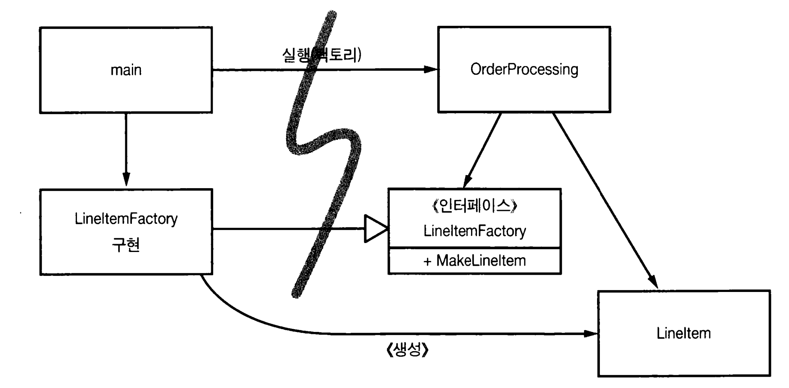

# 시스템

> 복잡성은 죽음이다. 개발자에게서 생기를 앗아가고 제품을 제작하고 테스트하기 어렵게 만든다.

# 시스템 제작(construction과 시스템 사용(use)을 분리하라.

소프트웨어 시스템은 애플리케이션 객체를 제작하고 의존성을 서로 연결하는 준비 과정과

준비 과정 이후에 이어지는 런타임 로직을 분리해야 한다.

( 마치 스프링 프레임워크 이야기 같지 않은가?)

## 관심사(concern)

시작 단계라는 관심사를 분리하지 않으면, 준비과정이 런타임 로직과 뒤섞여 복잡해진다.

ex) 런타임로직과 섞인 시작단계

```java
public Service getService() {
	if (service == null)
		service = new MyServiceImpl(...); // 모든 상황에 적합한 기본값일까?
return service;
}
```

* Lazy initialization, Lazy Evaliation 라는 기법

장점

* 실제로 사용하기 전까지 객체 생성하지 않아 불필요한 부하 없음 -> 애플리케이션 시작시간 빨라짐
* 어떤 경우에도 npe를 반환하지 않음

단점

* MyServiceImpl이 무거운 객체면 여러 전용 객체들을 생성시 넣어줘야 하는 불상사
* 일반 런타임 로직에 객체 생성 로직을 섞어놓은 탓에 모든 실행 경로도 테스트 해야함
* 즉 작게나마 SRP 위반 (생성, 실행)

## 팩토리

때로는 객체 생성시점을 애플리케이션 실행시점에 써야할 때 Abstract Factory 패턴을 사용하면 좋다.

그러면 LineItem을 생성하는 시점은 애플리케이션이 결정하지만 ,LineItem을 생성하는 코드는 애플리케이션이 모른다 



```java
// LineItem 클래스
class LineItem {
    // LineItem의 속성과 메서드를 정의
}

// LineItemFactory 인터페이스
interface LineItemFactory {
    LineItem makeLineItem();
}

// LineItemFactory의 구현체
class ConcreteLineItemFactory implements LineItemFactory {
    @Override
    public LineItem makeLineItem() {
        // 실제 LineItem 객체를 생성하는 로직
        return new LineItem();
    }
}

// OrderProcessing 클래스
class OrderProcessing {
    private LineItemFactory lineItemFactory;

    // OrderProcessing 생성자에서 Factory를 주입받음
    public OrderProcessing(LineItemFactory lineItemFactory) {
        this.lineItemFactory = lineItemFactory;
    }

    public void processOrder() {
        // 필요한 시점에 Factory를 통해 LineItem 생성
        LineItem item = lineItemFactory.makeLineItem();
        // 주문 처리 로직
    }
}

// 애플리케이션의 메인 클래스
public class MainApplication {
    public static void main(String[] args) {
        // Factory 인스턴스 생성
        LineItemFactory factory = new ConcreteLineItemFactory();

        // OrderProcessing 인스턴스 생성 시 Factory 주입
        OrderProcessing orderProcessing = new OrderProcessing(factory);

        // 주문 처리
        orderProcessing.processOrder();
    }
}
```

OrderProcessing 애플리케이션은 구체적 방법을 모르지만 생성 시점을 통제할 수 있다.


## 의존성 주입 (Dependency Intejction)

Ioc 기법을 의존성 관리에 적용한 메커니즘.

제어 역전에서는 한 객체가 맡은 보조 책임을 새로운 객체에게 전적으로 떠넘겨 SRP를 지키게 된다.

의존성성 관리에서 객체는 의존성 자체를 인스턴스로 만들진 않고, 다른 컨테이너 등과 같은 객체에게 생성 및 주입을 맡긴다. 


## 횡단 관심사.

AOP (Aspect-Orented Programming)

AOP는 횡단 관심사에 대해 모듈성을 확보하는 일반적인 방법론이다. 

* 전통적인 OOP는 횡단 관심사를 하나의 클래스나 메서드로 캡슐화하기 어렵다. 애플리케이션의 여러 다른 지점에 걸쳐 나타나기 때문이다. 

AOP의 핵심 개념은 다음과 같습니다:

- **Aspect**: 횡단 관심사를 캡슐화한 모듈. Aspect는 일반적으로 어드바이스(Advice)와 포인트컷(Pointcut)으로 구성
- **Advice**: 특정 조인 포인트(join point)에서 실행되어야 할 추가적인 동작(코드)을 정의한다 Advice 종류에는 'before', 'after', 'around' 
- **Pointcut**: 어드바이스가 적용되어야 하는 조인 포인트를 지정하는 표현식이다. 어떤 메서드나 클래스가 Aspect의 동작을 수행해야 하는지 정의할 수 있다..
- **Join Point**: Aspect가 적용될 수 있는 실행 지점을 의미하며 메서드 호출이나 예외 발생 같은 애플리케이션 실행의 특정 지점이다.
- **Weaving**: Aspect의 코드를 애플리케이션의 지정된 조인 포인트에 '짜넣는' 과정이다. 컴파일 타임, 로드 타임, 또는 런타임에 수행될 수 있다.

AOP는 적용 대상 코드에 영향을 미치지 않는 상태로 동작 방식을 변경한다.

### 자바 프록시

CGLIB, JdkProxy를 사용해 프록시를 만든다.  

* Jdk프록시 : JDK Dynamic Proxy는 자바의 리플렉션 API를 사용하여 프록시 객체를 동적으로 생성하며 인터페이스 기반으로 동작한다. 프록시된 객체는 하나 이상의 인터페이스를 구현해야 한다. 
  * 메모리 사용량이 비교적 적고, 생성 속도가 빠르다는 장점이 있지만, 인터페이스 기반이기 때문에 구체 클래스에 대한 프록시 생성이 불가능하다.
  * `java.lang.reflect.Proxy` 클래스와 `java.lang.reflect.InvocationHandler` 인터페이스를 사용하여 구현됩니다.
  * `InvocationHandler`는 모든 메서드 호출을 인터셉트하고 사용자 정의 동작을 수행할 수 있게 해준다. 
* CGLIB: CGLIB는 바이트코드 조작 라이브러리인 ASM을 기반으로 하여, 런타임에 실제 클래스의 서브클래스를 생성하여 프록시 객체를 만든다.
  * JDK Dynamic Proxy에 비해 메모리 사용량이 더 많고 생성 속도가 느릴 수 있지만, 더 강력하고 유연한 프록시 생성이 가능하다.
  * 인터페이스가 없는 빈(bean)에 대해 CGLIB를 사용하여 프록시를 생성한다.


AOP는 어디에 사용될까?

* 트랜잭션, 보안 ,캐시, 장애조치, 로깅 등 횡단 관심사


## 테스트 주도 시스템 아키텍처

초창기 EJB 아키텍처는 기술을 너무 많이 넣느라 관심사를 제대로 분리하지 못했다.

최선의 시스템 구조는 각기 POJO객체로 구현되는 모듈화된 관심사 영역 (도메인)으로 구성되며,

서로 다른 영역끼리 침범이나 영향을 최소한으로 미치기 위해 AOP 같은 도구를 활용해 토합한다. 이런 구조일수록 테스트 하기가 쉽다


## 시스템 도메인은 특화 언어가 필요하다.

DSL과 같은 언어로 도메인 참여자들이 읽기 쉽게 구성해야 한다.

* DSL(Domain-Specific Language)은 특정 문제 영역(domain)에 특화된 프로그래밍 언어

좋은 DSL은 도메인 개념과 구현한 코드 사이 의사소통 간극을 줄여준다. 

DSL의 장점:

- **도메인 전문성**: 특정 도메인에 대한 해결책을 제공하므로 도메인 전문가들이 직관적으로 사용할 수 있다.
- **생산성 향상**: 도메인 특화 언어는 해당 분야의 작업을 빠르고 효율적으로 수행할 수 있도록 설계되다.
- **유지보수 용이성**: 도메인의 문제를 해결하기 위해 설계되었기 때문에, 관련 코드는 이해하고 유지보수하기가 더 쉽다.

DSL의 단점:

- **범용성 부족**: 특정 도메인에만 초점을 맞추고 있기 때문에 다른 문제를 해결하는 데는 적합하지 않을 수 있다.
- **학습 곡선**: 새로운 DSL을 배우는 것은 사용자에게 추가적인 학습 부담을 줄 수 있다.
- **도구 지원 제한**: 일반적인 프로그래밍 언어에 비해 도구나 라이브러리가 제한적일 수 있다.


# 결론

시스템 역시 깨끗해야 하며, 아키텍처가 복잡하면 도메인 까지 영향을 미쳐 기민성을 떨어트린다.

기민성이 떨어지면 테스트하기도 어려워진다.

시스템을 설계하든 개별 모듈을 설계하든, 실제로 돌아가는 가장 단순한 수단 을 사용해야 한다는 사실을 명심하자.